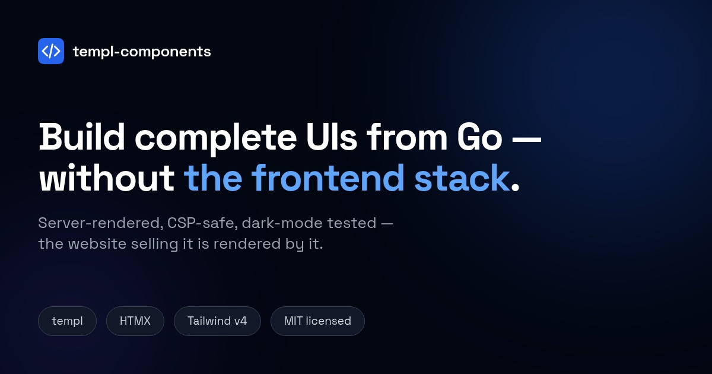

# templ-components

[](https://github.com/larsartmann/templ-components/actions)
[](https://pkg.go.dev/github.com/larsartmann/templ-components)
[](https://github.com/larsartmann/templ-components/blob/master/LICENSE)
[](https://github.com/larsartmann/templ-components/releases)
[](https://github.com/larsartmann/cqrs-htmx)

**Server-rendered Go components that ship real HTML — no JavaScript framework required. Built on [templ](https://templ.guide), [HTMX](https://htmx.org), and [Tailwind CSS v4](https://tailwindcss.com).**

[Documentation](https://templcomponents.lars.software) · [Live Demo](https://templcomponents.lars.software/demo) · [Why templ-components](#why-templ-components) · [Quick Start](#quick-start) · [Component Catalog](#component-catalog) · [How It Compares](#how-it-compares)

No DaisyUI. No Node.js. No framework lock-in.



## Quick Start

**1. Install**

```bash
go get github.com/larsartmann/templ-components
```

**2. Build a page**

```templ
package main

import (
    "github.com/larsartmann/templ-components/layout"
    "github.com/larsartmann/templ-components/display"
    "github.com/larsartmann/templ-components/icons"
)

templ Dashboard() {
    @layout.Base(layout.DefaultPageProps()) {
        @layout.ThemeScript("")
        @display.PageHeader(display.PageHeaderProps{Title: "Dashboard"})
        @display.Grid(display.GridProps{Cols: display.GridCols3}) {
            @display.StatCard(display.StatCardProps{
                Label: "Revenue", Value: "$42,189", Trend: display.TrendUp,
            })
            @display.StatCard(display.StatCardProps{
                Label: "Users", Value: "1,204", Icon: icons.Users,
            })
        }
    }
}
```

**3. Generate and run**

```bash
templ generate && go run .
```

A complete, dark-mode-aware page from one Go binary — thread your CSP nonce through `BaseProps` and every script ships compliant (the [live demo](https://templcomponents.lars.software/demo) is built entirely this way).

**Full guide:** [Installation](https://templcomponents.lars.software/getting-started/installation/) · [Quick Start](https://templcomponents.lars.software/getting-started/quick-start/)

---

## Installation

```bash
go get github.com/larsartmann/templ-components@latest
```

Import a package and render — the generated `*_templ.go` files ship inside the
module, so a plain `go get` builds without the templ CLI. Runtime requirements
and toolchain notes live under [Requirements](#requirements); the templ CLI and
Tailwind CSS 4.x toolchain are needed when you develop your own templates. Full
setup: [Installation guide](https://templcomponents.lars.software/getting-started/installation/).

---

## Why templ-components?

UI in a Go binary — without adopting a frontend stack.

- **HTML over the wire.** Components render complete, accessible HTML on the server; [HTMX](https://htmx.org) (or opt-in [Datastar](https://data-star.dev)) enhances it. No hydration, no virtual DOM, no bundler.
- **Invalid states don't compile.** Every closed set — variant, size, tone, method — is a typed enum. Pass a wrong value and the build fails before a browser opens.
- **Security and polish are defaults, not TODOs.** CSP-nonce threading on every script, dark mode and `prefers-reduced-motion` support on every component, logical RTL properties throughout — each enforced by a regression test, not a code-review memo.
- **Pay for what you use.** Pure Go + templ + Tailwind CSS v4 in seven small modules; import one package or all of them.

133 server-rendered components · 68 typed string enums (67 with IsValid()) · 102 SVG icons — in one `go get`.

The long-form pitch, with screenshots: [Why templ-components](https://templcomponents.lars.software/sales).

---

## By the Numbers

| Metric         | Value                                               |
| -------------- | --------------------------------------------------- |
| Components     | 124                                                 |
| SVG icons      | 102                                                 |
| Typed enums    | 68 (67 with IsValid)                                |
| Packages       | 18 (across 7 Go modules)                            |
| Tests          | ~1,600 test functions + ~1,700 subtests             |
| Visual goldens | 202 pixel-level regression tests (chromedp)         |
| Dependencies   | 3 (`templ`, `tailwind-merge-go`, `go-error-family`) |

Packages = the importable Go packages across the published modules
(`internal/`, `cmd/`, and `examples/` tooling excluded). Tests = `func
Test/Fuzz/Benchmark` declarations in those packages, rounded to the nearest
hundred; both rows are computed live by `utils.TestDocsCountDrift`.

---

## How It Compares

| Feature               | templ-components                               | [shadcn-templ](https://github.com/axadrn/shadcn-templ) (fka templUI) | [goshipit](https://github.com/haatos/goshipit) |
| --------------------- | ---------------------------------------------- | -------------------------------------------------------------------- | ---------------------------------------------- |
| **CSS approach**      | Tailwind v4 (CSS-first)                        | Tailwind v4 + CSS vars, 8 style themes                               | Tailwind v4 + DaisyUI                          |
| **JavaScript**        | HATEOAS (enhances HTML)                        | Vanilla JS (Base UI behavior ports, bundled runtime)                 | HTMX-driven                                    |
| **Requires Node.js**  | No                                             | No                                                                   | Yes (CSS build only)                           |
| **Components**        | 124                                            | ~64 + 27 installable blocks                                          | 52                                             |
| **Typed props**       | 64 enums                                       | —                                                                    | —                                              |
| **Dark mode**         | Built-in (tested)                              | CSS custom properties                                                | Via DaisyUI                                    |
| **CSP compliant**     | Yes (nonce on all scripts)                     | Yes (nonce on runtime bundle)                                        | —                                              |
| **Container queries** | 8 opt-in components + fluid typography (`cqi`) | —                                                                    | —                                              |
| **Visual regression** | chromedp pixel tests                           | Playwright parity suite vs shadcn/ui                                 | —                                              |
| **HTMX integration**  | Built-in package                               | Compatible (htmx fixture-tested)                                     | Native (core design)                           |
| **Datastar support**  | Opt-in package                                 | —                                                                    | —                                              |
| **Distribution**      | Go module (semver upgrades)                    | Copy-paste registry (you own the code)                               | Copy CLI (`gsi`)                               |

**Head-to-head:** the full comparison — architecture, testing depth, what each
class of project is best at — lives in
[`docs/comparison.md`](docs/comparison.md) (external facts verified 2026-10-08).

---

## Component Catalog

### `display` — Data Display (49 components)

Cards, tables (Table + DataTable), tabs, modals, badges, buttons, avatars, tooltips, accordions, dropdowns, stat cards, page headers, definition lists, responsive grid, carousel, sparklines, bar charts, external links, collapsible sections, copyable code blocks, heatmaps, **native SVG charts** (LineChart, AreaChart, PieChart/Donut), **dual-transport kanban boards** (drag-and-drop + keyboard moves, optimistic moves with a pending register + failure revert), eyebrows, terminal-style log scrollbacks, and more.

```templ
@display.Card(display.CardProps{Title: "Users", Subtitle: "Manage users"}) {
    <p>Card content</p>
}

@display.Card(display.CardProps{
    Title:       "Users",
    TitleClass:  "text-indigo-600",
    HeaderClass: "bg-gray-50 dark:bg-gray-900/50",
}) {
    <p>Override title and header classes without replacing the whole header.</p>
}

@display.StatCard(display.StatCardProps{Label: "Users", Value: "1,204", Icon: icons.Users, Change: "12%", Trend: display.TrendUp})

@display.Grid(display.GridProps{Cols: display.GridCols3, Gap: display.GridGapLG}) {
    for _, u := range users {
        @display.Card(display.CardProps{Title: u.Name}) { <p>{ u.Email }</p> }
    }
}

@display.Table(display.TableProps{
    Headers: []string{"Name", "Email", "Role"},
    Rows: []display.TableRow{
        display.SimpleTableRow("Alice", "alice@example.com", "Admin"),
    },
    Striped: true,
})

@display.Modal(display.ModalProps{Title: "Confirm", Size: display.ModalSizeSM}) {
    <p>Are you sure?</p>
}

@display.Eyebrow(display.EyebrowProps{Text: "Deploy #142 · production"})

@display.Scrollback(display.ScrollbackProps{
    Stagger: true,
    Lines: []display.ScrollbackLine{
        {Timestamp: "12:47:03.184", Tag: "query", Text: "ads.example.com A", Tone: display.ScrollbackToneInfo},
        {Timestamp: "12:47:03.185", Tag: "action", Text: "NXDOMAIN", Tone: display.ScrollbackToneDanger},
    },
})

@display.KanbanBoard(display.KanbanBoardProps{
    Columns: []display.KanbanColumn{
        {ID: "todo", Title: "To do", Tone: display.KanbanToneBlue,
            Action: display.Button(display.ButtonProps{Text: "+ Add", Size: display.ButtonSizeSM,
                Wire: &wire.Action{Method: wire.MethodPost, URL: "/api/kanban/add/todo"}}),
            Cards: []display.KanbanCard{{ID: "c1", Title: "Write docs"}}},
        {ID: "done", Title: "Done"},
    },
    Wire: &wire.Action{URL: "/api/kanban/move"},
})
```

### `feedback` — User Feedback (14 components)

Alerts, toasts, spinners, progress bars, skeletons, step indicators, loading states.

```templ
@feedback.ToastContainer("")
@feedback.Toast(feedback.ToastProps{Message: "Saved!", Type: feedback.ToastSuccess})
@feedback.Alert(feedback.AlertProps{Title: "Warning", Type: feedback.AlertWarning})
@feedback.ProgressBar(feedback.ProgressBarProps{Current: 45, Total: 100})
@feedback.SkeletonCardGrid(feedback.SkeletonCardGridProps{Count: 6})
```

### `forms` — Form Controls (26 components)

Inputs, selects, textareas, checkboxes, radios, toggles, file inputs, date pickers, comboboxes, sliders, ratings, tags input, validation, debounced filter inputs.

Forms are **dual-transport**: `FormProps.Wire` submits the same form over
HTMX or Datastar (server-side validation round-trip included — see
[`docs/recipes/server-side-validation.md`](docs/recipes/server-side-validation.md)),
with debounced search (`FilterInput`) and multipart uploads
([`docs/recipes/file-upload.md`](docs/recipes/file-upload.md)) working under
both runtimes.

```templ
@forms.Input(forms.InputProps{Name: "email", Type: forms.InputEmail, Label: "Email"})
@forms.Select(forms.SelectProps{Name: "country", Label: "Country",
    Options: []forms.SelectOption{{Value: "de", Label: "Germany"}}})
@forms.Toggle(forms.ToggleProps{Name: "notifications", Label: "Enable notifications"})
@forms.Combobox(forms.ComboboxProps{Name: "country", Label: "Country",
    Options: []forms.ComboboxOption{{Value: "de", Label: "Germany"}}})
```

### `navigation` — Navigation (12 components)

Nav bars, breadcrumbs, pagination, mobile menus, sidebar, load-more.

### `layout` — Page Layout (11 components)

Page shells and layout primitives: `Base`/`Minimal` HTML documents, theme script/toggle, CSP-safe `Script`/`Stylesheet`, `AppShell`, `Container`, `Split`, `Stack`.

```templ
@navigation.SimpleNav(navigation.SimpleNavProps{BrandText: "MyApp", CurrentPath: "/"})
@navigation.Breadcrumbs(navigation.BreadcrumbsProps{Items: []navigation.BreadcrumbItem{
    {Text: "Home", Href: "/"}, {Text: "Users", Active: true},
}})
@navigation.Pagination(navigation.PaginationProps{CurrentPage: 2, TotalPages: 10})
@navigation.SidebarNav(navigation.SidebarNavProps{CurrentPath: "/users"})
```

### `icons` — SVG Icons (102 icons)

Typed icon constants, no icon library dependency.

```templ
@icons.Icon(icons.Home, "h-5 w-5 text-gray-500")
@icons.Icon(icons.Check, "h-6 w-6 text-green-500")
```

### `htmx` — HTMX Integration (9 components)

Loading indicators, error handling, CSRF protection, out-of-band swaps, View Transitions, polled regions.

```templ
@htmx.GlobalErrorHandling(htmx.DefaultErrorHandlingConfig())
@htmx.LoadingIndicator(feedback.Spinner(feedback.SpinnerMD, "text-blue-600"))
@htmx.ViewTransitions(htmx.ViewTransitionsProps{Global: true})
```

### `datastar` — Datastar Integration (6 components)

[Datastar](https://data-star.dev) runtime injection, SSE-powered live regions, polled regions, loading indicators and buttons, and SSE error handling. An opt-in complement to HTMX for real-time streaming apps — zero new Go dependencies.

```templ
@datastar.SDKScript(datastar.DefaultSDKScriptProps())

@datastar.LiveRegion(datastar.LiveRegionProps{URL: "/stream/metrics"}) {
    @display.StatCard(display.StatCardProps{Label: "Active Users", Value: "—"})
}

@datastar.Indicator(datastar.IndicatorProps{Signal: "fetching"})
```

See [`docs/recipes/datastar-integration.md`](docs/recipes/datastar-integration.md) for the HTMX-to-Datastar migration guide.

### `utils/wire` — One Action, Both Transports

A transport-agnostic wiring contract: describe a hypermedia exchange once as a typed `wire.Action`, render it as htmx or Datastar attributes, and serve both from one endpoint with `wire.Handler`.

```go
// Same Action shape, either dialect — one field switches the transport.
wire.Action{URL: "/api/items", Target: "#items"}                          // htmx (default)
wire.Action{Transport: wire.TransportDatastar, URL: "/api/items"}         // datastar

// Whole-form submission is symmetric too — forms.Form wires both dialects,
// fields serialize natively (htmx) or via contentType:'form' (Datastar).
forms.FormProps{Wire: &wire.Action{Transport: wire.TransportDatastar, Method: wire.MethodPost, URL: "/api/save"}}

// One endpoint serves both: Datastar callers get response-header targeting,
// htmx and plain callers pass through.
mux.Handle("/api/items", wire.Handler(wire.PatchTarget{Selector: "#items"}, fragmentHandler))
```

Components take it via `BaseProps.Attrs` (spread `Attributes()` anywhere) or a typed `Wire` field (`display.Button`, `navigation.LoadMore`, `forms.Form`). Zero-JS contract: attributes only, CSP-safe without a nonce. See [`docs/transport-wiring.md`](docs/transport-wiring.md).

### `charts/echarts` — ECharts Adapter (2 components, opt-in)

CSP-safe wrapper for Apache ECharts interactive charts (tooltips, zoom, 25+ chart types). Follows the same opt-in pattern as `datastar` — does NOT import go-echarts. Consumer builds charts with go-echarts and passes `RenderSnippet()` output.

```templ
@echarts.SDKScript(echarts.DefaultSDKScriptProps())
@echarts.EChart(echarts.EChartsProps{Element: snippet.Element, Script: snippet.Script, Nonce: nonce})
```

See [`docs/recipes/echarts-adapter.md`](docs/recipes/echarts-adapter.md) for the Tier 1 vs Tier 2 guide.

### `errorpage` — Error Pages (4 components)

Structured error pages with family-aware styling, HTTP handler integration, dedicated 404.

```templ
@errorpage.NotFound404(errorpage.DefaultNotFound404Props())

// Full diagnostic page — status code, code, title, message, why, fix,
// context, cause chain, and action render as one card.
@errorpage.ErrorPage(errorpage.ErrorPageProps{
	Family:     errorpage.FamilyTransient,
	StatusCode: 503,
	Code:       errorpage.CodeUnavailable,
	Title:      "Service temporarily unavailable",
	Message:    "We're performing maintenance or experiencing high traffic.",
	Fix:        "Wait a moment and refresh the page.",
	WayOut:     "Retry",
	WayOutHref: "/",
})

// One-call handler integration with go-error-family.
mux.Handle("/api/thing", errorpage.ErrorHandler(err, errorpage.ErrorHandlerConfig{}))
```

---

## Design Principles

**Type-safe.** 68 typed string enums (67 with IsValid()) make invalid states unrepresentable. Props structs embed `utils.BaseProps` for consistent ID, class, attributes, ARIA label, and CSP nonce propagation.

**Accessible.** ARIA attributes, roles, keyboard navigation, and screen-reader text across all interactive components. Native `<dialog>` for modals, `<details>` for accordions, `<search>` landmark for search inputs.

**CSP-ready.** All inline scripts use `nonce` attributes. No `eval()`, no inline event handlers. Integration test suite verifies compliance on every component.

**Dark mode.** Every component has proper `dark:` variants — enforced by `TestDarkModeCompliance` + `TestDarkModeSemanticColors` regression tests. `ThemeScript` prevents FOUC.

**Server-rendered.** Zero client-side JavaScript by default. Interactive features use minimal vanilla JS with nonce-based CSP.

**Pay for what you use.** Import only the packages you need. No monolithic bundle.

**Tested at two layers.** HTML golden-file snapshots (`utils/golden`) catch
structure/class drift; pixel-level visual regression tests (`visualtest/`, a
separate Go module so chromedp never pollutes your dependency graph) render each
component in headless Chromium and diff pixels — catching layout shifts,
dark-mode color regressions, and RTL mirroring that string tests cannot. The
visual harness covers rest/hover/focus **and** open states (Dropdown/Popover/
ContextMenu via native Popover API). Run with `nix run .#visual`. See
[`docs/visual-testing.md`](docs/visual-testing.md).

---

## Tailwind CSS Setup

Tailwind v4 uses CSS-first configuration. Vendor the dependency so Tailwind can scan the `.templ` source files:

```bash
go mod vendor
```

Then in your CSS:

```css
@import "tailwindcss";
@source "../vendor/github.com/larsartmann/templ-components";
@custom-variant dark (&:where(.dark, .dark *));
```

```bash
tailwindcss -i app.css -o styles.css --minify
```

If your project uses [BuildFlow](https://github.com/larsartmann/buildflow), the `tailwind-build` provider handles this automatically.

## Theming

Components emit standard Tailwind classes (`bg-blue-600`, `text-gray-900`). Override colors without touching component code:

```css
@theme {
  --color-blue-600: #4f46e5;
  --color-blue-500: #6366f1;
}
```

For semantic tokens (`bg-tc-primary`, `text-tc-danger`), copy the included [`templ-components-theme.css`](templ-components-theme.css).

See the [Theming guide](https://templcomponents.lars.software/guides/theming/) for details.

---

## Testing

The library is verified by a three-tier strategy that catches different classes
of regression:

| Tier                     | What                                                                 | Where                                | Catches                                                                                                                                         |
| ------------------------ | -------------------------------------------------------------------- | ------------------------------------ | ----------------------------------------------------------------------------------------------------------------------------------------------- |
| **HTML golden**          | Snapshot the rendered HTML (CSS classes sorted, auto-IDs normalized) | `utils/golden` — 314 `.golden` files | Structure, attribute, and class changes                                                                                                         |
| **Drift-guard scanners** | Cross-cutting invariant tests                                        | `utils/`                             | Dark-mode gaps, missing `motion-reduce:`, physical RTL props, CSP nonce regressions, lint-config drift, stale CSS, ordered-substring flake risk |
| **Visual regression**    | Pixel-level PNG diff in headless Chromium                            | `visualtest/` (separate module)      | Layout shifts, dark-mode color regressions, RTL mirroring                                                                                       |

```bash
nix run .#verify   # generate + build + test + lint — the "done" check
nix run .#visual   # pixel-level visual regression (needs Chromium; skips if absent)
```

See [docs/testing-guide.md](docs/testing-guide.md) for the full strategy, how to
update goldens, and how to add coverage for a new component.

---

## Requirements

- **Go** 1.27+ (no build flags)
- **templ** CLI ([install](https://templ.guide/quick-start/installation))
- **Tailwind CSS** 4.x+
- **HTMX** 2.x (optional, for `htmx` package)

> **Older toolchains:** this library uses `encoding/json/v2` (via `errorpage`).
> On the Go 1.27+ floor no flag is needed — json/v2 is stable there. Toolchains
> older than 1.27 must set `GOEXPERIMENT=jsonv2`, or the build fails with:
> `build constraints exclude all Go files in .../encoding/json/v2`

> **Contributing?** The repo ships a committed `.envrc` for
> [direnv](https://direnv.net/) that exports `GOEXPERIMENT=jsonv2` and
> `GOWORK=off` for every tool (go, gopls, IDE) — not just inside
> `nix develop`. Run `direnv allow` once after cloning. It is tracked (no
> secrets) and guarded by `TestEnvrcConsistency`. If you skip direnv, set those
> two env vars manually before building.

---

## Ecosystem

Pair [cqrs-htmx](https://github.com/larsartmann/cqrs-htmx) (HTTP → CQRS wiring,
auth, HTMX response building) and [go-cqrs-lite](https://github.com/larsartmann/go-cqrs-lite)
(event sourcing core) with this library for a complete server-rendered Go web
stack — all part of the **GOTH stack** (Go + Templ + HTMX):

| Project                                                           | What it does                                                            |
| ----------------------------------------------------------------- | ----------------------------------------------------------------------- |
| [cqrs-htmx](https://github.com/LarsArtmann/cqrs-htmx)             | Production CQRS+ES framework with WebAuthn, RBAC, multi-tenancy, SSE.   |
| [go-cqrs-lite](https://github.com/larsartmann/go-cqrs-lite)       | Minimal CQRS/ES building blocks.                                        |
| [go-error-family](https://github.com/larsartmann/go-error-family) | Structured error families. Used by templ-components' errorpage package. |

---

## Contributing

Contributions are welcome. After cloning, activate the tracked pre-commit
guards once:

```bash
scripts/setup-hooks.sh
```

See [CONTRIBUTING.md](CONTRIBUTING.md) for setup, conventions, and workflow.

---

## License

[MIT](https://github.com/larsartmann/templ-components/blob/master/LICENSE)
