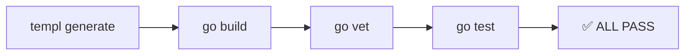
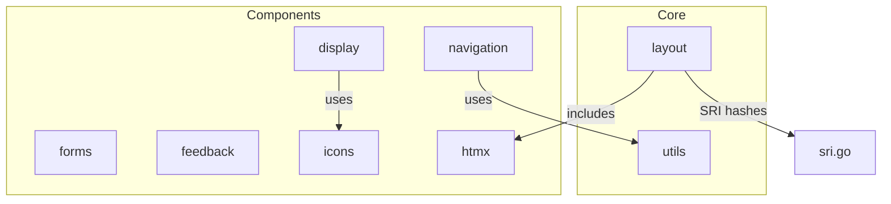

# templ-components — Execution Plan & Results

**Date:** 2026-04-27
**Status:** ALL 11 TASKS COMPLETED ✅

## Task Execution Results

### Phase 1: Critical Fixes (P0)

| #   | Task                   | Status | Files Changed          |
| --- | ---------------------- | ------ | ---------------------- |
| 1   | Fix XSS in tcShowToast | ✅     | `feedback/toast.templ` |
| 2   | Add Spinner icon case  | ✅     | `icons/icon.templ`     |

### Phase 2: High Priority (P1)

| #   | Task                            | Status | Files Changed                                                                                                                       |
| --- | ------------------------------- | ------ | ----------------------------------------------------------------------------------------------------------------------------------- |
| 3   | Reuse icons.Icon in empty_state | ✅     | `display/empty_state.templ`                                                                                                         |
| 4   | Add SRI hashes to CDN scripts   | ✅     | `layout/base.templ`, `layout/sri.go`                                                                                                |
| 5   | Add unit tests for Go helpers   | ✅     | `feedback/helpers_test.go`, `display/helpers_test.go`, `layout/sri_test.go`, `navigation/nav_link_test.go`, `forms/helpers_test.go` |

### Phase 3: Quality Improvements (P2)

| #   | Task                              | Status | Files Changed                           |
| --- | --------------------------------- | ------ | --------------------------------------- |
| 6   | Deduplicate NavLink class strings | ✅     | `navigation/nav_link.templ`             |
| 7   | Fix FieldError ID sanitization    | ✅     | `forms/helpers.go`, `forms/label.templ` |
| 8   | Modernize for loop to range 4     | ✅     | `feedback/loading.templ`                |
| 9   | Add MIT LICENSE file              | ✅     | `LICENSE`                               |

### Phase 4: Polish (P3)

| #   | Task                                  | Status | Files Changed                  |
| --- | ------------------------------------- | ------ | ------------------------------ |
| 10  | Scope mobile menu JS to parent nav    | ✅     | `navigation/mobile_menu.templ` |
| 11  | Extract toast styles to single source | ✅     | `feedback/toast.templ`         |

## Verification

- `templ generate` — 0 updates, clean
- `go build ./...` — compiles
- `go vet ./...` — clean
- `go test ./...` — 7 packages tested, 0 failures

## Architecture

