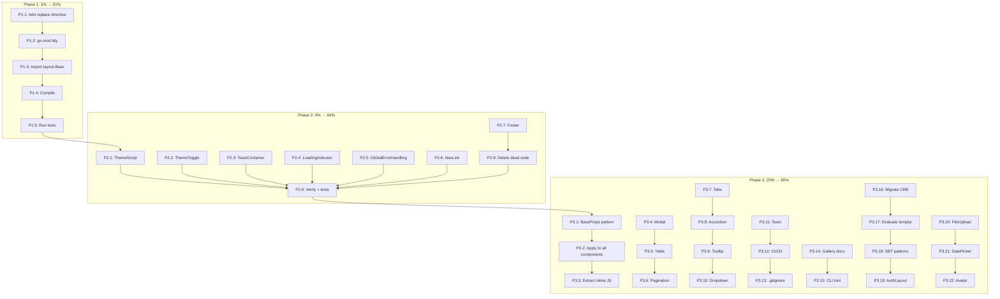

# Pareto Execution Plan — templ-components v1.0

**Date:** 2026-04-27 12:44  
**Strategy:** 1% → 51%, 4% → 64%, 20% → 80%. Execute in order.  
**Goal:** `go-website-template` uses `templ-components`. Library is production-ready.

---

## Phase 1: The 1% → 51% Impact (Proof of Life)

*If we die here, nothing else matters.*

| # | Task | Est. | Impact | Rationale |
|---|------|------|--------|-----------|
| P1.1 | Add `replace` directive to `go-website-template/go.mod` pointing to `templ-components` | 5min | CRITICAL | Module must resolve before any code can import it |
| P1.2 | Run `go mod tidy` in `go-website-template` and fix dependency issues | 10min | CRITICAL | Verify transitive deps resolve cleanly |
| P1.3 | Import `layout.Base` in `go-website-template/views/layouts/layout.templ` | 15min | CRITICAL | First real usage proves the library is consumable |
| P1.4 | Compile `go-website-template` with the dependency | 5min | CRITICAL | `go build ./...` must pass |
| P1.5 | Run `go-website-template` tests to verify no regressions | 5min | CRITICAL | Existing functionality must not break |

**Phase 1 Success Criteria:** `go-website-template` builds, tests pass, and at least one library component is used.

---

## Phase 2: The 4% → 64% Cumulative Impact (Full Integration)

*Replace every duplicated component in `go-website-template` with library equivalents.*

| # | Task | Est. | Impact | Rationale |
|---|------|------|--------|-----------|
| P2.1 | Replace `themeScript()` with `layout.ThemeScript()` | 15min | High | Dark mode init is identical |
| P2.2 | Replace `themeToggle()` with `layout.ThemeToggle()` | 15min | High | Toggle button is identical |
| P2.3 | Replace `toastContainer()` with `feedback.ToastContainer()` | 15min | High | Toast system is identical |
| P2.4 | Replace `htmxLoadingIndicator()` with `htmx.LoadingIndicator()` | 10min | High | Loading overlay is identical |
| P2.5 | Replace `htmxErrorScript()` with `htmx.GlobalErrorHandling()` | 10min | High | Error handling is identical |
| P2.6 | Replace `navLink()` with `navigation.NavLink()` | 15min | High | Nav link with active state is identical |
| P2.7 | Replace `footer()` with `navigation.Footer()` | 10min | High | Footer is identical |
| P2.8 | Delete redundant code from `layout.templ` and `layout_helpers.go` | 15min | High | Clean up dead code |
| P2.9 | Verify compilation and run full test suite | 10min | CRITICAL | Integration must not break |

**Phase 2 Success Criteria:** `go-website-template` has zero duplicated components; all UI primitives come from the library.

---

## Phase 3: The 20% → 80% Cumulative Impact (Library Hardening)

*Fix architectural issues, add missing components, add tests, CI/CD.*

| # | Task | Est. | Impact | Rationale |
|---|------|------|--------|-----------|
| P3.1 | Add `BaseProps` + `Class()` + `MergeAttrs()` to `utils` | 60min | Very High | Enables consistent class overriding and attr composition |
| P3.2 | Apply `BaseProps` pattern to all 60+ existing components | 90min | Very High | Every component gets ID, Class, Attrs override |
| P3.3 | Extract all inline JS to `templ-components.js` + `Script()` components | 90min | Very High | CSP compliance, cacheable JS, smaller HTML |
| P3.4 | Add `Modal` component | 45min | Very High | Used in every project, currently missing |
| P3.5 | Add `Table` component with sortable headers | 60min | Very High | `standard-bug-tracking-schema` has rich tables |
| P3.6 | Add `Pagination` component | 30min | High | Required for tables |
| P3.7 | Add `Tabs` component | 30min | High | Common UI pattern |
| P3.8 | Add `Accordion` / `Collapsible` component | 30min | Medium | Common pattern |
| P3.9 | Add `Tooltip` component | 30min | Medium | Hover explanations |
| P3.10 | Add `Dropdown` / `ActionMenu` component | 45min | High | Action menus |
| P3.11 | Add comprehensive tests for all Go helpers | 90min | Very High | Production readiness |
| P3.12 | Set up GitHub Actions CI/CD | 45min | High | Prevents regressions |
| P3.13 | Add `.gitignore` policy for `_templ.go` files | 10min | Medium | Clean git state |
| P3.14 | Create component gallery / Storybook-equivalent docs | 75min | Medium | Adoption |
| P3.15 | Add CLI tool scaffolding (`cmd/templ-components`) | 60min | Medium | Developer experience |
| P3.16 | Migrate `CreditReformBilanzampel` form helpers to library | 90min | High | Proves library works across projects |
| P3.17 | Evaluate `templui` adoption vs own library continuation | 60min | Very High | Strategic decision |
| P3.18 | Add project-specific patterns from `standard-bug-tracking-schema` | 90min | Medium | Command palette, chart wrappers, auth layouts |
| P3.19 | Add `AuthLayout` component (centered, glass morphism) | 45min | Medium | Used in auth flows |
| P3.20 | Add `FileUpload` / `Dropzone` component | 45min | Low | Not frequently used but nice to have |
| P3.21 | Add `DatePicker` / `Calendar` component | 60min | Low | Not frequently used |
| P3.22 | Add `Avatar` component | 15min | Low | User profile images |

---

## Pareto Analysis

| Tier | Tasks | Cumulative Effort | Cumulative Impact | Effort/Impact |
|------|-------|-------------------|-------------------|---------------|
| **1%** (P1.1–P1.5) | 5 | ~40min | **51%** | Make library consumable |
| **4%** (P2.1–P2.9) | 9 | ~115min | **64%** | Full integration in one project |
| **20%** (P3.1–P3.22) | 22 | ~19.5h | **80%** | Production-ready library |
| **Remaining 80%** | ~100+ | ~40h+ | **20%** | Docs, edge cases, polish |

---

## Execution Graph

---

## Sub-Task Breakdown (Phase 1 only — max 15min each)

### P1.1: Add replace directive (5min → 1 sub-task)
- P1.1a: Edit `go-website-template/go.mod` to add `replace github.com/larsartmann/templ-components => ../templ-components`

### P1.2: go mod tidy (10min → 2 sub-tasks)
- P1.2a: Run `go mod tidy` in `go-website-template`
- P1.2b: Fix any dependency resolution errors

### P1.3: Import layout.Base (15min → 3 sub-tasks)
- P1.3a: Add `import "github.com/larsartmann/templ-components/layout"` to `layout.templ`
- P1.3b: Replace HTML shell in `Base` with `layout.Base` call
- P1.3c: Map existing props to `layout.BaseProps`

### P1.4: Compile (5min → 1 sub-task)
- P1.4a: Run `go build ./...` in `go-website-template`

### P1.5: Run tests (5min → 1 sub-task)
- P1.5a: Run `go test ./...` in `go-website-template`

**Phase 1 total: 8 sub-tasks, ~40min**

---

## Sub-Task Breakdown (Phase 2 only — max 15min each)

### P2.1: Replace themeScript (15min → 1 sub-task)
- P2.1a: Replace `themeScript()` call with `layout.ThemeScript()`, delete old function

### P2.2: Replace themeToggle (15min → 1 sub-task)
- P2.2a: Replace `themeToggle(t)` with `layout.ThemeToggle(t.SwitchTheme)`, delete old function

### P2.3: Replace toastContainer (15min → 1 sub-task)
- P2.3a: Replace `toastContainer()` with `feedback.ToastContainer()`, delete old function

### P2.4: Replace htmxLoadingIndicator (10min → 1 sub-task)
- P2.4a: Replace `htmxLoadingIndicator()` with `htmx.LoadingIndicator()`, delete old function

### P2.5: Replace htmxErrorScript (10min → 1 sub-task)
- P2.5a: Replace `htmxErrorScript()` with `htmx.GlobalErrorHandling()`, delete old function

### P2.6: Replace navLink (15min → 1 sub-task)
- P2.6a: Replace `navLink(href, text)` with `navigation.NavLink(navigation.NavLinkProps{Href: href, Text: text}, ...)`, delete old function

### P2.7: Replace footer (10min → 1 sub-task)
- P2.7a: Replace `footer(t)` with `navigation.Footer(t.SiteName)`, delete old function

### P2.8: Delete dead code (15min → 1 sub-task)
- P2.8a: Remove all deleted functions from `layout.templ` and `layout_helpers.go`, verify no references remain

### P2.9: Verify + tests (10min → 2 sub-tasks)
- P2.9a: Run `go build ./...`
- P2.9b: Run `go test ./...`

**Phase 2 total: 11 sub-tasks, ~105min**

---

## Sub-Task Breakdown (Phase 3 highlights — max 15min each)

### P3.1: BaseProps pattern (60min → 4 sub-tasks)
- P3.1a: Create `utils.BaseProps` struct with ID, Class, Attrs, AriaLabel
- P3.1b: Create `utils.Class()` helper for Tailwind class merging
- P3.1c: Create `utils.MergeAttrs()` helper
- P3.1d: Add tests for helpers

### P3.2: Apply BaseProps to all components (90min → 6 sub-tasks)
- P3.2a: Apply to `layout` package (Base, ThemeToggle)
- P3.2b: Apply to `feedback` package (Toast, Alert, Spinner)
- P3.2c: Apply to `display` package (Badge, Card, EmptyState)
- P3.2d: Apply to `forms` package (Input, Select, Textarea, Checkbox)
- P3.2e: Apply to `navigation` package (Nav, NavLink, Breadcrumbs, Footer)
- P3.2f: Apply to `htmx` package (LoadingIndicator)

### P3.3: Extract inline JS (90min → 6 sub-tasks)
- P3.3a: Create `assets/templ-components.js` with Toast, Theme, MobileMenu, HTMX error functions
- P3.3b: Add `layout.Script()` component to include external JS
- P3.3c: Refactor `feedback/toast.templ` to use external JS
- P3.3d: Refactor `layout/theme.templ` to use external JS
- P3.3e: Refactor `navigation/mobile_menu.templ` to use external JS
- P3.3f: Refactor `htmx/error_handling.templ` to use external JS

### P3.4: Modal component (45min → 3 sub-tasks)
- P3.4a: Create `display/modal.templ` with ModalProps
- P3.4b: Add open/close JS logic
- P3.4c: Add tests + verify compilation

### P3.5: Table component (60min → 4 sub-tasks)
- P3.5a: Create `display/table.templ` with TableProps, Column, Row
- P3.5b: Add sortable header support
- P3.5c: Add empty state handling
- P3.5d: Verify compilation

### P3.6: Pagination component (30min → 2 sub-tasks)
- P3.6a: Create `display/pagination.templ` with PaginationProps
- P3.6b: Add prev/next/page number rendering

### P3.11: Tests (90min → 6 sub-tasks)
- P3.11a: Tests for `utils` helpers
- P3.11b: Tests for `forms` helpers
- P3.11c: Tests for `display` helpers
- P3.11d: Tests for `feedback` helpers
- P3.11e: Snapshot tests for component rendering
- P3.11f: Run full test suite

### P3.12: CI/CD (45min → 3 sub-tasks)
- P3.12a: Create `.github/workflows/ci.yaml` with templ generate, go test, go vet, go build
- P3.12b: Verify workflow runs on push
- P3.12c: Add status badge to README

**Phase 3 total: ~60 sub-tasks, ~19.5h**

---

## Grand Totals

| Metric | Count |
|--------|-------|
| **Top-level tasks** | 36 (5 + 9 + 22) |
| **Sub-tasks (≤15min)** | ~79 (8 + 11 + 60) |
| **Total estimated time** | ~22h |
| **Phase 1 time** | ~40min |
| **Phase 2 time** | ~105min |
| **Phase 3 time** | ~19.5h |

---

*Plan complete. Ready for execution.*
