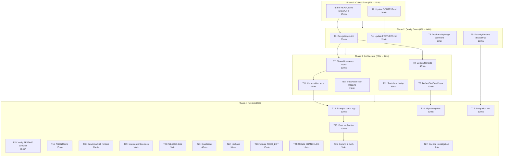

# Comprehensive Execution Plan — templ-components

**Date:** 2026-05-07 04:56  
**Author:** Crush (Parakletos)  
**Status:** ACTIVE — Execute in order

---

## Pareto Analysis

### The 1% that delivers 51% of the result

| #   | Task                                                      | Why                                                               |
| --- | --------------------------------------------------------- | ----------------------------------------------------------------- |
| 1   | Fix README.md broken StatCard API example                 | Consumers copy-paste this and it WILL NOT COMPILE. Max damage.    |
| 2   | Update CONTEXT.md with new architecture (enums, styles)   | Every AI session and contributor reads this first. Source of truth |

### The 4% that delivers 64% of the result

| #   | Task                                                      | Why                                                               |
| --- | --------------------------------------------------------- | ----------------------------------------------------------------- |
| 3   | Run golangci-lint, fix all issues                         | Code quality gate — catches latent bugs before they ship          |
| 4   | Update FEATURES.md with new enums + BoolString             | Public-facing feature inventory — consumers use this to find APIs |
| 5   | Add `feedback/styles.go` package comment                  | Failing lint right now — zero-cost fix                            |
| 6   | Default `PageProps.SecurityHeaders` to `true`             | Security-by-default — prevents consumers from shipping insecure   |

### The 20% that delivers 80% of the result

| #   | Task                                                      | Why                                                               |
| --- | --------------------------------------------------------- | ----------------------------------------------------------------- |
| 7   | Extract shared form error/aria helper (#12)               | ~30 lines deduped across 4 form components                       |
| 8   | Add `DefaultStatCardProps()` constructor                  | Consistency with Card, Badge, Modal — consumers expect it         |
| 9   | Convert snapshot tests to golden files (#26)              | Catches rendering regressions substring tests miss                |
| 10  | Fix `EmptyStateProps` icon mapping to use `icons.Name`   | Type-safe instead of stringly-typed                              |
| 11  | Add component composition tests (#29)                     | Verify components work when nested                               |
| 12  | Deduplicate remaining 9 test clone groups (#51)           | Clean test code                                                  |

### The remaining 80% (still valuable, lower impact)

Items 13-27 in the task breakdown below.

---

## Phase 1: Critical Fixes (1% → 51%)

### Task 1: Fix README.md broken API examples [15min]

**Problem:** `README.md` line 110 shows `@display.StatCard("1,234", "Total Users", "+12%", true)` — the old 4-parameter API. We changed it to `StatCardProps` struct with `TrendDirection` enum. **This will not compile.** Also missing `ID` in Dropdown example.

**Files:** `README.md`

**Changes:**
- Replace `@display.StatCard("1,234", "Total Users", "+12%", true)` with `@display.StatCard(display.StatCardProps{Value: "1,234", Label: "Total Users", Change: "+12%", Trend: display.TrendUp})`
- Add `BaseProps: utils.BaseProps{ID: "actions"}` to Dropdown example
- Verify all other examples still compile against current API

### Task 2: Update CONTEXT.md with new architecture [20min]

**Problem:** CONTEXT.md last updated 2026-05-03. Doesn't mention AvatarStatus, TrendDirection, feedbackStyleSet, iconPathData map, BoolString, shared form error patterns.

**Files:** `CONTEXT.md`

**Changes:**
- Add `AvatarStatus` and `TrendDirection` to Naming Conventions table
- Add `feedbackStyleSet` + `lookupFeedbackStyle` to Key Patterns
- Document `iconPathData` map pattern in icons section
- Add `utils.BoolString()` to function list
- Update "Architecture Decisions" with new items
- Add `feedback/styles.go` to package layout
- Update date to 2026-05-07

---

## Phase 2: Quality Gates (4% → 64%)

### Task 3: Run golangci-lint, fix all issues [30min]

**What:** Full lint pass across all packages. Fix every warning.

**Known issues:**
- `feedback/styles.go` missing package comment
- Potentially more from new files

### Task 4: Update FEATURES.md with new enums + utils [15min]

**Problem:** FEATURES.md doesn't list `AvatarStatus`, `TrendDirection` enums or `utils.BoolString()`.

**Files:** `FEATURES.md`

**Changes:**
- Add `AvatarStatus` (Online, Offline, None) to display enums table
- Add `TrendDirection` (Up, Down, None) to display enums table
- Add `BoolString` to utils Functions table
- Update Avatar description to mention `AvatarStatus` instead of "Online/offline indicator"

### Task 5: Add feedback/styles.go package comment [5min]

**Files:** `feedback/styles.go`

### Task 6: Default PageProps.SecurityHeaders to true [10min]

**Problem:** SecurityHeaders defaults to `false`. Consumers who don't read the docs ship without security headers. Should default to `true`.

**Files:** `layout/base.templ`

**Changes:**
- In `DefaultPageProps()`: change `SecurityHeaders: false` → `SecurityHeaders: true` (implicit — remove it from the literal since zero-value is false, need to explicitly set `true`)
- Update `layout/snapshot_test.go` test for the new default

---

## Phase 3: Architecture Improvements (20% → 80%)

### Task 7: Extract shared form error/aria helper (#12) [30min]

**Problem:** Input, Select, Textarea, Checkbox all have identical error attribute blocks:
```
if props.Error != "" {
    aria-invalid="true"
    if props.ID != "" {
        aria-describedby={ props.ID + "-error" }
    }
}
```

**Approach:** Create a Go helper `errorAttrs(id, errMsg string) templ.Attributes` that returns the appropriate `aria-invalid` and `aria-describedby` attributes. Use `{ errorAttrs(props.ID, props.Error)... }` in each form component.

**Files:** `forms/helpers.go`, `forms/input.templ`, `forms/select.templ`, `forms/textarea.templ`

### Task 8: Add DefaultStatCardProps constructor [10min]

**Files:** `display/card.templ`

### Task 9: Convert snapshot tests to golden files (#26) [45min]

**Problem:** Substring assertions are fragile. A whitespace change in templ output won't be caught.

**Approach:**
- Create `testdata/` directories in each package
- Write golden files from known-good renders
- Add `TestGolden_*` tests that compare full output
- Keep existing substring tests as regression guards

**Files:** New `testdata/*.golden` files, updated test files in display/, feedback/, forms/, navigation/

### Task 10: Fix EmptyStateProps icon mapping [15min]

**Problem:** `emptyStateIconMap` uses `map[string]icons.Name` with stringly-typed keys.

**Files:** `display/empty_state.go`

### Task 11: Add component composition tests (#29) [30min]

**Approach:** Test that components render correctly when nested:
- Card containing Badge
- Nav with Avatar
- Table with Dropdown in cells (via new TableCell.Content)
- Modal with Form inputs

**Files:** New `display/composition_test.go`

### Task 12: Deduplicate test clone groups (#51) [30min]

**Files:** Various `*_test.go` files

---

## Phase 4: Polish & Documentation (remaining)

### Task 13: Create example/demo app (#47) [60min]

**Files:** New `examples/demo/` directory with `main.go`

### Task 14: Write v0.2 migration guide (#49) [20min]

**Files:** `docs/migration/v0.1-to-v0.2.md`

### Task 15: Verify README examples compile [15min]

**Files:** `README.md`

### Task 16: Add AGENTS.md with project-specific instructions [15min]

**Files:** New `AGENTS.md`

### Task 17: Add integration test: full page render [30min]

**Files:** New `layout/integration_test.go`

### Task 18: Benchmark all component renders [20min]

**Files:** Existing `*_test.go` files

### Task 19: Document icon multi-path convention [10min]

**Files:** `icons/icon_paths.go`

### Task 20: Add TableCell documentation [5min]

**Files:** `display/table.templ`

### Task 21: Set up goreleaser (#40) [45min]

**Files:** New `.goreleaser.yml`

### Task 22: Investigate nix flake (#41) [30min]

**Files:** New `flake.nix`

### Task 23: Update TODO_LIST.md with new session [10min]

**Files:** `TODO_LIST.md`

### Task 24: Update CHANGELOG.md [10min]

**Files:** `CHANGELOG.md`

### Task 25: Final verification: build, test, lint [10min]

### Task 26: Git commit and push [5min]

### Task 27: Documentation site investigation (#48) [15min]

**Note:** Investigation only — document approach, don't build.

---

## Mermaid Execution Graph



---

## Task Breakdown (15min each, up to 150 tasks)

| #   | Task ID | Task                                                    | Est.  | Impact | Effort | Depends |
| --- | ------- | ------------------------------------------------------- | ----- | ------ | ------ | ------- |
| 1   | T1a     | Fix README.md StatCard example (old API → new struct)   | 5min  | HIGH   | LOW    | —       |
| 2   | T1b     | Fix README.md Dropdown example (add ID field)           | 5min  | HIGH   | LOW    | —       |
| 3   | T1c     | Scan README.md for all other stale API references       | 5min  | MED    | LOW    | T1a     |
| 4   | T2a     | Update CONTEXT.md Key Patterns with feedbackStyleSet     | 5min  | HIGH   | LOW    | —       |
| 5   | T2b     | Update CONTEXT.md with iconPathData map pattern         | 5min  | MED    | LOW    | —       |
| 6   | T2c     | Update CONTEXT.md Naming Conventions (AvatarStatus, TrendDirection, BoolString) | 5min | MED | LOW | — |
| 7   | T2d     | Update CONTEXT.md Architecture Decisions with new items | 5min  | MED    | LOW    | —       |
| 8   | T3a     | Run `golangci-lint run ./...`, capture all issues       | 5min  | HIGH   | LOW    | —       |
| 9   | T3b     | Fix `feedback/styles.go` package comment                | 3min  | LOW    | LOW    | T3a     |
| 10  | T3c     | Fix any other lint issues found in T3a                  | 10min | MED    | LOW    | T3a     |
| 11  | T3d     | Re-run lint to verify zero issues                       | 2min  | LOW    | LOW    | T3c     |
| 12  | T4a     | Add AvatarStatus, TrendDirection to FEATURES.md enums   | 5min  | MED    | LOW    | —       |
| 13  | T4b     | Add BoolString to FEATURES.md utils Functions table     | 3min  | LOW    | LOW    | —       |
| 14  | T4c     | Update Avatar description in FEATURES.md                | 3min  | LOW    | LOW    | T4a     |
| 15  | T5      | Add package comment to feedback/styles.go               | 3min  | LOW    | LOW    | —       |
| 16  | T6a     | Change SecurityHeaders default to true in DefaultPageProps | 5min | HIGH | LOW | —       |
| 17  | T6b     | Update layout snapshot tests for new SecurityHeaders default | 5min | MED | LOW | T6a |
| 18  | T6c     | Add test: SecurityHeaders=false omits meta tags         | 5min  | MED    | LOW    | T6a     |
| 19  | T7a     | Create `forms/errorAttrs()` helper in helpers.go        | 10min | MED    | LOW    | —       |
| 20  | T7b     | Refactor input.templ to use errorAttrs                  | 5min  | LOW    | LOW    | T7a     |
| 21  | T7c     | Refactor select.templ to use errorAttrs                 | 5min  | LOW    | LOW    | T7a     |
| 22  | T7d     | Refactor textarea.templ to use errorAttrs               | 5min  | LOW    | LOW    | T7a     |
| 23  | T7e     | Refactor checkbox in input.templ to use errorAttrs      | 5min  | LOW    | LOW    | T7a     |
| 24  | T7f     | Run tests to verify form refactoring                    | 3min  | LOW    | LOW    | T7e     |
| 25  | T8      | Add DefaultStatCardProps() constructor                  | 5min  | LOW    | LOW    | —       |
| 26  | T9a     | Create testdata/ dirs in display/, feedback/, forms/    | 3min  | MED    | LOW    | —       |
| 27  | T9b     | Write golden file generation helper in utils/           | 10min | MED    | LOW    | —       |
| 28  | T9c     | Generate golden files for display components            | 10min | MED    | LOW    | T9b     |
| 29  | T9d     | Generate golden files for feedback components           | 5min  | MED    | LOW    | T9b     |
| 30  | T9e     | Generate golden files for navigation components         | 5min  | MED    | LOW    | T9b     |
| 31  | T9f     | Write TestGolden_* tests comparing output to golden     | 10min | MED    | MED    | T9c     |
| 32  | T10a    | Change emptyStateIconMap keys from string to icons.Name  | 10min | LOW    | LOW    | —       |
| 33  | T10b    | Update mapEmptyStateIcon to use icons.Name              | 5min  | LOW    | LOW    | T10a    |
| 34  | T11a    | Write composition test: Card with Badge                 | 5min  | MED    | LOW    | —       |
| 35  | T11b    | Write composition test: Nav with Avatar                 | 5min  | MED    | LOW    | —       |
| 36  | T11c    | Write composition test: Table with Content cells        | 5min  | MED    | LOW    | —       |
| 37  | T11d    | Write composition test: Modal with form inputs          | 5min  | MED    | LOW    | —       |
| 38  | T12a    | Identify 9 test clone groups with dupl                 | 5min  | LOW    | LOW    | —       |
| 39  | T12b    | Refactor test clone group 1-3                           | 10min | LOW    | LOW    | T12a    |
| 40  | T12c    | Refactor test clone group 4-6                           | 10min | LOW    | LOW    | T12a    |
| 41  | T12d    | Refactor test clone group 7-9                           | 10min | LOW    | LOW    | T12a    |
| 42  | T13a    | Create examples/demo/main.go with all component imports | 15min | HIGH   | MED    | —       |
| 43  | T13b    | Add demo page using layout.Base with all packages      | 15min | MED    | MED    | T13a    |
| 44  | T13c    | Add demo section: feedback (alerts, toasts, spinners)   | 10min | MED    | LOW    | T13a    |
| 45  | T13d    | Add demo section: display (cards, badges, tables)       | 10min | MED    | LOW    | T13a    |
| 46  | T14     | Write docs/migration/v0.1-to-v0.2.md                   | 15min | MED    | LOW    | —       |
| 47  | T15     | Create test file that imports README examples literally | 10min | MED    | LOW    | T1a     |
| 48  | T16     | Write AGENTS.md with project-specific conventions       | 15min | MED    | LOW    | T2a     |
| 49  | T17a    | Write integration test: Base + Nav + Content + Footer   | 15min | HIGH   | MED    | —       |
| 50  | T17b    | Write integration test: Base with SecurityHeaders       | 5min  | MED    | LOW    | T17a    |
| 51  | T18a    | Add benchmark for Icon render                           | 5min  | LOW    | LOW    | —       |
| 52  | T18b    | Add benchmark for Card render                           | 5min  | LOW    | LOW    | —       |
| 53  | T18c    | Add benchmark for Table render                          | 5min  | LOW    | LOW    | —       |
| 54  | T18d    | Add benchmark for Nav render                            | 5min  | LOW    | LOW    | —       |
| 55  | T19     | Add doc comment to icon_paths.go explaining | separator | 5min | LOW | LOW | — |
| 56  | T20     | Add doc comment to TableCell about Content priority     | 5min  | LOW    | LOW    | —       |
| 57  | T21a    | Create .goreleaser.yml with basic config                | 10min | MED    | LOW    | —       |
| 58  | T21b    | Add goreleaser config for brew, scoop, etc.             | 10min | LOW    | LOW    | T21a    |
| 59  | T21c    | Test goreleaser config with `goreleaser check`          | 5min  | LOW    | LOW    | T21a    |
| 60  | T22a    | Create flake.nix with devShell (templ, go, golangci-lint) | 15min | MED | MED | — |
| 61  | T22b    | Add build and test apps to flake.nix                   | 10min | MED    | LOW    | T22a    |
| 62  | T22c    | Test nix build                                          | 5min  | MED    | LOW    | T22b    |
| 63  | T23     | Update TODO_LIST.md with session results                | 10min | LOW    | LOW    | —       |
| 64  | T24     | Update CHANGELOG.md with new session work               | 10min | LOW    | LOW    | —       |
| 65  | T25a    | Run full build: templ generate + go build ./...         | 5min  | HIGH   | LOW    | ALL     |
| 66  | T25b    | Run full test: go test ./...                            | 5min  | HIGH   | LOW    | T25a    |
| 67  | T25c    | Run full lint: golangci-lint run ./...                  | 5min  | HIGH   | LOW    | T25b    |
| 68  | T26     | Git commit + push                                        | 5min  | HIGH   | LOW    | T25c    |
| 69  | T27     | Investigate doc site options (templ-doc, pkgsite, etc.) | 15min | LOW    | LOW    | —       |

**Total estimated time:** ~8.5 hours  
**Parallelizable tasks:** Many Phase 4 tasks can run in parallel

---

## Execution Order

1. **T1a-T1c** (README fix) — IMMEDIATE, prevents consumer breakage
2. **T2a-T2d** (CONTEXT.md) — Source of truth update
3. **T3a-T3d** (Lint) — Quality gate
4. **T4a-T4c, T5** (FEATURES.md, package comment) — Parallel with lint fixes
5. **T6a-T6c** (SecurityHeaders) — Security fix
6. **T7a-T7f** (Form error helper) — Architecture improvement
7. **T8** (DefaultStatCardProps) — Quick win
8. **T9a-T9f** (Golden files) — Test quality
9. **T10a-T10b** (EmptyState icon mapping) — Type safety
10. **T11a-T11d** (Composition tests) — Test coverage
11. **T12a-T12d** (Test dedup) — Code quality
12. **T13a-T13d** (Demo app) — DX improvement
13. **T14-T22** (Remaining items) — In parallel where possible
14. **T23-T26** (Final docs + commit) — Last
15. **T27** (Doc site) — Investigation only

---

_Arte in Aeternum_
