# Comprehensive Action Plan — templ-components v0.1.0-alpha Release

**Date:** 2026-05-17
**Author:** Senior Staff Engineering Partner
**Status:** READY FOR EXECUTION
**Total Tasks:** 85 (categorized, prioritized, estimated)
**Estimated Total:** ~14 hours

---

## Methodology

Sorted by the **1% → 51%** Pareto principle:

1. **The 1% that delivers 51%:** 4 critical bugs + pre-commit hook (Tier 1-2) — ~46 min
2. **The 4% that delivers 64%:** Architecture type-safety + badge consolidation + HTMX decoupling (Tier 3-5) — ~2.5 hrs
3. **The 20% that delivers 80%:** A11y gaps, JS unification, dead code cleanup, demo fix, tests (Tier 6-9) — ~8 hrs
4. **The remaining 80%:** Documentation, growth, long-term polish (Tier 10-12) — ~3 hrs

---

## Stale Items Found (Already Done, Listed as Open in Reports)

These items appear as "Not Started" in multiple status reports but are **already implemented**:

| # | Item | Evidence | Reports That Got It Wrong |
|---|---|---|---|
| — | Avatar `` alt text | `AvatarProps.Alt` field exists, rendered at `avatar.templ:86` | ALL 5 reports |
| — | `aria-required` on form inputs | `Input`, `Select`, `Textarea` all render `aria-required="true"` | ALL 5 reports |
| — | `<html lang>` in Base layout | `PageProps.Locale` (default `"en"`) → `<html lang={props.Locale}>` | ALL 5 reports |
| — | Table header `scope` attributes | `<th scope="col">` at `table.templ:75` | ALL 5 reports |
| — | `aria-live` on HTMX loading | `LoadingIndicator` has `role="status"` + `aria-live="polite"` | 4 of 5 reports |

---

## Execution Graph

```mermaid
graph TD
    subgraph "Phase 1: Critical Bugs (46 min)"
        T1["#1 Fix NavLinkProps.Attrs shadowing<br/>5 min — P0 BUG"]
        T2["#2 Fix Dropdown JS XSS<br/>8 min — P0 SECURITY"]
        T3["#3 Fix Accordion state coupling<br/>10 min — P1 BUG"]
        T4["#4 Validate required ID Modal/Dropdown<br/>10 min — P1"]
        T5["#5 Fix pre-commit hook<br/>5 min — BLOCKS ALL COMMITS"]
        T6["#6 Tag v0.1.0-alpha<br/>3 min — BLOCKS SEMVER"]
        T7["#7 Exclude examples from lint<br/>5 min"]
    end

    subgraph "Phase 2: Architecture Type-Safety (75 min)"
        T8["#8 Replace Tab.Active with ActiveTabID<br/>12 min"]
        T9["#9 Merge BadgeDefault into BadgeNeutral<br/>8 min"]
        T10["#10 Consolidate badge color maps<br/>10 min"]
        T11["#11 Fix ErrorAttrs dual reference<br/>10 min"]
        T12["#12 Extract tooltip position struct<br/>10 min"]
        T13["#13 Extract card shell CSS<br/>8 min"]
        T14["#14 HTMX CDN URL constant<br/>5 min"]
        T15["#15 Error handling magic numbers<br/>5 min"]
    end

    subgraph "Phase 3: JS Unification (55 min)"
        T16["#16 Accordion IIFE refactor<br/>10 min"]
        T17["#17 Modal IIFE refactor<br/>10 min"]
        T18["#18 Dropdown strconv.Quote<br/>8 min"]
        T19["#19 Extract shared dismiss JS<br/>10 min"]
        T20["#20 Single-source toast icon paths<br/>12 min"]
    end

    subgraph "Phase 4: A11y Gaps (26 min)"
        T21["#21 aria-live on error handling<br/>8 min"]
        T22["#22 Avatar status dot scaling<br/>8 min"]
        T23["#23 Document tcShowToast coupling<br/>10 min"]
    end

    subgraph "Phase 5: Dead Code Cleanup (40 min)"
        T24["#24 Remove IconAttrs dead code<br/>3 min"]
        T25["#25 Remove no-op DefaultXxxProps<br/>5 min"]
        T26["#26 Move test helpers to internal/testutil<br/>10 min"]
        T27["#27 Move ProgressBar a11y test<br/>5 min"]
        T28["#28 Fix TestIconCount hardcoded 45<br/>3 min"]
        T29["#29 Consolidate Exclamation aliases<br/>5 min"]
        T30["#30 Minimal positional → props struct<br/>10 min"]
    end

    subgraph "Phase 6: HTMX Decoupling (20 min)"
        T31["#31 Decouple htmx/loading from feedback<br/>10 min"]
        T32["#32 FillIcon integration decision<br/>10 min"]
    end

    subgraph "Phase 7: Demo App (50 min)"
        T33["#33 Delete broken demo<br/>2 min"]
        T34["#34 Create new demo with layout.Base<br/>10 min"]
        T35["#35 Add display components to demo<br/>12 min"]
        T36["#36 Add feedback components to demo<br/>10 min"]
        T37["#37 Add forms + nav to demo<br/>10 min"]
        T38["#38 Add HTMX + layout to demo<br/>8 min"]
    end

    subgraph "Phase 8: Test Coverage (150 min)"
        T39["#39 BDD: Nav component<br/>12 min"]
        T40["#40 BDD: Pagination<br/>12 min"]
        T41["#41 BDD: Breadcrumbs<br/>12 min"]
        T42["#42 BDD: layout Base<br/>12 min"]
        T43["#43 BDD: layout Minimal/Theme<br/>12 min"]
        T44["#44 BDD: htmx loading<br/>12 min"]
        T45["#45 BDD: htmx error handling<br/>12 min"]
        T46["#46 BDD: icons package<br/>10 min"]
        T47["#47 Table mismatched headers test<br/>8 min"]
        T48["#48 Modal/Dropdown empty ID test<br/>8 min"]
        T49["#49 mapStatusToBadgeType boundary test<br/>8 min"]
        T50["#50 Forms coverage improvement<br/>12 min"]
        T51["#51 Utils coverage improvement<br/>12 min"]
    end

    subgraph "Phase 9: Documentation & Growth (50 min)"
        T52["#52 Cross-link ecosystem in README<br/>8 min"]
        T53["#53 Pre-release badge in README<br/>5 min"]
        T54["#54 Document PageProps convention<br/>5 min"]
        T55["#55 Update CHANGELOG for alpha<br/>8 min"]
        T56["#56 Submit to awesome-templ<br/>10 min"]
        T57["#57 Open PR on templ.guide<br/>10 min"]
        T58["#58 Filled vs stroke icon ADR<br/>5 min"]
    end

    subgraph "Phase 10: Long-Term Polish (50 min)"
        T59["#59 ExampleXxx batch 1: display<br/>12 min"]
        T60["#60 ExampleXxx batch 2: feedback+forms<br/>12 min"]
        T61["#61 Release automation goreleaser<br/>12 min"]
        T62["#62 stroke-width option for icons<br/>10 min"]
    end

    T1 --> T5
    T5 --> T6
    T4 --> T6
    T2 --> T18
    T3 --> T16
    T1 --> T8
    T10 --> T9
    T16 --> T19
    T17 --> T19
    T19 --> T20
    T33 --> T34
    T34 --> T35
    T35 --> T36
    T36 --> T37
    T37 --> T38
    T6 --> T52
    T52 --> T55
    T55 --> T56
```



---

## Detailed Task Breakdown

### Phase 1: Critical Bugs & DevOps (46 min) — THE 1%

| # | Task | File(s) | Effort | Impact | Details |
|---|---|---|---|---|---|
| 1 | **Fix NavLinkProps.Attrs shadowing** | `navigation/nav_link.templ:18` | 5 min | P0 | Remove `Attrs templ.Attributes` from NavLinkProps. Let `BaseProps.Attrs` flow through. Currently `{ props.Attrs... }` on line 50/69 accesses the shadow field, which works, but any code setting `BaseProps.Attrs` gets silently dropped. **Split brain bug.** |
| 2 | **Fix Dropdown JS XSS** | `display/dropdown.templ:149` | 8 min | P0 | `})('{{ props.ID }}');` interpolates raw string into JS. If ID contains `'`, `"`, or `</script>`, injection is possible. Use `strconv.Quote()` like `modal_go.go:59`. Add Go helper function in dropdown. |
| 3 | **Fix Accordion state coupling** | `display/accordion.templ:62-64,85` | 10 min | P1 | **Two bugs:** (a) `max-h-96` CSS class used as JS state flag — fragile. (b) When `!item.Open`, panel gets `hidden` attribute but JS only toggles `max-h-*` classes, never removes `hidden`. Server-closed accordion can never be opened. Fix: use `data-open` attribute for state, remove `hidden` attribute toggling, use `max-h-0 overflow-hidden` for closed state. |
| 4 | **Validate required ID in Modal/Dropdown** | `display/modal.templ`, `display/dropdown.templ` | 10 min | P1 | Empty `ID` produces `aria-labelledby="-title"` and broken JS. Add validation: if `props.ID == ""`, panic with clear message. |
| 5 | **Fix pre-commit hook** | `.git/hooks/pre-commit` | 5 min | BLOCKS ALL | Replace buildflow with `scripts/pre-commit.sh`. `cp scripts/pre-commit.sh .git/hooks/pre-commit` |
| 6 | **Tag v0.1.0-alpha** | git | 3 min | BLOCKS SEMVER | `git tag v0.1.0-alpha`. Repo is public, no tag. Every `go get` is a floating commit. |
| 7 | **Exclude examples/ from lint** | `.golangci.yml` | 5 min | CI | Add `issues.exclude-dirs: ["examples"]`. 23 lint issues in demo block `golangci-lint run ./...`. |

### Phase 2: Architecture Type-Safety (75 min)

| # | Task | File(s) | Effort | Impact | Details |
|---|---|---|---|---|---|
| 8 | **Replace Tab.Active with ActiveTabID** | `display/tabs.templ` | 12 min | HIGH | `Tab.Active bool` allows zero or multiple active tabs. Impossible state is representable. Change: remove `Active bool` from `Tab`, add `ActiveTabID string` to `TabsProps`. Compute active state from comparison. |
| 9 | **Merge BadgeDefault into BadgeNeutral** | `display/badge.templ:9,91` | 8 min | MEDIUM | `BadgeDefault` is not in `badgeColorMap` — falls through to default which is identical to `BadgeNeutral`. Remove `BadgeDefault` constant, replace with `BadgeNeutral`. Breaking change — update CHANGELOG. |
| 10 | **Consolidate badge color maps** | `display/badge.templ:85-120` | 10 min | MEDIUM | Two maps `badgeColorMap` + `badgeDotColorMap` can drift. Create `badgeStyle{BG, Dot string}` struct, single `badgeStyleMap`. |
| 11 | **Fix ErrorAttrs dual reference** | `forms/helpers.go:20-31` | 10 min | A11Y | When both error AND help text exist, `aria-describedby` should reference both IDs. Currently only links error ID. Fix: add `helpTextID` parameter or check if help text exists. |
| 12 | **Extract tooltip position struct** | `display/tooltip.templ:29-53` | 10 min | DRY | Two switch statements on same `TooltipPosition` type. Create `tooltipPositionStyles` struct + single lookup map. |
| 13 | **Extract card shell CSS** | `display/card.templ:42,92,122` | 8 min | DRY | `bg-white dark:bg-slate-800 border border-gray-200 dark:border-slate-700 rounded-lg shadow-xs` repeated 3×. Extract `cardShellClass()` constant. |
| 14 | **HTMX CDN URL constant** | `layout/base.templ:80-84` | 5 min | DRY | `"https://unpkg.com/htmx.org@" + props.HTMXVersion` repeated 4×. Extract to `htmxCDNURL(version, ext string)` helper. |
| 15 | **Extract error handling magic numbers** | `htmx/error_handling.templ:13-15` | 5 min | READABILITY | `maxErrorHistory = 10`, `maxRetries = 2`, delay `1000 * retryCount` are magic. Extract to named JS constants at top of IIFE. |

### Phase 3: JS Unification (55 min)

| # | Task | File(s) | Effort | Impact | Details |
|---|---|---|---|---|---|
| 16 | **Accordion: global flag → IIFE-per-instance** | `display/accordion.templ:76-98` | 10 min | CONSISTENCY | Uses global `tcAccordionAttached` flag + event delegation. Refactor to IIFE-per-instance like Dropdown pattern. Must also fix `hidden` attribute bug (#3). |
| 17 | **Modal: global functions → IIFE-per-instance** | `display/modal.templ:48-92` | 10 min | CONSISTENCY | Registers `tcCloseModal(id)` and `tcOpenModal(id)` as global functions. Refactor to per-instance IIFE with `strconv.Quote` for ID safety. |
| 18 | **Dropdown: fix strconv.Quote** | `display/dropdown.templ` | 8 min | SECURITY | Already IIFE but with vulnerable string interpolation. Add Go helper like `modalCloseHandler` pattern using `strconv.Quote`. |
| 19 | **Extract shared dismiss JS (Alert+Toast)** | `feedback/alert.templ:100-111`, `feedback/toast.templ:166-176` | 10 min | DRY | Nearly identical `data-dismiss` event delegation. Extract to shared `tcDismissScript(nonce, dismissType, parentSelector)` function. |
| 20 | **Single-source toast icon SVG paths** | `feedback/toast.templ:82-86` | 12 min | DRY | JS `tcToastIcons` duplicates Go `iconPathData` map entries. Generate JS from Go: `toastJSIconPaths()` that reads from `icons.iconPathData`. |

### Phase 4: Accessibility Gaps (26 min)

| # | Task | File(s) | Effort | Impact | Details |
|---|---|---|---|---|---|
| 21 | **aria-live on HTMX error handling** | `htmx/error_handling.templ` | 8 min | A11Y | No `aria-live` anywhere. Dynamic errors invisible to screen readers. Add `aria-live="polite"` region or document that ToastContainer provides this. |
| 22 | **Avatar status dot scaling** | `display/avatar.templ:92` | 8 min | A11Y | Fixed `h-2.5 w-2.5` regardless of avatar size (XS=6px → XL=14px). Dot is ~42% of XS avatar. Scale: XS→1.5, SM→2, MD→2.5, LG→3, XL→3.5. |
| 23 | **Document tcShowToast coupling** | `htmx/error_handling.templ:40` | 10 min | DX | `GlobalErrorHandling` silently fails if `tcShowToast` not defined. Add doc comment warning + runtime `console.warn` if function missing. |

### Phase 5: Dead Code & Cleanup (40 min)

| # | Task | File(s) | Effort | Impact | Details |
|---|---|---|---|---|---|
| 24 | **Remove IconAttrs dead code** | `icons/icon_helpers.go` | 3 min | CLEAN | Exported but never called. `IconAttrs(ariaLabel string)` — the `Icon` component already sets `aria-hidden="true"` directly. Delete file. |
| 25 | **Remove no-op DefaultXxxProps** | 7 files | 5 min | CLEAN | `DefaultAccordionProps`, `DefaultTableProps`, `DefaultDropdownProps`, `DefaultEmptyStateProps`, `DefaultStatCardProps`, `DefaultNavProps`, `DefaultNavLinkProps` all return zero-value structs. Remove and update any references. |
| 26 | **Move test helpers to internal/testutil** | `utils/utils_test.go` helpers | 10 min | ARCH | `Render`, `AssertContains`, `AssertNotContains`, `AssertEqual` are exported from `utils` solely for tests. Move to `internal/testutil/`. |
| 27 | **Move ProgressBar a11y test** | `display/a11y_test.go` | 5 min | CORRECT | Tests `feedback.ProgressBar` from `display` package. Move to `feedback/`. |
| 28 | **Fix TestIconCount hardcoded 45** | `icons/icon_names_test.go:119` | 3 min | MAINT | `if len(allIconNames) != 45` hardcoded. Should use dynamic check against `iconPathData` map length, or at least use `len(iconPathData)`. |
| 29 | **Consolidate Exclamation aliases** | `icons/icon_names.go:48,52` | 5 min | CLARITY | `Exclamation` and `ExclamationCircle` have identical paths. Pick one, deprecate the other with a comment. |
| 30 | **Minimal positional → props struct** | `layout/base.templ:109` | 10 min | CONSISTENCY | `Minimal(title, locale string)` uses positional params while `Base` uses `PageProps`. Create `MinimalProps` struct for consistency. |

### Phase 6: HTMX Decoupling (20 min)

| # | Task | File(s) | Effort | Impact | Details |
|---|---|---|---|---|---|
| 31 | **Decouple htmx/loading from feedback** | `htmx/loading.templ:3` | 10 min | ARCH | Imports `feedback` directly for `Spinner`. Accept `templ.Component` parameter or use an interface. `htmx` should not depend on `feedback`. |
| 32 | **FillIcon integration decision** | `internal/svg/svg.templ`, `display/helpers.templ` | 10 min | ARCH | `FillIcon` is a parallel system (20×20 filled) only used by `display/helpers.templ` and `navigation/pagination.templ`. Either: (a) document both systems formally, or (b) merge into `icons` package with variant parameter. |

### Phase 7: Demo App (50 min)

| # | Task | File(s) | Effort | Impact | Details |
|---|---|---|---|---|---|
| 33 | **Delete broken demo** | `examples/demo/main.go` | 2 min | TRUST | Uses Tailwind v2 CDN, raw `w.Write`, discards `PageProps` with `_`. Worse than no demo. |
| 34 | **Create new demo with layout.Base** | `examples/demo/main.go` | 10 min | DOGFOOD | Fresh `main.go` using `layout.Base(props)` with proper Tailwind v4 setup. |
| 35 | **Add display components to demo** | `examples/demo/demo.templ` | 12 min | SHOWCASE | Card, Badge, Modal, Table, Tabs, Avatar, Tooltip, Accordion, Dropdown, EmptyState. |
| 36 | **Add feedback components to demo** | `examples/demo/demo.templ` | 10 min | SHOWCASE | Alert, Toast, Spinner, ProgressBar, Skeleton, StepIndicator. |
| 37 | **Add forms + navigation to demo** | `examples/demo/demo.templ` | 10 min | SHOWCASE | Input, Select, Textarea, Checkbox, Nav, Pagination, Breadcrumbs, Footer. |
| 38 | **Add HTMX + layout to demo** | `examples/demo/demo.templ` | 8 min | SHOWCASE | LoadingButton, GlobalErrorHandling, ThemeToggle, CSRFToken. |

### Phase 8: Test Coverage (150 min)

| # | Task | File(s) | Effort | Impact | Details |
|---|---|---|---|---|---|
| 39 | BDD: Nav component | `navigation/nav_test.go` | 12 min | COVERAGE | Test renders, active state, external links, sticky. |
| 40 | BDD: Pagination | `navigation/pagination_test.go` | 12 min | COVERAGE | Test page ranges, prev/next, mobile/desktop, query params. |
| 41 | BDD: Breadcrumbs | `navigation/breadcrumbs_test.go` | 12 min | COVERAGE | Test items, active last item, separators. |
| 42 | BDD: layout Base | `layout/base_test.go` | 12 min | COVERAGE | Test meta tags, OG, Twitter, security headers, skip link. |
| 43 | BDD: layout Minimal/Theme | `layout/minimal_test.go` | 12 min | COVERAGE | Test Minimal renders, ThemeToggle works, ThemeScript present. |
| 44 | BDD: htmx loading | `htmx/loading_test.go` | 12 min | COVERAGE | Test LoadingIndicator, InlineLoadingOverlay, LoadingButton. |
| 45 | BDD: htmx error handling | `htmx/error_handling_test.go` | 12 min | COVERAGE | Test script output, nonce propagation, error history. |
| 46 | BDD: icons package | `icons/icon_test.go` | 10 min | COVERAGE | Test all 45 icons render SVG, unknown icon fallback, Spinner animate. |
| 47 | Table mismatched headers/rows | `display/table_test.go` | 8 min | EDGE CASE | What happens when row cell count != header count? |
| 48 | Modal/Dropdown empty ID | `display/modal_test.go` | 8 min | EDGE CASE | Verify panic/error with empty ID after validation added. |
| 49 | mapStatusToBadgeType boundary | `display/badge_test.go` | 8 min | EDGE CASE | Test case sensitivity, whitespace, unknown values, empty string. |
| 50 | Forms coverage improvement | `forms/input_test.go` | 12 min | 63→75% | Test disabled, readonly, autofocus, hidden type, error + help simultaneous. |
| 51 | Utils coverage improvement | `utils/utils_test.go` | 12 min | 56→75% | Test MergeAttrs, CurrentYear, Deref, DerefOr, MapEnum edge cases. |

### Phase 9: Documentation & Growth (50 min)

| # | Task | File(s) | Effort | Impact | Details |
|---|---|---|---|---|---|
| 52 | Cross-link ecosystem in README | `README.md` | 8 min | DIFFERENTIATOR | Add "GOTH Stack Ecosystem" section: cqrs-htmx, go-cqrs-lite. This is the genuine differentiator vs templUI. |
| 53 | Pre-release badge in README | `README.md` | 5 min | SIGNALING | Add `[]()` badge. |
| 54 | Document PageProps convention | `CONTEXT.md` or `CONTRIBUTING.md` | 5 min | DX | Document why `PageProps` doesn't embed `BaseProps` — different purpose (page metadata vs component props). |
| 55 | Update CHANGELOG for alpha | `CHANGELOG.md` | 8 min | RELEASE | Add v0.1.0-alpha entry with all features, known issues, breaking changes list. |
| 56 | Submit to awesome-templ | GitHub PR | 10 min | DISCOVERABILITY | Open PR on `avelino/awesome-go` or `abhay/awesome-templ` with library description. |
| 57 | Open PR on templ.guide | GitHub PR | 10 min | DISCOVERABILITY | templUI is the only library listed. Submit templ-components for listing. |
| 58 | Filled vs stroke icon ADR | `docs/adr/` | 5 min | DOCUMENTATION | Record decision: stroke 24×24 for icons, filled 20×20 for `FillIcon` helpers. Document when to use which. |

### Phase 10: Long-Term Polish (50 min)

| # | Task | File(s) | Effort | Impact | Details |
|---|---|---|---|---|---|
| 59 | ExampleXxx batch 1: display | `display/example_test.go` | 12 min | PKG.GODEV | `ExampleBadge()`, `ExampleCard()`, `ExampleModal()`, `ExampleTabs()`, `ExampleAvatar()`. Shows up on pkg.go.dev. |
| 60 | ExampleXxx batch 2: feedback+forms | `feedback/example_test.go`, `forms/example_test.go` | 12 min | PKG.GODEV | `ExampleAlert()`, `ExampleToast()`, `ExampleInput()`, `ExampleSelect()`. |
| 61 | Release automation (goreleaser) | `.goreleaser.yml` | 12 min | PROFESSIONAL | Tag-based releases with goreleaser. Cross-compilation, checksums, changelog generation. |
| 62 | stroke-width option for icons | `icons/icon.templ` | 10 min | FLEXIBILITY | `Icon` always uses `stroke-width="1.5"`. Add `IconWithStroke(name, class string, strokeWidth float64)` or `IconOption` functional options. |

---

## Architectural Observations (From Deep Code Review)

### Split Brains Found

| Location | Issue | Severity |
|---|---|---|
| `NavLinkProps.Attrs` vs `BaseProps.Attrs` | Shadow field silently drops consumer attrs | P0 |
| Accordion `hidden` attr + `max-h-*` classes | Two independent state mechanisms — JS toggles classes but not `hidden` | P1 |
| Toast JS `tcToastIcons` vs Go `toastIconName()` | Same icons, two sources, can drift | P2 |
| `badgeColorMap` + `badgeDotColorMap` | Same keys, two maps, can drift | P2 |

### Booleans That Should Be Enums

| Location | Boolean | Should Be |
|---|---|---|
| `AccordionItem.Open bool` | Server-side initial state | Keep as bool — only 2 states (open/closed), set once |
| `ModalProps.Open bool` | Initial visibility | Keep as bool — only 2 states |
| `DropdownItem.External bool` | Link target behavior | Keep as bool — semantic, not a variant |
| `NavLinkProps.External bool` | Same pattern | Keep as bool |
| `BadgeProps.Pill bool` | Shape variant | **Could be BadgeShape enum** but bool is clear enough |
| `AlertProps.Dismissible bool` | Feature toggle | Keep as bool — only 2 states |

**Verdict:** No additional enums needed. All existing bools represent true binary states. The real type-safety issue is `Tab.Active bool` (#8) which allows impossible multi-active states.

### Files Over 370 Lines (Generated)

All `_templ.go` files are generated — excluded from the 370-line rule by convention. Source `.templ` files are all under 200 lines. **Clean.**

### Import Graph Health

```
utils          ← all packages (clean)
internal/svg   ← display, feedback, icons (clean, internal)
icons          ← display, feedback (clean)
feedback       ← htmx (COUPLING ISSUE — #31)
```

The only problematic import is `htmx/loading.templ` importing `feedback.Spinner`. This should be decoupled.

---

## Recommended Execution Order

1. **Phase 1** (46 min) — Fix P0 bugs, unblock commits, tag alpha
2. **Phase 2** (75 min) — Type safety, consolidation
3. **Phase 5** (40 min) — Dead code cleanup (lighter, faster)
4. **Phase 3** (55 min) — JS unification
5. **Phase 4** (26 min) — A11y gaps
6. **Phase 6** (20 min) — HTMX decoupling
7. **Phase 7** (50 min) — Demo app
8. **Phase 9** (50 min) — Documentation & growth
9. **Phase 8** (150 min) — Test coverage (last, as code changes settle)
10. **Phase 10** (50 min) — Long-term polish

**Total: ~14 hours**

---

_This plan is a living document. Update as tasks are completed._
