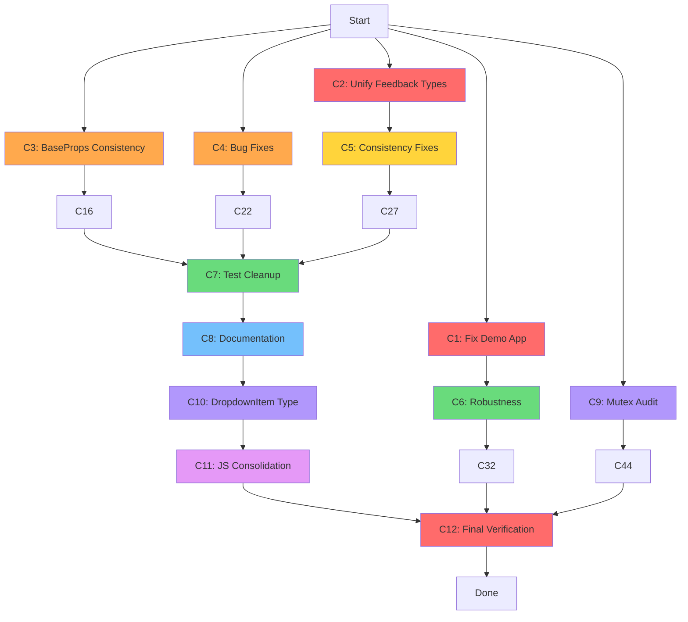

# Comprehensive Execution Plan — templ-components Session 10 Continued

**Date:** 2026-05-19 23:29 | **Scope:** All remaining TODO items from 9-skill audit

---

## Pareto Analysis

### 1% → 51% Impact (Foundational — DO FIRST)

These 3 tasks unlock the most value. They fix the public-facing image, eliminate type duplication, and make the API consistent:

| #   | Task                                                              | Why 51%                                                                                             |
| --- | ----------------------------------------------------------------- | --------------------------------------------------------------------------------------------------- |
| T1  | Fix demo app to use `layout.Base` + Tailwind v4                   | Only thing consumers see when they clone. Currently anti-advertisement.                             |
| T2  | Unify AlertType/ToastType + merge style maps                      | Eliminates the biggest type duplication in the codebase (2 identical enums + 2 near-identical maps) |
| T3  | Add BaseProps to StepIndicatorProps + LoadingOverlay props struct | API consistency — 2 components are the only outliers in their packages                              |

### 4% → 64% Impact (High Leverage — DO SECOND)

| #   | Task                                       | Why 64%                                           |
| --- | ------------------------------------------ | ------------------------------------------------- |
| T4  | Change FillIcon variadic bool → bool       | API quality, eliminates anti-pattern              |
| T5  | Fix ThemeToggle multi-instance bug         | Silent failure with 2+ toggles                    |
| T6  | Use stable IDs in modal JS                 | Fragile CSS selector breaks with DOM changes      |
| T7  | Use icon system in Breadcrumbs chevron     | Eliminates raw SVG duplication                    |
| T8  | Fix Tooltip aria-describedby linkage       | Accessibility compliance                          |
| T9  | Replace BoolString with strconv.FormatBool | Eliminates stdlib duplication                     |
| T10 | Add ComponentProps interface               | Enables generic handling for all 29 props structs |

### 20% → 80% Impact (Broad Value — DO THIRD)

| #   | Task                                                | Why 80%                                |
| --- | --------------------------------------------------- | -------------------------------------- |
| T11 | Make SimpleCard compose through Card                | Eliminates shell rendering duplication |
| T12 | Validate SwapOOB swapStyle                          | Prevents silent HTMX failures          |
| T13 | Validate SelectOption Disabled+Selected             | Impossible state prevention            |
| T14 | Use net/url for pagination URLs                     | Correct URL construction               |
| T15 | Replace splitSpace/splitClasses with strings.Fields | Cross-package dedup                    |
| T16 | Move BenchmarkHotPaths out of a11y_test.go          | Test file organization                 |
| T17 | Remove duplicate test data in navigation/           | Test dedup                             |
| T18 | Update CONTRIBUTING.md + docs                       | Stale references                       |
| T19 | Document htmx→feedback JS coupling                  | Consumer documentation                 |
| T20 | Validate \| separator in SVG paths                  | Icon system robustness                 |
| T21 | Document fill vs stroke convention                  | Icon system documentation              |

### Remaining (Polish — DO LAST)

| #   | Task                                                                         |
| --- | ---------------------------------------------------------------------------- |
| T22 | Audit tailwind-merge-go thread safety (requires reading external lib source) |
| T23 | Replace DropdownItem empty-Href with typed variant                           |
| T24 | Consolidate inline JS into shared init strategy                              |
| T25 | Fix HTMX swap event listener re-attachment                                   |
| T26 | Fix GlobalErrorHandling shared retry counter                                 |
| T27 | Consolidate modal per-instance JS into single function                       |

### Deferred (Post v1.0 — NOT IN SCOPE)

- Convert snapshot tests to golden files
- Move test helpers out of utils/
- Documentation site generation
- Add Radio, File input, Toggle/Switch components
- Client-side JS tab switching
- PageProps zero-value safety
- Consolidate test files (37→15)
- Make GlobalErrorHandling configurable
- uint for Pagination fields
- Eliminate icon list split brain (allIconNames auto-gen)

---

## Coarse Plan (7-27 tasks, 30-100min each)

| ID  | Task                                                                                 | Effort | Impact | Depends | Customer Value         |
| --- | ------------------------------------------------------------------------------------ | ------ | ------ | ------- | ---------------------- |
| C1  | Fix demo app: use layout.Base, Tailwind v4, HTMX                                     | 45min  | P0     | —       | HIGH: First impression |
| C2  | Unify AlertType/ToastType into shared type + merge style maps                        | 40min  | P1     | —       | HIGH: Type safety      |
| C3  | Add BaseProps to StepIndicatorProps + LoadingOverlay props                           | 30min  | P1     | —       | MED: API consistency   |
| C4  | Fix FillIcon variadic, ThemeToggle multi-instance, modal stable IDs, Tooltip aria    | 45min  | P1     | —       | MED: Bug fixes         |
| C5  | Breadcrumbs icon, BoolString→stdlib, ComponentProps interface                        | 35min  | P1     | C2      | MED: Consistency       |
| C6  | SimpleCard composition, SwapOOB validation, SelectOption validation, pagination URLs | 40min  | P2     | —       | MED: Robustness        |
| C7  | Test cleanup: splitClasses, BenchmarkHotPaths, test data dedup, SVG \| validation    | 30min  | P2     | —       | LOW: Maintenance       |
| C8  | Docs: CONTRIBUTING.md, htmx→feedback coupling, fill vs stroke convention             | 20min  | P2     | —       | LOW: Documentation     |
| C9  | Audit tailwind-merge-go thread safety + remove mutex if safe                         | 30min  | P2     | —       | MED: Performance       |
| C10 | DropdownItem typed variant                                                           | 45min  | P2     | C5      | MED: Type safety       |
| C11 | JS consolidation: shared init, HTMX re-attach, modal dedup, retry counter            | 90min  | P2     | C8      | HIGH: Architecture     |
| C12 | Final verification: full rebuild + lint + test + coverage + AGENTS.md update         | 30min  | P0     | all     | HIGH: Quality gate     |

**Total: 12 tasks, ~480min estimated**

---

## Fine Plan (50-125 tasks, max 15min each)

| ID  | Task                                                                            | Effort | Parent |
| --- | ------------------------------------------------------------------------------- | ------ | ------ |
| F1  | Read current demo/main.go                                                       | 2min   | C1     |
| F2  | Rewrite demo to use layout.Base with DefaultPageProps                           | 10min  | C1     |
| F3  | Add HTMX + StatCard + Alert + Icons demos                                       | 10min  | C1     |
| F4  | Test demo app builds                                                            | 3min   | C1     |
| F5  | Create FeedbackLevel type in feedback/styles.go (Success, Error, Warning, Info) | 5min   | C2     |
| F6  | Replace AlertType with FeedbackLevel in alert.templ                             | 5min   | C2     |
| F7  | Replace ToastType with FeedbackLevel in toast.templ                             | 5min   | C2     |
| F8  | Merge alertStyleMap and toastStyleMap into shared feedbackStyleMap              | 5min   | C2     |
| F9  | Update all references (tests, FEATURES.md)                                      | 5min   | C2     |
| F10 | Verify feedback package builds + tests pass                                     | 3min   | C2     |
| F11 | Add BaseProps to StepIndicatorProps struct                                      | 3min   | C3     |
| F12 | Update DefaultStepIndicatorProps                                                | 2min   | C3     |
| F13 | Update StepIndicator template to propagate BaseProps                            | 5min   | C3     |
| F14 | Create LoadingOverlayProps struct with BaseProps                                | 5min   | C3     |
| F15 | Update LoadingOverlay template + all callers                                    | 5min   | C3     |
| F16 | Verify feedback package builds + tests pass                                     | 3min   | C3     |
| F17 | Change FillIcon `rotate ...bool` to `rotate bool` in svg.templ                  | 3min   | C4     |
| F18 | Update all FillIcon call sites                                                  | 5min   | C4     |
| F19 | Fix ThemeToggle: remove global guard, use per-element attachment                | 10min  | C4     |
| F20 | Fix modal JS: use props.ID+"-panel" instead of CSS selector                     | 10min  | C4     |
| F21 | Fix Tooltip: add aria-describedby on trigger element                            | 10min  | C4     |
| F22 | Verify display + layout packages build + tests pass                             | 3min   | C4     |
| F23 | Replace Breadcrumbs hardcoded SVG with icons.ChevronRight                       | 5min   | C5     |
| F24 | Replace BoolString() body with strconv.FormatBool call                          | 3min   | C5     |
| F25 | Add ComponentProps interface to utils.BaseProps                                 | 5min   | C5     |
| F26 | Add GetBaseProps() to all 29 props structs                                      | 10min  | C5     |
| F27 | Verify utils + navigation build + tests pass                                    | 3min   | C5     |
| F28 | Refactor SimpleCard to call Card internally                                     | 10min  | C6     |
| F29 | Add swapStyle validation to SwapOOB                                             | 5min   | C6     |
| F30 | Add Disabled+Selected validation to SelectOption                                | 5min   | C6     |
| F31 | Refactor pageURL to use net/url                                                 | 10min  | C6     |
| F32 | Verify display + htmx + forms + navigation build + tests pass                   | 3min   | C6     |
| F33 | Replace splitClasses in icons/snapshot_test.go with strings.Fields              | 3min   | C7     |
| F34 | Replace splitSpace in utils/utils_test.go with strings.Fields                   | 3min   | C7     |
| F35 | Move BenchmarkHotPaths from display/a11y_test.go to display/benchmark_test.go   | 5min   | C7     |
| F36 | Extract shared testNavLinks in navigation/snapshot_test.go                      | 5min   | C7     |
| F37 | Add SVG path \| separator validation test                                       | 5min   | C7     |
| F38 | Verify all test packages pass                                                   | 3min   | C7     |
| F39 | Update CONTRIBUTING.md: remove dropdownSafeID reference                         | 3min   | C8     |
| F40 | Add htmx→feedback JS coupling doc comment to GlobalErrorHandling                | 3min   | C8     |
| F41 | Add fill vs stroke convention comment to internal/svg/svg.templ                 | 3min   | C8     |
| F42 | Audit tailwind-merge-go source for mutable state                                | 15min  | C9     |
| F43 | Remove mutex if safe, or add RWMutex if not                                     | 5min   | C9     |
| F44 | Verify utils package tests pass                                                 | 3min   | C9     |
| F45 | Design DropdownItemKind enum (LinkItem, ButtonItem)                             | 5min   | C10    |
| F46 | Refactor DropdownItem to use typed variant                                      | 10min  | C10    |
| F47 | Update dropdown template to match new types                                     | 10min  | C10    |
| F48 | Update all DropdownItem test usages                                             | 5min   | C10    |
| F49 | Verify display package builds + tests pass                                      | 3min   | C10    |
| F50 | Extract shared tc-init.js pattern                                               | 15min  | C11    |
| F51 | Refactor Accordion JS to use tc-init pattern                                    | 10min  | C11    |
| F52 | Refactor Dropdown JS to use tc-init pattern                                     | 10min  | C11    |
| F53 | Refactor Modal JS to use tc-init pattern                                        | 10min  | C11    |
| F54 | Refactor Toast+Alert dismiss JS to use tc-init pattern                          | 10min  | C11    |
| F55 | Fix ThemeToggle to use tc-init pattern                                          | 5min   | C11    |
| F56 | Fix MobileMenu to use tc-init pattern                                           | 5min   | C11    |
| F57 | Fix GlobalErrorHandling retry counter (per-request)                             | 10min  | C11    |
| F58 | Verify all packages build + all tests pass                                      | 5min   | C11    |
| F59 | Full rebuild: templ generate + go build + go test + lint                        | 10min  | C12    |
| F60 | Update AGENTS.md with all changes                                               | 5min   | C12    |
| F61 | Update FEATURES.md with all changes                                             | 5min   | C12    |
| F62 | Update TODO_LIST.md: mark completed items                                       | 5min   | C12    |
| F63 | Final git commit + push                                                         | 5min   | C12    |

**Total: 63 fine-grained tasks**

---

## Execution Graph

### Parallelization Strategy

- **Wave 1** (parallel): C1 + C2 + C3 + C4 + C9
- **Wave 2** (parallel): C5 + C6
- **Wave 3**: C7
- **Wave 4**: C8
- **Wave 5**: C10
- **Wave 6**: C11
- **Wave 7**: C12

---

## Risk Assessment

| Risk                                      | Mitigation                                 |
| ----------------------------------------- | ------------------------------------------ |
| SimpleCard refactor breaks rendering      | Test before/after HTML output matches      |
| FeedbackLevel rename is breaking change   | This is v0.x — breaking changes acceptable |
| JS consolidation breaks interactivity     | Test each component individually           |
| Mutex removal causes data race            | Only remove if confirmed thread-safe       |
| DropdownItem type change breaks consumers | v0.x — acceptable, update migration guide  |
