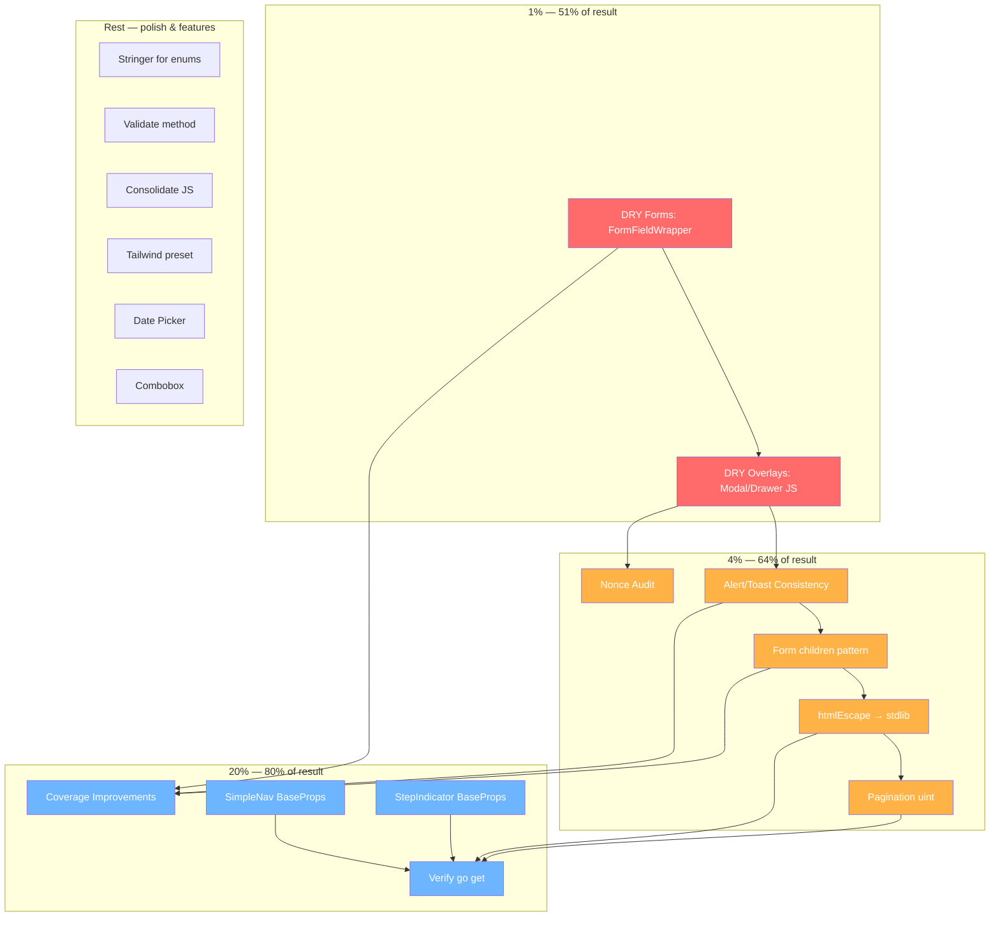

# SUPERB Execution Plan: templ-components Code Quality & v1.0 Readiness

**Created:** 2026-06-20 06:09
**Scope:** 30 open TODOs consolidated from TODO_LIST.md + deep code review
**Goal:** Eliminate all DRY violations, fix CSP compliance, improve type safety, achieve v1.0 API readiness

---

## Pareto Breakdown

### 1% that delivers 51% of the result

The two largest duplications + CSP violations. Fix these and the codebase jumps from "good" to "excellent":

| # | Task | Impact | Effort |
|---|------|--------|--------|
| 1 | **DRY forms** — Input/Select/Textarea/RadioGroup adopt FormFieldWrapper | Eliminates the biggest cross-component duplication (4 components repeating identical Label+FieldError+helpText pattern) | 45min |
| 2 | **DRY overlays** — Extract shared Modal/Drawer JS (focus trap, focusable selector, open/close, focus save/restore) + replace inline `onclick` with data-attribute event delegation | Eliminates ~100 lines of duplicated JS, fixes 4 CSP violations (inline onclick handlers) | 90min |

### 4% that delivers 64% of the result

Above plus visual consistency, API correctness, and stdlib usage:

| # | Task | Impact | Effort |
|---|------|--------|--------|
| 3 | **Alert/Toast consistency** — unify icons + dark-mode opacity for same FeedbackType | Same severity must look the same everywhere | 30min |
| 4 | **Form children pattern** — Content prop → `{ children... }` | Makes Form consistent with Card/Modal/Drawer/InputGroup/FormFieldWrapper | 30min |
| 5 | **htmlEscape → stdlib** — replace hand-rolled escaper with `html.EscapeString` | Delete 20 lines, use battle-tested stdlib | 15min |
| 6 | **Pagination uint** — CurrentPage/TotalPages → uint | Negative pages become unrepresentable (strong types) | 45min |
| 7 | **Nonce audit** — verify CSP nonce propagation on all 15 script blocks | Security correctness across the entire library | 45min |

### 20% that delivers 80% of the result

Above plus testing, DX improvements, and infrastructure:

| # | Task | Impact | Effort |
|---|------|--------|--------|
| 8 | **Coverage improvements** — fillIcon, Select, Textarea below 70% | Catches edge cases in form components | 60min |
| 9 | **SimpleNav BaseProps** — convert to props struct | Consistency with all 25 other components | 30min |
| 10 | **StepIndicator BaseProps** — add BaseProps embedding | Consistency, enables Class/Attrs/ID propagation | 30min |
| 11 | **go:generate stringer** for all enums | Eliminates manual string conversion, improves DX | 60min |
| 12 | **Validate() error method** on props structs | Compile-time validation instead of panic-at-render | 90min |
| 13 | **Verify go get** from clean project | Confirms library consumers can install cleanly | 30min |
| 14 | **Consolidate inline JS** — shared init strategy for 10+ script blocks | Reduces script duplication, improves CSP story | 90min |

### Remaining 80% (planned, lower priority)

| # | Task | Notes |
|---|------|-------|
| 15 | Date Picker component | New component, needs design decisions |
| 16 | Combobox/Autocomplete component | New component, needs design decisions |
| 17 | Modularize into Go workspace (go.work) | Large architectural change, high risk |
| 18 | Goreleaser setup | Needs tag/credential coordination |
| 19 | Documentation site (pkgsite/doc2go) | Needs tool decision |
| 20 | Extract Tailwind preset config | Shared theme configuration |
| 21 | Move test helpers to internal/testutil/ | Breaking for external consumers |
| 22 | a11y audit automation (axe-core/pa11y) | CI integration needed |
| 23 | Tag v0.3.0 | After code quality work merges |
| 24 | Submit to awesome-templ | External action |
| 25 | PR on templ.guide | External action |
| 26 | Cross-link ecosystem in README | Marketing |
| 27 | Plan v1.0 API freeze | Strategic planning |
| 28 | gopls QF1003 suppression | Tooling investigation |
| 29 | Convert snapshot tests to golden | Test infrastructure |
| 30 | goreleaser SRI verification | Release tooling |

---

## Comprehensive Plan (Medium Granularity)

22 tasks, 15-90min each. Sorted by impact/effort ratio (highest first).

| # | Task | Pareto | Impact | Effort | Files |
|---|------|--------|--------|--------|-------|
| 1 | DRY forms: FormFieldWrapper adoption | 1% | Critical | 45min | input.templ, select.templ, textarea.templ, radio.templ |
| 2 | Extract shared overlay JS (Modal/Drawer) | 1% | Critical | 90min | modal.templ, drawer.templ, shared.go |
| 3 | Fix Alert/Toast icon+opacity consistency | 4% | High | 30min | alert.templ, toast.templ, styles.go |
| 4 | Form: Content prop → children | 4% | High | 30min | form.templ, form_go.go |
| 5 | errorpage htmlEscape → stdlib | 4% | Medium | 15min | handler.go |
| 6 | Pagination uint type safety | 4% | High | 45min | pagination.templ, pagination_test.go |
| 7 | Nonce propagation audit | 4% | High | 45min | all .templ with `<script>` |
| 8 | Coverage: fillIcon, Select, Textarea | 20% | Medium | 60min | *_test.go |
| 9 | SimpleNav → SimpleNavProps struct | 20% | Medium | 30min | nav.templ |
| 10 | StepIndicator add BaseProps | 20% | Medium | 30min | step_indicator.templ |
| 11 | go:generate stringer for enums | 20% | Medium | 60min | all enum types |
| 12 | Validate() error on props structs | 20% | Medium | 90min | all props |
| 13 | Verify go get from clean project | 20% | High | 30min | — |
| 14 | Consolidate inline JS patterns | 20% | Medium | 90min | 10 script blocks |
| 15 | Extract Tailwind preset config | Rest | Low | 45min | new file |
| 16 | Date Picker component | Rest | Feature | 90min | new package |
| 17 | Combobox component | Rest | Feature | 90min | new package |
| 18 | Documentation site setup | Rest | Low | 60min | — |
| 19 | Goreleaser setup | Rest | Low | 45min | .goreleaser.yml |
| 20 | Plan v1.0 API freeze | Rest | Strategic | 30min | docs/ |
| 21 | gopls QF1003 investigation | Rest | Low | 30min | — |
| 22 | Move test helpers to internal/testutil | Rest | Breaking | 45min | utils/, internal/ |

---

## Detailed Breakdown (Fine Granularity)

Each task broken into ≤15min sub-tasks. Sorted by execution priority.

### Task 1: DRY forms (FormFieldWrapper)

| Sub# | Sub-task | Time |
|------|----------|------|
| 1.1 | Read current FormFieldWrapper signature and Input/Select/Textarea patterns | 5min |
| 1.2 | Refactor Input to use FormFieldWrapper (move Label+FieldError+helpText inside wrapper) | 10min |
| 1.3 | Refactor Select to use FormFieldWrapper | 10min |
| 1.4 | Refactor Textarea to use FormFieldWrapper | 10min |
| 1.5 | Refactor RadioGroup to use FormFieldWrapper (fieldset variant) | 10min |
| 1.6 | Run templ generate + tests + fix golden files | 10min |

### Task 2: Shared overlay JS

| Sub# | Sub-task | Time |
|------|----------|------|
| 2.1 | Design shared overlayScript generator function signature | 10min |
| 2.2 | Extract focusable selector to shared constant | 5min |
| 2.3 | Create overlayFocusTrap shared JS generator in shared.go | 15min |
| 2.4 | Refactor Modal to use shared overlay functions | 15min |
| 2.5 | Refactor Drawer to use shared overlay functions | 15min |
| 2.6 | Replace inline onclick with data-close attribute + event delegation | 15min |
| 2.7 | Run templ generate + tests + fix assertions | 15min |

### Task 3: Alert/Toast consistency

| Sub# | Sub-task | Time |
|------|----------|------|
| 3.1 | Unify icon maps: shared feedbackIconLookup for both Alert and Toast | 10min |
| 3.2 | Unify dark-mode opacity: both use /20 (alert's value) or /30 (toast's value) | 10min |
| 3.3 | Run tests + fix assertions | 10min |

### Task 4: Form children

| Sub# | Sub-task | Time |
|------|----------|------|
| 4.1 | Change Form to use { children... } instead of Content prop | 10min |
| 4.2 | Update FormProps to remove Content field | 5min |
| 4.3 | Update tests + examples | 10min |

### Task 5: htmlEscape → stdlib

| Sub# | Sub-task | Time |
|------|----------|------|
| 5.1 | Replace htmlEscape with html.EscapeString in handler.go | 10min |
| 5.2 | Remove htmlEscape function, add html import | 5min |

### Task 6: Pagination uint

| Sub# | Sub-task | Time |
|------|----------|------|
| 6.1 | Change CurrentPage/TotalPages to uint in PaginationProps | 10min |
| 6.2 | Update normalize(), pageURL(), paginationRange() for uint | 15min |
| 6.3 | Update template rendering (remove < 1 checks, cast for fmt) | 10min |
| 6.4 | Update all tests for uint types | 10min |

### Task 7: Nonce audit

| Sub# | Sub-task | Time |
|------|----------|------|
| 7.1 | Grep all `<script` in .templ files, verify each has nonce | 10min |
| 7.2 | Fix any missing nonce propagation | 15min |
| 7.3 | Add test asserting nonce appears in all script tags | 15min |

### Task 8: Coverage improvements

| Sub# | Sub-task | Time |
|------|----------|------|
| 8.1 | Identify uncovered branches via go test -coverprofile | 10min |
| 8.2 | Add tests for fillIcon edge cases | 15min |
| 8.3 | Add tests for Select normalize edge cases | 15min |
| 8.4 | Add tests for Textarea edge cases (empty rows, etc) | 15min |

### Tasks 9-10: SimpleNav + StepIndicator BaseProps

| Sub# | Sub-task | Time |
|------|----------|------|
| 9.1 | Create SimpleNavProps struct, convert SimpleNav | 15min |
| 10.1 | Add BaseProps to StepIndicatorProps | 10min |
| 10.2 | Propagate Class/Attrs/ID/AriaLabel in template | 10min |
| 10.3 | Update tests | 10min |

### Task 13: Verify go get

| Sub# | Sub-task | Time |
|------|----------|------|
| 13.1 | Create temp dir, go mod init, go get package | 15min |
| 13.2 | Write minimal import test program | 10min |
| 13.3 | Verify it compiles | 5min |

---

## Execution Graph

## Execution Order

1. **T1** → DRY forms (FormFieldWrapper)
2. **T2** → Shared overlay JS (Modal/Drawer)
3. **T3** → Alert/Toast consistency
4. **T4** → Form children
5. **T5** → htmlEscape → stdlib
6. **T6** → Pagination uint
7. **T7** → Nonce audit
8. **T8** → Coverage improvements
9. **T9** → SimpleNav BaseProps
10. **T10** → StepIndicator BaseProps
11. **T13** → Verify go get
12. Commit + push after each logical group

## Constraints

- NEVER break build: run `templ generate && go build && go test && golangci-lint run` after each task
- Commit after each task group with detailed messages
- Regenerate golden files when markup changes
- All `*_templ.go` files must be committed (library requirement)
