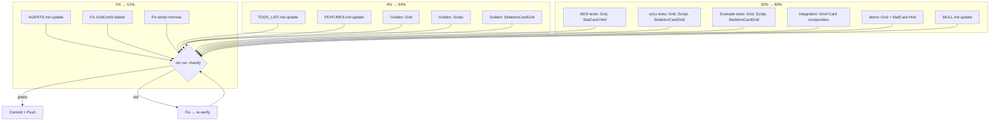

# Plan: Feedback-Driven Improvements Cleanup (Session 6b)

**Created:** 2026-07-05 03:21 CEST
**Goal:** Close all gaps from the self-review of session 6 — documentation debt, missing test lenses, design fixes.
**Constraint:** Do NOT break the build. Do NOT verschlimmbessern. Be surgical.

---

## Pareto Analysis

### 1% that delivers 51%

1. **AGENTS.md update** — THE memory file. Without it, every future session is blind to Grid, Script, SkeletonCardGrid, GridCols, statCardInner, SimpleNav.RightItems.
2. **Fix GridCols5 responsive ladder** — shipped code with a design flaw (jumps 2→5, skipping 3/4).
3. **Fix templ minmax diagnostic** — 30-second fix for persistent lint hint.

### 4% that delivers 64% (adds)

4. **TODO_LIST.md update** — record session 6 work so the backlog is accurate.
5. **FEATURES.md update** — feature inventory honesty.
6. **Golden tests for 3 new components** — regression baselines (Grid, Script, SkeletonCardGrid).

### 20% that delivers 80% (adds)

7. **BDD + a11y tests** for new components (accessibility contracts must be tested).
8. **Example tests** (godoc examples compile and render).
9. **integration/composition_test.go** — Grid + Card composition proof.
10. **examples/demo update** — Grid + StatCard.Href showcase.
11. **SKILL.md update** — new patterns in decision trees.

---

## Execution Graph

---

## Task Breakdown (30–100 min tasks)

| #   | Task                                           | Lens | Impact | Effort | Deps |
| --- | ---------------------------------------------- | ---- | ------ | ------ | ---- |
| T1  | Fix GridCols5 responsive ladder + templ minmax | 1%   | High   | Low    | —    |
| T2  | Update AGENTS.md conventions                   | 1%   | High   | Med    | —    |
| T3  | Update TODO_LIST.md (session 6 record)         | 4%   | Med    | Low    | —    |
| T4  | Update FEATURES.md (new components/fields)     | 4%   | Med    | Low    | —    |
| T5  | Golden tests: Grid (all GridCols variants)     | 4%   | High   | Low    | T1   |
| T6  | Golden tests: Script + SkeletonCardGrid        | 4%   | Med    | Low    | —    |
| T7  | BDD + a11y tests for new components            | 20%  | Med    | Med    | T1   |
| T8  | Example tests (godoc) for new components       | 20%  | Low    | Low    | —    |
| T9  | integration/composition_test.go + demo update  | 20%  | Med    | Low    | —    |
| T10 | SKILL.md update                                | 20%  | Med    | Low    | T2   |

---

## Micro-Task Breakdown (max 15 min each)

| #   | Micro-Task                                                    | Parent | Est |
| --- | ------------------------------------------------------------- | ------ | --- |
| M1  | Fix GridCols5: `sm:grid-cols-2 lg:grid-cols-3 xl:grid-cols-5` | T1     | 2m  |
| M2  | Fix GridCols4: `sm:grid-cols-2 md:grid-cols-3 lg:grid-cols-4` | T1     | 2m  |
| M3  | Fix templ minmax in loading.templ:217                         | T1     | 2m  |
| M4  | Regen + verify after code fixes                               | T1     | 5m  |
| M5  | AGENTS.md: add Grid/GridCols conventions                      | T2     | 5m  |
| M6  | AGENTS.md: add Script helper convention                       | T2     | 3m  |
| M7  | AGENTS.md: add SkeletonCardGrid convention                    | T2     | 3m  |
| M8  | AGENTS.md: add statCardInner sub-template note                | T2     | 2m  |
| M9  | AGENTS.md: add SimpleNav.RightItems note                      | T2     | 2m  |
| M10 | AGENTS.md: update header metrics (components, tests, enums)   | T2     | 3m  |
| M11 | TODO_LIST.md: add session 6 header + completed items          | T3     | 5m  |
| M12 | FEATURES.md: add Grid, Script, SkeletonCardGrid entries       | T4     | 5m  |
| M13 | Golden: create display/testdata/grid\_\*.golden (6 variants)  | T5     | 10m |
| M14 | Golden: create layout/testdata/script\*.golden                | T6     | 5m  |
| M15 | Golden: create feedback/testdata/skeleton_card_grid\*.golden  | T6     | 5m  |
| M16 | BDD: Grid responsive rendering test                           | T7     | 10m |
| M17 | BDD: StatCard.Href navigation test                            | T7     | 10m |
| M18 | a11y: Grid aria-label propagation test                        | T7     | 5m  |
| M19 | a11y: Script nonce-always test                                | T7     | 5m  |
| M20 | a11y: SkeletonCardGrid role=status + motion-reduce test       | T7     | 5m  |
| M21 | Example: ExampleGrid godoc                                    | T8     | 5m  |
| M22 | Example: ExampleScript godoc                                  | T8     | 5m  |
| M23 | Example: ExampleSkeletonCardGrid godoc                        | T8     | 5m  |
| M24 | integration: Grid+Card composition test                       | T9     | 10m |
| M25 | demo: add Grid + StatCard.Href to demo.templ                  | T9     | 10m |
| M26 | SKILL.md: GridCols in decision tree + Script pattern          | T10    | 10m |
| M27 | Final verify + commit + push                                  | ALL    | 10m |
