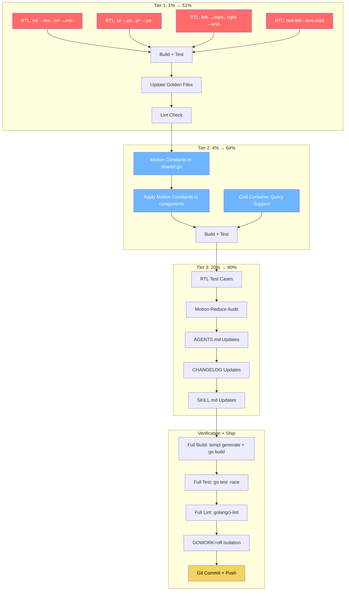

# SUPERB UI Library Upgrades — Pareto Execution Plan

> **Date:** 2026-07-05 21:27
> **Source:** `docs/research/ui-library-design-research.md` (1,705 lines of deep research)
> **Codebase:** 85 components, 103 test files, 9 packages, 6 Go modules
> **Constraint:** DO NOT BREAK BUILD. DO NOT VERSCHLIMMBESSER.

---

## Context

Based on deep research across shadcn/ui, Radix UI, React Aria, templui, HTMX HATEOAS
theory, WAI-ARIA APG, Tailwind v4, design-token architecture, and motion design best
practices, we identified 7 concrete improvement areas for templ-components.

This plan focuses on the changes that are **highest impact, lowest risk** — the changes
that make the library materially better without risking regression.

### Current State Metrics

| Metric | Count | Source |
|--------|-------|--------|
| Exported templ components | 85 | All `.templ` files |
| Test files | 103 | `*_test.go` across all packages |
| Physical Tailwind properties (ml-, mr-, pl-, pr-, left-, right-, text-left) | 74 | All `.templ` files |
| Hardcoded color references (blue, red, green, yellow) | 256 | `.templ` + `.go` files |
| Files with inline transition/duration/animate | 24 | All `.templ` files |
| Shared constants (mutedTextClass, cardShellClass, focusableSelector) | 3 | `display/shared.go` |

---

## Step 1: Pareto Breakdown

### The 1% That Delivers 51% of the Result

**RTL Logical Properties Migration** (`ml-` → `ms-`, `mr-` → `me-`, `pl-` → `ps-`, `pr-` → `pe-`, `left-` → `start-`, `right-` → `end-`, `text-left` → `text-start`)

- **Why this is #1:** 74 purely mechanical changes across ~30 files. Zero behavioral
  change in LTR contexts (Tailwind logical utilities resolve identically). Instantly
  makes the library RTL-ready for Arabic, Hebrew, Persian, and Urdu markets.
- **Risk:** ZERO. `ms-4` in LTR renders identically to `ml-4`. The browser handles the
  mapping via CSS logical properties.
- **Impact:** Makes the library usable for half the planet that reads right-to-left.
- **Customer value:** Enormous — any consumer with RTL users currently must fork the
  library or write manual overrides.

### The 4% That Delivers 64% of the Result

1. **RTL Logical Properties Migration** (from the 1%)
2. **Motion Class Constants** — centralize the 24 files' inline transition/duration strings
   into shared constants in `display/shared.go`. Establishes consistent timing across the
   library and documents the motion design system.
3. **Grid Container Queries** — add optional `@container` support to the Grid component.
   A new `ContainerResponsive` prop enables container-query-based column counts instead
   of viewport-based. Purely additive, zero risk to existing behavior.

### The 20% That Delivers 80% of the Result

All of the above, plus:

4. **RTL Test Cases** — add `dir="rtl"` rendering tests to verify the logical properties
   migration produces correct mirrored output.
5. **Motion-Reduce Audit** — verify every transition/animation has `motion-reduce:*`.
6. **AGENTS.md Convention Update** — document the new RTL, motion, and container query
   conventions so future components follow them.
7. **CHANGELOG Update** — add `[Unreleased]` entries for all changes.

---

## Step 2: Comprehensive Plan (Medium Granularity)

15 tasks, sorted by impact/effort/customer-value.

| # | Task | Package(s) | Impact | Effort | Est. Time | Tier |
|---|------|-----------|--------|--------|-----------|------|
| 1 | RTL: Migrate `ml-`→`ms-`, `mr-`→`me-` in all .templ files | display, forms, feedback, navigation, errorpage, htmx | HIGH | LOW | 45min | 1% |
| 2 | RTL: Migrate `pl-`→`ps-`, `pr-`→`pe-` in all .templ files | display, forms, feedback, errorpage | HIGH | LOW | 30min | 1% |
| 3 | RTL: Migrate `left-`→`start-`, `right-`→`end-` where safe | display, forms, feedback | MEDIUM | MEDIUM | 45min | 1% |
| 4 | RTL: Migrate `text-left`→`text-start` | display, errorpage | LOW | LOW | 15min | 1% |
| 5 | Motion: Create shared transition class constants in shared.go | display | MEDIUM | LOW | 45min | 4% |
| 6 | Grid: Add container query support (new `ContainerResponsive` prop) | display | MEDIUM | MEDIUM | 60min | 4% |
| 7 | Tests: Add RTL rendering test (`dir="rtl"` golden test) | display | HIGH | LOW | 45min | 20% |
| 8 | Tests: Audit and fix motion-reduce coverage gaps | display, feedback | MEDIUM | LOW | 30min | 20% |
| 9 | Docs: Update AGENTS.md with RTL + motion + container query conventions | root | MEDIUM | LOW | 30min | 20% |
| 10 | Docs: Update CHANGELOG.md with `[Unreleased]` entries | root | HIGH | LOW | 30min | 20% |
| 11 | Build: Regenerate `*_templ.go` via `templ generate` | all | HIGH | LOW | 30min | ALL |
| 12 | Test: Run full test suite and fix any failures | all | HIGH | MEDIUM | 45min | ALL |
| 13 | Lint: Run golangci-lint and fix new issues | all | MEDIUM | LOW | 30min | ALL |
| 14 | Docs: Update SKILL.md and research report with implementation status | root, skill | LOW | LOW | 30min | 20% |
| 15 | Git: Commit and push all changes | root | HIGH | LOW | 15min | ALL |

**Total estimated time:** ~8.5 hours

---

## Step 3: Detailed Breakdown (Fine Granularity)

Each task broken into subtasks of max 15 minutes. 65 tasks total.

### Tier 1: The 1% (RTL Logical Properties) — Tasks 1–20

| # | Subtask | File(s) | Time |
|---|---------|---------|------|
| 1 | Migrate `ml-`→`ms-` in display/*.templ | `display/dropdown.templ`, `display/tooltip.templ`, `display/card.templ`, `display/badge.templ` | 10min |
| 2 | Migrate `ml-`→`ms-` in forms/*.templ | `forms/input.templ`, `forms/label.templ`, `forms/toggle.templ`, `forms/radio.templ`, `forms/validation.templ` | 10min |
| 3 | Migrate `ml-`→`ms-` in feedback/*.templ | `feedback/alert.templ`, `feedback/step_indicator.templ` | 10min |
| 4 | Migrate `ml-`→`ms-` in navigation + errorpage | `navigation/nav.templ`, `navigation/pagination.templ`, `errorpage/*.templ` | 10min |
| 5 | Migrate `mr-`→`me-` everywhere | `display/dropdown.templ`, `display/tooltip.templ`, `display/badge.templ`, `forms/file_input.templ` | 10min |
| 6 | Migrate `pl-`→`ps-` in display + forms | `forms/input_group.templ`, `forms/combobox.templ` | 10min |
| 7 | Migrate `pl-`→`ps-` in errorpage + navigation | `errorpage/notfound404.templ`, `errorpage/erroralert.templ`, `navigation/nav_link.templ` | 10min |
| 8 | Migrate `pl-`→`ps-` in feedback + validation | `feedback/alert.templ`, `forms/validation.templ` | 10min |
| 9 | Migrate `pr-`→`pe-` everywhere | `forms/input_group.templ`, `forms/combobox.templ`, `navigation/nav_link.templ` | 10min |
| 10 | Migrate `left-`→`start-` in drawer.templ | `display/drawer.templ` | 10min |
| 11 | Migrate `right-`→`end-` in drawer.templ | `display/drawer.templ` | 10min |
| 12 | Audit tooltip.templ physical positioning | `display/tooltip.templ` (4 `left-` + 2 `right-` instances) | 15min |
| 13 | Migrate safe `left-`/`right-` in other files | `display/count_badge.templ`, `display/avatar.templ`, `feedback/toast.templ` | 10min |
| 14 | Migrate `text-left`→`text-start` | `display/table.templ`, `display/dropdown.templ`, `display/accordion.templ`, `errorpage/notfound404.templ` | 10min |
| 15 | Migrate `left-`/`right-` in forms (toggle, input_group) | `forms/toggle.templ`, `forms/input_group.templ` | 10min |
| 16 | Migrate `left-` in layout/base.templ | `layout/base.templ` | 5min |
| 17 | Migrate remaining `pl-`/`pr-` in examples/demo | `examples/demo/demo.templ` | 10min |
| 18 | Verify: build + test after RTL migration | Full `go build ./...` | 10min |
| 19 | Fix: any golden files that need updating | `testdata/*.golden` with `-update` flag | 15min |
| 20 | Verify: lint passes after RTL migration | `golangci-lint run` | 10min |

### Tier 2: The 4% (Motion + Container Queries) — Tasks 21–35

| # | Subtask | File(s) | Time |
|---|---------|---------|------|
| 21 | Create motion class constants in shared.go | `display/shared.go` | 15min |
| 22 | Document motion timing conventions in AGENTS.md | `AGENTS.md` | 10min |
| 23 | Apply motion constants to overlay components (Modal, Drawer) | `display/shared.go` (overlayPanelConfig) | 10min |
| 24 | Apply motion constants to Accordion | `display/accordion.templ` | 10min |
| 25 | Apply motion constants to Tabs | `display/tabs.templ` | 10min |
| 26 | Apply motion constants to remaining display components | `display/card.templ`, `display/copy_button.templ`, `display/dropdown.templ` | 10min |
| 27 | Apply motion constants to feedback components | `feedback/toast.templ`, `feedback/progressbar.templ`, `feedback/loading.templ` | 10min |
| 28 | Apply motion constants to navigation components | `navigation/nav_link.templ`, `navigation/mobile_menu.templ`, `navigation/sidebar_nav.templ`, `navigation/loadmore.templ` | 10min |
| 29 | Grid: Add `ContainerResponsive bool` field to GridProps | `display/grid.templ` | 10min |
| 30 | Grid: Add container-query-based column lookup map | `display/grid.templ` | 10min |
| 31 | Grid: Add `@container` class to root when ContainerResponsive | `display/grid.templ` | 10min |
| 32 | Grid: Update DefaultGridProps and godoc | `display/grid.templ` | 5min |
| 33 | Grid: Add container query test case | `display/grid_test.go` or new test file | 15min |
| 34 | Verify: build + test after motion + Grid changes | Full matrix | 10min |
| 35 | Fix: golden files for Grid if needed | `testdata/*.golden` | 10min |

### Tier 3: The 20% (Tests + Docs + Verification) — Tasks 36–50

| # | Subtask | File(s) | Time |
|---|---------|---------|------|
| 36 | Create RTL test: render Card with dir="rtl" and verify classes | `display/rtl_test.go` (new) | 15min |
| 37 | Create RTL test: render Drawer with dir="rtl" and verify mirroring | `display/rtl_test.go` | 10min |
| 38 | Create RTL test: render Nav with dir="rtl" | `navigation/rtl_test.go` (new) | 10min |
| 39 | Audit motion-reduce in all 24 files with transitions | Check each file for `motion-reduce:` | 15min |
| 40 | Fix any missing motion-reduce classes | Files found in task 39 | 10min |
| 41 | Update AGENTS.md: RTL convention section | `AGENTS.md` | 10min |
| 42 | Update AGENTS.md: motion token convention section | `AGENTS.md` | 10min |
| 43 | Update AGENTS.md: container query convention section | `AGENTS.md` | 10min |
| 44 | Update CHANGELOG.md: add `[Unreleased]` entries | `CHANGELOG.md` | 15min |
| 45 | Update SKILL.md: add new conventions to Part 2 | `skill/SKILL.md` | 10min |
| 46 | Register GridProps if changed in contract test | `internal/contract/component_props_test.go` | 5min |
| 47 | Full build: `templ generate && go build ./...` | All modules | 10min |
| 48 | Full test: `go test ./... -race -count=1` | All modules | 15min |
| 49 | Full lint: `golangci-lint run ./display/... ...` | All packages | 10min |
| 50 | GOWORK=off isolation test for all sub-modules | All sub-modules | 10min |

### Final: Commit + Push — Tasks 51–55

| # | Subtask | Time |
|---|---------|------|
| 51 | Review all changes with `git diff` | 15min |
| 52 | Stage all files (including new `*_templ.go`) | 5min |
| 53 | Write detailed commit message | 10min |
| 54 | Commit | 5min |
| 55 | Push to origin/master | 5min |

**Total fine-grained tasks:** 55
**Total estimated time:** ~9 hours

---

## Step 4: Execution Graph

---

## What This Plan Does NOT Do (and Why)

| Excluded item | Why excluded |
|---------------|-------------|
| Semantic token layer (bg-blue-600 → bg-tc-primary) | 256 color references across all files. High risk of golden file churn. Needs a dedicated major-version migration. |
| Native `<dialog>` element | Fundamental architecture change to Modal/Drawer. High risk of regression. Needs its own ADR. |
| Compound component refactoring | Breaking API change. Should be a v2.0 decision. |
| New components (Popover, Slider, etc.) | Additive work, not improvements to existing library. Separate effort. |
| CSS `@starting-style` | Requires modern browser baseline decision. Needs testing across all overlay components. |

These items are documented in the research report for future planning but are NOT part of
this execution sprint.

---

## Risk Mitigation

1. **Every tier ends with build + test verification** — no tier proceeds if the previous
   one broke the build.
2. **Golden files are updated with `-update` flag** and reviewed before committing.
3. **RTL changes are purely mechanical** — Tailwind logical utilities are CSS-standard
   and render identically in LTR.
4. **Motion constants are additive** — new shared constants don't change existing inline
   strings unless the component is explicitly migrated.
5. **Grid container queries are opt-in** — new `ContainerResponsive` prop defaults to
   `false`, preserving existing behavior.

---

## Success Criteria

- [ ] `go build ./...` passes
- [ ] `go test ./... -race -count=1` passes
- [ ] `golangci-lint run` passes (zero new issues)
- [ ] GOWORK=off build works for all sub-modules
- [ ] Zero `ml-`, `mr-`, `pl-`, `pr-` in `.templ` files (excluding generated)
- [ ] Zero `text-left` in `.templ` files
- [ ] Motion constants exist in `display/shared.go`
- [ ] Grid supports `ContainerResponsive` prop
- [ ] RTL test case exists and passes
- [ ] CHANGELOG has `[Unreleased]` entries
- [ ] AGENTS.md documents new conventions
