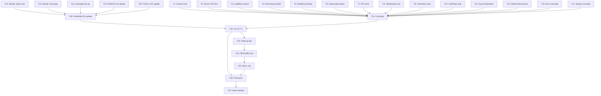

# Session 9 — Comprehensive Hardening & v0.7.0 Release

> **Date:** 2026-07-05
> **Goal:** Close all high-impact gaps, cut v0.7.0, verify consumer experience.

---

## Pareto Breakdown

### 1% that delivers 51%

1. **Cut v0.7.0 release** — all improvements since v0.6.1 are done; `[Unreleased]` is warm
2. **Register NotFound404Props** in contract test (lost during branch chaos)
3. **Verify `go get` works** post-modularization from clean repo

### 4% that delivers 64%

4. **Nonce-presence CSP test** — render every component with nonce, assert `nonce=` in every `<script>`
5. **Remaining IsValid methods** — 4 more enums (TooltipPosition, ToggleSize, AvatarShape, SkeletonVariant)
6. **LoadMore net/url fix** — base64 cursors with `=`/`+` break current string concat
7. **RTL rendering tests** — `dir="rtl"` golden/assertion tests
8. **AGENTS.md conventions** — document RTL, container queries, OverlayKind

### 20% that delivers 80%

9. **TableHeader slot** — typed header definitions for sortable tables (consumer #1 request)
10. **Combobox keyboard a11y** — ArrowDown/Up, aria-activedescendant
11. **SimpleCard.Body slot** — parity with Card.Body and Table.Body
12. **Recipe docs** — custom-table-rows, custom-404, recipe index
13. **Coverage boost** — htmx (68.4%) and display (69.7%) below 70%
14. **Godoc for deprecated aliases** — AlertType, ToastType, ModalSizeFull, DrawerFull

---

## Execution Plan (27 tasks, ~30min each)

| #   | Task                                                    | Impact | Effort | Package                  |
| --- | ------------------------------------------------------- | ------ | ------ | ------------------------ |
| T1  | Register NotFound404Props in contract test              | High   | S      | internal/contract        |
| T2  | Add nonce-presence CSP assertion test                   | High   | S      | integration              |
| T3  | LoadMore: switch to net/url for cursor encoding         | Med    | S      | navigation               |
| T4  | Add 4 remaining IsValid methods                         | Med    | S      | display, forms, feedback |
| T5  | Add SimpleCard.Body slot                                | Low    | S      | display                  |
| T6  | Add godoc to deprecated aliases                         | Low    | S      | feedback, display        |
| T7  | Add RTL rendering assertion tests                       | High   | S      | display, navigation      |
| T8  | Add TableHeader slot for sortable column defs           | Med    | M      | display                  |
| T9  | Improve Combobox keyboard navigation                    | High   | M      | forms                    |
| T10 | Add GridProps.Gap typed enum                            | Low    | S      | display                  |
| T11 | Add layout.Stylesheet helper                            | Low    | S      | layout                   |
| T12 | Add recipe: custom-table-rows.md                        | Low    | S      | docs                     |
| T13 | Add recipe: custom-404-page.md                          | Low    | S      | docs                     |
| T14 | Update errorpage/doc.go for NotFound404                 | Low    | S      | errorpage                |
| T15 | Delete orphaned demo binary                             | Low    | S      | examples                 |
| T16 | Fix htmx coverage (<70%)                                | Med    | M      | htmx                     |
| T17 | Fix display coverage (<70%)                             | Med    | M      | display                  |
| T18 | Update AGENTS.md with RTL + container query conventions | Med    | S      | root                     |
| T19 | Update CHANGELOG [Unreleased]                           | High   | S      | root                     |
| T20 | Update TODO_LIST.md                                     | Med    | S      | root                     |
| T21 | Full verify: build + test + lint                        | High   | S      | all                      |
| T22 | Cut v0.7.0 release                                      | High   | S      | root                     |
| T23 | Verify go get from clean repo                           | High   | S      | external                 |
| T24 | Update FEATURES.md with new items                       | Med    | S      | root                     |
| T25 | Add SKILL.md updates for new components                 | Low    | S      | skill                    |
| T26 | Final git push                                          | High   | S      | root                     |
| T27 | Clean up git stashes                                    | Low    | S      | root                     |

---

## Mermaid Execution Graph

---

## What's NOT in this plan (deferred to v1.0+)

- Move test helpers to `internal/testutil/` (breaking, 70 files)
- `Validate() error` on all props (73 components, design decision needed)
- Semantic token layer (major migration, all 256 color refs)
- New components: Popover, Slider, Calendar, DataTable, Carousel
- CLI tool (`templ-components add`)
- Headless/unstyled variants
- Compound component refactor for overlays
- Demo site / showcase
- Visual regression testing
