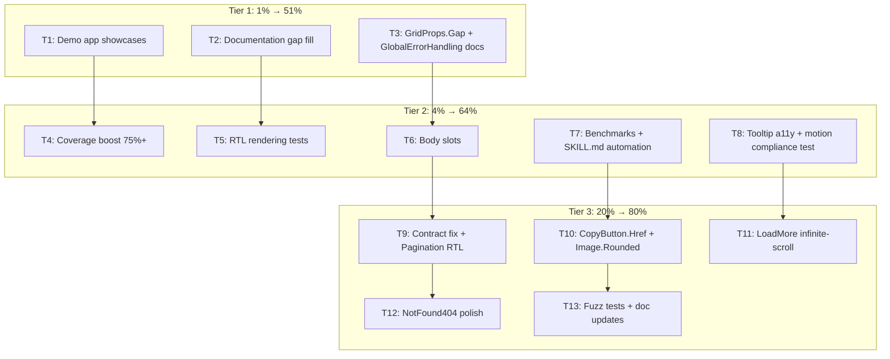

# SUPERB Plan — v0.8.0 → v0.9.0 Hardening Sprint

> **Date:** 2026-07-06 02:36
> **Current version:** 0.8.0 · **Target:** 0.9.0
> **Scope:** All executable open TODOs from 13 status reports (91 items total, ~55 executable, ~36 deferred/blocked)

---

## Pareto Breakdown

### 1% that delivers 51% (3 items)

| #   | Item                                                                                                                 | Why                                                             |
| --- | -------------------------------------------------------------------------------------------------------------------- | --------------------------------------------------------------- |
| 1   | Demo app: showcase ALL recent features (TableHeader, Form.Inline, Grid.ContainerResponsive, Table.Body, NotFound404) | #1 adoption blocker — consumers can't discover shipped features |
| 2   | Documentation: ROADMAP.md, CONTRIBUTING.md, migration guide, README cross-links                                      | Onboarding gap — new consumers don't know how to start          |
| 3   | GridProps.Gap typed enum + GlobalErrorHandling ToastContainer docs                                                   | Quick wins with high consumer impact                            |

### 4% that delivers 64% (10 items — the 1% plus)

| #   | Item                                                                                        | Why                                           |
| --- | ------------------------------------------------------------------------------------------- | --------------------------------------------- |
| 4   | Coverage boost → 75%+ all packages (errorpage 73%, feedback 72%, forms 72%, navigation 73%) | Structural quality                            |
| 5   | RTL rendering tests (dir="rtl" golden tests on key components)                              | Verify RTL migration is correct               |
| 6   | Body slots: SimpleCard.Body + SkeletonCardGrid.Body                                         | Consistency with Card.Body/Table.Body pattern |
| 7   | Performance benchmarks for remaining 11 packages                                            | Only 3/14 have render benchmarks              |
| 8   | SKILL.md component count automation test                                                    | Prevent doc drift                             |
| 9   | Tooltip aria-describedby a11y investigation + fix                                           | Accessibility gap                             |
| 10  | Motion constant compliance test (grep assertion)                                            | Prevent regression without risky refactor     |

### 20% that delivers 80% (20 items — the 4% plus)

| #   | Item                                                                | Why               |
| --- | ------------------------------------------------------------------- | ----------------- |
| 11  | Contract test stale comment counts fix                              | Cosmetic accuracy |
| 12  | Pagination keyboard RTL mapping (ArrowLeft/Right swap in dir="rtl") | RTL a11y          |
| 13  | CopyButton.Href variant                                             | Consumer use case |
| 14  | Image.Rounded bool                                                  | Common use case   |
| 15  | LoadMore infinite-scroll variant (hx-trigger="revealed")            | UX feature        |
| 16  | NotFound404 convenience handler (WriteNotFound404)                  | API ergonomics    |
| 17  | NotFound404 LinksTitle field (configurable)                         | i18n              |
| 18  | Fuzz testing for InputType, ButtonHTMLType, FormMethod enums        | Enum robustness   |
| 19  | Icons-only-adoption doc update                                      | Doc accuracy      |
| 20  | Demo: SkeletonCardGrid loading state showcase                       | Demo completeness |

### Deferred (not in scope this sprint)

- **v1.0:** Validate() error, testutil move, self-host htmx, deprecate aliases, semantic tokens, icon RTL mirroring
- **v2.0:** Compound components, native `<dialog>`, headless variants, `<dialog>` migration
- **Blocked:** awesome-templ PR, templ.guide listing, SSH tag signing, demo site hosting
- **Out of scope (new components):** Popover, HoverCard, Slider, Calendar, Rating, TagsInput, ContextMenu, Carousel, DataTable, CLI tool

---

## Execution Graph

---

## Level 1: Coarse Task Breakdown (20 tasks, 30-100min each)

| #     | Task                                                                                 | Tier | Impact | Effort | Est |
| ----- | ------------------------------------------------------------------------------------ | ---- | ------ | ------ | --- |
| L1.01 | Demo app: showcase TableHeader sortable + Form.Inline + Table.Body                   | 1    | HIGH   | MED    | 45m |
| L1.02 | Demo app: showcase Grid.ContainerResponsive + NotFound404 + SkeletonCardGrid         | 1    | HIGH   | MED    | 45m |
| L1.03 | Documentation: create ROADMAP.md                                                     | 1    | MED    | LOW    | 30m |
| L1.04 | Documentation: create CONTRIBUTING.md                                                | 1    | MED    | LOW    | 30m |
| L1.05 | Documentation: migration guide v0.7→v0.8 + README cross-links                        | 1    | MED    | LOW    | 30m |
| L1.06 | GridProps.Gap typed enum + tests                                                     | 1    | MED    | LOW    | 30m |
| L1.07 | GlobalErrorHandling: document ToastContainer hidden coupling                         | 1    | MED    | LOW    | 15m |
| L1.08 | Coverage: errorpage → 75%+ + feedback → 75%+                                         | 2    | MED    | MED    | 60m |
| L1.09 | Coverage: forms → 75%+ + navigation → 75%+                                           | 2    | MED    | MED    | 60m |
| L1.10 | RTL rendering tests (Card, Drawer, Nav, Combobox with dir="rtl")                     | 2    | MED    | LOW    | 30m |
| L1.11 | Body slots: SimpleCard.Body + SkeletonCardGrid.Body                                  | 2    | MED    | LOW    | 30m |
| L1.12 | Performance benchmarks for remaining 11 packages                                     | 2    | LOW    | MED    | 60m |
| L1.13 | SKILL.md component count automation test                                             | 2    | LOW    | LOW    | 15m |
| L1.14 | Tooltip aria-describedby a11y fix                                                    | 2    | MED    | MED    | 30m |
| L1.15 | Motion constant compliance test (grep assertion)                                     | 2    | LOW    | LOW    | 15m |
| L1.16 | Pagination keyboard RTL mapping + contract test comment fix                          | 3    | LOW    | LOW    | 30m |
| L1.17 | CopyButton.Href variant + Image.Rounded bool                                         | 3    | LOW    | LOW    | 30m |
| L1.18 | LoadMore infinite-scroll variant + NotFound404 polish (LinksTitle, WriteNotFound404) | 3    | LOW    | MED    | 45m |
| L1.19 | Fuzz tests for enums + icons-only doc update + demo polish                           | 3    | LOW    | LOW    | 30m |
| L1.20 | Verify all + lint + test + CHANGELOG + version bump to v0.9.0                        | ALL  | HIGH   | LOW    | 30m |

---

## Level 2: Fine Task Breakdown (75 tasks, max 15min each)

### Tier 1 — 1% → 51% (18 tasks)

| #   | Task                                                                                         | Parent | Est |
| --- | -------------------------------------------------------------------------------------------- | ------ | --- |
| F01 | Demo: add sortable TableHeader example with 3 columns (asc/desc/none)                        | L1.01  | 10m |
| F02 | Demo: add Form.Inline horizontal filter bar example                                          | L1.01  | 10m |
| F03 | Demo: add Table.Body custom row rendering example                                            | L1.01  | 10m |
| F04 | Demo: add Grid.ContainerResponsive example in a card                                         | L1.02  | 10m |
| F05 | Demo: add NotFound404 page section                                                           | L1.02  | 10m |
| F06 | Demo: add SkeletonCardGrid loading state showcase                                            | L1.02  | 10m |
| F07 | Create ROADMAP.md with v1.0/v2.0 vision                                                      | L1.03  | 15m |
| F08 | Create CONTRIBUTING.md with build/test/lint commands + conventions                           | L1.04  | 15m |
| F09 | Migration guide: v0.7→v0.8 changes (typed HxSwap, TableHeader, Form.Inline)                  | L1.05  | 10m |
| F10 | README: cross-link javascript-guide.md, motion-design.md, container-queries recipe           | L1.05  | 10m |
| F11 | README: mention ContainerResponsive in Grid section                                          | L1.05  | 5m  |
| F12 | GridProps: add Gap typed enum (GridGapSM/MD/LG/XL → gap-2/4/6/8)                             | L1.06  | 10m |
| F13 | GridProps: add gapLookup map + utils.Lookup + IsValid                                        | L1.06  | 10m |
| F14 | GridProps: update grid template to use gap constant                                          | L1.06  | 5m  |
| F15 | GridProps: add tests for Gap enum                                                            | L1.06  | 10m |
| F16 | GlobalErrorHandling: add godoc warning about ToastContainer requirement                      | L1.07  | 5m  |
| F17 | GlobalErrorHandling: add godoc example showing ToastContainer + GlobalErrorHandling together | L1.07  | 10m |

### Tier 2 — 4% → 64% (25 tasks)

| #   | Task                                                                            | Parent | Est |
| --- | ------------------------------------------------------------------------------- | ------ | --- |
| F18 | errorpage coverage: handler edge paths (WriteError, WriteErrorPage error cases) | L1.08  | 15m |
| F19 | errorpage coverage: FromError with nil/classified errors                        | L1.08  | 10m |
| F20 | errorpage coverage: ErrorDetail, ErrorAlert rendering branches                  | L1.08  | 10m |
| F21 | feedback coverage: StepIndicator vertical orientation branch                    | L1.08  | 10m |
| F22 | feedback coverage: LoadingOverlay dismiss + Skeleton variants                   | L1.08  | 10m |
| F23 | feedback coverage: ProgressBar indeterminate + clamp edge cases                 | L1.08  | 10m |
| F24 | forms coverage: Combobox rendering with empty/no options                        | L1.09  | 15m |
| F25 | forms coverage: RadioGroup inline + orientation branches                        | L1.09  | 10m |
| F26 | forms coverage: Select normalizeOptions edge cases                              | L1.09  | 10m |
| F27 | forms coverage: Input validation branches (ErrorAttrs, SanitizeID)              | L1.09  | 10m |
| F28 | navigation coverage: SidebarNav CurrentPath auto-active detection               | L1.09  | 10m |
| F29 | navigation coverage: Breadcrumbs JSON-LD + Separator rendering                  | L1.09  | 10m |
| F30 | RTL test: render Card with dir="rtl", assert logical properties present         | L1.10  | 10m |
| F31 | RTL test: render Nav with dir="rtl", assert logical properties                  | L1.10  | 10m |
| F32 | RTL test: render Combobox with dir="rtl", assert logical properties             | L1.10  | 10m |
| F33 | SimpleCard.Body: add Body field to SimpleCardProps + forward to Card.Body       | L1.11  | 10m |
| F34 | SkeletonCardGrid.Body: add Body field for custom skeleton layout                | L1.11  | 10m |
| F35 | SimpleCard.Body: add tests for slot override                                    | L1.11  | 10m |
| F36 | Benchmarks: add feedback package benchmark suite                                | L1.12  | 10m |
| F37 | Benchmarks: add forms package benchmark suite                                   | L1.12  | 10m |
| F38 | Benchmarks: add errorpage package benchmark suite                               | L1.12  | 10m |
| F39 | Benchmarks: add layout + htmx + icons + utils benchmark suites                  | L1.12  | 15m |
| F40 | SKILL.md: add drift-guard test counting templ functions vs documented count     | L1.13  | 15m |
| F41 | Tooltip: add aria-describedby={tooltipID} to trigger element                    | L1.14  | 10m |
| F42 | Tooltip: verify aria-describedby works with CSS-only tooltip (test)             | L1.14  | 15m |

### Tier 3 — 20% → 80% (32 tasks)

| #   | Task                                                                                             | Parent | Est |
| --- | ------------------------------------------------------------------------------------------------ | ------ | --- |
| F43 | Motion compliance test: grep all .templ for transition- without constant or inline motion-reduce | L1.15  | 15m |
| F44 | Contract test: fix stale comment counts (display 18→actual, nav 6→actual)                        | L1.16  | 5m  |
| F45 | Pagination: add dir="rtl" keyboard mapping (ArrowLeft→next, ArrowRight→prev)                     | L1.16  | 10m |
| F46 | Pagination: add test for RTL keyboard mapping                                                    | L1.16  | 10m |
| F47 | CopyButton.Href: add Href field, render <a> when set                                             | L1.17  | 10m |
| F48 | CopyButton.Href: add tests for linked variant                                                    | L1.17  | 10m |
| F49 | Image.Rounded: add Rounded bool field, adds rounded-\* classes                                   | L1.17  | 10m |
| F50 | Image.Rounded: add tests                                                                         | L1.17  | 5m  |
| F51 | LoadMore: add hx-trigger="revealed" option for infinite scroll                                   | L1.18  | 10m |
| F52 | LoadMore: add test for infinite-scroll variant                                                   | L1.18  | 10m |
| F53 | NotFound404: add LinksTitle field (default "Popular pages")                                      | L1.18  | 10m |
| F54 | NotFound404: add tests for LinksTitle                                                            | L1.18  | 5m  |
| F55 | NotFound404: add WriteNotFound404 convenience handler to errorpage/handler.go                    | L1.18  | 15m |
| F56 | NotFound404: add test for WriteNotFound404 handler                                               | L1.18  | 10m |
| F57 | Fuzz test: InputType valid/invalid fuzzing                                                       | L1.19  | 10m |
| F58 | Fuzz test: ButtonHTMLType valid/invalid fuzzing                                                  | L1.19  | 10m |
| F59 | Fuzz test: FormMethod valid/invalid fuzzing                                                      | L1.19  | 10m |
| F60 | Icons-only doc: update to mention all 101 icons + v0.8.0 changes                                 | L1.19  | 10m |
| F61 | Demo: add anchor-linked TOC at top of demo page                                                  | L1.19  | 10m |
| F62 | Demo: verify all examples compile and render                                                     | L1.19  | 5m  |
| F63 | AGENTS.md: update with new conventions (GridProps.Gap, Body slots, CopyButton.Href, etc.)        | L1.20  | 15m |
| F64 | CHANGELOG: add all [Unreleased] entries                                                          | L1.20  | 15m |
| F65 | SKILL.md: update component catalogue with new features                                           | L1.20  | 15m |
| F66 | FEATURES.md: update with new features + counts                                                   | L1.20  | 10m |
| F67 | templ generate + go build + go test + lint — full verify                                         | L1.20  | 10m |
| F68 | Final git status check + commit all changes                                                      | L1.20  | 5m  |

### Not Started — Deliberately Deferred

| Item                                    | Reason                                      |
| --------------------------------------- | ------------------------------------------- |
| New components (Popover, Slider, etc.)  | Each 2-6hrs, separate sprint                |
| Semantic token migration                | v1.0, 256 refs, needs dedicated sprint      |
| Native `<dialog>` migration             | v2.0, fundamental architecture change       |
| Validate() error pattern                | v1.0, design decision needed                |
| Move test helpers to internal/testutil/ | v1.0, breaking change                       |
| awesome-templ / templ.guide submissions | Blocked — external PRs                      |
| SSH tag signing                         | Blocked — needs user config                 |
| Demo site hosting                       | Blocked — needs hosting decision            |
| Motion constant sweep (19 components)   | Deferred — cosmetic, high golden churn risk |
| Compound component refactor             | v2.0                                        |
| Modularization re-evaluation            | Post-v1.0                                   |
