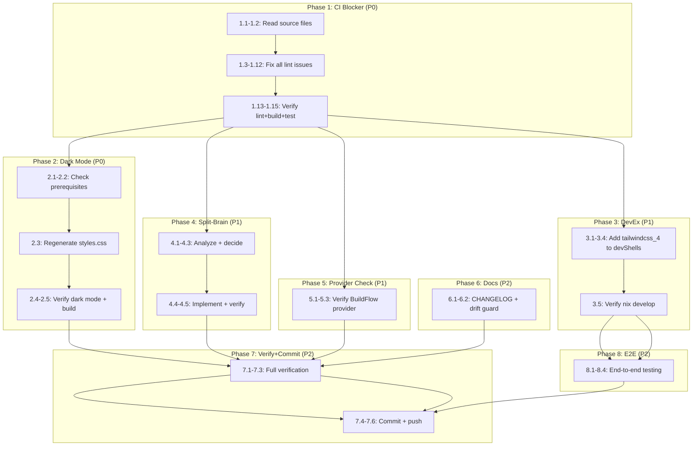

# CSS Integration Automation — Cleanup & Completion Plan

**Date:** 2026-07-09 07:30
**Scope:** templ-components, BuildFlow, DiscordSync
**Status:** Planning → Execution

---

## Background

The CSS integration automation sprint delivered two new tools:
1. **`cmd/tc-css`** (templ-components) — standalone CLI for CSS generation
2. **`tailwind-build` provider** (BuildFlow) — DAG-ordered CSS build

All code was committed and pushed. However, several issues remain:
- **13 lint issues** on `cmd/tc-css/main.go` that break CI
- **DiscordSync styles.css** never regenerated after `@custom-variant dark` fix
- **DiscordSync split-brain**: two CSS build paths (`gen/main.go` vs `tc-css`)
- **No devShell** has `tailwindcss_4` binary available
- **No E2E verification** of either tool
- **CHANGELOG** has empty `[Unreleased]` section

---

## Pareto Breakdown

### 1% → 51% (The Critical Path)
Fix lint issues on `cmd/tc-css/main.go` — this alone unblocks CI and all releases.

### 4% → 64%
Lint fixes + regenerate DiscordSync `styles.css` + add `tailwindcss_4` to devShells.

### 20% → 80%
Everything above + DiscordSync split-brain resolution + E2E verification + CHANGELOG.

---

## Comprehensive Plan (Macro Tasks)

| # | Task | Pri | Impact | Effort | Repo |
|---|------|-----|--------|--------|------|
| M1 | Fix ALL lint issues on `cmd/tc-css/` | P0 | CI blocker | 30m | templ-components |
| M2 | Regenerate DiscordSync `styles.css` with `@custom-variant dark` | P0 | Dark mode broken | 30m | DiscordSync |
| M3 | Add `tailwindcss_4` to both devShells | P1 | DevEx blocker | 30m | both |
| M4 | Resolve DiscordSync split-brain (`gen/main.go` vs `tc-css`) | P1 | Build consistency | 45m | DiscordSync |
| M5 | Verify BuildFlow `tailwind-build` provider edge cases | P1 | Correctness | 30m | BuildFlow |
| M6 | E2E test `tc-css` against real project | P2 | Feature unverified | 45m | templ-components |
| M7 | E2E test BuildFlow `tailwind-build` provider | P2 | Feature unverified | 45m | BuildFlow |
| M8 | CHANGELOG `[Unreleased]` entries | P2 | Release readiness | 30m | templ-components |
| M9 | Full verification + commit + push | P2 | Safety gate | 30m | all |

---

## Micro-Task Breakdown (15 min max each)

### Phase 1: CI Blocker (P0) — Fix Lint Issues

| # | Task | Est | Depends |
|---|------|-----|---------|
| 1.1 | Read `cmd/tc-css/main.go` — map exact lint issue lines | 5m | — |
| 1.2 | Read `cmd/tc-css/main_test.go` — map exact lint issue lines | 5m | — |
| 1.3 | Fix `main.go:71` — gosec G204 nolint placement | 5m | 1.1 |
| 1.4 | Fix `main.go:74,92,103,158,178` — remove 5 unused nolint directives | 5m | 1.1 |
| 1.5 | Fix `main.go:170` — nilerr: restructure error-skip pattern | 5m | 1.1 |
| 1.6 | Fix `main.go:107,112` — staticcheck QF1012: WriteString(Sprintf) → Fprintf | 5m | 1.1 |
| 1.7 | Fix `main.go:130` — gosec G306: WriteFile perms 0644→0600 | 3m | 1.1 |
| 1.8 | Fix `main.go:91` — gosec G301: MkdirAll perms 0755→0750 | 3m | 1.1 |
| 1.9 | Fix `main.go:83` — noctx: Command→CommandContext | 5m | 1.1 |
| 1.10 | Fix `main.go:87,92` — wrapcheck: wrap external errors | 5m | 1.1 |
| 1.11 | Fix `main_test.go:65,109` — gosec G304: nolint for os.ReadFile in tests | 3m | 1.2 |
| 1.12 | Fix `main_test.go:10,20,32,41` — paralleltest: add t.Parallel() | 5m | 1.2 |
| 1.13 | Run `golangci-lint run ./cmd/tc-css/...` — verify zero issues | 5m | 1.3-1.12 |
| 1.14 | Run full lint suite — verify no new issues elsewhere | 5m | 1.13 |
| 1.15 | Run `go build ./... && go test ./...` — verify build + tests pass | 5m | 1.14 |

### Phase 2: Dark Mode Fix (P0) — Regenerate DiscordSync styles.css

| # | Task | Est | Depends |
|---|------|-----|---------|
| 2.1 | Check if `tailwindcss` binary is available in DiscordSync devShell | 3m | — |
| 2.2 | Check `styles.css` freshness — does it already have `.dark` variants? | 3m | — |
| 2.3 | Regenerate `styles.css` via `nix run .#generate-css` | 10m | 2.1 |
| 2.4 | Verify regenerated `styles.css` contains dark mode rules | 3m | 2.3 |
| 2.5 | Verify build still passes after regeneration | 5m | 2.4 |

### Phase 3: DevEx (P1) — Add tailwindcss_4 to devShells

| # | Task | Est | Depends |
|---|------|-----|---------|
| 3.1 | Read templ-components `flake.nix` devShell section | 3m | — |
| 3.2 | Add `pkgs.tailwindcss_4` to templ-components devShell | 5m | 3.1 |
| 3.3 | Read BuildFlow `flake.nix` devShell section | 3m | — |
| 3.4 | Add `pkgs.tailwindcss_4` to BuildFlow devShell | 5m | 3.3 |
| 3.5 | Verify `nix develop` works with new package | 5m | 3.2, 3.4 |

### Phase 4: Split-Brain Resolution (P1) — DiscordSync

| # | Task | Est | Depends |
|---|------|-----|---------|
| 4.1 | Read DiscordSync `internal/web/gen/main.go` fully | 5m | — |
| 4.2 | Read DiscordSync `internal/web/static.go` go:generate directive | 3m | — |
| 4.3 | Decide approach: gen/main.go delegates to tc-css OR separate directives | 10m | 4.1, 4.2 |
| 4.4 | Implement chosen approach | 10m | 4.3 |
| 4.5 | Verify `go generate ./...` works after change | 5m | 4.4 |

### Phase 5: BuildFlow Provider Verification (P1)

| # | Task | Est | Depends |
|---|------|-----|---------|
| 5.1 | Read `tailwind_tools.go` — review skipDirs logic | 5m | — |
| 5.2 | Test: vendored CSS with `@import "tailwindcss"` not falsely detected | 10m | 5.1 |
| 5.3 | Run BuildFlow tailwind tests to verify all pass | 5m | 5.1 |

### Phase 6: CHANGELOG + Documentation (P2)

| # | Task | Est | Depends |
|---|------|-----|---------|
| 6.1 | Write CHANGELOG `[Unreleased]` entries for tc-css, app.css, provider | 10m | 1.15 |
| 6.2 | Verify drift-guard tests pass (version matches changelog) | 5m | 6.1 |

### Phase 7: Full Verification + Commit + Push (P2)

| # | Task | Est | Depends |
|---|------|-----|---------|
| 7.1 | Full templ-components: templ generate + build + test + lint | 10m | All P0-P2 |
| 7.2 | Full BuildFlow: build + test + lint | 10m | All P0-P2 |
| 7.3 | Full DiscordSync: build + test | 5m | All P0-P2 |
| 7.4 | Commit templ-components | 5m | 7.1 |
| 7.5 | Commit DiscordSync | 5m | 7.3 |
| 7.6 | Push all repos | 5m | 7.4, 7.5 |

### Phase 8: E2E Verification (P2)

| # | Task | Est | Depends |
|---|------|-----|---------|
| 8.1 | Enter nix develop, verify tailwindcss binary available | 3m | 3.5 |
| 8.2 | Run `tc-css` against DiscordSync project end-to-end | 10m | 8.1 |
| 8.3 | Run BuildFlow `tailwind-build` step against test project | 10m | 8.1 |
| 8.4 | Commit any E2E fixes | 5m | 8.2, 8.3 |

**Total: 42 micro-tasks, ~280 min estimated**

---

## Execution Graph

---

## Safety Constraints

1. **Never break the build** — verify after every change
2. **Never revert changes you didn't author** — investigate first
3. **Don't verschlimmbessern** — don't make things worse while "fixing" them
4. **Commit in logical units** — one commit per phase/fix
5. **Run lint before committing** — pre-commit hooks enforce quality
