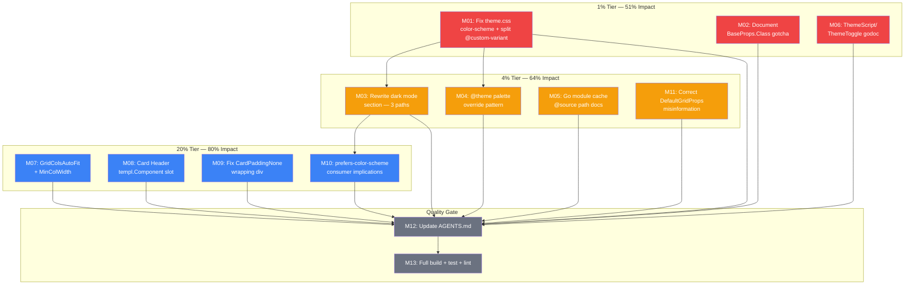

# Dark Mode Packaging & Consumer Feedback Execution Plan

**Date:** 2026-07-11
**Trigger:** Consumer feedback from cqrs-htmx ([feedback](../feedback/2026-07-10_cqrs-htmx-consumer-feedback.md)) + [dark mode research](../dark-mode-research.md)
**Goal:** Fix the packaging/documentation issues that block clean library adoption, plus the 3 highest-value component API improvements

---

## Context

A real consumer (cqrs-htmx/adminui) adopted 10 library components, deleted 1,475 lines of hand-rolled code, but hit 6 pain points. The dark mode research revealed that most pain stems from **packaging and documentation**, not architecture. The library's approach (explicit `dark:` variants on standard Tailwind classes) is correct — but the theme.css file silently forces the wrong dark mode strategy, the adoption guide only documents one of three valid consumer paths, and critical documentation gaps cause compile errors and silent CSS breakage.

**Key insight:** Tailwind v4's default `dark:` variant IS `prefers-color-scheme` (zero-config). The `.dark` class is an opt-in override. Our theme.css forces the override on every consumer.

---

## Pareto Breakdown

### 1% → 51% of the result (3 tasks)

| ID  | Task                                                                                 | Why                                                        |
| --- | ------------------------------------------------------------------------------------ | ---------------------------------------------------------- |
| M01 | Fix `color-scheme: light` → `light dark` + split `@custom-variant dark` in theme.css | Correctness bug + silent strategy hijack for ALL consumers |
| M02 | Document `BaseProps.Class` struct literal gotcha                                     | Every new Go consumer hits a compile error                 |
| M06 | Add godoc to ThemeScript/ThemeToggle — toggle-only note                              | Prevents unnecessary JS adoption                           |

### 4% → 64% of the result (+4 tasks)

| ID  | Task                                                               | Why                                               |
| --- | ------------------------------------------------------------------ | ------------------------------------------------- |
| M03 | Rewrite adoption guide dark mode section — three first-class paths | Consumers don't know OS-following is zero-config  |
| M04 | Add `@theme` palette override pattern as top-level Theming section | The cqrs-htmx solution — replaces fragile bridges |
| M05 | Document Go module cache `@source` path                            | Silent CSS breakage when path wrong               |
| M11 | Correct feedback: document `DefaultGridProps()` exists             | Misinformation correction                         |

### 20% → 80% of the result (+5 tasks)

| ID      | Task                                                                 | Why                                                 |
| ------- | -------------------------------------------------------------------- | --------------------------------------------------- |
| M07     | Add `MinColWidth string` field to GridProps                          | Common dashboard pattern needs Class escape hatch   |
| M08     | Add `Header templ.Component` slot to CardProps                       | Custom card headers need full Body-slot replacement |
| M09     | Fix `CardPaddingNone` to skip wrapping `
`                       | Table-in-card `overflow-x-auto` layout              |
| M10     | Document dark mode implications for `prefers-color-scheme` consumers | Set expectations                                    |
| M12-M13 | Update AGENTS.md + full verification                                 | Context + quality gate                              |

---

## Medium-Granularity Plan (13 tasks, 30-100min each)

| ID  | Task                                                    | Tier | Impact   | Effort | Deps    |
| --- | ------------------------------------------------------- | ---- | -------- | ------ | ------- |
| M01 | Fix theme.css: `color-scheme` + split `@custom-variant` | 1%   | Critical | 30min  | —       |
| M02 | Document BaseProps.Class struct literal gotcha          | 1%   | High     | 30min  | —       |
| M03 | Rewrite adoption guide dark mode section (3 paths)      | 4%   | High     | 60min  | M01     |
| M04 | Add `@theme` palette override pattern (Theming section) | 4%   | High     | 45min  | M01     |
| M05 | Document Go module cache `@source` path                 | 4%   | High     | 30min  | —       |
| M06 | Add godoc to ThemeScript/ThemeToggle                    | 4%   | Medium   | 15min  | —       |
| M07 | Add `MinColWidth` to GridProps (auto-fit support)       | 20%  | Medium   | 45min  | —       |
| M08 | Add `Header templ.Component` slot to CardProps          | 20%  | Medium   | 45min  | —       |
| M09 | Fix CardPaddingNone wrapping div                        | 20%  | Low-Med  | 30min  | —       |
| M10 | Document prefers-color-scheme consumer implications     | 20%  | Medium   | 30min  | M03     |
| M11 | Correct feedback: DefaultGridProps() exists             | 20%  | Low      | 15min  | —       |
| M12 | Update AGENTS.md with all changes                       | 20%  | Low      | 30min  | M01-M11 |
| M13 | Full verification: build + test + lint + golden         | 20%  | Critical | 30min  | M01-M12 |

---

## Fine-Grained Plan (52 tasks, max 15min each)

| ID  | Parent | Task                                                                                   | Est   | Deps    |
| --- | ------ | -------------------------------------------------------------------------------------- | ----- | ------- |
| F01 | M01    | Read theme.css, confirm `color-scheme` + `@custom-variant` locations                   | 5min  | —       |
| F02 | M01    | Fix `color-scheme: light` → `color-scheme: light dark` on `:root`                      | 2min  | F01     |
| F03 | M01    | Restructure theme.css: move `@custom-variant dark` to clearly commented opt-in section | 10min | F01     |
| F04 | M01    | Add inline comment on `@custom-variant`: toggle-only, remove for OS-following          | 2min  | F03     |
| F05 | M01    | Verify theme.css CSS validity                                                          | 5min  | F02,F04 |
| F06 | M02    | Read adoption guide Quick start section for insertion point                            | 5min  | —       |
| F07 | M02    | Write "Setting Class on components" subsection with struct literal example             | 10min | F06     |
| F08 | M02    | Cross-link from FAQ to new subsection                                                  | 3min  | F07     |
| F09 | M03    | Read current dark mode strategies section + FAQ                                        | 5min  | —       |
| F10 | M03    | Write Path 1 (OS-following) with code example                                          | 10min | F09     |
| F11 | M03    | Write Path 2 (Toggle) with code example                                                | 10min | F10     |
| F12 | M03    | Write Path 3 (CSS-variable design system) with `@theme` example                        | 10min | F11     |
| F13 | M03    | Add comparison table of three paths                                                    | 5min  | F12     |
| F14 | M03    | Clean up FAQ redundant dark mode answer                                                | 5min  | F13     |
| F15 | M04    | Read current "Theming without touching component code" section                         | 5min  | —       |
| F16 | M04    | Write new top-level "Theming" section with `@theme` pattern                            | 10min | F15     |
| F17 | M04    | Add `--color-white: var(--surface)` worked example                                     | 10min | F16     |
| F18 | M04    | Refactor old "Theming without touching" into new section                               | 10min | F17     |
| F19 | M05    | Read current `@source` documentation                                                   | 5min  | —       |
| F20 | M05    | Add Go module cache `@source` path subsection                                          | 10min | F19     |
| F21 | M05    | Add troubleshooting: "If components render unstyled, check @source"                    | 5min  | F20     |
| F22 | M05    | Add `go list -m -f '{{.Dir}}'` tip                                                     | 5min  | F20     |
| F23 | M06    | Read ThemeScript + ThemeToggle godoc                                                   | 5min  | —       |
| F24 | M06    | Add godoc: "Only needed for toggle strategy; OS-following needs no JS"                 | 10min | F23     |
| F25 | M07    | Read grid.templ + grid_templ.go fully                                                  | 5min  | —       |
| F26 | M07    | Add `MinColWidth string` field to `GridProps`                                          | 5min  | F25     |
| F27 | M07    | Add `GridColsAutoFit GridCols = "auto-fit"` constant                                   | 3min  | F26     |
| F28 | M07    | Implement auto-fit grid template logic in `gridClass()`                                | 10min | F27     |
| F29 | M07    | Add `GridColsAutoFitIsValid` to enum validation                                        | 5min  | F28     |
| F30 | M07    | Update `gridColsLookup` map / conditional logic                                        | 5min  | F28     |
| F31 | M07    | Write tests for auto-fit / min-width grid variants                                     | 10min | F30     |
| F32 | M07    | Run `templ generate` for grid                                                          | 3min  | F31     |
| F33 | M08    | Read card.templ + card_templ.go fully                                                  | 5min  | —       |
| F34 | M08    | Add `Header templ.Component` field to `CardProps`                                      | 5min  | F33     |
| F35 | M08    | Add conditional rendering: Header slot replaces hardcoded `<h3>`                       | 10min | F34     |
| F36 | M08    | Run `templ generate` for card                                                          | 3min  | F35     |
| F37 | M08    | Write test for Header slot rendering                                                   | 10min | F36     |
| F38 | M09    | Read CardPaddingNone rendering logic in card.templ                                     | 5min  | —       |
| F39 | M09    | Add conditional: skip wrapping `
` when `Padding == CardPaddingNone`               | 10min | F38     |
| F40 | M09    | Run `templ generate` for card                                                          | 3min  | F39     |
| F41 | M09    | Write test: CardPaddingNone renders children without wrapper                           | 10min | F40     |
| F42 | M09    | Run golden file update if snapshots changed                                            | 5min  | F41     |
| F43 | M10    | Read dark-mode-research.md for reference content                                       | 5min  | —       |
| F44 | M10    | Write prefers-color-scheme implications subsection                                     | 10min | F43     |
| F45 | M11    | Verify `DefaultGridProps()` exists at grid.templ:106                                   | 3min  | —       |
| F46 | M11    | Add DefaultProps note in adoption guide                                                | 5min  | F45     |
| F47 | M12    | Update AGENTS.md with all changes                                                      | 15min | M01-M11 |
| F48 | M13    | Full build: `templ generate ./... && go build ./...`                                   | 5min  | M01-M12 |
| F49 | M13    | Full test: `go test ./...`                                                             | 10min | F48     |
| F50 | M13    | Lint: `golangci-lint run ./...`                                                        | 10min | F49     |
| F51 | M13    | Dark mode compliance: `go test ./utils/... -run TestDarkMode`                          | 5min  | F49     |
| F52 | M13    | CSP nonce tests: `go test ./integration/...`                                           | 5min  | F49     |

---

## Execution Graph

## Parallel Execution Opportunities

The following tasks have no dependencies and can be executed simultaneously:

- **Wave 1 (parallel):** M01, M02, M05, M06, M07, M08, M09, M11
- **Wave 2 (after M01):** M03, M04
- **Wave 3 (after M03):** M10
- **Wave 4 (after all):** M12
- **Wave 5 (after M12):** M13

---

## Out of Scope (deferred)

| Item                                            | Why deferred                              |
| ----------------------------------------------- | ----------------------------------------- |
| ADR 0008 Semantic Token Layer Phase 2           | Deferred to v1.0 by design — ADR decision |
| BuildFlow gitignore `*_templ.go` re-append      | Upstream issue in `larsartmann/buildflow` |
| Remove deprecated `FamilyFromErrorFamily` alias | Scheduled for v1.0 removal                |
| Modular workspace split                         | Post-v1.0 per AGENTS.md                   |
| `go.mod` templ version bump to v0.3.1036        | Wait for official upstream release        |
| `goBackScript` promotion to utils               | Triggered when 2nd package needs it       |
| `overlayShellProps` sub-struct refactor         | Triggered when 3rd overlay type emerges   |
