# Superb Documentation Health & Hardening Plan

**Date:** 2026-07-12 14:45 CEST
**Version:** 0.16.0 (current)
**Source:** 43 `docs/**/2026-07-0*` files + docs-health audit + TODO_LIST.md verification
**Working tree:** Clean (docs-health fixes committed as `be398ed`, pushed)

---

## Context

A full documentation health audit was performed using the `docs-health` skill. All 43
`docs/**/2026-07-0*` files were read, understood, and cross-referenced against the
codebase. The audit found and fixed **8 drift issues** across 6 files. The library is
at v0.16.0, feature-complete, with 84 components, 101 icons, 34 typed enums, 64 generated
files, and comprehensive test coverage (~70-75% per package).

The remaining work breaks into clear Pareto tiers: a few items deliver outsized value,
while the long tail is mostly deferred v1.0/v2.0 work that requires design decisions or
external unblocking.

---

## Pareto Breakdown

### 1% that delivers 51% of the result

| #   | Task                                | Why                                                                                                                                                                                                                                                                    | Effort              |
| --- | ----------------------------------- | ---------------------------------------------------------------------------------------------------------------------------------------------------------------------------------------------------------------------------------------------------------------------- | ------------------- |
| 1   | **Commit + push docs-health fixes** | Every consumer and AI session that reads the docs sees accurate counts. 8 drift issues fixed: component counts (82→84), generated files (62→64), navigation (11→12), layout (5→6), SKILL.md (85→84), TODO_LIST version (0.14→0.16), lint command split brain resolved. | ✅ DONE (`be398ed`) |

### 4% that delivers 64% of the result

| #   | Task                                                                                                                                                                                                                           | Why                                                                                                                                 | Effort  |
| --- | ------------------------------------------------------------------------------------------------------------------------------------------------------------------------------------------------------------------------------ | ----------------------------------------------------------------------------------------------------------------------------------- | ------- |
| 2   | **Fix 5 unfixed audit bugs** (navigation mobile-menu double-prefix, breadcrumbs auto-active, layout stale aria-checked after htmx swap, htmx retry `.click()` vs `htmx.trigger()`, forms.RadioGroup aria on individual inputs) | These are real correctness/a11y bugs found in the comprehensive bug hunt but never fixed. Each is 10-30 min with a regression test. | 90 min  |
| 3   | **DataTable component** (#1 consumer-requested feature from DiscordSync + Overview)                                                                                                                                            | Wraps TableHeader + manages sort state. Every consumer hand-rolls this. Single highest-impact new component.                        | 2-4 hrs |

### 20% that delivers 80% of the result

| #   | Task                                                                            | Why                                                                                                                                                                      | Effort |
| --- | ------------------------------------------------------------------------------- | ------------------------------------------------------------------------------------------------------------------------------------------------------------------------ | ------ |
| 4   | **FilterDropdown component**                                                    | 2nd most-requested consumer feature. Purpose-built for HTMX filter bars. DiscordSync has 168 lines of custom filter code this would replace.                             | 45 min |
| 5   | **Coverage push → 80%+ on 4 packages** (errorpage, feedback, forms, navigation) | Structural cap in generated templ branches means most gaps are unreachable. Targeted tests on handler edge paths, StepIndicator, Combobox rendering, SidebarNav JSON-LD. | 2 hrs  |
| 6   | **Demo: standalone /forms quickstart route**                                    | Forms discoverability was the #1 gap reported by 3 consumers. A dedicated demo route showing a complete form with validation closes this.                                | 30 min |
| 7   | **ADR for `encoding/json/v2` auto-formatter gotcha**                            | The json/v2 import was accidentally introduced 3 times by auto-formatters under `GOEXPERIMENT=jsonv2`. An ADR + `go:build` guard prevents recurrence.                    | 15 min |
| 8   | **Update FEATURES.md with Table Flush/CellPadding** (v0.16.0 features)          | The Flush + CellPadding features shipped but FEATURES.md table rows may not mention them.                                                                                | 10 min |

### The remaining 80% to reach 100%

| #   | Task                                                             | Why                          | Effort            | Tier     |
| --- | ---------------------------------------------------------------- | ---------------------------- | ----------------- | -------- |
| 9   | Blocks/composition examples (dashboard, login, settings layouts) | Consumer onboarding          | 3 hrs             | Deferred |
| 10  | `Validate() error` on props structs                              | v1.0 API freeze prerequisite | 4 hrs             | v1.0     |
| 11  | Move test helpers to `internal/testutil/`                        | v1.0 surface reduction       | 2 hrs             | v1.0     |
| 12  | Self-host htmx as default (ADR 0007)                             | v1.0 breaking CSP change     | 15 min + decision | v1.0     |
| 13  | Semantic token layer `bg-tc-primary` (ADR 0008)                  | v1.0 theming power           | 4 hrs+            | v1.0     |
| 14  | Remove deprecated aliases                                        | v1.0 cleanup                 | 30 min            | v1.0     |
| 15  | Compound component pattern (Trigger/Content/Close)               | v2.0 overlay architecture    | 3 hrs             | v2.0     |
| 16  | Native `<dialog>` element for Modal/Drawer                       | v2.0 accessibility           | 3 hrs             | v2.0     |
| 17  | Headless/unstyled component variants                             | v2.0 flexibility             | 8-16 hrs          | v2.0     |
| 18  | CLI tool (`templ-components add <component>`)                    | v2.0 DX                      | 4-8 hrs           | v2.0     |
| 19  | Demo/showcase site (live rendered components)                    | Adoption catalyst            | 4-8 hrs           | Blocked  |
| 20  | `awesome-templ` PR submission                                    | Community visibility         | 5 min             | Blocked  |
| 21  | `templ.guide` listing submission                                 | Community visibility         | 5 min             | Blocked  |
| 22  | SSH tag signing configuration                                    | Release process              | 10 min            | Blocked  |
| 23  | Visual regression testing (Playwright)                           | Quality gate                 | 30 min+           | Blocked  |
| 24  | Slider component (ARIA slider pattern)                           | Research §5                  | 2 hrs             | New      |
| 25  | Rating component (star rating, keyboard)                         | Research §5                  | 1 hr              | New      |
| 26  | TagsInput component                                              | Research §5                  | 2 hrs             | New      |
| 27  | ContextMenu component (right-click menu)                         | Research §5                  | 2 hrs             | New      |
| 28  | Carousel component                                               | Research §5                  | 4 hrs             | New      |
| 29  | HoverCard component                                              | Research §5                  | 2 hrs             | New      |
| 30  | Calendar component (full calendar grid)                          | Research §5                  | 4 hrs             | New      |

---

## Execution Graph

```mermaid
graph TD
    subgraph "1% → 51% (DONE)"
        T1["✅ Commit docs-health fixes<br/>8 drift issues fixed"]:::done
    end

    subgraph "4% → 64% (Highest Impact)"
        T2["Fix 5 unfixed audit bugs<br/>+ regression tests"]:::critical
        T3["DataTable component<br/>#1 consumer request"]:::critical
    end

    subgraph "20% → 80% (High Value)"
        T4["FilterDropdown component"]:::high
        T5["Coverage → 80%+<br/>(4 packages)"]:::high
        T6["Demo: /forms quickstart"]:::high
        T7["ADR: json/v2 auto-formatter guard"]:::high
        T8["FEATURES.md: Flush/CellPadding"]:::high
    end

    subgraph "80% → 100% (Remaining)"
        T9["Blocks/composition examples"]:::deferred
        T10["Validate() error — v1.0"]:::v1
        T11["Test helpers → internal/ — v1.0"]:::v1
        T12["Self-host htmx default — v1.0"]:::v1
        T13["Semantic token layer — v1.0"]:::v1
        T14["Remove deprecated aliases — v1.0"]:::v1
        T15["Compound components — v2.0"]:::v2
        T16["Native dialog — v2.0"]:::v2
        T17["Headless variants — v2.0"]:::v2
        T18["CLI tool — v2.0"]:::v2
        T19["Demo/showcase site"]:::blocked
        T20["awesome-templ PR"]:::blocked
        T21["templ.guide listing"]:::blocked
        T22["SSH tag signing"]:::blocked
        T23["Visual regression testing"]:::blocked
        T24["Slider component"]:::new
        T25["Rating component"]:::new
        T26["TagsInput component"]:::new
        T27["ContextMenu component"]:::new
        T28["Carousel component"]:::new
        T29["HoverCard component"]:::new
        T30["Calendar component"]:::new
    end

    T1 --> T2
    T1 --> T8
    T2 --> T3
    T3 --> T4
    T8 --> T6
    T4 --> T5
    T6 --> T7
    T5 --> T9
    T7 --> T10

    classDef done fill:#22c55e,color:#fff
    classDef critical fill:#ef4444,color:#fff
    classDef high fill:#f59e0b,color:#fff
    classDef deferred fill:#8b5cf6,color:#fff
    classDef v1 fill:#3b82f6,color:#fff
    classDef v2 fill:#6366f1,color:#fff
    classDef blocked fill:#6b7280,color:#fff
    classDef new fill:#ec4899,color:#fff
```



---

## Detailed Task Breakdown (30-100 min tasks)

### Tier 1 — Fix 5 unfixed audit bugs (90 min total)

| #   | Task                                                                                                                                                                                                                                                       | Impact | Effort | Source              |
| --- | ---------------------------------------------------------------------------------------------------------------------------------------------------------------------------------------------------------------------------------------------------------- | ------ | ------ | ------------------- |
| 2a  | Fix navigation mobile-menu double-prefix: `EnsureID("mobile-menu", props.ID)` returns `"tc-mobile-menu-<hex>"` then template prepends `"tc-mobile-menu-"` again → `"tc-mobile-menu-tc-mobile-menu-<hex>"`. Functionally consistent but cosmetically wrong. | Low    | 15 min | bug-hunt-status:155 |
| 2b  | Fix navigation breadcrumbs: no `CurrentPath` auto-detection. Unlike NavLink/SidebarNav, requires manual `Active: true` flag. API inconsistency.                                                                                                            | Medium | 30 min | bug-hunt-status:157 |
| 2c  | Fix layout: stale `aria-checked` after htmx swap. ThemeToggle singleton guard prevents re-init after htmx swap. Newly swapped buttons get hardcoded `aria-checked="false"`.                                                                                | Medium | 20 min | bug-hunt-status:158 |
| 2d  | Fix htmx retry: `.click()` may not replay non-click triggers. If original request used `hx-trigger="change"`, `.click()` won't replay. Should use `htmx.trigger()`.                                                                                        | Medium | 15 min | bug-hunt-status:159 |
| 2e  | Fix forms.RadioGroup: error ARIA not on individual inputs. `aria-invalid`/`aria-describedby` only on `<fieldset>`, not on individual radio `<input>` elements.                                                                                             | Low    | 10 min | bug-hunt-status:161 |

### Tier 2 — DataTable component (2-4 hrs)

| #   | Task                                                                                           | Impact | Effort |
| --- | ---------------------------------------------------------------------------------------------- | ------ | ------ |
| 3a  | Design `DataTableProps` struct (wraps TableHeader, manages sort state, pagination integration) | High   | 30 min |
| 3b  | Implement `DataTable` component in `display/table_data.templ`                                  | High   | 60 min |
| 3c  | Add golden + BDD + a11y + example tests                                                        | High   | 45 min |
| 3d  | Register in contract test, update FEATURES.md, README, AGENTS.md, SKILL.md                     | High   | 15 min |

### Tier 3 — High-value improvements (3-4 hrs)

| #   | Task                                                                  | Impact | Effort |
| --- | --------------------------------------------------------------------- | ------ | ------ |
| 4   | FilterDropdown component (forms package, HTMX auto-submit)            | High   | 45 min |
| 5a  | Coverage: errorpage handler edge paths + write failures               | Medium | 30 min |
| 5b  | Coverage: feedback StepIndicator branches + LoadingOverlay            | Medium | 30 min |
| 5c  | Coverage: forms Combobox rendering branches + RadioGroup              | Medium | 30 min |
| 5d  | Coverage: navigation SidebarNav + Breadcrumbs JSON-LD                 | Medium | 30 min |
| 6   | Demo: standalone `/forms` quickstart route                            | Medium | 30 min |
| 7   | ADR: json/v2 auto-formatter guard (`go:build` tag or pre-commit hook) | Medium | 15 min |
| 8   | Update FEATURES.md table rows for Table Flush/CellPadding             | Low    | 10 min |

### Tier 4 — Deferred / blocked / future (remaining 80%)

All items in the Pareto table above (#9-#30). Each requires either a design decision (v1.0/v2.0),
external unblocking (community submissions, SSH config), or a separate sprint (new components).

---

## Micro-Task Breakdown (max 12 min each)

### Tier 1 — Audit bug fixes (each ≤12 min)

| #    | Micro-task                                                                    | Effort |
| ---- | ----------------------------------------------------------------------------- | ------ |
| 2a-1 | Read `navigation/mobile_menu.templ` + `nav.templ` to find the double-prefix   | 3 min  |
| 2a-2 | Fix: remove the template-side prefix or change EnsureID seed                  | 5 min  |
| 2a-3 | Add regression test asserting no double prefix                                | 4 min  |
| 2b-1 | Read `breadcrumbs.templ` to understand current Active detection               | 3 min  |
| 2b-2 | Add `CurrentPath` field + auto-detection logic                                | 8 min  |
| 2b-3 | Add BDD test: breadcrumb auto-highlights based on CurrentPath                 | 4 min  |
| 2c-1 | Read `layout/theme.templ` ThemeToggle JS to find stale aria-checked           | 3 min  |
| 2c-2 | Add `htmx:afterSettle` listener that re-syncs aria-checked                    | 8 min  |
| 2c-3 | Add regression test for ThemeToggle after htmx swap                           | 4 min  |
| 2d-1 | Read `htmx/global_error_handling.templ` retry logic                           | 3 min  |
| 2d-2 | Replace `.click()` with `htmx.trigger(elt, 'htmx:load')` or appropriate event | 8 min  |
| 2d-3 | Add regression test asserting `htmx.trigger` used instead of `.click()`       | 4 min  |
| 2e-1 | Read `forms/radio.templ` to find where aria-invalid/aria-describedby are set  | 3 min  |
| 2e-2 | Propagate aria-invalid/aria-describedby to individual radio inputs            | 8 min  |
| 2e-3 | Add a11y test asserting aria-invalid on individual radios                     | 4 min  |

### Tier 2 — DataTable (each ≤12 min)

| #    | Micro-task                                                                | Effort |
| ---- | ------------------------------------------------------------------------- | ------ |
| 3a-1 | Study TableHeader + TableProps to design DataTableProps shape             | 10 min |
| 3a-2 | Write `DataTableProps` struct + `DataTableSortState` type                 | 8 min  |
| 3b-1 | Create `display/table_data.templ` — basic structure with header rendering | 12 min |
| 3b-2 | Implement sort state management (column click → sort toggle)              | 12 min |
| 3b-3 | Implement pagination integration (delegates to navigation.Pagination)     | 10 min |
| 3b-4 | Implement empty state integration (delegates to display.EmptyState)       | 8 min  |
| 3b-5 | Run `templ generate` + fix compilation                                    | 5 min  |
| 3c-1 | Write golden test for basic DataTable                                     | 8 min  |
| 3c-2 | Write BDD test: user clicks sortable column → sees sort indicator         | 10 min |
| 3c-3 | Write a11y test: aria-sort on columns, keyboard accessible                | 8 min  |
| 3c-4 | Write example test (godoc)                                                | 5 min  |
| 3d-1 | Register DataTableProps in contract test                                  | 3 min  |
| 3d-2 | Update FEATURES.md, README, AGENTS.md, SKILL.md                           | 12 min |

### Tier 3 — High-value improvements (each ≤12 min)

| #    | Micro-task                                                            | Effort |
| ---- | --------------------------------------------------------------------- | ------ |
| 4-1  | Study DiscordSync's `filterForm` pattern to design FilterDropdown API | 8 min  |
| 4-2  | Create `forms/filter_dropdown.templ` + types                          | 12 min |
| 4-3  | Implement HTMX auto-submit on change                                  | 8 min  |
| 4-4  | Golden + BDD + contract test                                          | 12 min |
| 5a-1 | Identify errorpage uncovered branches via `go tool cover -func`       | 5 min  |
| 5a-2 | Write handler edge path tests                                         | 12 min |
| 5b-1 | Identify feedback uncovered branches                                  | 5 min  |
| 5b-2 | Write StepIndicator + LoadingOverlay tests                            | 12 min |
| 5c-1 | Identify forms uncovered branches                                     | 5 min  |
| 5c-2 | Write Combobox + RadioGroup tests                                     | 12 min |
| 5d-1 | Identify navigation uncovered branches                                | 5 min  |
| 5d-2 | Write SidebarNav + Breadcrumbs tests                                  | 12 min |
| 6-1  | Create `examples/demo/forms_templ.go` with complete form showcase     | 12 min |
| 6-2  | Wire `/forms` route in demo main                                      | 5 min  |
| 7-1  | Write ADR: json/v2 auto-formatter prevention strategy                 | 12 min |
| 8-1  | Update FEATURES.md Table row with Flush + CellPadding mention         | 5 min  |
| 8-2  | Verify all v0.16.0 features are in FEATURES.md                        | 5 min  |

---

## Verification Commands

```bash
# Full verification
find . -name '*_templ.go' -print0 | xargs -0 rm && templ generate ./... && go build ./... && go test ./... && golangci-lint run ./...

# Drift-guard tests
go test ./utils/... -run "TestVersionMatches|TestSkillComponentCount" -v

# Dark mode compliance
go test ./utils/... -run "TestDarkMode" -v

# Motion-reduce compliance
go test ./utils/... -run "TestMotionReduce" -v

# Coverage report
go test ./... -coverprofile=coverage.out && go tool cover -func=coverage.out | grep -v '100.0%'
```

---

## What Was Already Done (Docs-Health Audit)

| Finding                                                         | File                       | Fix                |
| --------------------------------------------------------------- | -------------------------- | ------------------ |
| TODO_LIST version 0.14.0 (stale by 2 releases)                  | TODO_LIST.md:3             | → 0.16.0           |
| Navigation "11 components" (EndOfList not counted)              | README.md:267              | → 12               |
| Display "25+" (Popover shipped)                                 | AGENTS.md:9                | → 26               |
| Layout "5 components" (Stylesheet added)                        | AGENTS.md:12               | → 6                |
| Generated files "62" (actual: 64)                               | AGENTS.md:53               | → 64               |
| Lint command split brain (hardcoded paths vs `./...`)           | AGENTS.md:38,41            | Unified to `./...` |
| FEATURES.md layout/nav counts + generated files + IsValid count | FEATURES.md:20-23          | All corrected      |
| ROADMAP "82 components" + SKILL.md "85"                         | ROADMAP.md:15, SKILL.md:29 | → 84               |

**Commit:** `be398ed docs: sync all project docs with latest codebase state`

---

## Guardrails

1. **No verschlimmbessern.** Every change must improve the system. If a fix introduces risk, document the tradeoff.
2. **Code wins.** When docs and code disagree, fix the docs.
3. **Never hardcode counts.** Point at a command that recomputes the number.
4. **Test after every change.** Run the full verify suite before committing.
5. **`[Unreleased]` must be warm.** Every feature/fix commit adds its CHANGELOG entry immediately.
6. **Use `scripts/release.sh`** for releases — don't do manual release cuts.
7. **Commit `*_templ.go`** — library consumers need them.
