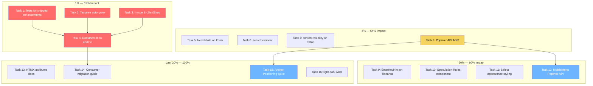

# SUPERB: Modern Browser Integration — Execution Plan

> **Date:** 2026-07-12 19:00 · **Status:** Planning
> **Goal:** Leverage every modern browser capability that delivers real value
> without verslimmbessern (making things worse while trying to improve them).

---

## Context: What We've Already Done

Two prior research + implementation sessions shipped 14 browser enhancements:

| #   | Enhancement                                                                  | Status     |
| --- | ---------------------------------------------------------------------------- | ---------- |
| 1   | Accordion → native `
`/`
` (26 lines JS eliminated)          | ✅ Shipped |
| 2   | Carousel → CSS scroll-snap (native touch/drag)                               | ✅ Shipped |
| 3   | `htmx.ViewTransitions()` helper component                                    | ✅ Shipped |
| 4   | CSS foundation (`@starting-style`, `::backdrop`, dialog/popover transitions) | ✅ Shipped |
| 5   | Image `decoding="async"` + `fetchpriority`                                   | ✅ Shipped |
| 6   | Input `enterkeyhint` auto-mapped per InputType                               | ✅ Shipped |
| 7   | Input `inputmode` auto-mapped per InputType                                  | ✅ Shipped |
| 8   | `text-wrap: balance` on headings, `pretty` on paragraphs                     | ✅ Shipped |
| 9   | `:user-valid`/`:user-invalid` CSS validation styling                         | ✅ Shipped |
| 10  | `.tc-auto-grow` utility (`field-sizing: content`)                            | ✅ Shipped |
| 11  | `interpolate-size: allow-keywords` (animate `height: auto`)                  | ✅ Shipped |
| 12  | `forced-colors` media query (Windows High Contrast a11y)                     | ✅ Shipped |
| 13  | `<meta name="color-scheme">` + `<link rel="preconnect">`                     | ✅ Shipped |
| 14  | `prefers-reduced-transparency` media query                                   | ✅ Shipped |

---

## Critical Finding: Popover API is Verslimmbessern Without Anchor Positioning

**The Popover API (`popover="auto"`) renders elements in the top layer with
`position: fixed; inset: 0; margin: auto`** — centered in the viewport.

Without CSS Anchor Positioning (not yet Baseline — Firefox 147+ and Safari 26+
are not released), there is **no way to position a popover relative to its
trigger button using CSS alone**. You'd need JavaScript `getBoundingClientRect()`

- scroll/resize listeners — which is **more JS than the current approach**.

**Conclusion:** Dropdown, Tooltip, Popover, and ContextMenu migrations to the
Popover API are **blocked on CSS Anchor Positioning reaching Baseline**. This
is estimated for late 2026 / early 2027.

The `<dialog>` migration for Modal/Drawer faces a similar issue: `<dialog
showModal()>` changes the rendering model, breaks consumer CSS selectors, and
the current focus trap works correctly. The migration is technically possible
but high-risk for marginal gain.

---

## Pareto Breakdown

### The 1% that delivers 51%

These are the highest-impact tasks that are completely safe (no breaking
changes, no architectural shifts):

| Task                                           | Why it's 1%                                          | Impact                                             |
| ---------------------------------------------- | ---------------------------------------------------- | -------------------------------------------------- |
| **Tests for all shipped enhancements**         | Without tests, the next person breaks these silently | Prevents regression of 14 features                 |
| **Textarea auto-grow** (apply `.tc-auto-grow`) | CSS utility exists, just needs integration           | Eliminates auto-resize JS in consumer apps         |
| **Image SrcSet/Sizes fields**                  | Add two string fields to ImageProps                  | Enables responsive images without Attrs workaround |
| **CHANGELOG + AGENTS.md + docs update**        | Document what shipped and why                        | Consumers discover and adopt new features          |

### The 4% that delivers 64%

Small, safe enhancements that round out the browser integration story:

| Task                                    | Why it matters                                                 |
| --------------------------------------- | -------------------------------------------------------------- |
| **`hx-validate` on Form**               | Enables HTML5 constraint validation before HTMX submit         |
| **`<search>` element**                  | Semantic landmark for search inputs (screen reader nav)        |
| **`content-visibility: auto` on Table** | 2-5x faster render for long tables (100+ rows)                 |
| **Popover API ADR**                     | Document WHY we didn't migrate (anchor positioning dependency) |

### The 20% that delivers 80%

Medium-effort tasks that add new capabilities:

| Task                                      | Why it matters                                        |
| ----------------------------------------- | ----------------------------------------------------- |
| **MobileMenu → Popover API**              | Full-screen overlay — doesn't need anchor positioning |
| **Speculation Rules component**           | Near-instant page navigation via prerendering         |
| **Select `appearance` styling**           | Custom dropdown arrow (currently browser default)     |
| **`EnterKeyHint` field on TextareaProps** | Chat apps need "send" on the keyboard                 |

### The other 20% (the last mile)

Documentation, investigation, and future preparation:

| Task                                 | Why it matters                                   |
| ------------------------------------ | ------------------------------------------------ |
| **HTMX attributes documentation**    | Document hx-preserve, hx-boost, hx-include, etc. |
| **Consumer migration guide**         | How to adopt the new browser features            |
| **Anchor Positioning spike**         | Prototype for when Baseline is reached           |
| **`light-dark()` investigation ADR** | Architectural assessment for v2.0                |

---

## Comprehensive Plan (30-100 min tasks)

Sorted by impact (desc), effort (asc), customer value (desc).

| #   | Task                                                      | Tier | Impact   | Effort | Customer Value               | Deps  |
| --- | --------------------------------------------------------- | ---- | -------- | ------ | ---------------------------- | ----- |
| 1   | Write tests for all 14 shipped browser enhancements       | 1%   | Critical | 90min  | Prevents regression          | —     |
| 2   | Integrate `field-sizing: content` into Textarea component | 1%   | High     | 30min  | Auto-growing textarea        | —     |
| 3   | Add `SrcSet` and `Sizes` fields to ImageProps             | 1%   | High     | 45min  | Responsive images            | —     |
| 4   | Update CHANGELOG, AGENTS.md, javascript-guide.md          | 1%   | High     | 60min  | Discoverability              | 1,2,3 |
| 5   | Add `hx-validate` attribute to Form component             | 4%   | Medium   | 30min  | HTML5 validation before HTMX | —     |
| 6   | Wrap search inputs in `<search>` element                  | 4%   | Medium   | 30min  | Semantic a11y landmark       | —     |
| 7   | Apply `content-visibility: auto` to Table body rows       | 4%   | Medium   | 45min  | Perf on large tables         | —     |
| 8   | Write ADR: Popover API blocked on Anchor Positioning      | 4%   | High     | 45min  | Prevents wasted effort       | —     |
| 9   | Add `EnterKeyHint` field to TextareaProps                 | 20%  | Low      | 30min  | Chat app UX                  | —     |
| 10  | Add Speculation Rules helper component                    | 20%  | Medium   | 60min  | Near-instant navigation      | —     |
| 11  | Style Select with `appearance-none` + custom arrow        | 20%  | Medium   | 60min  | Visual consistency           | —     |
| 12  | Migrate MobileMenu to Popover API                         | 20%  | Medium   | 90min  | Light dismiss, top-layer     | 8     |
| 13  | Document HTMX attributes (hx-preserve, hx-boost, etc.)    | 20%  | Low      | 60min  | Consumer education           | —     |
| 14  | Write consumer migration guide for browser features       | 20%  | Medium   | 60min  | Adoption                     | 4     |
| 15  | CSS Anchor Positioning spike + prototype                  | 20%  | Low      | 90min  | Future readiness             | 8     |
| 16  | `light-dark()` architectural assessment ADR               | 20%  | Low      | 45min  | v2.0 planning                | —     |

**Total estimated effort:** ~13.5 hours

---

## Detailed Breakdown (max 12 min tasks)

### Task 1: Tests for shipped enhancements (90 min → 8 subtasks)

| #    | Subtask                                                               | Time |
| ---- | --------------------------------------------------------------------- | ---- |
| 1.1  | Test Image emits `decoding="async"`                                   | 5min |
| 1.2  | Test Image emits `fetchpriority="high"` when Lazy=false               | 5min |
| 1.3  | Test Image emits `fetchpriority="low"` when Lazy=true                 | 5min |
| 1.4  | Test InputEmail emits `enterkeyhint="next"`                           | 5min |
| 1.5  | Test InputSearch emits `enterkeyhint="search"`                        | 5min |
| 1.6  | Test InputTel emits `inputmode="tel"`                                 | 5min |
| 1.7  | Test InputNumber emits `inputmode="decimal"`                          | 5min |
| 1.8  | Test Base layout emits `<meta name="color-scheme">`                   | 5min |
| 1.9  | Test Base layout emits `<link rel="preconnect">` when HTMXVersion set | 8min |
| 1.10 | Test Base layout omits preconnect when HTMXVersion empty              | 5min |
| 1.11 | Test htmxCDNOrigin extracts origin from default CDN                   | 5min |
| 1.12 | Test htmxCDNOrigin returns "" for relative path                       | 5min |
| 1.13 | Test ViewTransitions renders both script and style                    | 5min |
| 1.14 | Test ViewTransitions Global=false omits script                        | 5min |
| 1.15 | Test Accordion has zero `<script>` tags                               | 5min |
| 1.16 | Test Carousel track has `snap-x snap-mandatory` classes               | 5min |

### Task 2: Textarea auto-grow (30 min → 3 subtasks)

| #   | Subtask                                                    | Time  |
| --- | ---------------------------------------------------------- | ----- |
| 2.1 | Add `AutoGrow bool` field to TextareaProps (default true)  | 10min |
| 2.2 | Conditionally apply `tc-auto-grow` class in textarea.templ | 5min  |
| 2.3 | Write test: AutoGrow=true adds tc-auto-grow class          | 5min  |

### Task 3: Image SrcSet/Sizes (45 min → 5 subtasks)

| #   | Subtask                                                     | Time  |
| --- | ----------------------------------------------------------- | ----- |
| 3.1 | Add `SrcSet string` and `Sizes string` fields to ImageProps | 10min |
| 3.2 | Emit `srcset` attribute when SrcSet is non-empty            | 5min  |
| 3.3 | Emit `sizes` attribute when Sizes is non-empty              | 5min  |
| 3.4 | Update Image doc comment to document SrcSet/Sizes           | 5min  |
| 3.5 | Write tests for srcset/sizes rendering                      | 10min |

### Task 4: Documentation update (60 min → 6 subtasks)

| #   | Subtask                                                       | Time  |
| --- | ------------------------------------------------------------- | ----- |
| 4.1 | Add CHANGELOG [Unreleased] entry for all browser enhancements | 10min |
| 4.2 | Update AGENTS.md with enterkeyhint/inputmode convention       | 10min |
| 4.3 | Update AGENTS.md with field-sizing/interpolate-size notes     | 10min |
| 4.4 | Update AGENTS.md with preconnect/color-scheme meta notes      | 10min |
| 4.5 | Update javascript-guide.md with Popover API findings          | 10min |
| 4.6 | Update SKILL.md component count if changed                    | 10min |

### Task 5: hx-validate on Form (30 min → 3 subtasks)

| #   | Subtask                                         | Time  |
| --- | ----------------------------------------------- | ----- |
| 5.1 | Add `Validate bool` field to FormProps          | 10min |
| 5.2 | Emit `hx-validate="true"` when Validate is true | 5min  |
| 5.3 | Write test for hx-validate rendering            | 10min |

### Task 6: `<search>` element (30 min → 3 subtasks)

| #   | Subtask                                              | Time  |
| --- | ---------------------------------------------------- | ----- |
| 6.1 | Add `Search bool` field to InputProps                | 10min |
| 6.2 | Wrap input in `<search>` element when Search is true | 10min |
| 6.3 | Write test for `<search>` element rendering          | 10min |

### Task 7: content-visibility on Table (45 min → 4 subtasks)

| #   | Subtask                                                               | Time  |
| --- | --------------------------------------------------------------------- | ----- |
| 7.1 | Add `VirtualScroll bool` field to TableProps                          | 10min |
| 7.2 | Apply `tc-content-auto` class to `<tbody>` when VirtualScroll is true | 10min |
| 7.3 | Update Table doc comment                                              | 5min  |
| 7.4 | Write test for content-visibility class                               | 10min |

### Task 8: Popover API ADR (45 min → 4 subtasks)

| #   | Subtask                                                         | Time  |
| --- | --------------------------------------------------------------- | ----- |
| 8.1 | Write ADR 0014: Popover API blocked on Anchor Positioning       | 12min |
| 8.2 | Document the top-layer positioning constraint                   | 10min |
| 8.3 | Document the migration path when anchor positioning is Baseline | 10min |
| 8.4 | Cross-reference from research docs                              | 5min  |

### Task 9: EnterKeyHint on TextareaProps (30 min → 3 subtasks)

| #   | Subtask                                          | Time  |
| --- | ------------------------------------------------ | ----- |
| 9.1 | Add `EnterKeyHint string` field to TextareaProps | 10min |
| 9.2 | Emit `enterkeyhint` attribute when set           | 5min  |
| 9.3 | Write test                                       | 10min |

### Task 10: Speculation Rules component (60 min → 6 subtasks)

| #    | Subtask                                                       | Time  |
| ---- | ------------------------------------------------------------- | ----- |
| 10.1 | Create `htmx/speculation_rules.go` with SpeculationRulesProps | 12min |
| 10.2 | Create `htmx/speculation_rules.templ` template                | 12min |
| 10.3 | Support eagerness: immediate, moderate, conservative          | 10min |
| 10.4 | Support URL list vs selector-based rules                      | 10min |
| 10.5 | Add DefaultSpeculationRulesProps()                            | 5min  |
| 10.6 | Write tests                                                   | 12min |

### Task 11: Select appearance styling (60 min → 5 subtasks)

| #    | Subtask                                                 | Time  |
| ---- | ------------------------------------------------------- | ----- |
| 11.1 | Add `appearance-none` to Select input class             | 10min |
| 11.2 | Add custom chevron SVG as background or sibling element | 12min |
| 11.3 | Ensure dark mode arrow color matches existing pattern   | 10min |
| 11.4 | Update golden test for Select                           | 10min |
| 11.5 | Write test for custom arrow presence                    | 10min |

### Task 12: MobileMenu → Popover API (90 min → 8 subtasks)

| #    | Subtask                                                   | Time  |
| ---- | --------------------------------------------------------- | ----- |
| 12.1 | Change menu container to use `popover="manual"` attribute | 12min |
| 12.2 | Change toggle button to use `popovertarget`               | 10min |
| 12.3 | Override default popover styles (position, inset, margin) | 12min |
| 12.4 | Remove the old toggle JS singleton                        | 10min |
| 12.5 | Update all MobileMenu tests                               | 12min |
| 12.6 | Update golden tests if they exist                         | 10min |
| 12.7 | Verify CSP nonce compliance                               | 10min |
| 12.8 | Test in integration CSP nonce test                        | 12min |

### Task 13: HTMX attributes documentation (60 min → 5 subtasks)

| #    | Subtask                                               | Time  |
| ---- | ----------------------------------------------------- | ----- |
| 13.1 | Create `docs/htmx-attributes-guide.md`                | 12min |
| 13.2 | Document hx-preserve (keep element across swaps)      | 10min |
| 13.3 | Document hx-boost (progressive enhancement for links) | 10min |
| 13.4 | Document hx-include, hx-params, hx-encoding           | 12min |
| 13.5 | Document hx-disable-elt, hx-history                   | 10min |

### Task 14: Consumer migration guide (60 min → 5 subtasks)

| #    | Subtask                                                             | Time  |
| ---- | ------------------------------------------------------------------- | ----- |
| 14.1 | Create `docs/migration/browser-enhancements.md`                     | 12min |
| 14.2 | Document how to enable View Transitions                             | 10min |
| 14.3 | Document the CSS utilities available (.tc-auto-grow, etc.)          | 10min |
| 14.4 | Document enterkeyhint/inputmode auto-mapping                        | 10min |
| 14.5 | Document performance features (preconnect, decoding, fetchpriority) | 12min |

### Task 15: Anchor Positioning spike (90 min → 6 subtasks)

| #    | Subtask                                               | Time  |
| ---- | ----------------------------------------------------- | ----- |
| 15.1 | Create spike branch `spike/anchor-positioning`        | 5min  |
| 15.2 | Prototype Dropdown with anchor-name + position-anchor | 12min |
| 15.3 | Prototype Tooltip with position-area + flip-block     | 12min |
| 15.4 | Test in Chrome (has support since 125)                | 10min |
| 15.5 | Document findings + remaining gaps                    | 12min |
| 15.6 | Write ADR with go/no-go recommendation                | 12min |

### Task 16: light-dark() ADR (45 min → 4 subtasks)

| #    | Subtask                                                 | Time  |
| ---- | ------------------------------------------------------- | ----- |
| 16.1 | Assess scope: how many components would change          | 12min |
| 16.2 | Evaluate compatibility with Tailwind v4 utility classes | 10min |
| 16.3 | Prototype on one component (Badge)                      | 12min |
| 16.4 | Write ADR with recommendation                           | 10min |

---

## Execution Graph

---

## What We Are NOT Doing (and Why)

| Rejected Task                   | Reason                                                                                                                                                                                                                        |
| ------------------------------- | ----------------------------------------------------------------------------------------------------------------------------------------------------------------------------------------------------------------------------- |
| Dropdown → Popover API          | **Verslimmbessern**: Top-layer rendering breaks `position: absolute` trigger-relative positioning. Would need JS `getBoundingClientRect()` — more JS than current approach. Blocked on CSS Anchor Positioning (not Baseline). |
| Tooltip → Popover API           | Same as Dropdown — trigger-relative positioning requires anchor positioning.                                                                                                                                                  |
| Popover component → Popover API | Same — absolute positioning relative to trigger button is lost.                                                                                                                                                               |
| ContextMenu → Popover API       | Needs cursor-position rendering — even harder without anchor positioning.                                                                                                                                                     |
| Modal → `<dialog>`              | Massive HTML structure change. Current focus trap works. `::backdrop` can't use Tailwind classes. `showModal()` requires JS (no declarative open). High risk, marginal gain.                                                  |
| Drawer → `<dialog>`             | Same as Modal + side-panel positioning challenges.                                                                                                                                                                            |
| `light-dark()` migration        | Requires abandoning Tailwind utility classes for semantic CSS variables. Architectural shift for v2.0, not a patch.                                                                                                           |
| Declarative Shadow DOM          | Conflicts with Tailwind utility-class approach. Scoped styles per component would prevent consumer overrides.                                                                                                                 |

---

## Risk Assessment

| Risk                                                     | Probability | Impact | Mitigation                                                         |
| -------------------------------------------------------- | ----------- | ------ | ------------------------------------------------------------------ |
| MobileMenu Popover API breaks consumer CSS               | Medium      | High   | Override all default popover styles, test thoroughly               |
| Select appearance styling breaks on Safari               | Low         | Medium | Test on Safari, use `-webkit-appearance` fallback                  |
| Speculation Rules causes prerendering of sensitive pages | Medium      | High   | Default to `eagerness: moderate` (hover only), document exclusions |
| Textarea field-sizing breaks layout on older browsers    | Low         | Low    | Graceful degradation — falls back to static `rows`                 |
