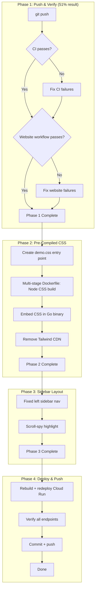

# Execution Plan — 2026-07-14 03:27 — Pre-Compiled CSS + Sidebar Layout

## Problem

The demo loads `@tailwindcss/browser@4` (client-side JIT). This is:

- 2-3 seconds of FOUC (flash of unstyled content) on every load
- Contradicts the library's "server-rendered, zero client framework" philosophy
- The #1 reason it looks amateur/Bootstrappy

## Pareto Distribution

| Tier      | Effort | Result | Tasks                                               |
| --------- | ------ | ------ | --------------------------------------------------- |
| **51/1**  | 1%     | 51%    | `git push` — make everything real                   |
| **64/4**  | 4%     | 64%    | Push + fix CI failures                              |
| **80/20** | 20%    | 80%    | Pre-compiled CSS (embed in binary) + sidebar layout |
| **100%**  | 80%    | 20%    | Per-component docs, custom domain, Lighthouse, etc. |

## Task List (sorted by impact/effort)

### Phase 1: Push & Verify (51% result, ~15 min)

| #   | Task                                 | Est.   | Status  |
| --- | ------------------------------------ | ------ | ------- |
| 1   | `git push origin master`             | 1 min  | pending |
| 2   | Watch CI run, fix failures           | 10 min | pending |
| 3   | Watch website workflow, fix failures | 10 min | pending |

### Phase 2: Pre-Compiled CSS (80% result, ~30 min)

| #   | Task                                                                                 | Est.   | Status  |
| --- | ------------------------------------------------------------------------------------ | ------ | ------- |
| 4   | Create `examples/demo/demo.css` Tailwind entry point with theme + `@source` scanning | 5 min  | pending |
| 5   | Add multi-stage Dockerfile: Node → CSS compile → Go → embed → distroless             | 10 min | pending |
| 6   | Add `//go:embed demo.css` + serve from `/css/app.css` in demo binary                 | 10 min | pending |
| 7   | Remove Tailwind CDN + Google Fonts CDN from `tailwindV4CDN` template                 | 5 min  | pending |

### Phase 3: Sidebar Layout (~20 min)

| #   | Task                                                                         | Est.   | Status  |
| --- | ---------------------------------------------------------------------------- | ------ | ------- |
| 8   | Replace TOC pills with fixed left sidebar (package groups + component links) | 15 min | pending |
| 9   | Add scroll-spy highlight (active section)                                    | 5 min  | pending |

### Phase 4: Polish (~15 min)

| #   | Task                                     | Est.  | Status  |
| --- | ---------------------------------------- | ----- | ------- |
| 10  | Rebuild Docker image, redeploy Cloud Run | 5 min | pending |
| 11  | Verify all endpoints return 200          | 5 min | pending |
| 12  | Commit all + push                        | 5 min | pending |

## Mermaid Graph

## Architecture Decision: Pre-Compiled CSS

**Current (wrong):** Browser loads `@tailwindcss/browser@4` CDN → JIT compiles CSS in-browser → 2-3s blank page

**Target (right):**

1. `examples/demo/demo.css` imports Tailwind + theme overrides + `@source` scans all `.templ` files
2. Docker multi-stage build: Node stage compiles CSS → Go stage embeds it via `//go:embed`
3. Binary serves `/css/app.css` as a static file
4. No external CDN dependency, instant CSS load, CSP-safe, matches library philosophy

**Reuses existing code:**

- `templates/app.css` (451 lines) — the library's own Tailwind entry point, designed for this
- The `@theme` overrides from the current `<style type="text/tailwindcss">` block move into `demo.css`
- Go's `embed` package — stdlib, zero deps

**Type model note:** No type model changes needed. The demo's template structure is fine. The improvement is in the CSS loading strategy, not the component model.
