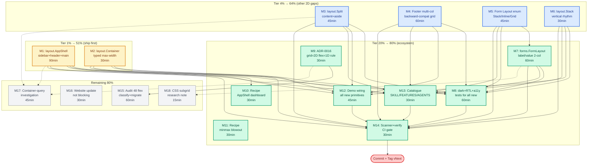

# SUPERB Execution Plan: Grid-First Layout Adoption

**Created:** 2026-07-20 22:51
**Scope:** Should templ-components use CSS Grid more for layouts? — Yes, surgically. Plan covers new 2D layout primitives, migration of mis-used flex, ADR, recipes, tests, and demo.
**Goal:** Close the page-level layout gap (currently zero layout primitives beyond `Base`/`Minimal`), codify "grid for 2D, flex for 1D" as a library rule, and make the #1 hand-rolled consumer pattern (sidebar+main app shell) a one-liner.
**North Star:** A consumer can build a full admin dashboard shell in 5 lines of templ, with dark mode, RTL, sticky header, mobile drawer, skip-link, and a11y all correct by default.

---

## Executive Summary

The library has 97 components across 9 packages, but the **`layout` package ships only `Base`, `Minimal`, `ThemeScript`, `ThemeToggle`, `Script`, `Stylesheet`** — six head/theme primitives and **zero body-layout primitives**. Every consumer rebuilds the same 2D patterns by hand:

- Sidebar + main app shell → hand-rolled `lg:grid-cols-[16rem_1fr]` or fragile `flex` with hardcoded widths
- Page content container → hand-rolled `
` (literally copy-pasted in `examples/demo/demo.templ:36`)
- Content + aside split → hand-rolled `grid md:grid-cols-3` with manual column spans
- Multi-column footer → `Footer` only renders a single brand+copyright row
- Settings forms with aligned labels → `Form.Inline` uses `flex flex-wrap` which breaks alignment when fields wrap to a second row

Meanwhile grid is already used **correctly** in 9 places (`display.Grid`, `DefinitionList`'s `grid-cols-[auto_1fr]`, `Calendar`'s 7-col day grid, demo responsive grids). The gap is not "we use grid wrong" — it's "we don't ship grid-based layout primitives at all."

**The 1% that delivers 51%:** Ship `layout.AppShell` + `layout.Container`. These two components eliminate the single most-rebuilt pattern in every consumer codebase and establish the layout-package convention every later primitive follows.

**The trap to avoid (VERSCHLIMMBESSER warning):** Do **not** "grid-ify" the 48 existing flex usages. Most are genuinely 1D (nav bars, button rows, chip wraps, vertical stacks) where flex is the correct tool. Blind migration would regress layout quality, not improve it. The rule is **grid = 2D, flex = 1D** — enforced by an ADR.

---

## Pareto Breakdown

### 1% that delivers 51% of the result

The two highest-leverage primitives. Ship these first and the library immediately covers the #1 hand-rolled consumer pattern.

| #   | Task                                                                                           | Impact                                                                                                                                                                                   | Effort |
| --- | ---------------------------------------------------------------------------------------------- | ---------------------------------------------------------------------------------------------------------------------------------------------------------------------------------------- | ------ |
| M1  | **`layout.AppShell`** — sidebar + sticky header + scrollable main, responsive mobile drawer    | Eliminates the single most-rebuilt pattern. Every consumer hand-rolls this. Native `<dialog>` Drawer reuse means zero new JS. `minmax(0,1fr)` baked in to prevent grid blowout.          | 90min  |
| M2  | **`layout.Container`** — typed max-width wrapper (SM/MD/LG/XL/Full/Prose) + responsive padding | Replaces the `max-w-6xl mx-auto px-4 sm:px-6 lg:px-8` snippet repeated in every demo and every consumer. Single source of truth for content width. Prose variant targets long-form docs. | 30min  |

### 4% that delivers 64% of the result

Above plus the other 2D layout gaps consumers currently hand-roll.

| #   | Task                                                                    | Impact                                                                                                                              | Effort |
| --- | ----------------------------------------------------------------------- | ----------------------------------------------------------------------------------------------------------------------------------- | ------ |
| M3  | **`layout.Split`** — 2-col content+aside (start/end aside, typed Ratio) | Covers the "main article + sidebar widget" / "detail + metadata" pattern. RTL-aware via logical CSS.                                | 45min  |
| M4  | **`navigation.Footer` → multi-column grid**                             | Add `Columns []FooterColumn` for link columns. Backward-compatible (empty = current single-row). Grid `grid-cols-2 md:grid-cols-4`. | 60min  |
| M5  | **`forms.Form.Inline` → grid** (add `Layout` enum: Stack/Inline/Grid)   | `flex flex-wrap` misaligns labels when fields wrap. Grid `sm:grid-cols-[auto_1fr]` keeps alignment. Deprecate `Inline bool` softly. | 45min  |
| M6  | **`layout.Stack`** — vertical rhythm component (typed Gap enum)         | Replaces repeated `space-y-6` / `space-y-4` strings. Single source of truth for vertical spacing.                                   | 30min  |

### 20% that delivers 80% of the result

Above plus the supporting ecosystem: aligned-label forms, comprehensive tests, the decision ADR, recipes, demo wiring, and catalogue updates.

| #   | Task                                                                                          | Impact                                                                                                                          | Effort |
| --- | --------------------------------------------------------------------------------------------- | ------------------------------------------------------------------------------------------------------------------------------- | ------ |
| M7  | **`forms.FormLayout`** — label/value 2-col grid (settings forms pattern)                      | Settings/admin forms with left-aligned labels. The "Settings page" use case from the catalogue becomes a one-liner.             | 60min  |
| M8  | **Dark-mode + RTL + a11y + contract tests** for all new grid components                       | Extends the existing failing-test enforcement net to the new primitives. Prevents regressions.                                  | 60min  |
| M9  | **ADR-0016 "Grid-first for 2D layouts"**                                                      | Codifies `grid = 2D, flex = 1D` rule. Prevents future Verschlimmbesserung. Reference from AGENTS.md.                            | 30min  |
| M10 | **Recipe: AppShell dashboard layout**                                                         | Copy-paste example for the #1 pattern. Add to recipe-index.                                                                     | 30min  |
| M11 | **Recipe: `minmax(0, 1fr)` grid blowout footgun**                                             | Documents the single most common grid bug. Required reading before anyone adds a new grid component.                            | 30min  |
| M12 | **Demo wiring** — AppShell + Container + Split + multi-col Footer demo sections               | Demo is the reference consumer. New primitives must be visible there. Also replace ad-hoc `max-w-6xl` in demo with `Container`. | 45min  |
| M13 | **Catalogue updates** — SKILL.md, FEATURES.md, AGENTS.md, component count bump                | Keeps docs honest. Drift-guard tests fail if SKILL count is stale (informational) — update anyway.                              | 30min  |
| M14 | **Scanner extensions** — dark-mode + motion-reduce regexes cover new classes; full verify run | Ensures new components satisfy existing CI gates. Last gate before commit.                                                      | 30min  |

### Remaining 80% (planned, lower priority)

| #   | Task                                                                                | Notes                                                                                                                                 |
| --- | ----------------------------------------------------------------------------------- | ------------------------------------------------------------------------------------------------------------------------------------- |
| M15 | **Audit existing 48 flex usages** — classify each as 1D-keep / 2D-migrate / unclear | Expected outcome: ~45 keep, ~3 migrate. Document keep-decisions in ADR-0016 appendix to prevent future churn.                         |
| M16 | **Website update** — add new primitives to website catalogue + homepage screenshots | When website is next rebuilt. Not blocking.                                                                                           |
| M17 | **Container-query-as-default investigation**                                        | `Grid.ContainerResponsive` is opt-in today. Decide whether other primitives (Split, AppShell sidebar) should default to `@container`. |
| M18 | **CSS subgrid research note**                                                       | `docs/research/css-subgrid.md` — track Baseline status. Enables true 2D alignment in Card/DefinitionList once Baseline 2025.          |

---

## Comprehensive Plan — Medium Granularity (30–100min tasks)

**Sorted by impact → effort → customer-value.** 18 tasks total.

| #   | Task                                                                                     | Tier      | Impact (1-5) | Effort | Customer Value                                        | Depends On |
| --- | ---------------------------------------------------------------------------------------- | --------- | ------------ | ------ | ----------------------------------------------------- | ---------- |
| M1  | `layout.AppShell` — sidebar+header+main, mobile drawer, `minmax(0,1fr)`                  | 1% → 51%  | 5            | 90min  | Eliminates #1 hand-rolled pattern in every consumer   | —          |
| M2  | `layout.Container` — typed max-width + responsive padding + Prose variant                | 1% → 51%  | 5            | 30min  | Replaces snippet repeated in every demo/consumer      | —          |
| M3  | `layout.Split` — 2-col content+aside, typed Ratio, RTL                                   | 4% → 64%  | 4            | 45min  | Article+sidebar / detail+metadata pattern             | —          |
| M4  | `navigation.Footer` multi-column grid (backward compatible)                              | 4% → 64%  | 3            | 60min  | Multi-column footer without forking                   | —          |
| M5  | `forms.Form` add `Layout` enum (Stack/Inline/Grid); deprecate `Inline bool`              | 4% → 64%  | 4            | 45min  | Fixes wrapped-row alignment bug in filter bars        | —          |
| M6  | `layout.Stack` — typed Gap enum, replaces `space-y-N` repetition                         | 4% → 64%  | 3            | 30min  | Consistent vertical rhythm across consumer apps       | —          |
| M7  | `forms.FormLayout` — 2-col label/value grid for settings forms                           | 20% → 80% | 4            | 60min  | Settings page becomes a one-liner                     | M5         |
| M8  | Dark-mode + RTL + a11y + contract tests for all new primitives                           | 20% → 80% | 5            | 60min  | Keeps the enforcement net honest                      | M1–M7      |
| M9  | ADR-0016 "Grid-first for 2D layouts" + AGENTS.md reference                               | 20% → 80% | 4            | 30min  | Prevents future Verschlimmbesserung                   | —          |
| M10 | Recipe: "AppShell dashboard layout" + recipe-index                                       | 20% → 80% | 3            | 30min  | Copy-paste onboarding for AppShell                    | M1         |
| M11 | Recipe: "minmax(0,1fr) grid blowout footgun" + recipe-index                              | 20% → 80% | 4            | 30min  | Prevents the #1 grid bug in consumer code             | —          |
| M12 | Demo: AppShell + Container + Split + multi-col Footer sections; replace ad-hoc max-w-6xl | 20% → 80% | 3            | 45min  | Demo is the reference consumer — must show primitives | M1–M4, M6  |
| M13 | Catalogue: SKILL.md + FEATURES.md + AGENTS.md + component count bump                     | 20% → 80% | 3            | 30min  | Docs honesty; drift-guard tests                       | M1–M7      |
| M14 | Scanner extensions + full verify (templ gen + build + test + lint)                       | 20% → 80% | 5            | 30min  | CI gate before commit                                 | M1–M13     |
| M15 | Audit 48 flex usages — classify keep/migrate; migrate clear 2D cases                     | remaining | 3            | 60min  | Consistency; documented decisions prevent churn       | M9         |
| M16 | Website catalogue + homepage screenshots                                                 | remaining | 2            | 30min  | Public presence; not blocking                         | M1–M7      |
| M17 | Container-query-as-default investigation + decision doc                                  | remaining | 2            | 45min  | Future-proofing; no urgency                           | M1–M3      |
| M18 | CSS subgrid research note (`docs/research/css-subgrid.md`)                               | remaining | 1            | 15min  | Track Baseline; future capability                     | —          |

**Totals:** 18 tasks, ~13h 15min medium-grain effort. Tier 1% = 2h, Tier 4% = 3h, Tier 20% = 5h 15min, Remaining = 2h 30min.

---

## Detailed Breakdown — Fine Granularity (≤12min tasks)

**Sorted by impact → effort → customer-value within each parent.** 75 subtasks total.

### Tier 1% → 51% (M1 + M2)

| #    | Subtask                                                                                                                                                                     | Parent | Effort |
| ---- | --------------------------------------------------------------------------------------------------------------------------------------------------------------------------- | ------ | ------ |
| F1.1 | Define `AppShellProps` + enums (`SidebarWidth`: SM/MD/LG/Auto; `Header`, `Sidebar`, `Content templ.Component`; `StickyHeader bool`; `MobileVariant`: Drawer/OffCanvas/None) | M1     | 12min  |
| F1.2 | Write `layout/appshell_types.go` skeleton + `DefaultAppShellProps()` + zero-value safety                                                                                    | M1     | 10min  |
| F1.3 | Write `layout/appshell.templ` — grid container `lg:grid-cols-[var(--tc-sidebar-w)_minmax(0,1fr)]`; CSS var in `templates/custom.css`                                        | M1     | 12min  |
| F1.4 | Mobile collapse: `<lg` hides sidebar; optional drawer toggle reuses existing `display.Drawer` (zero new JS)                                                                 | M1     | 12min  |
| F1.5 | Sticky header via `sticky top-0 z-40` on header slot; `min-h-dvh` on shell                                                                                                  | M1     | 8min   |
| F1.6 | Skip-link `<a href="#main-content">` + `<main id="main-content" tabindex="-1>` a11y wiring (WCAG 2.4.1)                                                                     | M1     | 10min  |
| F1.7 | Tests: render smoke, class assertions (grid-cols, minmax), dark-mode variant on every neutral, RTL mirror                                                                   | M1     | 12min  |
| F1.8 | Golden snapshot for AppShell                                                                                                                                                | M1     | 10min  |
| F2.1 | Define `ContainerProps` + `ContainerWidth` enum (SM/MD/LG/XL/Full/Prose) + lookup map + `IsValid()`                                                                         | M2     | 12min  |
| F2.2 | Write `layout/container.templ` + `DefaultContainerProps()` (default = LG)                                                                                                   | M2     | 10min  |
| F2.3 | Tests + golden + assert `Prose` variant emits `max-w-prose`                                                                                                                 | M2     | 8min   |

### Tier 4% → 64% (M3–M6)

| #    | Subtask                                                                                                                                                                               | Parent | Effort |
| ---- | ------------------------------------------------------------------------------------------------------------------------------------------------------------------------------------- | ------ | ------ |
| F3.1 | Define `SplitProps` (`Main`, `Aside templ.Component`; `AsidePosition`: Start/End; `SplitRatio`: 1_3, 1_4, 1_2)                                                                        | M3     | 12min  |
| F3.2 | Write `layout/split.templ` — `md:grid-cols-[minmax(0,2fr)_minmax(0,var(--aside))]`; logical `grid-template-areas` for RTL                                                             | M3     | 12min  |
| F3.3 | `DefaultSplitProps()` + `SplitRatioIsValid()` + `AsidePositionIsValid()`                                                                                                              | M3     | 8min   |
| F3.4 | Tests + golden + RTL mirror assertion                                                                                                                                                 | M3     | 12min  |
| F4.1 | Add `FooterColumn` type (`Title string; Links []FooterLink`) and `FooterLink` (`Text`, `Href`); extend `FooterProps` with `Columns []FooterColumn` + `BottomBar templ.Component` slot | M4     | 10min  |
| F4.2 | Backward-compat: when `len(Columns)==0`, render current single-row brand+copyright footer (existing callers unbroken)                                                                 | M4     | 10min  |
| F4.3 | Multi-col grid branch: `grid grid-cols-2 md:grid-cols-4 gap-8` + brand column + dark-mode classes                                                                                     | M4     | 12min  |
| F4.4 | Optional bottom bar row (legal links, copyright)                                                                                                                                      | M4     | 10min  |
| F4.5 | Tests: backward-compat golden + new multi-col golden + dark-mode compliance                                                                                                           | M4     | 12min  |
| F5.1 | Add `FormLayout` enum (`FormLayoutStack`/`FormLayoutInline`/`FormLayoutGrid`) + `Layout` field on `FormProps`                                                                         | M5     | 12min  |
| F5.2 | Grid layout: `grid grid-cols-1 sm:grid-cols-[auto_1fr] items-start gap-3`                                                                                                             | M5     | 10min  |
| F5.3 | Backward compat: `Inline==true` maps to `FormLayoutInline` (deprecated comment, no removal until v1.0)                                                                                | M5     | 8min   |
| F5.4 | Update `docs/recipes/horizontal-filter-bar.md` to mention Grid alternative + when to prefer it                                                                                        | M5     | 10min  |
| F6.1 | Define `StackProps` + `StackGap` enum (None/SM/MD/LG/XL) + lookup map (reuse `gridGapLookup` shape)                                                                                   | M6     | 10min  |
| F6.2 | Write `layout/stack.templ` — `
`                                                                                                                      | M6     | 10min  |
| F6.3 | Tests + golden + `StackGapIsValid()`                                                                                                                                                  | M6     | 10min  |

### Tier 20% → 80% (M7–M14)

| #     | Subtask                                                                                                                                                      | Parent | Effort |
| ----- | ------------------------------------------------------------------------------------------------------------------------------------------------------------ | ------ | ------ |
| F7.1  | Define `FormLayoutProps` (`Columns int`; `Gap GridGap`; `LabelPosition`: Top/Left; `Content templ.Component`)                                                | M7     | 12min  |
| F7.2  | Write `forms/form_layout.templ` grid wrapper                                                                                                                 | M7     | 12min  |
| F7.3  | Label-left variant: `grid grid-cols-[12rem_minmax(0,1fr)] gap-x-4 gap-y-3` (settings/admin pattern)                                                          | M7     | 10min  |
| F7.4  | `DefaultFormLayoutProps()` + `LabelPositionIsValid()`                                                                                                        | M7     | 8min   |
| F7.5  | Tests + golden + dark-mode + RTL                                                                                                                             | M7     | 12min  |
| F8.1  | Extend `utils.TestDarkModeCompliance` regex if any new neutral colors appear in new components                                                               | M8     | 10min  |
| F8.2  | Add `utils.TestRTLLogicalProperties` (new) — scan all new components for physical `ml-/mr-/left-/right-`                                                     | M8     | 12min  |
| F8.3  | Contract test: assert all new props structs embed `BaseProps` + satisfy `ComponentProps` interface                                                           | M8     | 10min  |
| F8.4  | Container-query test for `Split` (wrap in `@container` parent, assert layout shift)                                                                          | M8     | 10min  |
| F8.5  | Integration test: nonce propagation on any inline scripts in new components (expect none, but assert)                                                        | M8     | 10min  |
| F9.1  | Write `docs/adr/0016-grid-first-for-2d-layouts.md` (context: 0 layout primitives; decision: grid for 2D, flex for 1D; consequences: new primitive checklist) | M9     | 12min  |
| F9.2  | Reference ADR-0016 from `AGENTS.md` "Code Conventions" section + add "Grid = 2D, Flex = 1D" rule                                                             | M9     | 8min   |
| F9.3  | Add ADR-0016 to ADR index if one exists; else note in `docs/adr/README.md`                                                                                   | M9     | 5min   |
| F10.1 | Write `docs/recipes/appshell-dashboard-layout.md` (full example: SidebarNav + header + Container + Grid of StatCards)                                        | M10    | 12min  |
| F10.2 | Add row to `docs/recipes/recipe-index.md`                                                                                                                    | M10    | 5min   |
| F10.3 | Compile-test the example in the recipe (extract to a `_test.go` Example func)                                                                                | M10    | 10min  |
| F11.1 | Write `docs/recipes/grid-blowout-minmax.md` (before/after: `1fr` vs `minmax(0,1fr)` with a wide `<table>`)                                                   | M11    | 12min  |
| F11.2 | Code blocks showing the blowout repro + the fix                                                                                                              | M11    | 10min  |
| F11.3 | Add row to `docs/recipes/recipe-index.md`                                                                                                                    | M11    | 5min   |
| F12.1 | Add AppShell demo section in `examples/demo/layout_demo.templ` (new file)                                                                                    | M12    | 12min  |
| F12.2 | Replace ad-hoc `
` in `demo.templ` with `@layout.Container`                                               | M12    | 10min  |
| F12.3 | Add Split demo section                                                                                                                                       | M12    | 10min  |
| F12.4 | Add multi-column Footer demo section (showcases backward compat + new Columns)                                                                               | M12    | 10min  |
| F13.1 | Update `SKILL.md` "By use case" + "By package" tables with new primitives                                                                                    | M13    | 10min  |
| F13.2 | Update `FEATURES.md` with new components; bump count (97 → 103)                                                                                              | M13    | 8min   |
| F13.3 | Update `AGENTS.md` Module Structure table + Code Conventions with grid rule                                                                                  | M13    | 8min   |
| F13.4 | Bump `examples/demo/demo.templ` `componentCount` const (97 → 103)                                                                                            | M13    | 5min   |
| F14.1 | Extend `utils.TestMotionReduceCompliance` regex if new animations introduced (Stack: none expected)                                                          | M14    | 10min  |
| F14.2 | Extend `utils.TestSkillComponentCount` informational assertion with new count                                                                                | M14    | 10min  |
| F14.3 | Full verify: `find . -name '*_templ.go' -print0 \| xargs -0 rm && templ generate ./... && go build ./... && go test ./... && golangci-lint run ./...`        | M14    | 10min  |

### Remaining 80% (M15–M18)

| #     | Subtask                                                                                                                    | Parent | Effort |
| ----- | -------------------------------------------------------------------------------------------------------------------------- | ------ | ------ |
| F15.1 | Enumerate all 48 flex usages with classification (1D-keep / 2D-migrate / unclear) into a table                             | M15    | 15min  |
| F15.2 | Migrate clear 2D cases (expected: ~2-3 spots — likely `Form.Inline` already covered by M5, demo hero grid already correct) | M15    | 15min  |
| F15.3 | Document keep-decisions as appendix to ADR-0016 (prevents future "why is this flex not grid?" churn)                       | M15    | 15min  |
| F15.4 | Run tests + lint after any migration                                                                                       | M15    | 10min  |
| F16.1 | Add new primitives to website catalogue (when site is next rebuilt)                                                        | M16    | 15min  |
| F16.2 | Add AppShell screenshot to homepage (when site is next rebuilt)                                                            | M16    | 15min  |
| F17.1 | Audit which primitives would benefit from container-query default (Split, AppShell sidebar)                                | M17    | 15min  |
| F17.2 | Decision doc + recommendation (likely: keep viewport-default, opt-in container-query)                                      | M17    | 15min  |
| F17.3 | If approved, implement in follow-up (out of scope for this plan)                                                           | M17    | 15min  |
| F18.1 | Write `docs/research/css-subgrid.md` (current Baseline status, what it unlocks for Card/DefinitionList)                    | M18    | 12min  |

**Fine-grain totals:** 75 subtasks, ~13h 15min (matches medium grain — no effort inflation).

---

## Mermaid Execution Graph

**Critical path (longest dependency chain):** M5 → M7 → M8 → M14 → COMMIT (≈ 3h 45min). All Tier 1% work is unblocked and parallelizable from minute zero.

---

## Risk Register & Footguns

### The "VERSCHLIMMBESSER" risks (would make things worse)

| Risk                                                                                                                  | Mitigation                                                                                                                                                    |
| --------------------------------------------------------------------------------------------------------------------- | ------------------------------------------------------------------------------------------------------------------------------------------------------------- |
| **Blind flex→grid migration** of the 48 existing flex usages                                                          | ADR-0016 codifies "grid = 2D, flex = 1D". M15 explicitly classifies each usage; expected ~45 keep, ~3 migrate. No migration without classification.           |
| **Grid blowout** from bare `1fr` (wide `<table>`, long URL, `<pre>` blows out the grid → page-wide horizontal scroll) | Every new grid primitive uses `minmax(0, 1fr)`. Recipe M11 documents the footgun. ADR-0016 lists it as a mandatory rule for future grid components.           |
| **Breaking `Form.Inline` consumers** when adding `Layout` enum                                                        | F5.3: `Inline==true` maps to `FormLayoutInline`. Deprecation comment only, no removal until v1.0. Existing callers unchanged.                                 |
| **Breaking `Footer` consumers** when adding `Columns`                                                                 | F4.2: `len(Columns)==0` renders the current single-row footer. Zero behavioral change for existing callers.                                                   |
| **Mobile sidebar regression** (AppShell sidebar hidden on mobile with no way to opening it)                           | F1.4: reuses existing `display.Drawer` (`<dialog>` + `showModal()`). Zero new JS, native focus-trap + Escape. `MobileVariant: None` opt-out for simple sites. |
| **CSS var (`--tc-sidebar-w`) unset** → grid column collapses                                                          | F1.3: `templates/custom.css` defines the var with a default (`16rem`). Component also accepts typed `SidebarWidth` enum that emits inline style override.     |
| **Container `Prose` variant surprises** (consumer expects LG default)                                                 | F2.2: `DefaultContainerProps()` returns `LG`. Prose is opt-in via `Width: ContainerProse`.                                                                    |
| **RTL mirror breaks** on Split (aside on wrong side in `dir="rtl"`)                                                   | F3.2: uses `grid-template-areas` with logical names + `AsidePosition: Start/End` (not Left/Right). F8.2 adds a project-wide RTL scanner.                      |
| **AppShell sticky header z-index conflict** with Modal/Drawer (both use top-layer via `<dialog>`)                     | F1.5: header uses `z-40`. Native `<dialog>` renders in the top layer (above ALL `z-index`), so no conflict. Documented in AppShell godoc.                     |

### Non-blocking risks (acceptable tradeoffs)

| Risk                                     | Acceptance rationale                                                                                                            |
| ---------------------------------------- | ------------------------------------------------------------------------------------------------------------------------------- |
| Container-query not default              | Viewport-default is the safer baseline; container-query is opt-in via existing `Grid.ContainerResponsive` pattern. M17 decides. |
| CSS subgrid not yet Baseline             | Tracked in M18. Would unlock Card header/body/footer grid alignment. Future enhancement, not blocking.                          |
| `Form.Inline` deprecated but not removed | v1.0 is the removal target. Soft deprecation only — consumers get a comment, not a break.                                       |

---

## Verification Checklist

Before tagging the release that includes these primitives:

- [ ] `find . -name '*_templ.go' -print0 \| xargs -0 rm && templ generate ./... && go build ./...` (clean regen + build)
- [ ] `go test ./...` — all green, including new dark-mode + RTL + contract tests
- [ ] `golangci-lint run ./...` — zero findings (67-linter config)
- [ ] `go test ./utils/... -run TestDarkMode` — new components pass
- [ ] `go test ./utils/... -run TestMotionReduce` — new components pass
- [ ] `go test ./integration/... -run TestCSPNonce` — any inline scripts have nonce (expect none)
- [ ] `go test ./utils/... -run TestVersionMatches` — version bumped in lockstep (if releasing)
- [ ] Demo runs locally: `nix run .#build && ./result/bin/demo` then visit `/` — new sections visible
- [ ] Manual RTL check: add `dir="rtl"` to `<html>` in a test page — Split aside mirrors, AppShell sidebar moves to right
- [ ] Manual mobile check: resize to `<lg` width — AppShell sidebar collapses, drawer toggle works
- [ ] Manual grid-blowout check: put a wide `<table>` inside AppShell main — no horizontal scroll (proves `minmax(0,1fr)`)
- [ ] ADR-0016 merged and referenced from AGENTS.md
- [ ] Both recipes added to `docs/recipes/recipe-index.md`
- [ ] SKILL.md + FEATURES.md + AGENTS.md component count consistent
- [ ] `git status` clean before tag

---

## Out-of-Scope (explicitly deferred)

- **Modularize `layout` into its own Go module** — not warranted; layout has no special dependency boundary. Re-evaluate post-v1.0 if the package graph warrants.
- **Migrate existing `display.Grid` viewport-default to container-query-default** — M17 investigates; decision deferred to avoid churn.
- **Build a visual regression harness (Percy/Chromatic)** — orthogonal initiative; golden files remain the snapshot strategy.
- **Ship a `layout.CSSGrid` low-level primitive** (arbitrary `grid-template-columns` escape hatch) — premature; `props.Class` override covers custom cases. Add only when 2+ consumers ask.
- **Replace `display.Grid` internals with `layout.Stack` composition** — `display.Grid` is stable and widely used; no refactor needed.

---

## Glossary

- **2D layout** — both rows _and_ columns matter simultaneously (sidebar+main, content+aside, multi-col footer). Grid wins.
- **1D layout** — only one axis matters at a time (nav bar, button row, vertical stack). Flex wins.
- **Grid blowout** — when a grid column with `1fr` (not `minmax(0,1fr)`) is forced wider than its container by an overflowing child (wide table, long URL, `<pre>`). Causes page-wide horizontal scroll. The #1 grid footgun.
- **Logical CSS properties** — `ms-`/`me-`/`start-`/`end-`/`ps-`/`pe-` (Tailwind) which map to `margin-inline-start`/etc. Auto-mirror in `dir="rtl"`. Already the repo convention.
- **Container query** — `@container` / `@sm:` / `@lg:` variants that respond to _parent_ width, not viewport. Used by `Grid.ContainerResponsive`. More correct than viewport media queries for reusable components.
- **CSS subgrid** — `grid-template-columns: subgrid` lets a child inherit the parent's grid tracks. Enables true 2D alignment in nested components (e.g. Card header/body/footer sharing one column grid). Not yet Baseline; tracked in M18.
