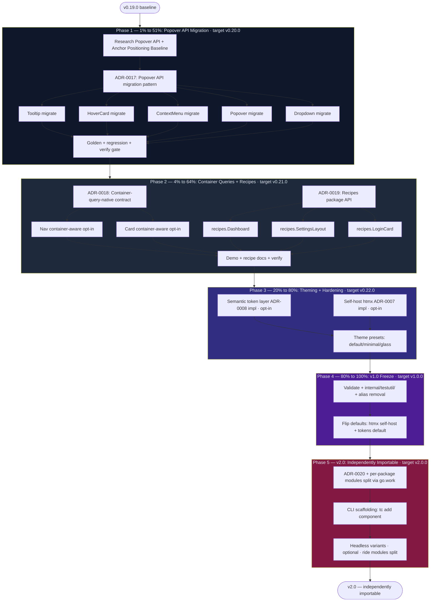

# Next-Level Platform-First Roadmap

**Created:** 2026-07-21 03:54 · **Horizon:** v0.20.0 → v2.0 · **Baseline:** v0.19.0 (98 components, 43 enums, 87 generated files)

> Strategic Pareto plan for pushing `templ-components` from "complete v0.x component library"
> to "platform-first, context-aware, independently-importable" — the differentiation that
> separates a good library from a category-defining one.
>
> This plan supersedes `2026-07-05_21-27_SUPERB-UI-LIBRARY-UPGRADES.md` and
> `2026-06-20_06-09_v1.0-readiness-and-code-quality.md`. Those plans were about _finishing_
> v0.x; this one is about what comes _after_.

---

## Executive Summary

The library is feature-saturated. 98 components, 43 typed enums, full RTL/dark/a11y/CSP coverage,
native `<dialog>` / `
` / scroll-snap / `field-sizing` migrations shipped. Adding more
components has diminishing returns. **The next level is not more features — it is structural
shifts that compound:**

1. **Popover API migration** — finish the "platform over JS" thesis (5 components, ~634 lines of
   templ + singleton JS → native `popover` attribute + CSS Anchor Positioning).
2. **Container-query-native components** — components that adapt to _where they are placed_, not
   to the viewport (the CSS answer to "composable components" without WASM/JS runtime).
3. **Composition `recipes/` package** — ship screens (Dashboard, Settings, Login), not just widgets.
4. **Semantic token layer + self-hosted HTMX** — theming without forking, privacy without CDN.
5. **v1.0 freeze**, then **per-package Go modules** (the "independently importable" win).

The user asked whether more JS/WASM is needed. The answer is the opposite: **less JS, more
platform.** Every migration we have already shipped (`<dialog>`, `
`, scroll-snap,
`field-sizing`, `accent-color`) deleted JS and improved quality. Popover API is the next domino.

---

## Current State Snapshot (v0.19.0)

| Pillar                | Status                                                                                                                                                     |
| --------------------- | ---------------------------------------------------------------------------------------------------------------------------------------------------------- |
| Components            | **98** across 9 packages (`display` 30, `forms` 21, `feedback` 13, `navigation` 12, `htmx` 8, `layout` 10, `errorpage` 4, `icons` 3, `utils` 0)            |
| Typed enums           | **43**, every one with `IsValid()` + test                                                                                                                  |
| Icons                 | **102** named SVGs, typed constants, RTL mirroring                                                                                                         |
| Generated files       | 87 `*_templ.go` (committed, library contract)                                                                                                              |
| Native-platform       | `<dialog>` Modal/Drawer, `
` Accordion, scroll-snap Carousel, `field-sizing` Textarea, `appearance: base-select`, `accent-color`, View Transitions |
| Residual singleton JS | Combobox, Copy, Tabs, Tooltip, Dropdown, Popover, ContextMenu, HoverCard, Image-fallback, Table-row-href, Toast-dismiss (~11 handlers)                     |
| Container queries     | `Grid.ContainerResponsive` opt-in only (1 component); all other responsive = viewport-keyed                                                                |
| Theming               | Raw Tailwind classes (`bg-blue-600`); semantic tokens designed in ADR-0008 but unimplemented                                                               |
| HTMX                  | CDN-default, self-host designed in ADR-0007 but unimplemented                                                                                              |
| Modules               | Single module; per-package split prototyped on unmerged `modularize/strategic-split` branch                                                                |

**What v0.19.0 just added:** `AppShell`, `Container`, `Split`, `Stack` (grid-first 2D layout
primitives, ADR-0016), `Footer` multi-column, `Form.Layout` enum. This roadmap builds directly
on that foundation — `AppShell` is the natural host for container-aware children.

---

## The Strategic Thesis

> **Stop adding components. Start removing JavaScript — and make the components that remain
> context-aware and individually adoptable.**

Three structural shifts, each enabled by a Baseline-2024 platform feature:

| Shift                  | Mechanism (native platform feature)  | Replaces                             |
| ---------------------- | ------------------------------------ | ------------------------------------ |
| Less JS                | Popover API + CSS Anchor Positioning | 5 singleton JS handlers (~400 lines) |
| Context-aware          | CSS Container Queries (`@container`) | Viewport-keyed `sm:`/`lg:` collapse  |
| Individually adoptable | Go modules + `go.work`               | Monolithic `go get` of 9 packages    |

WASM and a unified `tc-runtime.js` bundle were **explicitly rejected** (see
[Rejected Alternatives](#rejected-alternatives)): the first adds 50KB+ for problems CSS already
solves; the second saves <2KB and breaks the per-component CSP-audit story.

---

## Pareto Breakdown

### The 1% that delivers 51% — Popover API Migration (Phase 1)

**Why this is the single highest-leverage move:**

- It is the **completion of a thesis already proven 5 times** (`<dialog>`, `
`,
  scroll-snap, `field-sizing`, `accent-color`). Each prior migration deleted JS and raised
  quality. Popover API is the next domino — and the last big one.
- It is **bounded and low-risk**: 5 components, the team already did harder (`<dialog>`).
- It is **differentiating**: most component libraries still ship JS for dropdowns/menus. Native
  Popover + Anchor Positioning is "next level" — top-layer rendering, light-dismiss, focus
  management, all free.
- It **deletes fragile code**: the singleton-JS handlers for Dropdown/Popover/ContextMenu/
  HoverCard/Tooltip are the most CSP-audit-noisy part of the library.
- **Customer-visible signal**: cleaner demos, smaller CSP, snappier overlays.

**Scope:** `Tooltip`, `HoverCard`, `ContextMenu`, `Popover`, `Dropdown`. Partial groundwork
already exists — `[popover]::backdrop` is in `templates/custom.css:26`.

### The 4% that delivers 64% — Container Queries + Composition Recipes (Phase 2)

Adding **3% more effort** on top of Phase 1 buys the next **13% of result**:

- **Container-query-native** components. A `<Nav>` inside a sidebar shouldn't care about the
  viewport; it should care about its container. The pattern already exists
  (`Grid.ContainerResponsive`) — extend it to Nav, Card, Forms.Inline. This is the CSS-native
  answer to "composable components" the user was reaching for with WASM.
- **`recipes/` package** — `Dashboard()`, `SettingsLayout()`, `LoginCard()`. Users don't want
  widgets, they want screens. This is the single highest customer-value-per-line move in the
  whole plan. Resolves TODO #31 (deferred since v0.12).

### The 20% that delivers 80% — Theming + HTMX Hardening (Phase 3)

Adding **16% more effort** buys the next **16%** of result — production hardening:

- **Semantic token layer** (ADR-0008 implementation, opt-in first). Designers re-skin the whole
  library with `@theme { --color-tc-primary: ... }` — no Go changes, no fork. The #1 ask for
  any component library.
- **Self-hosted HTMX default** (ADR-0007 implementation). Removes CDN/CSP dependency, privacy,
  offline-capable, SRI not needed. Required for serious enterprise adoption.

### The last 20% (to 100%) — v1.0 Freeze + v2.0 Independence (Phases 4–5)

The unglamorous-but-mandatory work plus the breaking-change tier:

- **v1.0 freeze** (Phase 4): `Validate()` where it matters, `internal/testutil/` move, remove
  deprecated aliases (`AlertType`/`ToastType`/`FormProps.Inline`/`FamilyFromErrorFamily`), flip
  the defaults (htmx self-host becomes default, semantic tokens become default).
- **v2.0 independence** (Phase 5): per-package Go modules split (the "independently importable"
  win), CLI scaffolding tool (`tc add <component>`), optional headless variants ride on the
  modules split.

---

## Phase Plan — Mermaid Execution Graph

**Reading the graph:** Phase 1 is the gate — every later phase benefits from the cleaner overlay
story. Phase 2's `recipes/` package composes container-aware children inside `AppShell`. Phase 3
makes the recipes re-skinnable. Phase 4 freezes the API. Phase 5 breaks it for the right reason.

---

## Comprehensive Plan — Medium Granularity (30–100 min per task)

> **27 tasks.** Sorted within each phase by **impact × customer-value / effort**.
> Columns: **ID** (phase.sequence) · **Task** · **Min** (effort) · **Imp** (impact 1–5) · **Risk** (1–5, 5 = high) · **Deps** · **Target release**

### Phase 1 — Popover API Migration (1% → 51%)

| ID  | Task                                                                                          | Min | Imp | Risk | Deps | Target  |
| --- | --------------------------------------------------------------------------------------------- | --- | --- | ---- | ---- | ------- |
| 1.1 | Research: Popover API + CSS Anchor Positioning baseline matrix; decide fallback strategy      | 45  | 5   | 1    | —    | v0.20.0 |
| 1.2 | Write ADR-0017 "Popover API + Anchor Positioning migration" (pattern, fallback, CSP)          | 60  | 5   | 1    | 1.1  | v0.20.0 |
| 1.3 | Migrate `Tooltip` to `popover="manual"` + `popovertarget`; delete singleton JS                | 90  | 5   | 3    | 1.2  | v0.20.0 |
| 1.4 | Migrate `HoverCard` to `popover="manual"` hover/focus triggers (CSS `:hover`/`:focus-within`) | 60  | 5   | 3    | 1.2  | v0.20.0 |
| 1.5 | Migrate `ContextMenu` to `popover="auto"` + right-click `popovertarget` action                | 90  | 5   | 4    | 1.2  | v0.20.0 |
| 1.6 | Migrate `Popover` component to `popover="auto"` + `popovertarget`; delete singleton JS        | 60  | 5   | 3    | 1.2  | v0.20.0 |
| 1.7 | Migrate `Dropdown` to `popover="auto"`; keep keyboard nav via `
`-style or thin JS    | 90  | 5   | 4    | 1.2  | v0.20.0 |
| 1.8 | Update golden files, regression tests, dark-mode goldens; full verify gate; CHANGELOG entry   | 60  | 5   | 2    | all  | v0.20.0 |

### Phase 2 — Container Queries + Recipes (4% → 64%)

| ID  | Task                                                                                           | Min | Imp | Risk | Deps    | Target  |
| --- | ---------------------------------------------------------------------------------------------- | --- | --- | ---- | ------- | ------- |
| 2.1 | Write ADR-0018 "Container-query-native contract" (opt-in flag pattern, naming, test approach)  | 60  | 4   | 1    | —       | v0.21.0 |
| 2.2 | `Nav.ContainerAware bool` — collapse-to-burger by container width via `@container` + `@sm:`    | 90  | 4   | 3    | 2.1     | v0.21.0 |
| 2.3 | `Card.ContainerAware bool` — compact/normal padding by container width                         | 60  | 3   | 2    | 2.1     | v0.21.0 |
| 2.4 | Write ADR-0019 "`recipes/` package: composition screens, not widgets" (API, deps, slot model)  | 60  | 5   | 1    | —       | v0.21.0 |
| 2.5 | Implement `recipes.Dashboard(RecipeDashboardProps)` — AppShell + StatCards grid + Charts slots | 90  | 5   | 2    | 2.4     | v0.21.0 |
| 2.6 | Implement `recipes.SettingsLayout()` — Split + Tabs + Form.Grid                                | 60  | 4   | 2    | 2.4     | v0.21.0 |
| 2.7 | Implement `recipes.LoginCard()` — Card + Form.Stack + OAuth slots                              | 45  | 4   | 2    | 2.4     | v0.21.0 |
| 2.8 | Wire recipes into demo site; write `docs/recipes/*.md`; verify gate                            | 60  | 4   | 2    | 2.5–2.7 | v0.21.0 |

### Phase 3 — Theming + Hardening (20% → 80%)

| ID  | Task                                                                                          | Min | Imp | Risk | Deps | Target  |
| --- | --------------------------------------------------------------------------------------------- | --- | --- | ---- | ---- | ------- |
| 3.1 | Implement semantic token layer (ADR-0008) opt-in: `bg-tc-primary` etc. + `@theme` mapping doc | 90  | 5   | 3    | —    | v0.22.0 |
| 3.2 | Implement self-hosted HTMX (ADR-0007): vendor htmx.min.js, SRI optional, CDN opt-in flag      | 60  | 4   | 2    | —    | v0.22.0 |
| 3.3 | Ship 3 theme presets as CSS files (`default`, `minimal`, `glass`) + `docs/theming.md`         | 60  | 4   | 2    | 3.1  | v0.22.0 |

### Phase 4 — v1.0 Freeze (80% → 100%)

| ID  | Task                                                                                                                                                | Min | Imp | Risk | Deps          | Target |
| --- | --------------------------------------------------------------------------------------------------------------------------------------------------- | --- | --- | ---- | ------------- | ------ |
| 4.1 | Add `Validate() error` to `errorpage.ErrorPageProps` (scoped per TODO #62); move test helpers to `internal/testutil/` (TODO #34, behind re-exports) | 90  | 4   | 3    | —             | v1.0.0 |
| 4.2 | Remove deprecated aliases (`AlertType`, `ToastType`, `FamilyFromErrorFamily`, `FormProps.Inline`, `ModalSizeFull`, `DrawerFull`)                    | 45  | 3   | 4    | 4.1           | v1.0.0 |
| 4.3 | Flip defaults: HTMX self-host becomes default (CDN opt-in); semantic tokens become default                                                          | 60  | 4   | 5    | 3.1, 3.2, 4.2 | v1.0.0 |
| 4.4 | Add docs-health CI gate (TODO #61); fix release.sh follow-ups (#65, #66); gofmt → gofumpt (#67)                                                     | 60  | 3   | 2    | —             | v1.0.0 |

### Phase 5 — v2.0 Independently Importable

| ID  | Task                                                                                                    | Min | Imp | Risk | Deps | Target  |
| --- | ------------------------------------------------------------------------------------------------------- | --- | --- | ---- | ---- | ------- |
| 5.1 | Audit import graph; write ADR-0020 "Per-package modules split" (module boundaries, go.work, re-exports) | 60  | 5   | 2    | 4.3  | v2.0.0  |
| 5.2 | Execute modules split: leaf packages first (`utils`, `icons`), then dependents; update CI               | 90  | 5   | 5    | 5.1  | v2.0.0  |
| 5.3 | Build CLI scaffolding tool `tc add <component>` (Go binary, copies .templ + props + types)              | 90  | 4   | 3    | 5.2  | v2.0.0  |
| 5.4 | Headless/unstyled variants spike (Radix-style) — opt-in per component, rides modules split              | 45  | 3   | 4    | 5.2  | v2.0.0+ |

**Phase totals:** P1 = 555min · P2 = 525min · P3 = 210min · P4 = 255min · P5 = 285min · **Grand total ≈ 30.5 hours of focused work** (excluding review/release overhead).

---

## Detailed Breakdown — Fine Granularity (≤ 12 min per task)

> **Every medium task decomposed.** Sorted within each medium task by execution order.
> **Verify** column = how to confirm the task is done (not just "ran tests").
> Effort is the _median_ expected time; budget 1.5× for unfamiliar territory.

### Phase 1 — Popover API Migration

#### 1.1 Research Popover API + Anchor Positioning (45min)

| ID    | Task                                                                                          | Min | Verify                                           |
| ----- | --------------------------------------------------------------------------------------------- | --- | ------------------------------------------------ |
| 1.1.1 | Fetch MDN Baseline data for `popover` attribute; record versions (Chrome/Safari/Firefox)      | 8   | Notes in `docs/research/popover-api.md`          |
| 1.1.2 | Fetch MDN Baseline data for CSS Anchor Positioning (`anchor-name`, `position-area`)           | 8   | Same research note                               |
| 1.1.3 | Decide fallback: progressive enhancement (Anchor) vs. tiny JS positioner vs. CSS-only `inset` | 10  | Decision written in research note with rationale |
| 1.1.4 | Audit current `[popover]::backdrop` CSS in `templates/custom.css:26` for reuse                | 6   | Note: reuse or rewrite                           |
| 1.1.5 | Inventory the 5 components' current singleton-JS line counts + behaviors                      | 10  | Table in research note                           |

#### 1.2 Write ADR-0017 (60min)

| ID    | Task                                                                                     | Min | Verify                        |
| ----- | ---------------------------------------------------------------------------------------- | --- | ----------------------------- |
| 1.2.1 | Create `docs/adr/0017-popover-api-migration.md` skeleton (Context/Decision/Consequences) | 6   | File exists with sections     |
| 1.2.2 | Document the `popover="auto"` vs `popover="manual"` decision per component               | 10  | Table: component → mode → why |
| 1.2.3 | Document `popovertarget` trigger pattern + light-dismiss behavior                        | 10  | Code example in ADR           |
| 1.2.4 | Document Anchor Positioning pattern + fallback for non-supporting browsers               | 10  | Code example + fallback       |
| 1.2.5 | Document CSP implications (no inline JS needed for show/hide) + nonce removal            | 8   | CSP section                   |
| 1.2.6 | Document migration order + per-component rollback plan                                   | 6   | Checklist                     |

#### 1.3 Migrate Tooltip (90min)

| ID    | Task                                                                                              | Min | Verify                                     |
| ----- | ------------------------------------------------------------------------------------------------- | --- | ------------------------------------------ |
| 1.3.1 | Read `display/tooltip.templ` + `tooltip_test.go` + golden files fully                             | 8   | Mental model documented                    |
| 1.3.2 | Rewrite `tooltip.templ`: `popover="manual"` on tooltip div, `popovertarget` on trigger            | 12  | `templ generate` succeeds                  |
| 1.3.3 | Replace JS show/hide with CSS `:hover`/`:focus-within` (HoverCard-style) or `popovertarget` event | 12  | Manual click test                          |
| 1.3.4 | Delete `tcTooltipAttached` singleton from `display/shared.go`                                     | 6   | grep finds no references                   |
| 1.3.5 | Update `tooltip_test.go` assertions for new attribute shape                                       | 12  | `go test ./display/... -run Tooltip` green |
| 1.3.6 | Regenerate golden files (`go test -update`); inspect diff                                         | 10  | Golden diff shows only intentional changes |
| 1.3.7 | Update dark golden + RTL golden                                                                   | 8   | Both pass                                  |
| 1.3.8 | Verify CSP nonce test still passes (tooltip no longer in inline-script set)                       | 6   | `go test ./integration/... -run CSP` green |
| 1.3.9 | Run `golangci-lint run ./display/...`                                                             | 6   | 0 findings                                 |

#### 1.4 Migrate HoverCard (60min)

| ID    | Task                                                                                                | Min | Verify                    |
| ----- | --------------------------------------------------------------------------------------------------- | --- | ------------------------- |
| 1.4.1 | Read `hover_card.templ` fully; HoverCard is already mostly CSS (`:hover`/`:focus-within`) — confirm | 8   | Notes                     |
| 1.4.2 | Add `popover="manual"` + `popovertarget` to formalize top-layer + focus                             | 12  | `templ generate` succeeds |
| 1.4.3 | Remove any residual JS for positioning                                                              | 8   | grep clean                |
| 1.4.4 | Update tests + golden                                                                               | 12  | Tests green               |
| 1.4.5 | Verify 4 positions still render correctly via Anchor or CSS `inset`                                 | 10  | Manual test each position |
| 1.4.6 | Lint + CSP nonce test                                                                               | 10  | Both green                |

#### 1.5 Migrate ContextMenu (90min)

| ID    | Task                                                                                                          | Min | Verify                               |
| ----- | ------------------------------------------------------------------------------------------------------------- | --- | ------------------------------------ |
| 1.5.1 | Read `context_menu.templ` + singleton JS fully                                                                | 10  | Notes                                |
| 1.5.2 | Rewrite: `popover="auto"` on menu; trigger via `contextmenu` event → `el.showPopover()` (small JS, ~10 lines) | 12  | `templ generate` succeeds            |
| 1.5.3 | Position menu at `event.clientX/Y` via `inset` style or Anchor Positioning                                    | 12  | Right-click test positions correctly |
| 1.5.4 | Delete `tcContextMenuAttached` singleton; replace with thin per-instance handler                              | 10  | grep clean                           |
| 1.5.5 | Update tests (role=menu, Escape dismiss now native, click-outside now native)                                 | 12  | Tests green                          |
| 1.5.6 | Regenerate golden + dark golden                                                                               | 10  | Goldens pass                         |
| 1.5.7 | Lint + CSP nonce test                                                                                         | 8   | Both green                           |
| 1.5.8 | Verify keyboard nav (Arrow/Escape) still works                                                                | 8   | Manual test                          |

#### 1.6 Migrate Popover component (60min)

| ID    | Task                                                            | Min | Verify                    |
| ----- | --------------------------------------------------------------- | --- | ------------------------- |
| 1.6.1 | Read `popover.templ` (the component, not the API) fully         | 8   | Notes                     |
| 1.6.2 | Rewrite to `popover="auto"` + `popovertarget` on trigger button | 12  | `templ generate` succeeds |
| 1.6.3 | Delete `tcPopoverAttached` singleton                            | 6   | grep clean                |
| 1.6.4 | Verify 4 positions via Anchor Positioning or CSS fallback       | 12  | Manual test 4 positions   |
| 1.6.5 | Update tests + golden                                           | 12  | Tests green               |
| 1.6.6 | Lint + CSP nonce test                                           | 10  | Both green                |

#### 1.7 Migrate Dropdown (90min) — hardest

| ID    | Task                                                                            | Min | Verify                    |
| ----- | ------------------------------------------------------------------------------- | --- | ------------------------- |
| 1.7.1 | Read `dropdown.templ` (225 lines) + singleton JS fully                          | 12  | Notes                     |
| 1.7.2 | Rewrite: `popover="auto"` on menu; trigger button uses `popovertarget`          | 12  | `templ generate` succeeds |
| 1.7.3 | Preserve keyboard nav (Arrow/Tab/Home/End) — thin JS handler on menu, ~30 lines | 12  | Manual keyboard test      |
| 1.7.4 | Handle RTL key mapping (ArrowLeft/Right swap) — reuse Tabs pattern              | 8   | RTL manual test           |
| 1.7.5 | Delete `tcDropdownAttached` singleton; replace with thin handler                | 10  | grep clean                |
| 1.7.6 | Update tests for new attribute shape + native light-dismiss                     | 12  | Tests green               |
| 1.7.7 | Regenerate golden + dark golden                                                 | 10  | Goldens pass              |
| 1.7.8 | Lint + CSP nonce test                                                           | 8   | Both green                |
| 1.7.9 | Verify click-outside + Escape dismiss are now native (delete JS for those)      | 6   | Manual test               |

#### 1.8 Verify gate + release (60min)

| ID    | Task                                                                             | Min | Verify                            |
| ----- | -------------------------------------------------------------------------------- | --- | --------------------------------- |
| 1.8.1 | Run full verify: `nix run .#verify` (generate + build + test + lint)             | 12  | All green                         |
| 1.8.2 | Update `integration/csp_nonce_test.go` — assert removed JS no longer needs nonce | 10  | Test passes, fewer inline scripts |
| 1.8.3 | Update CHANGELOG `[Unreleased]` with Popover API migration notes                 | 10  | Entry warm                        |
| 1.8.4 | Update FEATURES.md + AGENTS.md component/platform rows                           | 8   | Counts consistent                 |
| 1.8.5 | Manual smoke test all 5 components in demo site (light + dark + RTL)             | 12  | No regressions                    |
| 1.8.6 | Run `scripts/release.sh 0.20.0` (or next patch)                                  | 8   | Tag created, not pushed           |

### Phase 2 — Container Queries + Recipes

#### 2.1 Write ADR-0018 Container-Query-Native Contract (60min)

| ID    | Task                                                                                        | Min | Verify                 |
| ----- | ------------------------------------------------------------------------------------------- | --- | ---------------------- |
| 2.1.1 | Document the `ContainerAware bool` opt-in flag pattern (mirrors `Grid.ContainerResponsive`) | 10  | Pattern in ADR         |
| 2.1.2 | Document `@container` wrapper emission + Tailwind `@sm:`/`@md:`/`@lg:` variant usage        | 10  | Code example           |
| 2.1.3 | Document test approach: wrap component in fixed-width `
` in test                       | 8   | Test helper documented |
| 2.1.4 | Document RTL behavior (container queries are direction-agnostic — verify)                   | 6   | Note                   |
| 2.1.5 | Document migration criterion: when to add `ContainerAware` (decision tree)                  | 10  | Decision tree in ADR   |
| 2.1.6 | Document interaction with `AppShell` (sidebar → main = container)                           | 8   | Note                   |

#### 2.2 Nav Container-Aware (90min)

| ID    | Task                                                                      | Min | Verify                          |
| ----- | ------------------------------------------------------------------------- | --- | ------------------------------- |
| 2.2.1 | Read `navigation/nav.templ` fully; identify viewport-based collapse logic | 12  | Notes                           |
| 2.2.2 | Add `NavProps.ContainerAware bool`; emit `@container` wrapper when set    | 12  | `templ generate` succeeds       |
| 2.2.3 | Replace `lg:` collapse with `@lg:` collapse when `ContainerAware`         | 12  | Manual test in narrow container |
| 2.2.4 | Verify default behavior unchanged (viewport-based) when flag off          | 8   | Backward-compat test green      |
| 2.2.5 | Add tests: container narrow → burger; container wide → full nav           | 12  | Tests green                     |
| 2.2.6 | Update golden + docs                                                      | 10  | Goldens pass                    |
| 2.2.7 | Lint                                                                      | 6   | 0 findings                      |

#### 2.3 Card Container-Aware (60min)

| ID    | Task                                                                     | Min | Verify                    |
| ----- | ------------------------------------------------------------------------ | --- | ------------------------- |
| 2.3.1 | Read `card.templ` padding logic                                          | 8   | Notes                     |
| 2.3.2 | Add `CardProps.ContainerAware bool` → compact padding below `@sm:` width | 12  | `templ generate` succeeds |
| 2.3.3 | Tests + golden                                                           | 12  | Tests green               |
| 2.3.4 | Document in FEATURES.md                                                  | 6   | Updated                   |
| 2.3.5 | Lint                                                                     | 6   | 0 findings                |

#### 2.4 Write ADR-0019 Recipes Package (60min)

| ID    | Task                                                                                             | Min | Verify                  |
| ----- | ------------------------------------------------------------------------------------------------ | --- | ----------------------- |
| 2.4.1 | Decide package name (`recipes` vs `layouts` vs `screens`) — `recipes` wins (shadcn precedent)    | 8   | Decision in ADR         |
| 2.4.2 | Decide deps: `recipes` may import any display/forms/layout/navigation (it's a composition layer) | 10  | Import graph documented |
| 2.4.3 | Decide slot model: `templ.Component` slots for charts/actions/forms (compositional)              | 10  | Pattern documented      |
| 2.4.4 | Decide naming: `recipes.Dashboard`, `recipes.SettingsLayout`, `recipes.LoginCard`                | 6   | API in ADR              |
| 2.4.5 | Document the 3 initial recipes with prop sketches                                                | 12  | Prop structs in ADR     |
| 2.4.6 | Decide demo strategy: dedicated `/recipes/*` routes                                              | 6   | Note                    |

#### 2.5 Implement recipes.Dashboard (90min)

| ID    | Task                                                                                                                            | Min | Verify                    |
| ----- | ------------------------------------------------------------------------------------------------------------------------------- | --- | ------------------------- |
| 2.5.1 | Create `recipes/` package: `doc.go`, `dashboard_types.go`, `dashboard.templ`                                                    | 10  | Package builds            |
| 2.5.2 | `RecipeDashboardProps`: AppShell slot, Sidebar slot, StatCards `[]templ.Component`, Charts `[]templ.Component`, PageHeader slot | 12  | Compiles                  |
| 2.5.3 | Implement: AppShell + Container + Grid of StatCards + Chart slots                                                               | 12  | `templ generate` succeeds |
| 2.5.4 | Compose with real `display`/`layout` components (no duplication)                                                                | 12  | Uses existing components  |
| 2.5.5 | Tests + golden (full dashboard render)                                                                                          | 12  | Tests green               |
| 2.5.6 | A11y: landmarks, heading order                                                                                                  | 8   | Axe-clean (manual)        |
| 2.5.7 | Lint + benchmark                                                                                                                | 8   | Both green                |

#### 2.6 Implement recipes.SettingsLayout (60min)

| ID    | Task                                               | Min | Verify                    |
| ----- | -------------------------------------------------- | --- | ------------------------- |
| 2.6.1 | `settings_layout_types.go` + `.templ`              | 10  | Compiles                  |
| 2.6.2 | Compose Split + Tabs (for section nav) + Form.Grid | 12  | `templ generate` succeeds |
| 2.6.3 | Slot for each section's content                    | 10  | Renders                   |
| 2.6.4 | Tests + golden                                     | 12  | Tests green               |
| 2.6.5 | Lint                                               | 6   | 0 findings                |

#### 2.7 Implement recipes.LoginCard (45min)

| ID    | Task                                                          | Min | Verify                     |
| ----- | ------------------------------------------------------------- | --- | -------------------------- |
| 2.7.1 | `login_card_types.go` + `.templ`                              | 10  | Compiles                   |
| 2.7.2 | Compose Card + Form.Stack + Input fields + OAuth button slots | 12  | `templ generate` succeeds  |
| 2.7.3 | Tests + golden                                                | 12  | Tests green                |
| 2.7.4 | A11y: form labels, error association                          | 6   | Manual screen-reader check |

#### 2.8 Demo + docs + verify (60min)

| ID    | Task                                                                              | Min | Verify        |
| ----- | --------------------------------------------------------------------------------- | --- | ------------- |
| 2.8.1 | Add `/recipes/dashboard`, `/recipes/settings`, `/recipes/login` demo routes       | 12  | Routes serve  |
| 2.8.2 | Write `docs/recipes/dashboard.md`, `settings.md`, `login.md` with copy-paste code | 12  | Docs exist    |
| 2.8.3 | Update FEATURES.md component count (98 → 101)                                     | 6   | Count correct |
| 2.8.4 | Update AGENTS.md module table (`recipes` row)                                     | 6   | Updated       |
| 2.8.5 | Run full verify                                                                   | 12  | All green     |
| 2.8.6 | CHANGELOG `[Unreleased]` entry                                                    | 6   | Warm          |

### Phase 3 — Theming + Hardening

#### 3.1 Semantic Token Layer (90min)

| ID    | Task                                                                                                                               | Min | Verify                                     |
| ----- | ---------------------------------------------------------------------------------------------------------------------------------- | --- | ------------------------------------------ |
| 3.1.1 | Read ADR-0008 fully; inventory the ~256 raw color refs                                                                             | 10  | Inventory in notes                         |
| 3.1.2 | Define token set in `templates/app.css`: `--tc-primary`, `--tc-success`, `--tc-danger`, `--tc-warning`, `--tc-info`, neutral scale | 12  | Tokens defined                             |
| 3.1.3 | Map tokens to Tailwind via `@theme { --color-tc-primary: ... }`                                                                    | 10  | Tailwind generates `bg-tc-primary` classes |
| 3.1.4 | Add opt-in flag: `layout.SemanticTokens bool` on PageProps (emits token CSS)                                                       | 10  | Compiles                                   |
| 3.1.5 | Migrate one pilot component (Button) to tokens; verify visual parity                                                               | 12  | Pixel-diff (manual)                        |
| 3.1.6 | Decide phased rollout: don't migrate all 256 refs in this task — doc the plan                                                      | 8   | Plan in ADR-0008 update                    |
| 3.1.7 | Tests: token presence + dark mode token swap                                                                                       | 10  | Tests green                                |
| 3.1.8 | Docs: `docs/theming.md` "re-skin without forking"                                                                                  | 8   | Doc exists                                 |

#### 3.2 Self-Host HTMX (60min)

| ID    | Task                                                                 | Min | Verify                     |
| ----- | -------------------------------------------------------------------- | --- | -------------------------- |
| 3.2.1 | Read ADR-0007 fully                                                  | 6   | Notes                      |
| 3.2.2 | Vendor `htmx.min.js` + `response-targets.js` into `layout/vendor/`   | 10  | Files present              |
| 3.2.3 | Add `PageProps.HTMXSource` enum (CDN vs SelfHost) — opt-in self-host | 10  | Compiles                   |
| 3.2.4 | Implement `htmxScriptTag()` to switch source                         | 10  | Renders correct `<script>` |
| 3.2.5 | Update SRI logic: self-host needs no SRI                             | 6   | Logic correct              |
| 3.2.6 | Tests: both modes render correctly                                   | 10  | Tests green                |
| 3.2.7 | Lint                                                                 | 8   | 0 findings                 |

#### 3.3 Theme Presets (60min)

| ID    | Task                                                                     | Min | Verify                    |
| ----- | ------------------------------------------------------------------------ | --- | ------------------------- |
| 3.3.1 | Create `presets/default.css`, `presets/minimal.css`, `presets/glass.css` | 12  | Files exist               |
| 3.3.2 | Document each preset's design intent + `@import` usage                   | 10  | Docs in `docs/theming.md` |
| 3.3.3 | Demo: add preset switcher                                                | 12  | Switcher works            |
| 3.3.4 | Tests: preset files are valid CSS                                        | 6   | Test green                |
| 3.3.5 | Lint + verify                                                            | 10  | All green                 |

### Phase 4 — v1.0 Freeze

#### 4.1 Validate() + testutil/ move (90min)

| ID    | Task                                                                                               | Min | Verify                      |
| ----- | -------------------------------------------------------------------------------------------------- | --- | --------------------------- |
| 4.1.1 | Implement `errorpage.ErrorPageProps.Validate() error` (TODO #62): invalid StatusCode/Family combos | 12  | Test for each invalid combo |
| 4.1.2 | Create `internal/testutil/` package                                                                | 8   | Package builds              |
| 4.1.3 | Move `utils.Render`, `utils.AssertContainsAll`, golden helpers to `internal/testutil/`             | 12  | Package compiles            |
| 4.1.4 | Add re-export shims in `utils/` (deprecated, v2.0 removal)                                         | 10  | Existing tests still pass   |
| 4.1.5 | Update 70+ test files to import `internal/testutil/`                                               | 12  | All tests green             |
| 4.1.6 | Update AGENTS.md + FEATURES.md                                                                     | 8   | Updated                     |
| 4.1.7 | Lint + verify                                                                                      | 10  | All green                   |

#### 4.2 Remove Deprecated Aliases (45min)

| ID    | Task                                                         | Min | Verify                                               |
| ----- | ------------------------------------------------------------ | --- | ---------------------------------------------------- |
| 4.2.1 | Remove `AlertType`, `ToastType` (alias for `FeedbackType`)   | 8   | Build green (no external callers — major bump)       |
| 4.2.2 | Remove `FamilyFromErrorFamily` (alias for `FromErrorFamily`) | 6   | Build green                                          |
| 4.2.3 | Remove `FormProps.Inline bool` (superseded by `Layout`)      | 8   | Build green                                          |
| 4.2.4 | Remove `ModalSizeFull`, `DrawerFull` if present              | 6   | Build green                                          |
| 4.2.5 | Update CHANGELOG `### Removed` section + migration note      | 8   | Migration guide in `docs/migration/v0.19-to-v1.0.md` |
| 4.2.6 | Lint + verify                                                | 9   | All green                                            |

#### 4.3 Flip Defaults (60min)

| ID    | Task                                                            | Min | Verify          |
| ----- | --------------------------------------------------------------- | --- | --------------- |
| 4.3.1 | Make `HTMXSource: SelfHost` the default in `DefaultPageProps()` | 10  | Default changed |
| 4.3.2 | Make `SemanticTokens: true` the default                         | 10  | Default changed |
| 4.3.3 | Update all tests that assumed CDN/no-tokens                     | 12  | Tests green     |
| 4.3.4 | Document the flip in CHANGELOG `### Changed` + migration note   | 10  | Note clear      |
| 4.3.5 | Update demo to show new defaults                                | 8   | Demo renders    |
| 4.3.6 | Lint + verify                                                   | 10  | All green       |

#### 4.4 CI + release.sh cleanup (60min)

| ID    | Task                                                                                        | Min | Verify                 |
| ----- | ------------------------------------------------------------------------------------------- | --- | ---------------------- |
| 4.4.1 | Add docs-health CI step (TODO #61): run `go test ./utils/... -run TestDocsCountDrift` in CI | 10  | CI yaml updated        |
| 4.4.2 | Update AGENTS.md "Release Script" section (TODO #65)                                        | 10  | Section accurate       |
| 4.4.3 | Update AGENTS.md "Release Convention" section (TODO #66)                                    | 10  | Section accurate       |
| 4.4.4 | Switch treefmt `gofmt` → `gofumpt` in flake.nix (TODO #67)                                  | 10  | `nix fmt` uses gofumpt |
| 4.4.5 | Run `nix fmt` + `nix flake check`                                                           | 8   | Clean                  |
| 4.4.6 | Lint + verify                                                                               | 12  | All green              |

### Phase 5 — v2.0 Independently Importable

#### 5.1 Modules Split ADR-0020 (60min)

| ID    | Task                                                                             | Min | Verify                                          |
| ----- | -------------------------------------------------------------------------------- | --- | ----------------------------------------------- |
| 5.1.1 | Re-audit import graph from AGENTS.md; confirm leaf-up order                      | 10  | Order: utils → icons → htmx → forms/display/etc |
| 5.1.2 | Write ADR-0020: module boundaries, `go.work` for dev, re-export compat module    | 12  | ADR exists                                      |
| 5.1.3 | Decide compat strategy: root module re-exports for one minor cycle               | 10  | Strategy in ADR                                 |
| 5.1.4 | Decide versioning: each sub-module independently tagged, or umbrella tag         | 8   | Decision in ADR                                 |
| 5.1.5 | Document consumer migration: `go get .../forms` vs `go get .../templ-components` | 10  | Migration note                                  |
| 5.1.6 | Spike: split `utils` only as proof-of-concept                                    | 10  | `go.work` builds                                |

#### 5.2 Execute Modules Split (90min)

| ID    | Task                                                            | Min | Verify                      |
| ----- | --------------------------------------------------------------- | --- | --------------------------- |
| 5.2.1 | Split `utils` → own module                                      | 10  | Builds standalone           |
| 5.2.2 | Split `icons` → own module                                      | 10  | Builds standalone           |
| 5.2.3 | Split `htmx`, `layout` → own modules                            | 12  | Build standalone            |
| 5.2.4 | Split `forms`, `display`, `feedback`, `navigation`, `errorpage` | 12  | All build standalone        |
| 5.2.5 | Create root compat module re-exporting all packages             | 10  | Old import paths still work |
| 5.2.6 | Update CI: matrix-build each module                             | 12  | CI green                    |
| 5.2.7 | Update demo + tests for new paths                               | 12  | All green                   |
| 5.2.8 | Update README + FEATURES + AGENTS for new module layout         | 12  | Docs accurate               |

#### 5.3 CLI Scaffolding Tool (90min)

| ID    | Task                                                                         | Min | Verify                  |
| ----- | ---------------------------------------------------------------------------- | --- | ----------------------- |
| 5.3.1 | Decide: separate repo `tc-cli` vs `cmd/tc` in this repo                      | 8   | Decision documented     |
| 5.3.2 | Scaffold Go binary: `tc add <component>` with cobra or stdlib                | 12  | Binary builds           |
| 5.3.3 | Embed component templates via `go:embed` (parse from source)                 | 12  | Embed works             |
| 5.3.4 | Implement `tc add button` → copies `button.templ` + `button_types.go` to cwd | 12  | Command works           |
| 5.3.5 | Implement `tc list` → lists all components                                   | 8   | Command works           |
| 5.3.6 | Add `tc init` → scaffolds `app.css` + `custom.css` starter                   | 12  | Command works           |
| 5.3.7 | Tests for CLI                                                                | 12  | Tests green             |
| 5.3.8 | Docs: `docs/cli.md`                                                          | 8   | Doc exists              |
| 5.3.9 | Release binary via goreleaser (Nix flake optional)                           | 4   | Release pipeline exists |

#### 5.4 Headless Variants Spike (45min)

| ID    | Task                                                                                          | Min | Verify                      |
| ----- | --------------------------------------------------------------------------------------------- | --- | --------------------------- |
| 5.4.1 | Decide: headless = same component with `Unstyled bool` flag vs. separate `*-headless` package | 10  | Decision documented         |
| 5.4.2 | Spike: add `Unstyled bool` to Button (emits semantics + ARIA, no Tailwind classes)            | 12  | Compiles, renders bare HTML |
| 5.4.3 | Evaluate: does this work cleanly for all components? Document blockers                        | 10  | Evaluation note             |
| 5.4.4 | Decide: ship in v2.0 or defer                                                                 | 8   | Decision                    |
| 5.4.5 | If shipping: write ADR + plan rollout                                                         | 5   | (conditional)               |

---

## Verschlimmbessern Guards (Risk Mitigation)

> "If you VERSCHLIMMBESSER this system, I will cut off your balls."
> Every phase has explicit guards against making things worse while trying to improve.

### Universal Guards (apply to every task)

1. **Per-task verify gate** — every fine task has a "Verify" column. No task is "done" until
   verification passes, not just "tests ran."
2. **Backward-compat-first** — every new platform feature is **opt-in** before it is default.
   Popover API components ship alongside (or in place of, after golden parity) the JS versions.
   Container queries are opt-in flags. Semantic tokens are opt-in. HTMX self-host is opt-in.
   Defaults flip **only at v1.0** (Phase 4.3), after a full deprecation cycle.
3. **Golden file parity** — every visual change regenerates goldens; diffs are inspected
   manually (not just `go test -update` blindly). Dark goldens + RTL goldens included.
4. **CSP nonce test is a tripwire** — `integration/csp_nonce_test.go` must pass after every
   change. If a migration removes inline JS, the test set shrinks (good). If it adds un-nonces
   inline JS, the test fails (block).
5. **Lint stays at 0 findings** — `golangci-lint run` must exit 0 after every task. Never
   disable a linter to make a task pass.

### Phase-Specific Guards

| Phase | Risk                                                | Guard                                                                                                         |
| ----- | --------------------------------------------------- | ------------------------------------------------------------------------------------------------------------- |
| 1     | Anchor Positioning not Baseline everywhere          | Ship Popover API (Baseline 2024) now; Anchor as progressive enhancement; CSS `inset` fallback for positioning |
| 1     | Keyboard nav regression in Dropdown/ContextMenu     | Preserve thin JS handler for keyboard only; native handles dismiss/Escape/click-outside                       |
| 2     | Container queries change existing layout behavior   | `ContainerAware` is opt-in; default behavior byte-identical when flag off                                     |
| 2     | `recipes/` package creates import cycle             | ADR-0019 pins `recipes` as a top-layer composition package (imports downward only)                            |
| 3     | Semantic tokens break consumer's `@theme` overrides | Opt-in first; full migration of 256 refs is documented as a phased plan, not one shot                         |
| 3     | Self-hosted HTMX bundle gets stale                  | Vendor version pinned in ADR-0007; `go:generate` check or release-script bump                                 |
| 4     | Alias removal breaks consumers                      | v1.0 is a **major bump** — semver-sanctioned breaking. Migration guide required in same release               |
| 4     | Default flip surprises consumers                    | Flip in v1.0 only, with `### Changed` CHANGELOG + migration note. v0.22.0 ships opt-in.                       |
| 5     | Modules split breaks `go get` paths                 | Root compat module re-exports for one minor cycle (v2.0.x). Removed in v2.1.                                  |
| 5     | CLI scaffolding produces stale code                 | Embed templates at build time from source; CI asserts CLI output matches library source                       |

### Explicit "Do Not Do" List

- ❌ Do NOT migrate all 256 color refs to semantic tokens in one commit — phased only.
- ❌ Do NOT flip any default without a full minor release of opt-in first.
- ❌ Do NOT remove aliases before v1.0 (would break semver contract).
- ❌ Do NOT split modules without a compat re-export module (would break every consumer).
- ❌ Do NOT add WASM or a unified JS bundle — rejected (see below).
- ❌ Do NOT use bare `1fr` in grid templates — `minmax(0,1fr)` only (ADR-0016).
- ❌ Do NOT use `git checkout` / `git reset --hard` / `rm` (AGENTS.md prohibitions).

---

## Rejected Alternatives

| Alternative                                 | Verdict  | Why rejected                                                                                                                                                      |
| ------------------------------------------- | -------- | ----------------------------------------------------------------------------------------------------------------------------------------------------------------- |
| WASM client runtime                         | ❌ Skip  | 50KB+ for problems CSS solves. WASM shines for compute, not DOM wiring.                                                                                           |
| Unified `tc-runtime.js` bundle              | ❌ Skip  | Saves <2KB, breaks per-component CSP-audit story, adds "where is this JS?" mystery. Residual JS after Popover migration is ~6 tiny singletons — keep them inline. |
| Per-component modules (98 modules)          | ❌ Skip  | Go module tooling is painful past ~10 modules. Per-package is the right granularity.                                                                              |
| Big-bang modules split (no compat)          | ❌ Skip  | Breaks every consumer. Compat re-export module required for one minor cycle.                                                                                      |
| WebComponents / Shadow DOM                  | ❌ Skip  | Tailwind classes don't pierce shadow boundary; SSR story bad; fights the templ/HTMX thesis.                                                                       |
| Headless variants as separate package       | ⚠️ Defer | Evaluate as `Unstyled bool` flag (Phase 5.4 spike) before committing to separate package.                                                                         |
| Compound components (Trigger/Content/Close) | ⚠️ Defer | TODO #39, v2.0+. Popover API reduces the urgency (native handles trigger/content relationship).                                                                   |

---

## Open TODO Reconciliation

> Every open item in `TODO_LIST.md` and `ROADMAP.md` is mapped to a task in this plan.
> Nothing is dropped.

| TODO #        | Item                                       | Maps to                                            | Status                              |
| ------------- | ------------------------------------------ | -------------------------------------------------- | ----------------------------------- |
| 13            | Visual regression (Playwright)             | —                                                  | ⚫ BLOCKED (no Node) — track only   |
| 28            | `awesome-templ` PR                         | —                                                  | ⚫ BLOCKED (external)               |
| 29            | `templ.guide` listing                      | —                                                  | ⚫ BLOCKED (external)               |
| 30            | SSH tag signing                            | —                                                  | ⚫ BLOCKED (user setup)             |
| 31            | Blocks/composition examples                | **Phase 2.5–2.7** (`recipes/`)                     | ✅ Resolved by this plan            |
| 33            | `Validate()` on props                      | **Phase 4.1** (scoped to `errorpage` per TODO #62) | ✅                                  |
| 34            | `internal/testutil/` move                  | **Phase 4.1**                                      | ✅                                  |
| 35            | Self-host htmx default                     | **Phase 3.2 → flip 4.3**                           | ✅                                  |
| 36            | Semantic token layer                       | **Phase 3.1 → flip 4.3**                           | ✅                                  |
| 38            | Remove deprecated aliases                  | **Phase 4.2**                                      | ✅                                  |
| 39            | Compound components                        | Deferred v2.0+                                     | Track (Popover API reduces urgency) |
| 41            | Headless/unstyled variants                 | **Phase 5.4** spike                                | ✅                                  |
| 42            | CLI scaffolding tool                       | **Phase 5.3**                                      | ✅                                  |
| 61            | docs-health CI check                       | **Phase 4.4.1**                                    | ✅                                  |
| 62            | `Validate()` on `errorpage.ErrorPageProps` | **Phase 4.1.1**                                    | ✅                                  |
| 65            | AGENTS.md release script section stale     | **Phase 4.4.2**                                    | ✅                                  |
| 66            | AGENTS.md release convention section stale | **Phase 4.4.3**                                    | ✅                                  |
| 67            | treefmt gofmt → gofumpt                    | **Phase 4.4.4**                                    | ✅                                  |
| ROADMAP v1.0  | All v1.0 items                             | **Phase 4**                                        | ✅                                  |
| ROADMAP v2.0+ | Compound, headless, CLI                    | **Phase 5** (CLI, headless); Compound deferred     | ✅/Track                            |
| NEW           | Popover API migration                      | **Phase 1**                                        | ✅ (new in this plan)               |
| NEW           | Container-query-native components          | **Phase 2.1–2.3**                                  | ✅ (new)                            |
| NEW           | `recipes/` composition package             | **Phase 2.4–2.8**                                  | ✅ (new)                            |
| NEW           | Per-package Go modules                     | **Phase 5.1–5.2**                                  | ✅ (new)                            |

---

## Success Metrics

How to know each phase actually moved the needle (not just "shipped"):

| Phase | Metric                                                 | Target                            |
| ----- | ------------------------------------------------------ | --------------------------------- |
| 1     | Inline-script count in `integration/csp_nonce_test.go` | -5 (the migrated singletons)      |
| 1     | Lines of JS in `display/*.templ`                       | ~400 fewer                        |
| 1     | Manual overlay test pass rate (5 components × 3 modes) | 15/15                             |
| 2     | Components with `ContainerAware` opt-in                | ≥3 (Nav, Card, + Grid already)    |
| 2     | `recipes/` package component count                     | 3                                 |
| 2     | New demo routes                                        | 3                                 |
| 3     | Color refs using `tc-*` tokens                         | Pilot (Button) + doc; full = v1.0 |
| 3     | Default `PageProps` works with no network              | True (self-host htmx)             |
| 4     | Deprecated symbols removed                             | All 5+ gone, build green          |
| 4     | `go test ./... -run TestDocs` in CI                    | CI step green                     |
| 5     | Standalone `go build ./...` per sub-module             | All 9 build independently         |
| 5     | CLI `tc add button` copies correct files               | Golden output test green          |

---

## Sequencing Rationale

**Why this order, not another:**

1. **Popover API first** because it is the cleanest, most visible "platform-first" win and
   establishes the architectural pattern for the rest. It also removes JS that would otherwise
   complicate container-query testing.
2. **Container queries + recipes second** because recipes _use_ container-aware children —
   building recipes before container-aware components would bake in viewport assumptions.
3. **Theming + HTMX third** because semantic tokens are best applied to a stable component set
   (post-recipes), and self-host HTMX is independent but low-urgency until v1.0.
4. **v1.0 freeze fourth** because it locks the API before the breaking v2.0 split. Flipping
   defaults requires the opt-in phases (3.1, 3.2) to have shipped first.
5. **v2.0 modules split last** because it is the biggest breaking change and benefits from every
   prior simplification (less JS = cleaner module boundaries).

**What could reorder:**

- If a consumer urgently needs independent importability, Phase 5.1–5.2 could pull earlier
  (modules split is orthogonal to the platform work). Tradeoff: more churn in the compat
  re-export layer as later phases land.
- If semantic tokens become urgent (big customer asks), Phase 3.1 could pull before Phase 2.

---

## Release Plan

| Release    | Content                                                           | Breaking?       |
| ---------- | ----------------------------------------------------------------- | --------------- |
| v0.20.0    | Phase 1 (Popover API migration)                                   | No              |
| v0.21.0    | Phase 2 (Container queries + `recipes/`)                          | No              |
| v0.22.0    | Phase 3 (Theming + HTMX self-host, both opt-in)                   | No              |
| **v1.0.0** | Phase 4 (Freeze: Validate, testutil, alias removal, default flip) | **Yes** (major) |
| **v2.0.0** | Phase 5 (Per-package modules + CLI)                               | **Yes** (major) |

Each release follows the one-commit convention (`scripts/release.sh`).

---

## Final Note

This is a **directional plan**, not a contract. Phases 1–2 are concrete and ready to execute.
Phases 3–5 will be refined as earlier phases land and the library's needs become clearer. The
Pareto tiers (1% / 4% / 20%) are the planning contribution; the fine-grained task lists are the
execution scaffold.

The single most important sentence in this document:

> **The 1% that delivers 51% is Phase 1: migrate Dropdown, Popover, ContextMenu, HoverCard, and
> Tooltip to the native Popover API. Everything else is compounding follow-through.**
