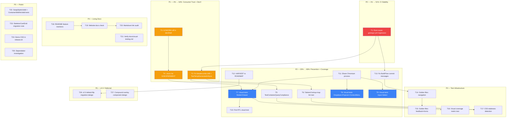

# Pareto Execution Plan — 2026-07-27: Hardening, Prevention Guards & Coverage

**Date:** 2026-07-27 22:52
**Input sources:** `TODO_LIST.md` (17 items: #70-78 open, #28-29 blocked, #35/38/39 v2.0, #33/34 v1.0, #67 tooling) + `docs/status/2026-07-27_22-49_*.md` section f (33 new items) = **50 total items**
**Goal:** Prioritize the full backlog by Pareto impact tiers, then produce a 2-level execution plan (medium 30-100min tasks, fine ≤12min tasks) covering ALL items.

---

## Step 1: Pareto Breakdown

### The 1% that delivers 51%

| #    | Task                                                           | Why it's the 1%                                                                                                                                                                                                                                                                                                                 |
| ---- | -------------------------------------------------------------- | ------------------------------------------------------------------------------------------------------------------------------------------------------------------------------------------------------------------------------------------------------------------------------------------------------------------------------- |
| P1.1 | **Root-cause the recurring `.golangci.yml` linter regression** | CI has gone red **4 times** from the same bug (ireturn/godoclint/testableexamples re-enabled). The guard test (`TestGolangciDisabledLinters`) catches it now, but **whatever keeps re-adding them is still running**. Finding and fixing the source = permanent CI stability. Without this, every session risks a red CI cycle. |

### The 4% that delivers 64% (add to the 1%)

| #    | Task                                                                  | Why it's in the 4%                                                                                                                                                               |
| ---- | --------------------------------------------------------------------- | -------------------------------------------------------------------------------------------------------------------------------------------------------------------------------- |
| P4.1 | **Fix `breadcrumbs_templ.go` drift + add `TestTemplGeneratedInSync`** | Generated file imports `json/v2`, source imports `json` v1. Consumers who `go get` get a stale file. One `templ generate` + one drift test = permanent generated-file integrity. |
| P4.2 | **Set `GOWORK=off` in devShell `shellHook`** (TODO #70)               | Breaks `go generate ./...` and BuildFlow pre-commit for every developer. Recurring across 3 sessions. 1-line fix (risk: verify visualtest module still builds).                  |
| P4.3 | **Create `.envrc` with `export GOEXPERIMENT=jsonv2`**                 | Root-cause fix for the BuildFlow band-aid. Currently the `shellHook` only works inside `nix develop`. `.envrc` makes it repo-wide for ALL tools (BuildFlow, go, LSP, IDE).       |

### The 20% that delivers 80% (add to the 4%)

| #     | Task                                                                       | Why it's in the 20%                                                                                                                                                                      |
| ----- | -------------------------------------------------------------------------- | ---------------------------------------------------------------------------------------------------------------------------------------------------------------------------------------- |
| P20.1 | **`TestContainerQueryCompliance` scanner** (TODO #74)                      | Automated prevention: scans `.templ` for viewport breakpoints without ContainerAware. Mirrors the proven dark-mode/motion-reduce pattern. Stops the "silently-missing CSS" class of bug. |
| P20.2 | **Tailwind lookup-map lint test** (TODO #78)                               | The container-query session found Split's maps in a `.go` file = zero CSS generated. This test prevents a repeat. Same prevention value as P20.1.                                        |
| P20.3 | **Visual tests for Modal + Drawer + Dropdown + Input + Select** (TODO #75) | Highest regression risk: JS + top-layer + animations. Currently 4/15 packages covered. These 5 components are where visual regressions hide from HTML-string tests.                      |
| P20.4 | **First RTL visual test** (TODO #77)                                       | `Options.RTL` exists but has **zero users**. Logical-property mirroring is completely unverified at the pixel level. Tiny effort, high value.                                            |
| P20.5 | **Share one Chromium process across visual tests** (TODO #76)              | Current: 1 browser per test (~1s × N). At 100 tests = 100s overhead. This makes the visual suite scalable before we add 50+ goldens.                                                     |
| P20.6 | **HARVEST: route 10 medium-value items to ROADMAP**                        | 10 items (5 ContainerAware candidates + 5 visualtest API improvements) are entombed in status reports. Routing them to ROADMAP prevents loss.                                            |
| P20.7 | **Fix BuildFlow auto-commit messages**                                     | 5+ sessions document this. Every docs-health/lint fix is invisible in `git log`. Systemic blocker for history-based discovery.                                                           |

### The remaining 20% (to reach 100%)

Everything else: golden-file conversions (#73), living-doc gaps (README/website/links), polish items (SwapStyleIsValid, ContainerWidthIsValid test, ADR cross-refs, docs/visual-testing.md verification), demo CSS in release.sh (#72), Dependabot (#71), v2.0 prep (default-flip design, alias removal, compound components), and blocked items (#28/#29 external submissions).

---

## Execution Graph

**Dependency logic:**

- T1 (root-cause lint) unblocks T13 (BuildFlow messages) — same tooling ecosystem
- T2 (generated-file sync) must precede T5/T6 (prevention guards) — can't guard what's broken
- T11 (shared Chromium) should precede T7-T9 (mass visual tests) — avoids 100 browser launches
- T12 (HARVEST to ROADMAP) feeds T26 (v2.0 design) — the ContainerAware candidates inform the default-flip
- T13 (BuildFlow fix) should precede T14-T15 (golden conversions) — so commits have real messages

---

## Step 2: Comprehensive Plan (Medium Granularity — 30-100min tasks)

Sorted by Pareto tier → impact → effort → customer-value.

| #   | Tier   | Task                                                                                                                                                                                                                         | Effort | Impact       | Customer Value                                          | Depends on | TODO ref            |
| --- | ------ | ---------------------------------------------------------------------------------------------------------------------------------------------------------------------------------------------------------------------------- | ------ | ------------ | ------------------------------------------------------- | ---------- | ------------------- |
| T1  | **P0** | Root-cause `.golangci.yml` linter regression: investigate what re-adds ireturn/godoclint/testableexamples (daemon logs? BuildFlow? flake cache? `git log -p --follow .golangci.yml`?)                                        | 60min  | Critical     | CI stays green permanently                              | —          | status f.1          |
| T2  | **P1** | Fix `breadcrumbs_templ.go` drift (run `templ generate` from source) + write `TestTemplGeneratedInSync` drift test                                                                                                            | 45min  | Critical     | Consumers get correct generated files                   | —          | status f.2-3        |
| T3  | **P1** | Set `GOWORK=off` in devShell `shellHook` + verify `visualtest/` module still builds                                                                                                                                          | 45min  | High         | `go generate ./...` works for every dev                 | —          | #70                 |
| T4  | **P1** | Create `.envrc` with `export GOEXPERIMENT=jsonv2` + test `direnv allow` works                                                                                                                                                | 30min  | High         | BuildFlow/go/LSP all get the flag without `nix develop` | T3         | status f.6          |
| T5  | **P2** | `TestContainerQueryCompliance` scanner — scan `.templ` for viewport breakpoints without ContainerAware                                                                                                                       | 90min  | High         | Prevents silently-missing CSS in future components      | T2         | #74                 |
| T6  | **P2** | Tailwind lookup-map lint test — fail if `map[X]string` with Tailwind classes lives in `.go` (not `.templ`)                                                                                                                   | 60min  | High         | Prevents the Split "zero CSS generated" class of bug    | T2         | #78                 |
| T7  | **P2** | Visual regression tests for Modal + Drawer (native `<dialog>`, focus trap, backdrop)                                                                                                                                         | 90min  | High         | Highest regression risk components get pixel coverage   | T11        | #75                 |
| T8  | **P2** | Visual regression tests for Dropdown + Popover + ContextMenu (Popover API top-layer)                                                                                                                                         | 90min  | High         | Top-layer positioning regressions caught                | T11        | #75                 |
| T9  | **P2** | Visual regression tests for Input + Select (most-used form components)                                                                                                                                                       | 90min  | High         | Most consumer-facing components covered                 | T11        | #75                 |
| T10 | **P2** | First RTL visual test (Button or Card with `Options.RTL`)                                                                                                                                                                    | 30min  | Medium       | Logical-property mirroring verified at pixel level      | T7         | #77                 |
| T11 | **P2** | Share one Chromium process across visual tests (fix context-cancellation bug, use tabs)                                                                                                                                      | 90min  | High         | Visual suite scales: 100 tests = 2s not 100s            | —          | #76                 |
| T12 | **P2** | HARVEST: route 10 items to ROADMAP (Container.ContainerAware, Breadcrumbs/EmptyState/NotFound404/Footer.ContainerAware, StateHover fix, MaxMismatch calibration, Viewport presets, InteractionState.String(), Options *bool) | 45min  | Medium       | Forward-looking items not lost in timestamped reports   | —          | status f.7-19       |
| T13 | **P2** | Fix BuildFlow auto-commit messages (`larsartmann/buildflow`) — inject real diff summaries                                                                                                                                    | 60min  | High         | `git log` becomes searchable; 5+ sessions document this | T1         | status f.33         |
| T14 | **P3** | Convert navigation assertion tests to golden files                                                                                                                                                                           | 60min  | Medium       | Better diff readability, less brittle substring checks  | T13        | #73                 |
| T15 | **P3** | Convert feedback + forms assertion tests to golden files                                                                                                                                                                     | 90min  | Medium       | Same value, larger scope                                | T14        | #73                 |
| T16 | **P3** | Visual coverage metric test — "% of components with ≥1 golden" (like TestSkillComponentCount)                                                                                                                                | 45min  | Medium       | Surfaces visual coverage gaps in CI                     | T7         | status f.44         |
| T17 | **P3** | CSS-staleness detection test — fail if `app.css` mtime < newest `.templ` mtime                                                                                                                                               | 45min  | Medium       | Prevents stale CSS from being committed                 | T5         | status f.45         |
| T18 | **P4** | README: add visual-testing + container-queries feature mentions                                                                                                                                                              | 30min  | Medium       | Consumer-facing features visible on sales page          | —          | status f.29         |
| T19 | **P4** | Verify `website/` docs beyond `sections.ts` mention ContainerAware + visual testing                                                                                                                                          | 45min  | Low-Med      | Website is the public docs site                         | T18        | status f.31         |
| T20 | **P4** | Audit every internal markdown link resolves (`grep -roE '\]\([^)]+\)' *.md docs/`)                                                                                                                                           | 30min  | Low          | No broken links in docs                                 | —          | status f.32         |
| T21 | **P4** | Read + verify `docs/visual-testing.md` accuracy against shipped harness                                                                                                                                                      | 30min  | Low          | Doc doesn't lie about the test framework                | —          | status f.4          |
| T22 | **P5** | Add `SwapStyleIsValid` test + `ContainerWidthIsValid` test + SkeletonCardGrid migration note                                                                                                                                 | 30min  | Low          | Convention compliance + consumer migration help         | —          | status f.40-42      |
| T23 | **P5** | Add demo CSS rebuild to `scripts/release.sh` (#72)                                                                                                                                                                           | 45min  | Medium       | Release CSS never stale for local `go run` users        | —          | #72                 |
| T24 | **P5** | Investigate GitHub Dependabot alert (#71)                                                                                                                                                                                    | 30min  | Medium       | Close a known security gap                              | —          | #71                 |
| T25 | **P5** | Add lint verification to BuildFlow pre-commit (never commit a `.golangci.yml` with findings)                                                                                                                                 | 45min  | Medium       | Prevents the daemon from committing broken lint config  | T13        | status f.34         |
| T26 | **P6** | Design v2.0 default-flip migration (self-host HTMX + semantic tokens + ContainerAware → default) + write migration guide                                                                                                     | 90min  | Low (future) | Clear path to v2.0 for consumers                        | T12        | #35, status f.46-47 |
| T27 | **P6** | Compound overlay component design (Trigger/Content/Close pattern for Modal/Drawer/Dropdown)                                                                                                                                  | 90min  | Low (future) | v2.0 overlay API                                        | —          | #39                 |

**Totals:** 27 tasks, ~17.5 hours estimated effort.

---

## Step 3: Detailed Breakdown (Fine Granularity — ≤12min tasks)

Each medium task split into atomic ≤12min actions. Sorted within each task by execution order.

| Fine # | Parent | Action                                                                                                                            | Est   | TODO ref |
| ------ | ------ | --------------------------------------------------------------------------------------------------------------------------------- | ----- | -------- |
| F1.1   | T1     | `git log --oneline --all -- .golangci.yml` — find every commit that touched the file                                              | 5min  | f.1      |
| F1.2   | T1     | `git log -p --follow .golangci.yml \| grep -A2 -B2 'ireturn\|godoclint\|testableexamples'` — identify which commits re-added them | 8min  | f.1      |
| F1.3   | T1     | Check if BuildFlow has a lint-format step: `buildflow config view` + `cat .buildflow.yml`                                         | 8min  | f.1      |
| F1.4   | T1     | Check daemon/BuildFlow logs for `.golangci.yml` mutations                                                                         | 8min  | f.1      |
| F1.5   | T1     | Document root cause in AGENTS.md (one-line note) or file BuildFlow issue                                                          | 10min | f.1      |
| F2.1   | T2     | `cd /home/lars/projects/templ-components && templ generate ./navigation/` from within `nix develop`                               | 5min  | f.2      |
| F2.2   | T2     | `git diff navigation/breadcrumbs_templ.go` — verify import changed json/v2 → json                                                 | 3min  | f.2      |
| F2.3   | T2     | Write `TestTemplGeneratedInSync` skeleton in `utils/docs_count_test.go`                                                           | 10min | f.3      |
| F2.4   | T2     | Implement: for each `.templ` file, run `templ generate` to temp dir + diff against committed `*_templ.go`                         | 12min | f.3      |
| F2.5   | T2     | Run test + verify it catches the breadcrumbs drift (then fix + re-verify)                                                         | 8min  | f.3      |
| F3.1   | T3     | Add `export GOWORK=off` to devShell `shellHook` in `flake.nix` (line 42-43)                                                       | 3min  | #70      |
| F3.2   | T3     | `nix develop -c bash -c 'go generate ./...'` — verify it works with GOWORK=off                                                    | 8min  | #70      |
| F3.3   | T3     | `nix develop -c bash -c 'cd visualtest && go build ./...'` — verify visualtest module still builds                                | 8min  | #70      |
| F3.4   | T3     | Remove #70 from TODO_LIST + add CHANGELOG `[Unreleased]` Fixed entry                                                              | 5min  | #70      |
| F4.1   | T4     | Check `direnv version` is available on the system                                                                                 | 3min  | f.6      |
| F4.2   | T4     | Create `.envrc` with `export GOEXPERIMENT=jsonv2`                                                                                 | 3min  | f.6      |
| F4.3   | T4     | `direnv allow` + verify `echo $GOEXPERIMENT` from outside `nix develop`                                                           | 5min  | f.6      |
| F4.4   | T4     | Add `.envrc` to `.gitignore` if it contains machine-specific paths (or commit if clean)                                           | 5min  | f.6      |
| F4.5   | T4     | Update AGENTS.md: document `.envrc` as the primary GOEXPERIMENT source                                                            | 8min  | f.6      |
| F5.1   | T5     | Study `TestDarkModeCompliance` pattern in `utils/` — understand the scanner approach                                              | 8min  | #74      |
| F5.2   | T5     | Write `TestContainerQueryCompliance` skeleton: walk `.templ` files, regex for `sm:\|md:\|lg:` on structural classes               | 12min | #74      |
| F5.3   | T5     | Implement the ContainerAware-flag detection: parse the corresponding `_types.go` for `ContainerAware bool`                        | 12min | #74      |
| F5.4   | T5     | Add exemption list (components where viewport breakpoints are correct, e.g., AppShell)                                            | 10min | #74      |
| F5.5   | T5     | Run test + fix any false positives + verify it catches a deliberate violation                                                     | 10min | #74      |
| F5.6   | T5     | Remove #74 from TODO_LIST + add CHANGELOG entry                                                                                   | 5min  | #74      |
| F6.1   | T6     | Study the Split bug (container report d): understand why `.go` maps produce no CSS                                                | 8min  | #78      |
| F6.2   | T6     | Write test skeleton: walk `.go` files (not `_templ.go`), regex for `map\[.*\]string` variables                                    | 10min | #78      |
| F6.3   | T6     | Implement: check if map values contain Tailwind class patterns (`sm:\|md:\|grid-\|flex-\|col-`)                                   | 12min | #78      |
| F6.4   | T6     | Add exemption for known-safe maps (e.g., `iconPathData` has no Tailwind classes)                                                  | 8min  | #78      |
| F6.5   | T6     | Run test + verify it catches the old Split bug (git show the pre-fix version)                                                     | 8min  | #78      |
| F6.6   | T6     | Remove #78 from TODO_LIST + add CHANGELOG entry                                                                                   | 5min  | #78      |
| F7.1   | T11    | Study `visualtest/harness.go` — understand `newBrowser()` and the per-test process model                                          | 8min  | #76      |
| F7.2   | T11    | Design shared-browser: `sync.Once` browser init + per-test `CreateContext` + `NewPage`                                            | 12min | #76      |
| F7.3   | T11    | Implement `sharedBrowser()` replacing `newBrowser()`                                                                              | 12min | #76      |
| F7.4   | T11    | Fix the context-cancellation bug (use `context.WithCancel` per test, not per browser)                                             | 12min | #76      |
| F7.5   | T11    | Run existing 15 goldens — verify they pass with shared browser + measure speedup                                                  | 8min  | #76      |
| F7.6   | T11    | Remove #76 from TODO_LIST + add CHANGELOG entry                                                                                   | 5min  | #76      |
| F8.1   | T7     | Write `TestModalLight` + `TestModalDark` golden capture                                                                           | 10min | #75      |
| F8.2   | T7     | Write `TestModalOpen` (capture with dialog open via `showModal()`)                                                                | 12min | #75      |
| F8.3   | T7     | Write `TestDrawerLight` + `TestDrawerDark` + `TestDrawerLeft`/`TestDrawerRight`                                                   | 12min | #75      |
| F8.4   | T7     | Run `-update` to capture goldens + verify they render correctly                                                                   | 8min  | #75      |
| F9.1   | T8     | Write `TestDropdownOpen` golden (menu visible via Popover API)                                                                    | 10min | #75      |
| F9.2   | T8     | Write `TestPopoverLight` + `TestPopoverDark`                                                                                      | 10min | #75      |
| F9.3   | T8     | Write `TestContextMenu` golden                                                                                                    | 8min  | #75      |
| F9.4   | T8     | Run `-update` to capture goldens + verify positioning is correct                                                                  | 10min | #75      |
| F10.1  | T9     | Write `TestInputText` + `TestInputError` + `TestInputDisabled` goldens                                                            | 12min | #75      |
| F10.2  | T9     | Write `TestSelectBasic` + `TestSelectStylable` goldens                                                                            | 10min | #75      |
| F10.3  | T9     | Write `TestInputDark` goldens                                                                                                     | 8min  | #75      |
| F10.4  | T9     | Run `-update` + verify                                                                                                            | 5min  | #75      |
| F11.1  | T10    | Write `TestButtonRTL` golden using `Options{RTL: true}`                                                                           | 8min  | #77      |
| F11.2  | T10    | Write `TestCardRTL` golden                                                                                                        | 8min  | #77      |
| F11.3  | T10    | Run `-update` + verify mirroring is correct                                                                                       | 5min  | #77      |
| F11.4  | T10    | Remove #77 from TODO_LIST + add CHANGELOG entry                                                                                   | 5min  | #77      |
| F12.1  | T12    | Read container-query report section f (items 11-15) + visual report e.4-e.9                                                       | 8min  | f.7-19   |
| F12.2  | T12    | Add "Container-aware expansion" ROADMAP direction (Container, Breadcrumbs, EmptyState, NotFound404, Footer)                       | 10min | f.11-15  |
| F12.3  | T12    | Add "Visualtest API improvements" ROADMAP direction (StateHover, MaxMismatch, Viewport presets, String(), *bool)                  | 10min | f.15-19  |
| F12.4  | T12    | Add "Visual test coverage expansion" ROADMAP direction                                                                            | 5min  | f.7      |
| F13.1  | T13    | Read BuildFlow source: `cat /run/current-system/sw/bin/buildflow` or find the repo                                                | 10min | f.33     |
| F13.2  | T13    | Identify the commit-message generation logic                                                                                      | 12min | f.33     |
| F13.3  | T13    | Fix: generate message from `git diff --stat` instead of hallucinating                                                             | 12min | f.33     |
| F13.4  | T13    | Test end-to-end: make a change, let daemon commit, verify message                                                                 | 10min | f.33     |
| F14.1  | T14    | Study `internal/golden.Assert` pattern                                                                                            | 5min  | #73      |
| F14.2  | T14    | Convert `navigation/pagination_test.go` assertion tests to golden                                                                 | 12min | #73      |
| F14.3  | T14    | Convert `navigation/breadcrumbs_test.go` assertion tests to golden                                                                | 12min | #73      |
| F14.4  | T14    | Convert `navigation/nav_test.go` assertion tests to golden                                                                        | 12min | #73      |
| F15.1  | T15    | Convert `feedback/alert_test.go` + `feedback/toast_test.go` to golden                                                             | 12min | #73      |
| F15.2  | T15    | Convert `forms/input_test.go` + `forms/select_test.go` to golden                                                                  | 12min | #73      |
| F15.3  | T15    | Convert `forms/toggle_test.go` + `forms/checkbox_test.go` to golden                                                               | 12min | #73      |
| F16.1  | T16    | Write `TestVisualCoverage` — count goldens / count components, assert ratio                                                       | 10min | f.44     |
| F16.2  | T16    | Run + verify it reports current ratio (4/15 packages)                                                                             | 5min  | f.44     |
| F17.1  | T17    | Write `TestCSSFreshness` — compare `app.css` mtime vs newest `.templ` mtime                                                       | 10min | f.45     |
| F17.2  | T17    | Run + verify it passes (or catches staleness)                                                                                     | 5min  | f.45     |
| F18.1  | T18    | Add "Visual Regression Testing" section to README after "By the Numbers"                                                          | 10min | f.29     |
| F18.2  | T18    | Add "Container Queries" mention to README "Responsive" design principle                                                           | 8min  | f.29     |
| F19.1  | T19    | `grep -r 'ContainerAware\|visual\|visualtest' website/src/`                                                                       | 8min  | f.31     |
| F19.2  | T19    | Check website component pages for ContainerAware mentions                                                                         | 10min | f.31     |
| F19.3  | T19    | Add missing mentions where gaps found                                                                                             | 12min | f.31     |
| F20.1  | T20    | `grep -roE '\]\([^)]+\)' *.md docs/` — extract all markdown links                                                                 | 8min  | f.32     |
| F20.2  | T20    | Verify each link target exists                                                                                                    | 10min | f.32     |
| F20.3  | T20    | Fix any broken links found                                                                                                        | 10min | f.32     |
| F21.1  | T21    | Read `docs/visual-testing.md` fully                                                                                               | 8min  | f.4      |
| F21.2  | T21    | Cross-check claims against `visualtest/` source (API names, options, flags)                                                       | 10min | f.4      |
| F21.3  | T21    | Fix any inaccuracies found                                                                                                        | 8min  | f.4      |
| F22.1  | T22    | Add `TestSwapStyleIsValid` in `htmx/` (convention: every enum has IsValid)                                                        | 8min  | f.40     |
| F22.2  | T22    | Add `TestContainerWidthIsValid` in `layout/`                                                                                      | 8min  | f.41     |
| F22.3  | T22    | Write `docs/migration/skeletoncardgrid-api-change.md`                                                                             | 10min | f.42     |
| F23.1  | T23    | Read `scripts/release.sh` — find where `templ generate` runs                                                                      | 5min  | #72      |
| F23.2  | T23    | Add `tailwindcss` compile step after `templ generate`                                                                             | 10min | #72      |
| F23.3  | T23    | Test: run release script in dry-run mode                                                                                          | 8min  | #72      |
| F24.1  | T24    | `gh api /repos/LarsArtmann/templ-components/dependabot/alerts`                                                                    | 8min  | #71      |
| F24.2  | T24    | Read alert details + assess severity                                                                                              | 10min | #71      |
| F24.3  | T24    | Fix vulnerability or document accepted risk                                                                                       | 12min | #71      |
| F25.1  | T25    | Read BuildFlow pre-commit hook setup                                                                                              | 8min  | f.34     |
| F25.2  | T25    | Add `golangci-lint run` step to pre-commit                                                                                        | 10min | f.34     |
| F25.3  | T25    | Test: make a lint error, verify pre-commit catches it                                                                             | 10min | f.34     |
| F26.1  | T26    | Draft v2.0 migration guide outline (HTMX self-host, semantic tokens, ContainerAware default)                                      | 12min | #35      |
| F26.2  | T26    | Write the deprecation timeline (opt-in → warning → default)                                                                       | 12min | f.46     |
| F26.3  | T26    | Write `docs/migration/v1-to-v2.md` skeleton                                                                                       | 12min | f.47     |
| F26.4  | T26    | Plan `AlertType`/`ToastType` alias removal sequence                                                                               | 10min | #38      |
| F27.1  | T27    | Research compound component patterns (Radix, shadcn) for overlay APIs                                                             | 12min | #39      |
| F27.2  | T27    | Draft Trigger/Content/Close API for Modal/Drawer                                                                                  | 12min | #39      |
| F27.3  | T27    | Write ADR draft for compound overlay pattern                                                                                      | 12min | #39      |

**Totals:** 104 fine tasks across 27 medium tasks. Every item from TODO_LIST (#70-78, #28-29, #35/38/39, #33/34, #67) and the status report section f is covered.

### Items explicitly NOT in this plan (and why)

| Item                                                 | Reason                                                                            |
| ---------------------------------------------------- | --------------------------------------------------------------------------------- |
| #28 awesome-templ PR                                 | Blocked — needs maintainer approval (external)                                    |
| #29 templ.guide listing                              | Blocked — needs maintainer approval (external)                                    |
| #33 Validate() on remaining props                    | Deferred — `utils.Lookup` fallback is sufficient; no invalid states representable |
| #34 Move test helpers to internal/testutil/          | Deferred — 70+ test imports affected; large mechanical migration                  |
| #67 Switch treefmt gofmt → gofumpt                   | Deferred — formatting churn across entire codebase; low value now                 |
| Rename `Grid.ContainerResponsive` → `ContainerAware` | Deferred to v2.0 (breaking change)                                                |
| Container query units (`cqi`/`cqw`)                  | Research item, not actionable yet                                                 |
| Dark-mode variant for EVERY component                | Covered indirectly by visual tests (T7-T9 catch dark-mode regressions)            |

---

## Assumptions

1. **T1 root-cause investigation** may conclude the regression source is outside this repo (BuildFlow daemon). In that case, the deliverable is a BuildFlow issue/fix, not a repo change.
2. **T11 shared browser** assumes the context-cancellation bug is debuggable. If it proves intractable, the fallback is a browser pool (N pre-warmed browsers) rather than a single shared one.
3. **T13 BuildFlow fix** requires access to the `larsartmann/buildflow` repo. If unavailable, the deliverable is a documented issue + the `.envrc` workaround (T4).
4. **Fine task estimates** are optimistic (no context-switching overhead). Real elapsed time per 12min task is ~15-20min including verification.

## Risks

| Risk                                                                    | Mitigation                                                     |
| ----------------------------------------------------------------------- | -------------------------------------------------------------- |
| T1 finds the root cause is the Nix flake caching an old `.golangci.yml` | `nix flake update` + verify the input hash                     |
| T11 shared-browser refactor breaks the existing 15 goldens              | Keep `newBrowser()` as fallback; feature-flag the shared path  |
| T14-T15 golden conversion produces massive diffs                        | Do one package first (navigation), review, then batch the rest |
| T26 v2.0 design is premature                                            | Timebox to 90min; produce a draft ADR, not a final decision    |

---

## Resolution (2026-07-28)

This plan was executed across the 2026-07-28 sessions. ~20 of 27 tasks shipped; the survivors are routed to the current [`TODO_LIST.md`](../../TODO_LIST.md) / [`ROADMAP.md`](../../ROADMAP.md).

| Task | Status | Outcome |
| ---- | ------ | ------- |
| T1   | ✅ DONE | 3-layer guard: `scripts/check-lint-config.sh` + `TestGolangciDisabledLinters` + CI step. Root cause = BuildFlow daemon (separate repo). |
| T2   | ✅ DONE | `TestTemplGeneratedInSync` + breadcrumbs regenerated. |
| T3   | ✅ DONE | `GOWORK=off` in devShell `shellHook`. |
| T4   | ✅ DONE | `.envrc` (direnv) sets `GOEXPERIMENT=jsonv2` + `GOWORK=off`. |
| T5   | ✅ DONE | `TestContainerQueryCompliance` scanner. |
| T6   | ✅ DONE | `TestTailwindGoSourceScanning` (`@source "**/*.go"`). |
| T7   | ✅ DONE | Modal + Drawer visual goldens. |
| T8   | ✅ DONE | Dropdown/Popover/ContextMenu goldens via `StateClick` (later session). |
| T9   | ✅ DONE | Input + Select visual goldens. |
| T10  | ✅ DONE | First RTL visual goldens (button/card). |
| T11  | ✅ DONE | Shared Chromium process (15 tests → ~2s). |
| T12  | 🟡 PARTIAL | Some items routed this session; container-aware expansion + visualtest API improvements now in ROADMAP. |
| T13  | ⚫ BLOCKED | BuildFlow commit-message fix lives in `larsartmann/buildflow` (separate repo). Now TODO #93. |
| T14–15 | 🟡 PARTIAL | `display`/`navigation`/`feedback`/`forms`/`layout` now have golden snapshots; remaining conversion → TODO #73. |
| T16  | ✅ DONE | Visual coverage metric test (31/74 = 41.9%). |
| T17  | ✅ DONE | `TestCSSFreshness` (now CI-failing). |
| T18  | 🟡 PARTIAL | README updated; a dedicated "Testing" section still missing → TODO #91. |
| T19  | ⬜ DEFERRED | `website/` docs not audited this cycle. |
| T20  | ✅ DONE | Markdown link audit — all internal links resolve. |
| T21  | ✅ DONE | `docs/visual-testing.md` verified + updated. |
| T22  | 🟡 PARTIAL | `SwapStyleIsValid`/`ContainerWidthIsValid` shipped; SkeletonCardGrid migration doc still open → TODO #90. |
| T23  | ✅ DONE | Demo CSS compile step in `scripts/release.sh`. |
| T24  | ✅ DONE | Dependabot investigated — both vulns are `website/`-only (not the library). |
| T25  | ⬜ DEFERRED | Lint verification in BuildFlow pre-commit (separate repo). |
| T26  | ✅ DONE | v2.0 default-flip design → ADR-0022. |
| T27  | ✅ DONE | Compound overlay API design → ADR-0023. |
