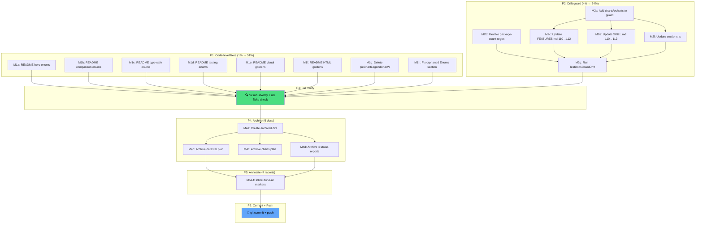

# Docs Health Completion Plan — Fix, Annotate, Archive

**Created:** 2026-08-05 18:29
**Status:** Planning → Execution
**Decider:** Lars Artmann
**Context:** Prior session rebuilt TODO_LIST, ROADMAP, FEATURES, CHANGELOG but skipped ANNOTATE mode, left README stale, punted trivial fixes, and never ran lint. This plan closes every gap.

---

## Context: What Remains

The prior session (`docs/status/2026-08-05_18-24_*.md`) rebuilt the 4 living docs but left 6 categories of work undone:

1. **README.md stale counts** — 4 different wrong enum counts (51, 47, 43; actual 52), stale golden counts (31 visual, 102 HTML; actual 49, 175)
2. **Fix-on-sight items punted to TODO** — `pieChartLegendCharW` unused const, `charts/echarts` missing from drift guard
3. **Orphaned `### Enums` section** in FEATURES.md (line 145 — `GridGap` alone in duplicate section)
4. **11 historical reports unannotated** — zero `done at` markers; readers can't tell what's resolved
5. **Verify suite incomplete** — `golangci-lint` and `nix flake check` never run
6. **2 fully-shipped planning docs** not archived

---

## Pareto Analysis

### The 1% That Delivers 51%

**Fix README.md stale counts + delete pieChartLegendCharW + fix orphaned Enums section.**

Eight edits across 3 files. Every identified code/doc mismatch closed in <15 minutes. This is pure accuracy — no structural changes, no cascade risk, no test changes. The docs simply match the code.

### The 4% That Delivers 64%

**All of the above + add `charts/echarts` to the drift guard + make the package-count regex flexible.**

One structural change (`charts/echarts` in the package list) that makes the component count accurate (110→112). Making the regex `across \d+ packages` instead of `across 10 packages` prevents future breakage when packages are added. Cascade: update 4 doc files to say 112. The drift guard then enforces correctness permanently.

### The 20% That Delivers 80%

**All of the above + archive 6 fully-resolved historical docs + annotate 4 partially-resolved reports.**

The 6 fully-resolved docs (2 planning + 4 status) describe shipped work — archiving them cleans the active directories. The 4 partially-resolved reports get inline `done at` / `→ TODO #N` markers on every numbered item. After this, a reader can scan any historical doc and immediately know what's done.

### The Other 20% (to Reach 100%)

**Run the full verify suite (lint + nix flake check + nix fmt) + write this plan doc + commit + push.**

Confidence that the changes are correct and nothing was broken.

---

## Comprehensive Plan — Tasks (30-100 min each)

Sorted by importance/impact/effort/customer-value (highest first).

| #   | Task                                                                                 | Impact   | Effort | Est   | Customer Value                                      |
| --- | ------------------------------------------------------------------------------------ | -------- | ------ | ----- | --------------------------------------------------- |
| P1  | **Code-level doc fixes**: README counts, pieChartLegendCharW, orphaned Enums section | Critical | Low    | 30min | Docs match code — zero known mismatches             |
| P2  | **Drift guard hardening**: add charts/echarts, flexible regex, cascade count updates | High     | Medium | 45min | Self-correcting doc counts — drift can't recur      |
| P3  | **Full verify suite**: golangci-lint + nix flake check + nix fmt + go test           | High     | Low    | 30min | Confidence that changes are correct                 |
| P4  | **Archive 6 fully-resolved historical docs** (2 planning + 4 status)                 | Medium   | Low    | 30min | Clean active directories; resolved work is archived |
| P5  | **Annotate 4 partially-resolved status reports** (inline `done at` / `→ TODO #N`)    | Medium   | High   | 90min | Historical docs are navigable — readers know status |
| P6  | **Write plan doc + commit + push**                                                   | Low      | Low    | 30min | Plan is documented; changes are pushed to remote    |

**Total estimated effort:** ~255min (4.25 hours)

---

## Micro-Task Breakdown (max 12 min each)

Sorted by importance/impact/effort/customer-value within each parent task.

### P1: Code-level doc fixes

| #   | Sub-task                                                                      | Parent | Est  | Depends on |
| --- | ----------------------------------------------------------------------------- | ------ | ---- | ---------- |
| M1a | Fix README hero (line 18): "51 typed string enums" → "52"                     | P1     | 2min | —          |
| M1b | Fix README comparison table (line 28): "47 enums" → "52"                      | P1     | 2min | —          |
| M1c | Fix README type-safe section (line 229): "51 typed string enums" → "52"       | P1     | 2min | —          |
| M1d | Fix README testing table (line 297): "43" → "52"                              | P1     | 2min | —          |
| M1e | Fix README visual goldens (line 300): "31 pixel-level" → "49 pixel-level"     | P1     | 2min | —          |
| M1f | Fix README HTML goldens (line 312): "102 .golden files" → "175 .golden files" | P1     | 2min | —          |
| M1g | Delete `pieChartLegendCharW` from `display/pie_chart.go:93`                   | P1     | 3min | —          |
| M1h | Merge orphaned `### Enums` (GridGap) into display Enums table in FEATURES.md  | P1     | 5min | —          |
| M1i | Verify: `go build ./display/...` + `go test ./display/...`                    | P1     | 3min | M1g        |

### P2: Drift guard hardening

| #   | Sub-task                                                                     | Parent | Est  | Depends on |
| --- | ---------------------------------------------------------------------------- | ------ | ---- | ---------- |
| M2a | Add `"charts/echarts"` to package list in `utils/docs_count_test.go:43`      | P2     | 2min | —          |
| M2b | Make regex flexible: `across 10 packages` → `across \d+ packages`            | P2     | 3min | —          |
| M2c | Update FEATURES.md: "110 templ components" → "112 templ components"          | P2     | 2min | M2a        |
| M2d | Update FEATURES.md overview table display count note                         | P2     | 3min | M2a        |
| M2e | Update skill/SKILL.md: "110 components across 10 packages" → "112 across 11" | P2     | 3min | M2a        |
| M2f | Update website/src/data/sections.ts count                                    | P2     | 3min | M2a        |
| M2g | Run `TestDocsCountDrift` — verify all counts match                           | P2     | 2min | M2c-M2f    |

### P3: Full verify suite

| #   | Sub-task                                      | Parent | Est  | Depends on |
| --- | --------------------------------------------- | ------ | ---- | ---------- |
| M3a | Run `golangci-lint run` on all packages       | P3     | 5min | P1, P2     |
| M3b | Run `nix flake check`                         | P3     | 5min | P1, P2     |
| M3c | Run `nix fmt` (auto-format any changed files) | P3     | 3min | P1, P2     |
| M3d | Run `go test ./... -count=1` (full suite)     | P3     | 5min | P1, P2     |

### P4: Archive fully-resolved historical docs

| #   | Sub-task                                                               | Parent | Est  | Depends on |
| --- | ---------------------------------------------------------------------- | ------ | ---- | ---------- |
| M4a | Create `docs/status/archived/` + `docs/planning/archived/` directories | P4     | 2min | —          |
| M4b | Add resolution banner + `git mv` datastar Pareto plan                  | P4     | 5min | M4a        |
| M4c | Add resolution banner + `git mv` SVG charts plan                       | P4     | 5min | M4a        |
| M4d | Add resolution banner + `git mv` datastar phase2 status                | P4     | 5min | M4a        |
| M4e | Add resolution banner + `git mv` todo-list-execution-sprint status     | P4     | 5min | M4a        |
| M4f | Add resolution banner + `git mv` SVG-charts-echarts-adapter status     | P4     | 5min | M4a        |
| M4g | Add resolution banner + `git mv` stale-todo-audit status               | P4     | 5min | M4a        |

### P5: Annotate partially-resolved status reports

| #   | Sub-task                                                                    | Parent | Est   | Depends on |
| --- | --------------------------------------------------------------------------- | ------ | ----- | ---------- |
| M5a | Annotate `2026-08-03_00-29_templ-sync-drift-root-cause.md` (inline markers) | P5     | 12min | —          |
| M5b | Annotate `2026-08-03_03-53_lint-docs-visual-cleanup-sprint.md`              | P5     | 12min | —          |
| M5c | Annotate `2026-08-03_04-19_CHART-CLEANUP-LINT-CSS-DOCS-SPRINT.md`           | P5     | 12min | —          |
| M5d | Annotate `2026-08-04_06-03_overlay-calibration-and-visual-test-race-fix.md` | P5     | 12min | —          |
| M5e | Annotate `2026-08-04_06-26_v1.7.0-release-cut.md`                           | P5     | 12min | —          |

### P6: Write plan doc + commit + push

| #   | Sub-task                                | Parent | Est  | Depends on |
| --- | --------------------------------------- | ------ | ---- | ---------- |
| M6a | Write this plan doc to `docs/planning/` | P6     | 5min | —          |
| M6b | `git status` + review all changes       | P6     | 3min | P1-P5      |
| M6c | `git commit` with detailed message      | P6     | 5min | M6b        |
| M6d | `git push`                              | P6     | 3min | M6c        |

**Total:** 35 micro-tasks, ~255min.

---

## Execution Order (Dependency Graph)

**Parallelizable:** M1a–M1h (all independent README/code fixes), M2a–M2b (independent), P4 + P5 (after verify).
**Sequential:** P2 depends on P1 (count changes must be consistent). P3 depends on P1+P2. P4+P5 depend on P3 (don't annotate until verified green). P6 depends on all.

---

## Anti-Verslimmbessern Checklist

Before starting ANY task, verify:

- [ ] Does this task **add value** or is it just gold-plating?
- [ ] Does this task **duplicate** existing work? If yes, STOP.
- [ ] Is the cascade risk understood? (P2's 110→112 count change touches 4 files — all must move together)
- [ ] After completion: run `TestDocsCountDrift`. Zero failures?
- [ ] Are historical docs annotated **non-destructively**? (inline markers, never rewrite history)

---

## Classification of Historical Docs

| File                                                                      | Decision | Rationale                                                     |
| ------------------------------------------------------------------------- | -------- | ------------------------------------------------------------- |
| `planning/2026-08-02_22-40_DATASTAR-INTEGRATION-PARETO-PLAN.md`           | ARCHIVE  | Fully shipped in v1.7.0. Every task done.                     |
| `planning/2026-08-03_02-51_NATIVE-SVG-CHARTS-PLUS-ECHARTS-ADAPTER.md`     | ARCHIVE  | Fully shipped in v1.7.0. Every task done.                     |
| `status/2026-08-02_23-48_datastar-phase2-quality-parity.md`               | ARCHIVE  | Fully shipped in v1.7.0.                                      |
| `status/2026-08-03_03-18_todo-list-execution-sprint.md`                   | ARCHIVE  | All 13+2 items shipped in v1.7.0.                             |
| `status/2026-08-03_03-38_SVG-CHARTS-ECHARTS-ADAPTER.md`                   | ARCHIVE  | Fully shipped in v1.7.0.                                      |
| `status/2026-08-04_05-37_stale-todo-audit-and-baseline-fixes.md`          | ARCHIVE  | All items shipped. Breadcrumbs fix recurred but was re-fixed. |
| `status/2026-08-03_00-29_templ-sync-drift-root-cause.md`                  | ANNOTATE | Sync guard exists; daemon fix (#93) still open.               |
| `status/2026-08-03_03-53_lint-docs-visual-cleanup-sprint.md`              | ANNOTATE | Most items shipped; some visual coverage gaps in TODO.        |
| `status/2026-08-03_04-19_CHART-CLEANUP-LINT-CSS-DOCS-SPRINT.md`           | ANNOTATE | Most items shipped; charts/echarts drift guard in TODO #102.  |
| `status/2026-08-04_06-03_overlay-calibration-and-visual-test-race-fix.md` | ANNOTATE | Calibration shipped; some questions still open.               |
| `status/2026-08-04_06-26_v1.7.0-release-cut.md`                           | ANNOTATE | Release shipped; CSS stale issue documented.                  |

---

## Success Criteria

This plan is complete when:

1. ✅ Zero known doc/code count mismatches (README, FEATURES, SKILL.md, sections.ts all match actual)
2. ✅ `TestDocsCountDrift` covers `charts/echarts` (count = 112) and uses flexible regex
3. ✅ `pieChartLegendCharW` deleted, orphaned Enums section merged
4. ✅ `golangci-lint run` → 0 issues
5. ✅ `nix flake check` → all checks pass
6. ✅ All fully-resolved historical docs archived with resolution banners
7. ✅ All partially-resolved reports have inline `done at` / `→ TODO #N` markers
8. ✅ Changes committed with descriptive message and pushed
