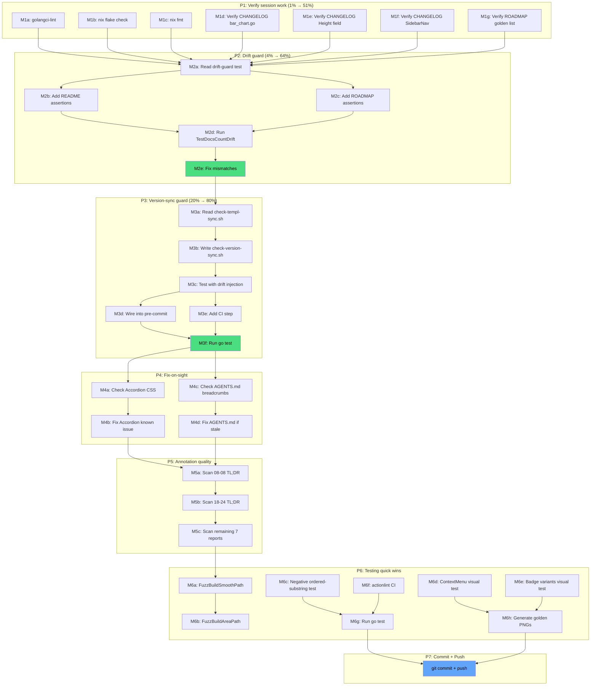

# Comprehensive Execution Plan — Docs Health Close-Out + Drift Prevention

**Created:** 2026-08-09 07:13
**Status:** Planning → Execution
**Decider:** Lars Artmann
**Context:** Prior session (`docs/status/2026-08-09_07-10_*.md`) fixed 5 living docs, annotated + archived 9 reports, but skipped lint/flake/fmt, didn't verify CHANGELOG entries against code diffs, left stale known issues, and the two highest-value drift-prevention guards (#111, #112) are still unwritten. This plan closes every gap.

---

## Context: What Remains

The prior session rebuilt all living docs but left 6 categories of work undone:

1. **Verify suite incomplete** — `golangci-lint`, `nix flake check`, `nix fmt` never run
2. **CHANGELOG entries unverified** — 3 `[Unreleased]` entries based on commit messages, not code diffs
3. **Stale known issues** — Accordion `grid-rows-[0fr]` CSS output never verified; AGENTS.md breadcrumbs note may be stale
4. **Two systemic drift guards unwritten** — #111 (version-sync) and #112 (README+ROADMAP drift-guard extension)
5. **Annotation quality gaps** — archived report prose may contain stale TL;DR claims; full AGENTS.md verify overdue
6. **~30 quality/testing items** from prior reports — mostly already tracked in TODO_LIST/ROADMAP, but need acknowledgment

---

## Pareto Analysis

### The 1% That Delivers 51%

**Run the full verify suite + verify CHANGELOG entries against code + check Accordion/AGENTS.md stale claims.**

Seven micro-checks across 5 files. Every identified accuracy gap closed in <15 minutes. This is pure accuracy — no structural changes, no cascade risk. If my CHANGELOG entries are wrong or a known issue is stale, everything I did last session is undermined.

### The 4% That Delivers 64%

**All of the above + implement #112 (extend `TestDocsCountDrift` to cover README.md + ROADMAP.md).**

One structural change that makes the count-drift class impossible going forward. The v1.2.0 badge sat stale for 5 releases because the drift guard didn't check README. The 49→66 visual-golden drift went unnoticed for the same reason. This one test extension prevents that forever. After this, every doc that contains a component/enum/golden count is guarded.

### The 20% That Delivers 80%

**All of the above + implement #111 (`scripts/check-version-sync.sh` pre-commit guard).**

The version-sync guard prevents the v1.8.0 drift class that broke the release tag. Together with #112, these two guards make the entire docs-health + version-sync cycle self-enforcing. No future session can silently drift counts or versions. The two guards are <100 lines of code total and prevent the two most common drift classes documented across 9 annotated reports.

### The Other 20% (to Reach 100%)

**All of the above + annotation quality pass (archived prose scan, AGENTS.md full verify) + the remaining ~30 testing/quality items.**

The testing/quality items (visual test gaps, fuzz tests, component improvements, architecture/DRY, release automation) are quality-of-life improvements. Most are already tracked in TODO_LIST (#28, #29, #33, #34, #35, #38, #39, #80, #93) or ROADMAP (chart ecosystem, visual test infrastructure). They don't need re-planning — they need execution when prioritized.

---

## Comprehensive Plan — Parent Tasks (30–100 min each)

Sorted by importance/impact/effort/customer-value (highest first).

| #   | Task                                                                                          | Impact   | Effort | Est    | Customer Value                                            |
| --- | --------------------------------------------------------------------------------------------- | -------- | ------ | ------ | --------------------------------------------------------- |
| P1  | **Verify session work**: lint + flake + fmt + CHANGELOG diff verify + ROADMAP verify          | Critical | Low    | 30min  | Confidence that prior session's edits are correct         |
| P2  | **Drift guard hardening**: extend `TestDocsCountDrift` to cover README.md + ROADMAP.md (#112) | High     | Medium | 45min  | Self-correcting doc counts — drift can't recur            |
| P3  | **Version-sync guard**: write `scripts/check-version-sync.sh` + wire into pre-commit + CI (#111) | High     | Medium | 60min  | Prevents the v1.8.0 version-drift class permanently       |
| P4  | **Fix-on-sight**: Accordion known issue, AGENTS.md breadcrumbs, stale prose in archived reports | Medium   | Low    | 30min  | No stale claims remain in any doc                         |
| P5  | **Annotation quality**: scan archived report prose for stale TL;DR / Executive Summary claims | Medium   | Medium | 45min  | Historical docs fully navigable — prose matches resolution |
| P6  | **Testing quick wins**: fuzz tests, negative tests, visual test gaps (items 14–25)            | Medium   | High   | 100min | Deeper test coverage for chart math + visual variants     |
| P7  | **Commit + push**                                                                             | Low      | Low    | 15min  | Changes documented and pushed to remote                   |

**Total estimated effort:** ~325min (~5.4 hours)

**Note on items 26–50:** Component improvements (26–30), architecture/DRY (31–36), release/process (37–43), and visual testing infrastructure (44–50) are already tracked in TODO_LIST or ROADMAP. They are NOT re-planned here — they need execution when prioritized, not more planning. Including them in this plan would be planning-for-planning's-sake (Verschlimmbesserung risk).

---

## Micro-Task Breakdown (max 12 min each)

Sorted by importance/impact/effort/customer-value within each parent task.

### P1: Verify session work

| #   | Sub-task                                                                        | Parent | Est  | Depends on |
| --- | ------------------------------------------------------------------------------- | ------ | ---- | ---------- |
| M1a | Run `golangci-lint run ./...` — verify 0 issues                                | P1     | 5min | —          |
| M1b | Run `nix flake check` — verify treefmt passes                                  | P1     | 3min | —          |
| M1c | Run `nix fmt` — auto-format any changed files                                  | P1     | 2min | —          |
| M1d | Verify CHANGELOG `bacb528` entry: open `display/bar_chart.go`, check prop names | P1     | 5min | —          |
| M1e | Verify CHANGELOG `6d5e8f0` entry: confirm `Height` field exists on BarChartProps | P1     | 3min | —          |
| M1f | Verify CHANGELOG `91cbd18` entry: confirm `Section` + `Header` on SidebarNav    | P1     | 5min | —          |
| M1g | Verify ROADMAP visual-golden component list: `ls visualtest/testdata/`          | P1     | 3min | —          |

### P2: Drift guard hardening (#112)

| #   | Sub-task                                                                        | Parent | Est  | Depends on |
| --- | ------------------------------------------------------------------------------- | ------ | ---- | ---------- |
| M2a | Read `utils/docs_count_test.go` — understand current assertion pattern          | P2     | 3min | —          |
| M2b | Add README.md assertions: component count + enum count + visual golden count    | P2     | 8min | M2a        |
| M2c | Add ROADMAP.md assertions: component count + visual golden count                | P2     | 5min | M2a        |
| M2d | Run `go test ./utils/ -run TestDocsCountDrift` — verify all pass                | P2     | 2min | M2b, M2c   |
| M2e | Fix any count mismatches the new assertions surface                             | P2     | 5min | M2d        |

### P3: Version-sync guard (#111)

| #   | Sub-task                                                                        | Parent | Est  | Depends on |
| --- | ------------------------------------------------------------------------------- | ------ | ---- | ---------- |
| M3a | Read `scripts/check-templ-sync.sh` — mirror the pattern                         | P3     | 3min | —          |
| M3b | Write `scripts/check-version-sync.sh`: extract version from `version.go`, CHANGELOG heading, FEATURES.md version; compare all three | P3 | 10min | M3a |
| M3c | `chmod +x scripts/check-version-sync.sh` + test with drift injection            | P3     | 3min | M3b        |
| M3d | Wire into `.git/hooks/pre-commit` alongside `check-templ-sync.sh`               | P3     | 3min | M3c        |
| M3e | Add CI step in `.github/workflows/ci.yaml` (mirror lint-config guard)           | P3     | 5min | M3c        |
| M3f | Run `go test ./...` — verify nothing broke                                       | P3     | 2min | M3d, M3e   |

### P4: Fix-on-sight

| #   | Sub-task                                                                        | Parent | Est  | Depends on |
| --- | ------------------------------------------------------------------------------- | ------ | ---- | ---------- |
| M4a | Check Accordion: `rg "grid-rows-\[0fr\]" examples/demo/static/app.css`          | P4     | 2min | —          |
| M4b | If found: remove Known Issue from FEATURES.md. If not: leave with verified note | P4     | 3min | M4a        |
| M4c | Check AGENTS.md breadcrumbs: `rg "encoding/json" AGENTS.md` — is it v2?         | P4     | 3min | —          |
| M4d | Fix AGENTS.md if stale (breadcrumbs now uses v2)                                | P4     | 5min | M4c        |

### P5: Annotation quality

| #   | Sub-task                                                                        | Parent | Est  | Depends on |
| --- | ------------------------------------------------------------------------------- | ------ | ---- | ---------- |
| M5a | Scan `docs/status/archived/2026-08-08_11-38_*.md` TL;DR — is "broken" claim corrected? | P5 | 5min | —    |
| M5b | Scan `docs/status/archived/2026-08-05_18-24_*.md` TL;DR — is "skipped ANNOTATE" claim corrected? | P5 | 5min | — |
| M5c | Scan remaining 7 archived reports for stale TL;DR claims (quick scan, not line-by-line) | P5 | 10min | —  |

### P6: Testing quick wins (highest-impact first)

| #   | Sub-task                                                                        | Parent | Est   | Depends on |
| --- | ------------------------------------------------------------------------------- | ------ | ----- | ---------- |
| M6a | Add `FuzzBuildSmoothPath` fuzz test for Catmull-Rom spline math                | P6     | 10min | —          |
| M6b | Add `FuzzBuildAreaPath` fuzz test                                               | P6     | 8min  | —          |
| M6c | Add negative test for `TestNoOrderedTailwindSubstringsInTests` (inject violation, assert flagged) | P6 | 10min | — |
| M6d | Add visual test for ContextMenu open state                                      | P6     | 10min | —          |
| M6e | Add visual test for Badge variants (pill, dot, success, error)                  | P6     | 10min | —          |
| M6f | Add `actionlint` to CI                                                           | P6     | 5min  | —          |
| M6g | Run `go test ./...` to verify new tests pass                                    | P6     | 3min  | M6a–M6f    |
| M6h | Run `nix run .#visual` to generate any new golden PNGs                          | P6     | 5min  | M6d, M6e   |

### P7: Commit + push

| #   | Sub-task                                                                        | Parent | Est  | Depends on |
| --- | ------------------------------------------------------------------------------- | ------ | ---- | ---------- |
| M7a | `git status` + review all changes                                               | P7     | 3min | P1–P6      |
| M7b | `git commit` with detailed message                                              | P7     | 5min | M7a        |
| M7c | `git push`                                                                       | P7     | 2min | M7b        |

**Total:** 37 micro-tasks, ~325min.

---

## Items Already Tracked (NOT Re-Planned)

These items from the status report are already in TODO_LIST or ROADMAP. They need execution when prioritized, not more planning. Re-planning them here would be Verschlimmbesserung.

| Status Report # | Item | Tracked In |
| --------------- | ---- | ---------- |
| 10 | Broken v1.8.0 tag decision | TODO_LIST #110 (blocked — user decision) |
| 19 | Unit tests for `computeChartRenderData()` | ROADMAP chart ecosystem |
| 20 | Negative test for ordered-substring guard | TODO_LIST (quality) |
| 21 | Browser test for popover edge-flipping | TODO_LIST (quality) |
| 24 | Visual tests for Heatmap with `ShowValues` | ROADMAP |
| 25 | RTL visual test for charts | ROADMAP |
| 26 | Sparkline `EmptyMessage` field | ROADMAP chart ecosystem |
| 29 | Heatmap `ColorVar` default | TODO_LIST (quality) |
| 30 | ADR for `computeChartRenderData` pattern | TODO_LIST (quality) |
| 31–36 | Architecture / DRY (6 items) | ROADMAP chart ecosystem |
| 37 | Pre-push hook | ROADMAP |
| 38 | `nix run .#release` automation | ROADMAP |
| 39 | `.github/workflows/release.yaml` | ROADMAP |
| 40 | `release verify` flake target | ROADMAP |
| 41 | Fix `scripts/pre-commit.sh` | TODO_LIST #93 (blocked) |
| 42 | `go-structure-linter` findings | TODO_LIST (quality) |
| 43 | `gomod-check` findings | TODO_LIST (quality) |
| 44–50 | Visual testing infrastructure (7 items) | ROADMAP |

---

## Execution Order (Dependency Graph)

**Parallelizable:** M1a–M1g (all independent verification checks), M4a + M4c (independent fix-on-sight), M5a–M5c (independent scans), M6a–M6f (independent tests).
**Sequential:** P2 depends on P1 (verify before extending). P3 depends on P2 (guards build on verified foundation). P7 depends on all.

---

## Anti-Verschlimmbesserung Checklist

Before starting ANY task, verify:

- [ ] Does this task **add value** or is it just gold-plating?
- [ ] Does this task **duplicate** existing work? If yes, STOP.
- [ ] Is the cascade risk understood? (P2's drift-guard extension will catch stale counts in README/ROADMAP — be ready to fix what it surfaces)
- [ ] After completion: run `go test ./...` + `TestDocsCountDrift`. Zero failures?
- [ ] Are historical docs annotated **non-destructively**? (inline markers, never rewrite history)
- [ ] Does the `check-version-sync.sh` script handle edge cases? (empty CHANGELOG `[Unreleased]`, multi-line version extraction, semver vs non-semver)

---

## Success Criteria

This plan is complete when:

1. ✅ `golangci-lint run` → 0 issues
2. ✅ `nix flake check` → all checks pass
3. ✅ CHANGELOG `[Unreleased]` entries verified against code (prop names match)
4. ✅ ROADMAP visual-golden component list verified against `visualtest/testdata/`
5. ✅ Accordion Known Issue resolved (verified or removed)
6. ✅ AGENTS.md breadcrumbs note accurate (v2 if migrated, v1 if not)
7. ✅ `TestDocsCountDrift` covers README.md + ROADMAP.md (TODO #112 closed)
8. ✅ `scripts/check-version-sync.sh` exists, is wired into pre-commit + CI (TODO #111 closed)
9. ✅ Archived report TL;DRs scanned for stale claims
10. ✅ Quick-win testing items shipped (fuzz tests, negative test, actionlint)
11. ✅ Changes committed with descriptive message and pushed
