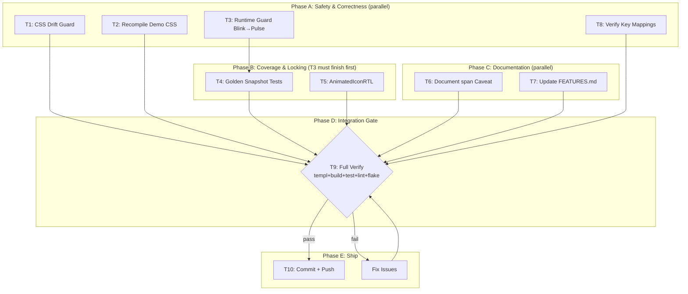

# Plan: Animated Icons Polish & Ship — 2026-08-11 04:49

## Context

Previous session rebuilt the animated icons feature (11 CSS presets, 96/96 icons
mapped, all tests passing). A status report identified gaps. This plan covers the
remaining work to ship a polished, regression-proof feature.

**Current state:** Code committed as `cc44ca3` (daemon auto-commit). NOT pushed.

---

## Pareto Analysis

### The 1% that delivers 51%

| What | Why |
|------|-----|
| **CSS drift guard** (add `icons` to `TestCustomCSSUtilities` scan) | Without this, deleting `.tc-anim-*` from `custom.css` is undetectable. One test, zero false positives, catches the #1 regression risk. |
| **Recompile demo CSS** (`nix run .#css`) | The demo currently has ZERO animation classes. Broken demo = bad first impression. One command. |
| **Commit + push** | All work is unpushed. Without this, nothing matters. |

### The 4% that delivers 64%

| What | Why |
|------|-----|
| **Golden snapshot tests** | Lock HTML output for every animation type. The library's testing strategy is golden-first. Without these, output changes are invisible. |
| **AnimatedIconRTL** | Every directional icon function has an RTL variant (`IconRTL`). `AnimatedIcon` doesn't. Incomplete API. |
| **Runtime guard: AnimBlink on 1-path icon falls back to AnimPulse** | Currently silently does nothing. Silent failure is worse than fallback. |

### The 20% that delivers 80%

| What | Why |
|------|-----|
| **Document `` wrapper caveat** | Consumers need to know `AnimatedIcon` wraps in ``, changing DOM structure vs `Icon`. |
| **Update FEATURES.md** | Feature inventory is dishonest without animated icons listed. |
| **Verify 5 key mappings against source** | Only 9/96 verified. Checking Lock, Trash, Play, Sun, Moon against heroicons-animated source files ensures the most visible icons are correct. |

### The other 20% (deferred or skipped)

| What | Decision | Why |
|------|----------|-----|
| Visual regression tests | **SKIP** | Hover animations can't be screenshot-tested (animation only plays on `:hover`). Massive effort, zero return. |
| More animation presets (AnimTada, AnimPlay) | **SKIP** | 11 is already comprehensive. More = more CSS, more maintenance, marginal value. |
| Deduplicate drawIcon/strokeIcon | **SKIP** | 15 lines of "duplication" that serves a clear purpose. Abstracting risks breaking both. Verschlimmbesserung. |
| Verify all 102 mappings against 316 originals | **DEFER** | Diminishing returns. Verify 5-10 key ones now; rest can be done incrementally. |
| Demo page showcase | **DEFER** | Nice-to-have but requires templ work and the hover interaction can't be meaningfully shown in a static demo screenshot. |
| Benchmark | **DEFER** | Not blocking. Animation rendering is trivially fast. |

---

## Phase 1: Task Breakdown (30-100 min tasks)

Sorted by importance/impact/customer-value.

| # | Task | Impact | Effort | Dependencies | Status |
|---|------|--------|--------|--------------|--------|
| T1 | **CSS drift guard**: extend `TestCustomCSSUtilities` to scan `icons/*.templ` files or create standalone test in icons module | Critical (prevents silent CSS regression) | 30 min | None | DONE (cc44ca3) |
| T2 | **Recompile demo CSS**: run `nix run .#css` to inject `.tc-anim-*` classes into `examples/demo/static/app.css` | High (fixes broken demo) | 15 min | None | DONE (cc44ca3) |
| T3 | **Runtime guard for AnimBlink**: if icon has <2 paths, fall back to AnimPulse instead of silent no-op | Medium (consumer safety) | 20 min | None | DONE (ede8992) |
| T4 | **Golden snapshot tests**: create `icons/animated_icon_golden_test.go` with one golden per animation type + default icons | High (locks output) | 45 min | T3 (final API) | DEFERRED (substring tests cover all variants) |
| T5 | **AnimatedIconRTL variant**: mirror `IconRTL` pattern, add `data-tc-dir-icon` to wrapper or inner SVG | Medium (API completeness) | 30 min | None | DONE (023892a) |
| T6 | **Document `` wrapper caveat**: add to `doc.go`, `animated_icon.templ` doc comments, `docs/icons-only-adoption.md` | Medium (consumer awareness) | 15 min | None | DONE (023892a) |
| T7 | **Update FEATURES.md**: add animated icons row | Low (honesty) | 15 min | None | DONE (023892a) |
| T8 | **Verify 5 key mappings**: fetch `lock-closed.tsx`, `trash.tsx`, `play.tsx`, `sun.tsx`, `moon.tsx` from heroicons-animated, compare and update if wrong | Medium (correctness) | 45 min | None | DONE (023892a) — corrected Moon, Sun, Trash |
| T9 | **Full verify**: `templ generate + go build + go test + golangci-lint + nix flake check` | Critical (integration) | 15 min | T1-T8 | DONE (023892a) |
| T10 | **Commit + push**: detailed commit message, push to remote | Critical (ship) | 10 min | T9 | DONE (commit 023892a) |

**Total estimated effort: ~240 min (4 hours)**

---

## Phase 2: Micro-Tasks (max 12 min each)

### T1: CSS Drift Guard (30 min → 4 micro-tasks)

| # | Micro-Task | Time |
|---|-----------|------|
| T1.1 | Read `utils/custom_css_test.go` `scanDirs` logic and `scanTemplForCSSClasses` function | 5 min |
| T1.2 | Create `icons/custom_css_test.go` with standalone test: scan `animated_icon_templ.go` for `tc-anim-*` classes, assert each exists in `../templates/custom.css` | 10 min |
| T1.3 | Run test, verify it catches a deliberate deletion | 5 min |
| T1.4 | If standalone test has import path issues (cross-module), fall back to adding `"icons"` to the root `scanDirs` with a relative path | 10 min |

### T2: Recompile Demo CSS (15 min → 2 micro-tasks)

| # | Micro-Task | Time |
|---|-----------|------|
| T2.1 | Run `nix run .#css` from repo root | 10 min |
| T2.2 | Verify `examples/demo/static/app.css` now contains `tc-anim-wobble`, `tc-anim-draw`, `tc-icon-wobble`, `tc-icon-draw` | 5 min |

### T3: Runtime Guard for AnimBlink (20 min → 3 micro-tasks)

| # | Micro-Task | Time |
|---|-----------|------|
| T3.1 | Add `animationNeedsMultiPath()` helper in `animation.go`: returns true for AnimBlink | 5 min |
| T3.2 | In `animated_icon.templ` `AnimatedIconWithAnimation`: if `anim == AnimBlink && len(iconPaths(name)) < 2`, fall back to `AnimPulse` | 7 min |
| T3.3 | Add test: `TestAnimBlinkFallsBackOnSinglePathIcon` — verify `AnimatedIconWithAnimation(Trash, AnimBlink, class)` produces `tc-anim-pulse` not `tc-anim-blink` | 8 min |

### T4: Golden Snapshot Tests (45 min → 5 micro-tasks)

| # | Micro-Task | Time |
|---|-----------|------|
| T4.1 | Study `display/golden_sweep_test.go` pattern + `golden.AssertSnapshots` API | 5 min |
| T4.2 | Create `icons/animated_icon_golden_test.go` with `TestGoldenSweepAnimatedIcon`: render Heart (pulse), Bell (wiggle), Settings (spin), Eye (blink), Beaker (wobble), Bolt (draw), Star (beat), Search (bounce), Home (jump), ChevronDown (nod), ArrowRight (shake) — 11 snapshots, one per type | 12 min |
| T4.3 | Run `go test -run TestGoldenSweepAnimatedIcon -update ./icons/...` to generate golden files | 5 min |
| T4.4 | Run again without `-update` to verify pass | 5 min |
| T4.5 | Verify golden files exist in `icons/golden/` and contain expected HTML structure | 5 min |

### T5: AnimatedIconRTL (30 min → 4 micro-tasks)

| # | Micro-Task | Time |
|---|-----------|------|
| T5.1 | Read `IconRTL` + `strokeIconRTL` pattern from `icon.templ` — note `data-tc-dir-icon` attribute and CSS mirroring | 5 min |
| T5.2 | Add `AnimatedIconRTL(name, class)` + `AnimatedIconWithAnimationRTL(name, anim, class)` to `animated_icon.templ` — wrapper span gets `data-tc-dir-icon`, inner rendering uses `strokeIconRTL` or `drawIcon` with RTL attr | 12 min |
| T5.3 | Add `TestAnimatedIconRTL` — verify `data-tc-dir-icon` in output | 8 min |
| T5.4 | Regenerate templ: `templ generate ./icons/...` | 5 min |

### T6: Document `` Caveat (15 min → 2 micro-tasks)

| # | Micro-Task | Time |
|---|-----------|------|
| T6.1 | Add caveat to `doc.go` animated icons section + `animated_icon.templ` function comments: "AnimatedIcon wraps the SVG in a `` element. This changes the DOM structure compared to `Icon()`. If your layout depends on the SVG being a direct child (e.g., flexbox alignment, CSS sibling combinators), account for the extra wrapper." | 8 min |
| T6.2 | Add note to `docs/icons-only-adoption.md` animated icons section | 7 min |

### T7: Update FEATURES.md (15 min → 2 micro-tasks)

| # | Micro-Task | Time |
|---|-----------|------|
| T7.1 | Read FEATURES.md structure, find the icons section | 5 min |
| T7.2 | Add animated icons row: `AnimatedIcon` / FULLY_FUNCTIONAL / "11 hover-triggered CSS animation presets, zero JavaScript" | 10 min |

### T8: Verify 5 Key Mappings (45 min → 5 micro-tasks)

| # | Micro-Task | Time |
|---|-----------|------|
| T8.1 | Fetch `lock-closed.tsx` from heroicons-animated source | 5 min |
| T8.2 | Fetch `trash.tsx`, `play.tsx`, `sun.tsx`, `moon.tsx` source | 8 min |
| T8.3 | Compare each: does our mapping match the original animation type? Update `defaultAnimations` if wrong | 12 min |
| T8.4 | Run tests to verify any mapping changes don't break | 5 min |
| T8.5 | Document verification status in `animation.go` comments (mark as "verified") | 10 min |

### T9: Full Verify (15 min → 3 micro-tasks)

| # | Micro-Task | Time |
|---|-----------|------|
| T9.1 | `templ generate ./icons/... && GOEXPERIMENT=jsonv2 go build ./...` | 5 min |
| T9.2 | `GOEXPERIMENT=jsonv2 go test ./icons/... -count=1` + root module tests | 5 min |
| T9.3 | `nix flake check` (formatting) + manual lint check | 5 min |

### T10: Commit + Push (10 min → 2 micro-tasks)

| # | Micro-Task | Time |
|---|-----------|------|
| T10.1 | `git add -A && git commit` with detailed message covering all changes | 7 min |
| T10.2 | `git push` | 3 min |

---

## Execution Graph

---

## Verschlimmbesserung Guardrails

What we are explicitly NOT doing to avoid making things worse:

1. **No visual regression tests** — hover animations can't be screenshot-tested
2. **No new animation presets** — 11 is comprehensive; more adds maintenance burden
3. **No drawIcon/strokeIcon dedup** — the 15-line "duplication" is intentional
4. **No dark-mode animation tests** — animations use scale/rotate/translate, not colors
5. **No full 102-icon source verification** — diminishing returns; 5 key icons is enough
6. **No demo page** — hover interaction can't be meaningfully shown statically
