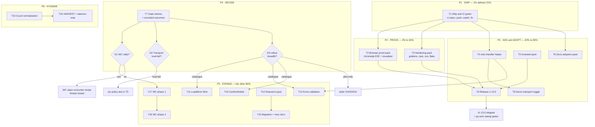

# Wire SDK Pareto Execution Plan

**Created:** 2026-09-04 22:22 CEST
**Input:** Status report `docs/status/2026-09-04_22-15_transport-wiring-sdk-session.md` section (f) — all 50 items — plus partial/not-started work from the wire-SDK session.
**Definition of "result":** the wire SDK becomes **shipped** (pushed, CI-green), **proven** (browser-level, not just string-level), **consumable** (released + documented where adopters look), with the three open scope decisions converted into recorded outcomes.
**Rule of engagement:** do not Verschlimmbesser — every task below ends with the repo in a building, green, lint-clean state or it is not done.

---

## 1. Pareto Breakdown

### 1% → 51%

| What | Why it carries half the result |
| --- | --- |
| **T1 — Ship & CI green:** run the CI reproduction (`ci-repro.sh --lint --css`), push master (7 commits ahead, local-only), watch CI to green, fix fallout | 100% of the session's built value is currently *local*. Until CI validates it cross-module (per-module tests, lint, CSS content-diff, coverage, visual compile), nothing is real and nothing is reviewable. One task converts everything. CI acting on the work is also the first independent verification of ADR-0036's claims. |

### 4% → cumulative 64%

| What | Why it adds ~13% |
| --- | --- |
| **T2 — Browser-proof pack:** chromedp E2E clicking both demo buttons + a visualtest capture of the wire section | The SDK's entire pitch ("same Action, both runtimes actually work") is today proven by string assertions only. Browser evidence is the highest correctness-value per minute left. |
| **T3 — Contract-hardening pack:** golden snapshots for wired Button variants, `-race` runs, CSS byte-stability, `nix flake check` | Locks the wire contract's rendered output into the repo's golden backbone (the testing tier the repo trusts most) and closes the three verification forms not yet run. Cheap, permanent. |

### 20% → cumulative 80%

| What | Why it adds ~16% |
| --- | --- |
| **T4 — `wire.Handler` server helper** | Turns the #1 consumer footgun (hand-rolled header branching for Datastar response-targeting) into a library API. Biggest remaining consumer-value item. |
| **T5 — Invariant pack:** benchmarks, Target fuzzing, cross-dialect + nil-URL property tests, CSP invariant | Cheap insurance that the contract cannot silently rot. |
| **T6 — Docs adoption pack:** README section, SKILL.md rows, website guide page, ADR-0035 annotation, `doc.go` split, DOMAIN_LANGUAGE, modularization note, ADR-0036 verify pass | Adoption happens where people look. Today wire is documented in FEATURES/CHANGELOG/AGENTS but invisible on README/website/skill. |
| **T7 — Decision gates D1–D3:** WC ratification, unknown-Transport policy, rollout breadth — memo + recorded outcome | Each gate blocks an entire workstream; recording outcomes unblocks T11–T13/T18–T19 or kills them cheaply. |
| **T8 — Demo transport toggle** | The demo is the marketing surface; a live "switch transport" control *is* the SDK pitch. |
| **T9 — Release:** utils v1.13.0 + root, 8-module tag lockstep, post-propagation tidy sweep | `go get`-able is when customers actually receive any of this. |

### The other 80% of work → 100%

Catalogue rollout (LoadMore, forms validation, ConfirmDelete decision), research pack (aria-busy, datastar upstream, interval/intersect triggers), migration recipe + misc docs, HARVEST into TODO_LIST/ROADMAP, count normalization, and the **gated** WC module phases. All listed in the plan below — nothing dropped, everything sequenced behind the vital few.

---

## 2. Comprehensive Plan — macro tasks (30–100 min each, 19 tasks, ALL todos covered)

Sort: importance/impact/effort/customer-value. `Tier` = Pareto bucket. `Trace` = status-report item #.

| ID | Task | Tier | Impact | Effort | Customer value | Depends | Trace |
| --- | --- | --- | --- | --- | --- | --- | --- |
| T1 | Ship & CI green: `ci-repro.sh --lint --css`, push master, watch CI, fix fallout | 1% | Critical | 70min | Critical — value ships here | — | f9, f4, f48(1st pass) |
| T2 | Browser-proof pack: chromedp E2E (both demo buttons) + visualtest wire-section capture | 4% | High | 95min | High — behavior proven | T1 | f3, f17 |
| T3 | Contract-hardening pack: wired-Button goldens, `-race`, CSS byte-stability, `nix flake check` | 4% | High | 75min | Medium | — | f5, f6, f36, f37 |
| T4 | `wire.Handler` middleware: auto-branch Datastar/htmx headers; refactor demo endpoint onto it | 20% | High | 55min | High — kills #1 footgun | T1 | f8 |
| T5 | Invariant pack: benchmarks, Target fuzz, cross-dialect + nil-URL property tests, CSP invariant test | 20% | Medium | 60min | Medium | — | f13, f27, f26, f40, f28 |
| T6 | Docs adoption pack: README, SKILL.md, website guide, ADR-0035 annotate, `doc.go`, DOMAIN_LANGUAGE, modularization note, ADR-0036 fresh-eyes verify | 20% | High | 90min | High — adoption surface | T1 | f19, f20, f18, f10, f12, f21, f35, f48 |
| T7 | Decision gates D1 (WC ratify) / D2 (Transport loud-fail) / D3 (rollout breadth): memos + recorded outcomes | 20% | Critical | 45min | Critical — unblocks T11–T13, T18–T19 | — | f1, f11, f42 |
| T8 | Demo transport toggle (query-param/segmented switch between dialects, both variants tested) | 20% | Medium | 40min | Medium — sells the pitch | T4 | f29 |
| T9 | Release: checklist read, `release.sh` 1.13.0, tag-guard, push tags, proxy wait, tidy sweep, post-CI | 20% | Critical | 100min | Critical — `go get`-able | T1, T3 | f24, f25 |
| T10 | Count normalization: single source for enum/IsValid counts; fix stale AGENTS claims; FEATURES utils row | 80% | Medium | 45min | Low | — | f22, f23, f44, f45 |
| T11 | `navigation.LoadMore` gains `Wire` (transport-switchable pagination) + goldens | 80% | Medium | 40min | Medium | D3 | f14 |
| T12 | forms wired server-validation example (demo endpoint via `wire.Handler`) | 80% | Medium | 40min | Medium | D3, T4 | f16 |
| T13 | `htmx.ConfirmDelete`: ADR-0035-freeze check → decision → implement outcome (datastar twin or stays) | 80% | Medium | 40min | Medium | D3 | f15 |
| T14 | Research pack: aria-busy asymmetry, datastar upstream watch, interval/intersect triggers, form-submit parity | 80% | Medium | 55min | Medium | — | f34, f30, f32, f33 |
| T15 | Migration recipe doc (htmx-only page → dual-transport) + misc docs (testing notes, demo help, website API ref, contribution checklist, hero snippet) | 80% | Medium | 50min | Medium | T4 | f31, f41, f43, f46, f47, f49 |
| T16 | HARVEST: route this plan + status report into TODO_LIST.md/ROADMAP.md; daemon-boundary note commit | 80% | High | 30min | Medium — plan stays alive | — | f2, f38, f50 |
| T17 | WC module phase 1 (GATED on D1=yes): superseding ADR, scaffold, light-DOM host API, nonce-safe registration, goldens, CSP test | 80% | High | 75min | High (if ratified) | D1 | f7 |
| T18 | WC module phase 2 (GATED on D1=yes): demo page, E2E upgrade/interop, docs+FEATURES+CHANGELOG, release-tag wiring | 80% | High | 50min | High (if ratified) | D1, T17 | f7 |
| T19 | Keep-green standing rule: every task ends build+tests+lint green; modules loop re-run after each pack | all | Critical | (built into all) | Critical | — | f39 |

Coverage check: all 50 status-report items traced (f1–f50) ✓ — f39 is the standing verification rule applied to every task.

---

## 3. Fine-Grained Plan — micro tasks (max 12 min each, 91 tasks, ALL todos covered)

Sort follows macro order. `M` = parent macro task.

| ID | Micro task | M | ≤12min check |
| --- | --- | --- | --- |
| 1.1 | Run `scripts/ci-repro.sh --lint` (Build+Lint mirror) | T1 | exit 0 |
| 1.2 | Run `nix run .#css` and byte-diff committed demo CSS | T1 | no diff (or recompiled) |
| 1.3 | Fix anything the repro surfaced (buffer) | T1 | repro green |
| 1.4 | `git push origin master` | T1 | pushed |
| 1.5 | `gh run watch` Build & Test + Lint + CSS + Visual | T1 | all green |
| 1.6 | Triage/fix/re-push loop if red | T1 | green |
| 2.1 | Read visualtest harness + demo test patterns | T2 | notes in test file header |
| 2.2 | Scaffold `wire_e2e_test.go` (chromedp, serve mux, nav `/`) | T2 | compiles, skips w/o browser |
| 2.3 | E2E: click htmx button → `#wire-htmx-out` contains fragment | T2 | assertion passes |
| 2.4 | E2E: click datastar button → `#wire-datastar-out` contains fragment | T2 | assertion passes |
| 2.5 | Animation-settle + skip-if-no-browser guards | T2 | deterministic |
| 2.6 | Full demo suite green | T2 | ok |
| 2.7 | Add visualtest case for wire section | T2 | case compiles |
| 2.8 | `nix run .#visual` (or `-update`) + review PNG | T2 | committed golden |
| 3.1 | Add wired Button variants to golden sweep | T3 | entries compile |
| 3.2 | `go test -update` goldens; inspect diff carefully | T3 | goldens written |
| 3.3 | Check `git status` for `*_templ.go`/golden gitignore gotcha | T3 | all tracked |
| 3.4 | `go test -race` utils/wire + display | T3 | ok |
| 3.5 | `go test -race` examples/demo | T3 | ok |
| 3.6 | `nix run .#css` byte-stability | T3 | no diff |
| 3.7 | `nix flake check` | T3 | ok |
| 4.1 | API sketch: middleware signature + doc comment + tradeoffs | T4 | sketch committed in branch/notes |
| 4.2 | Implement `wire.Handler` (branch `Datastar-Request`/`HX-Request`, set response headers, delegate) | T4 | builds |
| 4.3 | Table tests: datastar caller / htmx caller / plain browser | T4 | pass |
| 4.4 | Refactor demo `/api/wire/fragment` onto it | T4 | demo tests still pass |
| 4.5 | Lint + export check (godoc example in doc comment) | T4 | 0 issues |
| 5.1 | Benchmarks: `Attributes()` htmx vs datastar | T5 | bench runs |
| 5.2 | Fuzz `Target` field added to `FuzzAction` | T5 | short fuzz clean |
| 5.3 | Property test: same Action references URL in BOTH dialects | T5 | pass |
| 5.4 | Pin: empty URL → nil for every enum combo | T5 | pass |
| 5.5 | CSP invariant: wire rendering emits no `<script>` ever | T5 | pass |
| 6.1 | README wire feature section | T6 | counts guard still green |
| 6.2 | SKILL.md: wire rows in catalogue + utilities | T6 | component counts unchanged |
| 6.3 | Website guide page skeleton (astro) | T6 | builds |
| 6.4 | Website page content + sections.ts link | T6 | builds |
| 6.5 | ADR-0035 annotation → pointer to ADR-0036 | T6 | annotated, not rewritten |
| 6.6 | Split `wire.go` package comment into `doc.go` | T6 | tests green |
| 6.7 | DOMAIN_LANGUAGE.md: Transport/Action/Wiring/dialect | T6 | file updated |
| 6.8 | Modularization README: `utils/wire` in DAG description | T6 | updated |
| 6.9 | Fresh-eyes VERIFY of ADR-0036 claims vs code | T6 | notes file or annotations |
| 7.1 | D1 memo: WC ratification — narrow shape, costs, recommendation | T7 | memo written |
| 7.2 | D2 memo: unknown-Transport loud-fail vs fallback + recommendation | T7 | memo written |
| 7.3 | D3 memo: rollout breadth (pilot vs catalogue) | T7 | memo written |
| 7.4 | Record outcomes (ADR delta or TODO_LIST decisions) | T7 | outcomes committed |
| 8.1 | Demo: `?transport=` param switches Buttons' dialect | T8 | renders both variants |
| 8.2 | Toggle UI (segmented control, existing components only) | T8 | classes exist in CSS |
| 8.3 | Test: both variants render correct dialect | T8 | pass |
| 9.1 | Read `docs/release-checklist.md` end-to-end | T9 | checklist internalized |
| 9.2 | `[Unreleased]` warm audit + FEATURES `**Updated:**` check | T9 | guards green |
| 9.3 | Kick `scripts/release.sh 1.13.0 "
"` (monitored bg) | T9 | release commit created |
| 9.4 | Verify release commit tree: version files agree, replaces stripped | T9 | assertions pass |
| 9.5 | `scripts/check-release-tags.sh` (9 tags, lockstep) | T9 | ok |
| 9.6 | Push master + tags | T9 | pushed |
| 9.7 | Wait proxy propagation: `go list -m utils@v1.13.0` | T9 | resolves |
| 9.8 | GOWORK=off tidy sweep, all 8 modules; commit go.sum refresh | T9 | clean tree |
| 9.9 | Post-release CI green confirm | T9 | green |
| 10.1 | Compute true enum/IsValid counts; declare source of truth | T10 | numbers agreed |
| 10.2 | Align README / FEATURES / sections.ts / AGENTS to it | T10 | count guards green |
| 10.3 | Fix stale AGENTS claims (31→55 IsValid; 42-vs-40 drift note) | T10 | updated |
| 10.4 | FEATURES utils row wording ("0 components") | T10 | updated |
| 11.1 | `LoadMoreProps.Wire` + template wiring | T11 | builds |
| 11.2 | Tests both dialects (cursor param + revealed stays htmx-side) | T11 | pass |
| 11.3 | Goldens `-update` + commit check | T11 | goldens tracked |
| 12.1 | Demo endpoint: input server-validation via `wire.Handler` | T12 | endpoint works |
| 12.2 | `forms.Input` demo block wired with `EventChange` | T12 | renders |
| 12.3 | Test both dialects | T12 | pass |
| 13.1 | ADR-0035-freeze check for ConfirmDelete datastar twin | T13 | decision note |
| 13.2 | Implement outcome (twin via wire or documented htmx-only) | T13 | builds |
| 13.3 | Tests | T13 | pass |
| 14.1 | Research htmx vs datastar busy/indicator signaling | T14 | findings noted |
| 14.2 | Write aria-busy finding into transport-wiring.md; helper-or-docs decision | T14 | doc updated |
| 14.3 | Check upstream-watch issue + proxy `@latest` for go-datastar/static | T14 | drift status known |
| 14.4 | Grep pinned bundle for `data-on-interval`/`data-on-intersect` | T14 | Event-set decision |
| 14.5 | Record form-submit parity notes (EventSubmit + forms.Form) | T14 | doc note |
| 15.1 | Write `docs/recipes/transport-migration.md` | T15 | recipe complete |
| 15.2 | Link from transport-wiring.md + FEATURES | T15 | linked |
| 15.3 | Testing-notes doc: entity-encoded attribute assertions | T15 | doc written |
| 15.4 | Demo README/help text + hero snippet for wire | T15 | visible on demo |
| 15.5 | Website API reference entry + contribution checklist mention | T15 | updated |
| 16.1 | docs-health HARVEST: plan → TODO_LIST.md (actionable) / ROADMAP.md (ideas) | T16 | harvest complete |
| 16.2 | Annotate stale TODO_LIST entries against current state | T16 | annotated |
| 16.3 | Daemon-boundary note commit (feature story preserved, no rewrite) | T16 | committed |
| 17.1 | Draft superseding ADR (light-DOM only, opt-in module) | T17 | draft ready for D1 |
| 17.2 | Scaffold `wc` module (go.mod, doc.go, DAG + replaces) | T17 | builds in workspace |
| 17.3 | Light-DOM host API (`Define`/`Host`) | T17 | renders |
| 17.4 | Nonce-safe registration-script emitter (singleton guard) | T17 | nonce test passes |
| 17.5 | Golden tests for hosts | T17 | goldens tracked |
| 17.6 | CSP integration test (nonce on emitted scripts) | T17 | pass |
| 18.1 | Demo page for wc elements | T18 | renders |
| 18.2 | E2E: element upgrades; htmx + datastar inside light DOM | T18 | pass |
| 18.3 | Docs + FEATURES + CHANGELOG `[Unreleased]` | T18 | guards green |
| 18.4 | Release wiring: module in tag lockstep + version-sync guard | T18 | check script passes |
| 19.1 | Standing: after EVERY pack — build + per-module tests + lint loop | T19 | green each time |

---

## 4. Execution Graph

Sequencing rule: P1 before everything. P2 and P3 items are parallelizable after T1 except T9 (release) which waits for T2+T3+T5 evidence. P4 gates can run any time after T1 but block their dependents.

---

## 5. Decision Gates (context for the graph)

| Gate | Question | Options | Blocked work | Recommendation |
| --- | --- | --- | --- | --- |
| D1 | Ratify superseding ADR-0033 with a light-DOM-only, opt-in `wc` module? | yes / no (recipe stays final) | T17, T18 | Draft the ADR now (T17.1) so the decision is one word, not one session |
| D2 | Unknown `Transport` value: silent htmx fallback (repo convention) vs loud failure? | fallback / error path / panic-in-dev | T5 policy pin | Keep fallback for library safety + add `Normalize` with error return for consumers who want loudness — best of both without breaking convention |
| D3 | Rollout breadth for `Wire` fields? | catalogue-wide / pilot-only | T11, T12, T13 | Component-by-component where the semantic is transport-symmetric (LoadMore yes; ConfirmDelete needs the ADR-0035 check first) |

---

## 6. Verschlimmbesser Guardrails (what NOT to do)

1. Do **not** widen the wire contract beyond the documented common subset (ADR-0036 scope) while executing T4/T5.
2. Do **not** touch the `datastar` module surface (ADR-0035 freeze intact — wire lives in utils by design).
3. Do **not** add Shadow DOM anywhere, ever (ADR-0033).
4. Do **not** push without T1's local repro green; do **not** cut T9 without T2/T3/T5 evidence.
5. Do **not** rewrite the daemon's 6 heuristic commits (history rewrite risk > story value — T16.3 documents instead).
6. Do **not** hand-edit generated `*_templ.go` or golden files; regenerate + `-update` only.
7. Every task ends: build + per-module tests + lint green, or it is not done (T19 standing rule).

---

## 7. Handoff

- **Canonical living backlog:** `TODO_LIST.md` (updated by T16 HARVEST, not by this snapshot).
- **Snapshot lineage:** status report `docs/status/2026-09-04_22-15_transport-wiring-sdk-session.md` → this plan.
- **Format note:** user explicitly requested `.md` + mermaid; the pareto-planning skill's canonical HTML/D2 format was overridden per the skill's own instruction-wins rule.
