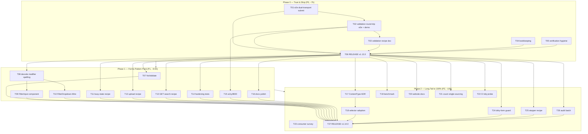

# Forms × Transports — Pareto Execution Plan (Dual-Transport Dominance)

**Date:** 2026-09-07 16:24 CEST
**Source:** `docs/status/2026-09-07_16-20_dual-transport-forms-wire-content-type.md` (this session's status report, 50-item backlog) + open repo TODOs #150/#153/#154 where they overlap.
**Mission:** make forms support under **both** HTMX and Datastar production-grade: trustworthy (browser-proven), complete (validation round-trip, filters, busy/upload/search patterns), documented, and **released** (v1.13.3).
**Ground state at plan time:** `wire.Action.ContentType` + `forms.FormProps.Wire` shipped on master (unpushed daemon commits), all static verification green (build / root+per-module tests / lint / CSS / flake). The feature is string-proven, NOT browser-proven.

**Anti-verschlimmbesserung rules (binding):**

1. No new runtime facts without bundle-level verification (repo's hardest lesson — the SSE audit).
2. No API surface without its full test lens (golden + a11y + BDD + edge + example + contract inventory).
3. Don't touch ADR-decided ground (0030 default transport, 0033 no web components, 0036 response-driven targeting) without a new ADR.
4. Bookkeeping (TODO_LIST, gates doc, CHANGELOG `[Unreleased]`) moves in the same change as the feature.
5. Never regenerate goldens blindly — eyeball every `-update` diff.

---

## 1. Pareto Breakdown

### The 1% that deliver 51% — THE TRUST PIN

| #       | Task                                                                                                                                                                                                                               | Why it is half the remaining value                                                                                                                                                                                                                                                                                                        |
| ------- | ---------------------------------------------------------------------------------------------------------------------------------------------------------------------------------------------------------------------------------- | ----------------------------------------------------------------------------------------------------------------------------------------------------------------------------------------------------------------------------------------------------------------------------------------------------------------------------------------- |
| **T01** | **Browser-level e2e proof of the dual-transport form submit** (`visualtest/wire_e2e_test.go`: fill + submit the demo form under the locally-served pinned Datastar bundle AND self-hosted htmx; assert the verdict region updates) | The whole shipped feature rests on a string-level contract. If the runtime rejects our expression, everything is **inert for Datastar consumers** — the exact failure mode the 2026-08 SSE audit caught (docs right, integration dead). One test converts "probably works" into "provably works". ~90min for >51% of the remaining value. |

### The 4% that deliver 64% — REAL, VALIDATED, RELEASED

T01 plus:

| #       | Task                                                                                                                                                                                                           | Why                                                                                                             |
| ------- | -------------------------------------------------------------------------------------------------------------------------------------------------------------------------------------------------------------- | --------------------------------------------------------------------------------------------------------------- |
| **T02** | Validation round-trip e2e + demo error branch (server re-renders form fragment with `Input.Error` + `ValidationSummary`)                                                                                       | Consumers don't want "form submits" — they want submit → validate → inline field errors. That IS forms support. |
| **T03** | `docs/recipes/server-side-validation.md` (htmx default-swap vs `wire.Handler` for Datastar, 422 pattern)                                                                                                       | The recipe makes the pattern copy-pasteable; multiplies the demo's value.                                       |
| **T04** | Close-out bookkeeping + verification hygiene (TODO #153, wire-gates D3 entry, DOMAIN_LANGUAGE, AGENTS.md templ-import gotcha; visualtest compile check, canonical `nix run .#verify`, prerender/PNG staleness) | Tiny, prevents drift, closes the session's stated gaps.                                                         |
| **T05** | **Release v1.13.3** (verify → release.sh → post-release tidy sweep → CI green)                                                                                                                                 | Value counts when shipped; `[Unreleased]` is warm and waiting.                                                  |

### The 20% that deliver 80% — THE FORMS PATTERN PACK

The above plus:

| #       | Task                                                                                                                          | Why                                                                         |
| ------- | ----------------------------------------------------------------------------------------------------------------------------- | --------------------------------------------------------------------------- |
| **T06** | `FormProps.NoValidate` — symmetric validation opt-out (Datastar validates by default, htmx needs `Validate`)                  | API honesty: the default-on gate must be escapable.                         |
| **T07** | Decode the Datastar modifier key spelling from unminified upstream + record in facts doc                                      | Unblocks debounced FilterInput; closes the one unverified claim I softened. |
| **T08** | `forms.FilterInput` — debounced dual-transport search input (full test matrix)                                                | Second-most common forms pattern after submit (search/filter bars).         |
| **T09** | `FilterDropdown.Wire` (wrapper-form vs signal-binding tradeoff, decided in writing first)                                     | The existing HTMX-only component gets transport parity.                     |
| **T10** | Busy-state recipe (htmx `LoadingButton` vs `datastar.Indicator` on wired submits) + demo                                      | Perceived performance = #1 UX factor on forms.                              |
| **T11** | File-upload recipe (`enctype=multipart` + `FileInput` + wire — FormData path already bundle-verified) + demo                  | Uploads are the classic hypermedia wallflower.                              |
| **T12** | GET search-form recipe (fields → query params, both dialects) + demo                                                          | Cheap, high-frequency pattern; one golden pins parity.                      |
| **T13** | Hardening batch: integration composition test, `ExampleForm_wire`, `formWireAttributes` fuzz, `Validate+Wire` Datastar golden | Belt-and-braces on the shipped surface.                                     |
| **T14** | a11y/BDD batch: Form-wire BDD specs, aria-live verdict announcement pinned                                                    | A11y is part of "done" in this repo.                                        |
| **T15** | Docs polish: SKILL quick-start form snippet, datastar-integration link, javascript-guide ladder note, README forms blurb      | Discoverability = adoption.                                                 |

### The other 20% to reach 100% — LONG TAIL

ADR for the ContentType contract extension (T16), Datastar `selector` adoption (T17), wire benchmark (T18), website api-reference + sections.ts label fix (T19), count single-sourcing (T20), CI post-propagation tidy probe (T21), consumer-request survey (T22), dirty-form guard (T23), multi-step/stepper recipe (T24), long-tail audit batch — Combobox/TagsInput round-trip, Enter-key audit, rate-limit/CSP notes, Button-vs-Form wiring docs, Calendar survey (T25).

---

## 2. Comprehensive Plan — 27 tasks, 30–100min each (≈26.5h total)

Sorted by importance → impact → customer value (effort shown for scheduling).

### Phase 0 — P0: Trust & Ship (1% + 4%; ≈7h)

| ID  | Task (30–100min)                                                                                                                          | Impact       | Effort | Customer value                                | Depends | Source              |
| --- | ----------------------------------------------------------------------------------------------------------------------------------------- | ------------ | ------ | --------------------------------------------- | ------- | ------------------- |
| T01 | E2E: dual-transport form submit in real Chromium (Datastar bundle + htmx)                                                                 | **Critical** | 90m    | Proof the headline feature works in a browser | —       | report #1           |
| T02 | E2E: validation round-trip (invalid submit → field errors visible) + demo `/api/wire/form` invalid branch + error fragment + tests/golden | **Critical** | 60m    | The #1 forms use case, proven                 | T01     | report #9,#10       |
| T03 | Recipe `docs/recipes/server-side-validation.md` (both transports, 422 pattern)                                                            | High         | 45m    | Copy-pasteable pattern                        | T02     | report #9           |
| T04 | Bookkeeping: TODO #153 close, wire-gates D3 Form entry, DOMAIN_LANGUAGE terms, AGENTS.md templ-import gotcha                              | High         | 30m    | Prevents drift; unblocks trust audit          | —       | report #3,#4,#8,#33 |
| T05 | Verification hygiene: visualtest compile+tidy, canonical `nix run .#verify`, prerender freshness, wire PNG check                          | High         | 45m    | The session's stated verification gaps        | —       | report #2,#5,#6,#7  |
| T06 | **Release v1.13.3**: verify matrix → `scripts/release.sh` → re-add replaces + post-release tidy sweep → CI green                          | **Critical** | 90m    | Value ships                                   | T01–T05 | report #42          |

### Phase 1 — P1: Forms Pattern Pack (20%→80%; ≈9.5h)

| ID  | Task                                                                                                                 | Impact              | Effort | Value                                   | Depends |
| --- | -------------------------------------------------------------------------------------------------------------------- | ------------------- | ------ | --------------------------------------- | ------- |
| T07 | `FormProps.NoValidate` + tests + golden + docs                                                                       | Medium-High         | 45m    | Validation opt-out symmetry             | T06     |
| T08 | Decode Datastar modifier spelling (unminified upstream) → facts doc                                                  | High (unblocks T09) | 45m    | Verified fact replaces softened claim   | —       |
| T09 | `forms.FilterInput` — debounced dual-transport search (full matrix: golden/a11y/BDD/edge/example/contract/demo/docs) | High                | 100m   | Search/filter = top-2 forms pattern     | T08     |
| T10 | `FilterDropdown.Wire` — tradeoff note + implementation + tests/goldens                                               | Medium-High         | 90m    | Transport parity for existing component | T08     |
| T11 | Busy-state recipe + demo (LoadingButton vs datastar.Indicator on wired submits)                                      | Medium              | 45m    | Perceived perf on submits               | T06     |
| T12 | File-upload recipe + demo (multipart + FileInput + wire)                                                             | Medium              | 60m    | Uploads work under both runtimes        | T06     |
| T13 | GET search-form recipe + demo (query-param parity)                                                                   | Medium              | 30m    | Cheap, frequent pattern                 | T06     |
| T14 | Hardening: integration composition, `ExampleForm_wire`, fuzz `formWireAttributes`, `Validate+Wire` Datastar golden   | Medium              | 60m    | Surface durability                      | T06     |
| T15 | a11y/BDD: Form-wire BDD specs, aria-live verdict pin                                                                 | Medium              | 45m    | Repo's "done" bar                       | T02     |
| T16 | Docs polish batch (SKILL quick-start, datastar-integration link, javascript-guide note, README blurb)                | Medium              | 45m    | Adoption/discoverability                | T06     |

### Phase 2 — P2: Long Tail → 100% (other 20%; ≈10h)

| ID  | Task                                                                                                                                                    | Impact  | Effort | Value                                                           | Depends |
| --- | ------------------------------------------------------------------------------------------------------------------------------------------------------- | ------- | ------ | --------------------------------------------------------------- | ------- |
| T17 | ADR: ContentType common-subset extension (ADR-0038 or 0036 addendum)                                                                                    | Medium  | 45m    | Decision record for contract change already shipped             | T06     |
| T18 | Datastar `selector` fetch option adoption in `wire.Action` (+ update `TestTargetNeverRenderedForDatastar`!)                                             | Medium  | 90m    | Client-side targeting for Datastar (deliberate contract change) | T17     |
| T19 | Wire benchmark: form-expression path                                                                                                                    | Low     | 30m    | Perf guard                                                      | T06     |
| T20 | Website: api-reference.mdx wire check + sections.ts label semantics fix                                                                                 | Low-Med | 45m    | Docs truth                                                      | T06     |
| T21 | Single-source IsValid/enums counts (kill README×2+sections.ts coupling)                                                                                 | Medium  | 60m    | Removes recurring drift class                                   | T06     |
| T22 | CI: post-propagation tidy probe workflow (+ actionlint, ci-repro wiring)                                                                                | Medium  | 60m    | Automates the v1.11/12/13 lesson                                | T06     |
| T23 | Consumer survey: grep consumer AGENTS.md adoption tables → gaps into TODO_LIST                                                                          | Medium  | 30m    | Demand-driven roadmap                                           | —       |
| T24 | Dirty-form unsaved-changes guard (singleton JS, CSP-safe, full matrix)                                                                                  | Medium  | 90m    | Classic forms gap, high user pain                               | T06     |
| T25 | Multi-step form / Stepper recipe (StepIndicator + fragments)                                                                                            | Medium  | 90m    | Wizard flows                                                    | T06     |
| T26 | Long-tail audit batch: Combobox/TagsInput hidden-input round-trip, Enter-key audit, rate-limit + CSP notes, Button-vs-Form wiring docs, Calendar survey | Low-Med | 60m    | Closes the 50-item backlog remainder                            | T06     |
| T27 | **Release v1.14.0** (Pattern Pack + long-tail shipped this cycle)                                                                                       | High    | 90m    | Value ships, again                                              | T07–T26 |

---

## 3. Micro Plan — 89 tasks, ≤12min each (sorted within phase by importance)

### Phase 0 — Trust & Ship (T01–T06)

| ID    | Task                                                                                                      | Est | Dep     |
| ----- | --------------------------------------------------------------------------------------------------------- | --- | ------- |
| M01.1 | Read `wire_e2e_test.go` harness (readiness gate, bundle serving, target selection)                        | 10m | —       |
| M01.2 | Add fill+submit helper for the demo form (both dialect views)                                             | 12m | M01.1   |
| M01.3 | Datastar e2e: submit form, wait for `#wire-form-out` verdict                                              | 12m | M01.2   |
| M01.4 | htmx e2e: submit form, assert verdict; run full e2e via `nix run .#visual`                                | 12m | M01.3   |
| M01.5 | Fix any flakes; pin verdict text in both dialects                                                         | 8m  | M01.4   |
| M02.1 | Endpoint: `/api/wire/form` invalid-input branch (empty/bad email → field errors)                          | 10m | M01.5   |
| M02.2 | Fragment: re-render form with `Input.Error` + `ValidationSummary`                                         | 12m | M02.1   |
| M02.3 | Demo tests: error branch both transports (headers + body)                                                 | 10m | M02.2   |
| M02.4 | Golden for the error fragment; e2e assertion: errors visible after invalid submit                         | 12m | M02.3   |
| M03.1 | Recipe skeleton: flow diagram + file links                                                                | 10m | M02.4   |
| M03.2 | Recipe: htmx path (default swap vs hx-target, 422 pattern)                                                | 12m | M03.1   |
| M03.3 | Recipe: Datastar path (`wire.Handler` PatchTarget, id-matched patching)                                   | 12m | M03.2   |
| M03.4 | Recipe: compile-check code samples; cross-link from transport-wiring.md + SKILL                           | 10m | M03.3   |
| M04.1 | Close TODO #153 in TODO_LIST.md (Form shipped; note SimpleNav as next survey)                             | 5m  | —       |
| M04.2 | wire-gates doc: D3 entry for Form adoption (tests+goldens cited)                                          | 8m  | —       |
| M04.3 | DOMAIN_LANGUAGE.md: ContentType, form encoding, response-driven targeting                                 | 8m  | —       |
| M04.4 | AGENTS.md: templ auto-import collision gotcha (`.templ` files must not import `github.com/a-h/templ`)     | 6m  | —       |
| M05.1 | visualtest: GOWORK=off compile check + `go mod tidy` if stale                                             | 10m | —       |
| M05.2 | Canonical one-shot `nix run .#verify`; fix anything it flags                                              | 12m | M05.1   |
| M05.3 | Check `prerender.go` output freshness vs new demo section                                                 | 10m | M05.2   |
| M05.4 | Check wire visual PNGs render the section; regenerate if stale                                            | 12m | M05.3   |
| M06.1 | Pre-release: rerun full verify matrix + `scripts/check-release-tags.sh` dry logic                         | 12m | M01–M05 |
| M06.2 | Bump triad: `utils/version.go` + CHANGELOG heading + FEATURES `**Version:**`                              | 10m | M06.1   |
| M06.3 | Run `scripts/release.sh 1.13.3 "
"`; review commit + tag                                          | 12m | M06.2   |
| M06.4 | Post-release: re-add replaces commit + GOWORK=off tidy sweep all 7 modules + visualtest; confirm CI green | 12m | M06.3   |

### Phase 1 — Forms Pattern Pack (T07–T16)

| ID    | Task                                                                            | Est | Dep   |
| ----- | ------------------------------------------------------------------------------- | --- | ----- |
| M07.1 | `FormProps.NoValidate` render logic (`novalidate` attr) + tests                 | 10m | M06.4 |
| M07.2 | Golden + parity-table doc update                                                | 10m | M07.1 |
| M07.3 | FACTS check: confirm `novalidate` skips the Datastar gate (bundle token)        | 6m  | M07.1 |
| M08.1 | Fetch unminified Datastar upstream source (pinned ref)                          | 8m  | —     |
| M08.2 | Decode `on` plugin modifier key spelling (`data-on:x.__mod.arg`?)               | 12m | M08.1 |
| M08.3 | Record verified spelling in facts doc; drop the "unverified" hedge              | 8m  | M08.2 |
| M09.1 | FilterInput design: props, `DebounceMS` field, naming                           | 12m | M08.3 |
| M09.2 | Render: htmx dialect (`input changed delay:Nms`)                                | 12m | M09.1 |
| M09.3 | Render: Datastar dialect (modifier per decoded spelling)                        | 12m | M09.2 |
| M09.4 | Golden sweep entries + generate + eyeball diff                                  | 10m | M09.3 |
| M09.5 | a11y (search landmark, label) + edge tests (0ms, unknown enum)                  | 12m | M09.4 |
| M09.6 | BDD + godoc example tests                                                       | 12m | M09.5 |
| M09.7 | Contract inventory + `git add -f` generated file + CSS recompile                | 8m  | M09.6 |
| M09.8 | Demo section + demo counts test                                                 | 12m | M09.7 |
| M09.9 | SKILL/README/FEATURES catalogue rows + CHANGELOG entry                          | 10m | M09.8 |
| M10.1 | FilterDropdown.Wire tradeoff note (wrapper form vs signals) — decide in writing | 10m | M08.3 |
| M10.2 | Wire field + dialect rendering implementation                                   | 12m | M10.1 |
| M10.3 | Tests + goldens both dialects                                                   | 12m | M10.2 |
| M10.4 | Docs rows (FEATURES/SKILL) + CHANGELOG                                          | 8m  | M10.3 |
| M11.1 | Busy demo: LoadingButton (htmx card) + `data-indicator` (Datastar card)         | 12m | M06.4 |
| M11.2 | Recipe section: transport-wiring.md busy-state for wired forms                  | 10m | M11.1 |
| M11.3 | a11y: pin `role=status` announcement in demo test                               | 6m  | M11.1 |
| M12.1 | Upload demo: multipart endpoint + `FileInput` + `enctype` form                  | 12m | M06.4 |
| M12.2 | Upload recipe doc (both dialects; bundle-verified FormData path)                | 12m | M12.1 |
| M12.3 | e2e/manual verification note + limits (CSRF, size)                              | 6m  | M12.2 |
| M13.1 | GET search demo form (MethodGet + form encoding → query params)                 | 10m | M06.4 |
| M13.2 | GET recipe section + golden pinning query-param parity                          | 10m | M13.1 |
| M14.1 | `integration/composition_test.go`: Form+Input+Button+wire.Handler stack         | 12m | M06.4 |
| M14.2 | `ExampleForm_wire` godoc example                                                | 8m  | M14.1 |
| M14.3 | Fuzz `formWireAttributes` (nil/URL-less/unknown enums)                          | 8m  | M14.1 |
| M14.4 | Golden: `Validate+Wire` Datastar combo (no validation attr emitted)             | 6m  | M14.1 |
| M15.1 | BDD specs for Form wire behavior (submit/no-JS fallback/inert)                  | 12m | M02.4 |
| M15.2 | Pin aria-live verdict announcement in forms/demo tests                          | 6m  | M15.1 |
| M16.1 | SKILL quick-start: dual-transport form snippet                                  | 6m  | M06.4 |
| M16.2 | datastar-integration.md: link Forms section                                     | 4m  | M16.1 |
| M16.3 | javascript-guide.md: ladder note (form submit = zero-JS path wire covers)       | 8m  | M16.2 |
| M16.4 | README forms blurb (wire + validation recipe links)                             | 6m  | M16.3 |

### Phase 2 — Long Tail (T17–T27)

| ID    | Task                                                                           | Est | Dep            |
| ----- | ------------------------------------------------------------------------------ | --- | -------------- |
| M17.1 | Draft ADR: ContentType common-subset extension (context/decision/consequences) | 12m | M06.4          |
| M17.2 | Link ADR from ADR-0036 index + transport-wiring.md                             | 6m  | M17.1          |
| M18.1 | ADR section: adopting Datastar `selector` (contract change vs response-driven) | 12m | M17.2          |
| M18.2 | `wire.Action.Selector` render + unit tests both dialects                       | 12m | M18.1          |
| M18.3 | Update invariants: `TestTargetNeverRenderedForDatastar` semantics + facts doc  | 12m | M18.2          |
| M18.4 | Docs: dialect mapping + scope notes + demo                                     | 10m | M18.3          |
| M19.1 | Benchmark: form-expression path (sibling of `BenchmarkActionAttributes`)       | 10m | M06.4          |
| M20.1 | Website api-reference.mdx: verify wire API table vs new field                  | 10m | M06.4          |
| M20.2 | sections.ts: fix "typed string enums" label-vs-IsValid-count mismatch          | 10m | M20.1          |
| M21.1 | Count single-sourcing: design (test-generated constant vs codegen)             | 10m | M06.4          |
| M21.2 | Implement + update README×2 + sections.ts to the single source                 | 12m | M21.1          |
| M22.1 | CI workflow: post-propagation tidy probe (GOWORK=off tidy --diff check)        | 12m | M06.4          |
| M22.2 | actionlint + ci-repro wiring for the new workflow                              | 10m | M22.1          |
| M23.1 | Survey consumer repos' AGENTS.md adoption tables for forms gaps                | 10m | —              |
| M23.2 | Summarize findings into TODO_LIST.md                                           | 10m | M23.1          |
| M24.1 | Dirty-guard: props + singleton JS (beforeunload + interceptor)                 | 12m | M06.4          |
| M24.2 | Dirty-guard: tests (CSP nonce, a11y, idempotence across swaps)                 | 12m | M24.1          |
| M24.3 | Dirty-guard: docs + demo                                                       | 10m | M24.2          |
| M25.1 | Stepper recipe doc (StepIndicator + per-step fragments, both transports)       | 12m | M06.4          |
| M25.2 | Stepper demo composition                                                       | 12m | M25.1          |
| M26.1 | Audit: Combobox/TagsInput hidden-input round-trip under form encoding          | 12m | M06.4          |
| M26.2 | Audit: Enter-key behavior both runtimes; document findings                     | 10m | M26.1          |
| M26.3 | Notes: rate-limit guidance + CSP `'unsafe-eval'` in forms guide                | 10m | M26.2          |
| M26.4 | Docs: Button(type=submit)-vs-Form.Wire wiring guidance                         | 8m  | M26.2          |
| M26.5 | Survey note: Calendar/DatePicker dual-transport (links today)                  | 8m  | M26.1          |
| M27.1 | v1.14.0 pre-release verify matrix                                              | 12m | Phase 1+2 done |
| M27.2 | Bump triad + `scripts/release.sh 1.14.0`                                       | 12m | M27.1          |
| M27.3 | Post-release replaces + tidy sweep + CI green confirm                          | 12m | M27.2          |

**Micro totals:** 89 tasks · ≈13.5h granular estimate (macro ≈26.5h with buffer/verify overhead — micro lists are the focused-work cores; the difference is regeneration, daemon-commit wrangling, review, and CI waits, budgeted at ~50%).

---

## 4. Execution Graph

**Critical path:** T01 → T02 → T03 → T06 (release) → T08 → T09 → T27. Everything else parallelizes.

---

## 5. Success Criteria (how we know we did a great job)

1. `wire_e2e_test.go` proves the Datastar form submit end-to-end in Chromium — the trust pin.
2. A consumer can copy one recipe and have: submit + server validation + inline field errors, on either transport.
3. v1.13.3 tagged, proxy-propagated, master CI green, post-release tidy done (the v1.11/12/13 lesson, executed).
4. Filter/auto-submit patterns available dual-transport; the remaining backlog is deliberate, documented, and prioritized.
5. Zero ADR violations; zero new runtime facts without bundle verification; full test lens on every new surface.
