# Pareto Execution Plan — templ-components ↔ CV Adoption

**Created:** 2026-09-08 07:52 CEST
**Mode:** PLAN ONLY (user decision Q1 = "Plan only" — no code changes in this session)
**Decisions locked in this session:**

- Q2 SEO API shape → **named `SEOMeta` struct field on `layout.PageProps`** (`NoIndex`, `Canonical string`, `Alternates []Alternate`, `JSONLD string`). Rationale: SEO is an independent axis (data-model separation); `PageProps` stays the flat page-config type; one type to learn; CV's proven `screenHeadContent` becomes the upstream implementation.
- Q3 ATS error boundary → **delete the custom boundary, consolidate on `htmx.GlobalErrorHandling`** (one canonical pipeline = the library-idiomatic answer; toast UX is the library's designed error-feedback pattern). Caveat captured in F07–F10: the deleted JS block also carries the API-key header stamp and modal unhide listeners — only the error-boundary portion is removed.

**Scope universe:** the 50 items from `docs/status/2026-09-07_21-55_templ-components-cv-adoption-analysis.md` (section f) + the 3 answered questions.
**Format note:** skill default is styled HTML; user explicitly requested `.md` with a mermaid execution graph — honored here, not propagated as a new default.

---

## Step 1 — Pareto Breakdown

**The result being optimized:** CV fully leverages templ-components (no split-brains, a11y-clean, minimal hand-rolled UI), the library closes the gaps CV exposed upstream, and the analysis debt is retired.

### 1% → 51% of the result

**The defect-fixing core.** Two clusters that remove _broken_ behavior rather than add improvement:

1. **Delete the ATS duplicate error pipeline** (A2, F07–F12) — `ats_dashboard.templ:32-158` runs a ~90-line custom error boundary _alongside_ the already-active `htmx.GlobalErrorHandling`. Split-brain: two error UX paths on one page. Deleting one is pure correctness.
2. **Fix motion-reduce a11y violations** (A3, F13–F21) — every hand-rolled `animate-pulse`/`animate-spin` in CV lacks `motion-reduce:animate-none`, violating the library's own accessibility convention. Swapping to `feedback.Skeleton`/`Spinner` fixes it structurally, not patch-wise.

Why 51%: these are the only items where current behavior is _wrong_ (double error UX; animations play for reduced-motion users). Everything else is deduplication and polish.

### 4% → 64% of the result

1% **+ the exact-match mechanical swaps** — components the library already ships with identical or superseding props:

3. **CV bump v1.13.2 → v1.14.0** (A1) — unlocks `FormProps.Wire`, `DirtyGuard`, verified `RelativeTime` nonce; prerequisite for all form work.
4. **`display.EmptyState`** (A4) — replaces 5–7 hand-rolled empty states across pipeline/ATS.
5. **`htmx.PolledRegion`** (A5) — `HtmxCard`'s `hx-trigger="load, every 30s"` pattern is PolledRegion's exact feature set (Trigger override, aria-live, timestamp), 6 call sites.
6. **`display.StatCard` + `ValueID`** (A6) — the admin hub already proves the SSE pattern; the pipeline hand-roll in `ui_common.templ` is a duplicate.

### 20% → 80% of the result

4% **+ all remaining CV-side adoption + the #1 library gap:**

7. **A7** `display.Table` for dead portals; **B1** A.Team form → `forms.Form`/`LoadingButton`/`ProgressBar`; **B2** coaching page components; **B3** ATS buttons → `display.Button` + `wire.Action`; **B4** `RelativeTime` with nonce (incl. stale-comment fix); **B5** ATS modal → native `<dialog>`.
8. **C1: `layout.SEOMeta`** upstream — deletes CV's duplicated head code in _two_ places (`base.templ`, `screen_base.templ`) and serves every future consumer.

### 20% → 100% (the remaining 80%)

9. **C2–C6 library items:** CollapsibleSection built-in persistence, SSE-fragments recipe, generic icon renderer, HTMX-modal recipe, print/PDF recipe.
10. **D1–D8 hygiene & debt:** RTL sweep, CV AGENTS.md adoption table + dep decisions, PageHeader collision, CV context reads, AGENTS.md v2.0-drift fix, full reads of skimmed regions, HARVEST, baselines.

---

## Step 2 — Comprehensive Plan (30–100 min tasks, ALL todos, sorted by impact/effort/value)

| #  | Task                                                                                 | Pareto | Repo | Est  | Contains (status-report item #s) | Depends on |
| -- | ------------------------------------------------------------------------------------ | ------ | ---- | ---- | -------------------------------- | ---------- |
| A1 | Bump CV to templ-components v1.14.0 + tidy + test sweep                              | 4%     | CV   | 60m  | 1, 43, 44, 46                    | D8         |
| A2 | ATS: delete custom error boundary, consolidate on GlobalErrorHandling                | **1%** | CV   | 60m  | 9, Q3                            | A1         |
| A3 | Replace all hand-rolled skeletons/spinners; repo-wide motion-reduce fix              | **1%** | CV   | 60m  | 7, 8, 22                         | A1         |
| A4 | Replace 5–7 hand-rolled empty states with `display.EmptyState`                       | 4%     | CV   | 45m  | 2, 3                             | A1         |
| A5 | `HtmxCard` internals → `htmx.PolledRegion` (6 call sites)                            | 4%     | CV   | 60m  | 4                                | A1         |
| A6 | Pipeline `statCard`/`statCardLink` → `display.StatCard` (`ValueID`)                  | 4%     | CV   | 45m  | 5, 42                            | A1         |
| A7 | Dead-portals table → `display.Table`                                                 | 20%    | CV   | 45m  | 6                                | A1         |
| B1 | A.Team form → `forms.Form` + `htmx.LoadingButton` + `feedback.ProgressBar`           | 20%    | CV   | 90m  | 11–14, 41                        | A1         |
| B2 | Coaching page → `forms.Input/Textarea`, `display.Button`, `feedback.Alert`, `Badge`  | 20%    | CV   | 60m  | 15–17                            | A1         |
| B3 | ATS Refresh/NewAnalysis/Search → `display.Button` + `wire.Action`                    | 20%    | CV   | 45m  | 18                               | A1         |
| B4 | `RelativeTime` adoption (AutoRefresh+nonce) + stale-comment fix                      | 20%    | CV   | 45m  | 20, 21                           | A1         |
| B5 | ATS analysis modal → `display.Modal` native `<dialog>`                               | 20%    | CV   | 30m  | 10                               | A1         |
| C1 | Upstream: `layout.SEOMeta` (NoIndex/Canonical/Alternates/JSONLD) + tests + changelog | 20%    | TC   | 100m | 29, 30, Q2                       | D7         |
| C2 | Upstream: CollapsibleSection optional nonce'd persistence script                     | 100%   | TC   | 60m  | 31                               | D7         |
| C3 | Upstream: `docs/recipes/sse-fragments.md` from CV's pipeline pattern                 | 100%   | TC   | 60m  | 32                               | D7         |
| C4 | Upstream: generic icon renderer `Render(viewBox, paths, class, fill)`                | 100%   | TC   | 45m  | 34                               | D7         |
| C5 | Upstream: `docs/recipes/htmx-modal.md`                                               | 100%   | TC   | 45m  | 35                               | D7         |
| C6 | Upstream: `docs/recipes/print-pdf.md` harvested from CV                              | 100%   | TC   | 60m  | 36                               | D4         |
| D1 | CV RTL/logical-property sweep                                                        | 100%   | CV   | 30m  | 23                               | —          |
| D2 | CV AGENTS.md adoption table + datastar dep decision + share.js `layout.Script`       | 100%   | CV   | 30m  | 24, 25, 26                       | D4         |
| D3 | Resolve CV's two `PageHeader`s (rename `common.PageHeader` or converge)              | 100%   | CV   | 30m  | 27                               | —          |
| D4 | Read CV AGENTS.md/README/TODO_LIST; reconcile findings                               | 100%   | CV   | 30m  | 45                               | —          |
| D5 | Fix templ-components AGENTS.md "v2.0" vs v1.14.0 drift                               | 100%   | TC   | 30m  | 38                               | —          |
| D6 | Full reads of the 5 skimmed file regions (~1,800 lines)                              | 100%   | CV   | 45m  | 39, 40                           | —          |
| D7 | Pre-flight overlap check (TODO_LIST/FEATURES) + HARVEST plan into TODO lists         | 100%   | both | 30m  | 37, 49                           | —          |
| D8 | CV baseline: build + test + CI status recorded                                       | 100%   | CV   | 45m  | 43, 44                           | —          |

**Totals:** 26 tasks, ≈ 23.4 h medium-granularity estimate.

---

## Step 3 — Fine Breakdown (every task ≤ 12 min, ALL todos)

### A1 — Bump to v1.14.0 (4%)

| ID  | Task                                                               | Est |
| --- | ------------------------------------------------------------------ | --- |
| F01 | Read CV `go.mod`; bump 5 templ-components require lines to v1.14.0 | 10m |
| F02 | `GOWORK=off go mod tidy` in affected modules; review go.sum diff   | 12m |
| F03 | Grep CV for APIs renamed/removed per 1.13.3 + 1.14.0 changelogs    | 10m |
| F04 | `templ generate` + `go build ./...` in CV                          | 10m |
| F05 | Run CV test suite; fix any fallout                                 | 12m |
| F06 | Re-check CV CI on master; record green baseline                    | 10m |

### A2 — Error-boundary consolidation (1%)

| ID  | Task                                                                       | Est |
| --- | -------------------------------------------------------------------------- | --- |
| F07 | Read `GlobalErrorHandling` config opts; pick ATS config (JSON mode?)       | 10m |
| F08 | Surgically delete ONLY the error-boundary JS from `DashboardJavaScript`    | 12m |
| F09 | Preserve the `htmx:configRequest` API-key header stamp (must survive)      | 10m |
| F10 | Preserve modal-unhide + `data-dismiss-modal` listeners (must survive)      | 10m |
| F11 | Verify single error path: force 500/404 from an endpoint, assert one toast | 12m |
| F12 | Update ATS tests/snapshots touching the removed script                     | 10m |

### A3 — Skeletons + motion-reduce (1%)

| ID  | Task                                                                        | Est          |
| --- | --------------------------------------------------------------------------- | ------------ |
| F13 | `rg 'animate-pulse                                                          | animate-spin |
| F14 | `ScoresSkeleton` → `feedback.Skeleton`/`SkeletonGroup`                      | 12m          |
| F15 | `QuickStatsSkeleton` → Skeleton variants                                    | 10m          |
| F16 | `RecentAnalysesSkeleton` → Skeleton variants                                | 10m          |
| F17 | `CommonIssuesSkeleton` → `SkeletonCardGrid`                                 | 10m          |
| F18 | `listSkeleton` (ui_common) → `SkeletonGroup`                                | 10m          |
| F19 | ATS `LoadingState` → `feedback.Spinner` (LG)                                | 10m          |
| F20 | SSE dot + stray pulses → add `motion-reduce:animate-none` or component swap | 5m           |
| F21 | Note any skeleton shape the library lacks → library-feedback note           | 10m          |

### A4 — Empty states (4%)

| ID  | Task                                                                                              | Est |
| --- | ------------------------------------------------------------------------------------------------- | --- |
| F22 | Map all call sites: `emptyPanel` ×3, `dashboardEmptyState` ×2, `filter-empty`, `interviews-empty` | 10m |
| F23 | `emptyPanel` → `display.EmptyState` (or thin wrapper)                                             | 12m |
| F24 | `dashboardEmptyState` → `EmptyState` with `TitleTag: "h2"` where section-level                    | 10m |
| F25 | `filter-empty` → `EmptyState` + `ActionAttrs` wiring the Clear button                             | 12m |
| F26 | `interviews-empty` → `EmptyState`                                                                 | 5m  |
| F27 | Delete orphaned helpers; rerun fragment tests                                                     | 10m |

### A5 — PolledRegion (4%)

| ID  | Task                                                                 | Est |
| --- | -------------------------------------------------------------------- | --- |
| F28 | Read `PolledRegion` props + goldens; confirm markup compatibility    | 10m |
| F29 | Reimplement `HtmxCard` guts on PolledRegion (public shape unchanged) | 12m |
| F30 | Migrate the 6 call-site trigger strings (`load, every 30s` etc.)     | 10m |
| F31 | Regenerate + update goldens; eyeball diff                            | 12m |
| F32 | Verify aria-live announcements + skeleton-placeholder behavior       | 10m |

### A6 — StatCard (4%)

| ID  | Task                                                                           | Est |
| --- | ------------------------------------------------------------------------------ | --- |
| F33 | Compare `StatCard` markup vs CV `statCard` (ValueID node placement, aria-live) | 12m |
| F34 | `statCard` → `StatCard` + `ValueID` + `Attrs{"aria-live":"polite"}`            | 12m |
| F35 | `statCardLink` → `StatCard` `Href` variant                                     | 10m |
| F36 | Verify SSE `setText("stat-…")` targets still hit the right node                | 10m |

### A7 — Table (20%)

| ID  | Task                                                                   | Est |
| --- | ---------------------------------------------------------------------- | --- |
| F37 | `deadPortalsBody` → `display.Table` headers + row DTOs                 | 12m |
| F38 | Map scanner/reason cells (typed `TableHeader` vs `Body` slot decision) | 12m |
| F39 | Golden update + visual check inside `CollapsibleSection`               | 10m |

### B1 — A.Team form (20%)

| ID  | Task                                                                             | Est |
| --- | -------------------------------------------------------------------------------- | --- |
| F40 | Raw `<form>` → `forms.FormProps` (Action, CSRFToken, `Attrs` hx-*)               | 12m |
| F41 | Delete hidden CSRF input; verify nosurf middleware integration                   | 10m |
| F42 | Submit button → `htmx.LoadingButton`; scratch-render byte-compare vs current     | 12m |
| F43 | Progress bar → `feedback.ProgressBar`; repoint JS to consumer-set `BaseProps.ID` | 12m |
| F44 | Reset/Validate buttons → `display.Button`                                        | 10m |
| F45 | Hand-rolled `notes` textarea → `forms.Textarea`                                  | 10m |
| F46 | Evaluate `forms.TagsInput` for keySkills vs comma free-text (MaxTags)            | 12m |

### B2 — Coaching page (20%)

| ID  | Task                                                                          | Est |
| --- | ----------------------------------------------------------------------------- | --- |
| F47 | Raw inputs/textareas → `forms.Input`/`forms.Textarea` (preserve IDs for JS)   | 10m |
| F48 | Run buttons → `display.Button` (keep `data-endpoint`/`data-fields` via Attrs) | 10m |
| F49 | "503 disabled" chip → `display.Badge`                                         | 5m  |
| F50 | Amber notices → `feedback.Alert` (warning)                                    | 10m |
| F51 | Status/result `<pre>` stays (unique); a11y pass on labels/live regions        | 10m |

### B3 — ATS buttons (20%)

| ID  | Task                                                                           | Est |
| --- | ------------------------------------------------------------------------------ | --- |
| F52 | `RefreshButton` → `display.Button` + hx-Attrs + indicator slot                 | 12m |
| F53 | `NewAnalysis` → `display.Button` + `wire.Action`                               | 10m |
| F54 | `SearchFilter` → `forms.Input` (`InputSearch`) + Attrs + icon via `InputGroup` | 12m |

### B4 — RelativeTime (20%)

| ID  | Task                                                               | Est |
| --- | ------------------------------------------------------------------ | --- |
| F55 | Pipeline `stat-updated` → `RelativeTime{AutoRefresh:true, Nonce}`  | 12m |
| F56 | Dead-portal first/last-seen strings → server-parsed `RelativeTime` | 12m |
| F57 | Fix stale comment `recent_events_fragment.templ:38`                | 5m  |
| F58 | `recentEventsFragment.relativeTime` → enable AutoRefresh + nonce   | 10m |

### B5 — Modal (20%)

| ID  | Task                                                                  | Est |
| --- | --------------------------------------------------------------------- | --- |
| F59 | ATS modal shell → `display.Modal{Open:false}` + inner HTMX target div | 12m |
| F60 | `data-dismiss-modal` → `tcCloseOverlay` + native backdrop/Escape      | 12m |
| F61 | Verify focus trap + Escape restore (visualtest pattern or manual)     | 12m |

### C1 — layout.SEOMeta upstream (20%)

| ID  | Task                                                                                                                                 | Est |
| --- | ------------------------------------------------------------------------------------------------------------------------------------ | --- |
| F62 | Implement `type SEOMeta struct{NoIndex bool; Canonical string; Alternates []Alternate; JSONLD string}` as named field on `PageProps` | 12m |
| F63 | Render NoIndex + Canonical link in `layout.Base` head (empty = omitted)                                                              | 12m |
| F64 | `Alternate{Lang, URL}` + hreflang loop; absolute-URL validation note                                                                 | 10m |
| F65 | JSONLD via `templ.Raw` with documented trust contract                                                                                | 10m |
| F66 | Unit + golden + a11y tests; contract-inventory registration if required                                                              | 12m |
| F67 | CHANGELOG `[Unreleased]` + FEATURES.md updates (warm, same commit)                                                                   | 10m |
| F68 | `nix run .#verify` green                                                                                                             | 12m |
| F69 | Update skill catalogue (`skill/SKILL.md`) + docs recipe cross-link                                                                   | 10m |

### C2 — CollapsibleSection persistence (100%)

| ID  | Task                                                                    | Est |
| --- | ----------------------------------------------------------------------- | --- |
| F70 | Design nonce'd persistence singleton (ThemeScript pattern, idempotent)  | 12m |
| F71 | Implement opt-in flag; keep `data-collapsible` consumer contract intact | 12m |
| F72 | Tests: HTMX-swap idempotence + nonce asserted (integration CSP test)    | 12m |
| F73 | Golden + CHANGELOG `[Unreleased]`                                       | 10m |

### C3 — SSE recipe (100%)

| ID  | Task                                                                          | Est |
| --- | ----------------------------------------------------------------------------- | --- |
| F74 | Extract CV pipeline pattern: event→target map, JSON scalars, reconnect banner | 12m |
| F75 | Write `docs/recipes/sse-fragments.md`                                         | 12m |
| F76 | Cross-link from htmx/datastar + `docs/transport-wiring.md`                    | 10m |

### C4 — Generic icon renderer (100%)

| ID  | Task                                                                             | Est |
| --- | -------------------------------------------------------------------------------- | --- |
| F77 | API: `Render(viewBox string, paths []string, class, fill string)` (+ title/aria) | 12m |
| F78 | Implement next to `IconPathData`/`IconPathJS`; reuse `iconPaths()` validation    | 10m |
| F79 | Tests + golden; document consumer icon-set extension in recipe/README            | 12m |

### C5 — HTMX modal recipe (100%)

| ID  | Task                                                                          | Est |
| --- | ----------------------------------------------------------------------------- | --- |
| F80 | Write `docs/recipes/htmx-modal.md` (shell + swap target + open/close helpers) | 12m |
| F81 | Verify recipe against Modal golden/integration tests                          | 10m |

### C6 — Print/PDF recipe (100%)

| ID  | Task                                                                    | Est |
| --- | ----------------------------------------------------------------------- | --- |
| F82 | Harvest CV print patterns (`break-inside-avoid`, `print:`, A4 geometry) | 12m |
| F83 | Write `docs/recipes/print-pdf.md`; link `layout.Minimal`                | 12m |

### D1 — RTL sweep (100%)

| ID  | Task                                                            | Est |
| --- | --------------------------------------------------------------- | --- |
| F84 | `rg` physical props in CV templ; classify legitimate exceptions | 10m |
| F85 | Fix `ml-`/`pl-`/`left-` → `ms-`/`ps-`/`start-` occurrences      | 12m |

### D2 — CV docs & deps (100%)

| ID  | Task                                                            | Est |
| --- | --------------------------------------------------------------- | --- |
| F86 | Add adoption table (adopted/custom/gap) to CV `AGENTS.md`       | 12m |
| F87 | datastar indirect dep: tidy + verify removal or document keeper | 10m |
| F88 | `landing.templ` share.js → `layout.Script(nonce, …)`            | 5m  |

### D3 — PageHeader collision (100%)

| ID  | Task                                                                                                     | Est |
| --- | -------------------------------------------------------------------------------------------------------- | --- |
| F89 | Rename `common.PageHeader` → `DashboardHero` (or converge on `display.PageHeader`); update 4+ call sites | 12m |

### D4 — CV context reads (100%)

| ID  | Task                                                                   | Est |
| --- | ---------------------------------------------------------------------- | --- |
| F90 | Read CV `AGENTS.md`, `README.md`, `TODO_LIST.md`; annotate plan deltas | 12m |

### D5 — AGENTS.md drift (100%)

| ID  | Task                                                                                                                | Est |
| --- | ------------------------------------------------------------------------------------------------------------------- | --- |
| F91 | Resolve "v2.0" vs `Version=1.14.0` in templ-components AGENTS.md (annotate inline, docs-health ANNOTATE discipline) | 12m |

### D6 — Session debt reads (100%)

| ID  | Task                                                                                  | Est |
| --- | ------------------------------------------------------------------------------------- | --- |
| F92 | Read `admin_page.templ` 760–1669 fully; update findings if changed                    | 12m |
| F93 | Read `approvals_fragment.templ` 200–297 + `applications_fragment.templ` 200–313 fully | 12m |
| F94 | Read `dashboard_fragments.templ` 200–285 + `psychological_impact.templ` 80–247 fully  | 12m |

### D7 — HARVEST & pre-flight (100%)

| ID  | Task                                                                      | Est |
| --- | ------------------------------------------------------------------------- | --- |
| F95 | docs-health HARVEST: route tiers into CV + TC `TODO_LIST.md`/`ROADMAP.md` | 12m |
| F96 | Overlap check TODO_LIST/FEATURES before any C-task; register planned work | 10m |

### D8 — Baselines (100%)

| ID  | Task                                                                                                                                  | Est |
| --- | ------------------------------------------------------------------------------------------------------------------------------------- | --- |
| F97 | CV `templ generate` + `go build` + full test run; record baseline                                                                     | 12m |
| F98 | CV CI status on master; note red/green in plan file                                                                                   | 5m  |
| F99 | Chat page chips/`Thinking…`: evaluate `display.Button`/`InlineLoading` fit under the JS-template constraint (`chat_page.templ:56-59`) | 12m |

**Totals:** 99 fine tasks, ≈ 16.3 h (excludes medium-level review/PR overhead covered in Step-2 estimates).

---

## Execution Graph

```mermaid
flowchart TD
    D8[D8 CV baseline<br/>F97-F98] --> A1[A1 bump v1.14.0<br/>F01-F06]
    D4[D4 read CV context<br/>F90] --> D2[D2 CV docs+deps<br/>F86-F88]
    D7[D7 HARVEST + pre-flight<br/>F95-F96] --> C1[C1 SEOMeta upstream<br/>F62-F69]
    D7 --> C2[C2 CollapsibleSection<br/>F70-F73]
    D7 --> C3[C3 SSE recipe<br/>F74-F76]
    D7 --> C4[C4 icon renderer<br/>F77-F79]
    D7 --> C5[C5 htmx-modal recipe<br/>F80-F81]
    D4 --> C6[C6 print recipe<br/>F82-F83]

    A1 --> A2[A2 error-boundary delete<br/>F07-F12]
    A1 --> A3[A3 skeletons + motion-reduce<br/>F13-F21]
    A1 --> A4[A4 EmptyState<br/>F22-F27]
    A1 --> A5[A5 PolledRegion<br/>F28-F32]
    A1 --> A6[A6 StatCard<br/>F33-F36]
    A1 --> A7[A7 Table<br/>F37-F39]
    A1 --> B1[B1 A.Team form<br/>F40-F46]
    A1 --> B2[B2 coaching<br/>F47-F51]
    A1 --> B3[B3 ATS buttons<br/>F52-F54]
    A1 --> B4[B4 RelativeTime<br/>F55-F58]
    A1 --> B5[B5 Modal<br/>F59-F61]

    A2 --> V[Verify: single error path + a11y green]
    A3 --> V

    D1[D1 RTL sweep F84-F85]
    D3[D3 PageHeader rename F89]
    D5[D5 TC AGENTS drift F91]
    D6[D6 full reads F92-F94]
    F99[F99 chat-page evaluation]

    classDef p1 fill:#fee2e2,stroke:#dc2626,color:#7f1d1d
    classDef p4 fill:#fef9c3,stroke:#ca8a04,color:#713f12
    classDef p20 fill:#dcfce7,stroke:#16a34a,color:#14532d
    classDef p100 fill:#e0e7ff,stroke:#4f46e5,color:#312e81
    class A2,A3 p1
    class A1,A4,A5,A6 p4
    class A7,B1,B2,B3,B4,B5,C1 p20
    class C2,C3,C4,C5,C6,D1,D2,D3,D4,D5,D6,D7,D8,F99 p100
```

**Execution order:** D8 → D4 → A1 (gate for all CV work) → A2, A3 (the 1%) → A4–A7 (the 4%) → B1–B5 + C1 (the 20%) → C2–C6, D1–D7, F99 (the 100%). C-tasks gate on D7 (no duplicate planned work); D5/D6 run anytime.

---

## Risks & Guardrails

1. **VERSCHLIMMBESSER guard A2:** the deleted JS block carries three responsibilities (error cards, API-key stamping, modal unhide). Only the error-boundary third is removed; F09/F10 pin the survivors.
2. **verschlIMMBESSER guard A5:** `HtmxCard` keeps its public signature; only internals swap, so 6 call sites don't churn.
3. **Byte-verify before swap** (F33, F42): scratch-render old vs new before committing to `StatCard`/`LoadingButton`.
4. **Upstream gate (F96):** no C-task starts before TODO_LIST/FEATURES overlap check.
5. **Library invariants:** any templ-components change regenerates `*_templ.go`, warms `[Unreleased]`, passes `nix run .#verify`, keeps dark-mode/motion-reduce/RTL guard tests green.
