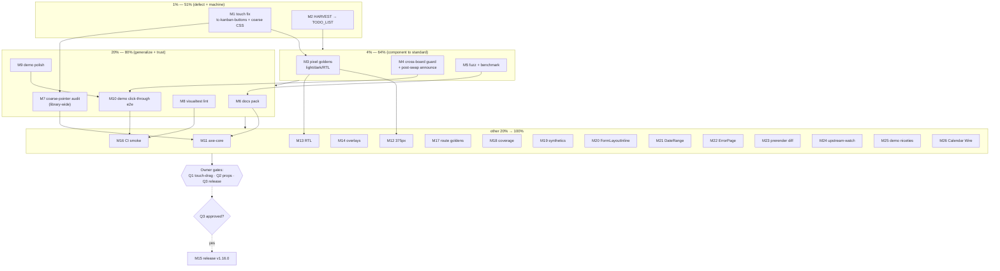

# Kanban Follow-Through & Repo Health — Pareto Execution Plan

**Date:** 2026-09-09 01:53
**Origin:** Status report `docs/status/2026-09-09_01-50_kanban-board-dual-transport.md` section (f) + `TODO_LIST.md` open items.
**Scope:** Everything actionable after the KanbanBoard delivery, ranked by Pareto leverage. Owner-gated items listed but NOT scheduled.
**Rule:** No verschlimmbessern — every task ends with the verify suite green; anything risky lands behind an explicit guard, never as a drive-by refactor.

---

## Sources (ALL TODOs consolidated)

1. Status report 2026-09-09 §f (30 kanban + repo-health items)
2. `TODO_LIST.md` open actionable: #128, #133, #146, #147, #152, #158, #159, #160, #162, #163, #166, #167, #168, #173, #175, #176, #177
3. `TODO_LIST.md` deferred/v1.0: #33, #34, #39, #119-note, #150, #154, #156, #157
4. `TODO_LIST.md` blocked-external: #28, #29, #80, #93, #107, #108, #123–#126 (BuildFlow repo / owner / upstream)
5. ~~Owner questions (status report §g): Q1 touch strategy, Q2 kanban feature scope, Q3 release timing~~ done (docs-health pass 2026-09-08)

---

## Step 1 — Pareto Breakdown

### The 1% that delivers 51%

**Fix the one shipped DEFECT + keep the backlog machine honest.**

- **M1 — KanbanBoard touch/coarse-pointer fix.** The move buttons are `opacity-0` until hover; on phones hover never fires → the only touch-capable control is invisible. This is the session's single real defect, in the flagship new component. Fix = `tc-kanban-buttons` class hook + `@media (pointer: coarse)` always-visible rule + tests + goldens.
- **M2 — HARVEST this plan + status report into `TODO_LIST.md`.** Plans rot; TODO_LIST is the living source. 30 new items must land there with IDs.

### The 4% that delivers 64% (adds the next two)

**Bring KanbanBoard up to full library standard.**

- **M3 — Pixel goldens** (light/dark/RTL): locks the visual contract; currently zero pixel pin.
- **M4 — Robustness pack:** cross-board drop guard (board A card onto board B currently submits to B) + post-swap live-region confirmation.
- **M5 — Fuzz `ParseKanbanMove` + render benchmark** (every mature component has both).

### The 20% that delivers 80% (adds the next five)

**Generalize the defect + repo trust.**

- **M6 — Kanban docs pack** (domain language, container-query rejection note, touch + cross-board docs).
- **M7 — Coarse-pointer audit library-wide:** every hover-revealed control has the same latent touch gap as M1. Generalizing the fix is the highest-leverage non-kanban item.
- **M8 — visualtest orphan lint triage** (68 findings, not CI-linted — either fix or formally exempt).
- **M9 — Demo polish pack** (unused func, writestring warnings, kanban transport toggle, shots capture).
- **M10 — Demo click-through e2e** incl. kanban moves (#168 partial).

### The other 20% to reach 100%

Sweeps and hardening that raise trust but ship no new capability: #175 axe-core scan, #159 mobile 375px, #160 RTL, #158 overlay captures, #163 page goldens, #173 CI demo smoke, #152 coverage, #147 chromedp synthetics, #166/#176/#177/#167 contracts+goldens, #128 upstream-watch, #157 Calendar Wire. Gated: release (Q3), feature props (Q2), touch-drag polyfill (Q1), external BuildFlow/owner/upstream blockers.

---

## Step 2 — Comprehensive Plan (medium tasks, 30–100 min, sorted)

| #      | ID                                                        | Task                                                                                                      | Tier     | Impact   | Effort   | Customer value                                         |
| ------ | --------------------------------------------------------- | --------------------------------------------------------------------------------------------------------- | -------- | -------- | -------- | ------------------------------------------------------ |
| ~~1~~  | ~~M1~~ done — M1 touch fix                                | ~~KanbanBoard touch fix: `tc-kanban-buttons` hook + coarse-pointer CSS + tests + goldens~~                | ~~1%~~   | ~~HIGH~~ | ~~60m~~  | ~~Only shipped defect fixed — board usable on phones~~ |
| ~~2~~  | ~~M2~~ done — M2 TODO LIST harvest                        | ~~HARVEST status-report §f + this plan into TODO_LIST.md (IDs, no collisions)~~                           | ~~1%~~   | ~~HIGH~~ | ~~30m~~  | ~~Backlog machine stays the single source of truth~~   |
| ~~3~~  | ~~M3~~ done — M3 kanban goldens                           | ~~Kanban pixel goldens: light/dark + RTL via AssertScreenshot + eyeball note (#80 family)~~               | ~~4%~~   | ~~HIGH~~ | ~~45m~~  | ~~Visual contract pinned; catches layout regressions~~ |
| ~~4~~  | ~~M4~~ done — M4 cross board guard                        | ~~Cross-board drop guard + post-swap live-region announcement + e2e re-run~~                              | ~~4%~~   | ~~MED~~  | ~~45m~~  | ~~Correct multi-board pages; SR confirmation~~         |
| ~~5~~  | ~~M5~~ done — M5 fuzz bench                               | ~~Fuzz ParseKanbanMove + BenchmarkKanbanBoard~~                                                           | ~~4%~~   | ~~MED~~  | ~~30m~~  | ~~Library-standard robustness/perf signals~~           |
| ~~6~~  | ~~M6~~ done — M6 docs pack                                | ~~Docs pack: DOMAIN_LANGUAGE kanban terms, container-query rejection note, touch + cross-board sections~~ | ~~4%~~   | ~~MED~~  | ~~30m~~  | ~~Discoverability; preempts re-litigation~~            |
| ~~7~~  | ~~M7~~ done — M7 coarse pointer guard                     | ~~Coarse-pointer audit of ALL hover-revealed controls + fixes + guard~~                                   | ~~20%~~  | ~~HIGH~~ | ~~90m~~  | ~~Library-wide mobile UX uplift~~                      |
| ~~8~~  | ~~M8~~ done — status 2026-09-09 23-21 N4                  | ~~visualtest orphan lint: bucket 68 findings, fix mechanical, formal exemption/lint-matrix decision~~     | ~~20%~~  | ~~MED~~  | ~~60m~~  | ~~Repo hygiene; lint parity across modules~~           |
| ~~9~~  | ~~M9~~ done — M9 demo polish                              | ~~Demo polish: remove heroWireLine, writestring fixes, kanban transport toggle, shots capture~~           | ~~20%~~  | ~~LOW~~  | ~~45m~~  | ~~Demo correctness + showcase~~                        |
| ~~10~~ | ~~M10~~ done — visualtest/demo flows e2e test.go          | ~~Demo click-through e2e: kanban move, LoadMore→EndOfList, ConfirmDelete, busy (#168)~~                   | ~~20%~~  | ~~MED~~  | ~~60m~~  | ~~Browser-proven demo flows~~                          |
| ~~11~~ | ~~M11~~ done — visualtest/axe sweep test.go               | ~~axe-core a11y scan harness via chromedp + fix kanban/nav findings + guard (#175)~~                      | ~~20%~~  | ~~HIGH~~ | ~~90m~~  | ~~Trust: automated WCAG signal~~                       |
| ~~12~~ | ~~M12~~ done — visualtest/demo mobile e2e test.go         | ~~Mobile 375px sweep incl. kanban (#159)~~                                                                | ~~tail~~ | ~~MED~~  | ~~60m~~  | ~~Mobile correctness~~                                 |
| ~~13~~ | ~~M13~~ done — visualtest/demo rtl e2e test.go            | ~~RTL browser sweep incl. kanban (#160)~~                                                                 | ~~tail~~ | ~~MED~~  | ~~60m~~  | ~~RTL correctness~~                                    |
| ~~14~~ | ~~M14~~ done — overlay captures verified existing         | ~~Overlay open-state captures: Modal/Drawer/Tooltip/Combobox/Carousel (#158)~~                            | ~~tail~~ | ~~MED~~  | ~~45m~~  | ~~Overlay rendering proof~~                            |
| ~~15~~ | ~~M15~~ done — CHANGELOG v1.16.0                          | ~~**[GATED Q3]** Release v1.16.0: pre-verify, changelog cut, release.sh, tags~~                           | ~~tail~~ | ~~HIGH~~ | ~~60m~~  | ~~Ships KanbanBoard to consumers~~                     |
| ~~16~~ | ~~M16~~ done — visualtest/demo smoke test.go              | ~~CI demo smoke: build→serve→shots→assert, zero-500 log assert (#173)~~                                   | ~~tail~~ | ~~MED~~  | ~~90m~~  | ~~CI catches demo breakage~~                           |
| ~~17~~ | ~~M17~~ done — route goldens N11                          | ~~Page-level demo route goldens, 7 routes (#163)~~                                                        | ~~tail~~ | ~~MED~~  | ~~60m~~  | ~~Would have caught dashboard collapse~~               |
| ~~18~~ | ~~M18~~ done — coverage 72.0 N9                           | ~~Coverage margin: tests to clear 70% floor w/ headroom (#152)~~                                          | ~~tail~~ | ~~LOW~~  | ~~45m~~  | ~~CI stability~~                                       |
| ~~19~~ | ~~M19~~ done — visualtest/datastar synthetics e2e test.go | ~~chromedp synthetic datastar-fetch → SSEErrorHandling DOM; patch → aria-busy (#147)~~                    | ~~tail~~ | ~~LOW~~  | ~~45m~~  | ~~JS paths browser-proven~~                            |
| ~~20~~ | ~~M20~~ done — form inline width contract N13             | ~~FormLayoutInline width contract: docs + fix/guard (#166)~~                                              | ~~tail~~ | ~~MED~~  | ~~30m~~  | ~~Form layout correctness~~                            |
| ~~21~~ | ~~M21~~ done — TestGoldenDateRangeAdjacent                | ~~DateRange block-vs-inline docs + adjacent-ranges golden (#176)~~                                        | ~~tail~~ | ~~LOW~~  | ~~30m~~  | ~~Docs honesty~~                                       |
| ~~22~~ | ~~M22~~ done — ErrorPage family goldens                   | ~~ErrorPage family matrix goldens, 5 families (#177)~~                                                    | ~~tail~~ | ~~LOW~~  | ~~30m~~  | ~~Visual completeness~~                                |
| ~~23~~ | ~~M23~~ done — prerender diff test                        | ~~Prerender vs live-server HTML diff, 7 routes (#167)~~                                                   | ~~tail~~ | ~~LOW~~  | ~~30m~~  | ~~Prerender honesty~~                                  |
| ~~24~~ | ~~M24~~ done — upstream watch run 34391305391             | ~~upstream-watch workflow_dispatch dry-run green check (#128)~~                                           | ~~tail~~ | ~~LOW~~  | ~~30m~~  | ~~Dependency-drift automation~~                        |
| 25     | M25                                                       | Demo niceties: file-backed kanban state, Dashboard-recipe kanban section                                  | tail     | LOW      | 45m      | Demo depth                                             |
| ~~26~~ | ~~M26~~ **Won't implement — TODO 157 deferred.**          | ~~Calendar Wire adoption per D3 rule (tests+goldens+e2e) (#157)~~                                         | ~~tail~~ | ~~MED~~  | ~~100m~~ | ~~Transport parity for calendar nav~~                  |

**Not scheduled (owner-gated / external):** Q1 touch-drag polyfill (dependency budget), Q2 WIP-limits / within-column reorder / add-card props, Q3 release timing (unlocks M15), #93/#107/#108/#124/#125/#126 BuildFlow fixes (other repo), #123 branch protection (owner), #28/#29 listings (upstream), #39 v2 compound overlays, #33/#34 v1.0 follow-ups, #80/#150/#162 human eyeballs.

---

## Step 3 — Fine Breakdown (≤12 min each, sorted by tier then impact)

### Tier 1% (execute first)

| ID   | Task                                                                          | m  | Impact |
| ---- | ----------------------------------------------------------------------------- | -- | ------ |
| f1.1 | Add `tc-kanban-buttons` hook class to move-button container in `kanban.templ` | 5  | H      |
| f1.2 | `@media (pointer: coarse)` always-visible rule in `templates/custom.css`      | 10 | H      |
| f1.3 | Regenerate templ + build                                                      | 5  | H      |
| f1.4 | Unit test: hook present; custom-css guard covers the new rule                 | 10 | H      |
| f1.5 | Update kanban goldens (`-update`), eyeball diff                               | 5  | H      |
| f1.6 | Re-run e2e + full verify                                                      | 10 | H      |
| f2.1 | Assign next-free TODO_LIST IDs to all harvested items                         | 10 | H      |
| f2.2 | Insert rows (kanban follow-ups + repo-health) with sources                    | 10 | H      |
| f2.3 | Verify no ID collisions; update "next free ID" header                         | 5  | H      |

### Tier 4%

| ID   | Task                                                                    | m  | Impact |
| ---- | ----------------------------------------------------------------------- | -- | ------ |
| f3.1 | Write `visualtest` kanban golden test (light + dark)                    | 12 | H      |
| f3.2 | Capture PNGs via `nix run .#visual -update`                             | 10 | H      |
| f3.3 | Add RTL (`dir="rtl"`) case; capture                                     | 10 | M      |
| f3.4 | Record #80-family human-eyeball caveat                                  | 3  | M      |
| f4.1 | Same-board guard in kanban drop JS + regen                              | 10 | M      |
| f4.2 | Post-swap announcement listener (htmx `afterSwap` + swap-agnostic poll) | 12 | M      |
| f4.3 | Unit tests pin guard + announcement wiring                              | 10 | M      |
| f4.4 | e2e re-run both transports                                              | 10 | M      |
| f5.1 | `FuzzParseKanbanMove` (seed corpus: index garbage, unicode ids)         | 12 | M      |
| f5.2 | `BenchmarkKanbanBoard` (wired + readonly)                               | 10 | M      |
| f5.3 | Run fuzz 10s + bench, record                                            | 5  | M      |

### Tier 20%

| ID    | Task                                                           | m  | Impact |
| ----- | -------------------------------------------------------------- | -- | ------ |
| f6.1  | DOMAIN_LANGUAGE entries: board/column/card/move                | 10 | M      |
| f6.2  | container-query-strategy.md: record Kanban rejection rationale | 5  | M      |
| f6.3  | transport-wiring.md: cross-board + touch sections              | 10 | M      |
| f7.1  | Grep audit: `opacity-0`/`group-hover:opacity` controls         | 10 | H      |
| f7.2  | Classify findings: touch-affected vs safe                      | 10 | H      |
| f7.3  | Fix affected control #1 + hook class                           | 12 | H      |
| f7.4  | Fix affected control #2 (if any) + hook class                  | 12 | H      |
| f7.5  | Shared coarse-pointer CSS + guard test + verify                | 12 | H      |
| f8.1  | Bucket visualtest's 68 findings by linter/file                 | 10 | M      |
| f8.2  | Fix mechanical findings batch 1                                | 12 | M      |
| f8.3  | Fix mechanical findings batch 2                                | 12 | M      |
| f8.4  | Formal decision: exemptions vs lint-matrix inclusion; document | 10 | M      |
| f9.1  | Remove unused `heroWireLine`; fix writestring warnings         | 10 | L      |
| f9.2  | Kanban demo transport-toggle variant                           | 12 | L      |
| f9.3  | `nix run .#shots` capture incl. kanban section                 | 10 | L      |
| f9.4  | Demo test suite re-run                                         | 5  | L      |
| f10.1 | Extend #168 test: kanban move click-through                    | 12 | M      |
| f10.2 | LoadMore→EndOfList browser flow                                | 12 | M      |
| f10.3 | ConfirmDelete removal + busy 800ms flow                        | 12 | M      |
| f10.4 | Suite run + fix flakes                                         | 10 | M      |

### Tail (other 20% → 100%)

| ID    | Task                                                                    | m  | Impact |
| ----- | ----------------------------------------------------------------------- | -- | ------ |
| f11.1 | axe-core injection helper via chromedp (zero-Node)                      | 12 | H      |
| f11.2 | Scan harness + violations JSON report                                   | 12 | H      |
| f11.3 | Fix kanban findings                                                     | 12 | H      |
| f11.4 | Fix nav/other top findings                                              | 12 | M      |
| f11.5 | Zero-violation guard test (known-safe allowlist)                        | 12 | M      |
| f11.6 | Document in visual-testing.md                                           | 10 | M      |
| f12.1 | 375px viewport cases (MobileMenu, ContainerAware, forms, table, kanban) | 10 | M      |
| f12.2 | Captures + findings list                                                | 12 | M      |
| f12.3 | Fix findings                                                            | 12 | M      |
| f13.1 | RTL harness: Nav, Split, Carousel, Drawer, Dropdown, Kanban             | 12 | M      |
| f13.2 | Captures                                                                | 12 | M      |
| f13.3 | Fix findings                                                            | 12 | M      |
| f14.1 | `State:Click` captures: Modal, Drawer, Tooltip, Combobox                | 12 | M      |
| f14.2 | Captures: Carousel (+ anything flaky)                                   | 12 | M      |
| f14.3 | Verify + eyeball note                                                   | 5  | M      |
| f15.1 | **[Q3]** Pre-release `nix run .#verify` + touched-package tests         | 12 | H      |
| f15.2 | **[Q3]** CHANGELOG cut + version triple-bump via release.sh prep        | 10 | H      |
| f15.3 | **[Q3]** `nix shell govulncheck` wrapped release.sh run                 | 12 | H      |
| f15.4 | **[Q3]** `git show` tag review, tags push, propagation tidy             | 12 | H      |
| f16.1 | Demo smoke script: build + serve + assert health                        | 12 | M      |
| f16.2 | Smoke: shots run + capture-exists assert                                | 12 | M      |
| f16.3 | Smoke: zero-500 log assert                                              | 10 | M      |
| f16.4 | CI job wiring (`.github/workflows`)                                     | 12 | M      |
| f17.1 | Route-golden harness (full-page compare)                                | 12 | M      |
| f17.2 | Capture 7 routes light (+dark for index)                                | 12 | M      |
| f17.3 | Wire into visual suite                                                  | 10 | M      |
| f18.1 | Coverage report; list sub-70% packages                                  | 10 | L      |
| f18.2 | Missing-coverage tests batch 1                                          | 12 | L      |
| f18.3 | Batch 2 + floor headroom check                                          | 12 | L      |
| f19.1 | Synthetic `datastar-fetch` → SSEErrorHandling DOM e2e                   | 12 | L      |
| f19.2 | Synthetic patch → aria-busy clear e2e                                   | 12 | L      |
| f20.1 | Document FormLayoutInline width contract                                | 10 | M      |
| f20.2 | Fix children full-width bug or loud guard test                          | 12 | M      |
| f21.1 | DateRange block-vs-inline docs                                          | 10 | L      |
| f21.2 | Two-adjacent-ranges golden                                              | 10 | L      |
| f22.1 | ErrorPage family goldens batch 1 (rejection/conflict)                   | 12 | L      |
| f22.2 | Batch 2 (transient/corruption/infrastructure)                           | 12 | L      |
| f23.1 | Prerender-vs-live diff script                                           | 12 | L      |
| f23.2 | Run 7 routes; triage diffs                                              | 12 | L      |
| f24.1 | Trigger upstream-watch dry-run; confirm green                           | 10 | L      |
| f24.2 | Record result in TODO_LIST                                              | 5  | L      |
| f25.1 | File-backed kanban demo state                                           | 12 | L      |
| f25.2 | Dashboard-recipe kanban section                                         | 12 | L      |
| f25.3 | Demo counts/tests re-run                                                | 5  | L      |
| f26.1 | Calendar `Wire` field + defaults (GET nav)                              | 12 | M      |
| f26.2 | Both-dialect rendering tests                                            | 12 | M      |
| f26.3 | Goldens htmx/datastar/readonly                                          | 10 | M      |
| f26.4 | Demo month-nav via wire.Handler                                         | 12 | M      |
| f26.5 | e2e: month nav under both runtimes                                      | 12 | M      |

**Fine total: 92 tasks** (1%: 9 · 4%: 13 · 20%: 23 · tail: 47).

---

## Execution Graph

**Dependency notes:** M1 before M3 (goldens must capture the fixed markup) and before M7 (the fix is the audit's template). M2 is independent — run first. M4 before M10 (e2e asserts announcement). M15 executes only after Q3.

## Verification strategy (every task)

1. Per-change: `templ generate` (touched files) + `go build` + package tests.
2. Per-tier: `nix run .#verify` + per-module `GOWORK=off` loop + guard scripts.
3. Visual/e2e: `nix run .#visual` (full suite) after M1/M3/M4/M7.
4. Never land a golden `-update` without eyeballing the diff. No new deps. No drive-by refactors ( verschlimmbessern guard).

---

_Point-in-time plan. Living state: `TODO_LIST.md` (updated by M2)._
