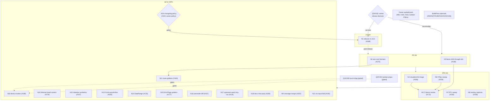

# Post-Kanban Quality-Tier & Release Plan — 2026-09-09 04:24

**Supersedes:** the remaining (unshipped) portion of `docs/planning/2026-09-09_01-53_kanban-pareto-execution-plan.md` — its M1–M7/M9 shipped this session; this plan re-baselines EVERYTHING that is still open.
**Repo state at planning time:** `master` @ `553bb88` (+daemon `e9cd2d1`), tree clean, origin == HEAD, **CI + Website green**, `nix run .#verify` all checks passed, full visual suite green (117 goldens), kanban e2e 5/5 green, `[Unreleased]` CHANGELOG warm, version 1.15.1.

---

## Sources (ALL TODOs consolidated)

1. ~~**`TODO_LIST.md` open section** (post-cleanup, 21 actionable rows): #128, #133, #146, #147, #152, #158, #159, #160, #162*, #163, #166, #167, #168, #173, #175, #176, #177, #179, #180, #186, #188, #189. (*#162 needs a human — grouped into the owner eyeball pack.)~~ done (docs-health pass 2026-09-08)
2. ~~**TODO_LIST blocked section** (listed, never scheduled): #28, #29, #80, #93, #107, #108, #123, #124, #125, #126, #190 (Q1), #191 (Q2), #192 (Q3).~~ done (docs-health pass 2026-09-08)
3. ~~**TODO_LIST deferred section** (candidates, stay deferred unless promoted): #33, #34, #119-note, #120, #150, #154, #155, #156, #157, #178, #39.~~ done (docs-health pass 2026-09-08)
4. ~~**Status report 2026-09-09 04:20 §f** items — all map to TODO IDs above or to the eyeball pack; the only NEW micro-items (FEATURES.md coarse-pointer line; warm CHANGELOG for M3/M5 gated on #133) are folded into N18/N19 below.~~ done (docs-health pass 2026-09-08)
5. ~~**Shipped and excluded:** kanban M1–M7/M9 (touch fix, harvest, goldens, guard+announcement, fuzz+bench, docs, coarse-pointer guard, demo polish) — CHANGELOG `[Unreleased]`.~~ done (docs-health pass 2026-09-08)

---

## Step 1 — Pareto Breakdown

### The 1% that delivers 51%

**N1 — Ship v1.16.0 (#188, gated ONLY by owner answer to Q3/#192).** Three sessions of KanbanBoard work (component + touch fix + cross-board guard + announcement + guard-test + docs + goldens + fuzz + bench) deliver exactly zero consumer value until a tag is cut. Everything is verified green and the changelog is warm. One owner decision + ~60min of release mechanics → the entire feature lands on the module proxy, pkg.go.dev, and every `go get` consumer. **Nothing else in the backlog comes close to this leverage-per-minute.**

### The 4% that delivers 64% (adds the next two)

**N2 — axe-core a11y harness + first sweep (#175).** The library sells accessibility as a core promise ("a component that renders but is unusable from a keyboard is not finished"), yet has NO automated WCAG signal — only hand-written per-component a11y tests. One injected axe run over the demo routes turns that promise into a repeatable, CI-enforced fact for all 121 components at once.

**N3 — Demo click-through e2e suite (#168).** The demo is the library's shop window and its only integration surface; today its headline flows (LoadMore→EndOfList, ConfirmDelete, busy gate, upload echo, kanban move) are string-proven at best. Browser-proving them locks the demo AND the composition patterns consumers copy from it.

### The 20% that delivers 80% (adds the next five)

**N4 — visualtest 68-finding lint triage (#186).** The only module where lint is red-shaped; repo trust + lint parity.
**N5 — CI demo smoke (#173).** CI currently can't notice a broken demo; with N3's harness this is ~40 lines of workflow.
**N6 — 375px mobile sweep incl. kanban (#159).** Phones are the #1 untested form factor; the coarse-pointer work just proved the library had a real mobile defect class.
**N7 — RTL browser sweep incl. kanban (#160).** Logical-property compliance is scanner-enforced but never browser-swept.
**N8 — Overlay open-state captures (#158).** Overlays were only ever screenshot-verified CLOSED; the top-layer render path is the library's riskiest CSS.

### The other 20% to reach 100%

Coverage margin (#152), Minimal head-content (#179, real consumer demand from #156's survey), route-level goldens (#163), Datastar JS synthetics (#147), FormLayoutInline contract (#166), DateRange docs+golden (#176), ErrorPage family goldens (#177), prerender-vs-live diff (#167), upstream-watch dry-run (#128), SSE no-scripts docs + FEATURES line (#180), changelog policy #133 (+ warm M3/M5 entries), demo niceties (#189), nixpkgs input fold (#146), and the owner human-eyeball pack (#80/#150/#162 + the 3 kanban PNGs).

---

## Step 2 — Comprehensive Plan (medium tasks, 30–100 min, sorted)

| #      | ID                                                        | Task                                                                                                                                                  | Tier     | Impact   | Effort  | Customer value                                                                   |
| ------ | --------------------------------------------------------- | ----------------------------------------------------------------------------------------------------------------------------------------------------- | -------- | -------- | ------- | -------------------------------------------------------------------------------- |
| ~~1~~  | ~~N1~~ done — CHANGELOG v1.16.0                           | ~~**[GATED by Q3/#192]** Release v1.16.0: freeze, full verify matrix, `scripts/release.sh`, lockstep tags, proxy verification~~                       | ~~1%~~   | ~~HIGH~~ | ~~60m~~ | ~~KanbanBoard + touch fix + guards reach every consumer via the module proxy~~   |
| ~~2~~  | ~~N2~~ done — visualtest/axe sweep test.go                | ~~axe-core harness via chromedp (zero-npm: vendored/embedded axe source) + first sweep over demo routes + fix findings + zero-critical guard~~        | ~~4%~~   | ~~HIGH~~ | ~~90m~~ | ~~Automated WCAG trust signal for all 121 components~~                           |
| ~~3~~  | ~~N3~~ done — visualtest/demo flows e2e test.go           | ~~Demo click-through e2e: kanban move, LoadMore→EndOfList, ConfirmDelete removal, busy 800ms, upload echo~~                                           | ~~4%~~   | ~~HIGH~~ | ~~90m~~ | ~~Browser-proven headline flows; locks the composition patterns consumers copy~~ |
| ~~4~~  | ~~N4~~ done — status 2026-09-09 23-21 N4                  | ~~visualtest lint triage: bucket the 68 findings, fix mechanical, formal serial-e2e waiver/lint-matrix decision~~                                     | ~~20%~~  | ~~MED~~  | ~~60m~~ | ~~Repo trust; lint parity across modules~~                                       |
| ~~5~~  | ~~N5~~ done — visualtest/demo smoke test.go               | ~~CI demo smoke job: build → serve → shots → assert captures + zero 500s in server log~~                                                              | ~~20%~~  | ~~MED~~  | ~~90m~~ | ~~CI catches demo breakage before consumers see it~~                             |
| ~~6~~  | ~~N6~~ done — visualtest/demo mobile e2e test.go          | ~~375px sweep: MobileMenu, AppShell collapse, form stacking, table overflow, kanban~~                                                                 | ~~20%~~  | ~~MED~~  | ~~60m~~ | ~~Mobile correctness across the catalogue~~                                      |
| ~~7~~  | ~~N7~~ done — visualtest/demo rtl e2e test.go             | ~~RTL browser sweep: Nav, Split, Carousel, Drawer, Dropdown, kanban under `dir="rtl"`~~                                                               | ~~20%~~  | ~~MED~~  | ~~60m~~ | ~~RTL correctness proven at pixel level, not just scanner level~~                |
| ~~8~~  | ~~N8~~ done — overlay captures verified existing          | ~~Overlay open-state captures: Modal, Drawer, Tooltip, Combobox, Carousel (`State:Click` + `FullViewport`)~~                                          | ~~20%~~  | ~~MED~~  | ~~45m~~ | ~~First-ever visual proof of top-layer rendering~~                               |
| ~~9~~  | ~~N9~~ done — coverage 72.0 headroom                      | ~~Coverage margin: lift/hold 70% floor with ≥2pt headroom~~                                                                                           | ~~tail~~ | ~~MED~~  | ~~45m~~ | ~~CI stability against coverage drift~~                                          |
| ~~10~~ | ~~N10~~ done — layout Minimal SEO SEOMeta                 | ~~`layout.Minimal` head-content support (NoIndex/Canonical/hreflang/JSON-LD parity with Base)~~                                                       | ~~tail~~ | ~~MED~~  | ~~60m~~ | ~~Unblocks the #156 `nsfw-classifier` adoption reason~~                          |
| ~~11~~ | ~~N11~~ done — route goldens 8 captures                   | ~~Page-level route goldens for the 7 demo routes (new visual tier)~~                                                                                  | ~~tail~~ | ~~MED~~  | ~~60m~~ | ~~Would have caught the dashboard collapse class~~                               |
| ~~12~~ | ~~N12~~ done — visualtest/datastar synthetics e2e test.go | ~~chromedp synthetics: `datastar-fetch` → SSEErrorHandling DOM; patch → aria-busy clear~~                                                             | ~~tail~~ | ~~MED~~  | ~~45m~~ | ~~Datastar JS paths browser-proven, not string-pinned~~                          |
| ~~13~~ | ~~N13~~ done — TestFormLayoutInlineWidthContract          | ~~`FormLayoutInline` width contract: docs + component fix/guard~~                                                                                     | ~~tail~~ | ~~MED~~  | ~~30m~~ | ~~Form layout correctness for inline patterns~~                                  |
| ~~14~~ | ~~N14~~ done — TestGoldenDateRangeAdjacent                | ~~DateRange block-vs-inline docs + two-adjacent-ranges golden~~                                                                                       | ~~tail~~ | ~~LOW~~  | ~~30m~~ | ~~Docs honesty~~                                                                 |
| ~~15~~ | ~~N15~~ done — ErrorPage family matrix goldens            | ~~ErrorPage family matrix goldens (5 families; only 2 exist)~~                                                                                        | ~~tail~~ | ~~LOW~~  | ~~30m~~ | ~~Visual completeness for the error surface~~                                    |
| ~~16~~ | ~~N16~~ done — prerender diff test bf8a276                | ~~Prerender (`-prerender`) vs live-server HTML diff, 7 routes~~                                                                                       | ~~tail~~ | ~~LOW~~  | ~~30m~~ | ~~Prerender honesty (#154 follow-up)~~                                           |
| ~~17~~ | ~~N17~~ done — upstream watch dry run success             | ~~upstream-watch `workflow_dispatch` dry-run: trigger + confirm green on GitHub~~                                                                     | ~~tail~~ | ~~LOW~~  | ~~30m~~ | ~~Dependency-drift automation finally observed green~~                           |
| ~~18~~ | ~~N18~~ done — datastar facts FEATURES line               | ~~Docs mini-pack: SSE-fragment innerHTML-no-scripts fact (#180) + FEATURES.md coarse-pointer line + count check~~                                     | ~~tail~~ | ~~LOW~~  | ~~30m~~ | ~~Discoverability; closes the session-report b-items~~                           |
| ~~19~~ | ~~N19~~ done — scripts/check-changelog-guard.sh           | ~~**[semi-gated: owner policy]** Changelog policy for test-only diffs (#133): decide, implement guard, warm M3/M5 entries, 2 throwaway-PR shakedown~~ | ~~tail~~ | ~~MED~~  | ~~30m~~ | ~~Deterministic changelog home for test-tier work~~                              |
| 20     | N20                                                       | Demo niceties: file-backed kanban state, Dashboard-recipe kanban section (#189)                                                                       | tail     | LOW      | 45m     | Demo depth; kanban survives server restarts                                      |
| ~~21~~ | ~~N21~~ done — flake fold 3659d00                         | ~~Fold `nixpkgs-go` + `nixpkgs` inputs at a deliberate flake update (#146)~~                                                                          | ~~tail~~ | ~~LOW~~  | ~~30m~~ | ~~Simpler flake; templ-pin zero-diff invariant must survive~~                    |

**Not scheduled (owner-gated / external / human-only):** Q1 touch-drag (#190), Q2 kanban props scope (#191), Q3 release timing (#192 — gates N1), human-eyeball pack (#80 overlays + 16 newer PNGs, #150 wire goldens, #162 progressbar half, 3 kanban board PNGs), BuildFlow family #93/#107/#108/#124/#125/#126 (other repo), #123 branch protection (owner), #28/#29 listings (upstream), deferred #33/#34/#39/#119-note/#120/#154/#155/#156(survey consumed by N10)/#157/#178.

**Every task maps to an existing TODO ID — no new backlog entries needed.** Mapping: N1→#188, N2→#175, N3→#168, N4→#186, N5→#173, N6→#159, N7→#160, N8→#158, N9→#152, N10→#179, N11→#163, N12→#147, N13→#166, N14→#176, N15→#177, N16→#167, N17→#128, N18→#180, N19→#133, N20→#189, N21→#146.

---

## Step 3 — Fine Breakdown (≤12 min each, sorted by tier then impact)

### Tier 1% (execute first)

| ID   | Task                                                                                                                      | m  | Impact |
| ---- | ------------------------------------------------------------------------------------------------------------------------- | -- | ------ |
| f1.1 | Owner answers Q3/#192 → if "cut now": freeze scope, re-read `docs/release-checklist.md`                                   | 5  | H      |
| f1.2 | Pre-release matrix: `nix run .#verify` + per-module loop + full visual suite + `scripts/ci-repro.sh --lint`               | 12 | H      |
| f1.3 | Cut: `nix shell nixpkgs#govulncheck -c nix develop -c scripts/release.sh 1.16.0 "
"` inside the dev shell         | 10 | H      |
| f1.4 | Review `git show v1.16.0`, verify lockstep tags via `scripts/check-release-tags.sh`, push master+tags                     | 10 | H      |
| f1.5 | Post-release: proxy propagation check (`go get` in a scratch module), pkg.go.dev refresh, CI green, reopen `[Unreleased]` | 10 | H      |

### Tier 4%

| ID   | Task                                                                                                                                                                        | m  | Impact |
| ---- | --------------------------------------------------------------------------------------------------------------------------------------------------------------------------- | -- | ------ |
| f2.1 | axe-core sourcing decision under the zero-npm constraint: vendor `axe.min.js` into `visualtest/` (embed) vs CDN fetch at test time; check license (MPL-2.0, vendoring fine) | 12 | H      |
| f2.2 | Harness: chromedp `AddScriptTag`/evaluate axe source, `axe.run(document, {resultTypes:['violations']})`, return JSON                                                        | 12 | H      |
| f2.3 | Sweep demo routes (index, forms, kanban section) light+dark; bucket findings critical/serious/moderate                                                                      | 12 | H      |
| f2.4 | Fix the fixable findings (expected: focus order, contrast edge cases); document accepted ones                                                                               | 12 | H      |
| f2.5 | Guard: test fails on any new critical/serious violation; wire into the visual job                                                                                           | 10 | H      |
| f3.1 | e2e harness: start demo server fixture (reuse `visualtest` server helpers; PORT convention)                                                                                 | 10 | H      |
| f3.2 | Flow: LoadMore click → list grows → EndOfList appears at exhaustion                                                                                                         | 12 | H      |
| f3.3 | Flow: ConfirmDelete → confirm dialog → row removed                                                                                                                          | 12 | H      |
| f3.4 | Flow: busy 800ms gate visible during request; upload echo round-trip                                                                                                        | 12 | M      |
| f3.5 | Flow: kanban move click-through on the demo board (both transports)                                                                                                         | 12 | H      |
| f3.6 | Suite run + flake pass (serial like the kanban suite; retries where runtimes re-attach)                                                                                     | 12 | H      |

### Tier 20%

| ID   | Task                                                                                                           | m  | Impact |
| ---- | -------------------------------------------------------------------------------------------------------------- | -- | ------ |
| f4.1 | Reproduce the 68 visualtest lint findings; bucket: mechanical / waiver-worthy / lint-matrix                    | 12 | M      |
| f4.2 | Fix mechanical buckets (gci order, errcheck, etc.) via `golangci-lint fmt` + hand fixes                        | 12 | M      |
| f4.3 | Decide + implement the serial-e2e waiver story (file-level `//nolint` with reasons vs config exclusion matrix) | 12 | M      |
| f4.4 | Zero-findings check in `scripts/ci-repro.sh --lint` for the visualtest module                                  | 10 | M      |
| f5.1 | CI job: build demo → serve (background) → `nix run .#shots -base localhost:PORT`                               | 12 | M      |
| f5.2 | Assert every expected capture exists + zero `500` lines in the server log                                      | 12 | M      |
| f5.3 | Land on CI, fix flakes, confirm green twice                                                                    | 12 | M      |
| f6.1 | 375px harness: `ViewportMobile` preset + route/component capture list                                          | 10 | M      |
| f6.2 | Capture + fix MobileMenu/AppShell collapse cases                                                               | 12 | M      |
| f6.3 | Capture + fix forms stacking + table overflow                                                                  | 12 | M      |
| f6.4 | Capture + fix kanban at 375px (horizontal scroll IS the model — verify no vertical jail)                       | 12 | M      |
| f6.5 | Goldens `-update` (CSS recompile FIRST — stale-CSS lesson d1 from the 04:20 report) + suite green              | 10 | M      |
| f7.1 | RTL capture set: Nav, Split, Carousel, Drawer, Dropdown with `Options{RTL}`                                    | 12 | M      |
| f7.2 | RTL kanban + move buttons (arrow mirroring already e2e-asserted; pin pixels)                                   | 12 | M      |
| f7.3 | Fix violations + goldens; eyeball note                                                                         | 12 | M      |
| f8.1 | Verify `State:Click` + `FullViewport` harness support for `<dialog>` + Popover top-layer                       | 10 | M      |
| f8.2 | Capture Modal + Drawer open states (light/dark)                                                                | 12 | M      |
| f8.3 | Capture Tooltip + Combobox open states                                                                         | 12 | M      |
| f8.4 | Capture Carousel (arrows + dots visible)                                                                       | 10 | M      |
| f8.5 | Record #80-family human-eyeball caveat on the new PNGs                                                         | 3  | M      |

### Tail (other 20% → 100%)

| ID        | Task                                                                                                         | m      | Impact |
| --------- | ------------------------------------------------------------------------------------------------------------ | ------ | ------ |
| f9.1      | Coverage run (`nix run .#coverage`); identify packages under the margin or within 2pt                        | 12     | M      |
| f9.2      | Add missing-coverage tests for the weakest paths (target: floor + ≥2pt)                                      | 12     | M      |
| f9.3      | Guard the margin (threshold assert or badge trend)                                                           | 10     | M      |
| f10.1     | API design: `MinimalProps.HeadContent` (or `SEO *SEOProps`?) — mirror Base's PR #12 shape                    | 12     | M      |
| f10.2     | Implement on `layout.Minimal`; parity: noindex/canonical/hreflang/JSON-LD                                    | 12     | M      |
| f10.3     | Tests + golden + godoc example; contract-test registration if props change shape                             | 12     | M      |
| f10.4     | Docs: adoption-guide cross-ref from #156's `nsfw-classifier` reason; CHANGELOG entry                         | 10     | M      |
| f11.1     | Route-golden harness: full-page capture per demo route (reuse shots tooling inside a test)                   | 12     | M      |
| f11.2     | Capture the 7 routes light+dark; eyeball; commit goldens                                                     | 12     | M      |
| f11.3     | Wire into the CI visual job with the CSS-freshness precondition                                              | 10     | M      |
| f12.1     | Synthetic `datastar-fetch` lifecycle → assert SSEErrorHandling DOM appears/clears                            | 12     | M      |
| f12.2     | Synthetic `datastar-patch-elements` → assert aria-busy clear on the LiveRegion                               | 12     | M      |
| f13.1     | Document the FormLayoutInline width contract (what consumers may rely on)                                    | 10     | M      |
| f13.2     | Component-level fix or loud docs + guard test per #166's decision                                            | 12     | M      |
| f14.1     | DateRange block-vs-inline semantics docs                                                                     | 10     | L      |
| f14.2     | Two-adjacent-ranges golden + capture                                                                         | 12     | L      |
| ~~f15.1~~ | ~~ErrorPage family matrix golden sweep (rejection/conflict/transient/corruption/infrastructure)~~ done — N15 | ~~12~~ | ~~L~~  |
| f16.1     | Run `-prerender`, serve live, diff HTML per route                                                            | 12     | L      |
| f16.2     | Document acceptable deltas + guard the rest                                                                  | 10     | L      |
| f17.1     | Trigger `upstream-watch.yml` `workflow_dispatch` (dry-run on) via gh                                         | 10     | L      |
| f17.2     | Confirm green; record result against #128                                                                    | 5      | L      |
| f18.1     | Document the SSE-fragment innerHTML-no-scripts fact in datastar docs (#180)                                  | 10     | L      |
| f18.2     | FEATURES.md coarse-pointer convention line                                                                   | 5      | L      |
| f18.3     | Count-surface check (goldens count, component count) after the tier's captures                               | 5      | L      |
| f19.1     | Owner decides #133 (exempt `_test.go`-only diffs?)                                                           | 5      | M      |
| f19.2     | Implement the guard policy in the changelog-guard workflow                                                   | 12     | M      |
| f19.3     | Warm CHANGELOG for M3/M5 per the policy outcome                                                              | 10     | M      |
| f19.4     | Shakedown: 2 throwaway PRs (docs-only passes; component-without-changelog fails)                             | 12     | M      |
| f20.1     | File-backed kanban demo state (JSON load/save; survives restarts)                                            | 12     | L      |
| f20.2     | Dashboard-recipe kanban section (composition showcase)                                                       | 12     | L      |
| f20.3     | `nix run .#shots` re-capture + eyeball                                                                       | 10     | L      |
| f21.1     | Fold nixpkgs-go+nixpkgs; verify `templ generate` zero-diff invariant survives                                | 12     | L      |
| f21.2     | `nix flake check` + full verify after the fold                                                               | 10     | L      |

---

## Execution Graph

**Reading the graph:** Q3's answer either executes N1 immediately (recommended — everything is green and the changelog is warm) or defers it behind the 4% tier; the dashed `N19 → N1` edge is only relevant if the owner wants the changelog policy settled before tagging. N5 consumes N3's demo-server harness and N4's clean-lint baseline. Owner-gated Q1/Q2 gate only kanban-scope work (N20), never the release.

---

## Verification strategy (every task)

- **Every task ends green:** `nix develop -c templ generate` when `.templ` touched → package tests → `nix develop -c golangci-lint run` on touched modules → FULL `nix run .#verify` at task end → commit immediately with a detailed message (daemon races).
- **Visual/golden tasks:** `nix run .#css` BEFORE any `-update` capture (stale-CSS lesson, report 04:20 d1); eyeball every golden diff; human-eyeball caveat recorded for agent-captured PNGs.
- **e2e tasks:** serial execution (no `t.Parallel`), retry-until-needle helpers for re-attaching runtimes, fresh board/page state per test.
- **Release (N1):** `docs/release-checklist.md` is mandatory reading BEFORE touching `scripts/release.sh`; govulncheck must be on PATH (nix shell wrapper); never retag.
- **No drive-by refactors** (verschlimmbessern clause): every change must trace to its task ID.

## Gated / unscheduled (full list, never silently dropped)

Q1/#190, Q2/#191, Q3/#192 (owner); #80 + #150 + #162 + kanban PNGs (human eyeballs); #28/#29 (upstream); #93/#107/#108/#124/#125/#126 (BuildFlow, other repo); #123 (owner, GitHub settings); deferred: #33, #34, #39, #119-note, #120 (reopen-only), #154, #155, #156 (survey — N10 consumes the actionable part), #157, #178.

---

_Plan written 2026-09-09 04:24 by the post-execution planning turn. Format: `.md` with mermaid per explicit user instruction (skill default is HTML+D2 — override noted, consistent with the two previous pareto plans). TODO_LIST.md was cleaned in the same session (6 shipped rows dropped per its own policy)._
