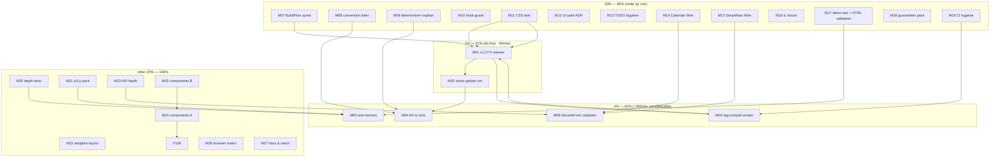

# SUPERB Pareto Plan — Post-Ghost-Fix Backlog Execution

> **Resolution (2026-09-17 evening docs-health pass):** executed across the 09-13/09-14 waves + 09-17 sessions — M01 (v1.17.0), M03, M05 (axe gate), M06 (DecodeForm fuzz), M09/M10 (determinism + orphan-golden + hook guards), M11, M12 (ADR-0039), M14-M18 (Calendar/NavLink Wire, tc doctor, vnu gate, guarantees pack), M22 (F101-F103) all shipped; M20 partial (FuzzDecodeForm). Open: M02 (vision pass = #80), M07 (BuildFlow = #93 family), M08 (convention linter), M13 (#28/#29), M19 tails (#213-#215), M23+ (ADR-0023/#178/DataTable), M24/M25 (BLOCKED by #217 demand gate), M26/M27 tails.

**Created:** 2026-09-13 11:14 (CEST) · **Repo:** templ-components @ master (post `83f91c82`)
**Sources:** TODO_LIST.md (next free ID 193) · docs/reviews/2026-09-13_08-51_brutal-self-review.html (100 ideas) · docs/status/2026-09-13_10-38 (session f-list, 50 items) · docs/status/2026-09-13_10-17 (CSS session, b1–b5 tails) · docs/status/2026-09-13_10-41 tails if any.
**Estimates:** minutes of focused AI-session execution (human review time marked separately). Every task ends with its verification step — a task without green verification is NOT done.

---

## 1. Pareto Breakdown

### The 1% that delivers 51%

| Task                                               | Why it is the 1%                                                                                                                                                                                                                                                                            |
| -------------------------------------------------- | ------------------------------------------------------------------------------------------------------------------------------------------------------------------------------------------------------------------------------------------------------------------------------------------- |
| **M01 — Cut & push v1.17.0**                       | All session value (wire.DecodeForm, tracked hooks, count/badge guards, CSS de-bloat) is ALREADY in master via daemon commits — consumers get it only at tag time. ~60min of script + push converts 3 sessions of work into shipped value. Highest value/effort ratio in the entire backlog. |
| **M02 — Run vision golden review + human confirm** | 3 blocked TODOs (#80/#150/#162) + the trustworthiness of all 125 committed visual goldens ride on one ~30min run with an API key. The tooling is built and dry-run-verified; only execution remains.                                                                                        |

### The 4% that delivers 64% (adds to the 1%)

| Task                                           | Why                                                                                                                                    |
| ---------------------------------------------- | -------------------------------------------------------------------------------------------------------------------------------------- |
| **M03 — Post-tag consumer compile smoke (CI)** | The one catastrophic failure mode (tag missing `*_templ.go`) is currently only caught by consumers. One CI job ends the class forever. |
| **M04 — Lint to literal zero**                 | 6+ pre-existing findings (gocognit ×4, golines ×1, nlreturn ×1?) make the "0 findings" CI claim false. Trust repair.                   |
| **M05 — axe-core in visualtest harness**       | A11y is the stated moat; it is asserted nowhere mechanically in a browser. One harness, every component benefits.                      |
| **M06 — wire.DecodeForm adoption**             | The API shipped yesterday with one consumer; migrating the forms pack + demo turns it from "neat" into "the way".                      |

### The 20% that delivers 80% (adds to the 4%)

M07 BuildFlow sprint (kills 6 blockers at the root) · M08 convention linter (3 manual conventions → machine) · M09 determinism + orphan-golden guards · M10 hook-adoption guard · M11 CSS-session tails (b1/b2/b4/b5) · M12 v2 module-path ADR · M13 TODO-hygiene & owner-decision documentation · M14 Calendar Wire (#157) · M15 SimpleNav Wire (#155) · M16 `tc doctor` · M17 demo axe gate + HTML validator · M18 guarantees pack (zero-panic scanner, Class-override pins, version-support policy, invariants page) · M19 CI hygiene pack (Renovate, templ cache, e2e job split, wall-clock, coverage floor, benchstat, mutation testing, flake policy).

### The other 20% to reach 100%

M20 depth-test pack · M21 a11y pack (forced-colors, touch targets, skip-link, zoom) · M22 adoption-driven layout work (AppShell theming, Minimal head) · M23 API depth (compound overlays ADR-0023, typed wire triggers #178, DataTable contract, URL state) · M24 component pack A (MultiSelect, DateRangePicker, FileDrop) · M25 component pack B (Command palette, Toast positions, TreeView, deprecation sweep) · M26 browser matrix (Firefox lane, RTL e2e, 10k-row stress, race job, icon sync pipeline, design-token single-source) · M27 docs & reach (playground, versioned docs, pkg.go.dev examples, reviews index, roadmap page, 2 blog posts, README screenshots, case study).

**Ordering rule:** execute 1% → 4% → 20% → other 20%. Within a tier, follow the table sort (importance/impact/effort/customer-value).

---

## 2. Comprehensive Plan — Medium Granularity (30–100min per task)

Sorted by importance/impact/effort/customer-value. `Cust.` = customer value: **C1** direct consumer value, **C2** trust/CI, **C3** contributor/maintainer, **C4** public reach.

| ID  | Task (all end with verification)                                                                                                                                                                                                                | Tier   | Impact | Effort | Cust. | Deps         | Source               |
| --- | ----------------------------------------------------------------------------------------------------------------------------------------------------------------------------------------------------------------------------------------------- | ------ | ------ | ------ | ----- | ------------ | -------------------- |
| ~~M01~~ | ~~Cut & push v1.17.0 (preflight lint+tests on touched pkgs → release.sh in nix shell → verify tags → push → proxy ping)~~ done at `8a046c48` | ~~1%~~ | ~~★★★★★~~ | ~~60~~ | ~~C1~~ | ~~—~~ | ~~#192~~ |
| M02 | Vision golden review: 1-image smoke → flagged 23 → human confirms SUSPECTs → annotate TODOs                                                                                                                                                     | 1%     | ★★★★★  | 30+key | C2    | key          | #80/#150/#162        |
| M03 | CI job: temp module `go get`s fresh tag, compiles against it (all 7 modules)                                                                                                                                                                    | 4%     | ★★★★★  | 60     | C2    | M01          | idea 15              |
| M04 | Lint baseline: run per-module from clean tree; fix or nolint-with-reason every finding to literal 0                                                                                                                                             | 4%     | ★★★★   | 100    | C2    | —            | status e2            |
| ~~M05~~ | ~~axe-core into visualtest harness: inject+run axe per component page; zero-violation opt-in gate~~ done — DONE 2026-09-14 wave4 - axe sweep default-fail + ledger (F030) | ~~4%~~ | ~~★★★★★~~ | ~~100~~ | ~~C1/C2~~ | ~~—~~ | ~~idea 41~~ |
| M06 | wire.DecodeForm adoption: forms-pack demo handlers, FilterInput/FilterDropdown GET path, transport-wiring.md examples                                                                                                                           | 4%     | ★★★★   | 90     | C1    | —            | G6 follow            |
| M07 | BuildFlow upstream sprint plan + execution in larsartmann/buildflow (msg from diff-stat, config-verify preflight, gitignore append fix, CSS minify flag, classifier, jsonv2 scan) — one repo, 6 blockers                                        | 20%    | ★★★★★  | 100×N  | C3    | —            | #93 etc.             |
| M08 | Convention linter v1 (go/analysis): props embed BaseProps; enums have IsValid; lookup maps typed keys                                                                                                                                           | 20%    | ★★★★   | 100    | C3    | —            | idea 34              |
| ~~M09~~ | ~~Determinism gate (render 2× byte-compare) + golden-orphan detector; wire into utils tests~~ done — DONE 2026-09-13 wave2 (M09 guards shipped) | ~~20%~~ | ~~★★★★~~ | ~~45~~ | ~~C2~~ | ~~—~~ | ~~ideas 45/54~~ |
| M10 | Hook-adoption guard: check `core.hooksPath` set, warn+instruct in pre-commit + docs                                                                                                                                                             | 20%    | ★★★    | 30     | C3    | —            | status e5            |
| ~~M11~~ | ~~CSS-session tails: SKILL guard-table row (b1), dead-ref sweep (b2), changelog section order (b5), keep/delete decision for 2 distribution artifacts (b4), watch first daemon cycle (b3)~~ done — DONE 2026-09-13 wave2 | ~~20%~~ | ~~★★★~~ | ~~30~~ | ~~C3~~ | ~~—~~ | ~~css b1–b5~~ |
| M12 | v2 module-path ADR: decide timing + migration mechanics; document consumer impact                                                                                                                                                               | 20%    | ★★★★★  | 45     | C1    | —            | idea 13              |
| M13 | TODO hygiene: #133 changelog-guard shakedown PR, wontfix-or-queue #28/#29, close #123 as user-wontfix, document #190/#191/#192 decisions, re-derive review stat labels, pnpm shim note (#119)                                                   | 20%    | ★★★    | 30     | C3    | —            | TODO list            |
| ~~M14~~ | ~~Calendar month-nav Wire (#157): Action spec, both dialects, tests+goldens+e2e per D3 rule~~ done — DONE 2026-09-14 wave3 (NavLink+Calendar Wire shipped v1.18.0) | ~~20%~~ | ~~★★★~~ | ~~90~~ | ~~C1~~ | ~~M06~~ | ~~#157~~ |
| M15 | SimpleNav links Wire (#155): same ladder                                                                                                                                                                                                        | 20%    | ★★★    | 60     | C1    | M06          | #155                 |
| M16 | `tc doctor`: check Tailwind @source, GOEXPERIMENT, templ pin, committed *_templ.go, hooksPath; one command for top consumer traps                                                                                                               | 20%    | ★★★★   | 90     | C1    | —            | idea 39              |
| ~~M17~~ | ~~Demo-route axe gate (every route zero-violation) + HTML validator (validator.w3c.nu) over golden corpus~~ done — DONE 2026-09-14 wave3 (M17 html-validation job) | ~~20%~~ | ~~★★★★~~ | ~~100~~ | ~~C2~~ | ~~M05~~ | ~~ideas 91/42~~ |
| ~~M18~~ | ~~Guarantees pack: zero-panic scanner test, Class-override-wins pinning tests (per component), version-support policy doc, consumer invariants page~~ done — DONE 2026-09-13 wave2 (docs/version-support.md + docs/invariants.md) | ~~20%~~ | ~~★★★★~~ | ~~100~~ | ~~C1/C4~~ | ~~—~~ | ~~ideas 1–4~~ |
| M19 | CI hygiene pack: Renovate (Actions+flake.lock), templ-generate cache, dedicated e2e job+timeout, wall-clock budget, coverage floor+ratchet, PR benchstat, mutation-testing pilot (utils), flake retry+auto-issue policy                         | 20%    | ★★★    | 100×N  | C2/C3 | —            | ideas 27–38          |
| M20 | Depth-test pack: RelativeTime clock injection, wire fuzz (Attributes+DecodeForm), chart_geometry property tests, focus-preservation after swaps, utils/golden harness unit tests                                                                | 80→100 | 60–100 | 100    | C2    | —            | ideas 46–48/51/55    |
| M21 | A11y pack: forced-colors + prefers-contrast support/rules, 44px touch-target audit, skip-to-content + AppShell wiring, 200/400% zoom reflow tests, aria-live politeness policy                                                                  | other  | ★★★★   | 100×N  | C1    | M05          | ideas 83–92          |
| ~~M22~~ | ~~Adoption-driven layout: AppShell CSS-var theming + mobile-breakpoint prop; layout.Minimal head-content support (both requested by real adopters #156a/b)~~ done — DONE 2026-09-14 wave4 (F101-F103) | ~~other~~ | ~~★★★★★~~ | ~~100~~ | ~~C1~~ | ~~—~~ | ~~#156~~ |
| M23 | API depth: compound overlay pattern (ADR-0023 ship), typed interval/intersect wire triggers ADR (#178), DataTable server contract, URL-state helpers                                                                                            | other  | ★★★★   | 100×N  | C1    | M06          | ideas 57/60/64/65    |
| M24 | Component pack A: MultiSelect (Combobox+chips), DateRangePicker (typed Range), FileDrop (Wire+multipart) — full test ladder each                                                                                                                | other  | ★★★★   | 100×N  | C1    | demand-check | ideas 74–76          |
| M25 | Component pack B: Command palette (⌘K, popover-based), Toast positions/stacking, TreeView (ARIA tree), deprecation sweep (Popover-vs-Dropdown audit)                                                                                            | other  | ★★★    | 100×N  | C1/C3 | M24          | ideas 73/77/78/82    |
| M26 | Browser matrix: Firefox visual lane, Arabic/long-string RTL e2e, 10k-row LazyRows stress, demo-server race job, Heroicons upstream sync script + keyword metadata, design-token single-source (3 presets from one JSON)                         | other  | ★★★    | 100×N  | C2/C4 | —            | ideas 49–53/56/69/70 |
| M27 | Docs & reach: component playground spec+build, versioned docs site, pkg.go.dev examples (top 20), docs/reviews index page, public roadmap page, SSE-inert + dark-mode blog posts, README screenshot table, adoption case study (22-repo survey) | other  | ★★★    | 100×N  | C4    | —            | ideas 93–100         |

**27 tasks. Effort-weighted total ≈ 2,300+ AI-minutes (≈ 38h).** Items marked ×N are repeatable 100min slots (split across sessions; each slot shippable).

---

## 3. Fine Breakdown — max 12min per task

Format: `F# (M-ref · min)` — task → verification. Sorted within each M by execution order. ALL TODOs from all sources are covered; owner/user-action items are marked **[USER]**.

### M01 Ship v1.17.0 (1%)

| #    | Task (≤12min)                                                                                    | min |
| ---- | ------------------------------------------------------------------------------------------------ | --- |
| F001 | Preflight: per-module `go test` loop + root build, record green                                  | 10  |
| F002 | Preflight: `nix run .#lint` root + all sub-modules, 0 findings                                   | 12  |
| F003 | Preflight: `scripts/ci-repro.sh --lint` (CI parity)                                              | 10  |
| F004 | Verify CHANGELOG `[Unreleased]` complete + sections ordered (fold M11/F060 here first)           | 8   |
| F005 | Run release script in govulncheck-wrapped nix shell; watch triple version-bump                   | 12  |
| F006 | `git show v1.17.0` review diff; `scripts/check-release-tags.sh` 7-module lockstep                | 10  |
| F007 | Push master + tags; `gh release create` body from CHANGELOG section                              | 10  |
| F008 | Proxy freshness ping: `go list -m github.com/larsartmann/templ-components@v1.17.0` from temp dir | 8   |

### M02 Vision golden review (1%)

| #    | Task                                                                                              | min |
| ---- | ------------------------------------------------------------------------------------------------- | --- |
| F009 | **[USER]** provide provider key + model choice                                                    | 0   |
| F010 | Smoke: 1 image (modal/open_light.png), inspect verdict quality, tune prompt if weak               | 12  |
| F011 | Full flagged set (23) via script; monitor cost; abort threshold                                   | 12  |
| F012 | Triage report: group CLEAN vs SUSPECT; screenshot-pin each SUSPECT claim against component source | 12  |
| F013 | **[USER]** human-confirm SUSPECTs; decide re-capture vs false-positive                            | 0   |
| F014 | Re-capture any confirmed-bad goldens (`nix run .#visual -update`), re-run vision on them          | 12  |
| F015 | Close #80/#150/#162 in TODO_LIST with evidence links; note --all full sweep as optional follow-up | 8   |

### M03 Consumer compile smoke (4%)

| #    | Task                                                                                                | min |
| ---- | --------------------------------------------------------------------------------------------------- | --- |
| F016 | Write `scripts/check-tag-compiles.sh <tag>`: temp module, `go get` tag, `go build` all import paths | 12  |
| F017 | Local-verify against v1.16.0 (known-good)                                                           | 8   |
| F018 | CI workflow_dispatch job + post-release workflow trigger; artifact = compiler output                | 12  |

### M04 Lint to zero (4%)

| # | Task | min |
| -- | -- |
| F019 | Baseline matrix: run `golangci-lint run` per module; record every finding + file | 12 |
| F020 | Fix display/benchmark_test.go gocognit 26 → split table or extract render func; tests re-run | 12 |
| F021 | Fix utils/css_var_integrity_test gocognit 28 → extract helpers | 12 |
| F022 | Fix utils/darkmode_compliance_test gocognit 26 → split scan loop | 12 |
| F023 | Fix utils/motion_compliance_test gocognit 30 → table-driven scanner | 12 |
| F024 | Fix compiled_css_inventory_test golines (golangci-lint fmt) | 5 |
| F025 | Trace nlreturn ×1 sighting; fix or document | 8 |
| F026 | Re-run all modules → literal 0; commit guard note in AGENTS lint section | 10 |

### M05 axe-core harness (4%)

| # | Task | min |
| -- | -- |
| F027 | Spike: inject axe-core (vendored/local, CSP-safe) into one visualtest page via chromedp | 12 |
| F028 | Extract `AssertNoAxeViolations(t, component, opts...)` helper; disabled-selectors list | 12 |
| F029 | Wire into 5 flagship components (Modal, Table, Nav, Form, Toast) as proof | 12 |
| F030 | Decide gate policy (opt-in flag vs default-fail) + AGENTS/docs note | 8 |

### M06 DecodeForm adoption (4%)

| #    | Task                                                                                         | min |
| ---- | -------------------------------------------------------------------------------------------- | --- |
| F031 | Migrate demo `/api/load-more` + filter handlers to DecodeForm                                | 12  |
| F032 | Migrate wire_forms_pack demo endpoints; keep e2e green                                       | 12  |
| F033 | transport-wiring.md: replace hand-rolled snippet with DecodeForm; add error-handling example | 10  |
| F034 | Golden/contract tests for new decode paths; CHANGELOG `Changed` note                         | 10  |

### M07 BuildFlow sprint (20%) — lives in larsartmann/buildflow

| #    | Task                                                                                   | min |
| ---- | -------------------------------------------------------------------------------------- | --- |
| F035 | Reproduce all 6 blockers in buildflow repo; write failing tests                        | 12  |
| F036 | Fix #93: commit message from `git diff --stat` template + real author                  | 12  |
| F037 | Fix #124: stop re-appending `*_templ.go` to .gitignore                                 | 12  |
| F038 | Fix #125: tailwind-build minified-output flag; #126: vetted-artifact classifier        | 12  |
| F039 | Fix #107: workspace-wide jsonv2 scan; #108: eslint scoping                             | 12  |
| F040 | Release buildflow; observe 1 daemon cycle in templ-components; verify guards can relax | 12  |

### M08 Convention linter (20%)

| # | Task | min |
| -- | -- |
| F041 | Analyzer skeleton (go/analysis) + `cmd/tc lint` wiring or test-based runner | 12 |
| F042 | Check 1: every `*Props` outside exempt list embeds `utils.BaseProps` | 12 |
| F043 | Check 2: every closed-set enum type has `IsValid` + same-commit test | 12 |
| F044 | Check 3: lookup maps keyed by typed enum not string | 12 |
| F045 | Run to zero on current tree; add to CI + pre-commit chain | 10 |

### M09 Determinism + orphan guards (20%)

| # | Task | min |
| -- | -- |
| F046 | `TestRenderDeterminism`: render each component twice, byte-compare (raw, un-normalized) | 12 |
| F047 | Fix any non-determinism found (map iteration, time, rand) | 12 |
| F048 | `TestNoOrphanGoldens`: every `testdata/*.golden` referenced by a test name | 12 |
| F049 | Re-run + document counters in counts guard if numbers change | 6 |

### M10 Hook-adoption guard (20%)

| # | Task | min |
| -- | -- |
| F050 | Pre-commit head check: `core.hooksPath` == .githooks else loud warn + setup hint (non-fatal) | 8 |
| F051 | CONTRIBUTING + README quickstart: add setup-hooks step | 8 |

### M11 CSS tails (20%)

| # | Task | min |
| -- | -- |
| F052 | SKILL.md guard table: add TestCompiledCSSInventory row | 6 |
| F053 | Dead-ref sweep: cross-project-analysis.md:144 + siblings (`tc new`, preset names) | 10 |
| F054 | CHANGELOG section order → Added/Changed/Deprecated/Removed/Fixed/Security | 5 |
| F055 | Keep/delete decision for templates/styles.css + theme.out.css: consumer evidence or delete+guard-update | 12 |
| F056 | Observe first post-deletion daemon tailwind cycle; confirm no resurrection | 10 |

### M12 v2 module-path ADR (20%)

| # | Task | min |
| -- | -- |
| F057 | Draft ADR-00XX: timing options (now/at-next-breaking/v3-never), proxy mechanics, consumer migration (go get path/v2) | 12 |
| F058 | **[USER]** decision; record it; ROADMAP pointer | 5 |

### M13 TODO hygiene (20%)

| # | Task | min |
| -- | -- |
| F059 | Changelog-guard shakedown (#133): throwaway PR with test-only diff, confirm exemption | 10 |
| F060 | #28/#29: wontfix-or-queue decision rows; #123: close as user-wontfix with note | 8 |
| F061 | #190/#191: write owner-decision docs (touch-drag options; kanban scope menu) | 10 |
| F062 | Re-derive review stat labels (QW count, policy count) or stamp "at generation time" | 8 |
| F063 | #119-note: pnpm/bun-shim — **[USER]** remove shim or keep workaround documented | 5 |
| F064 | #120: add CSS-repro watch note to ci-repro.sh header (re-open criteria) | 5 |

### M14 Calendar Wire (20%)

| # | Task | min |
| -- | -- |
| F065 | Props: `MonthNav *wire.Action`; render prev/next via Action attrs; defaults GET | 12 |
| F066 | Handler recipe + demo endpoint (DecodeForm for month param!) | 12 |
| F067 | Golden sweep + wire dialect tests | 12 |
| F068 | e2e: click month nav both transports (pack helpers) | 12 |

### M15 SimpleNav Wire (20%)

| # | Task | min |
| -- | -- |
| F069 | NavLink-level `Wire *wire.Action` support; compose with href fallback | 12 |
| F070 | Tests + goldens + demo wiring | 12 |

### M16 tc doctor (20%)

| # | Task | min |
| -- | -- |
| F071 | Checks: @source directive present+correct, GOEXPERIMENT=jsonv2, templ version vs go.mod, *_templ.go committed & in sync, hooksPath set | 12 |
| F072 | Output: pass/fail table + fix hints; exit code | 12 |
| F073 | Docs (cli.md) + demo run in CI | 8 |

### M17 Demo axe + HTML validation (20%)

| # | Task | min |
| -- | -- |
| F074 | axe over every demo route; zero-violation gate; fix findings | 12 |
| F075 | HTML validator (local vnu jar via nix) over golden corpus; triage invalid nesting | 12 |
| F076 | Fix confirmed invalid HTML + regenerate goldens | 12 |

### M18 Guarantees pack (20%)

| # | Task | min |
| -- | -- |
| F077 | Zero-panic scanner: grep-test over component pkgs for `panic(` outside allowlist (icons integrity check) | 10 |
| F078 | Class-override-wins pinning test per component family (10 flagship) | 12 |
| F079 | docs/version-support.md: Go/templ/Tailwind floors + bump procedure | 12 |
| F080 | docs/invariants.md + website page: CSP, RTL, dark, motion-reduce, singleton-JS guarantees | 12 |

### M19 CI hygiene pack (20%)

| # | Task | min |
| -- | -- |
| F081 | Renovate config: golang + github-actions + nix managers; automerge locks only | 12 |
| F082 | CI: cache templ generate by .templ hash | 12 |
| F083 | CI: split e2e job (own runner timeout, artifact retention) | 12 |
| F084 | CI: wall-clock budget job (record durations, comment on PR if +20%) | 12 |
| F085 | Coverage floor per package (start at current−2%, ratchet up) | 12 |
| F086 | PR benchstat: run 7 suites, post diff comment | 12 |
| F087 | Mutation pilot: gremlins on utils, record kill rate baseline | 12 |
| F088 | Flake policy doc + retry-once wrapper for visualtests | 10 |

### M20 Depth tests (other 20%)

| # | Task | min |
| -- | -- |
| F089 | RelativeTime: injectable clock; boundary table (now/59s/60s/59m/1h/23h/24h/6d/7d) | 12 |
| F090 | Fuzz wire.Action.Attributes: adversarial URL/method/event strings | 12 |
| F091 | Fuzz DecodeForm: deep structs, weird tags, huge values | 12 |
| F092 | chart_geometry property tests: monotonic ticks, domain bounds, count limits | 12 |
| F093 | Focus-preservation e2e: SwapOOB + LoadMore keep/restore focus | 12 |
| F094 | utils/golden LCS diff unit tests (insert/delete/replace edges) | 12 |

### M21 A11y pack (other 20%)

| # | Task | min |
| -- | -- |
| F095 | forced-colors: audit + `@media (forced-colors)` rules; system-color fallbacks | 12 |
| F096 | prefers-contrast: border/text variant pass | 12 |
| F097 | Touch-target audit: 44px rule over icon-only buttons (viewport 375) | 12 |
| F098 | Skip-to-content component + AppShell slot + demo + golden | 12 |
| F099 | Zoom reflow: 200%/400% viewport presets in visualtest; fix overflows | 12 |
| F100 | aria-live politeness policy doc; toast default assertive→polite decision + tests | 12 |

### M22 Adoption-driven layout (other 20%)

| # | Task | min |
| -- | -- |
| F101 | AppShell: CSS-var theming surface (--sidebar-bg, --surface…) + docs | 12 |
| F102 | AppShell: mobile-hamburger breakpoint prop (replace hard-coded lg:) | 12 |
| F103 | layout.Minimal: HeadContent slot support | 12 |
| F104 | Adoption re-survey: offer to cqrs-htmx + nsfw-classifier; record deltas | 12 |

### M23 API depth (other 20%)

| # | Task | min |
| -- | -- |
| F105 | Compound overlays: ADR-0023 → implementation plan (Trigger/Content/Close) | 12 |
| F106 | Typed wire triggers ADR (#178): interval/intersect subset language | 12 |
| F107 | DataTable contract: sort/filter/paginate request→response types + demo | 12 |
| F108 | URL-state helpers: encode ActiveTabID/open-sections/overlay state | 12 |

### M24 Component pack A (other 20%)

| # | Task | min |
| -- | -- |
| F109 | Demand-check gate: re-read adoption survey; drop weak candidates | 8 |
| F110 | MultiSelect: props+render (Combobox×TagsInput merge) | 12 |
| F111 | MultiSelect: JS singleton + a11y + goldens + e2e | 12 |
| F112 | DateRangePicker: typed Range + Calendar integration + goldens | 12 |
| F113 | FileDrop: drag-drop + multipart + Wire + progress + e2e | 12 |

### M25 Component pack B (other 20%)

| # | Task | min |
| -- | -- |
| F114 | Command palette: listbox+filter+popover, keyboard map, CSP-safe | 12 |
| F115 | Toast positions/stacking props + goldens | 12 |
| F116 | TreeView ARIA pattern + keyboard nav | 12 |
| F117 | Deprecation sweep audit: Popover vs Dropdown usage; wontfix-or-merge ADR note | 10 |

### M26 Browser matrix (other 20%)

| # | Task | min |
| -- | -- |
| F118 | Firefox lane: chromedp→playwright or webdriver decision spike; 3 pilot goldens | 12 |
| F119 | Arabic RTL full-page e2e + long-string overflow test | 12 |
| F120 | 10k-row LazyRows stress: measure render, publish numbers in docs | 12 |
| F121 | Demo-server race CI job under e2e load | 12 |
| F122 | Heroicons sync script (diff upstream, list adds) + keyword metadata map | 12 |
| F123 | Design tokens: 3 presets generated from one JSON; byte-compare vs current | 12 |

### M27 Docs & reach (other 20%)

| # | Task | min |
| -- | -- |
| F124 | docs/reviews index page (list 20+ reports) | 8 |
| F125 | pkg.go.dev Example funcs: 10 flagship components | 12 |
| F126 | pkg.go.dev Example funcs: 10 more + lint exclusions check | 12 |
| F127 | Blog post 1: SSE-inert audit writeup (ROADMAP-listed) | 12×N |
| F128 | Blog post 2: Tailwind v4 dark-mode research | 12×N |
| F129 | Playground spec + prototype route (props JSON → live HTML) | 12×N |
| F130 | Versioned docs: version switcher + latest alias | 12×N |
| F131 | README component table with flagship screenshots | 12 |
| F132 | Public roadmap page + adoption case study from 22-repo survey | 12 |

**132 fine tasks.** ×N = multi-slot (repeat 12min slices until done, each slice ends verified).

---

## 4. Execution Graph

**Parallel tracks (no shared files):** {M04,M05,M06} · {M09,M10,M11,M12,M13} · {M16,M18,M26,M27}. Serial: release chain (M11→M01→M03), wire chain (M06→M14→M15→M23), a11y chain (M05→M17→M20→M21).

---

## 5. Guardrails (anti-verschlimmbesser contract)

1. **No behavior change without its full test ladder** (golden + dialect/e2e where wired). No test, no ship.
2. **CHANGELOG warmth in the same commit** as any library change (guard + CI enforce it).
3. **Per-module verify loop** after any cross-module touch: `for mod in utils icons errorpage charts/echarts datastar htmx; do (cd "$mod" && GOWORK=off go test ./...); done` + root.
4. **Never retag**; never force-push; daemon commits are expected — check `git status` before staging anything.
5. **Deletes get evidence first** (CSS-lesson): consumer-trace before removal, guard after.
6. **Respect concurrent sessions**: stage only files you authored; read unexpected diffs before touching.
7. **Counters move → update docs in same commit** (TestDocsCountDrift will enforce anyway).
8. New guards **fail loud** (Fatalf), never Skipf.

## 6. Parking lot (explicit non-tasks)

- Branch protection / SECURITY.md / CODEOWNERS / issue templates — **user-rejected 2026-09-13**; #123 closed as wontfix in M13/F060.
- Kanban touch-drag JS story (#190) + kanban scope props (#191) — owner decisions documented, not executed.
- Full `--all` vision sweep (125 images) — optional after flagged set proves clean.
- Media components — formally wontfix (write the one-line ADR when convenient).
