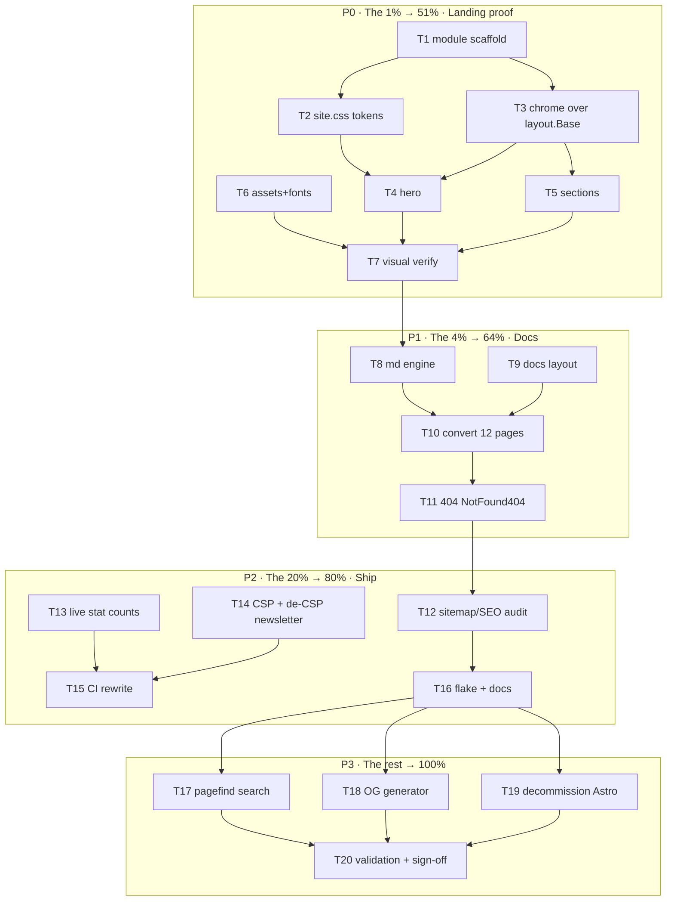

# FULL Astro → templ Conversion — templ-components Website

**Date:** 2026-09-13 11:15 · **Status:** APPROVED PLAN → EXECUTING · **Mandate:** "FULL Astro to templ conversion, while making it better!" · Prime directive: **VERSCHLIMMBESSERN verboten** — the new site must be a strict upgrade, never a regression.

---

## 1. Context & Goal

The public site (https://templcomponents.lars.software) is an Astro 7 + Starlight site
(`website/`, 15 `.astro` components, 12 MDX docs, pnpm, Node 24, deployed to Firebase
Hosting `templcomponents` target, demo on Cloud Run). It is hand-built — **zero bytes of
its HTML come from templ-components itself** (the ultimate dogfooding miss).

**Goal:** Replace Astro entirely with a Go static-site generator that renders every page
through **our own library** (templ-components), keeping the visual design, URL structure,
SEO, and deployment identical — and fixing everything Astro did badly along the way.

### Why this wins

| Axis | Astro today | templ after |
|---|---|---|
| Site built with | Astro + pnpm + Node 24 | Go + our own components (the library sells itself) |
| Build time | ~30-60s (pnpm install + astro build) | <5s (go run) |
| Drift risk | Hero claims "94 components / 102 icons / 37 enums" vs reality 121/106/58 — stale TODAY | Counts derived from the codebase at build time |
| Code samples | Hand-typed strings (`sections.ts`) | Chroma-highlighted, single source |
| Fonts | Google/fontsource at build | Self-hosted woff2, preloaded (GDPR + faster) |
| Dark mode | Custom `.light`-class script | Library `ThemeScript`/`ThemeToggle` (same localStorage keys, zero regression for returning visitors) |
| CSP | No CSP header; inline `onsubmit` handler | CSP header + build nonce + external JS |
| Links | Trailing-slash links → 308 redirects on every nav | Slash-free URLs, no redirect tax |
| 404 | Astro default | `errorpage.NotFound404` in site chrome (dogfood) |
| Search | Starlight/Pagefind | Pagefind post-build (parity, phase 3) |

### Non-negotiables (parity checklist — verified before cutover)

- SEO: title/description/canonical/OG(title,desc,type,url,image)/Twitter card/JSON-LD/robots/sitemap-index
- A11y: skip link, `role="switch"` theme toggle, focus-visible styles, `prefers-reduced-motion` (scroll-reveal AND animations), semantic landmarks, aria-labels
- Behaviors: theme toggle (persist + OS-sync), mobile nav (aria-expanded, icon swap), scroll-reveal `[data-animate]`, hero copy button, newsletter (Buttondown POST)
- Pages: `/` landing, 12 docs pages (same slugs), `/404.html`, OG images
- Assets: favicon.svg, manifest.json, robots.txt, sitemap-index.xml, fonts, CSS, JS
- Deployment: Firebase `templcomponents` target unchanged; demo Cloud Run untouched

---

## 2. Research Findings (current state)

- **Landing:** `index.astro` → `LandingLayout` (head/SEO/JSON-LD/skip-link) + `HeroSection` (GitHub-stars fetch at build, metric strip, code window w/ hand-rolled span highlighting + copy) + `FeatureGrid` (6 features, `Card`) + `Sections` (HowItWorks 4 steps, Comparison matrix table, UseCases 3 cards, CTA). `Newsletter` band above footer. Header: fixed, blur, mobile toggle. Footer: links + MIT.
- **Data:** `config.ts` (name/title/desc/siteUrl/demoUrl/github/author/pkgGoDev), `features.ts` (6), `sections.ts` (4 steps, comparison columns/rows, 3 use cases), `types.ts`, `hero-code.ts`.
- **Design tokens:** `global.css` — dark-default `@theme` + `:root.light` overrides, Space Grotesk (sans) + JetBrains Mono, grid-dot background, `fade-in`/`fade-in-up`/`pulse-dot` keyframes, `[data-animate]` reveal, focus-visible/selection/scrollbar styling. `starlight.css` (docs chrome vars) dies with Starlight.
- **JS:** `theme-init.js` (FOUC, `.light` class), `header.js` (toggle + nav), `animations.js` (IntersectionObserver reveal, motion-reduce aware), `copy-code.js` — all vanilla, portable as-is (theme logic flips to library `.dark` semantics via `layout.ThemeScript`).
- **Docs:** 12 MDX files (~790 lines total): 2 getting-started, 6 guides, api-reference, changelog, contributing, related-projects. Plain markdown + fenced code (bash/go/templ/css/html/json), YAML frontmatter (title/description), NO `:::` admonitions, NO MDX imports/JSX. Starlight sidebar: Getting Started / Guides / API Reference / Community.
- **OG:** `astro-og-canvas` + canvaskit-wasm → per-page PNGs, dark bg + blue border.
- **Infra:** `firebase.json` (cleanUrls, trailingSlash:false, `/docs/*`→`/*` legacy redirect, immutable cache for assets, HSTS+security headers, NO CSP), `.firebaserc` (lars-software / templcomponents), `website.yml` CI (pnpm build → artifact → deploy + demo Docker/Cloud Run), `website/flake.nix` (pnpm apps), `astro.config.mjs` (sitemap, Starlight sidebar, expressiveCode github-light/dark, fonts providers, prefetch).
- **Library reuse map:** `layout.Base` (full shell: SEO/SEOMeta, skip link, favicon, CSSPath, nonce, HeadContent/Footer slots), `layout.ThemeScript`/`ThemeToggle`, `display.Button` (Href→anchor), `display.Card`, `display.Badge`, `feedback.Alert`, `forms.Input` (email), `errorpage.NotFound404`, `icons` package (kills `Icon.astro`'s hand-copied paths), `utils.Class`.
- **Guards:** repo treefmt excludes `website/**`; `scripts/ci-repro.sh` runs `pnpm audit` in website/ (dies with Astro); daemon auto-commits — assume races, use `--force-with-lease` patterns and re-check status before every push.

## 3. Target Architecture

```
website/
  go.mod                      # module github.com/larsartmann/templ-components/website
  go.sum                      # + replace ../ → library modules; deps: templ, goldmark, chroma (site-only)
  cmd/site/main.go            # SSG: render pages → dist/, copy assets, sitemap
  internal/build/             # page registry, stat counter, sitemap, asset copy
  internal/md/                # frontmatter + goldmark + chroma(dual-theme) pipeline
  site.templ                  # landing page (uses library components everywhere possible)
  docs.templ                  # docs layout: sidebar/TOC/prev-next/lastUpdated/editLink
  base.templ                  # site chrome: header/footer shared shell over layout.Base
  content/docs/**/*.md        # 12 pages converted from MDX (same frontmatter)
  site.css                    # Tailwind v4 entry: tokens (light base + .dark overrides),
                              # @source library .templ + website files, @import custom.css
  assets/{js,fonts}/          # theme-init/header/animations/copy-code/newsletter + woff2
  public/{favicon.svg,manifest.json,robots.txt}
  dist/                       # build output (gitignored) — firebase "public"
  firebase.json/.firebaserc   # unchanged (+ CSP header added)
```

Build: `templ generate ./... && go run ./cmd/site && tailwindcss -i site.css -o dist/assets/app.css --minify`.
Pages emitted as `dist/<slug>.html` (cleanUrls serves `/slug` — kills trailing-slash redirects).

## 4. Pareto Breakdown

**The 1% that delivers 51% of the result:**
Go SSG skeleton + design-token CSS + landing page rendered through `layout.Base` with
library components (Hero, Features, Sections). One page that proves the site is now
built by templ-components.

**The 4% that delivers 64% (adds):**
The docs engine (markdown→goldmark→chroma, sidebar layout) + all 12 pages migrated +
404. The site is fully usable and content-complete.

**The 20% that delivers 80% (adds):**
CI/deploy rewrite, static-asset parity (fonts/JS/manifest/robots/sitemap), and the
quick "better" wins: build-time stat counts, self-hosted fonts, CSP header, slash-free
links, newsletter de-CSP. Shippable end-to-end, cutover safe.

**The remaining 80% of the work (final 20% of value):**
Pagefind search, Go OG-image generator, Astro decommission (rm src/, pnpm, website
flake), flake app + ci-repro wiring, doc updates (AGENTS/README/FEATURES), link-check +
validation + visual diff sign-off.

## 5. Comprehensive Plan — tasks 30–100 min (sorted by impact/effort/value)

| # | Task | Impact | Effort | Value | Phase |
|---|---|---|---|---|---|
| T1 | Scaffold website Go module: go.mod (+replaces), cmd/site skeleton, dist writer, nonce util, templ init | ★★★ | 45m | foundation | P0 |
| T2 | Port `global.css` → `site.css` (light base + `.dark` overrides, fonts, keyframes, scrollbar, grid bg, focus, selection) + `@source` scanning + `@import` templates/custom.css | ★★★ | 60m | design parity | P0 |
| T3 | Site chrome in templ over `layout.Base`: head SEO parity (OG/Twitter/JSON-LD/canonical/theme-color), Header (logo, nav, ThemeToggle, mobile menu), Footer (+Newsletter) | ★★★ | 90m | shell | P0 |
| T4 | HeroSection in templ: pill, headline, CTAs (`display.Button`), GitHub stars build-fetch, metric strip, code window (chroma) + copy | ★★★ | 90m | flagship | P0 |
| T5 | Sections in templ: FeatureGrid (`display.Card`), HowItWorks, Comparison matrix, UseCases, CTA (`Sections` registry) | ★★★ | 90m | landing complete | P0 |
| T6 | Static assets pipeline: go:embed + copy to dist; self-hosted fonts (Space Grotesk/JetBrains Mono woff2, latin, preloaded) | ★★ | 60m | perf/parity | P0 |
| T7 | Build harness + visual verify landing (light/dark) vs current Astro build, side-by-side screenshots | ★★★ | 45m | anti-regression | P0 |
| T8 | Docs engine: frontmatter, goldmark (tables/anchors), chroma dual-theme CSS (github-light/dark), code copy buttons | ★★★ | 90m | docs | P1 |
| T9 | Docs layout: sidebar (Starlight's 4 groups), TOC, prev/next, git lastUpdated, editLink, prose styles | ★★★ | 90m | docs UX | P1 |
| T10 | Convert 12 MDX→md, fix links (slash-free), verify each page renders + code blocks highlight | ★★★ | 60m | content parity | P1 |
| T11 | 404 page: `errorpage.NotFound404` in site chrome → dist/404.html | ★ | 30m | dogfood | P1 |
| T12 | Sitemap-index + sitemap (lastmod from git) + robots + manifest + canonical/JSON-LD audit | ★★ | 30m | SEO parity | P2 |
| T13 | Build-time stat counts (components/icons/enums/packages) — kills stale "94/102/37/9" | ★★ | 45m | truth | P2 |
| T14 | CSP header in firebase.json (build nonce) + newsletter popup → external JS (drop inline onsubmit) | ★★ | 45m | security | P2 |
| T15 | Rewrite `website.yml`: setup-go + templ + tailwind CLI, go vet/lint, html-validate dist, deploy unchanged | ★★★ | 60m | shipping | P2 |
| T16 | Flake app `.#website`, ci-repro website step, AGENTS/README/FEATURES notes | ★ | 60m | DX/docs | P2 |
| T17 | Pagefind search (post-build index + sidebar search UI) | ★★ | 90m | parity+ | P3 |
| T18 | Go OG-image generator (pure-Go, branded) per page; static committed fallback | ★ | 90m | share UX | P3 |
| T19 | Decommission Astro: rm src/, astro.config, package.json, pnpm-lock, website/flake.nix, .htmlvalidate move | ★★ | 45m | cleanup | P3 |
| T20 | Full validation: link-check all pages, html-validate clean, golden HTML snapshots, final visual diff | ★★★ | 45m | sign-off | P3 |

## 6. Micro-Plan — tasks ≤12 min (ALL todos, sorted; execute top-down per phase)

| ID | Task (≤12m) | From | Done when |
|---|---|---|---|
| M01 | `website/go.mod` (go 1.26, GOEXPERIMENT note) + replace directives + `go mod tidy` green | T1 | `go build ./...` OK |
| M02 | `cmd/site/main.go` skeleton: page registry, dist/ mkdir+write, `--out` flag | T1 | writes hello dist |
| M03 | `internal/build/nonce.go`: crypto/rand nonce per build, plumbed into props | T1 | nonce in every page |
| M04 | `templ init` files: `base.templ`, `site.templ` compile to Go | T1 | `templ generate` green |
| M05 | Write `site.css` tokens: light base + `.dark` overrides (swap of global.css) | T2 | tokens complete |
| M06 | site.css: fonts/mono vars, grid-dot bg, keyframes, `[data-animate]`, scrollbar, focus, selection | T2 | parity with global.css |
| M07 | site.css: `@source` library+website globs, `@import` templates/custom.css, `@custom-variant dark` | T2 | tailwind compiles |
| M08 | Download woff2 (Space Grotesk 400/500/700, JB Mono 400/600 latin) into assets/fonts | T6 | files committed |
| M09 | `base.templ`: html shell via `layout.Base` (SEOMeta, canonical, OG, theme-color, fonts preload, HeadContent) | T3 | head matches Astro |
| M10 | Header templ: fixed blur bar, Logo svg, nav links, `layout.ThemeToggle`, mobile menu markup | T3 | markup parity |
| M11 | Port header.js/theme-init semantics → assets/js (library `.dark` keys), newsletter popup JS | T3 | behaviors identical |
| M12 | Footer + Newsletter templ (Buttondown POST, `forms.Input` email, external popup JS) | T3 | band renders |
| M13 | JSON-LD SoftwareApplication via SEOMeta; skip-link from Base; verify head tags vs Astro HTML | T3 | diff-clean audit |
| M14 | Hero: pill badge (`display.Badge` or span), h1, sub, 3 CTAs via `display.Button` (Href/External) | T4 | markup parity |
| M15 | Hero: GitHub stars fetch at build (fail-soft), metric strip (build-time counts placeholder) | T4 | numbers render |
| M16 | Hero: code window chrome (dots, filename) + chroma-highlighted templ sample + copy button | T4 | styled like Astro |
| M17 | FeatureGrid: 6 `display.Card`s + icon tiles via `icons.Icon` (kill Icon.astro paths) | T5 | parity |
| M18 | HowItWorks: 4 step cards, accent/amber variants, connector arrows | T5 | parity |
| M19 | Comparison: matrix table (yes/no/partial glyphs, accent column) | T5 | parity |
| M20 | UseCases + CTA + `Sections` composition order in `site.templ` | T5 | full landing renders |
| M21 | Embed/copy js+fonts+public assets → dist (go:embed FS walk) | T6 | dist complete |
| M22 | `main.go` full render of landing → dist/index.html; gofmt+lint clean | T7 | `go run` builds site |
| M23 | Tailwind compile; screenshot light+dark (nix chromium or demo shots tool) vs Astro build | T7 | visual diff OK |
| M24 | `internal/md/frontmatter.go`: YAML title/description parse | T8 | unit-tested |
| M25 | goldmark pipeline: GFM tables, heading anchors/ids, highlight wrapper hooks | T8 | html out |
| M26 | Chroma: WithClasses, generate github-light+dark CSS scoped `.hl-*`, theme-scoped via `:root.dark` | T8 | dual-theme blocks |
| M27 | Docs content spec: sidebar tree, prev/next order (mirror astro.config) as Go data | T9 | registry compiles |
| M28 | `docs.templ`: 3-col layout (sidebar/content/TOC), prose typography, responsive | T9 | renders a page |
| M29 | Prev/next + git lastUpdated + editLink (GitHub URL) + frontmatter title in sidebar active state | T9 | complete |
| M30 | Convert 4 root docs (api-reference, changelog, contributing, related-projects) | T10 | pages render |
| M31 | Convert getting-started (2) | T10 | pages render |
| M32 | Convert guides (6) | T10 | pages render |
| M33 | Link audit pass: slash-free internal links, anchors resolve | T10 | no 404 hrefs |
| M34 | 404.html via NotFound404 (props: search off, quick links: Docs/GitHub/demo) | T11 | renders in chrome |
| M35 | sitemap-index.xml + sitemap.xml (all URLs, lastmod via git log) + robots.txt (keep existing URL) | T12 | files valid |
| M36 | manifest.json + favicon copy + canonical/og:url audit on every page | T12 | SEO checklist green |
| M37 | Stat counter: parse `templ (\w+)\(` across library .templ → components count | T13 | count matches reality |
| M38 | Stat counter: icons total + IsValid() enums count + packages/modules count; wire into hero/features | T13 | hero shows truth |
| M39 | firebase.json: CSP header (script-src 'self' 'nonce-<build>') + keep existing headers | T14 | config valid |
| M40 | Newsletter onsubmit → assets/js/newsletter.js; grep zero inline handlers | T14 | CSP-safe |
| M41 | website.yml build job: go setup, templ, tailwind CLI, `go run ./cmd/site`, artifact dist | T15 | job green on push |
| M42 | website.yml: vet+lint website module, html-validate dist, deploy job unchanged | T15 | pipeline complete |
| M43 | Root flake: `apps.#website` (templ+go+tailwind build); nixfmt | T16 | `nix run .#website` |
| M44 | ci-repro.sh: replace pnpm-audit step with website build step | T16 | script runs |
| M45 | AGENTS.md (module list/architecture), README/FEATURES site note, CHANGELOG [Unreleased] | T16 | docs updated |
| M46 | Pagefind: add binary via nix/CI, post-build `pagefind --site dist` | T17 | index generated |
| M47 | Search UI: sidebar input + results dropdown, CSP-safe external JS | T17 | search works |
| M48 | OG generator: static committed og/home.png (from current build) referenced in SEOMeta (interim) | T18 | OG cards work |
| M49 | Go OG generator (gg + committed TTF): title/description cards per page (optional flag) | T18 | pngs generated |
| M50 | Decommission: trash website/src, astro.config.mjs, package.json+pnpm-lock, website/flake.nix, .htmlvalidate move | T19 | no Astro left |
| M51 | Link-checker script over dist (internal hrefs resolve), html-validate green | T20 | 0 errors |
| M52 | Golden HTML snapshots for landing+docs (utils/golden), drift guard for stat counts | T20 | tests pass |
| M53 | Final visual diff (light/dark, mobile) + CHANGELOG entry + push | T20 | sign-off |

## 7. Execution Graph



## 8. Guardrails (anti-Verschlimmbesserung)

1. **Astro stays deployable until T20 sign-off** — new Go code lives beside `website/src/`; cutover = one commit removing Astro (T19), never before parity.
2. **Parity checklist (§1) is the contract** — every item verified against the Astro build's HTML before cutover; deviations must be *improvements*, documented in CHANGELOG.
3. **Same localStorage keys ("theme": "light"/"dark")** — returning visitors keep their theme.
4. **Same URLs** — slugs identical; trailing slash dropped only because firebase redirects it anyway (308 today = pure win).
5. **Daemon races** — `git status` before every commit/push; `--force-with-lease` only via worktree pattern if ever needed.
6. **Website deps never leak into the library** — goldmark/chroma live in the `website` module only; the 7-module library DAG untouched (layer check must stay green).
7. **Every phase ends green**: `templ generate && go build && go vet && golangci-lint` on the website module + dist renders.

## 9. Acceptance Criteria

- [ ] `go run ./cmd/site` produces dist/ with landing + 12 docs + 404 + sitemap + assets
- [ ] Visual parity (light/dark/mobile) vs Astro screenshots, improvements listed in CHANGELOG
- [ ] All internal links resolve, no trailing-slash 308s, html-validate clean
- [ ] CI website job green without pnpm for the site; deploy publishes unchanged URLs
- [ ] Hero counts derive from the codebase (drift-proof), CSP header live, fonts self-hosted
- [ ] Library DAG untouched: `scripts/check-module-layers.sh` + full CI still green
