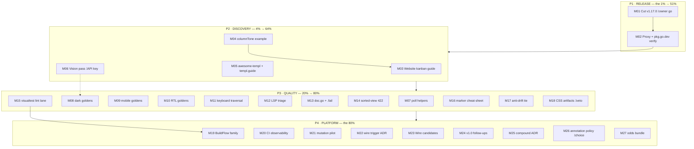

# Release-First Pareto Master Plan (2026-09-17 06:00)

**Scope:** ALL open TODO_LIST items (~47 distinct: #28–#230) + this session's new process
tasks, organized by Pareto tiers, split into 27 medium tasks (30–100 min) and ~130
micro-tasks (≤12 min). Point-in-time snapshot; TODO_LIST.md stays the living source
(new items #225–#230 registered there alongside this plan).

**Input sources:** TODO_LIST.md (read in full 2026-09-17 06:00) ·
docs/status/2026-09-17_05-54_kanban-followthrough-hardening-status.md §c/§f ·
docs/status/2026-09-16_19-12 §f (30/40 already shipped).

**Override note:** skill default is a styled HTML report; the owner explicitly requested
`.md` with a mermaid/d2 graph — honored. Micro-task cap tightened 15 min → **12 min** per
owner instruction.

---

## 1. Pareto Breakdown

### The 1% that delivers 51% — SHIP THE ACCUMULATED VALUE

**→ Cut v1.17.0 (#192) + verify proxy propagation.**

Three sessions of work (a11y pack, layout pack, `KanbanColumn.Action`/`Tone`,
kanban security hardening, smoke CLI — 8 warm `[Unreleased]` entries) currently delivers
**zero** consumer value: the Go module proxy serves tagged source only. Every other task on
this list multiplies the value of things consumers cannot yet `go get`. One release turns
the entire backlog into shipped value. Nothing else on this list is comparable.

### The 4% that delivers 64% — MAKE THE SHIPPED VALUE ADOPTABLE

**→ Discovery & trust layer around the release:** website kanban guide (#222),
`ExampleKanbanBoard_columnTone` (#221), awesome-templ/templ.guide submissions (#28/#29),
AI-vision first pass over the flagged goldens incl. the new kanban set (#80/#150/#162/#223).
Shipping + discoverability + a human-confirmed visual QA pass = consumers find it, trust it,
adopt it. (Release + these 5 = 64%.)

### The 20% that delivers 80% — CONSOLIDATE QUALITY & EXPERIENCE

**→ The test/doc harness that keeps the shipped thing trustworthy:** route-golden expansion
(dark/mobile/RTL, #194–196), `pollBool`/`pollText` harness helpers (#193), keyboard-only
traversal (#197), LSP-warning triage (#198/#199), datastar doc.go fact (#200), `.fail/`
hygiene (#202), sorted-view 422 demo+e2e (#224), visualtest lint lane (#225), demo
contract-marker cheat-sheet (#226), demo/e2e anti-drift tie (#227), CSS-artifact deletion
execution (#211-a), file-backed kanban demo state (#189). (~15 tasks → 80%.)

### The remaining 80% — PLATFORM, DEFERRED, OWNER-GATED

BuildFlow family (#93/#107/#108/#124/#125/#126, cross-repo), CI observability (#213/#214),
mutation pilot (#215), wire ADRs (#178) + Wire candidates (#157/#155), v1.0 follow-ups
(#33/#34), compound components (#39, v2.0), annotation policy (#212), touch-drag (#190),
demand-gated components (#217 keep-gate), dormant notes (#119/#120/#154), plan TEMPLATE
(#228), session CSRF (#229), recipes sweep remainder (#230). Small or slow individually —
they are the long tail, explicitly NOT allowed to block the 1%.

**Sequencing rule:** 1% → 4% → 20% → 80%. Owner-gated items (#80 API key, #211 veto
window, #192 go/no-go) are planned to the gate edge so zero planning time is wasted waiting.

---

## 2. Comprehensive Plan — 27 medium tasks (30–100 min each)

Sorted by importance/impact/effort/customer-value. "⫱" marks owner-gated edges.

| M#  | Phase | Task                                                                                                     | Covers                                         | Min | Impact | Effort | Value |
| --- | ----- | -------------------------------------------------------------------------------------------------------- | ---------------------------------------------- | --- | ------ | ------ | ----- |
| M01 | P1    | Pre-release verify + cut v1.17.0 via release.sh ⫱go                                                      | #192                                           | 60  | ★★★★★  | M      | ★★★★★ |
| M02 | P1    | Post-release proxy + pkg.go.dev + consumer `go get` verification                                         | f36, #192                                      | 40  | ★★★★   | S      | ★★★★  |
| M03 | P2    | Website kanban guide page (BUILD from recipe)                                                            | #222                                           | 90  | ★★★★   | M      | ★★★★  |
| M04 | P2    | `ExampleKanbanBoard_columnTone` + godoc pass                                                             | #221                                           | 30  | ★★★    | S      | ★★★   |
| M05 | P2    | Outreach one-shots: awesome-templ PR + templ.guide listing                                               | #28, #29                                       | 30  | ★★★    | S      | ★★★   |
| M06 | P2    | AI-vision pass over flagged goldens ⫱API key; owner eyeballs SUSPECT                                     | #80, #150, #162, #223                          | 45  | ★★★★   | S      | ★★★★  |
| M07 | P3    | `pollBool`/`pollText` harness helpers + migrate flow tests                                               | #193                                           | 90  | ★★★    | M      | ★★★   |
| M08 | P3    | Route goldens: dark variants ×7                                                                          | #194                                           | 60  | ★★★    | M      | ★★★   |
| M09 | P3    | Route goldens: 375px mobile ×4                                                                           | #195                                           | 60  | ★★★    | M      | ★★★   |
| M10 | P3    | Route goldens: RTL captures                                                                              | #196                                           | 45  | ★★     | M      | ★★    |
| M11 | P3    | Keyboard-only demo traversal audit                                                                       | #197                                           | 60  | ★★★    | M      | ★★★   |
| M12 | P3    | Kanban LSP warnings triage + gopls upstream note                                                         | #198, #199                                     | 45  | ★★     | S      | ★★    |
| M13 | P3    | datastar doc.go fact + `.fail/` hygiene                                                                  | #200, #202                                     | 30  | ★★     | S      | ★★    |
| M14 | P3    | Sorted-view demo board + 422 rejection e2e                                                               | #224                                           | 90  | ★★★    | M      | ★★★   |
| M15 | P3    | visualtest lint lane + siteshots cleanup                                                                 | #225                                           | 60  | ★★★    | M      | ★★★   |
| M16 | P3    | Demo contract-marker cheat-sheet                                                                         | #226                                           | 30  | ★★     | S      | ★★★   |
| M17 | P3    | Demo/e2e kanban endpoint anti-drift tie                                                                  | #227                                           | 30  | ★★     | S      | ★★    |
| M18 | P3    | Execute CSS-artifact deletion (a) ⫱owner veto window                                                     | #211                                           | 40  | ★★     | S      | ★★    |
| M19 | P4    | BuildFlow family session (cross-repo `larsartmann/buildflow`)                                            | #93, #107, #108, #124, #125, #126              | 100 | ★★★★★  | L      | ★★★★  |
| M20 | P4    | CI observability: wall-clock budget + benchstat comment                                                  | #213, #214                                     | 90  | ★★     | M      | ★★    |
| M21 | P4    | Mutation-testing pilot: gremlins on utils                                                                | #215                                           | 60  | ★★     | M      | ★★    |
| M22 | P4    | ADR: typed interval/intersect wire triggers                                                              | #178                                           | 90  | ★★     | M      | ★★    |
| M23 | P4    | Wire-candidate surveys: Calendar month nav + SimpleNav links                                             | #157, #155                                     | 60  | ★★     | M      | ★★    |
| M24 | P4    | v1.0 follow-ups: `Validate()` scoping + testutil migration slice 1                                       | #33, #34                                       | 100 | ★      | M      | ★     |
| M25 | P4    | Compound-components ADR-0023 progress (v2.0)                                                             | #39                                            | 60  | ★      | M      | ★     |
| M26 | P4    | Annotation policy decision + application ⫱option choice                                                  | #212                                           | 60  | ★      | M      | ★     |
| M27 | P4    | Odds bundle: pnpm shim, dormant notes, TEMPLATE.md, recipes sweep, session CSRF, demo file-state scoping | #119, #120, #154, #228, #229, #230, #189-scope | 90  | ★★     | M      | ★★    |

Phase sums: P1 100min · P2 285min · P3 540min · P4 750min ≈ **27.9h** total.

---

## 3. Detailed Breakdown — ~130 micro-tasks (≤12 min each)

Legend: `gate` = stops until the owner provides the named input. Micro-IDs = M-ordinal.row.

### P1 — Release (the 1%)

| µ#    | Micro-task                                                                               | Min |
| ----- | ---------------------------------------------------------------------------------------- | --- |
| M01.1 | Pre-verify touched packages + `nix develop -c golangci-lint` on display/utils            | 10  |
| M01.2 | `git fetch` + clean-tree check + CHANGELOG `[Unreleased]` warmth review                  | 10  |
| M01.3 | Bump version triple (utils/version.go, CHANGELOG heading, FEATURES) in release.sh run    | 15  |
| M01.4 | `nix shell nixpkgs#govulncheck -c nix develop -c scripts/release.sh v1.17.0 "
"` | 15  |
| M01.5 | Review `git show v1.17.0` (replace-strip intact, tags for root + 5 sub-modules)          | 10  |
| M01.6 | Push master + tags; confirm CI green on the release commit                               | 10  |
| M02.1 | Poll proxy.golang.org for v1.17.0 visibility                                             | 10  |
| M02.2 | pkg.go.dev render check (new APIs visible, goldens irrelevant, doc examples render)      | 10  |
| M02.3 | Scratch-module `go get github.com/larsartmann/templ-components@v1.17.0` + build          | 10  |
| M02.4 | Record any propagation gaps in docs/release-checklist.md                                 | 10  |

### P2 — Discovery (the 4%)

| µ#    | Micro-task                                                                 | Min |
| ----- | -------------------------------------------------------------------------- | --- |
| M03.1 | Outline the kanban guide page (sections, frontmatter, sidebar slug)        | 10  |
| M03.2 | Draft "board + moves" section from demo/recipe content                     | 12  |
| M03.3 | Draft "Action slot + Tone dot" section                                     | 12  |
| M03.4 | Draft card-anatomy summary + recipe link                                   | 10  |
| M03.5 | Register page in sidebar/navigation + sitemap                              | 10  |
| M03.6 | Build site + run link/anchor checker                                       | 10  |
| M03.7 | CSP header update if any inline script/style sneaks in (`--update-csp`)    | 10  |
| M03.8 | siteshots + search-index verify; route goldens for the new page if added   | 12  |
| M04.1 | Write `ExampleKanbanBoard_columnTone` in display/kanban_example_test.go    | 10  |
| M04.2 | `go test ./display/...` + vet                                              | 5   |
| M04.3 | CHANGELOG entry + docs-count pass (examples are not count-guarded; verify) | 10  |
| M05.1 | Fork awesome-templ, create branch                                          | 5   |
| M05.2 | Add library entry + open PR                                                | 10  |
| M05.3 | Submit templ.guide directory listing                                       | 10  |
| M05.4 | Mark #28/#29 done in TODO_LIST (move to CHANGELOG)                         | 5   |
| M06.1 | Add `kanban/section_action_tone_*` to the vision-review flagged set (#223) | 10  |
| M06.2 | gate: export vision API key; run `scripts/vision-review-goldens.sh`        | 10  |
| M06.3 | Triage CLEAN vs SUSPECT verdicts                                           | 12  |
| M06.4 | File `docs/reviews/vision-golden-review-<date>.md` + TODO updates          | 10  |
| M06.5 | gate: owner eyeballs SUSPECT PNGs only (#80/#150/#162)                     | 5   |

### P3 — Quality consolidation (the 20%)

| µ#    | Micro-task                                                                         | Min |
| ----- | ---------------------------------------------------------------------------------- | --- |
| M07.1 | Add `pollBool`/`pollText` helpers to visualtest harness                            | 12  |
| M07.2 | Harness unit tests for both helpers                                                | 10  |
| M07.3 | Migrate wire_forms_pack tests onto helpers                                         | 12  |
| M07.4 | Migrate demo_flows + kanban e2e onto helpers                                       | 12  |
| M07.5 | Migrate datastar/calendar/loading_button e2e onto helpers                          | 12  |
| M07.6 | Full visual run + lint                                                             | 12  |
| M08.1 | Capture 7 dark route goldens (`-update`)                                           | 12  |
| M08.2 | Eyeball all 7 dark PNGs (theme-pinning lesson: localStorage + reload)              | 10  |
| M08.3 | Golden-count drift bump (README/FEATURES/ROADMAP/AGENTS)                           | 10  |
| M08.4 | Commit + visual suite green                                                        | 10  |
| M09.1 | Capture 375px mobile goldens ×4                                                    | 12  |
| M09.2 | Eyeball mobile PNGs                                                                | 10  |
| M09.3 | Count bump + suite green                                                           | 10  |
| M09.4 | Commit                                                                             | 5   |
| M10.1 | Capture RTL goldens                                                                | 12  |
| M10.2 | Eyeball RTL PNGs (mirroring, logical properties)                                   | 10  |
| M10.3 | Count bump + suite green + commit                                                  | 10  |
| M11.1 | Write keyboard-traversal harness script (Tab walk, focus recorder)                 | 12  |
| M11.2 | Run on all demo routes; record focus-order findings                                | 12  |
| M11.3 | Fix trivial issues found (or file them)                                            | 12  |
| M11.4 | Re-audit + document results                                                        | 12  |
| M12.1 | `golangci-lint` ground truth on display/kanban (LSP warnings are stale by default) | 10  |
| M12.2 | Delete genuinely-dead code or wire it                                              | 12  |
| M12.3 | Write the gopls false-positive upstream note (#199)                                | 12  |
| M12.4 | Close #198/#199 in TODO_LIST                                                       | 5   |
| M13.1 | Mirror innerHTML-no-scripts fact into datastar doc.go                              | 10  |
| M13.2 | `.fail/` prune step after green visual runs (#202)                                 | 10  |
| M13.3 | Guard/test + commit                                                                | 10  |
| M14.1 | Demo: add a priority-sorted view (e.g. `?sort=priority` board variant)             | 12  |
| M14.2 | Move handler: 422 branch on same-column moves for sorted views                     | 12  |
| M14.3 | Unit tests for the handler branch                                                  | 10  |
| M14.4 | e2e: click a same-column move → assert 422 + board unchanged                       | 12  |
| M14.5 | Cross-column move still 200 on the sorted board                                    | 10  |
| M14.6 | Smoke legs (visualtest/tools/smoke) for 200/422                                    | 10  |
| M14.7 | Docs: recipe + transport-wiring cross-link the live demo                           | 10  |
| M15.1 | Fix siteshots err113 (wrapped static errors)                                       | 12  |
| M15.2 | Fix siteshots errcheck + forbidigo                                                 | 12  |
| M15.3 | Add visualtest to the CI lint matrix                                               | 10  |
| M15.4 | Local lint lane green; AGENTS lint-command section updated                         | 10  |
| M15.5 | Commit + CI green                                                                  | 8   |
| M16.1 | Write the marker cheat-sheet table (endpoints × markers × methods)                 | 12  |
| M16.2 | Link from AGENTS.md demo section + smoke CLI docs                                  | 8   |
| M17.1 | Extract shared kanban endpoint contract builder or add cross-binding comments      | 12  |
| M17.2 | Verify both sides compile + tests green                                            | 10  |
| M17.3 | Document the tie in both files' headers                                            | 8   |
| M18.1 | gate: owner veto window on #211-(a)                                                | 5   |
| M18.2 | Delete `templates/styles.css` + `templates/templ-components-theme.out.css`         | 5   |
| M18.3 | Update `scripts/compiled-css-targets.txt` + release.sh compile loop                | 12  |
| M18.4 | Update TestCompiledCSSInventory expectations; guards green                         | 12  |
| M18.5 | Full verify + commit                                                               | 10  |

### P4 — Platform / deferred / owner-gated (the 80%)

| µ#    | Micro-task                                                                     | Min |
| ----- | ------------------------------------------------------------------------------ | --- |
| M19.1 | Pick the BuildFlow repo slice (message templates from `git diff --stat` first) | 12  |
| M19.2 | Implement honest commit messages                                               | 12  |
| M19.3 | Fix `*_templ.go` gitignore re-append (#124)                                    | 12  |
| M19.4 | Fix tailwind-build un-minify provider flag (#125)                              | 12  |
| M19.5 | Fix jsonv2 preflight scan (#107)                                               | 12  |
| M19.6 | Scope eslint to config-owning dirs (#108)                                      | 12  |
| M19.7 | Commit-classifier for vetted artifacts (#126)                                  | 12  |
| M19.8 | Cross-repo tests + changelog + note back in templ-components AGENTS            | 12  |
| M20.1 | Master job writes job-duration artifact                                        | 12  |
| M20.2 | PR job diffs vs baseline, comments >+20% (#213)                                | 12  |
| M20.3 | Master bench.old artifact writer (#214)                                        | 12  |
| M20.4 | PR benchstat comment workflow                                                  | 12  |
| M20.5 | Verify on a throwaway PR; tune thresholds                                      | 12  |
| M21.1 | Pin gremlins install (not in nixpkgs — `go install @pin`)                      | 10  |
| M21.2 | Run 1 on utils (`--tags integration --output json`)                            | 12  |
| M21.3 | Run 2 (variance)                                                               | 12  |
| M21.4 | Run 3 (variance)                                                               | 12  |
| M21.5 | Write docs/testing/mutation-baseline.md kill-rate record                       | 10  |
| M22.1 | Survey both dialects' interval/intersect capabilities (bundle-verified)        | 12  |
| M22.2 | Draft ADR: context + options                                                   | 12  |
| M22.3 | Draft ADR: decision + htmx modeling                                            | 12  |
| M22.4 | Draft ADR: Datastar modeling + bundle pins                                     | 12  |
| M22.5 | Consequences + transport-wiring.md cross-link                                  | 12  |
| M23.1 | Calendar Wire demand check (D3 gate)                                           | 10  |
| M23.2 | Calendar month-nav design sketch (both dialects)                               | 12  |
| M23.3 | SimpleNav links demand check + sketch                                          | 12  |
| M23.4 | Decision notes → TODO_LIST / ROADMAP outcomes                                  | 10  |
| M24.1 | Scope `Validate()`: which props have representable invalid states?             | 12  |
| M24.2 | Implement batch 1 (highest-value structs) + tests                              | 12  |
| M24.3 | Implement batch 2 + tests                                                      | 12  |
| M24.4 | testutil migration: inventory + mechanical plan (#34)                          | 12  |
| M24.5 | Execute migration slice 1 (utils + display)                                    | 12  |
| M24.6 | Execute migration slice 2 (remaining packages) + full verify                   | 12  |
| M25.1 | Re-read ADR-0023; list open design questions                                   | 10  |
| M25.2 | Sketch Trigger/Content/Close API for Modal                                     | 12  |
| M25.3 | Sketch for Drawer + Dropdown                                                   | 12  |
| M25.4 | Migration/compat notes into the ADR                                            | 12  |
| M26.1 | gate: owner picks option a/b/c (#212)                                          | 5   |
| M26.2 | Apply chosen option (ID map / report-level notes / declare open-by-design)     | 12  |
| M26.3 | Sample-verify 5 files                                                          | 12  |
| M26.4 | Full pass + completeness gate (`grep -rLn '~~'` on archived)                   | 12  |
| M27.1 | Remove the bun shim / document durable node PATH (#119)                        | 10  |
| M27.2 | Verify #120 (CSS recompile) + #154 (prerender) still dormant; refresh notes    | 10  |
| M27.3 | Write docs/planning/TEMPLATE.md from the AGENTS checklist (#228)               | 12  |
| M27.4 | Recipes sweep remainder: per-line audit of remaining Go-snippet recipes (#230) | 12  |
| M27.5 | Session-scoped CSRF scoping note (#229) — design sketch only                   | 12  |
| M27.6 | File-backed kanban demo state scoping (#189) — design sketch only              | 12  |
| M27.7 | TODO_LIST hygiene pass: strike done, re-number collisions, bump header         | 10  |

Micro-total ≈ 131 tasks, ≈ 25.4h. Every micro-task ≤12 min.

---

## 4. Execution Graph

Reading: solid arrows = sequencing; `⫱` = owner gate (M01 go/no-go, M06 API key,
M18 veto window, M26 option choice). Parallel lanes inside P3 are independent;
M08 can start as soon as M06's flagged-set update lands (M06.1).

---

## 5. Coverage Matrix (proof: every open TODO appears)

| TODO_LIST items                   | Plan coverage                                                  |
| --------------------------------- | -------------------------------------------------------------- |
| #28, #29                          | M05                                                            |
| #33, #34                          | M24                                                            |
| #39                               | M25                                                            |
| #80, #150, #162, #223             | M06                                                            |
| #93, #107, #108, #124, #125, #126 | M19                                                            |
| #119, #120, #154                  | M27.1–M27.2                                                    |
| #157, #155                        | M23                                                            |
| #178                              | M22                                                            |
| #189                              | M27.6 (scoping)                                                |
| #190                              | owner-gated, stays deferred (no plan slot by decision)         |
| #191                              | closed 2026-09-16 (decision recorded)                          |
| #192                              | M01, M02                                                       |
| #193                              | M07                                                            |
| #194, #195, #196                  | M08, M09, M10                                                  |
| #197                              | M11                                                            |
| #198, #199                        | M12                                                            |
| #200                              | M13                                                            |
| #202                              | M13                                                            |
| #211                              | M18                                                            |
| #212                              | M26                                                            |
| #213, #214                        | M20                                                            |
| #215                              | M21                                                            |
| #216                              | event-triggered (next html5validator bump) — no slot by design |
| #217                              | standing demand gate — no action by decision                   |
| #221                              | M04                                                            |
| #222                              | M03                                                            |
| #223                              | M06.1                                                          |
| #224                              | M14                                                            |
| #225                              | M15                                                            |
| #226                              | M16                                                            |
| #227                              | M17                                                            |
| #228                              | M27.3                                                          |
| #229                              | M27.5                                                          |
| #230                              | M27.4                                                          |

Uncovered-by-design: #190 (owner-deferred), #216 (bump-triggered), #217 (standing gate),
#191 (closed). Everything else has a task, an owner gate, or an explicit decision.

---

## 6. Verschlimmbesserung Guards (what this plan will NOT do)

1. **No new dependencies.** The budget stays closed (templ, tailwind-merge-go,
   go-error-family). Gremlins is a dev-time `go install` pinned tool, not a dependency.
2. **No breaking API changes.** v1.17.0 is additive; compound components stay ADR-tracked
   for v2.0.
3. **No golden-regen without eyeballing.** Every pixel-golden task includes an explicit
   eyeball micro-task (the route-golden theme-pinning lesson).
4. **No doc-count edits without the guards.** Golden/golden-count changes run
   `TestDocsCountDrift` + `TestFeaturesEnumTableExhaustive` in the same task.
5. **No release without the release script** (nix shell + govulncheck on PATH) and no
   re-tagging — the proxy caches permanently.
6. **Owner gates stay gates.** M01/M06/M18/M26 stop at the gate edge; no speculative work
   past them.
7. **Historical docs are never rewritten** — plans and reports get ANNOTATE-mode treatment
   only.
