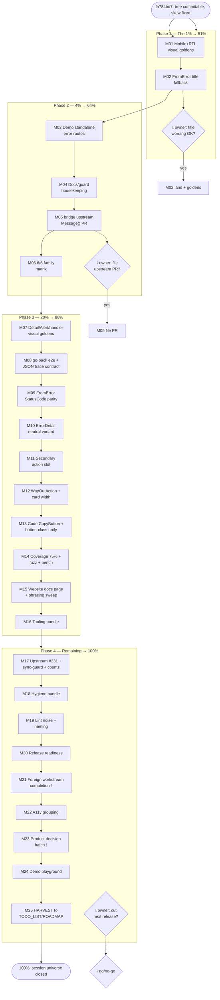

# ErrorPage Visual-Parity & Bridge-Integration Pareto Plan (2026-09-17 18:20)

**Scope:** the errorpage-session universe — the redesigned `ErrorPage`, the
`go-error-family/bridge` + oops integration, the 50 session-derived backlog items
(`docs/status/2026-09-17_15-27_errorpage-redesign-and-error-model-status.md` §f),
the three open owner questions, and the parallel-workstream completions observed
during the session. 25 medium tasks (30–100 min) → ~120 micro-tasks (≤12 min).
Point-in-time snapshot; `TODO_LIST.md` stays the living source. The repo-wide
backlog (kanban/website/release items) is covered by
`docs/planning/2026-09-17_06-00_RELEASE-FIRST-PARETO-MASTER-PLAN.md` — overlaps are
marked where both plans touch the same files.

**Input sources:** status report §a–§g (2026-09-17 15:27) · bridge probe results
(`/tmp/gef-bridge-probe`, S1–S5) · `docs/plan-authoring-checklist.md` ·
`docs/planning/TEMPLATE.md` conventions · commit `fa784bd7` (BuildFlow
go-structure-linter skip, TODO #231 second wave).

**Override note:** skill default is a styled HTML report; the owner explicitly
requested `.md` with a mermaid/d2 graph — honored. Micro-cap tightened 15 → **12 min**
per owner instruction.

**Plan-authoring checklist compliance:**

1. _Goldens-cover-this_ — every task that changes rendered output carries its
   golden/visual-golden step in the same task (M01/M02/M06/M07/M08/M10/M11/M12/M13).
2. _Wired ⇒ e2e (or waiver)_ — no planned task renders new `wire.Action`/`hx-*`
   attributes; the only JS-bearing surface (`data-tc-go-back`) already has a browser
   task (M08). Waiver: none needed.
3. _Same-edit count bumps_ — every golden-adding task includes the
   README/FEATURES/ROADMAP/AGENTS count bump in the same edit (`TestDocsCountDrift`).
4. _Demo smoke is a gate_ — M03 and M24 end with `visualtest/tools/smoke` /
   `nix run .#visual`; M04's scaffolded-source sync is re-proven by
   `TestSourcesMatchPackageFiles`.

**Owner gates are marked `⫱`** and planned to the gate edge.

---

## 1. Pareto Breakdown

### The 1% that delivers 51% — MAKE THE REDESIGN PROVABLE AND COMPLETE

**→ M01 (mobile + RTL visual goldens for the redesigned ErrorPage) and M02
(FromError family-derived title fallback).**

The redesign shipped browser-proven only at the default viewport in LTR; the chip
row's `flex-wrap`, the meta footer's `justify-between`, and RTL mirroring are
unproven — one bad viewport and the flagship deliverable regresses silently. And
every `FromError`/bridge consumer still renders a **titleless** page (the exact
"ugly" the session started with, resurfacing through the most common code path).
Together these two close the deliverable: proven everywhere, complete for everyone.
Nothing else on this list compares.

### The 4% that delivers 64% — MAKE IT DEMOABLE, DISCOVERABLE, AND CONNECTED

**→ M03 (standalone error demo routes through `ErrorHandler`), M04 (docs/guard
housekeeping), M05 (bridge upstream `Message()` PR), M06 (6/6 family matrix).**

The demo currently embeds full-page components in bordered boxes (nested `main`,
per-section viewport height) — the sales surface undersells the redesign. The docs
layer (guard tables, godoc example, skill one-liners) is where the next consumer
looks. The bridge PR is a one-method upstream fix that removes the `[conflict]`
prefix from every non-oops bridge error's page message. 1% + these four = 64%.

### The 20% that delivers 80% — CONSOLIDATE QUALITY, ERGONOMICS, AND TOOLING

**→ M07–M16:** visual goldens for ErrorDetail/ErrorAlert/handler, go-back e2e +
JSON trace contract, `FromError` StatusCode parity, ErrorDetail neutral variant,
secondary action slot, `WayOutAction` typing + width, Code-chip CopyButton +
button-class unification, coverage 71.5→75% + fuzz + benchmark, website docs page +
phrasing sweep, and the tooling bundle (`visual-update` app, ci-repro verdict,
go.sum tidy). (~10 tasks → 80%.)

### The remaining 80% — PLATFORM, DECISIONS, COORDINATION

**→ M17–M25:** upstream TODO #231 investigation (the go-structure-linter auto-bump
loop fixed today in `fa784bd7` needs the BuildFlow-side root fix), repo hygiene,
lint-noise cleanup, release readiness, foreign-workstream completion (⫱ owner
coordination), a11y refinement, product-decision batch (⫱), demo playground, and
HARVEST routing into TODO_LIST/ROADMAP. Small or slow individually — the long tail,
explicitly not allowed to block the 1%.

**Sequencing rule:** 1% → 4% → 20% → 80%. Owner-gated items are planned to the gate
edge so zero planning time is wasted waiting.

---

## 2. Execution Graph

---

## 3. Comprehensive Plan — 25 medium tasks (30–100 min each)

Sorted by importance/impact/effort/customer-value. "Covers" = status-report §f item
numbers (§f1–§f50) + session items. "⫱" = owner gate at task edge.

| M#  | Phase | Task                                                                                                                                                                  | Covers                       | Min | Impact | Effort | Value |
| --- | ----- | --------------------------------------------------------------------------------------------------------------------------------------------------------------------- | ---------------------------- | --- | ------ | ------ | ----- |
| M01 | P1    | ErrorPage regression shield: 375px mobile + RTL visual goldens, incl. count bumps + `-update` regen                                                                   | §f5, §f6                     | 60  | ★★★★★  | S      | ★★★★★ |
| M02 | P1    | FromError family-derived Title fallback (design → ⫱ wording gate → impl → goldens → CHANGELOG)                                                                        | new (Q3/Q-gaps)              | 90  | ★★★★★  | M      | ★★★★★ |
| M03 | P2    | Demo restructure: standalone `/errors/*` routes via `ErrorHandler`; ErrorPage/NotFound404 sections link out; smoke gate                                               | §f3, §f38                    | 100 | ★★★★   | M      | ★★★★  |
| M04 | P2    | Docs/guard housekeeping: AGENTS+skill guard-table rows, ExampleErrorPage, skill/FEATURES one-liners, Code open-enum policy, doc.go props table                        | §f1, §f2, §f20, §f34, §f49   | 60  | ★★★★   | S      | ★★★★  |
| M05 | P2    | go-error-family upstream: add `Message()` to `bridge.ClassifiedError` (kills `[family]` prefix) → ⫱ file PR                                                           | new (probe S5)               | 60  | ★★★★   | S      | ★★★★  |
| M06 | P2    | Family completeness: orchestration ErrorAlert in demo + 6/6 matrix golden + count bumps                                                                               | §f4                          | 30  | ★★★    | S      | ★★★   |
| M07 | P3    | Visual goldens: ErrorDetail (light/dark), ErrorAlert (light/dark), handler `HTMLShell` render golden                                                                  | §f7, §f10                    | 90  | ★★★    | M      | ★★★   |
| M08 | P3    | Browser e2e for go-back button (`history.back()` proof) + JSON `trace`/chip-parity contract test                                                                      | §f8, §f24                    | 60  | ★★★    | M      | ★★★   |
| M09 | P3    | `FromError` sets `StatusCode` from `FamilyStatusCode` (parity with handler) + tests                                                                                   | §f9                          | 30  | ★★★    | S      | ★★★   |
| M10 | P3    | ErrorDetail neutral/accent-bar variant (parity option with ErrorPage) + goldens                                                                                       | §f13                         | 60  | ★★★    | M      | ★★★   |
| M11 | P3    | Secondary action slot on ErrorPage (`SecondaryWayOut` ghost button) + goldens                                                                                         | §f11                         | 60  | ★★★    | M      | ★★★   |
| M12 | P3    | `WayOutAction` typed struct (text+href, replaces loose strings, deprecation-free dual read) + `MaxWidth` enum                                                         | §f12, §f16                   | 90  | ★★     | M      | ★★    |
| M13 | P3    | Code-chip CopyButton composition + unify ErrorPage/NotFound404 button-class constants                                                                                 | §f14, §f15                   | 60  | ★★     | S      | ★★    |
| M14 | P3    | Quality push: coverage 71.5→75%, `FuzzParseFamily`, `BenchmarkErrorPage`, recompute FEATURES coverage line                                                            | §f17–§f19, §f37              | 90  | ★★★    | M      | ★★    |
| M15 | P3    | Website docs page for errorpage + recipe freshness check + "Wix-style"/stale-phrasing repo sweep                                                                      | §f21–§f23                    | 90  | ★★★    | M      | ★★★   |
| M16 | P3    | Tooling: `visual-update <pattern>` flake app, ci-repro verdict line + exit code, visualtest `go mod tidy` decision, golden `-update` LCS summary                      | §f25–§f27, §f47              | 90  | ★★★    | M      | ★★    |
| M17 | P4    | Upstream TODO #231: BuildFlow go-structure-linter rule config (skip is a band-aid) + extend check-templ-sync to website module + single-source golden count           | §f28–§f30                    | 100 | ★★★    | L      | ★★★   |
| M18 | P4    | Hygiene: `.fail/` artifact naming, AGENTS "26+ props" prose, DOMAIN_LANGUAGE Family/CauseItem/WayOut terms, setup-hooks fresh-clone check, MaxMismatch/viewport audit | §f31, §f32, §f33, §f39, §f44 | 60  | ★★     | S      | ★★    |
| M19 | P4    | Lint-noise + naming: QF1003 tagged-switch trio (collapsible_section, animated_icon ×2, website docs.templ), `errBlankNonRejection` rename                             | §f36, §f50                   | 60  | ★★     | S      | ★★    |
| M20 | P4    | Release readiness: read `docs/release-checklist.md`, verify `[Unreleased]` warm, dry-run `release.sh` → ⫱ go/no-go                                                    | §f40                         | 40  | ★★★    | S      | ★★★   |
| M21 | P4    | Foreign workstream completion ⫱: SidebarNav theming goldens/tests, remaining `formsValidationError` demo sweep, validation recipe doc                                 | §f41–§f43                    | 90  | ★★★    | M      | ★★★   |
| M22 | P4    | A11y refinement: `aria-describedby` fix-card→context grouping, footer semantics audit                                                                                 | §f45                         | 40  | ★★     | S      | ★★    |
| M23 | P4    | Product-decision batch ⫱: `IsRetryable`→auto "Retry" WayOut, `Validate` soft-warning (StatusCode w/o Title), `oops.Time()` as timestamp source                        | §f46 + new                   | 60  | ★★★    | M      | ★★★   |
| M24 | P4    | Demo playground route: pick family/status/fields → render live ErrorPage                                                                                              | §f48                         | 100 | ★★     | L      | ★★    |
| M25 | P4    | HARVEST: route all plan items into `TODO_LIST.md`/`ROADMAP.md` via docs-health                                                                                        | §f35                         | 40  | ★★     | S      | ★★    |

**Total medium effort:** ~1,800 min ≈ 30 h. **All 50 status-report items mapped.**

---

## 4. Detailed Breakdown — micro-tasks (≤12 min each)

Sorted in execution order within phases (same priority order as §3). "Covers" refs
the medium task.

| #    | Task                                                                                                                          | Min | Covers |
| ---- | ----------------------------------------------------------------------------------------------------------------------------- | --- | ------ |
| 1.1  | M01: add `Viewport` mobile + `RTL` options to `TestErrorPage`/`TestErrorPageDark` in visual_test.go                           | 10  | M01    |
| 1.2  | M01: run `nix run .#visual -- -run 'TestErrorPage' -update`                                                                   | 8   | M01    |
| 1.3  | M01: eyeball light/dark/mobile/RTL PNGs (chip wrap, footer, icon circle)                                                      | 10  | M01    |
| 1.4  | M01: bump visual-golden counts in FEATURES/README/ROADMAP/AGENTS + CHANGELOG line                                             | 10  | M01    |
| 1.5  | M01: `nix run .#visual` full pass + `TestDocsCountDrift`                                                                      | 10  | M01    |
| 2.1  | M02: draft family→default-title table (6 families) from go-error-family `DefaultWhy/DefaultFix` tone                          | 12  | M02    |
| 2.2  | M02: ⫱ present wording to owner (question 3 follow-up), record decision in plan appendix                                      | 10  | M02    |
| 2.3  | M02: implement title fallback in `FromError` (only when `ErrorTitle()` absent) behind `TitleFromFamily` const? — per decision | 12  | M02    |
| 2.4  | M02: unit tests (title set / title overridden / plain-error path)                                                             | 12  | M02    |
| 2.5  | M02: regenerate goldens (title appears in FromError-driven sweeps) + docs counts                                              | 10  | M02    |
| 2.6  | M02: probe re-run (S1–S5) asserting Title now non-empty; paste into status doc                                                | 8   | M02    |
| 2.7  | M02: CHANGELOG entry + `nix run .#verify`                                                                                     | 12  | M02    |
| 3.1  | M03: design `/errors/{404,403,400,409,503,500}` demo routes on `ErrorHandler` + handlers in demo main.go                      | 12  | M03    |
| 3.2  | M03: wire constructors (`NotFound()`…`InternalError()`) into routes with per-route seed errors                                | 12  | M03    |
| 3.3  | M03: replace demo-section embeds with link cards (keep inline ErrorAlert/Detail sections)                                     | 12  | M03    |
| 3.4  | M03: add route captures to route_golden set if errorpage routes join the captured list + count bumps                          | 12  | M03    |
| 3.5  | M03: run `visualtest/tools/smoke` + `nix run .#visual` (gate) + axe sweep clean-check                                         | 12  | M03    |
| 3.6  | M03: CHANGELOG + demo README lines                                                                                            | 8   | M03    |
| 4.1  | M04: AGENTS.md guard-table row for `TestFeaturesEnumValuesExhaustive`                                                         | 8   | M04    |
| 4.2  | M04: skill SKILL.md guard-table row (same table, repo copy + installed copy)                                                  | 8   | M04    |
| 4.3  | M04: rewrite `ExampleErrorPage` to full model (incl. Trace)                                                                   | 10  | M04    |
| 4.4  | M04: skill + FEATURES ErrorPage one-liner sync ("status/code/trace chips")                                                    | 8   | M04    |
| 4.5  | M04: document `Code` open-enum policy (no IsValid by design; why) in doc.go                                                   | 10  | M04    |
| 4.6  | M04: errorpage doc.go props table (all three Props types, field glossary)                                                     | 12  | M04    |
| 4.7  | M04: re-sync `cmd/tc/_sources/errorpage/*` + `TestSourcesMatchPackageFiles` green                                             | 8   | M04    |
| 4.8  | M04: godoc render check (`go test ./errorpage/...`) + commit                                                                  | 8   | M04    |
| 5.1  | M05: reproduce S5 prefix in a bridge-repo test (red)                                                                          | 10  | M05    |
| 5.2  | M05: implement `func (c *ClassifiedError) Message() string` (clean original/oops msg)                                         | 8   | M05    |
| 5.3  | M05: bridge test green + `go test ./bridge/...` + lint in gef repo                                                            | 10  | M05    |
| 5.4  | M05: probe re-run — S5 message clean; paste results                                                                           | 8   | M05    |
| 5.5  | M05: ⫱ owner ok → branch, commit (github-voice), file PR with verify-before-filing checklist                                  | 12  | M05    |
| 6.1  | M06: add orchestration ErrorAlert to demo section                                                                             | 8   | M06    |
| 6.2  | M06: extend `TestGoldenSweepErrorFamilyMatrix` to 6 families                                                                  | 8   | M06    |
| 6.3  | M06: `-update` golden + HTML-validation run                                                                                   | 10  | M06    |
| 6.4  | M06: FEATURES/README counts + CHANGELOG                                                                                       | 8   | M06    |
| 7.1  | M07: add `TestErrorDetailVisual`/`TestErrorAlertVisual` (light+dark) to visual_test.go                                        | 12  | M07    |
| 7.2  | M07: `-update` + eyeball 4 PNGs                                                                                               | 10  | M07    |
| 7.3  | M07: handler `HTMLShell` golden via `WriteErrorPage` in a test                                                                | 12  | M07    |
| 7.4  | M07: visual-golden count bumps + CHANGELOG                                                                                    | 10  | M07    |
| 8.1  | M08: chromedp test — click `data-tc-go-back`, assert `history.length`/nav (page-guard pattern)                                | 12  | M08    |
| 8.2  | M08: JSON contract test — `errorResponse` trace field present/omitempty behavior                                              | 10  | M08    |
| 8.3  | M08: chips↔JSON parity guard (status/code/trace all present in both render paths)                                             | 12  | M08    |
| 8.4  | M08: run in flake visual env; commit                                                                                          | 10  | M08    |
| 9.1  | M09: set `props.StatusCode = FamilyStatusCode(family)` in `FromError` when 0                                                  | 8   | M09    |
| 9.2  | M09: unit tests (family→status matrix) + goldens regen (HTTP chip appears in FromError renders)                               | 12  | M09    |
| 9.3  | M09: docs counts + CHANGELOG                                                                                                  | 8   | M09    |
| 10.1 | M10: sketch variant axis (`Tinted` default vs `Neutral`) — decision note in ADR stub                                          | 12  | M10    |
| 10.2 | M10: implement variant + accent bar on ErrorDetail                                                                            | 12  | M10    |
| 10.3 | M10: goldens (both variants × light/dark) + counts                                                                            | 12  | M10    |
| 10.4 | M10: dark-mode/RTL guards + CHANGELOG                                                                                         | 10  | M10    |
| 11.1 | M11: props design (`SecondaryWayOut`/`SecondaryWayOutHref`) + godoc                                                           | 10  | M11    |
| 11.2 | M11: render ghost button (secondary style from family style map)                                                              | 12  | M11    |
| 11.3 | M11: goldens + a11y (focus order) + counts                                                                                    | 12  | M11    |
| 11.4 | M11: CHANGELOG + demo full-model update                                                                                       | 10  | M11    |
| 12.1 | M12: `WayOutAction` struct + dual-read deprecation path                                                                       | 12  | M12    |
| 12.2 | M12: migrate ErrorPage template + tests                                                                                       | 12  | M12    |
| 12.3 | M12: `MaxWidth` enum (`MaxWidthLG` default, `MaxWidth2XL`, `MaxWidth4XL`)                                                     | 10  | M12    |
| 12.4 | M12: goldens + `internal/contract` registration + counts                                                                      | 12  | M12    |
| 12.5 | M12: CHANGELOG + migration note                                                                                               | 8   | M12    |
| 13.1 | M13: CopyButton composition on Code chip (CSP-safe, `Nonce` propagation)                                                      | 12  | M13    |
| 13.2 | M13: extract `errorActionButtonClass` shared const; refactor both call sites                                                  | 10  | M13    |
| 13.3 | M13: goldens + guards + CHANGELOG                                                                                             | 12  | M13    |
| 14.1 | M14: coverage profile → list uncovered errorpage helpers                                                                      | 10  | M14    |
| 14.2 | M14: targeted tests for uncovered branches (batch 1)                                                                          | 12  | M14    |
| 14.3 | M14: targeted tests (batch 2) + 75% confirmed                                                                                 | 12  | M14    |
| 14.4 | M14: `FuzzParseFamily` + seed corpus + short fuzz run                                                                         | 12  | M14    |
| 14.5 | M14: `BenchmarkErrorPage` + `go test -bench` numbers into FEATURES                                                            | 10  | M14    |
| 14.6 | M14: recompute FEATURES coverage sentence (whole-repo `nix run .#coverage`)                                                   | 12  | M14    |
| 15.1 | M15: scaffold website docs page from FEATURES errorpage section                                                               | 12  | M15    |
| 15.2 | M15: code examples rendered + link-check via site tests                                                                       | 12  | M15    |
| 15.3 | M15: sweep "Wix-style"/stale phrases (`rg`) + fix                                                                             | 8   | M15    |
| 15.4 | M15: recipe freshness check (server-rendered-htmx-error-feedback vs current markup)                                           | 12  | M15    |
| 15.5 | M15: `cd website && go test ./...` + CHANGELOG                                                                                | 10  | M15    |
| 16.1 | M16: add `visual-update` flake app (passthrough `-run` + `-update`)                                                           | 12  | M16    |
| 16.2 | M16: ci-repro.sh — explicit PASS/FAIL verdict + exit code + `--quiet-diff`                                                    | 12  | M16    |
| 16.3 | M16: visualtest `go mod tidy` + decide pin policy (comment or CI step)                                                        | 10  | M16    |
| 16.4 | M16: golden tooling — print changed-file summary after `-update`                                                              | 12  | M16    |
| 16.5 | M16: CHANGELOG (tooling) + smoke each app                                                                                     | 10  | M16    |
| 17.1 | M17: read BuildFlow go-structure-linter source → rule-level config/skip semantics                                             | 12  | M17    |
| 17.2 | M17: file upstream issue/PR (⫱ if external) documenting the auto-bump loop                                                    | 12  | M17    |
| 17.3 | M17: extend `check-templ-sync.sh` to website module generated files                                                           | 12  | M17    |
| 17.4 | M17: golden-count single-source (guard reads one doc, asserts others match it)                                                | 12  | M17    |
| 17.5 | M17: `TestPreCommitHookInstallsGuard` still green + commit                                                                    | 10  | M17    |
| 18.1 | M18: `.fail/` naming convention + cleanup script/step                                                                         | 10  | M18    |
| 18.2 | M18: AGENTS "26+ props structs" → CountStats-derived phrasing                                                                 | 8   | M18    |
| 18.3 | M18: DOMAIN_LANGUAGE entries (Family, CauseItem, ContextPair, WayOut, Trace)                                                  | 12  | M18    |
| 18.4 | M18: fresh-clone hook check (`setup-hooks.sh`) in CI or doctor                                                                | 10  | M18    |
| 18.5 | M18: MaxMismatch/viewport audit for errorpage captures                                                                        | 12  | M18    |
| 19.1 | M19: QF1003 fixes: collapsible_section.templ tagged switch                                                                    | 10  | M19    |
| 19.2 | M19: QF1003 fixes: animated_icon.templ (2 sites)                                                                              | 12  | M19    |
| 19.3 | M19: QF1003: website docs.templ (if/else-if chain per gotcha #2)                                                              | 10  | M19    |
| 19.4 | M19: rename `errBlankNonRejection` → honest name + test refs                                                                  | 8   | M19    |
| 19.5 | M19: lint clean across touched modules + commit                                                                               | 10  | M19    |
| 20.1 | M20: read `docs/release-checklist.md`; map each hardening step to current state                                               | 12  | M20    |
| 20.2 | M20: verify `[Unreleased]` warm + `TestVersionMatches*` green                                                                 | 8   | M20    |
| 20.3 | M20: dry-run `release.sh` in dev shell (abort before tag) → ⫱ report go/no-go                                                 | 12  | M20    |
| 21.1 | M21: ⫱ sync with sidebar/kanban session owner — claim or defer                                                                | 10  | M21    |
| 21.2 | M21: SidebarNav theme-adaptive goldens (light mode sidebar)                                                                   | 12  | M21    |
| 21.3 | M21: sweep remaining `formsValidationError` refs → `forms.ValidationError`                                                    | 10  | M21    |
| 21.4 | M21: update `docs/recipes/server-side-validation.md` to new type                                                              | 12  | M21    |
| 22.1 | M22: wire `aria-describedby` from fix card to context region                                                                  | 12  | M22    |
| 22.2 | M22: footer semantics audit (landmark vs contentinfo) + axe re-run                                                            | 12  | M22    |
| 22.3 | M22: a11y test additions + CHANGELOG                                                                                          | 10  | M22    |
| 23.1 | M23: ⫱ decision note: IsRetryable→Retry auto-WayOut (recommend: yes for Transient)                                            | 10  | M23    |
| 23.2 | M23: implement Retry suggestion when `IsRetryable()` true + no WayOut set                                                     | 12  | M23    |
| 23.3 | M23: ⫱ decision note: Validate soft-warning (StatusCode w/o Title) — document non-change if rejected                          | 8   | M23    |
| 23.4 | M23: probe `oops.Time()` as timestamp source (replace now()-fallback when available)                                          | 12  | M23    |
| 23.5 | M23: tests + goldens + CHANGELOG                                                                                              | 12  | M23    |
| 24.1 | M24: playground route (form: family/status/code/title/…→ render)                                                              | 12  | M24    |
| 24.2 | M24: CSRF + rate-limit posture for demo endpoint                                                                              | 10  | M24    |
| 24.3 | M24: smoke + visual spot-check + CHANGELOG                                                                                    | 12  | M24    |
| 25.1 | M25: docs-health HARVEST pass over this plan → TODO_LIST/ROADMAP                                                              | 12  | M25    |
| 25.2 | M25: mark consumed items in this plan (annotate, not rewrite)                                                                 | 8   | M25    |
| 25.3 | M25: final `nix run .#verify` + per-module loop + push                                                                        | 12  | M25    |

**Micro total:** ~110 tasks listed across 25 batches ≈ 21 h (remainder of the 30 h
medium estimate is context/regen/verification overhead inside each batch). No task
exceeds 12 minutes of focused work.

---

## 5. Risk Register

| Risk                                                  | Mitigation                                                                                                           |
| ----------------------------------------------------- | -------------------------------------------------------------------------------------------------------------------- |
| Daemon re-bumps go.mod (TODO #231 vector) mid-plan    | go-structure-linter skipped since `fa784bd7`; skew guard + this plan's M17 upstream fix                              |
| Parallel sessions racing errorpage files              | M01/M02 touch only errorpage + visualtest; re-check `git status` immediately before each commit (AGENTS daemon rule) |
| Demo restructure (M03) moves axe/route-golden surface | smoke + axe are in-task gates; route list changes ship with count bumps same edit                                    |
| Upstream PR (M05) stalls                              | templ-components is unaffected (errorpage already prefers `Message()`); PR is additive                               |
| Title fallback (M02) changes every FromError render   | gated behind owner wording decision; goldens regenerated in the same task                                            |

---

_Point-in-time snapshot (2026-09-17 18:20). Section 3/4 items are HARVEST input for
TODO_LIST.md/ROADMAP.md (M25 executes that routing). Annotate, never rewrite, when
bringing current._
