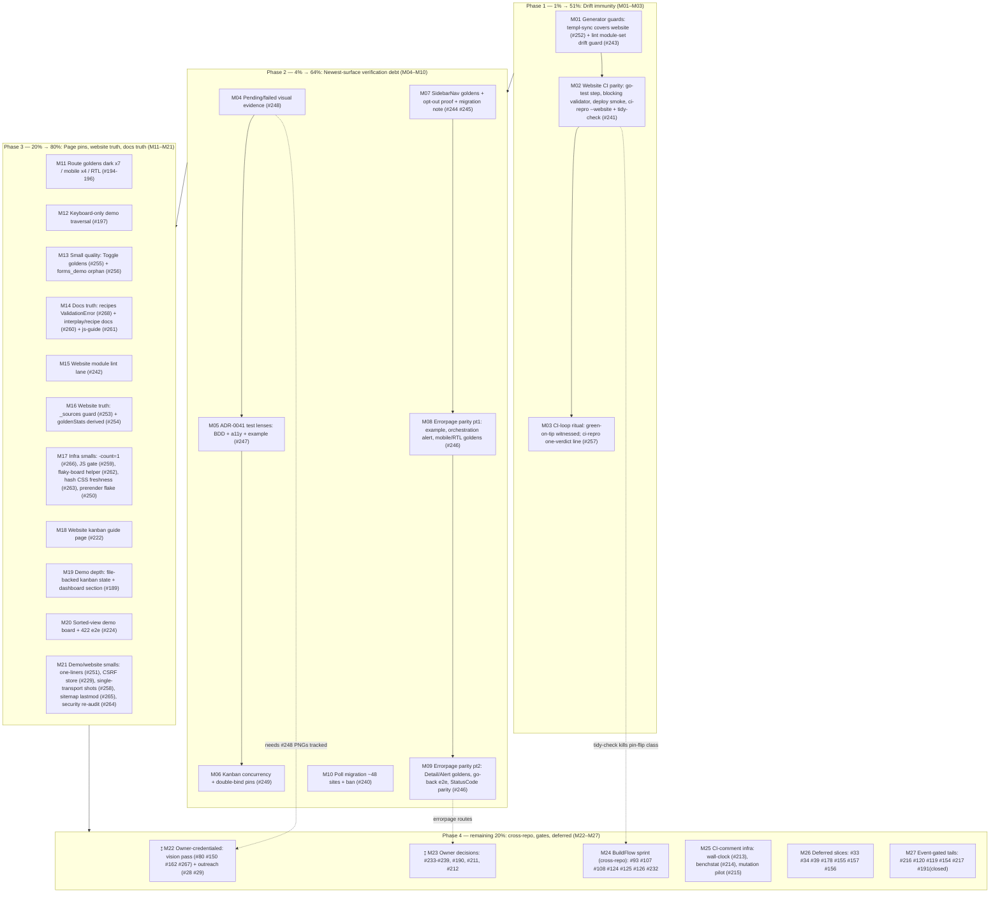

# Drift-Immunity-First Pareto Master Plan (2026-09-17 20:39)

**Scope:** ALL open TODO_LIST items (74 distinct IDs: #28–#268 + #119-note) organized by Pareto
tiers, split into **27 medium tasks (30–100 min)** and **112 micro-tasks (≤12 min each)**.
Point-in-time snapshot; `TODO_LIST.md` stays the living source. Every TODO ID is covered by a
task or an explicit by-design exclusion — see the coverage matrix in §6.

**Input sources:** `TODO_LIST.md` (74 IDs enumerated 2026-09-17 20:39) ·
`docs/status/2026-09-17_20-17_docs-health-full-audit-status.md` (this evening's audit + 2 CI
incidents) · `docs/planning/2026-09-17_18-20_ERRORPAGE-VISUAL-PARITY-PARETO-PLAN.md` (unexecuted
successor plan — absorbed as M08/M09) · `docs/planning/TEMPLATE.md` gate structure.

**Override note:** skill default is a styled HTML report; the owner explicitly requested `.md`
with a mermaid/d2 graph — honored (same override as the 06:00 plan). Micro-task cap tightened
15 min → **12 min** per owner instruction.

**State of the world (verified 20:39):** `utils.Version` = 1.18.0 (v1.18.0 shipped 2026-09-17,
`511d3ed6`, 7 signed tags, proxy-resolved) · `[Unreleased]` warm (ADR-0041 optimistic kanban,
errorpage Trace, sidebar tokens, recipe screens, drift fixes) · CI GREEN on the pushed tip
(run `35258361824` 18:21 success — the evening's golines + website-pin repairs are CI-proven) ·
tree clean except a live concurrent session's 3 files (AGENTS/CHANGELOG/transport-wiring —
respected, not mine) · all 7 modules test-green · 250 HTML goldens + 133 visual goldens, all
count-drift guards green.

---

## 1. Pareto Breakdown

### The 1% that delivers 51% — DRIFT IMMUNITY: MAKE MASTER UNBREAKABLE

Four daemon incidents in one day (mid-release race `c38aec01`, torn snapshots, 2× website
`go.mod` pin flip + 1× generated-import flip) cost more wall-clock than any feature on this
board, and every incident later multiplies the cost of every other task (broken base →
untrustworthy greens → re-verification loops). The 16:28 flip was **invisible to every guard**
because the sync guard doesn't watch `website/`, and the CI lint lane masked failures for 3 runs
last session. Two small guards + one CI lane (≈3h total) convert the highest-frequency
failure class into a <50ms pre-commit catch. Nothing else on this list changes the daily
success rate of everything else.

**→ M01 (guard the generators) + M02 (website CI parity incl. tidy-check) + M03 (close the
CI loop as ritual: green-on-tip witnessed before any push).**

### The 4% that delivers 64% — CLOSE THE VERIFICATION DEBT ON THE NEWEST SURFACES

ADR-0041 (kanban optimistic), the theme-adaptive sidebar, and the ErrorPage redesign are the
three newest user-visible features — and each shipped with named verification gaps (no pending
visual evidence, no component goldens for the sidebar, no mobile/RTL/Detail/Alert goldens for
errorpage, ~48 raw `chromedp.Poll` sites still writable-mistake). This is the 64% because these
surfaces are what consumers touch first and what the next release advertises; their gaps are
the most likely next regressions (the sidebar bug lived 2+ months behind exactly this kind of
gap). **→ M04–M10.**

### The 20% that delivers 80% — PAGE-LEVEL PINS, WEBSITE TRUTH, DOCS-TRUTH, SMALL QUALITY

Route-golden matrix (dark/mobile/RTL — the demo is the sales surface), the website module's own
truth (lint lane, `_sources` guard, derived counts), the docs-truth pack (recipes vs
`forms.ValidationError`, pending-register docs), and the pile of ≤30-min quality items
(Toggle goldens, forms_demo orphan, ci-repro verdict, JS gate, flaky-board helper, hash-based
CSS freshness). Individually small; together they retire ~20 open IDs. **→ M11–M21.**

### The remaining 20% to reach 100% — CROSS-REPO, GATES, DEFERRED, EVENT-GATED

BuildFlow sprint (7 upstream items), CI-comment infrastructure (needs artifact storage),
deferred v1.0/v2.0 slices (Validate scoping, testutil, ADRs 0023/wire-triggers, Wire-candidate
demand checks), and every ⫱ owner gate + event-gated item. Planned to the gate edge; execution
waits on the owner or the trigger. **→ M22–M27.**

---

## 2. Execution Graph

⫱ = owner gate. Dashed arrows: cross-phase dependencies.

---

## 3. Comprehensive Plan — 27 medium tasks (30–100 min), importance/impact/effort ordered

| M   | Task                                                                 | TODO #s                          | Min | Phase | Why here (impact)                                                        |
| --- | -------------------------------------------------------------------- | -------------------------------- | --- | ----- | ------------------------------------------------------------------------ |
| M01 | Generator guards: templ-sync covers website + lint module-set drift guard + continue-on-error CI lint loop | #252 #243                        | 60  | 1%    | Kills the two guard gaps that shipped today's reds                       |
| M02 | Website CI parity: `go test` step, html-validate blocking (or Go validator), post-deploy smoke, `ci-repro --website` lane with tidy-check | #241                             | 100 | 1%    | The website workflow has no local reproduction; the pin flip becomes mechanical catch |
| M03 | CI-loop ritual + ci-repro explicit verdict line + exit code          | #257 (+18-09 f4 carry)           | 30  | 1%    | "Green locally" must name its lanes; verdicts must survive tail churn    |
| M04 | Kanban pending/failed visual evidence: track PNGs + generating visualtest golden (stall endpoint → WaitSelector → screenshot) | #248                             | 45  | 4%    | Humans haven't SEEN ADR-0041's states; PNGs already exist untracked      |
| M05 | ADR-0041 test lenses: `kanban_bdd_test.go` specs, `kanban_a11y_test.go` alert/aria-busy assertions, `ExampleKanbanBoard_optimistic` | #247                             | 60  | 4%    | Per-component checklist conventions empty for the newest feature         |
| M06 | Kanban concurrency: overlapping move success-then-fail no-op, double-failure revert, announce-interval leak, singleton double-bind pin | #249                             | 60  | 4%    | ADR documents races as reasoning only — pin them                         |
| M07 | SidebarNav: component pixel goldens (light/dark/sections), browser-proof of permanently-dark opt-out, `docs/migration/` note, opt-out snippet dedupe | #244 #245                        | 75  | 4%    | Closes the exact blind spot that hid the sidebar bug for 2+ months       |
| M08 | Errorpage parity pt1: refresh `ExampleErrorPage`, orchestration ErrorAlert demo + 6/6 family-matrix golden, mobile 375px + RTL ErrorPage goldens | #246                             | 90  | 4%    | Absorbs the 18:20 plan's M01/M02/M06 heads; 2026-09-17 redesign gaps     |
| M09 | Errorpage parity pt2: ErrorDetail/ErrorAlert goldens, go-back browser e2e, `FromError` StatusCode parity, handler HTML goldens | #246 (+18:20 plan M07–M10)       | 100 | 4%    | Completes the redesign's verification matrix                             |
| M10 | Poll migration: ~48 raw `chromedp.Poll` sites → helpers (4 file batches), then forbidigo ban/convention | #240                             | 100 | 4%    | The bool-into-string mistake is still writable in 8 files                |
| M11 | Route goldens: dark ×7, 375px mobile ×4, RTL — `nix run .#visual` capture session | #194 #195 #196                   | 100 | 20%   | Demo = sales surface; pixels pin what the sweep only asserts             |
| M12 | Keyboard-only demo traversal audit (Tab-order UX, focus visibility)  | #197                             | 60  | 20%   | Residue of #175; axe covers DOM, not focus order                         |
| M13 | Small quality pack: Toggle pixel goldens + delete/consolidate orphaned `forms_demo.templ` | #255 #256                        | 45  | 20%   | Two flagged-since-July gaps, each tiny                                   |
| M14 | Docs-truth pack: server-side-validation recipe → `forms.ValidationError`; transport-wiring GlobalErrorHandling+revert interplay; recipe pending-register + corner note; javascript-guide kanban worked example | #268 #260 #261                   | 60  | 20%   | 3 drifts of the class that shipped for "unknown weeks" (#230 lesson)     |
| M15 | Website module CI lint lane + fix findings                           | #242                             | 60  | 20%   | Last unlinted Go module (same shape that hid visualtest's 21 findings)   |
| M16 | Website truth: `check-tc-sources-sync.sh` guard + pre-commit wiring + hook guard test; derive `goldenStats` from `build.CountStats` | #253 #254                        | 75  | 20%   | Two manual-sync incidents + the 58-enum literal already bit              |
| M17 | Infra smalls: `-count=1` guard convention, node --check JS gate, flaky-board reusable helper, hash-based CSS freshness, prerender flake fix | #266 #259 #262 #263 #250         | 100 | 20%   | Five ≤30-min infra items that each removed a class of false signal       |
| M18 | Website kanban consumer guide page (seed from recipe; CSP re-hash + site goldens + counts) | #222                             | 90  | 20%   | Site has zero kanban docs; highest-leverage consumer-facing doc          |
| M19 | Demo depth: file-backed kanban state + Dashboard-recipe kanban section | #189                             | 90  | 20%   | Demo boards reset on restart; dashboard recipe lacks its kanban section  |
| M20 | Sorted-view demo board + 422-rejection e2e                           | #224                             | 90  | 20%   | Contract documented but never demoed/browser-proven                      |
| M21 | Demo/website smalls: optimistic one-liners in README+site, session CSRF store (⫱conditional), `?transport=` single-view screenshots, sitemap lastmod, demo security re-audit post-#236 | #251 #229 #258 #265 #264         | 90  | 20%   | Sales-surface accuracy + five small tails                                |
| M22 | ⫱ Owner-credentialed: vision pass over flagged set + human SUSPECT confirm; awesome-templ PR + templ.guide listing (one sitting) | #80 #150 #162 #267 #28 #29       | 60  | rem.  | Needs Lars' API key + Lars' GitHub account; everything staged            |
| M23 | ⫱ Owner decisions (planned to the gate edge): flake.lock nudge, recipes-guard vs manual, npm pin policy, errorpage demo routes, chrome default, kanban retry, pending hatch, touch-drag, CSS artifacts, annotation policy | #233–#239 #190 #211 #212         | 60  | rem.  | Ten decisions; each has a prepared recommendation in TODO_LIST            |
| M24 | BuildFlow sprint (cross-repo `larsartmann/buildflow`): honest messages, jsonv2 preflight, eslint scoping, templ-gitignore, CSS un-minify, commit classifier, daemon commit-gate/release-lock | #93 #107 #108 #124 #125 #126 #232 | 100 | rem.  | 7 upstream items; today's 4 incidents are the argument                   |
| M25 | CI-comment infra: PR wall-clock budget, benchstat comment, gremlins mutation baseline | #213 #214 #215                   | 100 | rem.  | Needs master-artifact storage first; runbooks written in TODO_LIST       |
| M26 | Deferred slices: `Validate()` scoping pass, testutil migration slice 1, compound-overlay ADR-0023 progress, typed wire-trigger ADR (#178), Calendar/SimpleNav Wire demand checks, consumer-survey offers | #33 #34 #39 #178 #155 #157 #156  | 100 | rem.  | v1.0/v2.0 deferred; demand-gated per D3 rule                             |
| M27 | Event-gated tails: vnu re-triage on bump, CSS false-negative reopen-only, bun shim removal, prerender wire-view sync, demand re-check cadence, #191 recorded-closed | #216 #120 #119-note #154 #217 #191 | 40  | rem.  | Trigger-gated; listed so nothing is silently forgotten                   |

Sum: ~2,205 min ≈ 36.8h across 27 tasks.

---

## 4. Detailed Breakdown — micro-tasks (≤12 min each, ALL TODOs covered)

### Phase 1 — 1% (M01–M03)

| #    | Task                                                                                               | M   | Min |
| ---- | -------------------------------------------------------------------------------------------------- | --- | --- |
| 1.1  | Extend `TestTemplGeneratedInSync`/`check-templ-sync.sh` to walk `website/**_templ.go` import-vs-source | M01 | 12  |
| 1.2  | Prove the guard fires: re-flip `base_templ.go` import, watch red, restore                           | M01 | 12  |
| 1.3  | Add `scripts/check-lint-modules.sh` (ci.yaml Lint module set == ci-repro.sh set) + pre-commit wiring | M01 | 12  |
| 1.4  | Rework ci.yaml Lint loop: continue-on-error per module + aggregate summary step                      | M01 | 12  |
| 1.5  | Prove both new guards: break one input each, watch red, restore                                     | M01 | 12  |
| 1.6  | CHANGELOG `[Unreleased]` + AGENTS guard bullets + counts bump in same edit                          | M01 | 12  |
| 1.7  | website.yml: add `go test ./...` step (GOEXPERIMENT=jsonv2, GOWORK=off)                              | M02 | 12  |
| 1.8  | website.yml: flip html-validate to blocking OR write the Go validator replacement (decision from #241 evidence) | M02 | 12  |
| 1.9  | website.yml: post-deploy smoke step (fetch site URL + demo `/health`)                               | M02 | 12  |
| 1.10 | ci-repro.sh: `--website` lane (npm install pair + build.sh + html-validate + website tests + tidy-check) | M02 | 12  |
| 1.11 | Tidy-check inside the lane: `go mod tidy && git diff --exit-code website/go.mod`                    | M02 | 12  |
| 1.12 | Run the lane locally end-to-end; fix findings; record runtime                                        | M02 | 12  |
| 1.13 | ci-repro.sh: `tee` verdict line + exit code to stdout; `--quiet-diff` flag                           | M03 | 12  |
| 1.14 | Ritual note in AGENTS: push only after green-on-tip witnessed (name the run ID)                      | M03 | 12  |
| 1.15 | Full phase-1 verify: per-module loop + ci-repro --lint + the new --website lane                      | M03 | 12  |

### Phase 2 — 4% (M04–M10)

| #    | Task                                                                                                | M   | Min |
| ---- | --------------------------------------------------------------------------------------------------- | --- | --- |
| 2.1  | Inspect the untracked `kanban/pending_state.png`/`failed_state.png`; confirm capture method + eyeball | M04 | 12  |
| 2.2  | Write `TestKanbanPendingStateGoldens` (stall endpoint via flaky boards, WaitSelector `.tc-kanban-pending`, screenshot) | M04 | 12  |
| 2.3  | Capture failed-flash state (500 endpoint → `.tc-kanban-move-failed` within 4s window)                 | M04 | 12  |
| 2.4  | Track PNGs + counts bump (133→135) in FEATURES/README/ROADMAP same edit; guards green                 | M04 | 12  |
| 2.5  | `kanban_bdd_test.go`: specs "move looks instant" / "pending visible until confirmed" / "failure restores" | M05 | 12  |
| 2.6  | `kanban_a11y_test.go`: `role="alert"` region + `aria-busy` mid-move assertions                       | M05 | 12  |
| 2.7  | `ExampleKanbanBoard_optimistic` compiling example + godoc                                            | M05 | 12  |
| 2.8  | Concurrency test: two overlapping moves (first succeeds, second fails → no-op pin)                    | M06 | 12  |
| 2.9  | Concurrency test: two overlapping failures (both revert, both announced)                              | M06 | 12  |
| 2.10 | Announce-interval leak check under rapid-fire submits + listener double-bind pin                      | M06 | 12  |
| 2.11 | SidebarNav golden: light (component-level, not AppShell-incidental)                                   | M07 | 12  |
| 2.12 | SidebarNav goldens: dark (pixel-identical assertion) + sections variant                               | M07 | 12  |
| 2.13 | Browser-proof opt-out: render AppShell+SidebarNav with classic-dark `--tc-sidebar-*` block, pin golden | M07 | 12  |
| 2.14 | `docs/migration/sidebar-theme-adaptive.md` note; dedupe opt-out snippet (custom.css canonical, ADR-0011/CHANGELOG point at it) | M07 | 12  |
| 2.15 | `ExampleErrorPage` refresh to full model (chips, accent bar, Trace)                                   | M08 | 12  |
| 2.16 | Demo: orchestration ErrorAlert variant; family-matrix golden 6/6                                      | M08 | 12  |
| 2.17 | ErrorPage mobile 375px golden (chip-row flex-wrap path)                                               | M08 | 12  |
| 2.18 | ErrorPage RTL golden (chip row, footer mirroring)                                                     | M08 | 12  |
| 2.19 | ErrorDetail + ErrorAlert pixel goldens (light+dark)                                                   | M09 | 12  |
| 2.20 | Go-back button browser e2e (`history.back()` after nav)                                               | M09 | 12  |
| 2.21 | `FromError` sets `StatusCode` via `FamilyStatusCode` + test                                           | M09 | 12  |
| 2.22 | Handler HTML goldens (`WriteError`/`HTMLShell`) + counts bump                                         | M09 | 12  |
| 2.23 | Poll migration batch 1: `kanban_e2e_test.go` (~12 sites)                                              | M10 | 12  |
| 2.24 | Poll migration batch 2: `wire_forms_pack_e2e_test.go` (~10 sites)                                     | M10 | 12  |
| 2.25 | Poll migration batch 3: `wire_e2e_test.go` + `wire_form_e2e_test.go`                                  | M10 | 12  |
| 2.26 | Poll migration batch 4: datastar_runtime + datastar_synthetics + loading_button + polled_region        | M10 | 12  |
| 2.27 | Ban raw `chromedp.Poll` (forbidigo rule or AGENTS convention line); full visual suite green           | M10 | 12  |

### Phase 3 — 20% (M11–M21)

| #    | Task                                                                                                  | M    | Min |
| ---- | ----------------------------------------------------------------------------------------------------- | ---- | --- |
| 3.1  | Route goldens dark: index + forms + users (pin theme via localStorage per the 09-14 lesson)            | M11  | 12  |
| 3.2  | Route goldens dark: wire + kanban + errorpage routes                                                   | M11  | 12  |
| 3.3  | Route goldens dark: recipes ×4 + eyeball all dark captures                                             | M11  | 12  |
| 3.4  | Route goldens mobile 375px: 4 swept routes                                                             | M11  | 12  |
| 3.5  | Route goldens RTL: swept routes (`dir="rtl"` capture support check)                                    | M11  | 12  |
| 3.6  | Keyboard-only traversal audit script/run: Tab order + focus visibility on index + forms                | M12  | 12  |
| 3.7  | Keyboard traversal: wire + kanban + recipes routes; file findings as issues/fixes                      | M12  | 12  |
| 3.8  | Toggle pixel goldens (light+dark) + counts bump                                                        | M13  | 12  |
| 3.9  | Delete or consolidate `forms_demo.templ` (grep consumers, remove, regen, goldens green)                | M13  | 12  |
| 3.10 | `server-side-validation.md`: swap example to `forms.ValidationError` (+ ValidationSummary wiring)       | M14  | 12  |
| 3.11 | transport-wiring.md: GlobalErrorHandling + inline revert interplay paragraph                           | M14  | 12  |
| 3.12 | `kanban-card-anatomy.md`: pending-register section + top-right-corner reservation note                  | M14  | 12  |
| 3.13 | `javascript-guide.md`: decision ladder worked example = kanban register                                 | M14  | 12  |
| 3.14 | website.yml: lint lane `(cd website && golangci-lint run ./...)`; run locally, fix findings            | M15  | 12  |
| 3.15 | ci-repro: include website lint in the module loop + module-set guard update (#243 tie)                  | M15  | 12  |
| 3.16 | `scripts/check-tc-sources-sync.sh`: diff `_sources/**.templ` vs library twins                           | M16  | 12  |
| 3.17 | Wire guard into pre-commit set + `TestPreCommitHookInstallsGuard` + auto-fix flag                       | M16  | 12  |
| 3.18 | `goldenStats` → computed from `build.CountStats` in pages golden test; delete the 123/105/60/7 literals  | M16  | 12  |
| 3.19 | AGENTS convention line: `-count=1` for file-reading guard tests; apply to the 3 guards that read outside-package files | M17 | 12 |
| 3.20 | JS syntax gate: `node --check` over emitted component scripts as a test/CI step (node presence check)   | M17  | 12  |
| 3.21 | Extract flaky-board helper (`newFlakyBoardPair`) in visualtest; refactor kanban e2e onto it             | M17  | 12  |
| 3.22 | Hash-based `TestCSSFreshness` (content hash vs mtime)                                                   | M17  | 12  |
| 3.23 | `TestPrerenderMatchesLiveServer`: pin clock/retry to kill the minute-boundary flake                     | M17  | 12  |
| 3.24 | Website kanban guide page: content seed from `kanban-card-anatomy.md` (H2 structure, code blocks)       | M18  | 12  |
| 3.25 | Website kanban page: nav entry, PageMeta, goldens, CSP re-hash (`--update-csp`), counts                 | M18  | 12  |
| 3.26 | #189a: file-backed kanban demo state (JSON persistence, reset-on-restart semantics)                     | M19  | 12  |
| 3.27 | #189b: Dashboard-recipe kanban section wired to the file-backed state                                   | M19  | 12  |
| 3.28 | #224a: sorted-view demo board (server-sorted fixture + `ParseKanbanMove` 422 path)                      | M20  | 12  |
| 3.29 | #224b: e2e for the 422 rejection (both transports) + goldens if visible                                 | M20  | 12  |
| 3.30 | README + website `KanbanBoard` one-liners: optimistic pending register                                  | M21  | 12  |
| 3.31 | `?transport=datastar`/`htmx` single-view screenshots of the kanban section (#258)                       | M21  | 12  |
| 3.32 | Sitemap `lastmod` audit + fix if build-stamped (#265)                                                   | M21  | 12  |
| 3.33 | Demo security re-audit: HTTP-contract tests for new/changed demo endpoints (#264)                       | M21  | 12  |
| 3.34 | #229 (⫱conditional): session-scoped CSRF store IF owner wants the security-modeling upgrade             | M21  | 12  |
| 3.35 | Phase-3 verify: full visual suite + axe sweep + counts + CHANGELOG warm                                 | M21  | 12  |

### Phase 4 — remaining (M22–M27)

| #    | Task                                                                                                                       | M    | Min |
| ---- | -------------------------------------------------------------------------------------------------------------------------- | ---- | --- |
| 4.1  | ⫱ Export API key; run `scripts/vision-review-goldens.sh` (incl. kanban action/tone + pending captures)                      | M22  | 12  |
| 4.2  | ⫱ Human-confirm SUSPECT verdicts; prune/act per ledger policy (#80/#150/#162/#267 closure)                                   | M22  | 12  |
| 4.3  | ⫱ awesome-templ: fork, add under Resources/Components, open PR (#28)                                                        | M22  | 12  |
| 4.4  | ⫱ templ.guide directory listing submission (#29)                                                                             | M22  | 12  |
| 4.5  | ⫱ #233 flake.lock nudge: keep-or-revert (+re-lock +shell verify if revert)                                                   | M23  | 12  |
| 4.6  | ⫱ #234 recipes-guard: pick CI-guard-with-allowlist vs manual sweep (recommendation: guard, ~1-2h, then 1.3-pattern wiring)   | M23  | 12  |
| 4.7  | ⫱ #235 npm tailwind pin policy for website.yml (floating vs pinned; Dockerfile precedent = floating)                        | M23  | 12  |
| 4.8  | ⫱ #236 errorpage demo: bordered boxes vs standalone `/errors/*` routes (18:20 plan M03 ready to execute on yes)              | M23  | 12  |
| 4.9  | ⫱ #237 chrome default: adaptive (shipped) vs classic-dark ratification                                                      | M23  | 12  |
| 4.10 | ⫱ #238 kanban failure UX: auto-retry-once vs honest revert ( ROADMAP polish rows ready)                                      | M23  | 12  |
| 4.11 | ⫱ #239 pending-timeout escape hatch: decide API shape or reject                                                              | M23  | 12  |
| 4.12 | ⫱ #190 touch-drag: whole-card click actions prerequisite check; vibe-handle pattern if revived                               | M23  | 12  |
| 4.13 | ⫱ #211 `templates/styles.css` + theme `.out.css`: delete (recommended) vs document consumer story                           | M23  | 12  |
| 4.14 | ⫱ #212 annotation policy: option (a)/(b)/(c) for the ~2.1k name-keyed residue                                               | M23  | 12  |
| 4.15 | #93 BuildFlow: honest commit messages (diff-stat templates) — upstream PR draft                                             | M24  | 12  |
| 4.16 | #107 preflight jsonv2 scan fix (workspace-aware) — upstream PR draft                                                        | M24  | 12  |
| 4.17 | #108 eslint-fix scoping + #124 templ-gitignore re-append — upstream PR drafts                                                | M24  | 12  |
| 4.18 | #125 CSS un-minify provider flag + #126 commit classifier — upstream PR drafts                                               | M24  | 12  |
| 4.19 | #232 daemon commit-gate: per-module build gate + release-lock + torn-snapshot tripwire — design doc + PR                     | M24  | 12  |
| 4.20 | #213 wall-clock: master artifact writer job (runbook in TODO_LIST)                                                           | M25  | 12  |
| 4.21 | #213 PR diff+comment job (>+20% gate)                                                                                        | M25  | 12  |
| 4.22 | #214 benchstat: `bench.old` storage + PR comment job                                                                          | M25  | 12  |
| 4.23 | #215 gremlins install (pinned) + first run on utils; record kill rate                                                        | M25  | 12  |
| 4.24 | #215 runs 2-3 (variance) + `docs/testing/mutation-baseline.md`                                                               | M25  | 12  |
| 4.25 | #33 `Validate()` scoping: enumerate props with representable invalid states; implement the shortlist                         | M26  | 12  |
| 4.26 | #34 testutil slice 1: codemod `utils.Render`/assert helpers → `internal/testutil` (one package as pilot)                     | M26  | 12  |
| 4.27 | #39 ADR-0023 progress: Trigger/Content/Close sketch against Modal/Drawer                                                     | M26  | 12  |
| 4.28 | #178 typed wire-trigger ADR draft (htmx every/revealed vs data-on-interval/intersect)                                        | M26  | 12  |
| 4.29 | #155/#157 Wire-candidate demand checks (SimpleNav links, Calendar month-nav) per D3 rule                                     | M26  | 12  |
| 4.30 | #156 consumer offers: cqrs-htmx Breakpoint/MobileNav note + nsfw-classifier v1.18 upgrade note (owner sends)                 | M26  | 12  |
| 4.31 | #216 (event) vnu ignore re-triage procedure runbook re-verified                                                              | M27  | 12  |
| 4.32 | #120 reopen-only note check + #154 prerender sync check (5-min each, paired)                                                 | M27  | 12  |
| 4.33 | #119-note bun shim removal (user-level; document alternative if not removed)                                                 | M27  | 12  |
| 4.34 | #217 demand re-check cadence: calendar the next-survey trigger; #191 stays closed (recorded)                                 | M27  | 12  |
| 4.35 | Whole-plan verify: per-module loop, ci-repro --lint --website, visual suite, CHANGELOG/counts green                          | M27  | 12  |

Totals: **112 micro-tasks**; every one ≤12 min.

---

## 5. Verschlimmbesserung guards (do-NOT list)

1. **No new runtime dependencies** — budget stays closed (templ, tailwind-merge-go, go-error-family; go-datastar/static stays datastar-module-only). Gremlins is dev/CI-only via `go install` pin.
2. **No breaking API changes** — everything here is additive or test/guard/docs; `FromError` StatusCode parity must not change behavior for errors that already set StatusCode explicitly (source report g3 note).
3. **Owner gates stay gates** — M22/M23 items are prepared-to-the-edge, never executed past the gate without Lars (vision key, GitHub account, ten decisions).
4. **Goldens AFTER e2e for JS pipelines** (18-10 lesson d2); counts bump in the same edit as any golden/enum/component change (guards enforce).
5. **Do not re-litigate** ADR-0040 (no module extraction), #191 (decided 2026-09-16), ADR-0033 (no Web Components), #217 (demand gate).
6. **Wired ⇒ e2e:** any task that renders `wire.Action`/`hx-*`/`data-on:*` carries its chromedp task in this plan (M05/M06/M20/M28 sections) or a written waiver.
7. **Demo smoke is a gate:** any demo endpoint/markup change (M19/M20/M21) runs `visualtest/tools/smoke` before "done".
8. **Respect foreign worktrees:** a concurrent session is live (AGENTS/CHANGELOG/transport-wiring modified at 20:39) — commit only files this plan owns; never `git add -A`.

---

## 6. Coverage matrix — every TODO ID → task (74 IDs)

| IDs | Task |
| --- | --- |
| #28 #29 | M22 (4.3–4.4) |
| #33 #34 #39 | M26 (4.25–4.27) |
| #80 #150 #162 #267 | M22 (4.1–4.2) |
| #93 #107 #108 #124 #125 #126 #232 | M24 (4.15–4.19) |
| #119-note #120 #154 | M27 (4.32–4.33) |
| #155 #156 #157 #178 | M26 (4.28–4.30) |
| #189 | M19 (3.26–3.27) |
| #190 #191 | M23 (4.12) / recorded-closed (4.34) |
| #194 #195 #196 | M11 (3.1–3.5) |
| #197 | M12 (3.6–3.7) |
| #211 #212 | M23 (4.13–4.14) |
| #213 #214 #215 | M25 (4.20–4.24) |
| #216 #217 | M27 (4.31, 4.34) |
| #222 | M18 (3.24–3.25) |
| #224 | M20 (3.28–3.29) |
| #229 | M21 (3.34, ⫱conditional) |
| #233–#239 | M23 (4.5–4.11) |
| #240 | M10 (2.23–2.27) |
| #241 | M02 (1.7–1.12) |
| #242 | M15 (3.14–3.15) |
| #243 | M01 (1.3–1.4) |
| #244 #245 | M07 (2.11–2.14) |
| #246 | M08/M09 (2.15–2.22) |
| #247 | M05 (2.5–2.7) |
| #248 | M04 (2.1–2.4) |
| #249 | M06 (2.8–2.10) |
| #250 | M17 (3.23) |
| #251 | M21 (3.30) |
| #252 | M01 (1.1–1.2) |
| #253 | M16 (3.16–3.17) |
| #254 | M16 (3.18) |
| #255 | M13 (3.8) |
| #256 | M13 (3.9) |
| #257 | M03 (1.13) |
| #258 | M21 (3.31) |
| #259 | M17 (3.20) |
| #260 | M14 (3.11–3.12) |
| #261 | M14 (3.13) |
| #262 | M17 (3.21) |
| #263 | M17 (3.22) |
| #264 | M21 (3.33) |
| #265 | M21 (3.32) |
| #266 | M17 (3.19) |
| #267 | M22 (4.1, with the vision set) |
| #268 | M14 (3.10) |

**Zero uncovered IDs.**

---

## 7. Verification (whole plan)

- [ ] Per-module loop green: `for mod in utils icons errorpage charts/echarts datastar htmx; do (cd "$mod" && GOWORK=off go test ./...); done`
- [ ] Root build+test + lint via `scripts/ci-repro.sh --lint` (CI step-for-step, incl. the new visualtest/website lanes)
- [ ] `scripts/ci-repro.sh --website` lane green (tidy-check proves the pin)
- [ ] Full `nix run .#visual` (axe sweep + all new goldens); counts bumped in the same edits (`TestDocsCountDrift`, `TestFeaturesEnum*`)
- [ ] Demo smoke over changed endpoints (`visualtest/tools/smoke`)
- [ ] CHANGELOG `[Unreleased]` warm throughout; CI green-on-tip witnessed before any push

## 8. Deferred / follow-through seeds

- #248 ownership question (untracked PNGs from a concurrent session) — resolve before M04; if the owning session is live, M04 coordinates instead of duplicating.
- #236 "yes" triggers the 18:20 plan's full M03 (+M04 docs/guard housekeeping) — that plan stays the execution detail; this plan only carries the gate.
- vision-review SUSPECT confirmations may spawn small fix tasks — harvest to TODO_LIST with IDs ≥269 at that time.
- If M01's website sync guard finds pre-existing drift on other modules, fix forward immediately (same edit, no new ID).
