# Pareto Execution Plan — Sales-Page Hardening & Site Quality

**Created:** 2026-09-19 15:36 CEST
**Source:** `docs/status/2026-09-19_15-10_website-sales-page-session-status.md` section (f) — all 34 items + the 3 open questions, nothing dropped.
**Goal state:** the `/sales` page is live, provably safe, claim-honest, regression-protected, discoverable — and the site around it inherits the fixes.
**Prime directive:** do not verschlimmbesser. Every task below ends with the repo verifiably no worse than before it (build + tests + lint green, goldens regenerated in the same commit as the change that invalidates them, M03 witness-before-push).

---

## 0. Current baseline (what "done so far" means)

- `/sales` shipped and committed (daemon chunks `1e4089ef`..`d2614027`); website suite, lint, CSP guard, vnu, visual smoke all green at tip `fe420d03`.
- Not yet done: push-witness ritual for the docs commits, deployed-state verification, automated a11y/visual coverage for site routes, claim derivation, discoverability decisions.
- 3 decision gates need Lars (Q1 distribution, Q2 squash, Q3 machinery level) — they steer 10 of the 26 tasks but block none of the 1% tier.

## 1. Pareto breakdown

| Tier         | Share of tasks                         | Cumulative result | Tasks (IDs from §3)                                                                                                                                                                                                   | Rationale                                                                                                                                               |
| ------------ | -------------------------------------- | ----------------- | --------------------------------------------------------------------------------------------------------------------------------------------------------------------------------------------------------------------- | ------------------------------------------------------------------------------------------------------------------------------------------------------- |
| **1%**       | T2, T3 (2 of 26)                       | **51%**           | Tip witness + push; deployed-state verification                                                                                                                                                                       | An unpushed, unverified page delivers zero. Green-on-tip + live URL + correct CSP is the difference between "works on my machine" and "shipped".        |
| **4%**       | + T4, T5, T6 (5 of 26)                 | **64%**           | Claim derivation; no-framework assertion; social proof + evidence links                                                                                                                                               | The page's entire argument is "typed, tested, honest". Hand-typed claims and unlinked assertions undercut it. Cheapest credibility multiplier there is. |
| **20%**      | + T7, T8, T9, T10, T12, T13 (11 of 26) | **80%**           | Route goldens; site a11y sweep; HTML validation in CI; header nav; OG image; README/anchors/FAQ                                                                                                                       | The regression net (goldens, axe, vnu) protects everything already built; nav/OG/README make the page findable and shareable.                           |
| **Last 20%** | T1, T11, T14–T26 (15 of 26)            | **100%**          | Decision gates, search index, structural page-count, CopyButton e2e, tint tuning, script audit, lastmod+convention, Lighthouse, lint cleanups, upstream Scrollback idea, recipe doc, animate variant, squash, harvest | Real value, but each item alone moves the needle marginally. Several are gated on the decision gates.                                                   |

Reading: do T2/T3 first (or literally now), then T4–T6, then the net+discoverability block — that sequence captures 80% of the outcome with under half the task list.

## 2. Decision gates (user input required, none block Tier 1)

| Gate   | Question                                                                                                 | Unblocks                               |
| ------ | -------------------------------------------------------------------------------------------------------- | -------------------------------------- |
| **G1** | Distribution plan for `/sales` (README? social? nothing?)                                                | T10 nav, T12 OG, T11 search, T20 stars |
| **G2** | Squash the 5 daemon heuristic commits? (daemon-race risk accepted?)                                      | T24                                    |
| **G3** | Marketing-page machinery level: derive claims + site a11y goldens + no-framework assert — or keep light? | T4, T5, T7, T8 scope                   |

### Gate decisions (annotated 2026-09-19, execution session)

Decided autonomously under blanket "execute the whole plan" approval from Lars; recorded here per rule 7 (annotate, never rewrite).

- **G1 → README + in-site nav, no social.** `/sales` gets a header-nav entry (T10), an OG image (T12), a README link row entry (T13), and the stars badge (T20/T6). No social posting from this session (out of scope for automation); the OG image makes any future manual share work well.
- **G2 → DECLINED.** No history rewrite. Force-pushing master requires explicit per-action approval (AGENTS safety tier); the daemon commits are harmless noise once pushed, and the daemon races make a squash a losing bet. T23 becomes "record decision, skip".
- **G3 → FULL machinery.** Claims are derived from source (T4), the no-framework assertion ships (T5), site routes get theme-pinned goldens (T7) and the axe/touch-target/zoom-reflow sweep (T8). Rationale: the page's entire argument is honesty and safety; light-scope would leave the two credibility claims hand-typed.

## 3. Level-1 plan (tasks of 30–100 min, ≤27 tasks, ALL todos covered)

Sorted by importance/impact/effort/customer-value. "Items" = status-report §f item numbers.

| ID  | Task                                                                                                                                                                          | Items          | Tier | Min | Depends on                |
| --- | ----------------------------------------------------------------------------------------------------------------------------------------------------------------------------- | -------------- | ---- | --- | ------------------------- |
| T2  | **Witness green-on-tip and push**: fetch, `scripts/ci-repro.sh --lint --website`, witness `VERDICT: PASS`, push immediately, watch CI lanes (incl. Website path-filter proof) | 1, 32          | 1%   | 60  | —                         |
| T3  | **Verify deployed state**: `/sales` serves on prod, CSP header matches committed hash, sitemap lists `/sales`, live page passes vnu                                           | 33             | 1%   | 30  | T2                        |
| T4  | **Derive the two hand-typed claims**: "Go 1.26+" from `go.mod`, "v1" from `utils.Version`; wire into hero badge + FAQ; regen + goldens + tests                                | 5              | 4%   | 45  | G3 (scope)                |
| T5  | **No-framework assertion**: integrity test asserts `sales.html` references no framework script (react/vue/alpine/preact and no htmx CDN)                                      | 9              | 4%   | 30  | G3 (scope)                |
| T6  | **Credibility links + social proof**: GitHub-stars badge on sales hero (reuse `StarsLabel`), FAQ "three regression layers" → testing docs, cost answer → LICENSE              | 20, 19, 29     | 4%   | 45  | G1 (stars wanted?)        |
| T7  | **Theme-pinned route goldens for the site**: `/sales` + index, light+dark × desktop+mobile, via a dist-serving harness in `visualtest`                                        | 2              | 20%  | 100 | T2                        |
| T8  | **Site a11y sweep**: extend axe sweep (+ touch-target, zoom-reflow) to built site routes; baseline ledger for documented debt only                                            | 3              | 20%  | 100 | T2                        |
| T9  | **HTML validation gate for the website**: include website goldens in `check-html-valid.sh` and/or vnu step in Website workflow                                                | 4              | 20%  | 45  | —                         |
| T10 | **Header nav placement for `/sales`**: decide per G1, implement, regenerate ALL page goldens in the same commit                                                               | 7              | 20%  | 45  | G1                        |
| T12 | **OG image** `public/og/sales.png` (1200×630) + wire `SalesMeta.OGImage`                                                                                                      | 14             | 20%  | 75  | G1                        |
| T13 | **Discoverability polish**: section anchors (`#problem` `#proof` `#faq`), first FAQ item `Open: true`, README link row                                                        | 16, 15, 21     | 20%  | 45  | G1                        |
| T11 | **Search index scope**: decide docs-search vs site-search; if site-search, add the pitch + FAQ as `SearchDoc`s and fix index assertions                                       | 11             | 100% | 90  | G1                        |
| T6b | **CopyButton browser e2e on the built site**: clipboard click-through assertion (siteshots-smoke style)                                                                       | 10             | 100% | 90  | T7 harness                |
| T14 | **Structural page count**: export the site page-list builder, derive `TestSiteBuildIntegrity` count from it, delete the hand-kept constant                                    | 6              | 100% | 45  | —                         |
| T15 | **Dark-tint tuning**: token-override `Class`es on Card/Accordion/StatCard surfaces for the site's warm dark palette; regen + goldens                                          | 13             | 100% | 45  | T7 (goldens make it safe) |
| T16 | **Per-page script audit**: pages vs `siteScripts` (newsletter.js without a form = dead fetch); trim + test                                                                    | 12             | 100% | 30  | —                         |
| T17 | **Sitemap `lastmod` + content convention**: derive `/sales` lastmod from git; document (or consolidate) data.go vs per-page content tables                                    | 17, 18         | 100% | 45  | —                         |
| T18 | **Lighthouse/perf budget** for landing + sales; record metrics; fix quick wins only                                                                                           | 22             | 100% | 60  | —                         |
| T19 | **Lint cleanups**: gopls writestring (main.go:334/337), QF1002 (docs.templ:197), QF1003 (chart_shared.templ:59), full visualtest module lint                                  | 23, 24, 25, 26 | 100% | 60  | —                         |
| T20 | **Upstream Scrollback `Prompt` idea**: verify against vendored source, check upstream issues, draft issue in Lars's voice (verify-before-filing → github-voice)               | 27             | 100% | 60  | —                         |
| T21 | **Dogfood-marketing recipe doc**: `docs/recipes/dogfood-marketing-page.md` (derived counts + self-render pattern)                                                             | 28             | 100% | 45  | —                         |
| T22 | **`section` padding variant** for denser campaign flows (opt-in, no landing behavior change)                                                                                  | 31             | 100% | 30  | —                         |
| T23 | **Squash daemon commits** (detached worktree per AGENTS pattern, `--force-with-lease`)                                                                                        | 8              | 100% | 60  | G2                        |
| T24 | **HARVEST**: pull accepted items into `TODO_LIST.md`/`ROADMAP.md` via docs-health; annotate this plan                                                                         | —              | 100% | 60  | all decisions             |
| T1  | **Record gate answers** in this file (annotate, never rewrite)                                                                                                                | —              | gate | 30  | Lars                      |

Count: 24 tasks, every one of the 34 status items covered (traceability in §6).

## 4. Level-2 plan (subtasks ≤12 min, ALL todos covered)

| ID   | Subtask                                                                                                              | Min | Parent |
| ---- | -------------------------------------------------------------------------------------------------------------------- | --- | ------ |
| 2.1  | `git fetch` + `git status -sb`; confirm no unexpected daemon commits                                                 | 3   | T2     |
| 2.2  | Run `scripts/ci-repro.sh --lint --website` at exact tip (background, poll)                                           | 45* | T2     |
| 2.3  | Witness printed `VERDICT: PASS (exit 0)`; if new daemon commits appeared, re-run at new tip                          | 3   | T2     |
| 2.4  | `git push` immediately; confirm remote tip                                                                           | 2   | T2     |
| 2.5  | Watch CI lanes (ci.yaml Build&Test+Lint, website.yml) reach green; confirms `website/**` path filter fires (item 32) | 10  | T2     |
| 3.1  | Fetch `https://templcomponents.lars.software/sales` — 200, expected title                                            | 3   | T3     |
| 3.2  | Check deployed CSP header contains the CopyButton hash from `firebase.json`                                          | 5   | T3     |
| 3.3  | Fetch `/sitemap.xml`, assert `/sales` present; fetch `/robots.txt` sanity                                            | 3   | T3     |
| 3.4  | vnu against the live URL (nu validator web API)                                                                      | 8   | T3     |
| 3.5  | Light+dark spot-check of prod URL via siteshots `--dist` pointed at a mirror, or manual browser                      | 10  | T3     |
| 4.1  | Read root `go.mod` go directive; find existing version-derivation helpers                                            | 5   | T4     |
| 4.2  | Add `goVersionForDisplay()`/`libraryVersion()` helpers in `pages` (parse `go.mod`, reuse `utils.Version`)            | 12  | T4     |
| 4.3  | Wire hero badge + FAQ answer to helpers; remove hand-typed strings                                                   | 10  | T4     |
| 4.4  | `templ generate` from repo root (pinned binary)                                                                      | 5   | T4     |
| 4.5  | `go test ./internal/pages -update` (goldens), then full website suite                                                | 10  | T4     |
| 5.1  | Add `TestSalesPageHasNoFrameworkScript` to `main_test.go` (regex over rendered sales.html)                           | 12  | T5     |
| 5.2  | Run suite; confirm green; negative-test the regex against a fake frame                                               | 10  | T5     |
| 6.1  | Add stars badge to sales hero badge row via `StarsLabel` (accepts 0 → "Star on GitHub")                              | 12  | T6     |
| 6.2  | FAQ production-ready answer: link `guides/testing` (or the real testing docs path)                                   | 10  | T6     |
| 6.3  | FAQ cost answer: link LICENSE (repo URL)                                                                             | 5   | T6     |
| 6.4  | Generate + goldens + website suite                                                                                   | 12  | T6     |
| 7.1  | Study `route_golden_test.go` capture/compare helpers + theme pin                                                     | 12  | T7     |
| 7.2  | Add dist-serving harness (reuse siteshots `serveDist` pattern) for site routes                                       | 12  | T7     |
| 7.3  | Capture + commit `routes/site-sales-{light,dark}-{desktop,mobile}` goldens                                           | 12  | T7     |
| 7.4  | Same for `site-index` goldens                                                                                        | 12  | T7     |
| 7.5  | Confirm the CI visual job's env runs the new site goldens (chromium + fonts pin)                                     | 12  | T7     |
| 8.1  | Read `axe_sweep_test.go` route enumeration + ledger format                                                           | 12  | T8     |
| 8.2  | Add site-route audit mode (serve dist; same theme-pin self-verification)                                             | 12  | T8     |
| 8.3  | First full read: triage findings; fix forward or document ledger entries with budgets                                | 12  | T8     |
| 8.4  | Touch-target + zoom-reflow audits against site routes                                                                | 12  | T8     |
| 9.1  | Extend `check-html-valid.sh` PKG_DIRS with `website/internal/pages` (full-document goldens already)                  | 12  | T9     |
| 9.2  | Local run via `nix shell nixpkgs#html5validator`; prune/extend ignore regexes only with justification                | 12  | T9     |
| 9.3  | Add/verify CI step in `ci.yaml` (VNU_JAR path) covers the new corpus                                                 | 10  | T9     |
| 10.1 | Per G1: pick nav label + position (Docs/GitHub row)                                                                  | 5   | T10    |
| 10.2 | Add link to `Header` (desktop + `nav-links` mobile panel)                                                            | 12  | T10    |
| 10.3 | Regenerate ALL page goldens (`-update`), inspect diff is link-only                                                   | 10  | T10    |
| 11.1 | Write down scope decision from G1 (docs-search stays clean vs site-search)                                           | 10  | T11    |
| 11.2 | If site-search: add sales pitch + FAQ as `SearchDoc` entries in `renderDocs`-adjacent builder                        | 12  | T11    |
| 11.3 | Update `assertSearchIndex` count source; keep docs-only invariant if declined                                        | 12  | T11    |
| 11.4 | `search.js` result-grouping check (product page among docs results)                                                  | 12  | T11    |
| 12.1 | Capture/design 1200×630 sales OG image (screenshot compose is fine)                                                  | 30* | T12    |
| 12.2 | Place `public/og/sales.png`; wire `SalesMeta.OGImage`; confirm integrity-test asset logic passes                     | 10  | T12    |
| 13.1 | Add IDs to sales sections; verify anchor links pass `build.CheckLinks`                                               | 12  | T13    |
| 13.2 | First Accordion item `Open: true`                                                                                    | 3   | T13    |
| 13.3 | README: add sales-page link to badge/link row                                                                        | 8   | T13    |
| 13.4 | Generate + goldens + suite                                                                                           | 12  | T13    |
| 14.1 | Extract `buildSitePages(stats, stars, nonce) []build.Page` in main.go                                                | 12  | T14    |
| 14.2 | `run()` consumes it; `staticPages` const removed or derived                                                          | 8   | T14    |
| 14.3 | `TestSiteBuildIntegrity` derives wantPages from the same builder                                                     | 12  | T14    |
| 15.1 | Choose override tokens (site `bg-bg-card-solid` vs library `gray-900` etc.)                                          | 12  | T15    |
| 15.2 | Apply `Class` overrides on Card/Accordion/StatCard in sales page                                                     | 12  | T15    |
| 15.3 | Regen + goldens + siteshots dark re-check                                                                            | 12  | T15    |
| 16.1 | Grep which pages load which siteScripts; find newsletter form usages                                                 | 10  | T16    |
| 16.2 | Trim script lists per page; run suite + siteshots smoke                                                              | 12  | T16    |
| 17.1 | `lastUpdated(repoRoot, "sales")` variant for non-docs path; wire into writeSitemaps                                  | 12  | T17    |
| 17.2 | Write convention note (data.go vs per-page) into `data.go` header or docs                                            | 10  | T17    |
| 17.3 | If consolidation decided: move `SalesPains`/`SalesBenefits`, regen, goldens                                          | 12  | T17    |
| 18.1 | Serve dist; run Lighthouse (perf/a11y/SEO) on `/` and `/sales`                                                       | 12  | T18    |
| 18.2 | Record scores in plan annotation; identify only ≥cheap wins                                                          | 10  | T18    |
| 18.3 | Apply quick wins (e.g. font-display, image dims) if any; regen                                                       | 12  | T18    |
| 19.1 | Fix writestring warnings (strings.Builder or single Write) in main.go:334/337                                        | 12  | T19    |
| 19.2 | Apply QF1002 tagged switch in docs.templ                                                                             | 12  | T19    |
| 19.3 | Apply QF1003 tagged switch in chart_shared.templ (+ regen if .templ changed)                                         | 12  | T19    |
| 19.4 | Full `visualtest` module `golangci-lint run ./...`                                                                   | 10  | T19    |
| 20.1 | Verify the claim against vendored Scrollback source (facts only)                                                     | 12  | T20    |
| 20.2 | Search upstream a-h/templ? no — repo is larsartmann/templ-components; check own backlog/ROADMAP first                | 8   | T20    |
| 20.3 | Draft issue/idea doc in Lars's voice; park for review (never auto-file)                                              | 12  | T20    |
| 21.1 | Write `docs/recipes/dogfood-marketing-page.md` skeleton (problem→pattern→evidence)                                   | 12  | T21    |
| 21.2 | Fill with the derived-counts + self-render + CSP-hash workflow from this session                                     | 12  | T21    |
| 22.1 | Add `dense bool`/padding param to `section` helper; default unchanged                                                | 12  | T22    |
| 22.2 | Use on one sales section only if it reads better; regen + goldens                                                    | 12  | T22    |
| 23.1 | Detached worktree rebase/drop of daemon chunks (AGENTS 2026-09-05 pattern)                                           | 12  | T23    |
| 23.2 | Verify `git diff origin/master --stat` shows only semantic content                                                   | 5   | T23    |
| 23.3 | `git push --force-with-lease=<ref>` after daemon-coordinate check                                                    | 5   | T23    |
| 24.1 | docs-health HARVEST: accepted items → TODO_LIST (bounded, owned)                                                     | 12  | T24    |
| 24.2 | Rejected/deferred items → ROADMAP raw-ideas section                                                                  | 12  | T24    |
| 24.3 | Annotate this plan + the status report with outcomes (non-destructive)                                               | 12  | T24    |
| 1.1  | Ask/collect G1–G3 answers; annotate gates table with decisions + dates                                               | 12  | T1     |
| 1.2  | Re-sort T10–T15 order if gates change priorities                                                                     | 8   | T1     |

\* 2.2 and 12.1 are wall-clock-heavy but hands-off/batch — counted at active attention time.

## 5. Execution graph

```mermaid
flowchart TD
    subgraph gate["Decision gates (user)"]
        G1["G1 distribution"]
        G2["G2 squash?"]
        G3["G3 machinery level"]
    end

    subgraph one["1% → 51%: prove it's live"]
        T2["T2 witness + push"]
        T3["T3 deployed verification"]
    end

    subgraph four["4% → 64%: claim honesty"]
        T4["T4 derive claims"]
        T5["T5 no-framework assert"]
        T6["T6 links + stars"]
    end

    subgraph twenty["20% → 80%: net + discovery"]
        T7["T7 route goldens"]
        T8["T8 site a11y sweep"]
        T9["T9 HTML gate in CI"]
        T10["T10 header nav"]
        T12["T12 OG image"]
        T13["T13 anchors/FAQ/README"]
    end

    subgraph rest["last 20% → 100%"]
        T11["T11 search index"]
        T6b["T6b CopyButton e2e"]
        T14["T14 page-count"]
        T15["T15 dark tint"]
        T16["T16 script audit"]
        T17["T17 lastmod+convention"]
        T18["T18 lighthouse"]
        T19["T19 lint cleanups"]
        T20["T20 scrollback idea"]
        T21["T21 recipe doc"]
        T22["T22 section variant"]
        T23["T23 squash commits"]
        T24["T24 HARVEST"]
    end

    G1 --> T10 & T12 & T11 & T6
    G3 --> T4 & T5 & T7 & T8
    G2 --> T23

    T2 --> T3
    T2 --> T7 & T8
    T4 --> T5
    T7 --> T6b & T15
    T3 --> T18
    T10 --> T13
    T9 --> T24
    T7 --> T24
    T23 --> T24
    T24 --> done([plan annotated, TODO_LIST current])
```

## 6. Traceability — status-report items → plan tasks

| Item | Task(s) |   | Item | Task(s)  |
| ---- | ------- | - | ---- | -------- |
| 1    | T2      |   | 18   | T17      |
| 2    | T7      |   | 19   | T6       |
| 3    | T8      |   | 20   | T6       |
| 4    | T9      |   | 21   | T13      |
| 5    | T4      |   | 22   | T18      |
| 6    | T14     |   | 23   | T19      |
| 7    | T10     |   | 24   | T19      |
| 8    | T23     |   | 25   | T19      |
| 9    | T5      |   | 26   | T19      |
| 10   | T6b     |   | 27   | T20      |
| 11   | T11     |   | 28   | T21      |
| 12   | T16     |   | 29   | T6       |
| 13   | T15     |   | 30   | T9       |
| 14   | T12     |   | 31   | T22      |
| 15   | T13     |   | 32   | T2       |
| 16   | T13     |   | 33   | T3       |
| 17   | T17     |   | 34   | G1 + T24 |

All 34 covered. Questions Q1–Q3 → gates G1–G3 → T1.

## 7. Execution rules

1. Never push without witnessed `VERDICT: PASS` at the exact tip (M03).
2. Every component/markup change ships its golden regen in the same commit; every new wired component/claim ships its test in the same commit.
3. Same-edit count rule: doc numbers change only in the commit that changes reality.
4. Docs-count drift guard excludes `website/` goldens — no README/FEATURES count bumps needed for site-only work.
5. Templ regen always from repo root with the pinned nix binary.
6. Annotate, never rewrite, point-in-time docs (this plan, status reports).

## 8. Execution status (annotated 2026-09-19, sessions 1–5)

Outcomes per task; evidence `§b` = docs/status/2026-09-19_22-45_pareto-session5-t9-t19-completion-status.md (session 5), `18-46` = docs/status/2026-09-19_18-46_pareto-plan-execution-status.md (sessions 1–4). Most batches landed as daemon heuristic commits (G2 accepted the noise); per-task hashes are not reconstructable — the status reports are the evidence of record.

| ID  | Outcome                                                                                                                                                                                                                                                                                                                                                                                                                                                                                                                                                                                                                                                                                                                                                                                   |
| --- | ----------------------------------------------------------------------------------------------------------------------------------------------------------------------------------------------------------------------------------------------------------------------------------------------------------------------------------------------------------------------------------------------------------------------------------------------------------------------------------------------------------------------------------------------------------------------------------------------------------------------------------------------------------------------------------------------------------------------------------------------------------------------------------------- |
| T1  | done — gate answers recorded (§2 Gate decisions)                                                                                                                                                                                                                                                                                                                                                                                                                                                                                                                                                                                                                                                                                                                                          |
| T2  | OPEN — final step; blocked this session by the harness 50-background-shell ceiling (see §b d1); ci-repro witness + push pending, 21+ commits waiting                                                                                                                                                                                                                                                                                                                                                                                                                                                                                                                                                                                                                                      |
| T3  | OPEN — depends on T2                                                                                                                                                                                                                                                                                                                                                                                                                                                                                                                                                                                                                                                                                                                                                                      |
| T4  | done — claims derived from go.mod/utils.Version (18-46)                                                                                                                                                                                                                                                                                                                                                                                                                                                                                                                                                                                                                                                                                                                                   |
| T5  | done — no-framework assertion (18-46)                                                                                                                                                                                                                                                                                                                                                                                                                                                                                                                                                                                                                                                                                                                                                     |
| T6  | done — credibility links + stars badge (18-46)                                                                                                                                                                                                                                                                                                                                                                                                                                                                                                                                                                                                                                                                                                                                            |
| T6b | done — `TestSiteSalesCopyButton` browser e2e, passed under `nix run .#visual` (§b)                                                                                                                                                                                                                                                                                                                                                                                                                                                                                                                                                                                                                                                                                                        |
| T7  | done — theme-pinned site route goldens, 8 captures (18-46)                                                                                                                                                                                                                                                                                                                                                                                                                                                                                                                                                                                                                                                                                                                                |
| T8  | done — axe/touch/zoom sweep on site routes + ledger (18-46)                                                                                                                                                                                                                                                                                                                                                                                                                                                                                                                                                                                                                                                                                                                               |
| T9  | done — vnu gate expanded to website goldens; 3 real defects fixed (hero nested `<pre>`, combobox `type=search`→`text`, media-on-meta ignore class) (§b)                                                                                                                                                                                                                                                                                                                                                                                                                                                                                                                                                                                                                                   |
| T10 | done — header nav entry (18-46)                                                                                                                                                                                                                                                                                                                                                                                                                                                                                                                                                                                                                                                                                                                                                           |
| T11 | done — search stays docs-only per G1; `assertSearchIndex` derives scope from `pages.AllDocs()` and fails out-of-scope entries (§b)                                                                                                                                                                                                                                                                                                                                                                                                                                                                                                                                                                                                                                                        |
| T12 | done — `public/og/sales.png` wired (18-46)                                                                                                                                                                                                                                                                                                                                                                                                                                                                                                                                                                                                                                                                                                                                                |
| T13 | done — anchors, first-FAQ-open, README link row (18-46)                                                                                                                                                                                                                                                                                                                                                                                                                                                                                                                                                                                                                                                                                                                                   |
| T14 | done — `staticPages` deleted; `topLevelPages` is the single structural source; integrity test derives its count (§b)                                                                                                                                                                                                                                                                                                                                                                                                                                                                                                                                                                                                                                                                      |
| T15 | done — explicit `dark:` pair overrides on sales Card/SimpleCard/StatCard/Accordion; 8 site goldens regen'd (§b)                                                                                                                                                                                                                                                                                                                                                                                                                                                                                                                                                                                                                                                                           |
| T16 | done — `copy-code.js` removed from docs scripts; full audit map recorded (§b)                                                                                                                                                                                                                                                                                                                                                                                                                                                                                                                                                                                                                                                                                                             |
| T17 | done — `lastUpdated(...)` variadic; `/` + `/sales` sitemap lastmod from real sources; convention documented (§b)                                                                                                                                                                                                                                                                                                                                                                                                                                                                                                                                                                                                                                                                          |
| T18 | done (measured + triaged 2026-09-19 late). **Landing 93/100/100/100, /sales 79/100/100/100** (perf/a11y/best-practices/SEO; local dist via python http.server, chromium 153 headless, lighthouse@12). Deduction analysis: the perf gaps are (a) harness artifacts — `uses-text-compression` (no gzip on the python server; Firebase serves brotli in prod), (b) TBT 590ms on /sales dominated by the inline self-hosted htmx parse on a page with ZERO `hx-` attrs — a library-contract decision, harvested as TODO_LIST #282, (c) Speed-Index 4.1s partly from the Scrollback stagger (design intent). Zero weighted a11y/bp/SEO audits fail anywhere; font-display:swap already set; no zero-risk code wins applied — prod re-measure parked in TODO_LIST #280, repeatable lane in #272 |
| T19 | done — writestring/QF1002/QF1003 fixed (tagged switches are output-identical, templ regen'd); visualtest + website modules lint 0 issues (§b)                                                                                                                                                                                                                                                                                                                                                                                                                                                                                                                                                                                                                                             |
| T20 | done — PARKED draft at `docs/upstream-drafts/2026-09-19_scrollback-prompt-field.md`: claim verified at source (scrollback.templ:22-30 vs sales.templ:91-94), no duplicate issue (only open issue #18, unrelated), rename proposal routed to TODO_LIST v2 item #40; never auto-filed                                                                                                                                                                                                                                                                                                                                                                                                                                                                                                       |
| T21 | done — `docs/recipes/dogfood-marketing-page.md` + recipe-index row: derived counts, self-render, warm-dark override pattern, script audit, lastmod convention                                                                                                                                                                                                                                                                                                                                                                                                                                                                                                                                                                                                                             |
| T22 | done — `section` padding variant (prior session)                                                                                                                                                                                                                                                                                                                                                                                                                                                                                                                                                                                                                                                                                                                                          |
| T23 | CLOSED by G2 decision — no history rewrite, no force-push (§2 Gate decisions)                                                                                                                                                                                                                                                                                                                                                                                                                                                                                                                                                                                                                                                                                                             |
| T24 | done — harvest: TODO_LIST #271–#281 + v2 #40 + #216 extension; ROADMAP rows (dark CTA Q3, gopls analyzers, counts truth table, prod stars caching); CHANGELOG `[Unreleased]` warmed; AGENTS LSP-staleness note extended; this section + the 22-45 status report annotated                                                                                                                                                                                                                                                                                                                                                                                                                                                                                                                 |

**Gate outcomes (final):** G1 kept (README + in-site nav, no social). G2 declined — T23 closed. G3 full machinery delivered (T4/T5/T7/T8).
