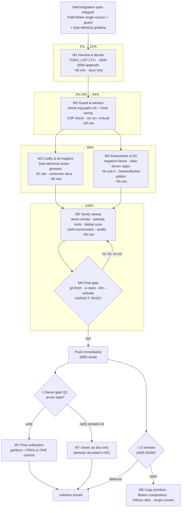

# Plan: Self-Integration 80/20 Master Plan (SVG single-source follow-through)

**Created:** 2026-09-19 17:48 CEST
**Session evidence:** `docs/status/2026-09-19_17-27_svg-single-source-self-integration-status.md` (§a–§g; `f<nn>` citations below refer to its §f list of 50 next tasks)
**Shipped already (this initiative):** `utils/svg.PathXMark` single source; Calendar/TagsInput/DismissButton de-duplicated; `TestInlineIconPathCompliance` guard; count-guard regex fix; external svg test package; AGENTS/CHANGELOG updated. All goldens byte-identical, 7 modules green, lint clean.

## Context

The self-integration pass proved the pattern (four path-data clones eliminated, output provably unchanged) but left three classes of residue:

1. **Unharvested decisions.** Seven deliberately-deferred integration candidates (status §c) live only in a timestamped report — every future session will re-discover or re-litigate them (`docs-health` HARVEST rule: §f is TODO_LIST input, not tombstone).
2. **Unwitnessed verification.** The PNG visual lane and TagsInput's CSP coverage are inferred (bytes-identical ⇒ pixels-identical), not witnessed (status §b.1–b.3).
3. **Unenforced rule.** The new "never inline `d=\"M...`" rule runs only in utils tests (CI), not as a <100ms shell guard in `.githooks/pre-commit` where its siblings live (status §e.2).

## Goal / non-goals

- **Goal:** Close the self-integration initiative: decisions recorded (zero re-litigation), rule enforced at commit time, verification witnessed, documentation single-sourced — without changing a single rendered byte of any component.
- **Non-goals:** Any pixel-changing refactor (arrow unification stays behind an owner gate); new public API (copy primitive, `FillIcon` attrs, Button children) stays deferred to the v2 window (ADR-0039 timing); no dependency additions (budget stays closed: templ + tailwind-merge-go + go-error-family).

## Pareto decomposition (what delivers the result)

| Slice                        | Delivers                                                                                                                                                                     | Why this slice                                                                                                                                                                                |
| ---------------------------- | ---------------------------------------------------------------------------------------------------------------------------------------------------------------------------- | --------------------------------------------------------------------------------------------------------------------------------------------------------------------------------------------- |
| **1%** → **51%**             | **M1 Harvest & decision records** — all 7 deferred candidates + 3 open questions written into `TODO_LIST.md` (IDs 271+) and ADR-0009 appendix                                | TODO_LIST/ADR are what every future session reads; recording converts ephemeral transcript knowledge into durable repo state and kills re-litigation. One file-pair edit, ~60 min, zero risk. |
| **4%** → **64%**             | M1 + **M2 Guard & witness** — pre-commit shell guard, TagsInput CSP check, one witnessed `nix run .#visual`                                                                  | Closes both open loops: enforcement (rule can't silently regress) and verification (inferred-green becomes witnessed-green).                                                                  |
| **20%** → **80%**            | + **M3 Codify & de-fragilize** — byte-identical-refactor pattern into AGENTS/SKILL, close-glyph glossary, count-regex made data-driven, JS-injection rule into consumer docs | Makes the _technique_ and the _rule_ transferable; removes the two landmines this session personally tripped (fragile regex, undocumented JS route).                                          |
| **remaining 20%** → **100%** | + **M4 robustness/DX, M5 sanity sweep, M6 verify+push ritual, M7/M8 gated design items**                                                                                     | Everything else: hardening, confirmations, and the gated pixel/API work that needs owner sign-off.                                                                                            |

---

## TABLE VIEW 1 — Milestones (30–100 min each, ALL todos mapped, sorted by impact/effort/value)

| #  | Milestone                                                                                                                                                                                                                                                                                      | Medium size            | Items covered (status §f)                                                                           | Impact                                                     | Effort              | Risk                                              |
| -- | ---------------------------------------------------------------------------------------------------------------------------------------------------------------------------------------------------------------------------------------------------------------------------------------------- | ---------------------- | --------------------------------------------------------------------------------------------------- | ---------------------------------------------------------- | ------------------- | ------------------------------------------------- |
| M1 | Harvest TODO_LIST (IDs 271+) + decision records (ADR-0009 appendix: raw-table accepted; arrow look intentional-by-default; AnimatedIcon-for-chevrons rejected; IconPathJS stroke-width note)                                                                                                   | 60 min                 | f1, f7, f24, f25, f31, f34-part, f35, f37, f38, f42, f46, f48, f49, f50, c.1–c.7, Q1/Q2/Q3 defaults | **Highest** — prevents all re-litigation                   | Low                 | Zero (docs only)                                  |
| M2 | Guard & witness: `scripts/check-svg-paths.sh` + `.githooks/pre-commit` wiring; TagsInput CSP coverage verify/add; witness `nix run .#visual` green                                                                                                                                             | 90 min                 | f2, f3, f4                                                                                          | **High** — closes enforcement + verification loops         | Medium              | Low (guard is additive; visual is read-only)      |
| M3 | Codify & de-fragilize: byte-identical-refactor pattern (AGENTS Process + `skill/SKILL.md`); `PathXMark`/`X`/`Close` glossary entry in `docs/DOMAIN_LANGUAGE.md`; JS-injection rule into `docs/javascript-guide.md` + website invariants prose; AGENTS external-test-package gotcha generalized | 90 min                 | f8, f13, f18, f20, f21, f36, f47                                                                    | High — transferable technique + split-brain killed         | Medium              | Zero (docs)                                       |
| M4 | Robustness & DX: hermetic negative-fixture test for the path guard; `countIconNames` regex data-driven; shared exemption list constant; guard message aligned with sibling guards; `check-tc-sources-sync.sh --fix` exits 0 on success; direct golden for `utils.DismissButton`                | 90 min                 | f6, f15, f16, f17, f29, f30                                                                         | Medium-high — removes this session's landmines permanently | Medium              | Low (test-only + one script exit-code)            |
| M5 | Sanity sweep & confirmations: demo Calendar/TagsInput smoke; website suite once; `art-dupl` scan confirms 4 clones dropped; enumerate remaining `<svg>`-shell components; chevron constant asymmetry noted; wire-coverage + composition-test audit notes; daemon-litter witness                | 90 min                 | f5-part, f19-eval, f22, f23, f26, f27, f28-eval, f32, f39, f40, f41, f44, f45                       | Medium — converts "probably fine" into recorded fact       | Medium              | Low (read-only sweeps)                            |
| M6 | Final gate: `git fetch` (daemon-race check) → `scripts/ci-repro.sh --lint --website` at exact tip (VERDICT: PASS) → push immediately                                                                                                                                                           | 60–100 min             | f5, f35                                                                                             | **Gate for everything** — M03 ritual                       | Medium (wall-clock) | Low                                               |
| M7 | ⫱ **Owner gate:** arrow unification (Carousel/Kanban → filled 20×20 `FillIcon`, goldens+PNG regen in one commit) — OR ratify stroked-24 as intentional (then this milestone is a 10-min doc edit already done by M1)                                                                           | 60–100 min if executed | f9, f10-part                                                                                        | Medium (consistency)                                       | Medium              | **Pixel change** — never execute without sign-off |
| M8 | ⫱ **v2 window (ADR-0039):** copy primitive in `utils` (errorpage copy-code); `ButtonProps` children/icon composition (LoadMore/ThemeToggle/ConfirmDelete); `FillIcon` attrs param (accordion chevron); Form+ValidationSummary recipe screen                                                    | Deferred               | f10, f11, f12, f33                                                                                  | Medium (deferred by design)                                | High                | API surface — v2 only                             |

---

## TABLE VIEW 2 — Micro-tasks (≤12 min each, ALL todos mapped, sorted by importance/impact/effort/value)

| #  | Micro-task                                                                                                                                                                                                                             | ≤12 min                      | Milestone | Source                       |
| -- | -------------------------------------------------------------------------------------------------------------------------------------------------------------------------------------------------------------------------------------- | ---------------------------- | --------- | ---------------------------- |
| 1  | Read status §c + draft 7 TODO_LIST rows (IDs 271–277): arrow unification ⫱, FillIcon attrs ⫱, copy primitive ⫱, Button composition ⫱, raw-table ADR note, composition-test audit note, wire-coverage audit note                        | 12                           | M1        | c.1–c.7, f1                  |
| 2  | Write ADR-0009 appendix entry: heatmap + errorpage contextTable raw `<table>` accepted (custom semantics; not `Table` clones)                                                                                                          | 8                            | M1        | f7, f24                      |
| 3  | Record decision defaults: stroked-24 arrows intentional-by-default (pending M7 gate); AnimatedIcon-for-chevrons evaluated/REJECTED (nav noise)                                                                                         | 8                            | M1        | f9, f25                      |
| 4  | Record evaluated/rejected: `IconPathJS` stroke-width 1.5 documented (no `WithStrokeWidth` variant until a consumer exists); no Sprintf benchmark for tags_input script (YAGNI); CRLF non-issue; daemon history left as-is (no rewrite) | 10                           | M1        | f19, f35, f37, f38, f42, f49 |
| 5  | Record process notes: view-before-edit discipline; `-count=1` for file-reading guards (already in AGENTS — verify wording covers the new guard)                                                                                        | 6                            | M1        | f43, f50                     |
| 6  | Check `docs/DOMAIN_LANGUAGE.md` for Calendar/TagsInput glossary gaps; add only if the glossary already covers component glyphs (else skip — recorded)                                                                                  | 6                            | M1        | f46                          |
| 7  | Write `scripts/check-svg-paths.sh` (grep-based mirror of `TestInlineIconPathCompliance`; same exemptions; <100ms)                                                                                                                      | 10                           | M2        | f3                           |
| 8  | Wire the shell guard into `.githooks/pre-commit` (before BuildFlow, Guard-numbering per file header) + run it once                                                                                                                     | 8                            | M2        | f3                           |
| 9  | Run guard twice: (a) confirm PASS on clean tree; (b) temporarily plant `d="M1 1"` in a scratch `.templ`, confirm FAIL, revert, confirm PASS (`-count=1` on the Go test)                                                                | 10                           | M2        | f3, f15-part                 |
| 10 | Grep `integration/csp_nonce_test.go` for TagsInput; if absent, add to the render list and run the test                                                                                                                                 | 8                            | M2        | f2                           |
| 11 | Run `nix run .#visual` (witness green; confirm calendar/tags_input/dismiss PNGs pass; capture output into session notes)                                                                                                               | 12                           | M2        | f4                           |
| 12 | AGENTS.md Process section: add "byte-identical refactor" recipe (snapshot generated files → pinned `templ generate` → diff → golden proof)                                                                                             | 10                           | M3        | f8                           |
| 13 | `skill/SKILL.md` Part 2: same recipe, one paragraph + anti-pattern line ("refactor that must not change output without the snapshot-diff proof")                                                                                       | 8                            | M3        | f8, f36                      |
| 14 | `docs/DOMAIN_LANGUAGE.md`: close-glyph entry — canonical name `PathXMark`; `icons.X` legacy, `icons.Close` preferred alias (matches existing Close-over-X convention)                                                                  | 8                            | M3        | f13                          |
| 15 | `docs/javascript-guide.md`: JS-injected icons MUST use `icons.IconPathData(name)[n]` (never inline path strings); cross-module consumers use `utils/svg` constants                                                                     | 8                            | M3        | f20                          |
| 16 | Website `docs/guides/invariants.md`: add single-source path rule prose (prose only — no count lines, so no drift-guard impact)                                                                                                         | 8                            | M3        | f21                          |
| 17 | AGENTS.md: generalize external-test-package gotcha (any new `utils/` test importing parent `utils` = cycle; svg is the precedent)                                                                                                 | 6                            | M3        | f18                          |
| 18 | `skill/SKILL.md` anti-pattern wording: ensure it names the JS-injection route (`IconPathData`) not just markup duplication                                                                                                             | 6                            | M3        | f47                          |
| 19 | Convert `countIconNames` regex to data-driven: constant-prefix list var + comment; keep current count at 102 (test proves no drift)                                                                                                    | 10                           | M4        | f16                          |
| 20 | Hermetic negative fixture: temp-dir `.templ` with planted literal; run the sweep function against it; assert violation found (extract sweep into testable helper first)                                                                | 12                           | M4        | f15                          |
| 21 | Extract exemption map into a shared test-level constant (single source for Go guard; shell guard keeps its own list with a sync comment)                                                                                               | 8                            | M4        | f29                          |
| 22 | Align guard violation message with sibling guard style (point at icons.Icon / IconPathData / utils/svg exactly like AGENTS.md)                                                                                                         | 6                            | M4        | f30                          |
| 23 | `check-tc-sources-sync.sh --fix`: exit 0 after successful re-copy (keep exit 1 when drift remains); update header comment                                                                                                              | 8                            | M4        | f6                           |
| 24 | Add `utils/dismiss_test.go` golden (or golden_sweep entry) for `DismissButton` — localizes future failures that today only surface via feedback/errorpage goldens                                                                      | 10                           | M4        | f17                          |
| 25 | Demo smoke: rebuild demo CSS+binary if needed, `nix run .#shots` calendar/tags_input routes, eyeball 2 captures                                                                                                                        | 12                           | M5        | f22                          |
| 26 | Run `cd website && GOWORK=off GOEXPERIMENT=jsonv2 go test ./...` once; record green                                                                                                                                                    | 10                           | M5        | f23                          |
| 27 | Run `art-dupl -c .art-dupl.json` scan; confirm the 4 path clones left the report; note count delta                                                                                                                                     | 10                           | M5        | f34                          |
| 28 | Enumerate ALL components embedding full `<svg>` shells around `svg.Path*` constants (known: carousel, kanban, accordion); write the list into the M7 TODO row                                                                          | 8                            | M5        | f39                          |
| 29 | Note chevron asymmetry: `utils/svg` has no `PathChevronLeft/Right` (icons-side only); document as intentional (no cross-module consumer) or add constants                                                                              | 8                            | M5        | f40                          |
| 30 | Wire-coverage audit note: list interactive components and their `BaseProps.Attrs`/typed-`Wire` support; file gaps as TODO rows (no code changes)                                                                                       | 12                           | M5        | f32                          |
| 31 | Composition-test audit: list cross-package compositions lacking ANY proof; extend `integration/composition_test.go` only where a real gap shows                                                                                        | 12                           | M5        | f31                          |
| 32 | Check `docs/modularization/README.md` for svg test-package layout mentions; update if stale                                                                                                                                            | 6                            | M5        | f26                          |
| 33 | Align `dismiss.templ` comment phrasing with AGENTS.md leaf-rule wording (one canonical phrasing; ANNOTATE, don't duplicate)                                                                                                            | 6                            | M5        | f27                          |
| 34 | Evaluate `wsl` exclusion for `_test.go` files (read `docs/lint-config-history.md` FIRST; record decision either way)                                                                                                                   | 10                           | M5        | f28                          |
| 35 | Witness daemon-litter state: `git status --ignored` spot-check for `.fail/` + untracked `.out.css`; confirm TestCompiledCSSInventory green                                                                                             | 8                            | M5        | f41, f44                     |
| 36 | Verify `docs/icons-only-adoption.md` IconPathJS example matches modern usage (toast/tags_input pattern)                                                                                                                                | 6                            | M5        | f45                          |
| 37 | Confirm `[Unreleased]` CHANGELOG still warm post-daemon (daemon races edits); re-verify AGENTS.md:163 survived                                                                                                                         | 6                            | M6        | f37-part                     |
| 38 | `git fetch` + `git status -sb`: confirm no daemon race on master; if new commits appeared, re-verify they're expected                                                                                                                  | 4                            | M6        | f5                           |
| 39 | Run `scripts/ci-repro.sh --lint --website` at the exact tip; require `VERDICT: PASS (exit 0)`                                                                                                                                          | 100 (wall-clock, unattended) | M6        | f5                           |
| 40 | Push IMMEDIATELY after PASS; re-check `git status -sb` for post-verify daemon commits before push                                                                                                                                      | 5                            | M6        | f5                           |
| 41 | ⫱ Await owner answer Q1 (arrow style): if unify → regen display goldens + PNGs in ONE commit; if ratify → M1's record stands, milestone closes                                                                                         | 60–100                       | M7        | f9                           |
| 42 | ⫱ v2 seed: copy-primitive design sketch (API shape, singleton JS ownership, errorpage adoption) into ROADMAP                                                                                                                           | 12                           | M8        | f11                          |
| 43 | ⫱ v2 seed: `ButtonProps` children/icon-slot sketch (LoadMore/ThemeToggle/ConfirmDelete migration map) into ROADMAP                                                                                                                     | 12                           | M8        | f12                          |
| 44 | ⫱ v2 seed: `FillIcon(class, path, rotate, attrs)` signature sketch (accordion chevron adoption) into ROADMAP                                                                                                                           | 8                            | M8        | f10                          |
| 45 | Seed: Form+ValidationSummary+FieldError round-trip recipe screen into ROADMAP (recipes expansion)                                                                                                                                      | 8                            | M8        | f33                          |
| 46 | Record: `ci-repro` lane decision — path guard lives inside utils tests (Build & Test lane), no separate lane needed                                                                                                                    | 4                            | M6        | f14                          |
| 47 | Record: SKILL.md anti-pattern line covers JS route (task 18) — no further skill edits needed this cycle                                                                                                                                | 2                            | M3        | f47                          |
| 48 | Annotate this plan + the 17:27 status report as DONE-source once M1–M6 complete (docs-health ANNOTATE, non-destructive)                                                                                                                | 8                            | M6        | staleness rule               |
| 49 | Optional hardening seed: extend guard to `stroke-dasharray`/`fill-rule` literal duplication IF drift ever appears (recorded as YAGNI-now)                                                                                              | 4                            | M4        | f15-note                     |
| 50 | Post-release ritual note: next version cut, re-confirm `TestVersionMatches*` + `[Unreleased]` warmth (standard; listed for completeness)                                                                                               | 4                            | M6        | f35                          |

---

## Execution graph

## Per-milestone checklist gates (from `docs/plan-authoring-checklist.md`)

- **M1 (docs):** Goldens n/a (no render change) · Wired n/a · Counts: TODO_LIST IDs are additive (no `TestDocsCountDrift` surface — IDs aren't counted) · Demo n/a.
- **M2 (guard+CSP+visual):** Goldens n/a for the guard itself; the CSP task may extend `integration` render list (no golden) · Wired n/a (no component change) · Counts n/a · Demo smoke: `nix run .#visual` IS the gate here.
- **M3 (docs+patterns):** All four gates n/a — docs-only; the proof is `TestDocsCountDrift` + `TestFeaturesEnum*` staying green (no counted numbers touched) and `nix fmt`/lint clean.
- **M4 (tests+script):** Goldens: adds `DismissButton` golden — run `go test ./utils/... -update` if snapshot missing, review diff · Wired n/a · Counts: golden-count lines! `DismissButton` golden ADDS to the "257 baselines" claims — bump README/FEATURES/AGENTS lines in the SAME commit (`TestDocsCountDrift` enforces) · Demo n/a.
- **M5 (sweeps):** Read-only + recorded notes; demo smoke gate = task 25 itself.
- **M6:** The M03 ritual verbatim; no exceptions, no "should be green".
- **M7 (gated pixel change):** Goldens: display HTML goldens + `visualtest/testdata` PNGs regenerate TOGETHER in one commit; counts: golden counts unchanged (updates, not additions) · Demo: carousel/kanban routes re-shot · NEVER executes without the ⫱ answer.
- **M8 (v2):** Own plan per item; API changes get ADRs.

## Verification (whole plan)

- [ ] Per-module loop green: `for mod in utils icons errorpage charts/echarts datastar htmx; do (cd "$mod" && GOWORK=off go test ./...); done`
- [ ] Root build+test via `scripts/ci-repro.sh --lint --website` at the exact push tip — `VERDICT: PASS (exit 0)`
- [ ] `nix run .#visual` witnessed green (M2, re-run if M7 executes)
- [ ] Demo smoke over calendar/tags_input routes (M5)
- [ ] CHANGELOG `[Unreleased]` warm; any golden-count bumps landed in the same edits as the golden (M4)
- [ ] Zero rendered-byte changes across M1–M6 (`git diff` on any `*_templ.go` is empty)

## Decision gates (⫱) — recommended defaults encoded

| Gate | Question (from status §g)                              | Recommended default (safe until answered)                                                                             |
| ---- | ------------------------------------------------------ | --------------------------------------------------------------------------------------------------------------------- |
| Q1   | Unify arrows on filled 20×20, or ratify stroked 24×24? | **Ratify stroked-24 as intentional** (zero pixel risk); unification stays a ready-to-run M7                           |
| Q2   | Copy primitive now or v2?                              | **v2** (errorpage copy-code works today; API budget closed)                                                           |
| Q3   | Harvest now + pre-commit guard?                        | **Yes to both** — that is M1+M2; CI-only enforcement is insufficient (daemon bypasses hooks anyway, but humans don't) |

## Deferred / follow-through seeds

- Everything in TABLE VIEW 2 marked ⫱ (tasks 41–45) — they become TODO_LIST rows via M1 and their own plans at gate-open time.
- Cross-phase audit seeds born in M5 (wire gaps, composition gaps) — each leaves M5 as a TODO_LIST row with a citation, never as untracked chat knowledge.
