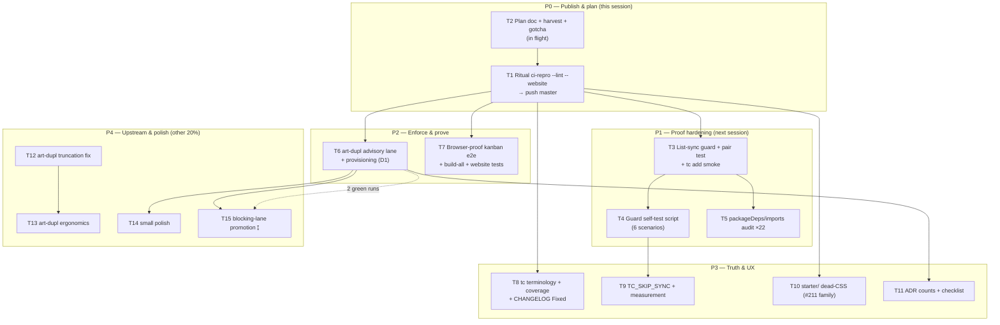

# TC Mirror + Dup-Gate Hardening — Pareto Plan

**Date:** 2026-09-22 22:42
**Source backlog:** `docs/status/2026-09-22_22-38_tc-mirror-guard-art-dupl-baseline-status.md` §b/§c/§f (session-scoped; no unrelated repo backlog pulled in)
**Repo tip at planning:** `068da185` (5 commits ahead of origin — all session work, unpushed)
**Living source of truth:** `TODO_LIST.md` (harvested from this plan — this file is a point-in-time snapshot)

---

## Context — what already shipped this session (the foundation this plan hardens)

1. `cmd/tc/_sources` is a **bidirectional self-healing mirror**: `scripts/check-tc-sources-sync.sh` re-copies drift, embeds new components, removes orphans; the tracked pre-commit guard **auto-fixes and stages**; Go parity via `TestSourcesMatchPackageFiles` + `TestSourcesShipEveryMirrorableFile`.
2. **22 never-embedded files rescued** — `tc add` previously rejected kanban, the SVG charts, eyebrow, scrollback, FilterInput, DirtyGuard, auth-layout (+9 `*_types.go`) with "unknown component".
3. **art-dupl duplication gate**: committed hash baseline `.art-dupl-baseline.json` (39 accepted groups @ t=1); canonical check `art-dupl check -c .art-dupl.json -t 1 --type-aware` → 0 new.
4. Two genuine 5-site test-scaffolding clones extracted (`newKanbanReadyTab`, `fetchDemoHTML`).

**Known honest gaps** (from the status report): the two mirror lists are guarded by comments only; the rescue is string-proven, not smoke-proven; the baseline is documented but **enforced nowhere**; the kanban e2e extraction is compile-proven only; `tc new` terminology drifts in docs.

## Decisions (autonomous defaults for the 3 open questions — chosen to NOT reverse shipped semantics)

| ID | Question                         | Decision                                                                                                                                                                                                                                                              | Rationale                                                                                            |
| -- | -------------------------------- | --------------------------------------------------------------------------------------------------------------------------------------------------------------------------------------------------------------------------------------------------------------------- | ---------------------------------------------------------------------------------------------------- |
| D1 | How to enforce `art-dupl check`? | **Advisory lane in `scripts/ci-repro.sh` first**; flake-input provisioning only if the art-dupl repo is public/packagable; promote to a blocking CI job only after 2 green advisory runs. **Never** a pre-commit blocker (type-aware is 10–100× slower — wrong lane). | Enforced-but-observable before enforced-and-blocking. Reversal risk ≈ 0.                             |
| D2 | Canonical threshold?             | **Keep t=1 + the committed baseline as-is.** `--min-lines` experiment is optional polish, not a gate change.                                                                                                                                                          | Baseline already shipped; re-litigating = churn with zero customer value (verschlimmbesserung risk). |
| D3 | All 22 components `tc add`-able? | **Keep complete-mirror semantics.** `tc add` already prints the standalone-compile caveat; make `--list-deps` honest for the big ones (T5) instead of hiding components.                                                                                              | An allowlist would reverse today's shipped, guarded semantics to solve a documentation problem.      |

## Pareto Breakdown

### The 1% that deliver 51%

1. **Publish the session work** — ritual green-on-tip verify + push (all value is locked until the 5 commits are proven and public).
2. **Mirror-list sync guard** — one tiny test kills the only silent-drift class in the new system (`MIRRORED_PKGS` ↔ `mirroredPackages`).
3. **`tc add` smoke + pair-completeness tests** — proves the headline user-facing rescue end-to-end.
4. **Truncated-capture gotcha into AGENTS.md** — encodes the session's only real process failure as repo memory.

### The 4% that deliver 64%

5. **Guard self-test script** — the 6 scenarios automated in a temp worktree; the guard becomes regression-proof.
6. **`packageDeps`/`packageImports` audit for the 22** — makes `tc add --list-deps` honest for the newly addable surface.
7. **`art-dupl check` advisory lane + provisioning** — turns the baseline from documentation into a gate (D1).
8. **Browser-proof the kanban e2e extraction** — brings the refactor up to the repo's wired⇒e2e doctrine.

### The 20% that deliver 80%

9. `tc new` → `tc init`/`tc add` terminology sweep.
10. Website/FEATURES/README `tc add` coverage claims (docs-count drift class).
11. `TC_SKIP_SYNC` escape hatch + guard runtime measurement + message polish.
12. `starter/` dead-CSS investigation (3 unconsumed files; sibling of TODO #211).
13. ADR per-threshold counts + plan-authoring checklist step + baseline determinism check.
14. CHANGELOG `### Fixed` reframe of the 22-file rescue + baseline-regeneration ritual doc.
15. Full build-all (7 modules) + website tests verification pass.

### The other 20% (to 100%)

16. art-dupl upstream: piped-output truncation bug (lost 19/39 groups in one capture — root-caused from this session's incident).
17. art-dupl upstream: `--fingerprint-only` baseline (no `recordedAt` churn).
18. art-dupl upstream: config auto-discovery (kills the documented "scans without `-c`" foot-gun).
19. art-dupl upstream: help epilog documenting flag-set/hash stability.
20. Small polish: `tc ls` footer count, ci-repro guard-output actionability, post-daemon re-verify note, `--min-lines` experiment.

## Coarse Plan — 30–100 min tasks, sorted by importance/impact

| ID  | Task                                                                                                                                                                         | Pareto tier | Impact                                              | Effort | Depends on | Verification gate                                   |
| --- | ---------------------------------------------------------------------------------------------------------------------------------------------------------------------------- | ----------- | --------------------------------------------------- | ------ | ---------- | --------------------------------------------------- |
| T1  | Publish session work: `scripts/ci-repro.sh --lint --website` at tip → witness `VERDICT: PASS` → push master immediately (daemon race check; **no tags** per house rule #270) | 1%          | ALL value unlocks                                   | 45m    | —          | VERDICT: PASS; origin == tip                        |
| T2  | This plan file + TODO_LIST harvest + AGENTS truncated-capture gotcha + detailed commit                                                                                       | 1%          | Repo memory                                         | 40m    | —          | Plan doc exists; harvest section; hook-green commit |
| T3  | Mirror hardening: list-sync guard test + pair-completeness test + `tc add` smoke tests (eyebrow + auth_layout into `t.TempDir()`)                                            | 1%          | Kills silent-drift class; proves rescue             | 60m    | T1         | `go test -count=1 ./cmd/tc/...` green               |
| T4  | Guard self-test: `scripts/test-tc-sources-guard.sh` — 6 scenarios (clean/drift/new/orphan/rename/missing-pkg) in a detached temp worktree                                    | 4%          | Guard regression-proof                              | 80m    | T3         | Script green ×2 consecutive runs                    |
| T5  | `packageDeps`/`packageImports` audit for the 22 rescued components; fix maps; review `--list-deps` for kanban/charts                                                         | 4%          | Honest scaffolder UX                                | 60m    | T3         | `TestPackageImportsMatchSources` green              |
| T6  | Gate enforcement (D1): verify art-dupl repo public → flake input (or documented PATH) → advisory lane in ci-repro.sh → determinism double-run → AGENTS doc                   | 4%          | Baseline becomes a gate                             | 80m    | T1         | ci-repro prints dup-gate line, 0 new                |
| T7  | Doctrine verify: `nix run .#visual` kanban e2e (extracted helper) + `go build ./...` all modules + website tests                                                             | 4%          | Browser-level proof                                 | 75m    | T1         | All green, evidence noted                           |
| T8  | Docs truth: `tc new` sweep + coverage claims (website/FEATURES/README) + CHANGELOG `### Fixed` reframe + docs-count drift test                                               | 20%         | Consumer-facing truth                               | 80m    | T1         | `TestDocsCountDrift` green                          |
| T9  | Guard UX: `TC_SKIP_SYNC=1` opt-out (loud banner) + measured runtime in header + direction-1 message → `--fix` pointer + vestigial-pattern confirm                            | 20%         | Safer self-healing                                  | 45m    | T4         | Opt-out tested; header honest                       |
| T10 | `starter/` dead-CSS: trace 3 unconsumed files → delete-or-wire decision (ties into #211) → guards + AGENTS inventory update                                                  | 20%         | Less shipped dead weight                            | 45m    | T1         | `TestCompiledCSSInventory` green                    |
| T11 | ADR refresh: per-threshold counts (-t 5/7/8) + plan-authoring checklist step + baseline-regeneration ritual link                                                             | 20%         | Institutional memory                                | 40m    | T6         | ADR numbers match fresh runs                        |
| T12 | art-dupl upstream: reproduce + root-cause + fix the piped-output truncation (own repo)                                                                                       | other 20%   | Prevents my 20-vs-39 class of incident for everyone | 40m    | T1         | Repro test in art-dupl repo                         |
| T13 | art-dupl upstream: `--fingerprint-only` baseline + config auto-discovery + help epilog (hash/flag stability)                                                                 | other 20%   | Tooling ergonomics                                  | 90m    | T12        | Released upstream; re-record baseline               |
| T14 | Remaining polish: `tc ls` footer count (derived, guarded) + ci-repro guard-output review + post-daemon re-verify note + `--min-lines` decision                               | other 20%   | Marginal                                            | 40m    | T6         | Each item done or explicitly rejected               |
| T15 | Promotion gate (D1): after 2 green advisory runs, promote `art-dupl check` to a blocking CI job                                                                              | other 20%   | Full enforcement                                    | 30m    | T6         | CI lane green in PR                                 |

## Fine Plan — ≤12 min tasks, ALL todos, sorted within coarse tasks

### T1 — Publish session work (45m)

| #   | Task                                                                                          | Est     |
| --- | --------------------------------------------------------------------------------------------- | ------- |
| 1.1 | `git status` + confirm tip == the 5 session commits; fetch; note daemon state                 | 3m      |
| 1.2 | Run `scripts/ci-repro.sh --lint --website` (background; Build+Test, Lint, CSS, Website lanes) | 5m+wall |
| 1.3 | Witness `VERDICT: PASS`; triage any failure at root cause                                     | 10m     |
| 1.4 | Re-check tip unchanged (daemon race); if moved, re-verify new tip                             | 5m      |
| 1.5 | Push master (NO tags); confirm `origin/master == master`                                      | 5m      |

### T2 — Plan + harvest + gotcha + commit (40m)

| #   | Task                                                                               | Est |
| --- | ---------------------------------------------------------------------------------- | --- |
| 2.1 | Pareto + coarse + fine tables (this document)                                      | 12m |
| 2.2 | Write plan doc with mermaid execution graph                                        | 12m |
| 2.3 | Harvest new tasks into TODO_LIST.md (IDs from 283, existing section format)        | 10m |
| 2.4 | AGENTS.md gotcha: "piped CLI capture without its summary line = truncated; re-run" | 8m  |
| 2.5 | Detailed commit of plan + harvest + gotcha                                         | 8m  |

### T3 — Mirror hardening (60m)

| #   | Task                                                                                                                  | Est |
| --- | --------------------------------------------------------------------------------------------------------------------- | --- |
| 3.1 | `TestMirrorPackageListsMatchScript`: Go test parses `MIRRORED_PKGS` from the bash script and diffs `mirroredPackages` | 12m |
| 3.2 | Pair-completeness test: every embedded `*_types.go` has a registered `.templ` sibling (and no orphan types)           | 10m |
| 3.3 | `tc add` smoke: scaffold `eyebrow` into `t.TempDir()`, assert `.templ` lands                                          | 12m |
| 3.4 | `tc add` smoke: scaffold `auth_layout`, assert `.templ` + `auth_layout_types.go` both land                            | 10m |
| 3.5 | `go test -count=1 ./cmd/tc/...` + `golangci-lint run ./cmd/...`                                                       | 5m  |

### T4 — Guard self-test (80m)

| #   | Task                                                                                            | Est |
| --- | ----------------------------------------------------------------------------------------------- | --- |
| 4.1 | Scaffold `scripts/test-tc-sources-guard.sh` (detached worktree setup/teardown, scenario runner) | 12m |
| 4.2 | Scenario: clean tree → exit 0                                                                   | 6m  |
| 4.3 | Scenario: drift → check fails, `--fix` re-copies                                                | 8m  |
| 4.4 | Scenario: new component → check fails, `--fix` embeds                                           | 8m  |
| 4.5 | Scenario: orphan → check fails, `--fix` git-rms                                                 | 8m  |
| 4.6 | Scenario: rename (twin deleted + new file added in one state) → both problems, both fixed       | 10m |
| 4.7 | Scenario: MISSING-PACKAGE config error → unfixable, exit 1                                      | 10m |
| 4.8 | Run script twice consecutively (idempotence), document usage in header                          | 8m  |

### T5 — Deps audit for the 22 (60m)

| #   | Task                                                                                                         | Est |
| --- | ------------------------------------------------------------------------------------------------------------ | --- |
| 5.1 | Extract actual sibling-file deps + module imports for the 22 components                                      | 12m |
| 5.2 | Diff against `packageDeps`/`packageImports` maps                                                             | 10m |
| 5.3 | Fix map entries; extend `TestPackageImportsMatchSources` coverage if gaps                                    | 12m |
| 5.4 | Review `tc add kanban --list-deps` + `tc add line_chart --list-deps` output for honesty (chart_geometry.go!) | 10m |
| 5.5 | Tests `-count=1` + lint                                                                                      | 5m  |

### T6 — Gate enforcement, advisory first (80m)

| #   | Task                                                                                      | Est |
| --- | ----------------------------------------------------------------------------------------- | --- |
| 6.1 | Verify art-dupl repo remote/publicness + packaging feasibility                            | 8m  |
| 6.2 | Add flake input + devShell package (if public); else document PATH prerequisite in AGENTS | 12m |
| 6.3 | Advisory `art-dupl check` lane in `scripts/ci-repro.sh` (warn-not-fail, prints count)     | 10m |
| 6.4 | Determinism: two consecutive checks → identical outcome                                   | 6m  |
| 6.5 | AGENTS.md: provisioning + canonical invocation note                                       | 8m  |
| 6.6 | Owner gate note: promotion criteria (2 green runs) → TODO_LIST ⫱                          | 5m  |

### T7 — Doctrine verification (75m)

| #   | Task                                                                     | Est      |
| --- | ------------------------------------------------------------------------ | -------- |
| 7.1 | `nix run .#visual` targeted at kanban e2e tests (extracted helper proof) | 12m+wall |
| 7.2 | Triage any failure introduced by `newKanbanReadyTab`                     | 10m      |
| 7.3 | `go build ./...` root + per-module loop (7 modules)                      | 10m      |
| 7.4 | `cd website && GOWORK=off go test ./...`                                 | 8m       |
| 7.5 | Record evidence lines in this doc's appendix                             | 5m       |

### T8 — Docs truth (80m)

| #   | Task                                                                                    | Est |
| --- | --------------------------------------------------------------------------------------- | --- |
| 8.1 | `grep -rn "tc new"` across repo (docs/, website/content, AGENTS, scripts, README)       | 8m  |
| 8.2 | Fix stale references → `tc init` / `tc add`                                             | 12m |
| 8.3 | Check website api-reference + FEATURES + README for `tc add` coverage claims            | 10m |
| 8.4 | Update claims; prefer derived counts (CountStats pattern) over prose numbers            | 10m |
| 8.5 | CHANGELOG: alias/move the 22-file rescue under `### Fixed` for release-notes visibility | 8m  |
| 8.6 | `go test ./utils/... -run TestDocsCount` green                                          | 5m  |

### T9 — Guard UX (45m)

| #   | Task                                                                          | Est |
| --- | ----------------------------------------------------------------------------- | --- |
| 9.1 | `TC_SKIP_SYNC=1` opt-out in script + hook with loud stderr banner; tested     | 10m |
| 9.2 | Measure guard runtime on full tree; replace inherited "<100ms" header claim   | 6m  |
| 9.3 | Direction-1 error message → point at `scripts/check-tc-sources-sync.sh --fix` | 5m  |
| 9.4 | Confirm no other file copied the removed vestigial exclusion patterns         | 5m  |
| 9.5 | Tests + lint                                                                  | 5m  |

### T10 — starter/ dead-CSS (45m)

| #    | Task                                                                                                                                  | Est |
| ---- | ------------------------------------------------------------------------------------------------------------------------------------- | --- |
| 10.1 | Trace consumers of `starter/{templ-components-theme.css,styles.css,templ-components-theme.out.css}` (code, docs, release.sh, tc init) | 12m |
| 10.2 | Decision: delete (CSS-inventory rule + `.out.css` policy; ties to #211) or wire — document either way                                 | 10m |
| 10.3 | Execute: delete files / wire consumer; `TestCompiledCSSInventory` green                                                               | 12m |
| 10.4 | Update AGENTS CSS-inventory bullet + starter exclusion notes                                                                          | 6m  |

### T11 — ADR + checklist refresh (40m)

| #    | Task                                                                                       | Est |
| ---- | ------------------------------------------------------------------------------------------ | --- |
| 11.1 | Fresh `art-dupl -t 5/7/8` runs; record current counts in ADR-0009 consequences             | 10m |
| 11.2 | `docs/plan-authoring-checklist.md`: add "run `art-dupl check`" step                        | 6m  |
| 11.3 | Baseline-regeneration ritual (ADR table first → re-baseline) linked from release checklist | 8m  |
| 11.4 | Re-read this plan vs reality; annotate divergences (docs-health ANNOTATE rules)            | 6m  |

### T12 — art-dupl upstream: truncation (40m, other repo)

| #    | Task                                                                    | Est |
| ---- | ----------------------------------------------------------------------- | --- |
| 12.1 | Reproduce piped-output truncation deterministically (tee/pipe variants) | 12m |
| 12.2 | Root-cause in art-dupl source (buffering / early exit / partial write)  | 12m |
| 12.3 | Fix + regression test in art-dupl repo                                  | 12m |

### T13 — art-dupl upstream: ergonomics (90m, other repo)

| #    | Task                                                                   | Est   |
| ---- | ---------------------------------------------------------------------- | ----- |
| 13.1 | `--fingerprint-only` baseline (drop `recordedAt` → diff-stable)        | 12m×2 |
| 13.2 | Config auto-discovery (or well-known config name)                      | 12m×2 |
| 13.3 | Help epilog: `baseline`/`check` flag sets must match for stable hashes | 8m    |
| 13.4 | Re-record this repo's baseline via fingerprint-only once released      | 8m    |

### T14 — Remaining polish (40m)

| #    | Task                                                                       | Est |
| ---- | -------------------------------------------------------------------------- | --- |
| 14.1 | `tc ls` footer: "N components addable" (derived at runtime, not prose)     | 10m |
| 14.2 | ci-repro guard-failure output actionability review (does it name the fix?) | 8m  |
| 14.3 | AGENTS note: post-daemon-commit re-verify (dup check + mirror check once)  | 6m  |
| 14.4 | `--min-lines` experiment; document keep-or-reject with numbers             | 10m |

### T15 — Promotion gate (30m)

| #    | Task                                                                                     | Est |
| ---- | ---------------------------------------------------------------------------------------- | --- |
| 15.1 | After 2 green advisory runs (T6.3 evidence): promote `art-dupl check` to blocking CI job | 10m |
| 15.2 | Update AGENTS + ADR-0009 with the blocking status                                        | 5m  |

## Execution Graph

## Anti-verschlimmbesserung rules (binding for every task above)

1. **No reversal of shipped semantics** (complete-mirror, t=1 baseline, auto-fix+stage) without an owner decision — improvements are additive.
2. **Every task carries its verification gate** — a task without a green check is not done.
3. **Advisory before blocking** for any new gate (D1).
4. **Docs claims must be derived or drift-guarded** — never hand-typed counts (CountStats lesson).
5. The daemon races every commit: re-verify the tip if `git status -sb` shows foreign commits mid-task.

## Harvest

New actionable items → `TODO_LIST.md` section _Harvested 2026-09-22 — tc mirror + dup-gate follow-through_ (IDs 283–297). Upstream tasks (T12/T13) → flagged as blocked-on-other-repo. T6.6/T10.2/T15.1 carry ⫱ owner gates.

---

_Point-in-time snapshot. When superseded, annotate — never rewrite (docs-health ANNOTATE rules)._
