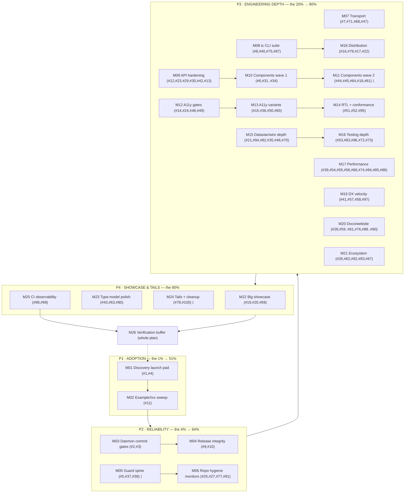

# TEMPL-COMPONENTS 100-IDEAS PARETO MASTER PLAN

**Created:** 2026-10-01 04:08 | **Baseline:** v1.19.4 | **Source:** [`docs/100-IMPROVEMENT-IDEAS.md`](../100-IMPROVEMENT-IDEAS.md)

---

## 1. Context

The library is feature-complete and high-quality: 121 components across 11 packages,
7-module workspace, dual-transport `wire`, 102 icons, native SVG charts, an opt-in
Datastar package, golden + visual + axe test tiers, a Go SSG website, and a `tc` CLI.
The bottleneck is no longer code quality. It is **discoverability, adoption surface,
and the reliability tax of the auto-commit daemon**, plus a large tail of quality,
performance, and DX polish captured as 100 fresh ideas in `docs/100-IMPROVEMENT-IDEAS.md`.

Evidence anchors (from repo docs read at plan time):

- The library is **not listed** on templ.guide or awesome-templ (STANDOUT-IDEAS Tier 1, TODO #28/#29).
- The BuildFlow daemon has caused **4+ documented incidents** (torn snapshots, mid-release
  commits, toolchain skew), each costing a session (AGENTS.md, TODO #93/#124/#125/#126/#232).
- Counts drift silently without guards (`TestDocsCountDrift` exists precisely because it happened).
- Demand-gated components (MultiSelect, TreeRangePicker…) have **zero demand evidence** (#217) —
  this plan does not build them speculatively.

This plan ranks all 100 ideas via Pareto, gives a 25-task medium plan (30–100 min) and a
121-task micro plan (≤12 min), and orders execution so the cheapest high-leverage work lands first.

## 2. Goal / non-goals

- **Goal:** a fully-ordered, costed, dependency-aware execution path for all 100 ideas, with
  the 51%-value 1% cluster executable in under a day.
- **Non-goals:** building demand-gated components (#217) or any v2.0 breaking change;
  rewriting historical plans/reports; any new runtime dependency (budget stays closed:
  templ, tailwind-merge-go, go-error-family).

---

## 3. Pareto Breakdown

### The 1% that delivers 51% — TURN EXCELLENCE INTO ADOPTION

Nothing about the code needs to change for the project to be found and understood. The single
highest-leverage move is to **publish the value and tell the ecosystem story**: get listed
(#1), cross-link the GOTH-stack narrative (#4), and give every component a `go doc` example (#11).
This is 3 tasks, hours of work, and it moves the project from "excellent but invisible" to "found".

- **#1** submit to awesome-templ + templ.guide
- **#4** cross-link the three libraries as a branded GOTH stack
- **#11** `ExampleXxx` for every component

### The 4% that delivers 64% — REMOVE THE RELIABILITY TAX

Every session lost to a daemon race is a session not spent shipping. Harden the commit/release
pipeline and the guard spine that protects the numbers.

- **#2** per-module `go build` gate before auto-commit
- **#3** torn-snapshot tripwire
- **#9** post-tag consumer compile smoke in CI
- **#10** release-lock signal while `release.sh` runs
- **#5** determinism gate (render twice, byte-compare)
- **#37** golden-orphan detector
- **#38** block the art-dupl gate after two green advisory runs

### The 20% that delivers 80% — ENGINEERING DEPTH

The transport, CLI, API, component, accessibility, testing, performance, distribution, DX,
docs, and ecosystem work captured in ideas #6–#93 — the solid improvements that make the
library genuinely better for real consumers.

### The remaining 80% — PLATFORM, SHOWCASE, OWNER-GATED

Heavy showcase bets (#19 playground, #20 example app, #69 hosted playground), type-model
polish (#43/#63/#80), ecosystem tails (#78/#100), CI observability (#98/#99), and the
verification buffer. Sequenced last so they never block the cheap wins.

---

## 4. Comprehensive Plan — 25 medium tasks (30–100 min each)

Sorted by Pareto tier, then effort. `Ideas` = which of the 100 this task covers. `⫱` = owner gate.

| ID   | Task                                                            | Ideas                         | Tier | Impact | Effort | Gate |
| ---- | --------------------------------------------------------------- | ----------------------------- | ---- | :----: | :----: | :--: |
| M01  | Discovery launch pad (listings + GOTH narrative)                | #1, #4                        | 1%   |   5    |   60m  |      |
| M02  | `ExampleXxx` sweep across all packages                          | #11                           | 1%   |   4    |   90m  |      |
| M03  | Daemon commit gates (build gate + torn-snapshot tripwire)       | #2, #3                        | 4%   |   5    |   90m  |      |
| M04  | Release integrity (release-lock + post-tag compile smoke)       | #9, #10                       | 4%   |   5    |   90m  |      |
| M05  | Guard spine (determinism + golden-orphan + block art-dupl)      | #5, #37, #38                  | 4%   |   5    |   80m  |  ⫱   |
| M06  | Repo hygiene monitors (hooks/proxy/screenshots/workflows)       | #25, #27, #77, #91            | 4%   |   3    |   80m  |      |
| M07  | Transport upgrades (HTMXOff, triggers ADR, v4 audit)            | #7, #71, #68, #47             | 20%  |   4    |   90m  |      |
| M08  | `tc` CLI suite (doctor, dry-run, ls footer, explain)            | #8, #40, #75, #87             | 20%  |   4    |   100m |      |
| M09  | API hardening (Validate, attrs test, map ban, scoped-ID, catalog, compat) | #12, #23, #29, #30, #42, #13 | 20% | 4 | 100m | |
| M10  | New components wave 1 (ConfirmDialog, Segmented, CopyField, output, sheet) | #6, #31, #32, #33, #34 | 20% | 4 | 100m | |
| M11  | New components wave 2 (Timeline, skeletons, DataTable, palette, demand ADRs) | #44, #45, #64, #18, #81 | 20% | 4 | 100m | ⫱ |
| M12  | A11y gates (axe over goldens, combobox guard, touch-target, accessible-name) | #14, #24, #48, #49 | 20% | 4 | 90m | |
| M13  | A11y/visual variants (Firefox, reduced-motion, contrast, focus-order) | #15, #36, #50, #65    | 20%  |   4    |   100m |      |
| M14  | RTL + conformance (localized demo, statement, aria-live audit)  | #51, #52, #95                 | 20%  |   3    |   80m  |      |
| M15  | Datastar/wire depth (e2e module, SSE writer, fuzzing, docs)     | #21, #94, #82, #35, #46, #70  | 20%  |   4    |   100m |      |
| M16  | Testing depth (chart props, race lane, 422 e2e, policies)       | #53, #83, #96, #72, #73       | 20%  |   3    |   80m  |      |
| M17  | Performance program (budgets, tree-shake, layers, bench)        | #39, #54, #55, #56, #66, #74, #84, #85, #86 | 20% | 3 | 100m | |
| M18  | Distribution (CDN bundle, CSS hash, nix new, tc migrate)        | #16, #79, #17, #22            | 20%  |   4    |   100m |      |
| M19  | DX velocity (editor pack, hot-reload, Postgres, Lighthouse)     | #41, #57, #58, #97            | 20%  |   3    |   90m  |      |
| M20  | Docs/website (case study, OG, TOC, preview, RSS, JSON-LD, CSP)  | #28, #59, #60, #61, #76, #88, #89, #90 | 20% | 3 | 100m | |
| M21  | Ecosystem (adoption template, consumers, writeups, roadmap, v2 ADR) | #26, #62, #92, #93, #67   | 20%  |   3    |   90m  |      |
| M22  | Big showcase (playground, example app, hosted playground)       | #19, #20, #69                 | 80%  |   5    |   100m |      |
| M23  | Type-model polish (Slot, Theme tokens, withDefaults)            | #43, #63, #80                 | 80%  |   3    |   90m  |      |
| M24  | Ecosystem tails + cleanup (retire dead CSS, cross-lang port)    | #78, #100                     | 80%  |   2    |   60m  |  ⫱   |
| M25  | CI observability (mutation pilot, PR wall-clock + benchstat)    | #98, #99                      | 80%  |   2    |   90m  |      |

**M26 is the whole-plan verification buffer** (not a work task): per-module test loop, full
`ci-repro.sh`, demo smoke, CHANGELOG + count bump check.

### Task detail (What / Proof)

- **M01** — Add the library to awesome-templ (#1), open the templ.guide listing (#1), publish the shared
  GOTH blurb + badges + cross-links in all three READMEs (#4). *Proof:* PR URLs + rendered README diff.
- **M02** — Inventory components lacking `ExampleXxx`, add runnable examples per package (#11).
  *Proof:* `go doc` shows examples; `go test ./...` green.
- **M03** — Per-module build gate + torn-snapshot tripwire in BuildFlow config (#2/#3).
  *Proof:* replay the 4 incident SHAs against the new gate.
- **M04** — Release-lock signal wired into `release.sh`; CI job that `go get`s the fresh tag (#9/#10).
  *Proof:* CI job fails on a bad tag; daemon skips while lock present.
- **M05** — Determinism byte-compare test, golden-orphan detector, art-dupl flip to blocking (#5/#37/#38).
  *Proof:* new tests red→green; CI lane blocks on clones. `⫱` owner ratifies the block flip.
- **M06** — Fresh-clone hook check, weekly proxy-lag monitor, failure-screenshot convention, workflow hardening.
- **M07** — `HTMXOff` (#7), wire-candidate goldens policy (#71), typed trigger ADR (#68), htmx v4 audit (#47).
- **M08** — `tc doctor`, `tc add --dry-run`, `tc ls` footer, `tc explain` (#8/#40/#75/#87).
- **M09** — Attrs-precedence test, `Validate()` convention, `map[string]` scanner, scoped-ID helper,
  compat matrix, `tc.Catalog()` (#12/#23/#29/#30/#42/#13).
- **M10** — Five new components + goldens (#6/#31/#32/#33/#34).
- **M11** — Timeline, skeletons, DataTable column vis, command palette recipe, demand ADRs (#44/#45/#64/#18/#81).
- **M12** — axe over static goldens, combobox-role guard, touch-target-all-goldens, accessible-name audit.
- **M13** — Firefox lane, reduced-motion lane, contrast/forced-colors, focus-order goldens.
- **M14** — Localized demo route, WCAG conformance statement, screen-reader aria-live audit.
- **M15** — `ssetest` module, SSE writer policy, wire fuzzing, flaky helper, optimistic/hx-sync docs.
- **M16** — Chart property tests, visualtest race lane, 422 e2e, test-only-dep policy, demo-smoke gate.
- **M17** — CSS/JS byte budgets, per-component cost, `@layer`, icon tree-shake, `SITE_SKIP_STARS`, benches.
- **M18** — Prebuilt CDN bundle, CSS content-hash, `nix run .#new`, `tc migrate`.
- **M19** — Editor support pack, hot-reload dev app, one-command Postgres, Lighthouse lane.
- **M20** — Case study, OG generator, TOC scroll-spy + mobile nav, preview channel, `.#website`, RSS, JSON-LD, CSP telemetry.
- **M21** — Adoption template, consumers section, SSE writeup, roadmap board, v2 module-path ADR.
- **M22** — Copy-paste playground, real-world example app, hosted playground.
- **M23** — `Slot` type, `Theme`/`Tokens` struct, `withDefaults` generic.
- **M24** — Retire dead CSS artifacts, cross-language wire port spike. `⫱` owner decision on #78.
- **M25** — Mutation pilot, PR wall-clock + benchstat comment.

---

## 5. Detailed Breakdown — 121 micro-tasks (≤12 min each)

Every micro-task is at most 12 minutes of focused work. `(#n)` maps to the idea rank in
`docs/100-IMPROVEMENT-IDEAS.md`.

### P1 — the 1% (M01–M02)

| ID     | Micro-task                                                        | Ideas |
| ------ | ----------------------------------------------------------------- | ----- |
| M01.01 | Verify awesome-templ repo owner + listing criteria                | #1    |
| M01.02 | Add entry under Resources/Components + open PR                     | #1    |
| M01.03 | Submit templ.guide directory listing PR                            | #1    |
| M01.04 | Write shared "GOTH stack" blurb                                    | #4    |
| M01.05 | Badges + cross-links in all three READMEs                          | #4    |
| M02.01 | Inventory components missing `ExampleXxx`                          | #11   |
| M02.02 | Add examples for the `display` package                             | #11   |
| M02.03 | Add examples for the `forms` package                               | #11   |
| M02.04 | Add examples for `feedback` / `layout` / `navigation`              | #11   |
| M02.05 | Add examples for `wire` / `datastar` / `errorpage`                 | #11   |

### P2 — the 4% (M03–M06)

| ID     | Micro-task                                                        | Ideas |
| ------ | ----------------------------------------------------------------- | ----- |
| M03.01 | Draft per-module `go build` gate in BuildFlow config              | #2    |
| M03.02 | Implement torn-snapshot tripwire                                   | #3    |
| M03.03 | Replay the 4 incident SHAs against the new gate                    | #2, #3 |
| M04.01 | Design post-tag consumer smoke module                              | #9    |
| M04.02 | Add CI job that `go get`s the new tag                              | #9    |
| M04.03 | Add release-lock signal file to `release.sh`                       | #10   |
| M04.04 | Verify the daemon respects the lock                                | #10   |
| M05.01 | Determinism test: render twice, byte-compare                       | #5    |
| M05.02 | Golden-orphan detector test                                        | #37   |
| M05.03 | Flip art-dupl to blocking CI after two green runs                  | #38   |
| M06.01 | Fresh-clone hook check in CI/doctor                                | #25   |
| M06.02 | Weekly proxy-lag monitor workflow                                  | #27   |
| M06.03 | Failure-screenshot naming + CI cleanup                             | #77   |
| M06.04 | Workflow permissions + `workflow_dispatch` pass                    | #91   |

### P3 — the 20% (M07–M21)

| ID     | Micro-task                                                        | Ideas |
| ------ | ----------------------------------------------------------------- | ----- |
| M07.01 | Add `HTMXOff` value + rendering test                              | #7    |
| M07.02 | Wire site marketing pages to `HTMXOff`                             | #7    |
| M07.03 | Wire-candidate goldens policy doc line                             | #71   |
| M07.04 | Typed interval/intersect trigger ADR draft                         | #68   |
| M07.05 | htmx v4 event-rename audit spike doc                               | #47   |
| M08.01 | `tc doctor`: hooks path + templ pin checks                         | #8    |
| M08.02 | `tc doctor`: CSS freshness + go.work + replace checks              | #8    |
| M08.03 | `tc add --dry-run`                                                 | #40   |
| M08.04 | `tc ls` derived footer + drift guard                               | #75   |
| M08.05 | `tc explain <component>`                                           | #87   |
| M09.01 | Attrs-precedence contract test                                     | #23   |
| M09.02 | `Validate()` convention doc + shared harness                       | #12   |
| M09.03 | `map[string]` scanner guard                                        | #29   |
| M09.04 | Scoped-ID helper + tests                                           | #30   |
| M09.05 | Cross-module compat matrix doc + guard                             | #42   |
| M09.06 | `tc.Catalog()` registry design                                     | #13   |
| M09.07 | Catalog feeding docs + goldens                                     | #13   |
| M10.01 | `ConfirmDialog` templ + tests                                      | #6    |
| M10.02 | Segmented control component                                        | #31   |
| M10.03 | `CopyField` component                                              | #32   |
| M10.04 | `<output>` live-total helper                                       | #33   |
| M10.05 | Bottom-sheet Drawer variant                                        | #34   |
| M10.06 | Goldens for all five new components                                | #6, #31, #32, #33, #34 |
| M11.01 | Timeline component                                                 | #44   |
| M11.02 | Layout-preserving skeleton set                                     | #45   |
| M11.03 | DataTable column visibility + resize                               | #64   |
| M11.04 | Pre-write demand-gated ADRs                                        | #81   |
| M11.05 | Command-palette recipe                                             | #18   |
| M11.06 | Count bumps + goldens for wave 2                                   | #44, #45, #64 |
| M12.01 | axe sweep over static goldens lane                                 | #14   |
| M12.02 | Combobox-role scanner guard                                        | #24   |
| M12.03 | Touch-target audit over all interactive goldens                    | #48   |
| M12.04 | Accessible-name computation audit                                  | #49   |
| M13.01 | Firefox visual lane setup                                          | #15   |
| M13.02 | Reduced-motion visual lane                                         | #36   |
| M13.03 | `prefers-contrast` / `forced-colors` variants                      | #50   |
| M13.04 | Focus-order goldens for overlays                                   | #65   |
| M14.01 | Localized demo route (`dir=rtl` + `lang`)                          | #51   |
| M14.02 | WCAG 2.2 AA conformance statement                                  | #52   |
| M14.03 | Screen-reader aria-live region audit                               | #95   |
| M15.01 | `ssetest` module scaffold                                          | #21   |
| M15.02 | Datastar real-runtime e2e tests                                    | #21   |
| M15.03 | SSE writer policy call + helper                                    | #94   |
| M15.04 | Wire fuzzing (`Attributes` + `DecodeForm`)                         | #82   |
| M15.05 | Flaky-endpoint visualtest helper extraction                        | #35   |
| M15.06 | Optimistic + hx-sync guidance docs                                 | #46, #70 |
| M16.01 | Chart geometry property tests                                      | #53   |
| M16.02 | visualtest `-race` lane                                            | #83   |
| M16.03 | 422 sorted-view kanban e2e                                         | #96   |
| M16.04 | Test-only dependency policy note                                   | #72   |
| M16.05 | Demo-smoke gate added to plan checklist                            | #73   |
| M17.01 | CSS size budget guard                                              | #39   |
| M17.02 | Per-component HTML byte-cost report                                | #54   |
| M17.03 | Inline-JS byte budget                                              | #55   |
| M17.04 | `@layer` ordering investigation                                    | #56   |
| M17.05 | Icon path-data tree-shake split                                    | #66   |
| M17.06 | `SITE_SKIP_STARS=1` default flip                                   | #74   |
| M17.07 | Chart large-series benchmark                                       | #84   |
| M17.08 | `content-visibility` demo                                          | #85   |
| M17.09 | `preconnect`/`fetchpriority` audit                                 | #86   |
| M18.01 | Prebuilt CDN bundle output                                         | #16   |
| M18.02 | CSS content-hash attribute                                         | #79   |
| M18.03 | `nix run .#new` scaffolder                                         | #17   |
| M18.04 | `tc migrate` design + first bump                                   | #22   |
| M19.01 | Editor support pack doc                                            | #41   |
| M19.02 | Hot-reload dev app                                                 | #57   |
| M19.03 | One-command Postgres                                               | #58   |
| M19.04 | Lighthouse lane                                                    | #97   |
| M20.01 | Optimistic-UI case study                                           | #28   |
| M20.02 | Go OG-image generator                                              | #59   |
| M20.03 | Docs TOC scroll-spy + mobile nav                                   | #60   |
| M20.04 | Firebase preview channel                                           | #61   |
| M20.05 | `.#website` flake app                                              | #76   |
| M20.06 | RSS/Atom feed                                                      | #88   |
| M20.07 | Richer JSON-LD + `rel=prev/next`                                   | #89   |
| M20.08 | CSP violation telemetry                                            | #90   |
| M21.01 | Adoption-ask discussion template                                   | #26   |
| M21.02 | "Who uses this" consumers section                                  | #62   |
| M21.03 | SSE audit writeup                                                  | #92   |
| M21.04 | Public roadmap board sync                                          | #93   |
| M21.05 | v2 module-path ADR + codemod                                       | #67   |

### P4 — the remaining 80% (M22–M25) + verification (M26)

| ID     | Micro-task                                                        | Ideas |
| ------ | ----------------------------------------------------------------- | ----- |
| M22.01 | Playground design spike                                            | #19   |
| M22.02 | Playground implementation slices                                   | #19   |
| M22.03 | Example-app scaffold                                               | #20   |
| M22.04 | Example-app CRUD + deploy                                          | #20   |
| M22.05 | Hosted-playground evaluation                                       | #69   |
| M23.01 | `Slot` type                                                        | #43   |
| M23.02 | `Theme`/`Tokens` struct                                            | #63   |
| M23.03 | `withDefaults` generic                                             | #80   |
| M24.01 | Retire `styles.css` / `theme.out.css` decision                     | #78   |
| M24.02 | Cross-language `wire` port spike                                   | #100  |
| M25.01 | Mutation pilot (gremlins on `utils`)                               | #98   |
| M25.02 | PR wall-clock + benchstat comment                                  | #99   |
| M26.01 | Per-module `go test` loop (all 7 modules)                          | —     |
| M26.02 | Full `scripts/ci-repro.sh --lint --website`                        | —     |
| M26.03 | Demo smoke over changed endpoints                                  | —     |
| M26.04 | CHANGELOG warm + doc counts bumped                                 | —     |

**Total: 121 micro-tasks (≤12 min), 25 work tasks (30–100 min) + 1 verification buffer.**

---

## 6. Execution Graph

Reading: solid arrows = sequencing; `⫱` = owner gate (M05 ratifies the art-dupl block flip,
M11 ratifies demand-gated ADRs, M24 decides the dead-CSS retirement). P3 lanes are largely
independent and can run in parallel; M26 is the shared exit gate.

---

## 7. Coverage Matrix — proof all 100 ideas appear

| Ideas        | Task(s) |
| ------------ | ------- |
| #1, #4       | M01 |
| #11          | M02 |
| #2, #3       | M03 |
| #9, #10      | M04 |
| #5, #37, #38 | M05 |
| #25, #27, #77, #91 | M06 |
| #7, #71, #68, #47 | M07 |
| #8, #40, #75, #87 | M08 |
| #12, #23, #29, #30, #42, #13 | M09 |
| #6, #31, #32, #33, #34 | M10 |
| #44, #45, #64, #18, #81 | M11 |
| #14, #24, #48, #49 | M12 |
| #15, #36, #50, #65 | M13 |
| #51, #52, #95 | M14 |
| #21, #94, #82, #35, #46, #70 | M15 |
| #53, #83, #96, #72, #73 | M16 |
| #39, #54, #55, #56, #66, #74, #84, #85, #86 | M17 |
| #16, #79, #17, #22 | M18 |
| #41, #57, #58, #97 | M19 |
| #28, #59, #60, #61, #76, #88, #89, #90 | M20 |
| #26, #62, #92, #93, #67 | M21 |
| #19, #20, #69 | M22 |
| #43, #63, #80 | M23 |
| #78, #100 | M24 |
| #98, #99 | M25 |

Every idea rank 1–100 maps to exactly one task. No orphan ideas.

---

## 8. Verschlimmbesserung Guards (what this plan will NOT do)

1. **No new runtime dependencies.** The budget stays closed (templ, tailwind-merge-go,
   go-error-family). Gremlins and Lighthouse are dev-time/pinned, never shipped deps.
2. **No speculative components.** Demand-gated ideas (#81) only pre-write ADRs; nothing is built
   against zero evidence (#217 stands).
3. **No breaking API changes.** Type-model polish (#43/#63/#80) is additive and gated to v2 where needed.
4. **No golden regen without eyeballing.** Every pixel-golden micro-task includes an explicit
   eyeball step (the route-golden theme-pinning lesson).
5. **No doc-count edits without the guards.** Golden/component/enum changes run
   `TestDocsCountDrift` + `TestFeaturesEnumTableExhaustive` in the same micro-task.
6. **No release outside `release.sh`;** no re-tagging; no force-push.
7. **Historical plans/reports are never rewritten** — ANNOTATE mode only.
8. **The daemon is constrained, not fought:** gates are added upstream-compatible and replayed
   against real incident SHAs before being trusted.

---

## 9. Verification (whole plan)

- [ ] Per-module loop green: `for mod in utils icons errorpage charts/echarts datastar htmx; do (cd "$mod" && GOWORK=off go test ./...); done`
- [ ] Root build+test via `scripts/ci-repro.sh --lint --website` (prints `VERDICT: PASS`)
- [ ] Demo smoke over every changed endpoint
- [ ] CHANGELOG `[Unreleased]` warm; drift counts bumped in the same edits
- [ ] New tasks not already in `TODO_LIST.md` harvested (docs-health HARVEST)

## 10. Deferred / follow-through seeds

- Anything discovered mid-execution that does not fit a micro-task → harvest to `TODO_LIST.md`
  with a new ID (next free currently 322+).
- Owner gates (M05, M11, M24) stay gates until Lars decides; no speculative work past them.
