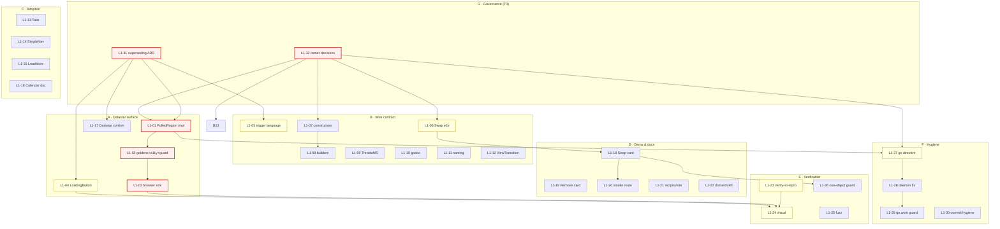

# Datastar ↔ HTMX Parity — Master Plan

**Date:** 2026-10-02 11:05
**Repo:** `github.com/larsartmann/templ-components` (7-module workspace + visualtest + website)
**Owner goal:** _Full, first-class support for BOTH HTMX and Datastar — get the BEST out of each._
**Author's lane:** planning only. No code is changed by this document; execution is gated on owner go-ahead.
**Supersedes / builds on:** `docs/status/2026-10-02_11-03_datastar-htmx-parity-full-report.md` (this session's work + 50-item backlog).

---

## 0. Where we are (context that constrains the plan)

**Already shipped this session (green):** `wire.Action.Swap` (`hx-swap` ↔ `{mode:'…'}`),
`wire.PatchModeRemove` (8th mode), the **Datastar one-options-object bug fix**
(separate option objects silently dropped form encoding), Kanban migrated off
raw `hx-swap`, docs/ADR/CHANGELOG sync, go-directive drift repaired.

**The honest gap:** the `datastar` module ships **4** components vs the `htmx`
module's **9**; Datastar users have **no polling primitive** (htmx has
`PolledRegion`); the new `Swap` rendering is proven only at string level
(**no browser e2e**); and the wire contract's runtime claims are not
browser-pinned as a suite.

**Non-negotiable constraints (the anti-Verschlimmbesserung guard):**

1. **No new dependency** beyond `templ`, `tailwind-merge-go`, `go-error-family`,
   `go-datastar/static`.
2. **Every runtime claim is verified against the pinned counterparty bundle**
   (`docs/datastar-runtime-facts.md`) **and** proven in a real browser before
   merge (`visualtest`). String assertions on our own output are not proof.
3. **Zero runtime panics** in component code; degrade gracefully.
4. **Zero value = documented default** (consumer struct literals matter).
5. **Backward compatible** unless an owner-approved superseding ADR says otherwise.
6. **Every `.templ` change regenerates + commits `*_templ.go`** (module-proxy
   consumers depend on it).
7. **Golden/count/guard drift is fixed in the same commit**, never deferred.
8. **ADR-0035's freeze is only lifted via a new superseding ADR** citing the
   revisit trigger (owner request = the strongest demand signal).

---

## 1. Pareto analysis (what delivers the result)

### The 1% → ~51%: **Datastar's missing polling primitive, PROVEN**

Ship `datastar.PolledRegion` (interval polling, `data-on-interval__duration.<n>[.leading]`)
**with** a pinned-bundle contract guard **and** a real-browser e2e.
Why 51%: polling is the single largest interaction class Datastar users cannot
express with this library; it is the #1 reason "Datastar support feels so-so."
One component + its proof validates the whole "emit runtime attributes → prove
in Chromium" pipeline that every later capability reuses. Tasks: **L1-31,
L1-01, L1-02, L1-03**.

### The 4% → ~64%: **Datastar reaches parity on the common interaction classes**

The 1% **plus** the busy-button primitive (`datastar.LoadingButton`), the typed
**interval/intersect trigger** contract in `wire` (TODO #178 / ADR), and the
**browser e2e for the new `Swap`/`mode`** (closing this session's waiver).
After this tier, Datastar and htmx are equals for: swap, submit, poll, busy,
and triggers. Tasks: **+ L1-04, L1-05, L1-06, L1-23, L1-24, L1-27, L1-32**.

### The 20% → ~80%: **Ergonomics, adoption, demo, and the sanctioned gates**

The 4% **plus** wire constructors/builders/`ThrottleMS`, `Wire` adoption on
`Tabs`/`SimpleNav`, the `LoadMore` cleanup, demo cards for the new surface, and
running the repo's own `nix run .#verify` / `scripts/ci-repro.sh` / `nix run .#visual`.
Tasks: **+ L1-07, L1-08, L1-09, L1-10, L1-13, L1-14, L1-15, L1-18, L1-19,
L1-20, L1-25, L1-26, L1-28, L1-29**.

### The other 20% → to 100%: **the long tail**

`ViewTransition`, Datastar confirm (`ConfirmDelete` parity), reveal/intersect
component, Calendar `settle` doc, website/recipes/domain-language polish,
fuzzer hardening, guard for the one-object shape, clean commit hygiene, and
canonicalizing the daemon's go-directive flip. Tasks: **L1-11, L1-12, L1-16,
L1-17, L1-21, L1-22, L1-30** (+ residual L2s).

**Effort split (planning estimate):** T0 ≈ 4 h · T1 ≈ 8 h · T2 ≈ 14 h · T3 ≈ 16 h
→ **≈ 42 focused hours** across ~35 L1 tasks / ~95 L2 subtasks.

---

## 2. Workstreams

| WS | Name                      | Aim                                                                | Tier     |
| -- | ------------------------- | ------------------------------------------------------------------ | -------- |
| A  | Datastar runtime surface  | Polling + busy + reveal primitives, bundle-guarded, browser-proven | T0/T1/T3 |
| B  | Wire contract             | Swap e2e, triggers, ergonomics, Throttle, naming, godoc            | T1/T2/T3 |
| C  | Component `Wire` adoption | Tabs, SimpleNav, LoadMore cleanup, Calendar doc, confirm           | T2/T3    |
| D  | Demo & docs               | Demo cards, smoke routes, recipes, website, domain language        | T2/T3    |
| E  | Verification & gates      | `verify`, `ci-repro`, `visual`, fuzz, one-object guard             | T0/T1/T2 |
| F  | Repo hygiene              | go-directive canonical, daemon/BuildFlow, commit hygiene           | T1/T2/T3 |
| G  | Governance                | Superseding ADR, owner decisions, scope freezes                    | T0       |

---

## 3. LEVEL 1 — Tasks sized 30–100 min (ALL work)

Columns: **ID · Task · WS · Tier · Impact · Effort(min) · Customer value · Depends on**.

| ID    | Task                                                                                                                                                 | WS  | Tier | Impact | min | Value | Depends |
| ----- | ---------------------------------------------------------------------------------------------------------------------------------------------------- | --- | ---- | ------ | --- | ----- | ------- |
| L1-31 | Write superseding ADR: lift the ADR-0035 Datastar freeze for PolledRegion + LoadingButton (cite owner-request trigger); define the interval contract | G   | T0   | H      | 45  | M     | —       |
| L1-01 | `datastar.PolledRegion`: props + defaults + interval-expression builder + unit/edge tests                                                            | A   | T0   | H      | 90  | H     | L1-31   |
| L1-02 | PolledRegion: golden + a11y + bdd + example lenses + pinned-bundle guard tokens (`on-interval`, `duration`, `leading`)                               | A   | T0   | H      | 45  | H     | L1-01   |
| L1-03 | PolledRegion browser e2e: interval fires, self-patch, aria-busy clears, no re-arm loop                                                               | A/E | T0   | H      | 90  | H     | L1-02   |
| L1-32 | Resolve owner decisions: `Swap` naming; canonical go directive — before dependents                                                                   | G   | T0   | H      | 30  | M     | —       |
| L1-04 | `datastar.LoadingButton`: signal-indicator label swap + tests + e2e                                                                                  | A   | T1   | M      | 60  | M     | L1-32   |
| L1-05 | Typed interval/intersect triggers in `wire` (`every Ns`↔`data-on-interval`, `revealed`↔`data-on-intersect`) + ADR + tests                            | B   | T1   | H      | 80  | H     | L1-31   |
| L1-06 | Extend `visualtest/wire_e2e_test.go`: `Swap`/`{mode}` under BOTH real runtimes                                                                       | B/E | T1   | H      | 45  | H     | L1-32   |
| L1-23 | Run + witness `nix run .#verify` and `scripts/ci-repro.sh --lint --website` at tip                                                                   | E   | T1   | H      | 60  | M     | —       |
| L1-24 | Run `nix run .#visual`; fix flakes/goldens from the new surface                                                                                      | E   | T1   | H      | 45  | M     | L1-01   |
| L1-27 | Canonicalize go directive across root + all sub-modules + visualtest + website + go.work; add guard                                                  | F   | T1   | M      | 30  | M     | L1-32   |
| L1-07 | `wire.Get/Post/Put/Patch/Delete(url)` constructors + table tests                                                                                     | B   | T2   | M      | 45  | M     | —       |
| L1-08 | `WithEvent`/`WithContentType`/`WithDebounce` builders; delete duplicated default helpers + test mirror                                               | B   | T2   | M      | 60  | M     | L1-07   |
| L1-09 | `ThrottleMS` sibling of `DebounceMS` (`throttle:Nms` ↔ `__throttle.Nms`) + tests                                                                     | B   | T2   | M      | 45  | M     | —       |
| L1-10 | `utils/wire/doc.go` godoc (Selector/Swap/one-object rule) + URL-template convention                                                                  | B   | T2   | L      | 30  | M     | —       |
| L1-13 | Adopt `Wire` on `display.Tabs` (dual-dialect rendering tests + goldens)                                                                              | C   | T2   | M      | 60  | M     | L1-32   |
| L1-14 | Adopt `Wire` on `forms.SimpleNav` (TODO #155) + goldens                                                                                              | C   | T2   | M      | 60  | M     | L1-32   |
| L1-15 | Migrate `navigation/loadmore.templ` to `Swap` (keep `hx-target="this"`, infinite-scroll trigger)                                                     | C   | T2   | L      | 30  | M     | L1-32   |
| L1-18 | Demo card: `Swap` under both transports (`examples/demo/wire_demo.templ`) + tests                                                                    | D   | T2   | M      | 45  | M     | L1-06   |
| L1-19 | Demo card: `PatchModeRemove` (region retraction) + tests                                                                                             | D   | T2   | L      | 30  | L     | —       |
| L1-20 | Demo smoke route/golden pinning the new Swap surface                                                                                                 | D/E | T2   | M      | 45  | M     | L1-18   |
| L1-25 | Real fuzz runs (`-fuzztime=30s`) for `FuzzAction`/`FuzzDecodeForm`; document seed corpus                                                             | E   | T2   | M      | 30  | L     | —       |
| L1-26 | Guard: assert the ONE-options-object shape from a demo-level render (regression pin)                                                                 | E   | T2   | M      | 45  | M     | —       |
| L1-28 | Stop the daemon/BuildFlow `go-structure-linter` from flipping go directives (skip + document)                                                        | F   | T2   | M      | 45  | M     | L1-27   |
| L1-29 | Guard: compare go.work vs module go directives using normalized versions                                                                             | F   | T2   | L      | 30  | L     | L1-27   |
| L1-11 | Implement the decided `Swap` naming (owner-gated; alias or rename)                                                                                   | B   | T3   | M      | 30  | M     | L1-32   |
| L1-12 | Optional `ViewTransition` (`useViewTransition` ↔ `transition:true`)                                                                                  | B   | T3   | L      | 45  | L     | L1-09   |
| L1-16 | Document why Calendar keeps raw `hx-swap settle:0s` (htmx-only modifier)                                                                             | C   | T3   | L      | 20  | L     | L1-15   |
| L1-17 | Evaluate/implement Datastar confirm (ConfirmDelete parity) — bundle fact first                                                                       | C   | T3   | M      | 60  | M     | L1-31   |
| L1-21 | Recipes + website updates: transport-migration, api-reference, wire guide                                                                            | D   | T3   | L      | 30  | M     | L1-18   |
| L1-22 | `DOMAIN_LANGUAGE.md` (Patch Mode 8 modes + Swap) + skill Part 2 interop note                                                                         | D   | T3   | L      | 20  | L     | —       |
| L1-30 | Commit hygiene: clean feature commits vs daemon snapshots; revert daemon churn                                                                       | F   | T3   | L      | 45  | L     | L1-28   |

---

## 4. LEVEL 2 — Subtasks ≤ 12 min each (ALL work)

Columns: **ID · Subtask (≤12 min) · Parent**. (Rows are execution-atomic: one file, one edit, one command, or one review.)

| ID      | Subtask (≤12 min)                                                                       | Parent |
| ------- | --------------------------------------------------------------------------------------- | ------ |
| L2-31.1 | Read ADR-0035 + ADR-0036 to frame the superseding text                                  | L1-31  |
| L2-31.2 | Draft the new ADR (context/decision/consequences)                                       | L1-31  |
| L2-31.3 | Add the ADR-0035 annotation pointing to the superseding ADR                             | L1-31  |
| L2-31.4 | Cross-link ADR-0038 + transport-wiring docs to the new ADR                              | L1-31  |
| L2-01.1 | Decode/dispatch: re-confirm `on-interval` + `duration` + `leading` in the pinned bundle | L1-01  |
| L2-01.2 | Create `datastar/polled_region.go` (Props, defaults, validation)                        | L1-01  |
| L2-01.3 | Create `datastar/polled_region.templ` (interval expr + aria-live + timestamp)           | L1-01  |
| L2-01.4 | `templ generate` from repo root; verify zero unrelated diffs                            | L1-01  |
| L2-01.5 | Unit + edge tests (empty URL inert, unknown enum, interval normalization)               | L1-01  |
| L2-02.1 | Golden sweep entries + `-update`                                                        | L1-02  |
| L2-02.2 | a11y test (aria-live, role, motion-reduce)                                              | L1-02  |
| L2-02.3 | BDD spec (user behaviour)                                                               | L1-02  |
| L2-02.4 | Example test + doc-comment example                                                      | L1-02  |
| L2-02.5 | Add bundle-guard tokens + sha re-audit note                                             | L1-02  |
| L2-03.1 | Add demo polled endpoint (or reuse) returning the region partial                        | L1-03  |
| L2-03.2 | Add e2e: poll ticks ≥2, content changes, aria-busy clears                               | L1-03  |
| L2-03.3 | Add e2e: inner-mode element persists (no re-arm loop)                                   | L1-03  |
| L2-03.4 | Run via `nix run .#visual`; commit goldens/screenshots                                  | L1-03  |
| L2-32.1 | Ask owner: `Swap` naming + canonical go directive                                       | L1-32  |
| L2-32.2 | Record the decision in the plan/ADR once answered                                       | L1-32  |
| L2-04.1 | Props + indicator signal + label-swap markup                                            | L1-04  |
| L2-04.2 | Goldens + a11y + example                                                                | L1-04  |
| L2-04.3 | Browser e2e (busy label under a slow endpoint)                                          | L1-04  |
| L2-05.1 | Decode htmx `every`/`revealed` + Datastar interval/intersect spellings                  | L1-05  |
| L2-05.2 | Extend `wire.Event` model with typed trigger kinds + rendering                          | L1-05  |
| L2-05.3 | Write the trigger-language ADR                                                          | L1-05  |
| L2-05.4 | Both-dialect tests + invariant tests                                                    | L1-05  |
| L2-06.1 | Add a `Swap`-wired button to the e2e demo section                                       | L1-06  |
| L2-06.2 | e2e: htmx swaps outer, Datastar patches outer; assert region                            | L1-06  |
| L2-06.3 | e2e: `{mode}` overrides the `Datastar-Mode` header                                      | L1-06  |
| L2-23.1 | `scripts/ci-repro.sh --lint --website`                                                  | L1-23  |
| L2-23.2 | `nix run .#verify` at the exact tip                                                     | L1-23  |
| L2-23.3 | Record witness output in a status doc                                                   | L1-23  |
| L2-24.1 | `nix run .#visual` full pass                                                            | L1-24  |
| L2-24.2 | Triage flakes (load) vs real mismatches                                                 | L1-24  |
| L2-27.1 | Confirm canonical directive with owner                                                  | L1-27  |
| L2-27.2 | `go mod edit -go=<X>` per module; `go work edit -go=<X>`                                | L1-27  |
| L2-27.3 | Add/adjust the guard to normalized compare                                              | L1-27  |
| L2-07.1 | Define constructors + godoc                                                             | L1-07  |
| L2-07.2 | Table tests (method + default URL)                                                      | L1-07  |
| L2-08.1 | Add builders; migrate `forms.Form` default-apply                                        | L1-08  |
| L2-08.2 | Migrate `FilterInput`/`FilterDropdown`/`Kanban` default-apply                           | L1-08  |
| L2-08.3 | Delete duplicated helpers + their test mirror                                           | L1-08  |
| L2-09.1 | `ThrottleMS` field + htmx `throttle:Nms` rendering                                      | L1-09  |
| L2-09.2 | Datastar `__throttle.Nms` rendering + tests                                             | L1-09  |
| L2-10.1 | Package godoc refresh (Action fields, one-object rule)                                  | L1-10  |
| L2-10.2 | URL-template (`{year}`/`{month}`) doc note                                              | L1-10  |
| L2-13.1 | Tabs `Wire` field + active-tab preservation semantics                                   | L1-13  |
| L2-13.2 | Both-dialect rendering tests + goldens                                                  | L1-13  |
| L2-13.3 | D3 scope note in FEATURES/skill                                                         | L1-13  |
| L2-14.1 | SimpleNav `Wire` field + rendering                                                      | L1-14  |
| L2-14.2 | Goldens + tests + docs row                                                              | L1-14  |
| L2-15.1 | Set `Swap: PatchModeOuter` in LoadMore wired path                                       | L1-15  |
| L2-15.2 | Remove duplicate `hx-swap`; keep `hx-target="this"`/reveal                              | L1-15  |
| L2-15.3 | Update LoadMore goldens + tests                                                         | L1-15  |
| L2-18.1 | Add Swap card markup (htmx + Datastar)                                                  | L1-18  |
| L2-18.2 | Reuse `/api/wire/fragment`; assert both dialects                                        | L1-18  |
| L2-19.1 | Add remove-mode card + endpoint that retracts a region                                  | L1-19  |
| L2-19.2 | Tests pinning removal behaviour                                                         | L1-19  |
| L2-20.1 | Add demo route/section to `pages.go` meta                                               | L1-20  |
| L2-20.2 | Snapshot/golden for the section                                                         | L1-20  |
| L2-25.1 | `-fuzz=FuzzAction -fuzztime=30s`                                                        | L1-25  |
| L2-25.2 | `-fuzz=FuzzDecodeForm -fuzztime=30s`                                                    | L1-25  |
| L2-25.3 | Record corpus/gaps                                                                      | L1-25  |
| L2-26.1 | Render a demo component with selector+mode+contentType                                  | L1-26  |
| L2-26.2 | Assert exactly one `{…}` object in the expression                                       | L1-26  |
| L2-28.1 | Confirm BuildFlow `go-structure-linter` skip in `.buildflow.yml`                        | L1-28  |
| L2-28.2 | Document the daemon flip in AGENTS.md                                                   | L1-28  |
| L2-29.1 | Write the normalized-compare guard test                                                 | L1-29  |
| L2-29.2 | Prove it fires/restores with `-count=1`                                                 | L1-29  |
| L2-11.1 | Implement the chosen naming/alias                                                       | L1-11  |
| L2-11.2 | Update tests/docs/goldens                                                               | L1-11  |
| L2-12.1 | Add `ViewTransition` field + rendering                                                  | L1-12  |
| L2-12.2 | Tests + docs                                                                            | L1-12  |
| L2-16.1 | Add the Calendar exception comment + docs note                                          | L1-16  |
| L2-17.1 | Decode whether Datastar ships a confirm primitive (bundle)                              | L1-17  |
| L2-17.2 | If absent, design a confirm pattern (expression gate) + ADR                             | L1-17  |
| L2-17.3 | Implement + tests + e2e (if viable)                                                     | L1-17  |
| L2-21.1 | Update transport-migration recipe                                                       | L1-21  |
| L2-21.2 | Update website api-reference + wire guide                                               | L1-21  |
| L2-22.1 | DOMAIN_LANGUAGE Patch Mode row                                                          | L1-22  |
| L2-22.2 | skill Part 2 interop gotcha                                                             | L1-22  |
| L2-30.1 | Identify daemon-snapshot commits to fold                                                | L1-30  |
| L2-30.2 | Make clean feature commits (`--no-verify` window)                                       | L1-30  |
| L2-30.3 | Verify tree matches semantic content only                                               | L1-30  |

---

## 5. Execution graph (mermaid)

**Critical path:** L1-32 → L1-31 → L1-01 → L1-02 → L1-03 → L1-24.

---

## 6. Definition of Done (per tier)

- **T0 done when:** `datastar.PolledRegion` renders the bundle-verified interval
  expression, its goldens/a11y/bdd exemplars exist, the pinned-bundle guard
  includes the interval tokens, and a Chromium e2e proves the interval fires and
  the region patches without a re-arm loop. `nix run .#verify` green at tip.
- **T1 done when:** `Swap`/`{mode}` is browser-proven under both runtimes,
  `LoadingButton` ships with e2e, the trigger-language ADR + implementation land,
  and the go directive is canonical across every module.
- **T2 done when:** wire ergonomics + adoption + demo cards land, and the
  sanctioned gates (`verify`, `ci-repro --lint --website`, `visual`) have been
  WITNESSED green at the pushed tip.
- **T3 done when:** the long tail (confirm, ViewTransition, docs, guards, commit
  hygiene) is closed or explicitly deferred with rationale.

---

## 7. Open owner decisions (blockers)

**RESOLVED 2026-10-02 (owner authorized execution — "get shit done"; decisions made
autonomously and recorded here per the plan's own gate):**

1. **`Swap` naming → KEEP the `PatchMode` vocabulary** (`remove/outer/inner/
   replace/prepend/append/before/after`). One bundle-verified word set describes
   both the client request (`Action.Swap`) and the server targeting
   (`PatchTarget.Mode`); htmx-style names (`innerHTML`…) would fork the
   vocabulary and churn three shipped sessions of docs for zero functional
   gain. ADR-0038's Third Extension already documents the rationale. L1-11
   collapses to "record the decision".
2. **Canonical Go directive → `go 1.26`** (major.minor, no patch). It is what
   8/10 module files already carry and what the daemon writes; the L1-29 guard
   compares MAJOR.MINOR-NORMALIZED versions so the daemon's occasional
   `1.26.0` flip can no longer fail anything (churn becomes harmless by
   construction, not by enforcement).
3. **Execution order → `PolledRegion` first** (the recommended order; polling
   is the 1% → 51%).

---

_Plan only. Nothing here is executed until the owner selects a tier/order._
