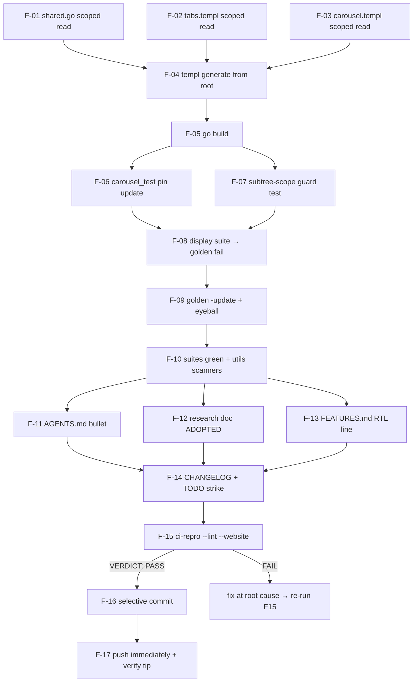

# Pareto Execution Plan — RTL Subtree Direction Scoping (TODO #372)

**Created:** 2026-10-08 20:00 CEST
**Scope:** execute ALL actionable todos from the 2026-10-08 shadcn-templ
DirectionProvider research (`docs/research/direction-context-propagation.md`).
One code finding (TODO_LIST #372), its test/golden/guard fallout, docs sync,
verification, ship (commit + push per operator instruction).
**Input artifacts:** `docs/research/direction-context-propagation.md` ·
`TODO_LIST.md` #372 · `display/shared.go:384` · `display/tabs.templ:222` ·
`display/carousel.templ:159` · `display/carousel_test.go:34` ·
`display/testdata/dropdown_basic.golden`.

---

## Guardrails (VERSCHLIMMBESSERN protection)

1. **Parallel session is live.** Uncommitted `CHANGELOG.md`, `README.md`,
   `visualtest/testdata/routes/*.png` (forms/users light+dark+rtl) are the
   18:50 wave-1 session's docs-count fixes and PNG re-baselines — NOT ours.
   Never revert, never restage; stage OUR files selectively. `CHANGELOG.md` is
   shared (we must add an entry there) — its parallel hunks ride along; they
   are finished docs-count corrections, judged safe.
2. **Master is ahead 8** (daemon/parallel-session commits, unpushed). Our push
   ships those too — normal for this repo; CI validates them.
3. **Daemon races:** re-check edits survived before committing
   (`git log -1 -- <file>` moving backward = incident class 6); re-verify the
   tip before push (`git status -sb`).
4. **`.templ` edits** (tabs, carousel) require `nix develop -c templ generate
   ./...` FROM THE REPO ROOT (v0.3.1020 pin; CWD-encoded FileName paths).
5. **Golden `-update` goes AFTER the package list** (go1.26.7 flag trap);
   eyeball every `.golden` diff.
6. **Pre-commit Guard 8 self-heals** `cmd/tc/_sources/display/{tabs,carousel}.templ`
   byte-mirrors — expect them auto-staged into the commit.
7. **M03 ritual:** `scripts/ci-repro.sh --lint --website` at the exact commit,
   then push IMMEDIATELY. Never run concurrently with `nix run .#visual`.
8. **No release:** lands in `[Unreleased]`; no version triple-bump.
9. **Scope fence:** no Go ctx direction provider, no API changes, no new
   component surface (research doc's rejected list stands).

---

## Pareto breakdown

| Tier    | Share of value | Tasks                                                                        | Why                                                                                               |
| ------- | -------------- | ---------------------------------------------------------------------------- | ------------------------------------------------------------------------------------------------- |
| **1%**  | **51%**        | The three scoped `dir` reads                                                 | Fixes the ONLY correctness gap found: RTL subtree in LTR page (and inverse) got backwards arrows. |
| **4%**  | **64%**        | + string-pin test update, golden re-baseline, regenerate/build               | Without these the suite is red and the fix is unshippable; all mechanical.                        |
| **20%** | **80%**        | + regression guard test, docs sync (AGENTS/research/FEATURES/CHANGELOG/TODO) | Makes the invariant permanent (guard) and the knowledge durable (docs).                           |
| rest    | **100%**       | + ci-repro verdict, commit, push, post-push checks                           | Shipping; plus the explicit e2e waiver (deferred, tracked).                                       |

---

## LEVEL 1 — Comprehensive plan (tasks ≤60 min, ALL todos, sorted by impact)

| #     | Task                                                                                                                                                                                            | Tier | Est   | Depends |
| ----- | ----------------------------------------------------------------------------------------------------------------------------------------------------------------------------------------------- | ---- | ----- | ------- |
| L1-01 | **Core fix:** element-scoped `dir` resolution in menuKeyboardNavJS (`display/shared.go`), Tabs (`display/tabs.templ`), Carousel (`display/carousel.templ`)                                      | 1%   | 20min | —       |
| L1-02 | **Regenerate + build:** `templ generate` from root (pinned dev shell), `go build ./...`                                                                                                         | 4%   | 15min | L1-01   |
| L1-03 | **Test sync:** update `carousel_test.go` string pin; add `TestRTLDirectionReadsAreSubtreeScoped` guard (bans legacy page-scoped read); display suite green; re-baseline `dropdown_basic.golden` | 4%   | 30min | L1-02   |
| L1-04 | **Docs sync:** AGENTS.md RTL bullet, research doc → ADOPTED, FEATURES.md RTL line (also fixes stale bare `start-`/`end-` mention), CHANGELOG `[Unreleased]`, strike TODO #372                   | 20%  | 30min | L1-03   |
| L1-05 | **Verify & ship:** guard family runs, `ci-repro --lint --website`, selective commit, immediate push, post-push verify                                                                           | rest | 45min | L1-04   |

## LEVEL 2 — Fine breakdown (≤12 min each, ALL todos, with verify steps)

| #    | Task (≤12min)                                                                                                                                                                              | L1    | Verify                                                                   |
| ---- | ------------------------------------------------------------------------------------------------------------------------------------------------------------------------------------------ | ----- | ------------------------------------------------------------------------ |
| F-01 | `shared.go:384`: `var isRtl=(menu.closest('[dir]')\|\|document.documentElement).getAttribute('dir')==='rtl';`                                                                              | L1-01 | read diff                                                                |
| F-02 | `tabs.templ:222`: `var rtl = (tab.closest('[dir]') \|\| document.documentElement).getAttribute('dir') === 'rtl';`                                                                          | L1-01 | read diff                                                                |
| F-03 | `carousel.templ:159`: `var rtl=(c.closest('[dir]')\|\|document.documentElement).getAttribute('dir')==='rtl';`                                                                              | L1-01 | read diff                                                                |
| F-04 | `nix develop -c templ generate ./...` from repo root; confirm only tabs/carousel `*_templ.go` diffs                                                                                        | L1-02 | `git diff --stat '*_templ.go'`                                           |
| F-05 | `go build ./...`                                                                                                                                                                           | L1-02 | exit 0                                                                   |
| F-06 | `carousel_test.go:34` pin → `c.closest('[dir]')\|\|document.documentElement`                                                                                                               | L1-03 | read diff                                                                |
| F-07 | New `display/rtl_direction_scope_test.go`: 3 sources must contain `closest('[dir]')`; after stripping `\|\| documentElementfallbacks`, NO `documentElement.getAttribute('dir')` may remain | L1-03 | `go test ./display/ -run TestRTLDirectionReadsAreSubtreeScoped -count=1` |
| F-08 | `go test ./display/... -count=1` → expect `dropdown_basic` golden fail (known)                                                                                                             | L1-03 | fail ONLY on dropdown_basic                                              |
| F-09 | `go test ./display/... -update` (flag AFTER package list); eyeball golden diff (JS text only)                                                                                              | L1-03 | `git diff display/testdata`                                              |
| F-10 | Re-run display suite green; run `utils` scanners (`TestRTLLogicalProperties`, `TestDocsCountDrift`, `TestDarkMode`)                                                                        | L1-03 | exit 0                                                                   |
| F-11 | AGENTS.md RTL-keyboard-mapping bullet → scoped form + guard name                                                                                                                           | L1-04 | rg check                                                                 |
| F-12 | Research doc: Status → ADOPTED (2026-10-08); "Our current model" + "Adopted" sections reflect shipped form                                                                                 | L1-04 | read diff                                                                |
| F-13 | FEATURES.md RTL/i18n bullet → scoped direction + drop banned bare `start-`/`end-` from the logical-set enumeration                                                                         | L1-04 | rg check                                                                 |
| F-14 | CHANGELOG `[Unreleased]` → Fixed entry; TODO_LIST #372 → struck done (repo convention)                                                                                                     | L1-04 | `TestVersionMatchesChangelog` + rg                                       |
| F-15 | `scripts/ci-repro.sh --lint --website` → `VERDICT: PASS`                                                                                                                                   | L1-05 | verdict line                                                             |
| F-16 | Selective `git add` (OUR files only; CHANGELOG shared-hunks accepted per guardrail 1) → detailed commit (pre-commit hook syncs `_sources`)                                                 | L1-05 | `git status` after commit; remove re-added ignore line if any            |
| F-17 | Push IMMEDIATELY after verdict (daemon may interleave README/PNG commit — that ships too, per guardrail 2); post-push `git status -sb` + remote tip check                                  | L1-05 | `origin/master` == tip                                                   |

---

## Execution graph

---

## Waivers

- **Browser e2e proof (RTL subtree in LTR page):** `visualtest` is mid
  chromedp v0.20.1 generic-API migration (TODO #370: module does not compile
  mid-migration). Waived per the plan-authoring checklist ("wired⇒e2e OR
  waiver"); rides the next full `nix run .#visual` pass together with #370's
  deferred captures. The string-pin test (F-06) plus the guard (F-07) prove
  the shipped form meanwhile.
- **No release:** change is backward-compatible bug-fix surface (markup
  unchanged, JS behavior only under subtree `dir`); ships in the next cut's
  `[Unreleased]`.
