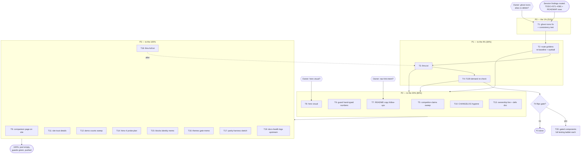

# Pareto Recovery Plan — docs & competitor-truth cleanup (2026-10-08 evening)

**Created:** 2026-10-08 21:20 CEST
**Author:** Crush session (docs-health HARVEST + pareto-planning)
**Inputs:** `docs/status/2026-10-08_19-57_*` §f (40 items), `docs/status/2026-10-08_20-45_*` §f (40 items), TODO_LIST #371–#381 (harvested this evening), ROADMAP "Competitor-signal & distribution ideas" (harvested this evening).
**Scope:** every open item discovered by this session. Pre-existing TODO_LIST residents (#335, #368–#370, …) are NOT re-planned — they have their own home and owners.

## Non-negotiable guardrails (Verschlimmbesser-prevention)

1. `TestDocsCountDrift` + `TestVersionMatches*` green after EVERY task; full `utils` suite before any commit that touches Go.
2. Never touch the parallel session's in-flight files (staged CHANGELOG echarts entry, datastar `*_templ.go` regenerations, its status reports).
3. Route, don't duplicate: single-source counters stays in ROADMAP ("Counts truth table" row, 2026-09-19) — this plan only REFERENCES it (task T6 pins the cheap half).
4. Every task ≤ 100 min; if it overflows, it splits. Every subtask ≤ 12 min.
5. Site-route pixel goldens: never `-update` on a red non-update read (load-flake class, AGENTS 2026-09-23).

## Value axis (what "result" means here)

1. **User-facing correctness risk removed** (bugs a consumer can hit today)
2. **Regression prevention** (the drift classes that already shipped once)
3. **Adoption/sales leverage** (what makes evaluators pick us)

---

## Step 1 — Pareto breakdown

### The 1% that delivers 51% — the one task that matters most

**T1 — Fix the 3 ghost icon constants (`ArrowPath`, `Bars3`, `HandThumbUp`) + add the constants↔`iconPathData` consistency test.**
This is the only live, consumer-hittable **bug** in the entire pool (silent wrong glyph today), and the test kills the class forever. Everything else in this plan is hygiene, leverage, or prevention; this is the product.

### The 4% that delivers 64% — add three more

| Add                                                          | Why it clears the bar                                                                                                                                                                |
| ------------------------------------------------------------ | ------------------------------------------------------------------------------------------------------------------------------------------------------------------------------------ |
| **T2** Re-baseline site route goldens + siteshots eyeball    | The production site's landing/sales changed materially tonight (matrix rewrite, counts); pixel truth must be re-pinned while the chromedp migration is freshly landed.               |
| **T3** Ship `llms.txt`                                       | The single cheapest adoption lever found (shadcn-templ markets "AI-Ready"; ours 404s). Pure addition, zero risk.                                                                     |
| **T4** Re-run the F109 demand check with competitor evidence | Unblocks/decides 5 gated components (Command palette, MultiSelect, TreeView, DateRangePicker, FileDrop) with fresh 1.7k★-competitor evidence — highest decision leverage per minute. |

### The 20% that delivers 80% — add the prevention + trust tier

T5 competitor-claims sweep (kills remaining templUI/Alpine falsehoods repo-wide) · T6 guard the hand-typed numbers (the fixed drift can never return silently) · T7 README copy follow-ups (copy-edit, "CSP-safe" wording, nav intent, render check) · T8 hero visual (ogshot, evergreen) · T10 CHANGELOG hygiene (Toggle duplicate + duplicate-title lint) · T13 AGENTS ownership line + counter-definitions doc · plus the ci-repro-before-push ritual on every push.

### The remaining 80% (to 100%)

Mirror `docs/comparison.md` onto the website (T9) · site trust details (T11: verified-caption const, sitemap lastmod, search-index snippets) · demo prose counts sweep (T12) · ROADMAP spikes: htmx-4 probe (T14), installable-blocks identity memo (T15), themes demand memo (T16), parity-harness analogue (T17), llms-full.txt (T18) · cross-repo docs-health legs (T19) · gated component builds ONLY if T4 flips the gate (T20).

---

## Step 2 — Comprehensive plan (30–100 min tasks, ALL items)

Sorted by importance/impact/effort/customer-value. "Tier" = Pareto tier. TODO refs = rows routed tonight.

| #   | Task (30–100 min)                                                                                                                                                                        | Tier    | TODO      | Impact      | Effort   | Value                                           |
| --- | ---------------------------------------------------------------------------------------------------------------------------------------------------------------------------------------- | ------- | --------- | ----------- | -------- | ----------------------------------------------- |
| T1  | Fix ghost icons: grep consumers → decide alias-vs-delete → add `iconPathData` entries or remove constants → add constants↔pathData consistency test → goldens if rendered output changed | **1%**  | #371      | 🔴 Critical | 60–90m   | Kills the only live user-facing bug + the class |
| T2  | Re-baseline `/` + `/sales` route goldens (`nix run .#visual` green read first, then `-update`) + siteshots eyeball of the matrix on mobile                                               | **4%**  | #374      | 🟠 High     | 45m      | Pixel truth re-pinned post-rewrite              |
| T3  | Ship `llms.txt` from the SSG (components/icons/enums via `CountStats`, docs TOC via search-index machinery) + verify route + add link                                                    | **4%**  | #375      | 🟠 High     | 60–90m   | AI-distribution channel                         |
| T4  | F109 demand re-check memo: shadcn-templ evidence vs the 22-repo survey → flip/hold each gated component; update #217                                                                     | **4%**  | #217      | 🟠 High     | 30m      | Unblocks/decides 5 components                   |
| T5  | Competitor-claims sweep: ROADMAP, FEATURES, docs/*, 100-IMPROVEMENT-IDEAS, STANDOUT-IDEAS, SUPERB-FOR-PERSONAL-USE + re-verify-cadence note in `docs/comparison.md`                      | **20%** | #376      | 🟠 High     | 45m      | Kills remaining falsehoods                      |
| T6  | Guard hand-typed numbers: TestDocsCountDrift patterns (README Packages/Tests, UseCases "23") + `statsDirs` pin test + test-count definition label                                        | **20%** | #377      | 🟠 High     | 60m      | Drift class closed                              |
| T7  | README copy follow-ups: copy-editing pass, "CSP-safe"→verify/soften, nav-link intent (needs answer Q2), GitHub render eyeball                                                            | **20%** | #378      | 🟡 Med      | 45m      | Front-door polish                               |
| T8  | README hero visual: ogshot home card, EVERGREEN text, wire into README (needs answer Q1)                                                                                                 | **20%** | #379      | 🟡 Med      | 60–90m   | Conversion centerpiece                          |
| T9  | Mirror `docs/comparison.md` as rendered website docs page                                                                                                                                | 80%     | #380      | 🟡 Med      | 60m      | Sales surface on-site                           |
| T10 | CHANGELOG hygiene: reconcile Toggle duplicate (when unblocked) + duplicate-title lint idea                                                                                               | **20%** | #381      | 🟡 Med      | 30m      | Split-brain removed                             |
| T11 | Site trust details: "verified 2026-10-08" caption const under matrix, sitemap lastmod for `/sales`, search-index snippet check                                                           | 80%     | plan-only | ⚪ Low      | 45m      | Honesty surfacing                               |
| T12 | Demo prose counts sweep (hand-typed component/icon numbers outside the guard-pinned hero)                                                                                                | 80%     | plan-only | ⚪ Low      | 30m      | Consistency                                     |
| T13 | AGENTS ownership line (competitor facts live in `docs/comparison.md` + `data.go` only) + counter-definitions doc                                                                         | **20%** | plan-only | 🟡 Med      | 30m      | Encodes tonight's lesson                        |
| T14 | ROADMAP spike: htmx-4 compatibility probe plan (event renames vs our attribute surface)                                                                                                  | 80%     | ROADMAP   | 🟡 Med      | 60m      | Future-proofing                                 |
| T15 | ROADMAP spike: installable-blocks identity memo (module-only vs hybrid; `tc add` shape)                                                                                                  | 80%     | ROADMAP   | 🟡 Med      | 60m      | Strategy input                                  |
| T16 | ROADMAP memo: style-themes demand gate criteria                                                                                                                                          | 80%     | ROADMAP   | ⚪ Low      | 30m      | Strategy input                                  |
| T17 | ROADMAP spike: parity-harness analogue (pinned reference renders)                                                                                                                        | 80%     | ROADMAP   | ⚪ Low      | 60–90m   | Idea refinement                                 |
| T18 | llms-full.txt (full docs corpus) after T3                                                                                                                                                | 80%     | ROADMAP   | ⚪ Low      | 60m      | AI-readiness depth                              |
| T19 | Cross-repo: docs-health VERIFY legs (external-claims + per-doc fitness) via crush-config PR                                                                                              | 80%     | ROADMAP   | 🟡 Med      | 45m      | Class prevention upstream                       |
| T20 | GATED: build Command palette et al. — ONLY if T4 flips the gate (full testing ladder each)                                                                                               | gated   | #217      | 🟠 High     | 100m+ ea | Feature                                         |

## Step 3 — Fine breakdown (≤ 12 min subtasks, ALL items)

Same sort order. "Parent" = Step-2 task. Micro-items that never got TODO rows are marked _(plan-only)_.

| #    | Subtask (≤ 12 min)                                                                                              | Parent | Done-when                          |
| ---- | --------------------------------------------------------------------------------------------------------------- | ------ | ---------------------------------- |
| 1.1  | Grep go-cqrs-lite + cqrs-htmx for `ArrowPath`/`Bars3`/`HandThumbUp` usage                                       | T1     | usage list in hand                 |
| 1.2  | Decide alias-vs-delete from 1.1 (owner input if ambiguous)                                                      | T1     | decision recorded in #371          |
| 1.3  | If alias: add 3 `iconPathData` entries referencing canonical paths                                              | T1     | `icons.Icon()` renders real glyphs |
| 1.4  | If delete: remove 3 constants + fix any in-repo usage                                                           | T1     | build green                        |
| 1.5  | Add `TestIconConstantsHavePathData` (walk exported Name consts ↔ map; Spinner exempt)                           | T1     | test red on revert, green on fix   |
| 1.6  | Run icons package tests + regenerate goldens if SVG output changed                                              | T1     | full icons suite green             |
| 1.7  | Update TODO #371 → done + CHANGELOG Fixed entry                                                                 | T1     | changelog warm                     |
| 2.1  | `nix run .#visual` (green read; no `-update`) and list failing site routes                                      | T2     | failure list captured              |
| 2.2  | If red ONLY from tonight's content: re-run with `-update`; if layout-broken: fix first                          | T2     | goldens re-baselined               |
| 2.3  | `siteshots` landing + sales, light+dark+mobile; eyeball matrix wrap                                             | T2     | screenshots reviewed               |
| 2.4  | Note results on TODO #374 → done                                                                                | T2     | row struck                         |
| 3.1  | Read `website/internal/build` search-index machinery + decide llms.txt shape                                    | T3     | shape noted                        |
| 3.2  | Add `build.LLMSIndex()` (catalog from `CountStats` + docs TOC) + fixture test                                   | T3     | test green                         |
| 3.3  | Emit `/llms.txt` route + sitemap entry                                                                          | T3     | route serves 200                   |
| 3.4  | Link llms.txt from docs footer/header + CHANGELOG Added entry                                                   | T3     | committed                          |
| 3.5  | `cd website && go test ./...` + curl the route locally                                                          | T3     | all green                          |
| 4.1  | Collect evidence: shadcn-templ components vs our gated list                                                     | T4     | table in memo                      |
| 4.2  | Write flip/hold verdict per gated component into #217                                                           | T4     | #217 updated                       |
| 4.3  | If any flip: move to TODO Open with full-ladder note (T20 gated tasks)                                          | T4     | routed                             |
| 5.1  | grep -ri 'templui\|alpine' ROADMAP.md FEATURES.md docs/ (excl. archived)                                        | T5     | hit list                           |
| 5.2  | Fix each hit with dated facts or delete stale claims                                                            | T5     | zero stale hits                    |
| 5.3  | Add re-verify cadence line to docs/comparison.md header                                                         | T5     | note committed                     |
| 6.1  | Add TestDocsCountDrift patterns: README Packages/Tests rows                                                     | T6     | red on wrong number                |
| 6.2  | Add UseCases "23 form components" + comparison.md internals patterns                                            | T6     | same                               |
| 6.3  | Website build test pinning `statsDirs` == canonical 9-package list                                              | T6     | red on reorder                     |
| 6.4  | Label test-count definition beside README row                                                                   | T6     | definition visible                 |
| 6.5  | `go test ./utils/ ./website/...` green                                                                          | T6     | green                              |
| 7.1  | copy-editing pass over README intro→How-It-Compares                                                             | T7     | tightened copy                     |
| 7.2  | Verify ThemeScript("") CSP behavior; soften hero line if needed                                                 | T7     | claim accurate                     |
| 7.3  | Apply nav-link decision (needs Q2 answer)                                                                       | T7     | link intent resolved               |
| 7.4  | GitHub-render eyeball: badges, 4-col table mobile, anchors                                                      | T7     | no overflow                        |
| 8.1  | Regenerate home card via ogshot (EVERGREEN text, 1200×630)                                                      | T8     | asset produced                     |
| 8.2  | Commit asset + wire into README below hero code                                                                 | T8     | renders on GitHub                  |
| 8.3  | Delete/replace stale og/home.png or leave site OG separate (decide)                                             | T8     | no stale asset shipped             |
| 9.1  | Port docs/comparison.md → website/content/docs/comparison.md (frontmatter)                                      | T9     | page renders                       |
| 9.2  | Re-point related-projects.md link to the on-site page                                                           | T9     | internal link                      |
| 9.3  | Run website suite (link checker catches drift)                                                                  | T9     | green                              |
| 10.1 | When parallel session lands: merge Toggle entries into one                                                      | T10    | one entry                          |
| 10.2 | Prototype duplicate-title check for [Unreleased] (script or test)                                               | T10    | detects the Toggle class           |
| 11.1 | Add `verified` caption const under site matrix                                                                  | T11    | rendered                           |
| 11.2 | Check sitemap lastmod source for `/sales`; fix if `data.go`-blind                                               | T11    | lastmod honest                     |
| 11.3 | Search-index snippet spot-check for related-projects                                                            | T11    | snippets sane                      |
| 12.1 | Grep demo .templ/.go for hand-typed icon/enum counts                                                            | T12    | hit list                           |
| 12.2 | Fix or route each hit (guard patterns if stable)                                                                | T12    | clean                              |
| 13.1 | AGENTS.md: competitor-facts ownership line                                                                      | T13    | line added                         |
| 13.2 | Counter-definitions doc section (components/icons/tests definitions + where computed)                           | T13    | section added                      |
| 14.1 | Read htmx 4 beta changelog + shadcn-templ #616 notes                                                            | T14    | diff summary                       |
| 14.2 | Write probe plan (attribute surface vs 4.x renames) into ROADMAP row                                            | T14    | plan linked                        |
| 15.1 | Draft installable-blocks memo: `tc add` shape, ownership tradeoffs                                              | T15    | memo in ROADMAP/docs               |
| 15.2 | Route decision request to owner                                                                                 | T15    | question logged                    |
| 16.1 | Style-themes demand-gate criteria memo → ROADMAP row                                                            | T16    | criteria written                   |
| 17.1 | Sketched parity-harness analogue: what's pinned, what's diffed                                                  | T17    | sketch in ROADMAP row              |
| 18.1 | llms-full.txt generator after T3 (docs corpus, deterministic)                                                   | T18    | route + test                       |
| 19.1 | crush-config branch: docs-health VERIFY external-claims + fitness legs                                          | T19    | PR opened                          |
| 19.2 | Cross-link the lesson (19:57/20:45 reports §e) in the PR                                                        | T19    | provenance cited                   |
| 20.x | Per flipped component: spec → templ → props/enum → goldens → a11y → e2e (full ladder, one ladder per component) | T20    | only if T4 flips                   |

## Execution graph

## Provenance

- Findings: `docs/status/2026-10-08_19-57_docs-health-readme-usvsx-competitor-fixes.md`, `docs/status/2026-10-08_20-45_readme-fitness-conversion-pass.md`
- Routed rows: TODO_LIST #371–#381 (this evening), #217 (evidence appended), ROADMAP "Competitor-signal & distribution ideas"
- Skills: docs-health (HARVEST), pareto-planning (tiers, tables), copywriting (T7 context)
- Guardrails: AGENTS.md M03 push ritual; `.golangci.yml` disabled-linters policy untouched
