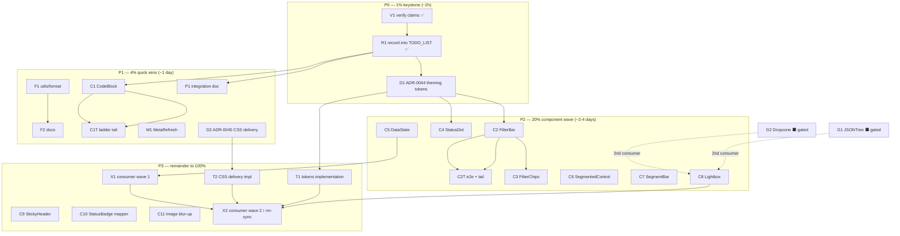

# Extraction-Backlog Pareto Master Plan (2026-10-10 06:06)

**Origin:** 4-project component-extraction analysis (DiscordSync, mr-sync, nsfw-classifier,
dnsblockd) — findings in `docs/status/2026-10-10_05-51_extraction-analysis-four-projects.md`.
This plan converts that analysis into an executable, prioritized backlog. All load-bearing
claims were **source-verified on 2026-10-10 06:06–06:10** (see Evidence).
Consumer-side runbook: `docs/integration/extraction-analysis.md`.

**Anti-verschlimmbesser contract:** no speculative rewrites; every task follows the repo's
testing ladder; demand gates (#217) are respected — gated items stay parked until a second
consumer appears. Templ pin stays v0.3.1020; go.mod pseudo-version pins stay as-is; `go test
-update` goes AFTER the package list; demo CSS recompiled after any new `@container`/variant
classes; docs-count guard (`utils.TestDocsCountDrift`) satisfied in the same commit as any
component add; CHANGELOG `[Unreleased]` stays warm.

---

## Verified evidence (spot-checked at source, this session)

| # | Claim | Source | Verdict |
|---|-------|--------|---------|
| E1 | mr-sync `commandLine` = code + copy button (CodeBlock 2nd demand signal) | `mr-sync/cmd/mr-sync/dashboard_components.templ:11` | ✅ CONFIRMED |
| E2 | DiscordSync hand-rolls `filterForm`/`filterSelect` family + `copyIDRow` | `DiscordSync/internal/web/filters.templ:391–434` | ✅ CONFIRMED |
| E3 | dnsblockd honesty-ladder duplication | 9 `art-dupl:accept` markers across 4 view files (e.g. `devices_page.templ:177–183`) | ✅ CONFIRMED |
| E4 | Theming gap: library hardcodes blue/amber, consumers override via CSS hacks | `DiscordSync/internal/web/static/input.css:184–186` (comment admits it verbatim) | ✅ CONFIRMED |
| E5 | Stale consumer pins | nsfw-classifier v1.21.0, dnsblockd v1.19.4, DiscordSync v1.19.4 (all go.mod) | ✅ CONFIRMED |
| E6 | Zero-JS filter chips exist as a pattern | `nsfw-classifier/internal/server/views/history_page.templ:105` (`historyChip`) | ✅ CONFIRMED |
| E7 | CSS-scan friction: 3 different consumer mechanisms | DiscordSync vendor-dir `@source` (input.css:5), nsfw `third_party/_css-scan` + sync script, dnsblockd `library-classes.txt` + regen script | ✅ CONFIRMED |

**Decisions made this session (closing the status report's open questions):**

1. **Record now** — gate evidence goes into `TODO_LIST.md` this session (skill-mandated harvest;
   also fixes the prior session's "didn't record" failure).
2. **Sequencing** — ADR *decisions* first (cheap, shape every build), then cheap high-demand
   components (format/CodeBlock), FilterBar leads the component wave; token *implementation*
   is deferred but every new component is designed token-compatible (no new hardcoded accents).
3. **mr-sync** — recommendation: migrate to Tailwind + library (small dashboard, near-total
   duplication of existing components). Final call is owner-gated ⫱ (like PapDashboard in #156).

---

## Pareto breakdown

### The 1% that deliver 51% — trust the foundation (≈2h)

**R1 + V1 + D1** — verify claims at source, record gate-flip evidence into TODO_LIST, and make
the theming-token DECISION. Everything downstream builds on verified evidence and recorded
decisions; without R1 the gate flips are session-only knowledge that evaporates; without D1
every new component would hardcode the same blue that three consumers are already hacking
around.

### The 4% that deliver 64% — cheap, gate-ready wins (≈1 day)

**F1/F2 (utils/format)** + **C1/C1T (CodeBlock — gate already flipped, E1)** + **M1
(MetaRefresh)** + **D2 (CSS-delivery ADR)**. Three consumers already hand-roll these helpers;
CodeBlock has two named consumers + the docserver precedent.

### The 20% that deliver 80% — the demand-proven component wave (≈2–4 days)

**C2/C2T FilterBar** (strongest demand: 2 strong + 2 variant consumers) → **C5 DataState**
(9 accepted-duplication markers in ONE consumer) → **C4 StatusDot** (3 consumers) → **C3
FilterChips** (zero-JS differentiator) → **C6 SegmentedControl**, **C7 SegmentBar**,
**C8 Lightbox** (2 consumers each).

### The other 80% (→100% of the result)

Small flag/field additions (C9–C11), the two ADR *implementations* (T1/T2 — big, post-decision),
consumer-side migrations in the four repos (X1/X2 — includes deleting the three CSS bridges and
the mirror scripts once T1/T2 land), gated items (G1/G2), and the integration doc (P1).

---

## Level 1 — comprehensive plan (25 active tasks, 30–100 min each, +2 parked)

Sorted by importance/impact/effort/customer-value. Status: ⬜ open, ✅ done this session,
⫱ owner gate, ⬛ parked (demand gate).

| # | ID | Task | Tier | Impact | Effort | Customer value | Depends | Status |
|---|----|------|------|--------|--------|----------------|---------|--------|
| 1 | R1 | Record gate evidence + harvest backlog into TODO_LIST.md (#328 flip, #217 update, IDs 388–400) | 1% | Critical | 30m | All future sessions start from truth | V1 | ✅ done 06:2x |
| 2 | V1 | Source-verify the 7 load-bearing claims (E1–E7) | 1% | Critical | 30m | Prevents building on agent hearsay | — | ✅ done 06:06 |
| 3 | D1 | ADR-0044: semantic theming tokens (`--tc-accent-*`) — decision + scope, NOT implementation | 1% | High | 90m | Deletes 3 consumer CSS bridges (E4); shapes all builds | R1 | ✅ done |
| 4 | F1 | `utils/format`: FormatBytes/Duration/Percent/StringOrDash/CompactCount + tests + bench | 4% | High | 90m | 3 consumers hand-roll these today | — | ✅ done |
| 5 | C1 | `display.CodeBlock` core: props, templ, CopyButton integration, goldens | 4% | High | 90m | Gate flipped (E1); 2 named consumers + docserver | R1 | ✅ done |
| 6 | C1T | CodeBlock ladder tail: demo, docs counts, tc mirror, CHANGELOG | 4% | Med | 45m | Completes the ladder (plan-authoring checklist) | C1 | ✅ done |
| 7 | C2 | `forms.FilterBar` core: sticky auto-submit composition, Reset, noscript | 20% | Critical | 90m | Strongest demand signal (E2 + dnsblockd) | D1 (token-ready) | ✅ done |
| 8 | C2T | FilterBar tail: e2e both transports, axe, demo, counts, tc, CHANGELOG | 20% | High | 60m | wired⇒e2e rule | C2 | ✅ done |
| 9 | C5 | `display.DataState` ladder (disabled→unavailable→empty→content) | 20% | High | 60m | 9 dup markers in one consumer (E3) | — | ✅ done |
| 10 | C4 | `display.StatusDot`/LivePill (pulse + motion-reduce, latency sub) | 20% | High | 60m | 3 consumers hand-roll status dots | D1 | ✅ done |
| 11 | C3 | `forms.FilterChips` (link/query-param, zero JS) | 20% | Med | 60m | Zero-JS/SEO filter differentiator (E6) | C2 (design kinship) | ✅ done |
| 12 | C6 | `forms.SegmentedControl` (link or submit single-select group) | 20% | Med | 60m | dnsblockd duration buttons + nsfw presets | — | ✅ done |
| 13 | C7 | `display.SegmentBar` (stacked proportion bar + legend, deterministic colors) | 20% | Med | 90m | mr-sync languages + nsfw evidence bars | — | ✅ done |
| 14 | C8 | `display.Lightbox` (native `<dialog>`, keyboard, zoom/rotate) | 20% | Med | 90m | DiscordSync thumbnails + nsfw viewer | — | ✅ done |
| 15 | D2 | ADR-0045: CSS delivery for consumers (bless vendor-`@source` vs class inventory vs compiled CSS) | 4% | High | 60m | 3 mirror mechanisms exist (E7); every new component deepens friction | R1 | ✅ done |
| 16 | F2 | utils/format docs: README/FEATURES/CHANGELOG, skill catalogue, docs-count guard | 4% | Med | 30m | Discoverability | F1 | ✅ done |
| 17 | P1 | `docs/integration/extraction-analysis.md`: verified findings + per-project adoption map | 4% | Med | 60m | Consumer-side migration runbook | V1, R1 | ✅ done |
| 18 | M1 | `layout.MetaRefresh` helper + tests + docs | 4% | Low | 30m | dnsblockd stale-session/retry meta tags | — | ✅ done |
| 19 | C9 | `Table.StickyHeader` flag + thead CSS + goldens + demo | rest | Low | 30m | DiscordSync `listTableWithHeader` | — | ✅ done |
| 20 | C10 | `StatusBadgeWith(mapper, status)` injectable mapper + tests | rest | Low | 30m | dnsblockd has 4 local mappers | — | ✅ done |
| 21 | C11 | `ImageProps` ThumbHash/blur-up field + demo + goldens | rest | Low | 60m | DiscordSync `imageThumbnail` blur-up | — | ✅ done |
| 22 | T1 | Theming tokens IMPLEMENTATION (per ADR-0044): custom.css tokens + class-swap batches + visual rebaseline + migration doc | rest | Critical | 100m | Deletes consumer bridges; likely version-plan gate (v2?) | D1 | ⬜ |
| 23 | T2 | CSS-delivery IMPLEMENTATION (per ADR-0045): inventory generator or blessed-pattern docs + consumer migration notes | rest | High | 100m | Deletes nsfw mirror script + dnsblockd regen | D2 | ⬜ |
| 24 | X1 | Consumer wave 1 (other repos): dnsblockd bump v1.19.4→current + SidebarNav swap + DataState adoption; DiscordSync adopt ExternalLink/CollapsibleSection | rest | High | 100m | Real consumers get real wins (E5) | C5; dnsblockd release | ⬜ |
| 25 | X2 | Consumer wave 2 (other repos): DiscordSync chart migration + bridge deletion (post-T1); nsfw SurfaceNav check + Lightbox adoption + mirror deletion (post-T2); mr-sync decision ⫱ + migration | rest | High | 100m | Pays off the whole plan in the consumers | C8, T1, T2 | ⬜ |
| P1 | G1 | `display.JSONTree` — recursive `
` JSON viewer | parked | Med | 90m | 1 consumer (DiscordSync) — #217 gate: needs 2nd | second consumer | ⬛ |
| P2 | G2 | `forms.Dropzone` — file drop area | parked | Med | 90m | 1 consumer (nsfw) — #217 HOLD confirmed | second consumer | ⬛ |

**Effort sum (active):** ~23.5h of focused work ≈ 3–4 focused days.

---

## Level 2 — fine-grained breakdown (128 micro-tasks, each ≤12 min)

Every Level-1 task split into executable steps. A "component ladder" step set is the same for
every component (spec → props/enum+IsValid → templ → tests/goldens → e2e where wired →
a11y/axe entry → demo page → docs counts + tc mirror → CHANGELOG).

### P0 — Keystone (1% tier)

| ID | Micro-task | Min | Parent |
|----|-----------|-----|--------|
| V1a–V1f | 7 source spot-checks (E1–E7) | 5 ea | V1 ✅ |
| R1a | Annotate TODO #328 with gate-flip evidence | 10 | R1 ✅ |
| R1b | Append demand evidence to TODO #217 | 10 | R1 ✅ |
| R1c | Append Harvested section, IDs 388–400 | 12 | R1 ✅ |
| R1d | Fix TODO header (date, next-free-ID) | 3 | R1 ✅ |
| D1a | Inventory hardcoded accent classes per package (grep counts: blue-600 sites etc.) | 12 | D1 |
| D1b | Design token API: `--tc-accent-{50..900}` + `@theme` mapping strategy | 12 | D1 |
| D1c | Migration options: library-bridge layer vs component class swap vs consumer alias | 12 | D1 |
| D1d | Breaking-change assessment + version plan (v1 bridge / v2 swap) | 12 | D1 |
| D1e | Write ADR-0044 draft | 12 | D1 |
| D1f | ADR verdict + TODO routing (T1 scope) | 10 | D1 |
| D1g | Review pass: does the API answer DiscordSync input.css:184 verbatim? | 10 | D1 |

### P1 — Quick wins (4% tier)

| ID | Micro-task | Min | Parent |
|----|-----------|-----|--------|
| F1a | FormatBytes spec + table-driven impl | 12 | F1 |
| F1b | FormatBytes unit tests (edges: 0, 1.5KiB, EiB, negative) | 12 | F1 |
| F1c | FormatDuration (M:SS / H:MM:SS / d h) + tests | 12 | F1 |
| F1d | FormatPercent + tests (NaN, >100, rounding) | 10 | F1 |
| F1e | StringOrDash + FormatCompactCount + tests | 12 | F1 |
| F1f | Benchmarks (utils suite pattern) | 10 | F1 |
| F2a | README/FEATURES/skill catalogue rows + docs-count guard green | 12 | F2 |
| F2b | CHANGELOG `[Unreleased]` entry | 5 | F2 |
| C1a | CodeBlockProps spec (Code, Language, Label, ShowCopy, Variant: block/compactID) | 12 | C1 |
| C1b | templ render + CopyButton composition (E1/E2 shapes as reference) | 12 | C1 |
| C1c | Render tests + golden sweep (`-update` AFTER package list) | 12 | C1 |
| C1d | Compact-ID variant (truncated mono + copy, from `copyIDRow`) | 12 | C1 |
| C1e | Named constants (goconst) + gofmt/golines via `golangci-lint fmt` | 8 | C1 |
| C1f | Golden review + HTML validity | 10 | C1 |
| C1Ta | Demo page section + route entry (`pages.go` meta) | 12 | C1T |
| C1Tb | Docs counts: README 124→125, FEATURES, skill, website prose | 12 | C1T |
| C1Tc | tc mirror sync guard run | 5 | C1T |
| C1Td | CHANGELOG entry | 5 | C1T |
| M1a | MetaRefresh(delay, href) helper + attrs | 10 | M1 |
| M1b | Tests + demo/nop + docs row | 10 | M1 |
| M1c | CHANGELOG | 3 | M1 |
| D2a | Document the 3 consumer mechanisms precisely (E7) | 12 | D2 |
| D2b | Options: bless vendor-`@source` / ship class-inventory file / ship compiled CSS | 12 | D2 |
| D2c | Cost/lockstep analysis per option (release.sh, TestCSSFreshness interactions) | 12 | D2 |
| D2d | Write ADR-0045 + verdict | 12 | D2 |
| D2e | TODO routing (T2 scope) | 5 | D2 |

### P2 — Component wave (20% tier)

| ID | Micro-task | Min | Parent |
|----|-----------|-----|--------|
| C2a | Read recipe + DiscordSync `filterForm` source; finalize scope | 12 | C2 |
| C2b | FilterBarProps spec (children composition, Sticky, Reset, Target, Wire) | 12 | C2 |
| C2c | Sticky bar templ + auto-submit attrs (htmx + wire dialect) | 12 | C2 |
| C2d | Reset button + noscript fallback | 12 | C2 |
| C2e | FilterSelect composition (reuse forms.Select vs sub-template — ADR-0010 test) | 12 | C2 |
| C2f | Unit tests + goldens | 12 | C2 |
| C2g | Wire pins (dual-transport attrs) | 10 | C2 |
| C2Ta | E2E: auto-submit both transports (serial, pollBool helpers) | 12 | C2T |
| C2Tb | Axe sweep entry + route golden + theme pin | 12 | C2T |
| C2Tc | Demo page + pages.go meta | 12 | C2T |
| C2Td | Docs counts + tc mirror + CHANGELOG | 12 | C2T |
| C5a | DataStateState enum + IsValid + test | 10 | C5 |
| C5b | DataStateProps (per-state slots: Disabled/Unavailable/Empty + Content) | 12 | C5 |
| C5c | templ ladder + EmptyState composition | 12 | C5 |
| C5d | Goldens (4 states) | 10 | C5 |
| C5e | Demo + counts + tc + CHANGELOG | 12 | C5 |
| C4a | StatusDotProps (Tone, Pulse, Label, sub) + Tone reuse vs new enum | 12 | C4 |
| C4b | Pulse CSS in custom.css (`.tc-dot-pulse`, motion-reduce + forced-colors safe) | 12 | C4 |
| C4c | LivePill variant (text + dot, from dnsblockd staleness pills) | 12 | C4 |
| C4d | Goldens + dark-mode compliance test green | 10 | C4 |
| C4e | Demo + counts + tc + CHANGELOG | 12 | C4 |
| C3a | FilterChipsProps (Items: Label/Query/Active; base URL) + zero-JS href builder | 12 | C3 |
| C3b | templ (active state, aria-pressed vs aria-current decision) | 12 | C3 |
| C3c | Goldens + HTML validity (roleless aria rules!) | 10 | C3 |
| C3d | Demo + counts + tc + CHANGELOG | 12 | C3 |
| C6a | SegmentedControlProps (link mode vs radio-submit mode, ActiveValue) | 12 | C6 |
| C6b | templ (radio group a11y like Rating; forward DOM order rule) | 12 | C6 |
| C6c | Goldens + RTL check (logical properties!) | 10 | C6 |
| C6d | Demo + counts + tc + CHANGELOG | 12 | C6 |
| C7a | SegmentBarProps (Segments, deterministic palette keyed by label — reuse chart constants) | 12 | C7 |
| C7b | Percent-width geometry + legend templ | 12 | C7 |
| C7c | A11y (role=img + aria-label composition vs per-segment) | 10 | C7 |
| C7d | Goldens + dark-mode classes | 10 | C7 |
| C7e | Demo + counts + tc + CHANGELOG | 12 | C7 |
| C7f | Visual golden (proportions are pixel-relevant) | 12 | C7 |
| C8a | LightboxProps (Images, Captions, StartIndex, zoom/rotate flags) | 12 | C8 |
| C8b | Native `<dialog>` templ + trigger wiring (data-tc-lightbox) | 12 | C8 |
| C8c | CSS animations `@starting-style` + allow-discrete (`.tc-lightbox`) | 12 | C8 |
| C8d | Zoom/rotate singleton JS (CSP nonce, motion-reduce) | 12 | C8 |
| C8e | Keyboard/Escape/focus (native dialog) verification + tests | 10 | C8 |
| C8f | Goldens + nonce-empty regression (join integration table!) | 12 | C8 |
| C8g | E2E open/navigate/close | 12 | C8 |
| C8h | Demo + counts + tc + CHANGELOG | 12 | C8 |

### P3 — Remainder (→100%)

| ID | Micro-task | Min | Parent |
|----|-----------|-----|--------|
| C9a | TableProps.StickyHeader + thead CSS (bg for overlap) | 12 | C9 |
| C9b | Goldens + demo | 12 | C9 |
| C9c | Docs row + CHANGELOG | 5 | C9 |
| C10a | StatusBadgeWith(mapper, status) + tests (incl. fallback) | 12 | C10 |
| C10b | Docs row + CHANGELOG | 5 | C10 |
| C11a | ImageProps blur-up spec (Blurhash/Thumbhash string, decode stays consumer-side or tiny lib? NO dep — CSS-only placeholder) | 12 | C11 |
| C11b | Impl + goldens | 12 | C11 |
| C11c | Demo + docs + CHANGELOG | 10 | C11 |
| T1a | Define `--tc-accent-*` tokens in templates/custom.css + starter css mirrors | 12 | T1 |
| T1b | Swap display package accent classes (batch 1) | 12 | T1 |
| T1c | Swap forms/feedback batch | 12 | T1 |
| T1d | Swap layout/navigation batch | 12 | T1 |
| T1e | Dark-mode + RTL + motion guard suite green | 12 | T1 |
| T1f | Visual suite rebaseline decision (pixel diffs expected — re-baseline deliberately) | 12 | T1 |
| T1g | Migration doc + theming docs update | 12 | T1 |
| T1h | CHANGELOG + version plan per ADR | 8 | T1 |
| T2a | Implement per ADR-0045 (inventory generator or blessed-pattern docs) | 12 | T2 |
| T2b | Wire into release.sh / guards as decided | 12 | T2 |
| T2c | Docs page for consumers | 12 | T2 |
| T2d | Consumer migration notes (nsfw mirror deletion steps) | 12 | T2 |
| T2e | CHANGELOG | 5 | T2 |
| X1a | dnsblockd: bump v1.19.4→current, tidy, build | 12 | X1 |
| X1b | dnsblockd: SidebarNav swap + delete dashboardSidebar + goldens | 12 | X1 |
| X1c | dnsblockd: DataState adoption (delete ladder copies + art-dupl markers) | 12 | X1 |
| X1d | DiscordSync: adopt ExternalLink + CollapsibleSection | 12 | X1 |
| X1e | Per-repo commits/PRs (its own verify ritual) | 12 | X1 |
| X2a | DiscordSync: migrate hand-rolled charts → library charts | 12 | X2 |
| X2b | DiscordSync: delete vendor override CSS (post-T1) | 8 | X2 |
| X2c | nsfw: SurfaceNav vs library Nav determinism check | 10 | X2 |
| X2d | nsfw: adopt library Lightbox (post-C8) | 12 | X2 |
| X2e | nsfw: delete `_css-scan` mirror + sync script (post-T2) | 10 | X2 |
| X2f | mr-sync: decision doc ⫱ + migration kickoff if approved | 12 | X2 |
| G1* | (parked) JSONTree spec sketch only — no build until 2nd consumer | 0 | G1 |
| G2* | (parked) Dropzone — #217 HOLD, no build | 0 | G2 |
| P1a | Distill verified findings (E1–E7) into docs/integration/extraction-analysis.md | 12 | P1 |
| P1b | Per-project adoption map table (hand-rolled → library component) | 12 | P1 |
| P1c | CSS-delivery + theming sections (point at ADRs) | 10 | P1 |
| P1d | Link from TODO + this plan | 5 | P1 |

**Micro-task sum:** 128 (126 real + 2 parked placeholders) ≈ 22h — consistent with Level-1 estimate.

---

## Execution graph (mermaid)

## Verification & rituals (per component build)

1. Full ladder: spec → props/typed enum + IsValid + test → templ → unit + goldens (`-update`
   AFTER packages) → e2e if wired → axe sweep entry → demo page (`pages.go` + nonce!) →
   docs-count bumps in the SAME commit → tc mirror guard → CHANGELOG `[Unreleased]`.
2. Library guards must pass: dark-mode, RTL logical properties, motion-reduce, coarse-pointer,
   nonce omit-empty (new script emitters join `integration` render table), HTML validity.
3. Pre-push: `scripts/ci-repro.sh --lint --website` at the exact commit (M03 ritual), then push
   immediately; re-check `git status -sb` for daemon races first.
4. No new runtime deps (budget closed) — format helpers are hand-rolled tables, NOT go-humanize.

## Explicitly NOT in scope (anti-verschlimmbesser)

- No speculative MultiSelect/TreeView/Toast-positions builds (still zero demand).
- No templ v0.3.1070 bump (TODO #335 owns it).
- No `tc new` command resurrection, no new compiled CSS artifacts without in-repo consumers.
- No mass rewrite of consumer repos beyond the listed adoption waves — their owners gate it.
