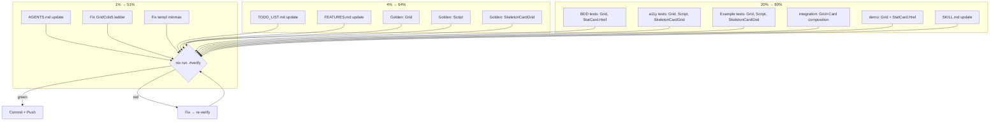

<!-- AUTO-UPDATED 2026-07-10: Retrospective status overlay -->

> ## 🔔 Update Notice — 2026-07-10
>
> This report is **historical**. Many items listed as "open", "todo", or "broken" below
> have since been **fixed and verified**. Do not act on open items without first checking
> [TODO_LIST.md](../../TODO_LIST.md) for current status.
>
> **Key fixes completed since this report:**
>
> - ✅ All 7 P0 bugs fixed (InlineLoadingOverlay a11y, SanitizeID mismatch, FromError fallback,
>   Footer BaseProps, ErrorPage/NotFound404 `<main>` landmark, CSRFTokenName, grid-rows verified)
> - ✅ `encoding/json/v2` purged from all production code + pre-commit guard added
> - ✅ Motion constants centralized in `utils/motion.go`, wired into 13 components
> - ✅ `FamilyFromErrorFamily` → `FromErrorFamily` (old name kept as deprecated alias)
> - ✅ `icons.IconRTL()` + CSS for directional icon RTL mirroring
> - ✅ 33 regression tests added (htmx, errorpage, layout, navigation, feedback, display)
> - ✅ Dark golden test infrastructure (badge/card/button)
> - ✅ CHANGELOG consolidated, ROADMAP updated, migration guide created
> - ✅ All 14 packages pass, 0 lint issues
>
> **Canonical source of truth:** [TODO_LIST.md](../../TODO_LIST.md) (52 items, 37 ✅ done, 12 deferred/blocked)

---

# Plan: Feedback-Driven Improvements Cleanup (Session 6b)

**Created:** 2026-07-05 03:21 CEST
**Goal:** Close all gaps from the self-review of session 6 — documentation debt, missing test lenses, design fixes.
**Constraint:** Do NOT break the build. Do NOT verschlimmbessern. Be surgical.

---

## Pareto Analysis

### 1% that delivers 51%

1. ~~**AGENTS.md update** — THE memory file. Without it, every future session is blind to Grid, Script, SkeletonCardGrid, GridCols, statCardInner, SimpleNav.RightItems.~~ done — AGENTS.md
2. ~~**Fix GridCols5 responsive ladder** — shipped code with a design flaw (jumps 2→5, skipping 3/4).~~ done — AGENTS.md
3. ~~**Fix templ minmax diagnostic** — 30-second fix for persistent lint hint.~~ done — AGENTS.md

### 4% that delivers 64% (adds)

4. ~~**TODO_LIST.md update** — record session 6 work so the backlog is accurate.~~ done — AGENTS.md
5. ~~**FEATURES.md update** — feature inventory honesty.~~ done — AGENTS.md
6. ~~**Golden tests for 3 new components** — regression baselines (Grid, Script, SkeletonCardGrid).~~ done — AGENTS.md

### 20% that delivers 80% (adds)

7. ~~**BDD + a11y tests** for new components (accessibility contracts must be tested).~~ done — AGENTS.md
8. ~~**Example tests** (godoc examples compile and render).~~ done — AGENTS.md
9. ~~**integration/composition_test.go** — Grid + Card composition proof.~~ done — AGENTS.md
10. ~~**examples/demo update** — Grid + StatCard.Href showcase.~~ done — AGENTS.md
11. ~~**SKILL.md update** — new patterns in decision trees.~~ done — AGENTS.md

---

## Execution Graph

---

## Task Breakdown (30–100 min tasks)

| #       | Task                                                                                     | Lens    | Impact   | Effort  | Deps   |
| ------- | ---------------------------------------------------------------------------------------- | ------- | -------- | ------- | ------ |
| ~~T1~~  | ~~Fix GridCols5 responsive ladder + templ minmax~~ done — display/grid.templ             | ~~1%~~  | ~~High~~ | ~~Low~~ | ~~—~~  |
| ~~T2~~  | ~~Update AGENTS.md conventions~~ done — AGENTS.md                                        | ~~1%~~  | ~~High~~ | ~~Med~~ | ~~—~~  |
| ~~T3~~  | ~~Update TODO_LIST.md (session 6 record)~~ done — TODO LIST.md                           | ~~4%~~  | ~~Med~~  | ~~Low~~ | ~~—~~  |
| ~~T4~~  | ~~Update FEATURES.md (new components/fields)~~ done — FEATURES.md                        | ~~4%~~  | ~~Med~~  | ~~Low~~ | ~~—~~  |
| ~~T5~~  | ~~Golden tests: Grid (all GridCols variants)~~ done — display/testdata                   | ~~4%~~  | ~~High~~ | ~~Low~~ | ~~T1~~ |
| ~~T6~~  | ~~Golden tests: Script + SkeletonCardGrid~~ done — feedback/golden test.go               | ~~4%~~  | ~~Med~~  | ~~Low~~ | ~~—~~  |
| ~~T7~~  | ~~BDD + a11y tests for new components~~ done — feedback/a11y test.go                     | ~~20%~~ | ~~Med~~  | ~~Med~~ | ~~T1~~ |
| ~~T8~~  | ~~Example tests (godoc) for new components~~ done — feedback/example test.go             | ~~20%~~ | ~~Low~~  | ~~Low~~ | ~~—~~  |
| ~~T9~~  | ~~integration/composition_test.go + demo update~~ done — integration/composition test.go | ~~20%~~ | ~~Med~~  | ~~Low~~ | ~~—~~  |
| ~~T10~~ | ~~SKILL.md update~~ done — skill/SKILL.md                                                | ~~20%~~ | ~~Med~~  | ~~Low~~ | ~~T2~~ |

---

## Micro-Task Breakdown (max 15 min each)

| #       | Micro-Task                                                                                      | Parent  | Est     |
| ------- | ----------------------------------------------------------------------------------------------- | ------- | ------- |
| ~~M1~~  | ~~Fix GridCols5: `sm:grid-cols-2 lg:grid-cols-3 xl:grid-cols-5`~~ done — display/grid.templ     | ~~T1~~  | ~~2m~~  |
| ~~M2~~  | ~~Fix GridCols4: `sm:grid-cols-2 md:grid-cols-3 lg:grid-cols-4`~~ done — display/grid.templ     | ~~T1~~  | ~~2m~~  |
| ~~M3~~  | ~~Fix templ minmax in loading.templ:217~~ done — htmx/loading.templ                             | ~~T1~~  | ~~2m~~  |
| ~~M4~~  | ~~Regen + verify after code fixes~~ done (docs-health pass 2026-09-08)                          | ~~T1~~  | ~~5m~~  |
| ~~M5~~  | ~~AGENTS.md: add Grid/GridCols conventions~~ done — AGENTS.md                                   | ~~T2~~  | ~~5m~~  |
| ~~M6~~  | ~~AGENTS.md: add Script helper convention~~ done — AGENTS.md                                    | ~~T2~~  | ~~3m~~  |
| ~~M7~~  | ~~AGENTS.md: add SkeletonCardGrid convention~~ done — AGENTS.md                                 | ~~T2~~  | ~~3m~~  |
| ~~M8~~  | ~~AGENTS.md: add statCardInner sub-template note~~ done — AGENTS.md                             | ~~T2~~  | ~~2m~~  |
| ~~M9~~  | ~~AGENTS.md: add SimpleNav.RightItems note~~ done — AGENTS.md                                   | ~~T2~~  | ~~2m~~  |
| ~~M10~~ | ~~AGENTS.md: update header metrics (components, tests, enums)~~ done — AGENTS.md                | ~~T2~~  | ~~3m~~  |
| ~~M11~~ | ~~TODO_LIST.md: add session 6 header + completed items~~ done — AGENTS.md                       | ~~T3~~  | ~~5m~~  |
| ~~M12~~ | ~~FEATURES.md: add Grid, Script, SkeletonCardGrid entries~~ done — FEATURES.md                  | ~~T4~~  | ~~5m~~  |
| ~~M13~~ | ~~Golden: create display/testdata/grid\_\*.golden (6 variants)~~ done — display/testdata        | ~~T5~~  | ~~10m~~ |
| ~~M14~~ | ~~Golden: create layout/testdata/script\*.golden~~ done — feedback/golden test.go               | ~~T6~~  | ~~5m~~  |
| ~~M15~~ | ~~Golden: create feedback/testdata/skeleton_card_grid\*.golden~~ done — feedback/golden test.go | ~~T6~~  | ~~5m~~  |
| ~~M16~~ | ~~BDD: Grid responsive rendering test~~ done — feedback/bdd test.go                             | ~~T7~~  | ~~10m~~ |
| ~~M17~~ | ~~BDD: StatCard.Href navigation test~~ done — feedback/bdd test.go                              | ~~T7~~  | ~~10m~~ |
| ~~M18~~ | ~~a11y: Grid aria-label propagation test~~ done — feedback/a11y test.go                         | ~~T7~~  | ~~5m~~  |
| ~~M19~~ | ~~a11y: Script nonce-always test~~ done — feedback/a11y test.go                                 | ~~T7~~  | ~~5m~~  |
| ~~M20~~ | ~~a11y: SkeletonCardGrid role=status + motion-reduce test~~ done — feedback/a11y test.go        | ~~T7~~  | ~~5m~~  |
| ~~M21~~ | ~~Example: ExampleGrid godoc~~ done — feedback/example test.go                                  | ~~T8~~  | ~~5m~~  |
| ~~M22~~ | ~~Example: ExampleScript godoc~~ done — feedback/example test.go                                | ~~T8~~  | ~~5m~~  |
| ~~M23~~ | ~~Example: ExampleSkeletonCardGrid godoc~~ done — feedback/example test.go                      | ~~T8~~  | ~~5m~~  |
| ~~M24~~ | ~~integration: Grid+Card composition test~~ done — integration/composition test.go              | ~~T9~~  | ~~10m~~ |
| ~~M25~~ | ~~demo: add Grid + StatCard.Href to demo.templ~~ done — examples/demo                           | ~~T9~~  | ~~10m~~ |
| ~~M26~~ | ~~SKILL.md: GridCols in decision tree + Script pattern~~ done — skill/SKILL.md                  | ~~T10~~ | ~~10m~~ |
| ~~M27~~ | ~~Final verify + commit + push~~ done (docs-health pass 2026-09-08)                             | ~~ALL~~ | ~~10m~~ |
