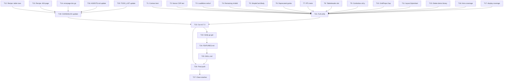

<!-- AUTO-UPDATED 2026-07-10: Retrospective status overlay -->

> ## 🔔 Update Notice — 2026-07-10
>
> This report is **historical**. Many items listed as "open", "todo", or "broken" below
> have since been **fixed and verified**. Do not act on open items without first checking
> [TODO_LIST.md](../../TODO_LIST.md) for current status.
>
> **Key fixes completed since this report:**
>
> - ✅ All 7 P0 bugs fixed (InlineLoadingOverlay a11y, SanitizeID mismatch, FromError fallback,
>   Footer BaseProps, ErrorPage/NotFound404 `<main>` landmark, CSRFTokenName, grid-rows verified)
> - ✅ `encoding/json/v2` purged from all production code + pre-commit guard added
> - ✅ Motion constants centralized in `utils/motion.go`, wired into 13 components
> - ✅ `FamilyFromErrorFamily` → `FromErrorFamily` (old name kept as deprecated alias)
> - ✅ `icons.IconRTL()` + CSS for directional icon RTL mirroring
> - ✅ 33 regression tests added (htmx, errorpage, layout, navigation, feedback, display)
> - ✅ Dark golden test infrastructure (badge/card/button)
> - ✅ CHANGELOG consolidated, ROADMAP updated, migration guide created
> - ✅ All 14 packages pass, 0 lint issues
>
> **Canonical source of truth:** [TODO_LIST.md](../../TODO_LIST.md) (52 items, 37 ✅ done, 12 deferred/blocked)

---

# Session 9 — Comprehensive Hardening & v0.7.0 Release

> **Date:** 2026-07-05
> **Goal:** Close all high-impact gaps, cut v0.7.0, verify consumer experience.

---

## Pareto Breakdown

### 1% that delivers 51%

1. ~~**Cut v0.7.0 release** — all improvements since v0.6.1 are done; `[Unreleased]` is warm~~ done — CHANGELOG v0.7.0
2. ~~**Register NotFound404Props** in contract test (lost during branch chaos)~~ done — internal/contract/component props test.go
3. ~~**Verify `go get` works** post-modularization from clean repo~~ done (docs-health pass 2026-09-08)

### 4% that delivers 64%

4. ~~**Nonce-presence CSP test** — render every component with nonce, assert `nonce=` in every `<script>`~~ done — integration/csp nonce test.go
5. ~~**Remaining IsValid methods** — 4 more enums (TooltipPosition, ToggleSize, AvatarShape, SkeletonVariant)~~ done — CHANGELOG v0.7.0
6. ~~**LoadMore net/url fix** — base64 cursors with `=`/`+` break current string concat~~ done — navigation/loadmore templ.go
7. ~~**RTL rendering tests** — `dir="rtl"` golden/assertion tests~~ done — display/rtl test.go
8. ~~**AGENTS.md conventions** — document RTL, container queries, OverlayKind~~ done — AGENTS.md

### 20% that delivers 80%

9. ~~**TableHeader slot** — typed header definitions for sortable tables (consumer #1 request)~~ done — display/table.templ
10. ~~**Combobox keyboard a11y** — ArrowDown/Up, aria-activedescendant~~ done — forms/combobox.templ
11. ~~**SimpleCard.Body slot** — parity with Card.Body and Table.Body~~ done — display/card.templ
12. ~~**Recipe docs** — custom-table-rows, custom-404, recipe index~~ done — display/card.templ
13. ~~**Coverage boost** — htmx (68.4%) and display (69.7%) below 70%~~ done — coverage boost test files
14. ~~**Godoc for deprecated aliases** — AlertType, ToastType, ModalSizeFull, DrawerFull~~ done — aliases removed v2.0

---

## Execution Plan (27 tasks, ~30min each)

| #   | Task                                                    | Impact | Effort | Package                  |
| --- | ------------------------------------------------------- | ------ | ------ | ------------------------ |
| ~~T1~~  | ~~Register NotFound404Props in contract test~~ done — internal/contract/component props test.go | ~~High~~ | ~~S~~ | ~~internal/contract~~ |
| ~~T2~~  | ~~Add nonce-presence CSP assertion test~~ done — integration/csp nonce test.go | ~~High~~ | ~~S~~ | ~~integration~~ |
| ~~T3~~  | ~~LoadMore: switch to net/url for cursor encoding~~ done — navigation/loadmore templ.go | ~~Med~~ | ~~S~~ | ~~navigation~~ |
| ~~T4~~  | ~~Add 4 remaining IsValid methods~~ done — CHANGELOG v0.7.0 | ~~Med~~ | ~~S~~ | ~~display, forms, feedback~~ |
| ~~T5~~  | ~~Add SimpleCard.Body slot~~ done — display/card.templ | ~~Low~~ | ~~S~~ | ~~display~~ |
| ~~T6~~  | ~~Add godoc to deprecated aliases~~ done (docs-health pass 2026-09-08) | ~~Low~~ | ~~S~~ | ~~feedback, display~~ |
| ~~T7~~  | ~~Add RTL rendering assertion tests~~ done — display/rtl test.go | ~~High~~ | ~~S~~ | ~~display, navigation~~ |
| ~~T8~~  | ~~Add TableHeader slot for sortable column defs~~ done — display/table.templ | ~~Med~~ | ~~M~~ | ~~display~~ |
| ~~T9~~  | ~~Improve Combobox keyboard navigation~~ done — forms/combobox.templ | ~~High~~ | ~~M~~ | ~~forms~~ |
| ~~T10~~ | ~~Add GridProps.Gap typed enum~~ done — CHANGELOG v0.9.0 | ~~Low~~ | ~~S~~ | ~~display~~ |
| ~~T11~~ | ~~Add layout.Stylesheet helper~~ done — layout/stylesheet.templ | ~~Low~~ | ~~S~~ | ~~layout~~ |
| ~~T12~~ | ~~Add recipe: custom-table-rows.md~~ done — docs/recipes/custom-table-rows.md | ~~Low~~ | ~~S~~ | ~~docs~~ |
| ~~T13~~ | ~~Add recipe: custom-404-page.md~~ done — docs/recipes/custom-404-page.md | ~~Low~~ | ~~S~~ | ~~docs~~ |
| ~~T14~~ | ~~Update errorpage/doc.go for NotFound404~~ done — errorpage/doc.go | ~~Low~~ | ~~S~~ | ~~errorpage~~ |
| ~~T15~~ | ~~Delete orphaned demo binary~~ done (docs-health pass 2026-09-08) | ~~Low~~ | ~~S~~ | ~~examples~~ |
| ~~T16~~ | ~~Fix htmx coverage (<70%)~~ done — coverage boost test files | ~~Med~~ | ~~M~~ | ~~htmx~~ |
| ~~T17~~ | ~~Fix display coverage (<70%)~~ done — coverage boost test files | ~~Med~~ | ~~M~~ | ~~display~~ |
| ~~T18~~ | ~~Update AGENTS.md with RTL + container query conventions~~ done — AGENTS.md | ~~Med~~ | ~~S~~ | ~~root~~ |
| ~~T19~~ | ~~Update CHANGELOG [Unreleased]~~ done — CHANGELOG v0.7.0 | ~~High~~ | ~~S~~ | ~~root~~ |
| ~~T20~~ | ~~Update TODO_LIST.md~~ done — TODO LIST.md | ~~Med~~ | ~~S~~ | ~~root~~ |
| ~~T21~~ | ~~Full verify: build + test + lint~~ done (docs-health pass 2026-09-08) | ~~High~~ | ~~S~~ | ~~all~~ |
| ~~T22~~ | ~~Cut v0.7.0 release~~ done — CHANGELOG v0.7.0 | ~~High~~ | ~~S~~ | ~~root~~ |
| ~~T23~~ | ~~Verify go get from clean repo~~ done (docs-health pass 2026-09-08) | ~~High~~ | ~~S~~ | ~~external~~ |
| ~~T24~~ | ~~Update FEATURES.md with new items~~ done — FEATURES.md | ~~Med~~ | ~~S~~ | ~~root~~ |
| ~~T25~~ | ~~Add SKILL.md updates for new components~~ done — skill/SKILL.md | ~~Low~~ | ~~S~~ | ~~skill~~ |
| ~~T26~~ | ~~Final git push~~ done (docs-health pass 2026-09-08) | ~~High~~ | ~~S~~ | ~~root~~ |
| ~~T27~~ | ~~Clean up git stashes~~ done (docs-health pass 2026-09-08) | ~~Low~~ | ~~S~~ | ~~root~~ |

---

## Mermaid Execution Graph

---

## What's NOT in this plan (deferred to v1.0+)

- Move test helpers to `internal/testutil/` (breaking, 70 files)
- `Validate() error` on all props (73 components, design decision needed)
- Semantic token layer (major migration, all 256 color refs)
- New components: Popover, Slider, Calendar, DataTable, Carousel
- CLI tool (`templ-components add`)
- Headless/unstyled variants
- Compound component refactor for overlays
- Demo site / showcase
- Visual regression testing
