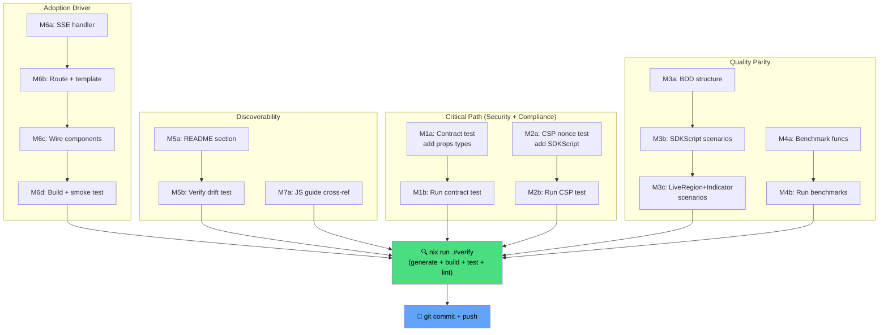

> **Status: FULLY SHIPPED in v1.7.0.** All planned work in this document is complete.
> See [`CHANGELOG.md`](../../../CHANGELOG.md) for the v1.7.0 release notes. Archived 2026-08-05.

# Datastar Integration — Pareto Execution Plan

> **Date:** 2026-08-02 22:40 · **Status:** Planning
> **Goal:** Bring the `datastar` package to full quality parity with every other
> package in the library — without verslimmbessern.

---

## Context: What We've Already Shipped

The core Datastar integration is **DONE and verified** (`nix run .#verify` passes):

| # | Deliverable                                                                                              | Status     |
| - | -------------------------------------------------------------------------------------------------------- | ---------- |
| 1 | `datastar` package: `SDKScript`, `LiveRegion`, `Indicator`, action helpers (`Get/Post/Put/Patch/Delete`) | ✅ Shipped |
| 2 | Deep-research analysis (`docs/research/datastar-integration-analysis.md`)                                | ✅ Shipped |
| 3 | ADR 0030 (`docs/adr/0030-datastar-integration-strategy.md`)                                              | ✅ Shipped |
| 4 | Consumer recipe (`docs/recipes/datastar-integration.md`)                                                 | ✅ Shipped |
| 5 | Golden tests (8 snapshots), unit tests, enum validation (`IsValid`)                                      | ✅ Shipped |
| 6 | Doc updates: AGENTS.md, FEATURES.md, SKILL.md, sections.ts, docs_count_test                              | ✅ Shipped |
| 7 | Zero new `go.mod` dependencies (mirrors `htmx` package pattern)                                          | ✅ Shipped |

A consumer can **right now** inject the Datastar runtime, set up an SSE stream
via `LiveRegion`, use loading indicators via `Indicator`, and use all 107
existing components unchanged in a Datastar app.

---

## The Gap: datastar Is the Sole Quality Outlier

An audit against every other package reveals **6 missing infrastructure items**.
The `htmx` package (the direct analog) has all of them; `datastar` has none:

| Infrastructure          | All other packages        | `datastar` |
| ----------------------- | ------------------------- | ---------- |
| `bdd_test.go`           | ✅ 8/8 component packages | ❌         |
| `benchmark_test.go`     | ✅ 9/9 packages           | ❌         |
| CSP nonce coverage      | ✅ htmx covered           | ❌         |
| Contract/BaseProps test | ✅ htmx (2 types)         | ❌         |
| Demo route              | ✅ htmx endpoints         | ❌         |
| README mention          | ✅ (htmx implied)         | ❌         |

---

## Pareto Analysis

### The 1% That Delivers 51%

**Already done.** The core package + recipe = a consumer can use Datastar today.
No additional work is blocking adoption.

### The 4% That Delivers 64%

**Contract test + CSP nonce test** (30min combined). These close the security
and interface-compliance gaps. Without them, `datastar` is the only package not
covered by the two cross-cutting test suites — a visible quality outlier.

### The 20% That Delivers 80%

**All infrastructure parity**: BDD + benchmark + CSP + contract + README. This
brings `datastar` to the same quality bar as every other package. No more
"datastar is the sole outlier on every axis."

### The Other 20% (to Reach 100%)

**Demo route + JS guide cross-reference.** These are adoption drivers, not
quality gates. The demo proves the concept works end-to-end (seeing is
believing); the JS guide connects rung 7 to the actual package.

### Explicitly DEFERRED (Verslimmbessern Risk)

| Item                                  | Why defer                                                                                                                                  |
| ------------------------------------- | ------------------------------------------------------------------------------------------------------------------------------------------ |
| Reactive `datastar.Combobox` variant  | Existing `forms.Combobox` works in Datastar apps. Parallel impl splits the brain, doubles maintenance. Defer until a consumer requests it. |
| Reactive `datastar.TagsInput` variant | Same reasoning. Recipe documents the signal-based pattern.                                                                                 |
| `datastar.LoadMore` / `ConfirmDelete` | Recipe already maps the HTMX-to-Datastar attribute equivalents. New components would duplicate.                                            |
| Multi-step form via signals           | YAGNI. No consumer has asked. Document the pattern in the recipe instead.                                                                  |
| Website docs page                     | The recipe + ADR + research doc cover it. Website page is nice-to-have polish.                                                             |

**Criterion for un-deferring:** a consumer files an issue saying "I need X
because Y." Until then, the existing recipe + package are sufficient.

---

## Phase 2: Quality Parity — Task Breakdown (100-30min tasks)

Sorted by importance / impact / effort / customer-value.

| #  | Task                                                        | Impact | Effort | Est   | Customer Value                        |
| -- | ----------------------------------------------------------- | ------ | ------ | ----- | ------------------------------------- |
| T1 | Contract test: add 3 datastar props types to inventory      | HIGH   | LOW    | 15min | Interface compliance guarantee        |
| T2 | CSP nonce test: add datastar.SDKScript to integration suite | HIGH   | LOW    | 15min | Security guarantee (CSP-safe)         |
| T3 | BDD test: behavior scenarios for SDKScript + LiveRegion     | MEDIUM | LOW    | 30min | Behavior verification (Ginkgo)        |
| T4 | Benchmark suite for datastar package                        | LOW    | LOW    | 20min | Perf baseline (consistency)           |
| T5 | README: add datastar to component catalogue                 | MEDIUM | LOW    | 15min | Discoverability for new users         |
| T6 | Demo: add /demo/datastar route with mock SSE endpoint       | HIGH   | MED    | 45min | "Seeing is believing" adoption driver |
| T7 | JS guide: cross-reference datastar package in Pattern 4     | LOW    | LOW    | 10min | Connect rung 7 to actual package      |

**Total estimated effort:** ~150min (2.5 hours)

---

## Phase 2: Micro-Task Breakdown (max 12min each)

| Sub-task                                                                              | Parent | Est   | Depends on |
| ------------------------------------------------------------------------------------- | ------ | ----- | ---------- |
| **M1a**: Add datastar import + 3 props to `internal/contract/component_props_test.go` | T1     | 8min  | —          |
| **M1b**: Run `go test ./internal/contract/...` and fix if needed                      | T1     | 7min  | M1a        |
| **M2a**: Add `datastar.SDKScript` render to `integration/csp_nonce_test.go`           | T2     | 8min  | —          |
| **M2b**: Run `go test ./integration/...` and verify nonce present                     | T2     | 7min  | M2a        |
| **M3a**: Write BDD Describe structure for SDKScript + LiveRegion + Indicator          | T3     | 12min | —          |
| **M3b**: Write SDKScript scenarios (CDN URL, self-hosted, nonce, version)             | T3     | 12min | M3a        |
| **M3c**: Write LiveRegion + Indicator scenarios, run and verify                       | T3     | 6min  | M3b        |
| **M4a**: Write benchmark funcs for SDKScript, LiveRegion, Indicator                   | T4     | 12min | —          |
| **M4b**: Run `go test -bench=. -benchmem ./datastar/...` and verify                   | T4     | 8min  | M4a        |
| **M5a**: Add datastar section to README component catalogue                           | T5     | 12min | —          |
| **M5b**: Verify README renders, run docs drift test                                   | T5     | 3min  | M5a        |
| **M6a**: Add SSE handler function to `examples/demo/main.go`                          | T6     | 12min | —          |
| **M6b**: Add `/demo/datastar` route + page template (templ)                           | T6     | 12min | M6a        |
| **M6c**: Wire LiveRegion + StatCard + SDKScript on demo page                          | T6     | 12min | M6b        |
| **M6d**: Build demo binary and smoke-test the route                                   | T6     | 9min  | M6c        |
| **M7a**: Update JS guide Pattern 4 to cross-reference `datastar` package              | T7     | 10min | —          |

**Total:** 16 micro-tasks, ~150min.

---

## Execution Order (Dependency Graph)

**Parallelizable:** T1+T2 (independent), T3+T4 (independent), T5+T7 (independent).
**Sequential:** T6 depends on package being solid (after T1-T4).

---

## Anti-Verslimmbessern Checklist

Before starting ANY task, verify:

- [ ] Does this task **add customer value** or is it just gold-plating?
- [ ] Does this task **duplicate** an existing component/pattern? If yes, STOP.
- [ ] Will this task **split the brain** (two ways to do the same thing)? If yes, STOP.
- [ ] Is this task **reversible** if it turns out wrong? If no, get approval first.
- [ ] After completion: run `nix run .#verify`. Zero new lint issues?

---

## Deferred Work (Do NOT Implement Without Consumer Request)

| Item                                 | Trigger to un-defer                                            |
| ------------------------------------ | -------------------------------------------------------------- |
| `datastar.Combobox` (signals-based)  | Consumer issue: "I need a zero-JS combobox in my Datastar app" |
| `datastar.TagsInput` (signals-based) | Consumer issue: "I need a zero-JS tags input"                  |
| `datastar.LoadMore`                  | Consumer issue: "I need infinite scroll without HTMX"          |
| `datastar.MultiStepForm`             | Consumer issue: "I need signal-driven step navigation"         |
| Website docs page                    | After v1.0 release, as part of website refresh                 |
| `datastar.PolledRegion` fallback     | Not needed — `LiveRegion` subsumes this use case               |

---

## Success Criteria

Phase 2 is complete when:

1. `nix run .#verify` passes with zero new lint issues
2. `datastar` package has: golden tests, unit tests, BDD tests, benchmark tests
3. `integration/csp_nonce_test.go` covers `datastar.SDKScript`
4. `internal/contract/component_props_test.go` covers all 3 datastar props types
5. `examples/demo` has a working `/demo/datastar` route with live SSE streaming
6. README mentions Datastar in the component catalogue
7. JS guide Pattern 4 cross-references the `datastar` package
8. No new go.mod dependencies added
9. No existing tests broken
10. No verslimmbessern (no parallel component implementations, no brain splits)
