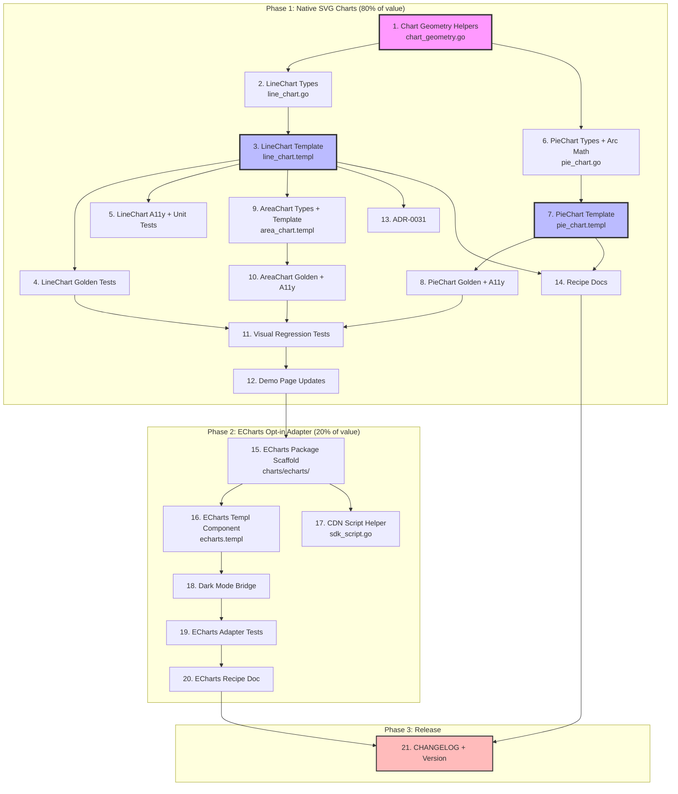

> **Status: FULLY SHIPPED in v1.7.0.** All planned work in this document is complete.
> See [`CHANGELOG.md`](../../../CHANGELOG.md) for the v1.7.0 release notes. Archived 2026-08-05.

# Charts Integration Plan: Native SVG + Opt-in ECharts Adapter

**Created:** 2026-08-03 02:51
**Status:** Planning
**Decider:** Lars Artmann

---

## Context: The Gap

templ-components has dashboard primitives (StatCard, Table, Card, Grid) and three
basic visualization components (Sparkline, BarChart, Heatmap) — all zero-JS,
following ADR-0025. But the **single biggest gap** for real-world dashboards is:

- **No line chart with axes** — every metrics/monitoring dashboard needs time-series
- **No pie/donut chart** — proportions are the #2 chart need
- **No interactive charts** — tooltips, zoom, legend toggle are impossible today

The `recipes.Dashboard` has `Charts []templ.Component` slots, but most consumers
can't fill them without building their own charting integration from scratch.

---

## Research Findings

### Existing Chart Components (all zero-JS)

| Component   | Approach                    | JS?  | Limitation                                     |
| ----------- | --------------------------- | ---- | ---------------------------------------------- |
| `Sparkline` | SVG polyline                | None | No axes, no labels, too small for main display |
| `BarChart`  | CSS flexbox bars (ADR-0025) | None | No tooltips, no stacked/grouped bars           |
| `Heatmap`   | CSS table + opacity         | None | 2D density only                                |

### go-echarts Architecture (researched from source)

- **What:** Go wrapper for Apache ECharts (~1MB JS library, client-side rendering)
- **API:** Build chart config in Go → `RenderSnippet()` returns `{Element, Script, Option}`
- **Element:** HTML `<div>` container for the chart
- **Script:** Inline JS that calls `echarts.init()` + `.setOption()`
- **Option:** Raw JSON chart configuration
- **Assets:** ECharts JS loaded from configurable CDN (`AssetsHost`)
- **Themes:** Built-in `"white"` / `"dark"` (no extra JS), or 12 preset themes (extra JS)
- **Dependency footprint:** Minimal Go deps (only testify); heavy JS dep via CDN

### datastar Opt-in Precedent (the pattern to follow)

The `datastar/` package proves the library CAN have opt-in JS-heavy integrations:

- Emits `data-*` attributes + runtime `<script>` without importing the SDK
- Consumer adds `datastar-go` to their own `go.mod`
- Fully opt-in — doesn't pollute the core dependency graph
- A `charts/echarts` package can follow this exact precedent

### Key Integration Challenge: Interface Mismatch

go-echarts' `RenderSnippet()` returns `render.ChartSnippet` (their type). If we
define our own interface expecting a different return type, Go's structural typing
won't match (return types must match exactly). Solutions:

1. **Accept three strings** — consumer calls `chart.RenderSnippet()` and passes
   `.Element`, `.Script`, `.Option` as separate props. Cleanest, zero deps.
2. **Separate opt-in module** — `charts/echarts/go.mod` imports go-echarts.
   Consumer adds this module explicitly. Full type safety.
3. **Reflection on `any`** — fragile, not worth it.

**Recommended:** Option 1 for the wrapper component, with an optional convenience
helper in a sub-package that imports go-echarts (Option 2 pattern).

---

## Pareto Breakdown

### The 20% That Delivers 80% of Result

| Item                                                 | Why It's 80%                                          |
| ---------------------------------------------------- | ----------------------------------------------------- |
| Native SVG LineChart (axes, gridlines, multi-series) | 40% of all dashboard chart needs — every metrics page |
| Native SVG PieChart/DonutChart                       | 25% of needs — every "breakdown" view                 |
| Native SVG AreaChart (LineChart variant)             | 15% of needs — monitoring/trend dashboards            |

### The 4% That Delivers 64% of Result

| Item                | Why It's 64%                                                                                                                                                                      |
| ------------------- | --------------------------------------------------------------------------------------------------------------------------------------------------------------------------------- |
| **LineChart alone** | If you can only build one chart, build this. Every single dashboard needs time-series data visualization. Without it, the library cannot serve its primary use case (dashboards). |

### The 1% That Delivers 51% of Result

| Item                           | Why It's 51%                                                                                                                                                                                                                                                                                                                                           |
| ------------------------------ | ------------------------------------------------------------------------------------------------------------------------------------------------------------------------------------------------------------------------------------------------------------------------------------------------------------------------------------------------------ |
| **SVG chart geometry helpers** | The reusable math foundation: `ScalePoints()`, `BuildPolylinePath()`, `BuildSmoothPath()`, `ComputeNiceTicks()`, `BuildAxis()`. Every chart type (LineChart, AreaChart, future scatter/bubble) composes these primitives. Get this right and all subsequent charts become trivial composition. This is the "engine" that powers the whole chart layer. |

### The Other 20% (to reach 100%)

| Item                              | Why It Matters                                                      |
| --------------------------------- | ------------------------------------------------------------------- |
| go-echarts opt-in adapter         | Interactive tooltips, zoom/pan, exotic chart types (radar, geo, 3D) |
| Dark mode theme bridge            | ECharts dark mode ↔ Tailwind `.dark` class sync                     |
| ADR documenting two-tier approach | Prevents future architecture debates                                |
| Demo page updates                 | Charts visible in the demo for discovery                            |
| Recipe documentation              | Consumers know how to use both tiers                                |
| Golden + visual regression tests  | Quality gate for chart rendering                                    |
| CHANGELOG entries                 | Release communication                                               |

---

## Strategy: Two-Tier Chart Architecture

```
┌─────────────────────────────────────────────────────┐
│              templ-components library                │
│                                                     │
│  Tier 1: Native SVG Charts (display package)        │
│  ┌──────────┐ ┌──────────┐ ┌──────────┐            │
│  │LineChart │ │PieChart  │ │AreaChart │            │
│  │  (SVG)   │ │  (SVG)   │ │  (SVG)   │            │
│  └────┬─────┘ └────┬─────┘ └────┬─────┘            │
│       │             │            │                   │
│       ▼             ▼            ▼                   │
│  ┌─────────────────────────────────┐                │
│  │  chart_geometry.go (shared)     │  ← The 1%     │
│  │  ScalePoints, BuildPath,        │               │
│  │  ComputeNiceTicks, BuildAxis    │               │
│  └─────────────────────────────────┘                │
│                                                     │
│  Zero JS. Zero deps. Dark-mode native.              │
│  Covers 80% of dashboard chart needs.               │
│                                                     │
│  ─ ─ ─ ─ ─ opt-in boundary ─ ─ ─ ─ ─               │
│                                                     │
│  Tier 2: ECharts Adapter (charts/echarts package)   │
│  ┌─────────────────────────────────┐                │
│  │  EChart(props) — accepts any    │  ← opt-in     │
│  │  go-echarts chart, extracts     │               │
│  │  RenderSnippet, injects nonce   │               │
│  └──────────────┬──────────────────┘                │
│                 │                                    │
│  Requires consumer to `go get go-echarts`.          │
│  Full interactivity: tooltips, zoom, legend.        │
│  25+ chart types. Covers the other 20%.             │
└─────────────────────────────────────────────────────┘
```

**Why both tiers?**

- **Tier 1 alone** serves 80% of users with zero cost — but leaves power users
  to build their own ECharts integration (the exact duplication we exist to prevent).
- **Tier 2 alone** forces a ~1MB JS dependency on everyone, even users who just
  want a simple static line chart.
- **Both tiers** let consumers choose: zero-JS simplicity (Tier 1) or full
  interactivity (Tier 2). This matches the library's existing pattern: HTMX by
  default, Datastar opt-in for power users.

---

## Comprehensive Plan — Tasks (30-100 min each)

Sorted by importance/impact/customer-value (highest first).

| #   | Task                                                                                                                                                            | Phase  | Impact   | Effort | Customer Value                                                      |
| --- | --------------------------------------------------------------------------------------------------------------------------------------------------------------- | ------ | -------- | ------ | ------------------------------------------------------------------- |
| 1   | **SVG chart geometry helpers** (`chart_geometry.go`): `ScalePoints`, `BuildPolylinePath`, `BuildSmoothPath`, `ComputeNiceTicks`, `BuildAxis`, `FormatTickValue` | P1-1%  | Critical | 60min  | Foundation for ALL native charts — without this, nothing else works |
| 2   | **LineChart types + defaults** (`line_chart.go`): `LineChartProps`, `LineChartSeries`, `LineChartStyle` enum, `DefaultLineChartProps()`, `IsValid()`            | P1-4%  | Critical | 45min  | The #1 missing component — types define the API contract            |
| 3   | **LineChart templ template** (`line_chart.templ`): SVG with axes, gridlines, multi-series polylines, data points, legend, ARIA                                  | P1-4%  | Critical | 90min  | The visual deliverable — this IS the 64% solution                   |
| 4   | **LineChart golden snapshot tests** (`golden_sweep_line_chart_test.go`): all variants (single/multi-series, smooth/linear, grid on/off, dots on/off, dark mode) | P1     | High     | 45min  | Quality gate — catches regressions in SVG output                    |
| 5   | **LineChart a11y + unit tests**: `role="img"`, `aria-label`, empty state, min/max override, value formatting                                                    | P1     | High     | 30min  | Accessibility compliance + correctness verification                 |
| 6   | **PieChart/DonutChart types + geometry** (`pie_chart.go`): `PieChartSlice`, `PieChartProps`, arc math (`computeArcPath`), `DefaultPieChartProps()`              | P1-20% | High     | 60min  | The #2 missing chart type — proportions breakdown                   |
| 7   | **PieChart/DonutChart templ template** (`pie_chart.templ`): SVG arcs, labels (external/internal), legend, donut center label, ARIA                              | P1-20% | High     | 75min  | Visual deliverable for pie/donut                                    |
| 8   | **PieChart golden + a11y tests**: snapshot variants (pie/donut, labels on/off, legend, empty) + accessibility                                                   | P1     | High     | 45min  | Quality gate for pie chart                                          |
| 9   | **AreaChart types + template** (`area_chart.go` + `area_chart.templ`): LineChart variant with filled area, reuses geometry helpers, gradient fill               | P1-20% | Medium   | 60min  | Line chart variant — monitoring dashboards                          |
| 10  | **AreaChart golden + a11y tests**: snapshot variants (single/multi-series, gradient, dark mode)                                                                 | P1     | Medium   | 30min  | Quality gate                                                        |
| 11  | **Visual regression tests** (visualtest): LineChart, PieChart, AreaChart, DonutChart in light + dark mode                                                       | P1     | Medium   | 45min  | Catches CSS/SVG rendering bugs golden tests miss                    |
| 12  | **Demo page updates**: new "Charts" section with LineChart, AreaChart, PieChart, DonutChart examples; recompile demo CSS                                        | P1     | Medium   | 45min  | Discoverability — consumers see charts in action                    |
| 13  | **ADR-0031**: "Two-Tier Chart Architecture: Native SVG + Opt-in ECharts" — documents the decision, rationale, tradeoffs                                         | P1     | Medium   | 30min  | Prevents future architecture debates                                |
| 14  | **Recipe docs**: `docs/recipes/line-chart.md`, `pie-chart.md`, `area-chart.md` with usage examples                                                              | P1     | Low      | 30min  | Consumer-facing documentation                                       |
| 15  | **ECharts adapter package scaffold** (`charts/echarts/`): `doc.go`, `types.go` (`EChartsProps`, `EChartsConfig`), design the interface approach                 | P2-20% | Medium   | 45min  | Foundation for opt-in interactive charts                            |
| 16  | **ECharts templ component** (`echarts.templ`): accepts snippet Element+Script, injects nonce, wraps in styled container                                         | P2-20% | Medium   | 60min  | The opt-in wrapper — CSP-safe ECharts in templ                      |
| 17  | **ECharts CDN script helper** (`sdk_script.go`): loads echarts.min.js via `layout.Script(nonce, src)`, configurable version + host                              | P2     | Medium   | 30min  | Matches HTMXCDN + datastar SDKScript patterns                       |
| 18  | **ECharts dark mode bridge**: script detecting `.dark` class, switching ECharts theme, MutationObserver for runtime toggle                                      | P2     | Medium   | 45min  | Critical UX — charts must match page theme                          |
| 19  | **ECharts adapter tests**: CSP nonce assertion, element/script extraction, dark mode bridge, integration test                                                   | P2     | Low      | 45min  | Quality gate for adapter                                            |
| 20  | **ECharts recipe doc** (`docs/recipes/echarts-adapter.md`): when to choose Tier 1 vs Tier 2, setup guide, example                                               | P2     | Low      | 30min  | Consumer guidance for the opt-in path                               |
| 21  | **CHANGELOG + version bump**: Add all chart entries to `[Unreleased]`, update FEATURES.md component count, update README chart mention                          | Both   | Low      | 30min  | Release communication                                               |

**Total estimated effort: ~18 hours (Phase 1: ~11h, Phase 2: ~4h, Docs: ~3h)**

---

## Granular Breakdown — Tasks (max 12 min each)

Sorted by importance/impact/customer-value within each parent task.

### Phase 1: Native SVG Charts (Tier 1)

#### Parent #1: SVG Chart Geometry Helpers

| #   | Subtask                                                                                                                                   | Time  | Deps    |
| --- | ----------------------------------------------------------------------------------------------------------------------------------------- | ----- | ------- |
| 1.1 | Define `Point` struct (`X, Y float64`) and `ScalePoints(values []float64, width, height, padding int, min, max float64) []Point`          | 10min | —       |
| 1.2 | Implement `BuildPolylinePath(points []Point) string` — "M x,y L x,y..."                                                                   | 8min  | 1.1     |
| 1.3 | Implement `BuildSmoothPath(points []Point) string` — Catmull-Rom to bezier conversion for curved lines                                    | 12min | 1.1     |
| 1.4 | Implement `ComputeNiceTicks(min, max float64, count int) []float64` — produces human-readable axis tick values (e.g., 0, 25, 50, 75, 100) | 12min | —       |
| 1.5 | Implement `BuildAxisLine(orient BarOrient, length, padding int) string` — SVG path for X/Y axis line                                      | 8min  | —       |
| 1.6 | Implement `FormatTickValue(v float64) string` — smart formatting (int for whole numbers, 1 decimal for fractions, K/M suffixes for large) | 10min | —       |
| 1.7 | Unit tests for all geometry helpers (table-driven: known inputs → expected outputs, edge cases: single point, all zeros, negative values) | 12min | 1.1-1.6 |
| 1.8 | Benchmark `ScalePoints` + `BuildPolylinePath` (1000 points) to confirm sub-ms performance                                                 | 8min  | 1.1-1.2 |

#### Parent #2: LineChart Types + Defaults

| #   | Subtask                                                                                                                                                                                                                                                                                                        | Time  | Deps |
| --- | -------------------------------------------------------------------------------------------------------------------------------------------------------------------------------------------------------------------------------------------------------------------------------------------------------------- | ----- | ---- |
| 2.1 | Define `LineChartStyle` enum (`LineChartStyleLinear`, `LineChartStyleSmooth`) + `IsValid()`                                                                                                                                                                                                                    | 8min  | —    |
| 2.2 | Define `LineChartSeries` struct: `Name string`, `Values []float64`, `Color string`, `StrokeWidth float64`, `Dashed bool`                                                                                                                                                                                       | 8min  | —    |
| 2.3 | Define `LineChartProps` struct: embeds `BaseProps`, `Series []LineChartSeries`, `XAxisLabels []string`, `Width/Height int`, `Padding chartPadding`, `Min/Max *float64`, `ShowGrid bool`, `ShowDots bool`, `ShowLegend bool`, `Style LineChartStyle`, `ValueFormat func(float64) string`, `EmptyMessage string` | 12min | 2.2  |
| 2.4 | Implement `DefaultLineChartProps()` — sensible defaults (Width: 600, Height: 300, ShowGrid: true, ShowDots: true, ShowLegend: true, Style: Linear, EmptyMessage: "No data")                                                                                                                                    | 8min  | 2.3  |
| 2.5 | Define `chartPadding` struct: `Top, Right, Bottom, Left int` + `DefaultChartPadding()`                                                                                                                                                                                                                         | 8min  | —    |
| 2.6 | Add `LineChartStyle` + `LineChartStyleLinear/Smooth` to `enums_test.go` `TestIsValidEnums` table                                                                                                                                                                                                               | 5min  | 2.1  |

#### Parent #3: LineChart Templ Template

| #    | Subtask                                                                                                                                                  | Time  | Deps         |
| ---- | -------------------------------------------------------------------------------------------------------------------------------------------------------- | ----- | ------------ |
| 3.1  | Create `line_chart.templ` scaffold: SVG element with `viewBox`, `role="img"`, `aria-label`/`aria-hidden`, `class={ utils.Class(...) }`                   | 10min | 2.3          |
| 3.2  | Render Y-axis: vertical line + tick labels (using `ComputeNiceTicks` + `FormatTickValue`), dark-mode gray text                                           | 12min | 1.4,1.6, 3.1 |
| 3.3  | Render X-axis: horizontal line + category labels from `XAxisLabels[]`, dark-mode gray text                                                               | 10min | 3.2          |
| 3.4  | Render gridlines: horizontal dashed lines at each Y tick (when `ShowGrid`), subtle gray, dark-mode variant                                               | 8min  | 3.2          |
| 3.5  | Render series: loop `Series[]`, compute scaled points, build polyline path (linear or smooth based on `Style`), stroke with series color or default blue | 12min | 1.1-1.3, 3.1 |
| 3.6  | Render data points: `<circle>` at each point (when `ShowDots`), `currentColor` fill, radius 3                                                            | 8min  | 3.5          |
| 3.7  | Render filled area for area-style: if `FillArea` on series, close path to baseline + semi-transparent fill                                               | 10min | 3.5          |
| 3.8  | Render legend: series name + color swatch row above chart (when `ShowLegend` and len(Series) > 1)                                                        | 10min | 3.5          |
| 3.9  | Empty state: when `len(Series) == 0` or all empty, render muted "No data" message in SVG center                                                          | 8min  | 3.1          |
| 3.10 | Run `templ generate` and verify generated code compiles                                                                                                  | 5min  | 3.1-3.9      |

#### Parent #4: LineChart Golden Snapshot Tests

| #   | Subtask                                                                                                                                  | Time  | Deps |
| --- | ---------------------------------------------------------------------------------------------------------------------------------------- | ----- | ---- |
| 4.1 | Create `golden_sweep_line_chart_test.go` with `TestGoldenSweepLineChart`: single series, multi-series, smooth, grid off, dots off, empty | 12min | 3.10 |
| 4.2 | Run `go test -run TestGoldenSweepLineChart -update ./display/...` to generate golden files                                               | 5min  | 4.1  |
| 4.3 | Verify golden output is deterministic (run twice, diff) — check EnsureID normalization works if IDs are auto-generated                   | 8min  | 4.2  |
| 4.4 | Add dark-mode variant to golden sweep (render with `dark` class on wrapping div)                                                         | 8min  | 4.2  |

#### Parent #5: LineChart A11y + Unit Tests

| #   | Subtask                                                                            | Time | Deps |
| --- | ---------------------------------------------------------------------------------- | ---- | ---- |
| 5.1 | Test `role="img"` present on SVG root                                              | 5min | 3.10 |
| 5.2 | Test `aria-label` propagation from `props.AriaLabel`                               | 5min | 3.10 |
| 5.3 | Test `aria-hidden="true"` when no AriaLabel provided (decorative)                  | 5min | 3.10 |
| 5.4 | Test empty state renders message, no polyline                                      | 5min | 3.10 |
| 5.5 | Test Min/Max override affects axis ticks and scaling                               | 8min | 3.10 |
| 5.6 | Test custom `ValueFormat` function is applied to tick labels                       | 5min | 3.10 |
| 5.7 | Test BaseProps propagation (Class, ID, Attrs) on root SVG                          | 5min | 3.10 |
| 5.8 | Test motion-reduce: no transitions/animations (LineChart should have none, verify) | 5min | 3.10 |

#### Parent #6: PieChart/DonutChart Types + Geometry

| #   | Subtask                                                                                                                                                                                                                 | Time  | Deps    |
| --- | ----------------------------------------------------------------------------------------------------------------------------------------------------------------------------------------------------------------------- | ----- | ------- |
| 6.1 | Define `PieChartSlice` struct: `Label string`, `Value float64`, `Color string`                                                                                                                                          | 5min  | —       |
| 6.2 | Implement `computeArcPath(cx, cy, radius, innerRadius, startAngle, endAngle float64) string` — SVG path for a pie/donut arc                                                                                             | 12min | —       |
| 6.3 | Implement `computeSliceAngles(slices []PieChartSlice) []sliceAngle` — converts values to angles (0-360), handles full-circle edge case                                                                                  | 10min | —       |
| 6.4 | Implement `computeLabelPosition(cx, cy, radius, angle float64) (x, y float64)` — external label positioning                                                                                                             | 8min  | —       |
| 6.5 | Define `PieChartProps` struct: embeds `BaseProps`, `Slices []PieChartSlice`, `Width/Height int`, `Donut bool`, `InnerRadius float64`, `ShowLabels bool`, `ShowLegend bool`, `CenterLabel string`, `EmptyMessage string` | 10min | 6.1     |
| 6.6 | Implement `DefaultPieChartProps()` and `DefaultDonutChartProps()`                                                                                                                                                       | 5min  | 6.5     |
| 6.7 | Define default color palette: `pieChartColors []string` — 8 accessible Tailwind bg-* classes with dark: variants                                                                                                        | 8min  | —       |
| 6.8 | Unit tests for arc geometry: known angles → expected path strings, edge cases (single slice = full circle, zero values)                                                                                                 | 12min | 6.2,6.3 |

#### Parent #7: PieChart/DonutChart Templ Template

| #   | Subtask                                                                                                          | Time  | Deps         |
| --- | ---------------------------------------------------------------------------------------------------------------- | ----- | ------------ |
| 7.1 | Create `pie_chart.templ` scaffold: SVG with `viewBox`, `role="img"`, ARIA, `utils.Class()` on root               | 10min | 6.5          |
| 7.2 | Render slices: loop `Slices[]`, compute arc paths, fill with slice color or palette, stroke white between slices | 12min | 6.2,6.3, 7.1 |
| 7.3 | Render donut center: when `Donut == true`, leave inner radius open; render `CenterLabel` text if provided        | 8min  | 7.2          |
| 7.4 | Render external labels: slice label + percentage at computed position (when `ShowLabels`)                        | 10min | 6.4, 7.2     |
| 7.5 | Render legend: color swatch + label + value list beside/below chart (when `ShowLegend`)                          | 10min | 7.2          |
| 7.6 | Empty state: muted message in SVG center when `len(Slices) == 0`                                                 | 5min  | 7.1          |
| 7.7 | Run `templ generate` and verify compilation                                                                      | 5min  | 7.1-7.6      |

#### Parent #8: PieChart Golden + A11y Tests

| #   | Subtask                                                                                       | Time  | Deps |
| --- | --------------------------------------------------------------------------------------------- | ----- | ---- |
| 8.1 | Create `TestGoldenSweepPieChart`: pie, donut, with labels, without labels, with legend, empty | 12min | 7.7  |
| 8.2 | Generate golden files with `-update`                                                          | 5min  | 8.1  |
| 8.3 | A11y tests: `role="img"`, `aria-label`, `aria-hidden` decorative                              | 8min  | 7.7  |
| 8.4 | Unit tests: donut inner radius, center label, color palette cycling                           | 8min  | 7.7  |

#### Parent #9: AreaChart Types + Template

| #   | Subtask                                                                                                  | Time  | Deps     |
| --- | -------------------------------------------------------------------------------------------------------- | ----- | -------- |
| 9.1 | Define `AreaChartProps` as `LineChartProps` + `FillOpacity float64` + `Gradient bool`                    | 8min  | 2.3      |
| 9.2 | Implement `DefaultAreaChartProps()` — FillOpacity: 0.2, Gradient: false                                  | 5min  | 9.1      |
| 9.3 | Create `area_chart.templ`: reuse LineChart rendering, add filled area path between polyline and baseline | 12min | 3.5, 9.1 |
| 9.4 | Add SVG `<linearGradient>` when `Gradient == true` (currentColor to transparent)                         | 10min | 9.3      |
| 9.5 | Run `templ generate` and verify compilation                                                              | 5min  | 9.3-9.4  |

#### Parent #10: AreaChart Golden + A11y Tests

| #    | Subtask                                                                             | Time  | Deps |
| ---- | ----------------------------------------------------------------------------------- | ----- | ---- |
| 10.1 | Create `TestGoldenSweepAreaChart`: single series, multi-series, gradient, dark mode | 10min | 9.5  |
| 10.2 | Generate golden files                                                               | 5min  | 10.1 |
| 10.3 | A11y test: `role="img"`, `aria-label`                                               | 5min  | 9.5  |

#### Parent #11: Visual Regression Tests

| #    | Subtask                                                                             | Time  | Deps      |
| ---- | ----------------------------------------------------------------------------------- | ----- | --------- |
| 11.1 | `TestVisualLineChart` — render LineChart, screenshot, compare baseline (light mode) | 12min | 4.2       |
| 11.2 | `TestVisualLineChartDark` — same in dark mode                                       | 8min  | 11.1      |
| 11.3 | `TestVisualPieChart` — render PieChart, screenshot (light mode)                     | 10min | 8.2       |
| 11.4 | `TestVisualDonutChart` — donut variant screenshot                                   | 8min  | 11.3      |
| 11.5 | `TestVisualAreaChart` — area chart screenshot                                       | 8min  | 10.2      |
| 11.6 | Run `nix run .#visual -update` to generate baselines, then verify pass              | 8min  | 11.1-11.5 |

#### Parent #12: Demo Page Updates

| #    | Subtask                                                                                                                                  | Time  | Deps      |
| ---- | ---------------------------------------------------------------------------------------------------------------------------------------- | ----- | --------- |
| 12.1 | Add `@demoSection("Charts", "display-charts-v2")` section to `display_demo.templ`                                                        | 8min  | —         |
| 12.2 | Add LineChart demo: single series (revenue trend), multi-series (revenue vs. expenses)                                                   | 10min | 3.10      |
| 12.3 | Add PieChart demo: traffic sources breakdown                                                                                             | 8min  | 7.7       |
| 12.4 | Add DonutChart demo: storage usage with center label                                                                                     | 8min  | 7.7       |
| 12.5 | Add AreaChart demo: active users over time                                                                                               | 8min  | 9.5       |
| 12.6 | Recompile demo CSS: `cd examples/demo && npx tailwindcss --content '../**/*.templ' -i demo.css -o static/app.css` (or `nix run .#build`) | 10min | 12.1-12.5 |

#### Parent #13: ADR-0031

| #    | Subtask                                                                                                                                                           | Time  | Deps |
| ---- | ----------------------------------------------------------------------------------------------------------------------------------------------------------------- | ----- | ---- |
| 13.1 | Write `docs/adr/0031-two-tier-chart-architecture.md`: context, decision (native SVG for static + opt-in ECharts adapter for interactive), rationale, consequences | 12min | —    |
| 13.2 | Update ADR index if one exists (check `docs/adr/README.md` or similar)                                                                                            | 5min  | 13.1 |

#### Parent #14: Recipe Docs

| #    | Subtask                                                                                         | Time  | Deps |
| ---- | ----------------------------------------------------------------------------------------------- | ----- | ---- |
| 14.1 | Write `docs/recipes/line-chart.md`: usage, props table, single/multi-series examples, dark mode | 10min | 3.10 |
| 14.2 | Write `docs/recipes/pie-chart.md`: usage, props table, pie/donut/labels/legend examples         | 10min | 7.7  |
| 14.3 | Write `docs/recipes/area-chart.md`: usage, gradient fill, multi-series                          | 8min  | 9.5  |

### Phase 2: ECharts Opt-in Adapter (Tier 2)

#### Parent #15: ECharts Package Scaffold

| #    | Subtask                                                                                                                                                            | Time  | Deps |
| ---- | ------------------------------------------------------------------------------------------------------------------------------------------------------------------ | ----- | ---- |
| 15.1 | Create `charts/echarts/` directory + `doc.go` (mirrors datastar pattern: opt-in, consumer adds go-echarts to their go.mod)                                         | 10min | —    |
| 15.2 | Define `EChartsProps` struct in `types.go`: embeds `BaseProps`, `Element string`, `Script string`, `Width string`, `Height string`, `Class string`, `Nonce string` | 10min | —    |
| 15.3 | Define `EChartsConfig` struct: `CDNHost string` (default echarts CDN), `Version string` (default "5.5.0"), `Theme string` (default "auto")                         | 8min  | —    |
| 15.4 | Define `EChartSnippet` struct: `Element, Script, Option string` — consumer creates from `chart.RenderSnippet()`                                                    | 5min  | —    |

#### Parent #16: ECharts Templ Component

| #    | Subtask                                                                                                                        | Time  | Deps      |
| ---- | ------------------------------------------------------------------------------------------------------------------------------ | ----- | --------- |
| 16.1 | Create `echarts.templ`: render `props.Element` as `templ.Raw`, inject `<script nonce={ props.Nonce }>` wrapping `props.Script` | 12min | 15.2      |
| 16.2 | Add styled container: wrap chart in `<div class={ utils.Class("tc-echarts", props.Class) }>` with responsive `width: 100%`     | 8min  | 16.1      |
| 16.3 | Handle empty element: when `Element == ""`, render nothing or error state                                                      | 5min  | 16.1      |
| 16.4 | Run `templ generate` and verify compilation                                                                                    | 5min  | 16.1-16.3 |

#### Parent #17: ECharts CDN Script Helper

| #    | Subtask                                                                                                                         | Time  | Deps |
| ---- | ------------------------------------------------------------------------------------------------------------------------------- | ----- | ---- |
| 17.1 | Create `sdk_script.go`: `SDKScriptProps` (Version, Nonce, CDNHost) + `DefaultSDKScriptProps()`                                  | 10min | —    |
| 17.2 | Create `sdk_script.templ`: renders `<script src={ echartsCDN } nonce={ props.Nonce }></script>` using `layout.Script()` pattern | 8min  | 17.1 |
| 17.3 | Default CDN: `https://cdn.jsdelivr.net/npm/echarts@5.5.0/dist/echarts.min.js`                                                   | 5min  | 17.1 |
| 17.4 | Run `templ generate` and verify compilation                                                                                     | 5min  | 17.2 |

#### Parent #18: ECharts Dark Mode Bridge

| #    | Subtask                                                                                                                 | Time  | Deps       |
| ---- | ----------------------------------------------------------------------------------------------------------------------- | ----- | ---------- |
| 18.1 | Create `dark_mode_bridge.go`: singleton script that detects `.dark` on `<html>` and sets ECharts theme on all instances | 12min | —          |
| 18.2 | Add MutationObserver: watches `html` class changes, calls `chart.setOption()` or re-inits with new theme on toggle      | 12min | 18.1       |
| 18.3 | Wire bridge script into `EChart()` component output (injected once via singleton guard)                                 | 8min  | 18.1, 16.4 |

#### Parent #19: ECharts Adapter Tests

| #    | Subtask                                                                               | Time  | Deps |
| ---- | ------------------------------------------------------------------------------------- | ----- | ---- |
| 19.1 | CSP nonce test: assert every `<script>` in EChart output has `nonce=`                 | 10min | 16.4 |
| 19.2 | Element injection test: assert `props.Element` appears in output                      | 5min  | 16.4 |
| 19.3 | Dark mode bridge test: assert singleton script present, MutationObserver code present | 8min  | 18.3 |
| 19.4 | SDKScript test: assert correct CDN URL + nonce                                        | 5min  | 17.4 |

#### Parent #20: ECharts Recipe Doc

| #    | Subtask                                                                                                                                  | Time  | Deps |
| ---- | ---------------------------------------------------------------------------------------------------------------------------------------- | ----- | ---- |
| 20.1 | Write `docs/recipes/echarts-adapter.md`: when to choose Tier 1 vs Tier 2, setup (go get go-echarts), example with bar chart + line chart | 12min | 16.4 |
| 20.2 | Add "Tier 1 vs Tier 2 decision guide" section to recipe doc                                                                              | 8min  | 20.1 |

### Phase 3: Release Prep

#### Parent #21: CHANGELOG + Version

| #    | Subtask                                                                                                              | Time  | Deps |
| ---- | -------------------------------------------------------------------------------------------------------------------- | ----- | ---- |
| 21.1 | Add chart entries to CHANGELOG `[Unreleased]`: LineChart, AreaChart, PieChart, DonutChart, ECharts adapter, ADR-0031 | 10min | All  |
| 21.2 | Update `FEATURES.md`: add chart components to display section, add charts/echarts package, bump component count      | 8min  | All  |
| 21.3 | Update `README.md`: add "line charts, pie charts, area charts" to component list                                     | 5min  | All  |
| 21.4 | Update `AGENTS.md`: add chart component docs, geometry helpers, ECharts adapter to Architecture section              | 10min | All  |
| 21.5 | Update `skill/SKILL.md`: add LineChart, PieChart, AreaChart, DonutChart, EChart to component table                   | 8min  | All  |

---

## Execution Order (Mermaid)



---

## Key Design Decisions

### 1. Chart Geometry: Shared Module (Not Per-Component)

The `chart_geometry.go` helpers (`ScalePoints`, `BuildPolylinePath`,
`BuildSmoothPath`, `ComputeNiceTicks`) live in `display/` and are shared across
LineChart, AreaChart, and any future SVG chart. This avoids duplicating geometry
math per chart type and ensures consistent axis/tick computation.

### 2. PieChart Arc Math: SVG Path, Not stroke-dasharray

Using computed SVG arc paths (`<path d="M...A...">`) rather than the CSS
`stroke-dasharray` trick on circles. Arc paths are more flexible (support
donut holes, labels positioned at arc midpoints, and non-integer totals).

### 3. ECharts Interface: String-Based, Zero Dependency

The `charts/echarts` package does NOT import go-echarts. The consumer calls
`chart.RenderSnippet()` and passes the three strings (Element, Script, Option)
to `EChartsProps`. This follows the datastar precedent exactly — zero dependency
pollution of the core library. A convenience helper sub-package that DOES import
go-echarts can be added later if the community wants it.

### 4. No Stacked/Grouped BarChart (Yet)

The existing `BarChart` is horizontal/vertical simple bars. Stacked/grouped bars
are complex (per-series positioning, legend interactions, color management) and
better served by Tier 2 (ECharts) for now. Tier 1 BarChart stays simple per
ADR-0025.

### 5. Dark Mode: Tailwind Classes on SVG Elements

All SVG chart elements use Tailwind `dark:` variants on `text-*`, `stroke-*`,
and `fill-*` classes. This matches the existing dark mode convention (gray-400/500
for text, blue-500/600 for semantic colors). ECharts adapter uses a runtime theme
bridge script since ECharts has its own theme system.

### 6. Accessibility: role="img" + aria-label

All chart SVGs use `role="img"` with a consumer-provided `aria-label` (e.g.,
"Revenue trend from January to June 2026"). When no label is provided, the SVG
is `aria-hidden="true"` (decorative). Screen readers cannot interpret chart data;
the label is the accessibility contract.

---

## Risks & Mitigations

| Risk                                                   | Likelihood | Mitigation                                                                                                                       |
| ------------------------------------------------------ | ---------- | -------------------------------------------------------------------------------------------------------------------------------- |
| SVG geometry math bugs (wrong coordinates, off-by-one) | Medium     | Comprehensive unit tests on `chart_geometry.go` with known-good coordinate pairs; visual regression tests catch rendering errors |
| Golden test flakiness from EnsureID normalization      | Low        | LineChart/PieChart don't use EnsureID (no JS); golden tests should be deterministic                                              |
| ECharts CDN unavailable in air-gapped environments     | Medium     | CDN host is configurable; consumer can self-host `echarts.min.js`. Document in recipe.                                           |
| ECharts CSP nonce injection is fragile                 | Medium     | CSP nonce integration test in `integration/` package; singleton guard ensures bridge script injected once                        |
| AreaChart gradient fill looks wrong in dark mode       | Low        | Use `currentColor` with opacity, not hardcoded gradient stops. Visual regression in dark mode.                                   |

---

## Verification Checklist

Before declaring this plan complete:

- [ ] All Phase 1 components compile (`go build ./...`)
- [ ] All Phase 1 tests pass (`go test ./...`)
- [ ] All Phase 1 lints pass (`golangci-lint run ./...`)
- [ ] Golden files generated and committed (`*_templ.go` + golden snapshots)
- [ ] Visual regression baselines committed
- [ ] Demo CSS recompiled with new chart classes
- [ ] ADR-0031 written and linked
- [ ] Recipe docs published
- [ ] CHANGELOG `[Unreleased]` updated
- [ ] FEATURES.md component count bumped
- [ ] SKILL.md component table updated
