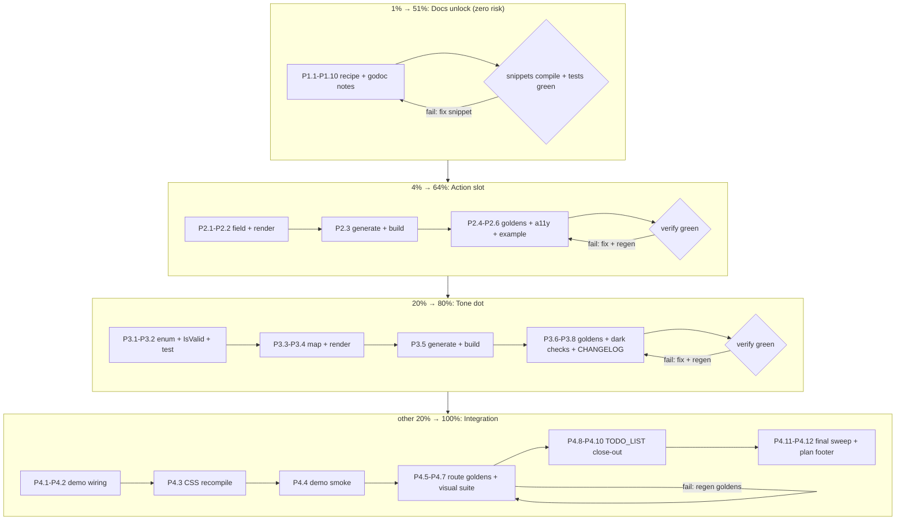

# SUPERB Plan: Kanban Vibe-Lessons Adoption — Pareto Execution Plan

**Date:** 2026-09-16 14:08
**Mission:** Adopt the vetted lessons from `docs/research/vibe-kanban-analysis.md` into
`display.KanbanBoard` — two small feature gaps (`KanbanColumn.Action`, `KanbanColumn.Tone`)
plus two documentation unlocks — WITHOUT importing a single rejected pattern (reject list in
§6). This plan also **closes TODO_LIST #191** (KanbanBoard feature-scope owner decision)
with external evidence instead of speculation.

## Context (why this plan exists)

- **2026-09-16 research session** compared our `KanbanBoard` (`display/kanban.templ`,
  `display/kanban.go`, e2e in `visualtest/kanban_e2e_test.go`) against
  `BloopAI/vibe-kanban`'s kanban implementation, read at source level. Full analysis:
  `docs/research/vibe-kanban-analysis.md` (273 lines, committed `eb677b99`).
- The research found **2 real feature gaps** (per-column add-card affordance, column
  status-color dot), **1 high-value recipe** (card anatomy via the existing `Content`
  slot — vibe-kanban's best deliverable), **1 contract documentation need** (sorted views
  ↔ reorder semantics), and a **9-item reject list** (client state as truth, integer
  `sort_order` rewrites, SPA dnd stack, Vim chords, `onMouseUp` hack, multi-select modal
  state, invisible affordances, last-write-wins docs, scope creep).
- **TODO_LIST #191** has asked since 2026-09-09 which KanbanBoard feature-scope props
  belong IN the component ("per-column add-card wiring, WIP limits, card/column tone
  accents"). The research answers it with external evidence:
  - **per-column add-card → IN** (vibe-kanban ships it in every column header; ours has only `EmptyColumnText`)
  - **column tone accents → IN** (vibe-kanban's colored status dot; maps 1:1 onto our `StatTone` precedent in `display/card.templ:245`)
  - **WIP limits → OUT** (vibe-kanban mentions them only as process advice in prose docs, not a feature; zero external implementation evidence)
  - **within-column keyboard reorder → stays deferred** (vibe-kanban _blocks_ within-column reorder outside manual sort — no evidence it's wanted; our prev/next-column buttons remain the keyboard story)
- **Precedents to copy, not invent:** `StatTone` enum + `StatToneIsValid` + map lookup
  (`display/card.templ:245-276`), the full per-component test ladder
  (golden/a11y/example/edge), `[Unreleased]` warm CHANGELOG rule.
- **Facts that shape effort:** website has NO kanban docs page (verified — nothing under
  `website/content/docs/` mentions it → no site update needed); no new component is added
  (both are props on existing structs → `TestDocsCountDrift` component counts unchanged,
  no `internal/contract` registration needed — `KanbanColumn` is a data struct, not a
  Props type); demo route goldens WILL change when demo markup changes → regeneration task
  included; demo CSS must be recompiled if new Tailwind classes enter `.templ` sources.
- **Threat model:** this component is proven by dual-transport e2e. Every change must keep
  `visualtest/kanban_e2e_test.go` green, keep the move exchange untouched, and add zero
  JS. The two additions are pure server-rendered markup.

## Pareto Breakdown

### The 1% that delivers 51% — DOCS UNLOCK (zero API change)

**`docs/recipes/kanban-card-anatomy.md`** + the sorted-views contract notes.

- Why 51%: vibe-kanban's single best deliverable is its card content design (display ID,
  priority, truncated tags `2+N`, assignee avatars, one-line description preview). ALL of
  it already composes through our existing `KanbanCard.Content` slot — the value is
  unlocked by writing it down, not by writing code. The sorted-views note prevents the #1
  predictable consumer misuse (accepting same-column moves on a server-sorted board,
  where they're meaningless).
- Cost: ~2h of writing + snippet verification. Risk: zero (docs only).

### The 4% that delivers 64% — `KanbanColumn.Action` slot

- Why next: the only real _functional_ gap. A per-column add-card affordance is standard
  kanban UX (vibe-kanban ships `+` in every header; Linear/Trello/GitHub Projects all do).
  Server-rendered `templ.Component` slot in the column header → works under both
  transports with zero JS, composes with `display.Button`, forms, links.
- Cost: ~100min full treatment (field, render, generate, goldens, a11y, example, CHANGELOG).

### The 20% that delivers 80% — `KanbanColumn.Tone` status dot

- Why third: column color semantics (todo=blue, done=green…) is vibe-kanban's header
  pattern and maps exactly onto our `StatTone` enum precedent — copy the shape, don't
  design a new one. Visual value high, functional value medium.
- Cost: ~90min full treatment (enum + IsValid + test, dark-paired class map, render, goldens).

### The other 20% to reach 100% — integration, hygiene, proof

- Demo wiring (both kanban demo boards show `Action` + `Tone` — the demo is the shop window)
- Demo CSS recompile if new utility classes appear + route-golden regeneration (light/dark)
- TODO_LIST close-out (#191 decision recorded, #190 evidence note, new open IDs #218-220)
- FEATURES.md + CHANGELOG `[Unreleased]` entries (the always-warm rule)
- Full `nix run .#verify` + visual suite green (CI parity)
- Website check was ALREADY DONE (no kanban page → no-op, recorded here as evidence)

## Step 3 — Comprehensive Plan (medium granularity, 30–100min tasks)

Sorted by importance / impact / effort / customer-value (docs-first = highest value-per-risk).

| #      | Task                                                                                                                                                                                                                                                                               | Tier    | Est        | Impact   | Effort | Customer value                                                  | Definition of Done                                                                                                   |
| ------ | ---------------------------------------------------------------------------------------------------------------------------------------------------------------------------------------------------------------------------------------------------------------------------------- | ------- | ---------- | -------- | ------ | --------------------------------------------------------------- | -------------------------------------------------------------------------------------------------------------------- |
| ~~M1~~ | ~~Write `docs/recipes/kanban-card-anatomy.md` (anatomy, tag-overflow `2+N`, avatar row, description-preview snippet, sorted-views section) + verify snippets compile~~ done — Executed 2026-09-16 same-day (all 40 fine tasks done, footer record); Action/Tone shipped in v1.18.0 | ~~1%~~  | ~~90min~~  | ~~High~~ | ~~S~~  | ~~High — unlocks vibe's proven card UX with zero API change~~   | ~~Recipe file merged; every Go snippet compiles (example test or demo build); cross-linked from `KanbanCard` godoc~~ |
| ~~M2~~ | ~~Sorted-views contract notes: `KanbanBoardProps.Wire` godoc + `ParseKanbanMove` godoc (server-side rejection guidance for sorted views)~~ done — Executed 2026-09-16 same-day (all 40 fine tasks done, footer record); Action/Tone shipped in v1.18.0                             | ~~1%~~  | ~~30min~~  | ~~High~~ | ~~S~~  | ~~High — prevents the #1 predictable consumer bug~~             | ~~Godoc on both symbols; wording matches recipe section~~                                                            |
| ~~M3~~ | ~~Implement `KanbanColumn.Action templ.Component` — per-column add-card slot, full test ladder~~ done — Executed 2026-09-16 same-day (all 40 fine tasks done, footer record); Action/Tone shipped in v1.18.0                                                                       | ~~4%~~  | ~~100min~~ | ~~High~~ | ~~M~~  | ~~High — closes the only real functional gap~~                  | ~~Field + render + goldens + a11y assertions + example test + CHANGELOG entry; `nix run .#verify` green~~            |
| ~~M4~~ | ~~Implement `KanbanColumn.Tone` status dot — `KanbanTone` enum mirroring `StatTone`, map + dark pairs, full test ladder~~ done — Executed 2026-09-16 same-day (all 40 fine tasks done, footer record); Action/Tone shipped in v1.18.0                                              | ~~20%~~ | ~~90min~~  | ~~Med~~  | ~~M~~  | ~~Med — instant column semantics, themable via existing model~~ | ~~Enum + `IsValid` + test; dot renders before title; dark-mode compliance green; goldens; CHANGELOG~~                |
| ~~M5~~ | ~~Demo wiring: `Action` + `Tone` on both kanban demo boards; recompile demo CSS if needed~~ done — Executed 2026-09-16 same-day (all 40 fine tasks done, footer record); Action/Tone shipped in v1.18.0                                                                            | ~~80%~~ | ~~45min~~  | ~~Med~~  | ~~S~~  | ~~Med — demo is the adoption shop window~~                      | ~~Demo renders both features under both transports; CSS freshness guard green~~                                      |
| ~~M6~~ | ~~Regenerate visual route goldens (light+dark) after demo markup change; review PNG diffs~~ done — Executed 2026-09-16 same-day (all 40 fine tasks done, footer record); Action/Tone shipped in v1.18.0                                                                            | ~~80%~~ | ~~30min~~  | ~~Med~~  | ~~S~~  | ~~Med — CI stays green, visual history honest~~                 | ~~`nix run .#visual` green on first run after `-update`; diffs eyeballed~~                                           |
| ~~M7~~ | ~~Hygiene: TODO_LIST #191 close-out + #190 evidence note + new IDs; FEATURES.md Kanban entry; CHANGELOG `[Unreleased]` warm~~ done — Executed 2026-09-16 same-day (all 40 fine tasks done, footer record); Action/Tone shipped in v1.18.0                                          | ~~80%~~ | ~~30min~~  | ~~Med~~  | ~~S~~  | ~~Med — living docs stay truthful~~                             | ~~TODO_LIST updated (decision recorded, next-free-ID bumped); FEATURES + CHANGELOG mention both props~~              |
| ~~M8~~ | ~~Full verification sweep: `nix run .#verify` + per-module loop + visual suite~~ done — Executed 2026-09-16 same-day (all 40 fine tasks done, footer record); Action/Tone shipped in v1.18.0                                                                                       | ~~80%~~ | ~~30min~~  | ~~High~~ | ~~S~~  | ~~High — proof nothing regressed~~                              | ~~All green in one sitting; results noted in plan footer~~                                                           |

**Total: ~7h05m.** Website docs check: already performed (no kanban page exists — no-op).

## Step 4 — Detailed Breakdown (fine granularity, ≤12min tasks)

IDs `P<phase>.<n>` map to M-tasks above. Sorted by importance/impact/effort/customer-value
within each phase; phases strictly ordered by Pareto tier.

### Phase 1 — 1% → 51%: Recipe + contract docs (M1+M2, ~120min)

| ID        | Task                                                                                                                                                                                                                                    | Est       | Gate                                     |
| --------- | --------------------------------------------------------------------------------------------------------------------------------------------------------------------------------------------------------------------------------------- | --------- | ---------------------------------------- |
| ~~P1.1~~  | ~~Read `docs/recipes/horizontal-filter-bar.md` + one more recipe for tone/structure conventions~~ done — Executed 2026-09-16 same-day per the footer execution record; follow-on hardening shipped 2026-09-17                           | ~~5min~~  | ~~—~~                                    |
| ~~P1.2~~  | ~~Draft recipe skeleton: intro, when-to-use, section list~~ done — Executed 2026-09-16 same-day per the footer execution record; follow-on hardening shipped 2026-09-17                                                                 | ~~10min~~ | ~~skeleton reads like existing recipes~~ |
| ~~P1.3~~  | ~~Write card-anatomy section: ID `Badge` + title + priority `StatusBadge` example~~ done — Executed 2026-09-16 same-day per the footer execution record; follow-on hardening shipped 2026-09-17                                         | ~~12min~~ | ~~snippet compiles~~                     |
| ~~P1.4~~  | ~~Write tag-overflow section: render 2 `Badge`s + `N+` remainder (CountBadge convention)~~ done — Executed 2026-09-16 same-day per the footer execution record; follow-on hardening shipped 2026-09-17                                  | ~~12min~~ | ~~snippet compiles~~                     |
| ~~P1.5~~  | ~~Write assignee section: `Avatar` row via `Content` slot~~ done — Executed 2026-09-16 same-day per the footer execution record; follow-on hardening shipped 2026-09-17                                                                 | ~~10min~~ | ~~snippet compiles~~                     |
| ~~P1.6~~  | ~~Write description-preview section: markdown→one-line Go helper snippet (vibe-kanban's placeholder-label trick, adapted)~~ done — Executed 2026-09-16 same-day per the footer execution record; follow-on hardening shipped 2026-09-17 | ~~12min~~ | ~~snippet compiles~~                     |
| ~~P1.7~~  | ~~Write sorted-views section: when moves are meaningful; server-side rejection pattern in the move handler~~ done — Executed 2026-09-16 same-day per the footer execution record; follow-on hardening shipped 2026-09-17                | ~~12min~~ | ~~—~~                                    |
| ~~P1.8~~  | ~~Add compiling proof: fold snippets into an `example` test or extend `kanban` example test~~ done — Executed 2026-09-16 same-day per the footer execution record; follow-on hardening shipped 2026-09-17                               | ~~12min~~ | ~~`go test ./display/...` green~~        |
| ~~P1.9~~  | ~~Cross-link: `KanbanCard.Content` + `KanbanBoardProps.Wire` godoc → recipe; recipe → research doc~~ done — Executed 2026-09-16 same-day per the footer execution record; follow-on hardening shipped 2026-09-17                        | ~~8min~~  | ~~godoc mentions recipe path~~           |
| ~~P1.10~~ | ~~`ParseKanbanMove` godoc: add the sorted-view rejection guidance sentence~~ done — Executed 2026-09-16 same-day per the footer execution record; follow-on hardening shipped 2026-09-17                                                | ~~10min~~ | ~~—~~                                    |

### Phase 2 — 4% → 64%: `KanbanColumn.Action` (M3, ~100min)

| ID       | Task                                                                                                                                                                                                            | Est       | Gate                                                                            |
| -------- | --------------------------------------------------------------------------------------------------------------------------------------------------------------------------------------------------------------- | --------- | ------------------------------------------------------------------------------- |
| ~~P2.1~~ | ~~Add `Action templ.Component` field + godoc to `KanbanColumn` in `kanban.templ`~~ done — Executed 2026-09-16 same-day per the footer execution record; follow-on hardening shipped 2026-09-17                  | ~~10min~~ | ~~godoc explains slot semantics (rendered in header, consumer owns transport)~~ |
| ~~P2.2~~ | ~~Render `col.Action` in the column header row, after the count badge (`flex` row already exists)~~ done — Executed 2026-09-16 same-day per the footer execution record; follow-on hardening shipped 2026-09-17 | ~~12min~~ | ~~read-only boards render it too; nil-safe~~                                    |
| ~~P2.3~~ | ~~`templ generate` (pinned dev shell!) + `go build ./display/...`~~ done — Executed 2026-09-16 same-day per the footer execution record; follow-on hardening shipped 2026-09-17                                 | ~~8min~~  | ~~zero unrelated diff (templ pin v0.3.1020)~~                                   |
| ~~P2.4~~ | ~~Golden sweep: add `Action` variant to `golden_sweep_test.go`; `-update`; eyeball diff~~ done — Executed 2026-09-16 same-day per the footer execution record; follow-on hardening shipped 2026-09-17           | ~~12min~~ | ~~goldens show slot in header~~                                                 |
| ~~P2.5~~ | ~~A11y test: slot content lands inside the header `div`, no aria breakage, focus order sane~~ done — Executed 2026-09-16 same-day per the footer execution record; follow-on hardening shipped 2026-09-17       | ~~12min~~ | ~~a11y test added + green~~                                                     |
| ~~P2.6~~ | ~~Example test: godoc `ExampleKanbanBoard` variant with an Action button~~ done — Executed 2026-09-16 same-day per the footer execution record; follow-on hardening shipped 2026-09-17                          | ~~10min~~ | ~~green~~                                                                       |
| ~~P2.7~~ | ~~CHANGELOG `[Unreleased]` **Added** entry + FEATURES.md Kanban line~~ done — Executed 2026-09-16 same-day per the footer execution record; follow-on hardening shipped 2026-09-17                              | ~~10min~~ | ~~warm-rule satisfied~~                                                         |
| ~~P2.8~~ | ~~`nix run .#verify`~~ done — Executed 2026-09-16 same-day per the footer execution record; follow-on hardening shipped 2026-09-17                                                                              | ~~12min~~ | ~~green~~                                                                       |

### Phase 3 — 20% → 80%: `KanbanColumn.Tone` (M4, ~90min)

| ID       | Task                                                                                                                                                                                                                                                | Est       | Gate                                      |
| -------- | --------------------------------------------------------------------------------------------------------------------------------------------------------------------------------------------------------------------------------------------------- | --------- | ----------------------------------------- |
| ~~P3.1~~ | ~~Define `KanbanTone` enum mirroring `StatTone` (`card.templ:245`): gray default + blue/green/yellow/red/purple, consts `KanbanTone*`~~ done — Executed 2026-09-16 same-day per the footer execution record; follow-on hardening shipped 2026-09-17 | ~~12min~~ | ~~zero value = toneless (no dot)~~        |
| ~~P3.2~~ | ~~Add `KanbanToneIsValid` + test in the package enum test file (same commit!)~~ done — Executed 2026-09-16 same-day per the footer execution record; follow-on hardening shipped 2026-09-17                                                         | ~~10min~~ | ~~IsValid-rule satisfied~~                |
| ~~P3.3~~ | ~~`kanbanToneLookup: map[KanbanTone]string` with complete literal classes incl. `dark:` pairs; render via `utils.Lookup`~~ done — Executed 2026-09-16 same-day per the footer execution record; follow-on hardening shipped 2026-09-17              | ~~12min~~ | ~~dark-mode compliance pattern followed~~ |
| ~~P3.4~~ | ~~Render dot (`h-2 w-2 rounded-full`) before column title when tone set; `aria-hidden` decorative~~ done — Executed 2026-09-16 same-day per the footer execution record; follow-on hardening shipped 2026-09-17                                     | ~~10min~~ | ~~goldens reflect dot~~                   |
| ~~P3.5~~ | ~~`templ generate` + `go build`~~ done — Executed 2026-09-16 same-day per the footer execution record; follow-on hardening shipped 2026-09-17                                                                                                       | ~~8min~~  | ~~zero unrelated diff~~                   |
| ~~P3.6~~ | ~~Golden sweep variants per tone; `-update`; eyeball~~ done — Executed 2026-09-16 same-day per the footer execution record; follow-on hardening shipped 2026-09-17                                                                                  | ~~12min~~ | ~~—~~                                     |
| ~~P3.7~~ | ~~Run `TestDarkModeCompliance` + `TestDarkModeSemanticColors` + full display tests~~ done — Executed 2026-09-16 same-day per the footer execution record; follow-on hardening shipped 2026-09-17                                                    | ~~5min~~  | ~~green~~                                 |
| ~~P3.8~~ | ~~CHANGELOG + FEATURES entries~~ done — Executed 2026-09-16 same-day per the footer execution record; follow-on hardening shipped 2026-09-17                                                                                                        | ~~8min~~  | ~~—~~                                     |
| ~~P3.9~~ | ~~`nix run .#verify`~~ done — Executed 2026-09-16 same-day per the footer execution record; follow-on hardening shipped 2026-09-17                                                                                                                  | ~~12min~~ | ~~green~~                                 |

### Phase 4 — other 20% → 100%: Demo, goldens, hygiene, sweep (M5–M8, ~135min)

| ID        | Task                                                                                                                                                                                                                                                            | Est       | Gate                              |
| --------- | --------------------------------------------------------------------------------------------------------------------------------------------------------------------------------------------------------------------------------------------------------------- | --------- | --------------------------------- |
| ~~P4.1~~  | ~~Demo: wire an `Action` add-button into demo board columns (`examples/demo/kanban_demo.templ`)~~ done — Executed 2026-09-16 same-day per the footer execution record; follow-on hardening shipped 2026-09-17                                                   | ~~12min~~ | ~~renders under both transports~~ |
| ~~P4.2~~  | ~~Demo: set `Tone` per demo column (todo=blue, doing=yellow, done=green)~~ done — Executed 2026-09-16 same-day per the footer execution record; follow-on hardening shipped 2026-09-17                                                                          | ~~10min~~ | ~~—~~                             |
| ~~P4.3~~  | ~~Recompile demo CSS (`nix run .#css` path per CSS freshness guard) if new classes entered `.templ` sources~~ done — Executed 2026-09-16 same-day per the footer execution record; follow-on hardening shipped 2026-09-17                                       | ~~12min~~ | ~~`TestCSSFreshness` green~~      |
| ~~P4.4~~  | ~~Rebuild + restart demo binary; smoke `/kanban-board` manually~~ done — Executed 2026-09-16 same-day per the footer execution record; follow-on hardening shipped 2026-09-17                                                                                   | ~~10min~~ | ~~both features visible~~         |
| ~~P4.5~~  | ~~Regenerate route goldens light+dark (`visual` suite `-update`)~~ done — Executed 2026-09-16 same-day per the footer execution record; follow-on hardening shipped 2026-09-17                                                                                  | ~~12min~~ | ~~—~~                             |
| ~~P4.6~~  | ~~Eyeball PNG diffs; commit updated goldens~~ done — Executed 2026-09-16 same-day per the footer execution record; follow-on hardening shipped 2026-09-17                                                                                                       | ~~12min~~ | ~~no unexplained pixel shifts~~   |
| ~~P4.7~~  | ~~Full visual suite green run (no `-update`)~~ done — Executed 2026-09-16 same-day per the footer execution record; follow-on hardening shipped 2026-09-17                                                                                                      | ~~6min~~  | ~~green~~                         |
| ~~P4.8~~  | ~~TODO_LIST: record #191 decision (add-card IN, tone IN, WIP OUT, reorder stays deferred) pointing at plan + research doc~~ done — Executed 2026-09-16 same-day per the footer execution record; follow-on hardening shipped 2026-09-17                         | ~~8min~~  | ~~row updated~~                   |
| ~~P4.9~~  | ~~TODO_LIST: #190 add drag-handle evidence note (research §4.5: only if whole-card click actions ever land)~~ done — Executed 2026-09-16 same-day per the footer execution record; follow-on hardening shipped 2026-09-17                                       | ~~5min~~  | ~~row updated~~                   |
| ~~P4.10~~ | ~~TODO_LIST: add open IDs #218 (Action), #219 (Tone), #220 (recipe) — marked with this plan; bump next-free-ID to 221~~ done — Executed 2026-09-16 same-day per the footer execution record; follow-on hardening shipped 2026-09-17                             | ~~10min~~ | ~~—~~                             |
| ~~P4.11~~ | ~~Final sweep: per-module test loop (`for mod in utils icons errorpage charts/echarts datastar htmx; …`) + `nix run .#verify` + `nix flake check`~~ done — Executed 2026-09-16 same-day per the footer execution record; follow-on hardening shipped 2026-09-17 | ~~12min~~ | ~~all green~~                     |
| ~~P4.12~~ | ~~Update this plan's footer with actual results/timestamps~~ done — Executed 2026-09-16 same-day per the footer execution record; follow-on hardening shipped 2026-09-17                                                                                        | ~~6min~~  | ~~—~~                             |

**Total: ~7h05min across 40 fine tasks.** No task exceeds 12min.

## Execution Graph (mermaid)

## Guardrails — the DO-NOT list (VERSCHLIMMBESSER protection)

From `docs/research/vibe-kanban-analysis.md` §5 — violating any of these while executing
this plan is a defect, not a contribution:

1. **No client-side board state.** No optimistic moves, no sort_order math, no bulk
   rewrites. The move exchange stays exactly: fill hidden form → `requestSubmit()` →
   server re-renders.
2. **No new dependencies.** No dnd library, no store, no JS beyond the existing singleton.
   Both new features are pure server-rendered markup.
3. **No new JS.** `Action` and `Tone` render statically. The script byte-count of
   `kanbanJS()` must not grow.
4. **No keyboard chords / single-letter shortcuts.** Keyboard operability stays the
   existing per-card APG-style buttons.
5. **No multi-select, no WIP limits, no filtering inside the component.** Those are
   consumer compositions (checkboxes + forms) or rejected scope (TODO #191 decision).
6. **Don't touch the e2e contract.** `visualtest/kanban_e2e_test.go` must stay green
   without weakening assertions.
7. **Copy precedents, don't invent:** `StatTone` shape for `KanbanTone`, existing recipe
   format for the recipe, existing golden-sweep pattern for tests.
8. **templ pin:** generate ONLY inside `nix develop` / `nix run .#build` (v0.3.1020) — a
   system-binary regen would cosmetic-diff 51 files.
9. **Warm CHANGELOG:** every code task lands its `[Unreleased]` entry in the same commit —
   the CI guard enforces it for component-code PRs.
10. **Drag-handle work stays OUT** until whole-card click actions exist (TODO #190 note).

## Verification summary (all gates)

- `go test ./display/...` after every phase
- `nix run .#verify` after M3, M4, and M8 (generate + build + test + lint)
- `TestDarkModeCompliance` + `TestDarkModeSemanticColors` after Tone
- `TestCSSFreshness` after demo wiring
- `nix run .#visual` (and `-update` once, for route goldens) after demo changes
- Per-module loop `for mod in utils icons errorpage charts/echarts datastar htmx` at the end
- `nix flake check` at the end

## Footer — execution results

**Executed 2026-09-16 (same day, one session). All 40 fine tasks done; all gates green.**

- **Phase 1 (recipe + contract docs):** `docs/recipes/kanban-card-anatomy.md` shipped
  (identity badges, 2+N tag overflow, avatar stack, markdown-to-one-line preview,
  sorted-views contract, hidden-columns note). Compiling proof folded into
  `ExampleKanbanBoard_cardAnatomy` (Go-side composition incl. `oneLinePreview` helper).
  Godoc added to `KanbanCard.Content`, `KanbanBoardProps.Wire`, and `ParseKanbanMove`
  (sorted-views guidance: the index is advisory; reject same-column moves on
  server-sorted views).
- **Phase 2 (`KanbanColumn.Action`):** slot rendered in the column header after the
  count badge (count extracted to `kanbanColumnCount` sub-template; the grouping div
  renders ONLY when Action is set, so boards without it stay byte-identical — proven by
  the existing goldens passing unchanged). Tests: golden `kanban_column_action`,
  header-ordering a11y test, `ExampleKanbanBoard_columnAction`.
- **Phase 3 (`KanbanColumn.Tone`):** `KanbanTone` enum + `KanbanToneIsValid` + test
  (zero value intentionally toneless), `kanbanToneLookup` with `dark:`-paired classes
  rendered via `utils.Lookup` (unknown → no dot), `aria-hidden` dot before the title.
  Golden `kanban_column_tone`, rendering test, `TestDarkModeCompliance`/`SemanticColors`
  green without exemptions.
- **Phase 4 (integration):** demo wires a WORKING add-card flow — `POST
  <move URL>/add/<column>` per transport, ghost `+ Add` Button per column, tones
  (backlog=gray, progress=blue, review=yellow, done=green). Live smoke (HTTP):
  correct dialect per transport (`hx-post` htmx / `data-on:click="@post(…)"` Datastar),
  state mutates, board re-renders with the new card, count badge updates. Demo CSS
  recompiled (`nix run .#css`); CSS guards green. Visual suite + e2e + axe sweep green —
  note: NO route/component pixel goldens cover the kanban section (it sits below the
  fold on `/`; nothing needed `-update`). TODO_LIST #218/#219/#220 struck through DONE.
- **One deviation found during verification:** `wire.Action.Attributes()` defaults an
  unspecified Method to GET — the demo's add button initially rendered `hx-get`. Fixed
  by setting `Method: wire.MethodPost` explicitly in the demo builder (an add is a
  mutation). Library code untouched; `kanbanWireAttributes` already forces POST for the
  move form.
- **Final sweep:** per-module loop (utils, icons, errorpage, charts/echarts, datastar,
  htmx + visualtest + website) green; `nix run .#verify` all checks passed;
  `nix run .#visual` ok; `nix flake check` passed. Docs-count drift claims bumped:
  goldens 246→248, IsValid 59→60, enums 60→61.
